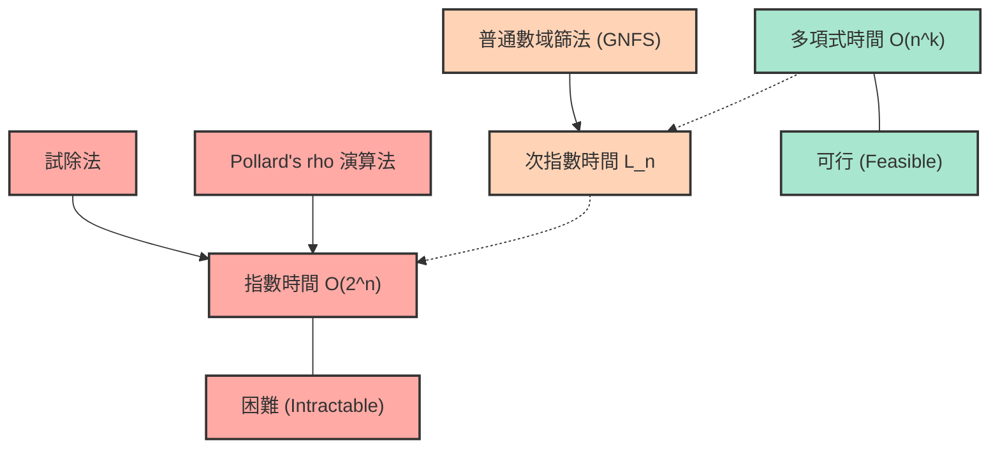
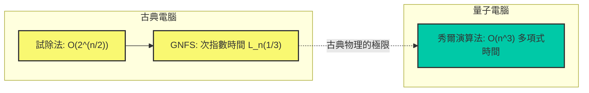

# 前言：為何質因數分解如此「困難」？

在現代的網際網路社會中，我們能夠安心地享受線上購物或傳輸機密資訊，都是因為有「密碼學」的存在。而支撐著這些加密技術（特別是廣泛使用的 RSA 加密等）安全性的核心，正是基於「對極大整數進行質因數分解非常困難」這個數學事實。

乍看之下，質因數分解似乎只是「把數字分解成質數相乘」的簡單作業，但當位數變得極大時，這就變成了一個即使讓世界上最快的超級電腦運作幾十年、甚至幾百年也解不開的超級難題。我們平時在學校學到的質因數分解，充其量只是用 $2$、$3$、$5$ 去除的簡單作業，但當面對高達數百位數的未知質數相乘的結果時，這種簡單的方法將徹底失效。

這篇文章將從資訊科學、計算機科學的基礎「時間複雜度（Big O 標記：$\mathcal{O}$ 標記）」的概念出發，詳細且具有數學嚴謹性地解說各種用於解開質因數分解的演算法（試除法、Pollard's $\rho$ 演算法、普通數域篩法等）究竟需要花費多少計算時間。接著，我們將徹底剖析為何在古典電腦上對巨大數字進行質因數分解幾乎是不可能的，而這又是如何保護我們的資訊與隱私，甚至量子電腦又將如何顛覆這個前提。

---

# 時間複雜度與 Big O ($\mathcal{O}$) 標記的嚴格定義

在評估演算法的效能或效率時，單純測量「程式的執行時間（秒數）」是不夠的。因為執行時間在很大程度上取決於所使用的電腦效能（CPU 時脈速度、記憶體速度等）、程式語言以及編譯器的最佳化程度。

因此，作為不依賴硬體或環境的普遍評估指標，我們使用的是 **時間複雜度（Time Complexity）**，而用來表現它的記法就是 **Big O 標記（Big-O Notation）**。Big O 標記是一種數學記號，用來表示當輸入資料的大小 $N$ 變得非常大時，演算法的執行時間（或執行步驟數）相對於 $N$ 會如何增加（漸近增長率）。

## 漸近記法的數學定義

在計算機科學中，對於函數 $f(n)$ 與 $g(n)$，$f(n) = \mathcal{O}(g(n))$ 的數學定義如下：

$$ \exists c > 0, \exists n_0 > 0 \text{ s.t. } \forall n \ge n_0, 0 \le f(n) \le c \cdot g(n) $$

這意味著：「當輸入大小 $n$ 足夠大（$n \ge n_0$）時，函數 $f(n)$ 的增長會被某個常數倍的 $g(n)$ 從上方限制住」。換句話說，它表示了演算法的處理時間即使在最壞情況下，也會被控制在 $g(n)$ 的常數倍以內，即所謂的「上界（Upper Bound）」。

同樣地，表示下界的記法有 $\Omega$（Big Omega），而上界與下界一致時的記法有 $\Theta$（Big Theta）。不過一般在討論演算法的最壞時間複雜度時，最常使用的是 $\mathcal{O}$ 標記。

## 代表性的時間複雜度等級

時間複雜度有幾個代表性的等級。讓我們從執行時間最短（效率最高）的開始看起：

1. **$\mathcal{O}(1)$ : 常數時間（Constant time）**
   無論輸入大小 $N$ 變得多大，執行時間都不會改變的演算法。例如，透過指定陣列索引來取得值的操作，或是雜湊表中的搜尋（理想情況下）等。

2. **$\mathcal{O}(\log N)$ : 對數時間（Logarithmic time）**
   即使輸入大小加倍，執行時間也只增加常數，是非常高效率的演算法。從已排序的陣列中尋找目標值的「二分搜尋（Binary Search）」是其代表例子。即使資料量高達 10 億，也只需要大約 30 次比較就能找到目標資料。

3. **$\mathcal{O}(N)$ : 線性時間（Linear time）**
   執行時間與輸入大小成正比增加。資料變成 10 倍，時間也會變成 10 倍。依序檢查陣列所有元素的「線性搜尋」等皆屬此類。

4. **$\mathcal{O}(N \log N)$ : 準線性時間（Linearithmic time）**
   比 $\mathcal{O}(N)$ 稍慢一點，但仍屬於高效率的範圍。合併排序（Merge Sort）和快速排序（Quick Sort 的平均複雜度）等許多實用的高速排序演算法都具有這個時間複雜度。

5. **$\mathcal{O}(N^2)$ : 多項式時間 / 平方時間（Quadratic time）**
   當輸入大小變為 2 倍時，執行時間會變為 4 倍；變為 10 倍時，時間變為 100 倍。使用雙重迴圈的簡單處理、氣泡排序、插入排序等皆屬此類。當資料量超過幾萬時，處理就會花費相當長的時間。這些以 $\mathcal{O}(N^k)$ 形式表示的複雜度統稱為 **多項式時間（Polynomial time）**。

6. **$\mathcal{O}(2^N)$ : 指數時間（Exponential time）**
   輸入大小只要增加 1，執行時間就會加倍。效率極差，當 $N$ 達到 40 或 50 時，即使是最頂尖的電腦也無法在現實時間內完成計算。背包問題的窮舉搜尋、旅行推銷員問題的簡單解法等皆屬此類。

7. **$\mathcal{O}(N!)$ : 階乘時間（Factorial time）**
   比 $\mathcal{O}(2^N)$ 增長得更為迅速。例如嘗試旅行推銷員問題中所有排列組合的演算法。

以下的 Mermaid 示意圖粗略地比較了各種時間複雜度的執行時間（步驟數）相對於 $N$ 增加時的增長率：

相信您現在已經了解時間複雜度的差異在選擇演算法時有多麼重要了。在密碼學技術中，正是刻意利用這種需要「指數時間」或「接近指數時間」的問題（也就是無法輕易解開的問題）來確保安全性。

---

# RSA 加密的機制與質因數分解問題

為了理解為何質因數分解如此重要，讓我們先簡單回顧一下 RSA 加密的機制。RSA 加密是 1977 年由羅納德·李維斯特（Ronald Rivest）、阿迪·薩莫爾（Adi Shamir）和倫納德·阿德曼（Leonard Adleman）三人所開發的公開金鑰加密系統。

### 金鑰生成的步驟
1. 隨機選擇兩個極大的質數 $p$ 與 $q$。（例如長度各為 1024 位元）
2. 將它們相乘計算出 $N = p \times q$。這個 $N$ 將作為公鑰的一部分向全世界公開。（長度會是 2048 位元）
3. 計算尤拉商數函數 $\phi(N) = (p-1)(q-1)$。
4. 選擇與 $\phi(N)$ 互質的整數 $e$，這也作為公鑰。
5. 計算出滿足 $e \times d \equiv 1 \pmod{\phi(N)}$ 的 $d$（私鑰）。

這裡極為重要的一點是：**「為了破解密碼，必須要有私鑰 $d$；而要計算出 $d$，就必須知道 $\phi(N)$；而要計算出 $\phi(N)$，就必須將 $N$ 質因數分解成 $p$ 與 $q$」**。

巨大質數的乘法 $p \times q$ 一瞬間就能完成，但要從結果 $N$ 中找出原本的 $p$ 與 $q$（即質因數分解）卻是絕望般地困難。這種「單向函數（One-way function）」的特性，正是 RSA 加密的心臟地帶。

這裡有一個需要注意且非常重要的觀念。在質因數分解問題中，「輸入大小 $n$」並不是數值 $N$ 本身的大小，而是「用來表示數值 $N$ 所需的位元數」。
若將整數 $N$ 以二進制表示時的位數設為 $n$，則 $n \approx \log_2 N$。也就是說，演算法的時間複雜度不應相對於 $N$，而是必須相對於 $n = \log_2 N$（或者 $\ln N$）來進行評估。

---

# 質因數分解演算法的歷史與時間複雜度

接下來，我們將針對如何將給定的合成數 $N$ 分解為質數乘積的各種演算法，詳細解說它們的機制與時間複雜度。這同時也是人類如何挑戰質因數分解極限的歷史。

## 1. 試除法（Trial Division）

最直觀且原始的演算法就是「試除法」。這是一種從 $2$ 開始，依序嘗試用質數去除非 $N$ 的方法。

### 演算法概要
利用「$N$ 的質因數最大也不會超過 $\sqrt{N}$」的特性（因為 $\sqrt{N} \times \sqrt{N} = N$，如果有更大的質因數，必然會與另一個小於等於 $\sqrt{N}$ 的質因數成對）。
因此，我們只需要確認是否能被 $2, 3, 5, 7, \dots, \lfloor\sqrt{N}\rfloor$ 之間的所有數（或質數）整除即可。

### 時間複雜度評估
在最壞的情況下（例如 $N$ 是兩個巨大質數的乘積），需要進行直到 $\sqrt{N}$ 的除法。
如前所述，輸入大小 $n$ 為 $n = \log_2 N$，因此可以表示為 $N = 2^n$。
因此，計算步驟數最大會正比於：

$$ \sqrt{N} = \sqrt{2^n} = (2^n)^{1/2} = 2^{n/2} $$

這意味著，相對於位元長度 $n$，時間複雜度為 **$\mathcal{O}(2^{n/2})$**。也就是說，試除法是相對於 $n$ 的 **「純指數時間（Exponential time）演算法」**。
位數每增加 1 位元（數值變為 2 倍），計算時間就會變為大約 $\sqrt{2} \approx 1.414$ 倍。如果 $N$ 是一個超過 1024 位元（十進位約 300 位數）的數字，就算花上等同於宇宙年齡的時間也算不完。

## 2. 費馬質因數分解法（Fermat's Factorization Method）

這是由 17 世紀數學家皮耶·德·費馬所構想的方法。當給定一個奇數的合成數 $N$ 時，試圖將 $N$ 表現為兩個平方數的差。

$$ N = x^2 - y^2 = (x - y)(x + y) $$

如果能找到這樣的 $x$ 與 $y$，那麼 $a = x - y$ 與 $b = x + y$ 就會是 $N$ 的因數。
作為演算法，是將 $x$ 從 $\lceil \sqrt{N} \rceil$ 開始依序增加，並檢查 $x^2 - N$ 是否為完全平方數（某個整數 $y$ 的平方）。
當兩個質因數 $p$ 與 $q$ 的數值非常接近時，這個方法運作得極快。然而，在一般情況下（$p$ 與 $q$ 是隨機且相距甚遠的值），最終仍會需要與試除法相當的指數時間。

## 3. Pollard's $\rho$ 演算法（Pollard's rho algorithm）

為了突破試除法的極限，1975 年由約翰·波拉德（John Pollard）發表的「Pollard's $\rho$ 演算法」是其中一個被構想出來的方法。

### 演算法概要
這個方法應用了被稱為「生日悖論（Birthday Paradox）」的機率論概念，以及偽亂數數列的週期性（其形狀類似希臘字母 $\rho$，這也是名稱的由來）。

使用某個偽亂數生成函數 $f(x) = (x^2 + 1) \pmod N$ 來產生數列，並在數列中找出滿足 $x_i \equiv x_j \pmod p$ 的兩個值（$p$ 為 $N$ 的未知質因數）。
此時，$x_i - x_j$ 會是 $p$ 的倍數，因此透過計算最大公因數 $\gcd(|x_i - x_j|, N)$，就能以高機率提取出 $p$（即 $N$ 的質因數）。結合羅伯特·弗洛伊德的循環偵測法（龜兔賽跑演算法）等，可以在將記憶體使用量控制在 $\mathcal{O}(1)$ 的同時進行高效率的計算。

### 時間複雜度評估
已知 Pollard's $\rho$ 演算法找到質因數 $p$ 所需的步驟數大約是 $\mathcal{O}(\sqrt{p})$。
在最壞的情況下（當 $N$ 是兩個大小相同的質數 $p, q$ 之積時，$p \approx \sqrt{N}$），時間複雜度為 $\mathcal{O}(N^{1/4})$。

用輸入大小 $n = \log_2 N$ 來表示：

$$ N^{1/4} = (2^n)^{1/4} = 2^{n/4} $$

因此，時間複雜度為 **$\mathcal{O}(2^{n/4})$**。
與試除法的 $\mathcal{O}(2^{n/2})$ 相比，速度有著戲劇性的提升，在實用上對於中等規模（數十位數）的質因數分解非常強大。然而，相對於位元長度 $n$，它依然未能跨越「指數時間」的障礙，對於像 RSA 加密中使用的 2048 位元（十進位約 600 位數）的巨大數字依舊無能為力。

## 4. 多項式二次篩法（MPQS: Multiple Polynomial Quadratic Sieve）

進入 1980 年代，卡爾·波梅蘭斯（Carl Pomerance）構想出了「二次篩法（Quadratic Sieve: QS）」。這是費馬「平方差」概念的延伸。
在費馬法中是直接尋找 $x^2 - y^2 = N$，而二次篩法則是尋找更寬鬆的條件。

$$ x^2 \equiv y^2 \pmod N $$
且
$$ x \not\equiv \pm y \pmod N $$

如果能找到這樣的 $x, y$ 配對，那麼 $x^2 - y^2 = (x - y)(x + y)$ 就會是 $N$ 的倍數。因此，只要計算 $\gcd(x - y, N)$ 或 $\gcd(x + y, N)$，就能得到 $N$ 的非平凡質因數。

在二次篩法中，會大量找出使得 $x^2 \pmod N$ 成為「只由小質數作為質因數的數（這被稱為 $B$-平滑數）」的 $x$，並將這些質因數分解的結果排成矩陣的形式（二元體 $\mathbb{F}_2$ 上的聯立一次方程式）。接著，使用高斯消去法等將多個關係式相乘，調整右邊使其完全成為平方數（各個質因數的指數皆為偶數），藉此構造出 $x^2 \equiv y^2 \pmod N$。

在普通數域篩法出現之前，二次篩法曾是世界最快的演算法，而對於 100 位數以下的數字分解，目前它仍被認為是最快的。

## 5. 普通數域篩法（General Number Field Sieve: GNFS）深度解析

目前，在對超過 100 位數的巨大整數進行質因數分解時，被譽為「世界最快」的是 **普通數域篩法 (GNFS)**。這是在 1980 年代後半所構想出來，進一步發展了二次篩法，利用代數整數論的深奧結果（數域）所開發出的高階演算法。

在針對 RSA 加密的攻擊（從公鑰進行質因數分解）中，不斷刷新世界紀錄的始終是這個 GNFS。在 2020 年，曾有報告成功對 829 位元（250 位數）的合成數（RSA-250）進行了質因數分解，但這需要讓數千台規模的電腦長時間平行運作才能完成。

### 演算法的數學結構
GNFS 非常複雜，但大致上是按照以下步驟進行的：

1. **多項式選擇 (Polynomial Selection):**
   對於 $N$，選擇一個整數 $m$ 與係數很小且滿足 $f(m) \equiv 0 \pmod N$ 的不可約多項式 $f(X)$。藉此定義出添加了 $f(X)$ 的根 $\alpha$ 的代數數域的整數環 $\mathbb{Z}[\alpha]$。

2. **篩選 (Sieving):**
   在有理數體上的整數環 $\mathbb{Z}$ 與代數數域上的整數環 $\mathbb{Z}[\alpha]$ 這「兩個不同的世界」中，同時尋找平滑（Smooth）的數。具體來說，就是大量找出 $(a, b)$ 這樣的配對，使得 $a - bm$ 這個有理整數與 $a - b\alpha$ 這個代數整數的範數（Norm），都能在預先定好的小質數集合（因子基底: Factor Base）上被完全分解。

3. **矩陣化簡 (Matrix Reduction):**
   將找到的龐大數量的平滑配對表示為矩陣（巨大的稀疏矩陣）。在二元體 $\mathbb{F}_2$ 上使用 Lanczos 演算法（如 Block-Lanczos 法等）來求得解空間。這個矩陣規模達到數百萬行 $\times$ 數百萬列也是很常見的事。

4. **平方根計算 (Square Root):**
   從矩陣的解中，在「兩個不同的世界」裡各自製造出巨大的平方數，最終導出 $X^2 \equiv Y^2 \pmod N$ 的關係式。然後計算 $\gcd(X-Y, N)$ 來獲得質因數。

### 普通數域篩法的時間複雜度：次指數時間（Sub-exponential time）

GNFS 最大的貢獻在於，它將質因數分解的時間複雜度從「純指數時間」降到了 **「次指數時間（Sub-exponential time）」**。
GNFS 的漸近時間複雜度，使用被稱為 L-notation 的特殊記法，表示如下：

$$ L_N[\gamma, c] = \exp\left( (c + o(1)) (\ln N)^\gamma (\ln \ln N)^{1-\gamma} \right) $$

這裡，$N$ 是想要分解的數字，$\ln$ 是自然對數。
$\gamma$ 是介於 $0 \le \gamma \le 1$ 之間的值，表示演算法複雜度的「程度」。
- 當 $\gamma = 0$ 時，$L_N[0, c]$ 變為 $(\ln N)^c$，代表多項式時間 $\mathcal{O}(n^c)$。（高效率）
- 當 $\gamma = 1$ 時，$L_N[1, c]$ 變為 $e^{c \ln N} = N^c$，代表指數時間 $\mathcal{O}(2^{cn})$。（低效率）

在 GNFS 的情況下，這個參數如下所示：

$$ L_N\left[\frac{1}{3}, \left(\frac{64}{9}\right)^{1/3}\right] = e^{\left(\sqrt[3]{\frac{64}{9}} + o(1)\right) (\ln N)^{1/3} (\ln \ln N)^{2/3}} $$

在這個公式中，常數 $c = (64/9)^{1/3} \approx 1.923$。
如果用輸入大小 $n \approx \ln N$（與位元長度成正比）來改寫，複雜度的變化大致如下：

$$ \mathcal{O}\left( \exp\left( 1.923 \cdot n^{1/3} (\ln n)^{2/3} \right) \right) $$

可以看出，指數部分並不是取決於 $n$ 的 1 次方，而是取決於 $n^{1/3}$（$n$ 的立方根）。
Pollard's $\rho$ 演算法是 $\mathcal{O}(2^{n/4})$，也就是 $\mathcal{O}(\exp(c \cdot n^1))$，相較之下，GNFS 的 $n$ 次數已經降到了 $1/3$。
這意味著，雖然還沒達到多項式時間（$\gamma=0$），但時間複雜度增加的速度已經比純指數時間（$\gamma=1$）慢非常多。這就是它被稱為「次指數時間」的原因。

---

# 現代密碼的極限與量子電腦

正如我們目前為止所看到的，人類集結了數學的智慧，透過將演算法從試除法進化到 GNFS，不斷挑戰著質因數分解的障礙。然而，即使有了 GNFS，古典電腦依然無法在「多項式時間」內解開質因數分解。

## P vs NP 問題與質因數分解的定位

計算機科學中最大的未解決問題之一就是「P = NP 猜想」。
質因數分解問題屬於 NP（給出答案便能在多項式時間內驗證正確性的問題類別），但並未被證明為 NP-完全（NP 中最難的問題類別）。
此外，它是否屬於 P（能在多項式時間內解開的問題類別，也就是是否存在多項式時間的演算法），目前也是未知數。

許多研究者猜測，質因數分解屬於介於 P 與 NP-完全 之間的中間類別（NP-intermediate）。如果能發現用古典電腦在多項式時間內解開質因數分解的演算法（例如 $\mathcal{O}(n^3)$ 等），將會是導致全世界密碼系統崩潰的大事件，但直到目前為止，尚未發現這樣的演算法。如果要解密 2048 位元的 RSA 加密，即使古典電腦的效能提升遵循摩爾定律，估計也需要花費比宇宙壽命還要長的時間。

## 量子電腦這個「遊戲規則改變者」：秀爾演算法

RSA 加密在古典電腦上堅不可摧，但一旦以完全不同原理運作的「量子電腦」普及化，情況將會完全改觀。
1994 年由彼得·秀爾（Peter Shor）發表的 **「秀爾演算法（Shor's algorithm）」**，利用了量子傅立葉轉換，竟然能夠在 **多項式時間 $\mathcal{O}(n^3)$**（更嚴格地說，量子閘數量約為 $\mathcal{O}(n^2 \log n \log \log n)$）內解開質因數分解。

透過以下的 Mermaid 示意圖，我們來確認古典演算法與量子演算法在時間複雜度上的差異：

在秀爾演算法中，古典演算法中的瓶頸「尋找週期」過程，透過運用量子纏結與量子疊加的「量子傅立葉轉換（QFT）」，可以瞬間且平行地完成計算。
一旦能夠在實用規模（雜訊低且具有足夠邏輯量子位元數量）的量子電腦上執行，目前被認為安全的 2048 位元 RSA 加密，可能會在數小時到數天內被完全破解。

為了應對這項威脅，目前世界各國的密碼學家與 NIST（美國國家標準暨技術研究院）正在加速推進向即使是量子電腦也很難破解的「後量子密碼學（Post-Quantum Cryptography: PQC）」轉型的標準化作業。晶格密碼（Lattice-based cryptography）等是其中的代表，這些技術的安全性基礎建立在與質因數分解問題完全不同的數學困難度（例如最短向量問題等）之上。

---

# 總結

本文從時間複雜度（Big O 標記）的基礎開始，深入探討了質因數分解演算法的進化及其數學極限。

* **Big O ($\mathcal{O}$) 標記** 是顯示計算步驟數相對於輸入大小 $n$ 增加而增長的重要指標，而在多項式時間與指數時間之間，存在著實用上無法跨越的巨大鴻溝。
* **試除法** 與 **Pollard's $\rho$ 演算法** 屬於純粹的「指數時間」演算法，對於巨大的數字無能為力。
* 目前最快的古典演算法 **普通數域篩法 (GNFS)**，運用了高階的代數整數論達成了「次指數時間」，但仍然未達多項式時間，對於巨大數字的質因數分解仍需要天文數字般的時間。
* 正是因為這個 **「（強烈猜測）不存在能以多項式時間解開的古典演算法」** 的事實，確保了 RSA 加密的安全性，並支撐著現代的數位社會。
* 然而，隨著 **量子電腦與秀爾演算法** 的出現，理論上已能在多項式時間內進行質因數分解，密碼學技術正準備轉移到下一個時代（後量子密碼學）。

演算法時間複雜度這個抽象的概念，卻與我們日常生活的安全息息相關，這正是資訊科學與數學中最迷人且令人興奮的面向之一。今後科技的發展，特別是量子電腦的開發動向與密碼技術的演進，請務必持續關注。
