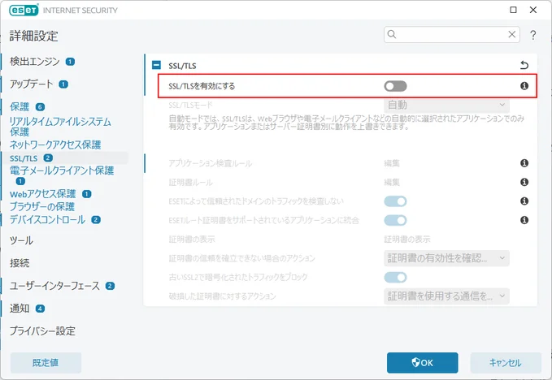

# How to fix the following error in GitHub Copilot

GitHub Copilot stopped working around April 19, 2024. The error message is as follows:

`
[ERROR] [ghostText] [2024-04-21T04:06:46.900Z] Error on ghost text request: (FetchError) unable to verify the first certificate
[ERROR] [certificates] [2024-04-21T04:06:46.901Z] Your current Copilot license doesn't support proxy connections with custom certificates. Please visit https://gh.io/copilot-network-errors to learn more. Original cause: {"type":"system","_name":"FetchError","code":"UNABLE_TO_VERIFY_LEAF_SIGNATURE"}
`

## Solution
This seems to be a bug in ESET. Turn off "Enable SSL/TLS" in ESET's Advanced setup.

## References

The same error seems to occur with AWS CDK as well.
- [AWS CDK bootstrap certificate warning-error](https://repost.aws/questions/QU2H94hF04SIuEVejK_a1mtQ/aws-cdk-bootstrap-certificate-warning-error)
