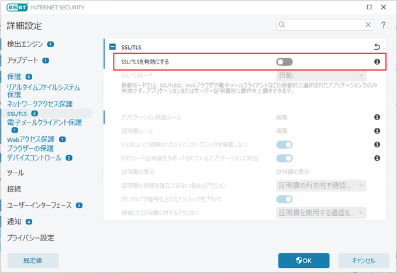

---


title: "인증서 오류로 GitHub Copilot을 사용할 수 없게 된 경우의 대처 방법"
date: 2024-04-21T18:47:26+09:00
tags: ["GitHub Copilot", ""]
draft: false
image: "img.png"
categories: ["도구 및 개발 환경"]
---


# GitHub Copilot에서 다음과 같은 오류가 표시된 경우의 대처 방법

2024년 4월 19일경부터 GitHub Copilot을 사용할 수 없게 되었습니다. 오류 메시지는 다음과 같습니다.

```
[ERROR] [ghostText] [2024-04-21T04:06:46.900Z] Error on ghost text request: (FetchError) unable to verify the first certificate
[ERROR] [certificates] [2024-04-21T04:06:46.901Z] Your current Copilot license doesn't support proxy connections with custom certificates. Please visit https://gh.io/copilot-network-errors to learn more. Original cause: {"type":"system","_name":"FetchError","code":"UNABLE_TO_VERIFY_LEAF_SIGNATURE"}
```

## 대처 방법
이것은 ESET의 버그인 것 같습니다. ESET의 고급 설정에서 'SSL/TLS 활성화'를 OFF로 설정합니다.


## 참고

AWS의 CDK에서도 동일한 오류가 발생하는 것 같습니다.
- [AWS CDK bootstrap certificate warning-error](https://repost.aws/questions/QU2H94hF04SIuEVejK_a1mtQ/aws-cdk-bootstrap-certificate-warning-error)
