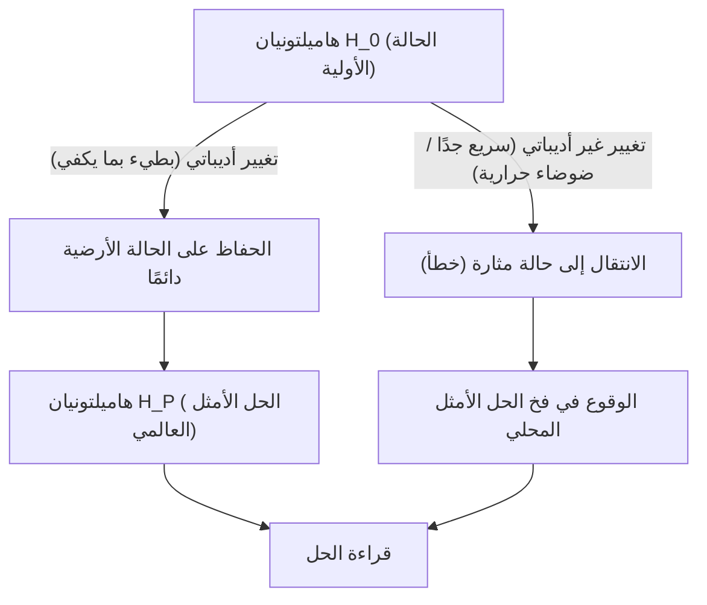
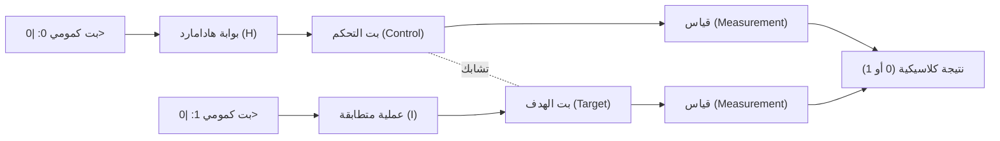
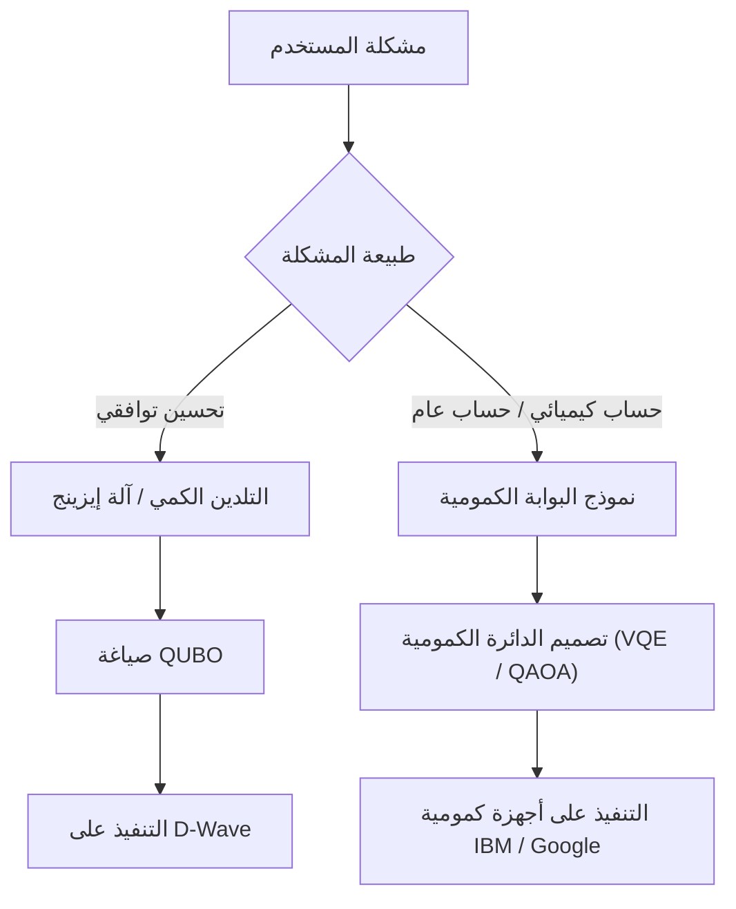

# شرح مبسط للفرق بين التلدين الكمي ونموذج البوابة الكمومية

الحوسبة الكمومية هي الجيل القادم من تقنيات الحوسبة التي تمتلك القدرة على حل مشاكل معينة بشكل أسرع بكثير باستخدام مبادئ ميكانيكا الكم (التراكب والتشابك الكمومي)، والتي قد تستغرق أجهزة الكمبيوتر الكلاسيكية الحديثة (بما في ذلك الحواسيب الفائقة التقليدية) وقتاً هائلاً لحسابها.

حاليًا، هناك نموذجان رئيسيان كنهج لتحقيق أجهزة الكمبيوتر الكمومية: **"التلدين الكمي (Quantum Annealing)"** و **"نموذج البوابة الكمومية (Quantum Gate Model)"**. يختلف هذان النموذجان بشكل كبير في النهج الفيزيائي الأساسي، والمهام الحسابية التي يتفوقان فيها، وتحديات الأجهزة في التنفيذ.

في هذه المقالة، سنقوم بمقارنة وشرح هذين النموذجين بدقة من منظور فني وتقني مفصل للغاية، بدءًا من المبادئ الفيزيائية، والنماذج الرياضية (نموذج إيزينج، QUBO، التحويل الوحدوي، إلخ)، والقيود التقنية الحالية، وصولاً إلى حالات الاستخدام المحددة.

---

## 1. أساسيات الحوسبة الكمومية: الاختلاف الجذري عن الحواسيب الكلاسيكية

تعالج أجهزة الكمبيوتر الكلاسيكية المعلومات كـ "بتات (Bits)" تأخذ إحدى الحالتين "0" أو "1". من ناحية أخرى، تستخدم أجهزة الكمبيوتر الكمومية "البتات الكمومية (Qubits)". يمكن للبت الكمومي أن يمتلك حالتي 0 و 1 في وقت واحد احتماليًا بفضل مبدأ "التراكب (Superposition)" في ميكانيكا الكم.

علاوة على ذلك، من خلال الاستفادة من ظاهرة تسمى "التشابك الكمومي (Entanglement)"، تصبح حالات البتات الكمومية المتعددة مترابطة بقوة مع بعضها البعض، بحيث تؤثر العملية على بت كمومي واحد بشكل فوري على النظام بأكمله. وهذا يتيح معالجة الحسابات المتوازية (التوازي الكمومي).

ومع ذلك، فإن الحالات الكمومية حساسة للغاية للضوضاء الخارجية (مثل الحرارة والموجات الكهرومغناطيسية)، وتعد ظاهرة "فك الترابط (Decoherence)"، حيث تنهار الحالة وتعود إلى الحالة الكلاسيكية، تحديًا كبيرًا. الاختلاف في النهج للتعامل مع مشكلة الضوضاء هذه أدى إلى اختلافات كبيرة في فلسفة التصميم بين التلدين ونموذج البوابة.

---

## 2. تفاصيل التلدين الكمي (Quantum Annealing)

التلدين الكمي هو بنية حاسوبية متخصصة تركز بشكل أساسي على حل **"مشاكل التحسين التوافقي (Combinatorial Optimization Problems)"**. يعتمد على النظرية التي اقترحها هيديتوشي نيشيموري ومامبي كادواكي من معهد طوكيو للتكنولوجيا في عام 1998، وأصبح معروفًا على نطاق واسع عندما قامت شركة D-Wave Systems الكندية بتسويقه لأول مرة في العالم.

### 2.1. الآلية الفيزيائية: نموذج إيزينج للمجال المستعرض والتقلبات الكمومية

يستفيد التلدين الكمي في الحساب من طبيعة الأنظمة الفيزيائية في العالم الطبيعي التي تميل إلى الاستقرار في "أدنى حالة طاقة (الحالة الأرضية - Ground State)".

في النهج الكلاسيكي المسمى "التلدين المحاكى (Simulated Annealing)"، تُستخدم التقلبات الحرارية للهروب من الحل الأمثل المحلي (Local Minimum). بالمقابل، يستخدم التلدين الكمي "التقلبات الكمومية (Quantum Fluctuation)" للتسلل عبر حواجز الطاقة من خلال "النفق الكمومي (Quantum Tunneling)"، مما يتيح استكشافًا أكثر كفاءة للحل الأمثل العالمي (Global Minimum).

يوصف التطور الزمني لنظام التلدين الكمي بواسطة الهاميلتونيان (مؤثر يمثل إجمالي طاقة النظام) $H(t)$ التالي:

$$ H(t) = A(t) H_0 + B(t) H_P $$

حيث $t$ هو الوقت، $A(t)$ هي دالة تتناقص تدريجيًا، و $B(t)$ هي دالة تتزايد تدريجيًا.

- **$H_0$ (الهاميلتونيان الأولي)**: يمثل المجال المستعرض (Transverse field) ويولد التقلبات الكمومية.
  $$ H_0 = - \sum_{i} \sigma_i^x $$
  ($\sigma_i^x$ هي مصفوفة باولي X، وتمثل قلب البت.)
- **$H_P$ (هاميلتونيان المشكلة)**: نموذج إيزينج (Ising Model) الذي يمثل مشكلة التحسين المراد حلها.

في الحالة الأولية ($t=0$)، يكون $A(0)$ في حده الأقصى، ويكون النظام في الحالة الأرضية لـ $H_0$ (حالة تتراكب فيها جميع الحالات بالتساوي). من هناك، يتم تقليل المجال المستعرض ببطء مع مرور الوقت، وفي الوقت نفسه يتم زيادة تفاعلات هاميلتونيان المشكلة.

### 2.2. الحوسبة الكمومية الأديباتية (Adiabatic Quantum Computation)

ما يهم في هذه العملية هو **"النظرية الأديباتية (Adiabatic Theorem)"**. وفقًا للنظرية الأديباتية، إذا تم تغيير النظام "ببطء كافٍ (أديباتيًا)"، فسيظل النظام دائمًا في الحالة الأرضية للهاميلتونيان اللحظي في ذلك الوقت.

بمعنى آخر، عندما يصبح $A(t) \to 0$ و $B(t) \to 1$ في النهاية، يكون النظام قد وصل إلى الحالة الأرضية لـ $H_P$، وهو ما يمثل **"الحل الدقيق لمشكلة التحسين"**.

### 2.3. التحويل من QUBO إلى نموذج إيزينج

لحل مشاكل العالم الحقيقي باستخدام المُلدّن الكمي، من الضروري صياغة المشكلة بصيغة **QUBO (التحسين الثنائي التربيعي غير المقيد - Quadratic Unconstrained Binary Optimization)**.

تُعرّف الدالة الهدف لـ QUBO على النحو التالي:
$$ \min_{x \in \{0,1\}^n} \sum_{i} Q_{ii} x_i + \sum_{i < j} Q_{ij} x_i x_j $$
حيث $x_i \in \{0, 1\}$ هي متغيرات ثنائية، و $Q$ هي مصفوفة الأوزان.

نظرًا لأن الأجهزة (مثل D-Wave) تتعامل مع اللف المغزلي الفيزيائي (لأعلى / لأسفل)، يجب تحويل المتغيرات إلى نموذج إيزينج باستخدام $\sigma_i \in \{-1, +1\}$. معادلة التحويل هي كالتالي:
$$ x_i = \frac{1 - \sigma_i}{2} \quad \text{أو} \quad \sigma_i = 1 - 2x_i $$

باستبدال هذا في معادلة QUBO وتبسيطها، نحصل على هاميلتونيان نموذج إيزينج $H_P$.
$$ H_P = - \sum_{i<j} J_{ij} \sigma_i^z \sigma_j^z - \sum_{i} h_i \sigma_i^z $$
- $J_{ij}$: التفاعل بين اللفات (معامل الاقتران). قوة الارتباط بين البتات الكمومية الفيزيائية.
- $h_i$: المجال المغناطيسي المحلي (التحيز) لكل لف.

### 2.4. أجهزة وتحديات التلدين الكمي (مثال D-Wave)

تتحقق المعالجات الكمومية من D-Wave باستخدام أجهزة التداخل الكمومي فائق التوصيل (SQUID). يعتمد الترابط بين البتات الكمومية الفيزيائية على أسلاك الأجهزة، وهو ليس ترابطًا كاملاً (حيث تكون جميع البتات متصلة ببعضها البعض).
تطورت من "رسم بياني كيميرا (Chimera graph)" الأولي إلى "بيغاسوس (Pegasus)" ثم "زيفير (Zephyr)"، مما أدى إلى تحسين درجة الترابط، ولكن لا تزال هناك قيود.

ولذلك، من الضروري إجراء عملية تُسمى **"التضمين الثانوي (Minor Embedding)"** لتعيين مشكلة ذات بنية رسومية معقدة على الرسم البياني الفيزيائي. ونتيجة لذلك، يتم تمثيل متغير منطقي واحد بواسطة بتات كمومية فيزيائية متعددة (سلسلة)، مما يقلل من العدد الفعلي للبتات الكمومية المتاحة ويؤدي إلى انخفاض دقة الحساب.

---

## 3. تفاصيل نموذج البوابة الكمومية (Quantum Gate Model)

نموذج البوابة الكمومية هو توسيع ميكانيكي كمومي للبوابات المنطقية الكلاسيكية (AND، OR، NOT، إلخ)، وهو بنية تتيح **"الحوسبة الكمومية الشاملة (Universal Quantum Computation)"**. تتبنى العديد من الشركات مثل IBM و Google و Rigetti و IonQ هذا النموذج.

### 3.1. التحويل الوحدوي ومتجه الحالة

في نموذج البوابة الكمومية، يتم تمثيل حالة نظام البتات الكمومية بأكمله كـ "متجه حالة (State Vector)" $|\psi\rangle$. يتم التعبير عن حالة بت كمي واحد كتركيبة خطية من الحالة الأساسية $|0\rangle$ و $|1\rangle$ على النحو التالي:
$$ |\psi\rangle = \alpha |0\rangle + \beta |1\rangle $$
حيث $\alpha$ و $\beta$ هي سعات احتمالية معقدة وتحقق $|\alpha|^2 + |\beta|^2 = 1$. يُمكن تصور هذه الحالة هندسيًا كنقطة على "كرة بلوخ (Bloch Sphere)".

توصف خطوات الحساب الكمومي بأنها تطبيق **لمؤثر وحدوي (Unitary Operator) $U$** على متجه الحالة. تمتلك المصفوفة الوحدوية خاصية $U^\dagger U = I$ (حاصل ضربها في مرافقها الهرميتي يساوي مصفوفة الوحدة)، وهي عملية قابلة للعكس تتوافق مع التطور الزمني في معادلة شرودنغر في ميكانيكا الكم.
$$ |\psi_{t+1}\rangle = U_t |\psi_t\rangle $$

### 3.2. البوابات الكمومية الأساسية ونموذج الدائرة

تُصمم الخوارزميات الكمومية كسلسلة من البوابات الكمومية (دوائر كمومية).

- **بوابات باولي (X, Y, Z)**: دوران بمقدار 180 درجة حول كل محور في كرة بلوخ. تعادل بوابة X بوابة NOT الكلاسيكية.
- **بوابة هادامارد (H)**: تحول $|0\rangle$ إلى $\frac{|0\rangle + |1\rangle}{\sqrt{2}}$، مما يخلق حالة تراكب.
  $$ H = \frac{1}{\sqrt{2}} \begin{pmatrix} 1 & 1 \\ 1 & -1 \end{pmatrix} $$
- **بوابة CNOT (Controlled-NOT)**: بوابة ببتين كموميين. يتم تطبيق بوابة X على بت الهدف فقط عندما يكون بت التحكم $|1\rangle$. ينتج عن هذا تشابك كمومي (Entanglement).

يمكن التعبير عن أي خوارزمية كمومية تقريبًا من خلال مجموعة صغيرة من بوابات البت الكمومي الواحد وبوابات CNOT (مجموعة بوابات شاملة).

### 3.3. تصحيح الأخطاء والطريق من NISQ إلى FTQC

التحدي الأكبر لنموذج البوابة الكمومية هو "فك الترابط"، حيث تُدمر الحالات الكمومية بسبب الضوضاء. تتراكم الأخطاء كلما زاد عمق خطوات الحساب (عمق البوابة).

لإجراء حسابات مثالية، يعتبر **تصحيح الأخطاء الكمومية (Quantum Error Correction)** أمرًا لا غنى عنه. على سبيل المثال، في طرق مثل "الكود السطحي (Surface Code)"، يتم دمج بتات كمومية فيزيائية متعددة لتكوين "بت كمومي منطقي (Logical Qubit)" واحد خالٍ من الأخطاء. ومع ذلك، هناك حاجة لآلاف إلى عشرات الآلاف من البتات الكمومية الفيزيائية لإنشاء بت كمومي منطقي واحد، مما يؤدي إلى عبء إضافي هائل.

المرحلة التي نحن فيها حاليًا هي عصر أجهزة **NISQ (الأجهزة الكمومية متوسطة الحجم وصاخبة - Noisy Intermediate-Scale Quantum)**، والتي تتكون من عشرات إلى مئات البتات الكمومية بدون تصحيح للأخطاء. ما زلنا بحاجة إلى العديد من الإنجازات لتحقيق **FTQC (الحوسبة الكمومية المتسامحة مع الأخطاء - Fault-Tolerant Quantum Computing)** المزودة بتصحيح كامل للأخطاء.

---

## 4. ملخص المقارنة الفنية والرياضية

نقارن الاختلافات الأساسية بين البنيتين:

| عنصر المقارنة | التلدين الكمي (Quantum Annealing) | نموذج البوابة الكمومية (Gate Model) |
| :--- | :--- | :--- |
| **نموذج الحساب** | حساب كمومي أديباتي (تطور زمني مستمر للهاميلتونيان) | تحويل وحدوي (سلسلة منفصلة من عمليات البوابة) |
| **المشكلات المناسبة** | مشكلات التحسين التوافقي (QUBO، نموذج إيزينج) | عالمي (محاكاة الكيمياء الكمومية، التحليل إلى عوامل، البحث، إلخ) |
| **القدرة التعبيرية** | تحسين إرشادي (حلول تقريبية) | مكافئ لآلة تورنغ الكمومية الشاملة (جميع الحسابات ممكنة نظريًا) |
| **أمثلة على التنفيذ** | D-Wave Systems | IBM, Google, Quantinuum, IonQ وغيرها |
| **التسامح مع الضوضاء** | قوي نسبيًا (يبقى بالقرب من الحالة الأرضية، لذا يمكن تحمل بعض الضوضاء الحرارية) | ضعيف جدًا (ضوضاء طفيفة تسبب انزياح الطور وتدمر نتائج الحساب) |
| **قابلية التوسع** | مقياس الآلاف إلى عشرات الآلاف من البتات الكمومية (يعتمد على البنية الفيزيائية. البتات المنطقية صعبة) | مقياس مئات البتات الكمومية (مطلوب مقياس الملايين من أجل FTQC) |

يناسب التلدين الكمي كـ "معالج مساعد لغرض محدد" حل مشكلات التحسين بشكل يكمل حدود أجهزة الكمبيوتر الكلاسيكية. من ناحية أخرى، فإن نموذج البوابة الكمومية هو النسخة الكمومية من "الكمبيوتر للأغراض العامة"، ويهدف في النهاية إلى تجاوز القدرات الحسابية لأجهزة الكمبيوتر الكلاسيكية (التفوق الكمومي)، ولكن بناء أجهزته أمر بالغ الصعوبة.

---

## 5. القيود والتحديات الحالية

### قيود التلدين الكمي
1. **القيود على الترابط (Connectivity)**: بسبب التضمين الثانوي المذكور أعلاه، يزداد عدد البتات الكمومية الفيزيائية المطلوبة أضعافًا مضاعفة كلما زاد حجم المشكلة.
2. **دقة المعاملات (Precision)**: تؤثر الأخطاء الفيزيائية عند إعداد معلمات تناظرية مثل $J_{ij}$ و $h_i$ على الأجهزة بشكل مباشر على جودة الحل.
3. **درجة الحرارة والانتقال غير الأديباتي**: نظرًا لأن درجة حرارة النظام ليست الصفر المطلق، فهناك احتمال للانحراف عن الحل الأمثل بسبب الإثارة الحرارية.

### قيود نموذج البوابة الكمومية
1. **زمن الترابط (Coherence Time)**: الوقت الذي يمكن فيه الحفاظ على الحالة الكمومية محدود للغاية، ويتراوح من بضعة ميكروثانية إلى بضع ميلي ثانية، ويكون عدد البوابات (عمق الدائرة) التي يمكن تنفيذها خلال ذلك الوقت مقيدًا بشدة.
2. **دقة البوابة (Gate Fidelity)**: لا يزال معدل الخطأ في التشغيل للبوابات ذات البتات الكمومية المزدوجة (مثل CNOT) غير منخفض بشكل كافٍ (بشكل عام حوالي 99.x٪). لتحقيق FTQC، يجب رفع هذا إلى 99.99٪ أو أعلى.
3. **الحجم الكمومي (Quantum Volume)**: يمثل توسيع نطاق قدرة الحوسبة الفعلية (الحجم الكمومي) - مع الأخذ في الاعتبار ليس فقط عدد البتات الكمومية ولكن أيضًا الترابط المتبادل ومعدلات الخطأ - التحدي الأكبر حاليًا.

---

## 6. حالات الاستخدام والخوارزميات المحددة

دعونا نلقي نظرة على مجالات التطبيق المحددة التي يتفوق فيها كل نموذج.

### 6.1. حالات استخدام التلدين الكمي
- **الخدمات اللوجستية والتوجيه**: تحسين طرق التسليم للعديد من المركبات (تنوع في مشكلة البائع المتجول). البحث عن المسارات في الوقت الفعلي مع مراعاة الازدحام المروري.
- **الهندسة المالية**: تحسين المحفظة الاستثمارية. البحث عن مجموعات الأسهم التي تزيد العوائد إلى أقصى حد مع تقليل المخاطر.
- **التعلم الآلي**: اختيار الميزات (Feature Selection). استخراج مجموعة المتغيرات الأكثر مساهمة في التنبؤ من مجموعة بيانات ضخمة.
- **التصنيع**: مشكلة جدولة الورشة في المصانع (أي آلة تعالج أي أجزاء وبأي ترتيب للحصول على أسرع نتيجة).

### 6.2. حالات استخدام نموذج البوابة الكمومية
- **محاكاة الكيمياء الكمومية**: محاكاة حالات الطاقة للجزئيات والتفاعلات الكيميائية بدقة عالية.
- **التحليل إلى عوامل (خوارزمية شور)**: خوارزمية لتحليل الأعداد المركبة الضخمة إلى عوامل في وقت متعدد الحدود. إذا تم وضع ذلك موضع التنفيذ الفعلي، فسيتم كسر البنية التحتية لتشفير المفتاح العام مثل تشفير RSA الحالي، لذلك من المُلح الانتقال إلى التشفير ما بعد الكوانتوم (PQC).
- **بحث قواعد البيانات (خوارزمية غروفر)**: عند البحث عن بيانات مستهدفة من قاعدة بيانات غير مرتبة، تتطلب أجهزة الكمبيوتر الكلاسيكية خطوات $O(N)$، بينما يمكن لخوارزمية غروفر البحث في خطوات $O(\sqrt{N})$.

### 6.3. الخوارزميات الهجينة في عصر NISQ: VQE و QAOA
للتغلب على قيود الدوائر الكمومية الضحلة لأجهزة NISQ، جذبت "الخوارزميات الكمومية المتغيرة (Variational Quantum Algorithms)" الانتباه من خلال الجمع بين مزايا أجهزة الكمبيوتر الكمومية والكلاسيكية.

- **VQE (Variational Quantum Eigensolver)**: خوارزمية لإيجاد طاقة الحالة الأرضية للجزئيات. يتم تحضير الحالة الكمومية باستخدام دوائر كمومية ذات معلمات (Ansatz)، وتُقاس القيمة المتوقعة للطاقة $\langle \psi(\theta) | H | \psi(\theta) \rangle$. باستخدام هذه القيمة المتوقعة كدالة هدف، تُستخدم خوارزمية تحسين كلاسيكية (مثل الانحدار التدريجي) لتحديث المعلمات $\theta$. من خلال تكرار ذلك حتى التقارب، يتم إيجاد حالة الطاقة الدقيقة للجزيء.
- **QAOA (Quantum Approximate Optimization Algorithm)**: خوارزمية لحل مشكلات التحسين التوافقي باستخدام نموذج البوابة الكمومية. تقارب التطور الزمني الأديباتي للتلدين الكمي إلى عمليات بوابة منفصلة عن طريق "توسع تروتر (Trotterization)"، ونحصل على حل تقريبي عن طريق تطبيق الهاميلتونيان بالتناوب. يُتوقع أن تكون خوارزمية QAOA وسيلة واعدة لحل مشكلات التحسين باستخدام نموذج البوابة.

---

## 7. الخلاصة

يستخدم كل من التلدين الكمي ونموذج البوابة الكمومية الخصائص الغامضة لميكانيكا الكم كمورد حسابي، ولكن نهجيهما وأهدافهما النهائية تختلف اختلافًا كبيرًا.

- **التلدين الكمي** هو "محرك إرشادي متخصص" لتحقيق نتائج عملية في وقت مبكر لمشكلة حقيقية محددة هي التحسين التوافقي. في الوقت الحاضر، يتم إجراء العديد من تجارب إثبات المفهوم (PoC) بالفعل من قبل شركات مختلفة.
- **نموذج البوابة الكمومية** هو "كمبيوتر كمومي للأغراض العامة" لديه القدرة على إحداث ثورة في نماذج علوم الكمبيوتر من جذورها، بدءًا من المحاكاة الدقيقة للفيزياء والكيمياء وصولاً إلى فك التشفير. ومع ذلك، يتطلب الأمر بحثًا وتطويرًا على المدى الطويل للتغلب على الجدار الضخم المتمثل في تصحيح الأخطاء.

في المستقبل، من المتوقع أن يتم بناء بيئة **"حوسبة غير متجانسة (Heterogeneous Computing)"**، حيث تكون أجهزة الكمبيوتر الفائقة الكلاسيكية (HPC) في جوهرها، مع استدعاء آلة تلدين لمهام التحسين وجهاز كمبيوتر كمومي قائم على البوابات لحسابات الكيمياء الكمومية.

لا تزال الحوسبة الكمومية تقنية قيد التطوير، لكنها تتقدم بسرعة في كل من الأجهزة والخوارزميات. إن فهم رياضيات نموذج إيزينج وأساسيات الدوائر الكمومية سيكون سلاحًا عظيمًا للاستعداد للعصر الكمومي الأصيل القادم.

---
*تشرح هذه المقالة بشكل شامل كل شيء من المفاهيم الأساسية للحوسبة الكمومية إلى أحدث اتجاهات الأجهزة. يرجى الاستمرار في متابعة أحدث اتجاهات البحث في المستقبل.*
