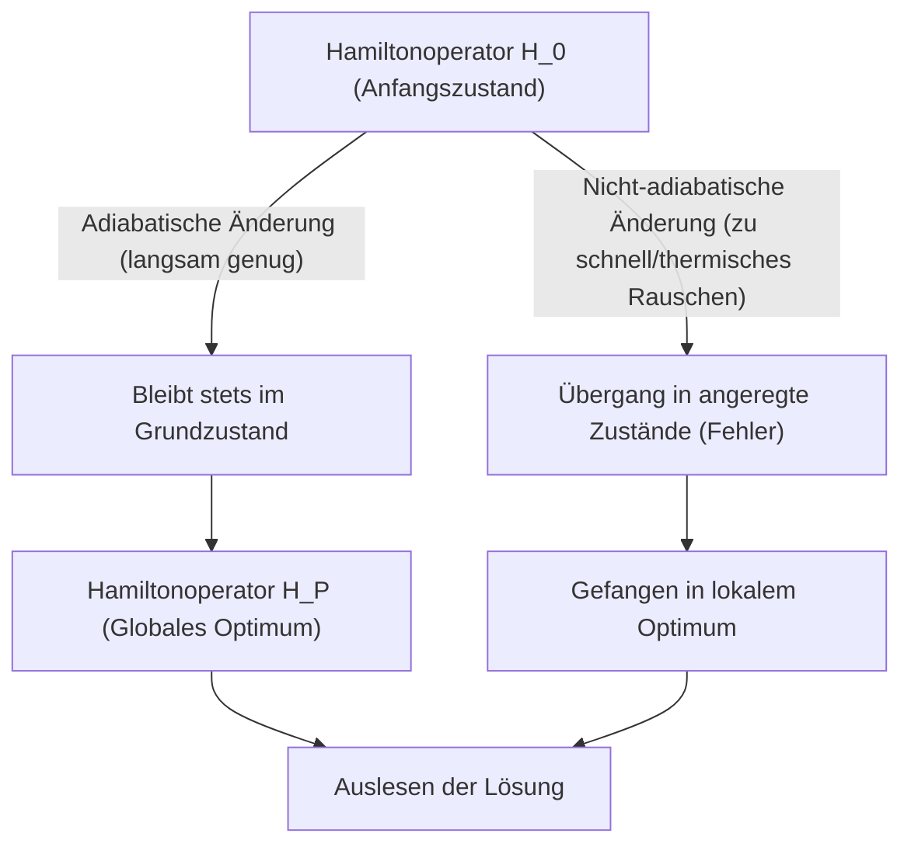
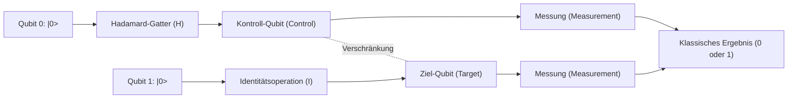
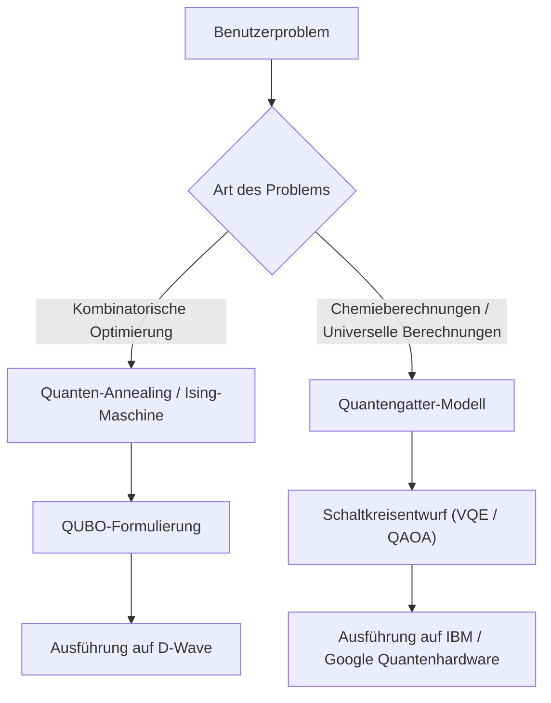

# Quanten-Annealing und Quantengatter-Modell im Vergleich leicht erklärt

Quantencomputing ist eine Rechentechnologie der nächsten Generation mit dem Potenzial, bestimmte Probleme, für die moderne klassische Computer (einschließlich herkömmlicher Supercomputer) enorm viel Rechenzeit benötigen würden, mithilfe quantenmechanischer Prinzipien (Superposition und Quantenverschränkung) drastisch schneller zu lösen.

Derzeit gibt es für die Realisierung von Quantencomputern im Wesentlichen zwei Mainstream-Paradigmen: **"Quanten-Annealing" (Quantum Annealing)** und das **"Quantengatter-Modell" (Quantum Gate Model)**. Diese beiden Ansätze unterscheiden sich grundlegend in den zugrunde liegenden physikalischen Prinzipien, den bevorzugten Rechenaufgaben und den Hardware-Herausforderungen bei der Implementierung.

In diesem Artikel werden wir diese beiden Ansätze aus einer sehr detaillierten und technischen Perspektive umfassend vergleichen und erläutern – von den physikalischen Prinzipien und mathematischen Modellen (Ising-Modell, QUBO, unitäre Transformationen usw.) über die aktuellen technischen Grenzen bis hin zu konkreten Anwendungsfällen.

---

## 1. Grundlagen des Quantencomputings: Der fundamentale Unterschied zu klassischen Computern

Klassische Computer verarbeiten Informationen als "Bits", die den Zustand "0" oder "1" annehmen. Quantencomputer hingegen verwenden "Quantenbits (Qubits)". Durch das quantenmechanische Prinzip der "Superposition" (Überlagerung) können Qubits mit bestimmten Wahrscheinlichkeiten gleichzeitig die Zustände 0 und 1 annehmen.

Darüber hinaus sind durch das Phänomen der "Quantenverschränkung" (Entanglement) die Zustände mehrerer Qubits stark miteinander korreliert, sodass eine Operation an einem Qubit das gesamte System augenblicklich beeinflusst. Dies ermöglicht eine Art parallele Verarbeitung (Quantenparallelität).

Quantenzustände sind jedoch extrem anfällig für externes Rauschen (wie Wärme oder elektromagnetische Strahlung). Das Phänomen der "Dekohärenz" (Decoherence), bei dem der Zustand zusammenbricht und in einen klassischen Zustand zurückfällt, stellt eine große Herausforderung dar. Die unterschiedlichen Herangehensweisen an dieses Rauschproblem führen zu den großen Unterschieden in der Designphilosophie zwischen Annealing und dem Gatter-Modell.

---

## 2. Details zum Quanten-Annealing (Quantum Annealing)

Quanten-Annealing ist eine spezialisierte Rechenarchitektur, die hauptsächlich auf die Lösung von **"kombinatorischen Optimierungsproblemen"** zugeschnitten ist. Sie basiert auf der 1998 von Hidetoshi Nishimori und Tadashi Kadowaki (Tokyo Institute of Technology) vorgeschlagenen Theorie und wurde durch die weltweit erste kommerzielle Umsetzung des kanadischen Unternehmens D-Wave Systems weithin bekannt.

### 2.1. Physikalischer Mechanismus: Transversalfeld-Ising-Modell und Quantenfluktuation

Das Quanten-Annealing macht sich die Eigenschaft natürlicher physikalischer Systeme zunutze, sich in den Zustand mit der niedrigsten Energie (Grundzustand) einzupendeln.

Beim klassischen Ansatz, dem "Simulated Annealing", werden thermische Fluktuationen genutzt, um aus lokalen Optima (lokalen Minima) zu entkommen. Das Quanten-Annealing nutzt stattdessen "Quantenfluktuationen" (Quantum Fluctuation) und durchdringt mittels des "Quanten-Tunneleffekts" (Quantum Tunneling) Energiebarrieren, um so effizienter nach dem globalen Optimum (globalen Minimum) zu suchen.

Die zeitliche Entwicklung eines Quanten-Annealing-Systems wird durch den folgenden Hamiltonoperator (ein Operator, der die Gesamtenergie des Systems darstellt) $H(t)$ beschrieben:

$$ H(t) = A(t) H_0 + B(t) H_P $$

Dabei ist $t$ die Zeit, $A(t)$ eine allmählich abnehmende Funktion und $B(t)$ eine allmählich zunehmende Funktion.

- **$H_0$ (Anfangs-Hamiltonoperator)**: Stellt das Transversalfeld (Transverse field) dar und erzeugt Quantenfluktuationen.
  $$ H_0 = - \sum_{i} \sigma_i^x $$
  ($\sigma_i^x$ ist die Pauli-X-Matrix und repräsentiert einen Bit-Flip.)
- **$H_P$ (Problem-Hamiltonoperator)**: Ein Ising-Modell, das das zu lösende Optimierungsproblem repräsentiert.

Im Anfangszustand ($t=0$) ist $A(0)$ maximal, und das System befindet sich im Grundzustand von $H_0$ (ein Zustand, in dem alle möglichen Zustände gleichmäßig überlagert sind). Im Laufe der Zeit wird das Transversalfeld langsam abgeschwächt, während gleichzeitig die Wechselwirkungen des Problem-Hamiltonoperators verstärkt werden.

### 2.2. Adiabatisches Quantencomputing (Adiabatic Quantum Computation)

Wichtig bei diesem Prozess ist das **"Adiabatentheorem" (Adiabatic Theorem)**. Nach diesem Theorem bleibt ein System, wenn es "langsam genug" (adiabatisch) verändert wird, stets im Grundzustand des jeweiligen momentanen Hamiltonoperators.

Das bedeutet, dass das System, wenn schließlich $A(t) \to 0$ und $B(t) \to 1$ erreicht ist, den Grundzustand von $H_P$ erreicht hat, d. h. die **"exakte Lösung des Optimierungsproblems"**.

### 2.3. Mapping von QUBO auf das Ising-Modell

Um reale Probleme auf einem Quanten-Annealer zu lösen, muss das Problem in Form eines **QUBO (Quadratic Unconstrained Binary Optimization)** formuliert werden.

Die Zielfunktion eines QUBO ist wie folgt definiert:
$$ \min_{x \in \{0,1\}^n} \sum_{i} Q_{ii} x_i + \sum_{i < j} Q_{ij} x_i x_j $$
Hierbei ist $x_i \in \{0, 1\}$ eine binäre Variable und $Q$ eine Gewichtsmatrix.

Da die Hardware (wie D-Wave) mit physikalischen Spins (Spin-Up/Spin-Down) arbeitet, müssen die Variablen in ein Ising-Modell mit $\sigma_i \in \{-1, +1\}$ transformiert werden. Die Transformationsgleichung lautet:
$$ x_i = \frac{1 - \sigma_i}{2} \quad \text{oder} \quad \sigma_i = 1 - 2x_i $$

Setzt man dies in die QUBO-Gleichung ein und vereinfacht, erhält man den Hamiltonoperator $H_P$ des Ising-Modells:
$$ H_P = - \sum_{i<j} J_{ij} \sigma_i^z \sigma_j^z - \sum_{i} h_i \sigma_i^z $$
- $J_{ij}$: Wechselwirkung zwischen Spins (Kopplungskoeffizient). Entspricht der Kopplungsstärke zwischen physikalischen Qubits.
- $h_i$: Lokales Magnetfeld (Bias) für jeden Spin.

### 2.4. Hardware und Herausforderungen des Quanten-Annealings (Beispiel D-Wave)

Die Quantenprozessoren von D-Wave werden mithilfe von supraleitenden Quanteninterferenz-Einheiten (SQUIDs) realisiert. Die physikalische Kopplung zwischen Qubits hängt von der Hardware-Verkabelung ab und ist nicht vollständig (nicht alle Qubits sind miteinander verbunden).
Ausgehend vom ursprünglichen "Chimera-Graphen" über den "Pegasus-Graphen" bis hin zum "Zephyr-Graphen" hat sich die Konnektivität zwar verbessert, bleibt aber eingeschränkt.

Daher ist ein **"Minor Embedding"** erforderlich, um Probleme mit komplexer Graphenstruktur auf den physikalischen Graphen abzubilden. Dabei wird eine logische Variable durch mehrere physikalische Qubits (Ketten) repräsentiert, was die Anzahl der nutzbaren effektiven Qubits verringert und zu einer Verringerung der Rechengenauigkeit führt.

---

## 3. Details zum Quantengatter-Modell (Quantum Gate Model)

Das Quantengatter-Modell ist eine quantenmechanische Erweiterung klassischer Logikgatter (AND, OR, NOT usw.) und ermöglicht **"Universelles Quantencomputing" (Universal Quantum Computation)**. Viele Unternehmen wie IBM, Google, Rigetti und IonQ verfolgen diesen Ansatz.

### 3.1. Unitäre Transformationen und Zustandsvektor

Beim Quantengatter-Modell wird der Gesamtzustand des Qubit-Systems als "Zustandsvektor" (State Vector) $|\psi\rangle$ dargestellt. Der Zustand eines einzelnen Qubits wird als Linearkombination der Basiszustände $|0\rangle$ und $|1\rangle$ wie folgt beschrieben:
$$ |\psi\rangle = \alpha |0\rangle + \beta |1\rangle $$
Hierbei sind $\alpha$ und $\beta$ komplexe Wahrscheinlichkeitsamplituden, für die $|\alpha|^2 + |\beta|^2 = 1$ gilt. Dieser Zustand wird geometrisch oft als Punkt auf der "Bloch-Kugel" (Bloch Sphere) veranschaulicht.

Rechenschritte im Quantencomputer werden als Anwendung eines **unitären Operators (Unitary Operator) $U$** auf den Zustandsvektor beschrieben. Unitäre Matrizen haben die Eigenschaft $U^\dagger U = I$ (das Produkt mit der hermitesch konjugierten Matrix ergibt die Einheitsmatrix) und stellen umkehrbare Operationen dar, die der zeitlichen Entwicklung der Schrödingergleichung in der Quantenmechanik entsprechen:
$$ |\psi_{t+1}\rangle = U_t |\psi_t\rangle $$

### 3.2. Grundlegende Quantengatter und das Schaltkreismodell

Quantenalgorithmen werden als eine Abfolge von Quantengattern (Quantenschaltkreis) entworfen.

- **Pauli-Gatter (X, Y, Z)**: 180-Grad-Rotationen um die jeweiligen Achsen der Bloch-Kugel. Das X-Gatter entspricht dem klassischen NOT-Gatter.
- **Hadamard-Gatter (H)**: Überführt $|0\rangle$ in $\frac{|0\rangle + |1\rangle}{\sqrt{2}}$ und erzeugt so einen Superpositionszustand.
  $$ H = \frac{1}{\sqrt{2}} \begin{pmatrix} 1 & 1 \\ 1 & -1 \end{pmatrix} $$
- **CNOT-Gatter (Controlled-NOT)**: Ein 2-Qubit-Gatter. Es wendet das X-Gatter nur dann auf das Ziel-Qubit an, wenn das Kontroll-Qubit $|1\rangle$ ist. Dadurch wird Quantenverschränkung (Entanglement) erzeugt.

Jeder Quantenalgorithmus kann näherungsweise durch eine Kombination aus wenigen Einzel-Qubit-Gattern und CNOT-Gattern dargestellt werden (universelles Gatter-Set).

### 3.3. Fehlerkorrektur und der Weg von NISQ zu FTQC

Die größte Herausforderung des Quantengatter-Modells ist die "Dekohärenz", bei der der Quantenzustand durch Rauschen zerstört wird. Je tiefer die Rechenschritte (Gattertiefe), desto mehr Fehler akkumulieren sich.

Für ideale Berechnungen ist eine **Quantenfehlerkorrektur (Quantum Error Correction)** unerlässlich. Bei Methoden wie dem "Surface Code" werden beispielsweise mehrere physikalische Qubits gebündelt, um ein fehlerfreies "logisches Qubit" (Logical Qubit) zu bilden. Um jedoch ein einziges logisches Qubit zu erzeugen, werden Tausende bis Zehntausende physikalische Qubits benötigt, was zu einem enormen Overhead führt.

Wir befinden uns derzeit in der Ära der **NISQ (Noisy Intermediate-Scale Quantum)** Geräte, die über Dutzende bis Hunderte von Qubits ohne Fehlerkorrektur verfügen. Die Realisierung von **FTQC (Fault-Tolerant Quantum Computing)**, das vollständige Fehlerkorrektur bietet, erfordert noch viele Durchbrüche.

---

## 4. Zusammenfassung des technischen und mathematischen Vergleichs

Vergleich der grundlegenden Unterschiede beider Architekturen:

| Vergleichsmerkmal | Quanten-Annealing (Quantum Annealing) | Quantengatter-Modell (Gate Model) |
| :--- | :--- | :--- |
| **Rechenmodell** | Adiabatisches Quantencomputing (Kontinuierliche zeitliche Entwicklung des Hamiltonoperators) | Unitäre Transformation (Diskrete Abfolge von Gatteroperationen) |
| **Geeignete Probleme** | Kombinatorische Optimierungsprobleme (QUBO, Ising-Modell) | Universell (Quantenchemiesimulation, Primfaktorzerlegung, Suche usw.) |
| **Ausdruckskraft** | Heuristische Optimierung (Näherungslösungen) | Äquivalent zu einer universellen Quantenturingmaschine (theoretisch alle Berechnungen möglich) |
| **Implementierungsbeispiele** | D-Wave Systems | IBM, Google, Quantinuum, IonQ usw. |
| **Toleranz gegenüber Rauschen** | Relativ robust (da es nahe dem Grundzustand bleibt, ist ein gewisses Maß an thermischem Rauschen tolerierbar) | Sehr anfällig (geringes Rauschen verschiebt die Phase und zerstört das Rechenergebnis) |
| **Skalierbarkeit** | Tausende bis Zehntausende Qubits (abhängig von der physikalischen Struktur; logische Qubits schwer umsetzbar) | Hunderte Qubits (für FTQC sind Millionen erforderlich) |

Das Quanten-Annealing eignet sich als "zweckspezifischer Coprozessor", um kombinatorische Optimierungsprobleme zu lösen und so die Grenzen klassischer Computer zu ergänzen. Das Quantengatter-Modell hingegen ist die Quantenversion des "Allzweckrechners" und zielt darauf ab, die Rechenleistung klassischer Computer letztendlich zu übertreffen (Quantenüberlegenheit), jedoch ist der Bau der Hardware extrem schwierig.

---

## 5. Aktuelle Grenzen und Herausforderungen

### Grenzen des Quanten-Annealings
1. **Eingeschränkte Konnektivität (Connectivity)**: Durch das zuvor erwähnte Minor Embedding steigt die Anzahl der benötigten physikalischen Qubits mit der Problemgröße exponentiell an.
2. **Präzision der Koeffizienten (Precision)**: Physikalische Fehler beim Einstellen analoger Parameter wie $J_{ij}$ und $h_i$ auf der Hardware wirken sich direkt auf die Qualität der Lösung aus.
3. **Temperatur und nicht-adiabatische Übergänge**: Da die Systemtemperatur nicht am absoluten Nullpunkt liegt, besteht die Wahrscheinlichkeit, dass thermische Anregungen das System vom optimalen Zustand abbringen.

### Grenzen des Quantengatter-Modells
1. **Kohärenzzeit (Coherence Time)**: Die Zeit, in der ein Quantenzustand aufrechterhalten werden kann, liegt nur im Bereich von Mikrosekunden bis Millisekunden, was die Anzahl der in dieser Zeit ausführbaren Gatter (Tiefe des Schaltkreises) stark begrenzt.
2. **Gatter-Fidelität (Gate Fidelity)**: Die Fehlerrate von 2-Qubit-Gattern (wie CNOT) ist noch nicht niedrig genug (im Allgemeinen etwa 99,x %). Für die Realisierung von FTQC muss diese auf über 99,99 % gesteigert werden.
3. **Quantenvolumen (Quantum Volume)**: Die Skalierung nicht nur der bloßen Qubit-Anzahl, sondern der effektiven Rechenleistung (Quantenvolumen) unter Berücksichtigung von Vernetzung und Fehlerraten ist derzeit die größte Herausforderung.

---

## 6. Konkrete Anwendungsfälle und Algorithmen

Betrachten wir die spezifischen Anwendungsbereiche, in denen jede der beiden Methoden ihre Stärken hat.

### 6.1. Anwendungsfälle des Quanten-Annealings
- **Logistik und Routing**: Routenoptimierung für Lieferfahrzeuge (Varianten des Problems des Handlungsreisenden). Echtzeit-Routenfindung unter Berücksichtigung von Verkehrsstaus.
- **Finanzmathematik**: Portfoliooptimierung. Finden von Anlagekombinationen, die das Risiko minimieren und gleichzeitig die Rendite maximieren.
- **Maschinelles Lernen**: Feature Selection. Auswahl der Variablenkombinationen aus riesigen Datensätzen, die am meisten zur Vorhersage beitragen.
- **Fertigungsindustrie**: Job-Shop-Scheduling-Probleme in Fabriken (welches Bauteil soll auf welcher Maschine in welcher Reihenfolge am schnellsten bearbeitet werden).

### 6.2. Anwendungsfälle des Quantengatter-Modells
- **Quantenchemiesimulation**: Hochpräzise Simulation von molekularen Energiezuständen und chemischen Reaktionen.
- **Primfaktorzerlegung (Shor-Algorithmus)**: Ein Algorithmus zur Zerlegung riesiger zusammengesetzter Zahlen in Polynomzeit. Wenn dieser praxistauglich wird, könnte er heutige Public-Key-Infrastrukturen wie RSA brechen, weshalb der Übergang zur Post-Quanten-Kryptographie (PQC) dringlich ist.
- **Datenbanksuche (Grover-Algorithmus)**: Bei der Suche nach bestimmten Daten in einer unsortierten Datenbank benötigen klassische Computer $O(N)$ Schritte, während der Grover-Algorithmus dies in $O(\sqrt{N})$ Schritten schafft.

### 6.3. Hybrid-Algorithmen der NISQ-Ära: VQE und QAOA
Um die Einschränkungen der flachen Quantenschaltkreise von NISQ-Geräten zu überwinden, gewinnen "Variationelle Quantenalgorithmen" (Variational Quantum Algorithms) an Bedeutung, die die Vorteile von Quanten- und klassischen Computern kombinieren.

- **VQE (Variational Quantum Eigensolver)**: Ein Algorithmus zur Bestimmung der Grundzustandsenergie von Molekülen. Er verwendet einen parametrisierten Quantenschaltkreis (Ansatz), um einen Quantenzustand vorzubereiten, und misst den Energieerwartungswert $\langle \psi(\theta) | H | \psi(\theta) \rangle$. Dieser Erwartungswert wird als Zielfunktion verwendet, um die Parameter $\theta$ mithilfe eines klassischen Optimierungsalgorithmus (wie Gradientenabstieg) zu aktualisieren. Durch Wiederholung bis zur Konvergenz wird der exakte Energiezustand des Moleküls ermittelt.
- **QAOA (Quantum Approximate Optimization Algorithm)**: Ein Algorithmus zur Lösung von kombinatorischen Optimierungsproblemen mithilfe des Quantengatter-Modells. Er approximiert die adiabatische zeitliche Entwicklung des Quanten-Annealings durch diskrete Gatteroperationen mittels "Trotterisierung" (Trotterization) und wendet abwechselnd Hamiltonoperatoren an, um eine Näherungslösung zu erhalten. QAOA gilt als vielversprechender Ansatz zur Lösung von Optimierungsproblemen mit dem Gatter-Modell.

---

## 7. Fazit

Obwohl Quanten-Annealing und das Quantengatter-Modell beide auf den faszinierenden Eigenschaften der Quantenmechanik als Rechenressource basieren, unterscheiden sie sich stark in ihrem Ansatz und ihren Zielen.

- Das **Quanten-Annealing** ist eine "spezialisierte heuristische Engine", die darauf abzielt, frühzeitig praktische Ergebnisse für spezifische reale Probleme wie die kombinatorische Optimierung zu liefern. Zahlreiche Unternehmen führen derzeit bereits Proof-of-Concept-Projekte (PoC) durch.
- Das **Quantengatter-Modell** ist der "universelle Quantencomputer" mit dem Potenzial, Paradigmen der Informatik grundlegend zu verändern – von exakten physikalischen und chemischen Simulationen bis hin zur Entschlüsselung. Die Überwindung der gewaltigen Hürde der Fehlerkorrektur erfordert jedoch langfristige Forschung und Entwicklung.

Es wird erwartet, dass in Zukunft **"heterogene (Heterogeneous) Computing"**-Umgebungen entstehen, in denen klassische Supercomputer (HPC) den Kern bilden und je nach Aufgabe Annealing-Maschinen für Optimierungen oder gatterbasierte Quantencomputer für quantenchemische Berechnungen hinzugezogen werden.

Quantencomputer befinden sich noch in der Entwicklungsphase, doch sowohl bei der Hardware als auch bei den Algorithmen werden täglich schnelle Fortschritte erzielt. Das Verständnis der Mathematik von Ising-Modellen und der Grundlagen von Quantenschaltkreisen wird eine mächtige Waffe für die bevorstehende Quanten-Native-Ära sein.

---
*Dieser Artikel bietet einen umfassenden Überblick von den grundlegenden Konzepten des Quantencomputings bis hin zu den neuesten Hardwaretrends. Bitte verfolgen Sie auch in Zukunft die neuesten Forschungsentwicklungen.*
