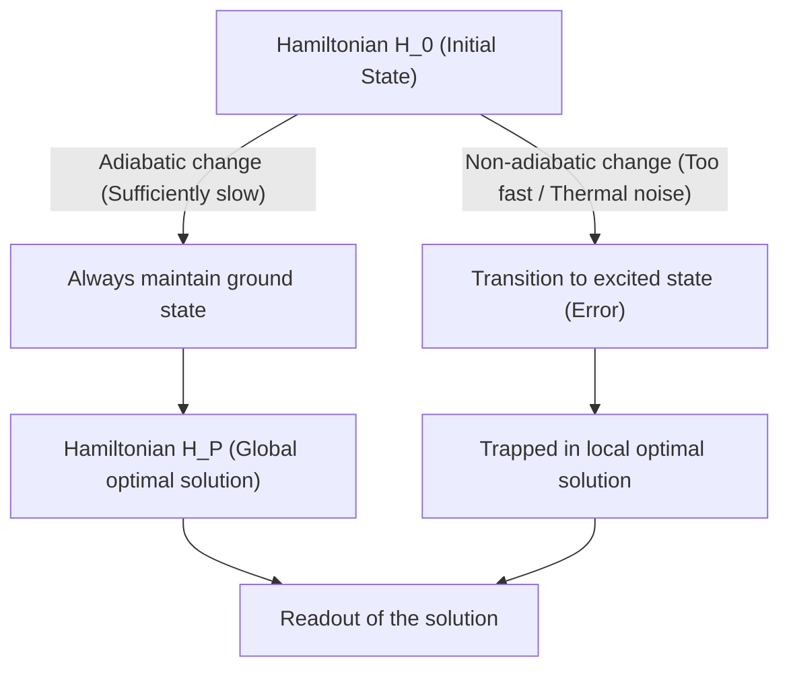
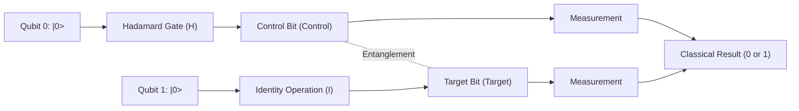
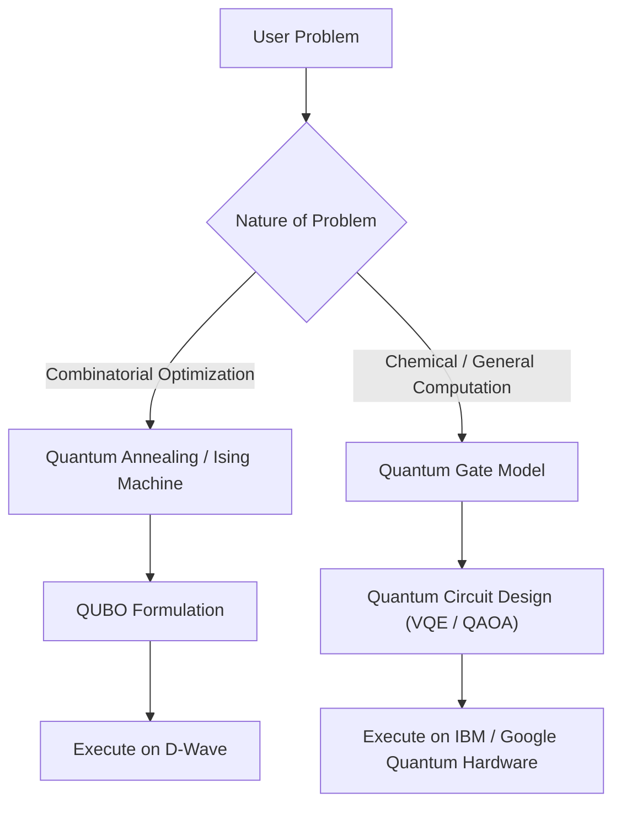

# Quantum Annealing vs Gate Model Explained Clearly

Quantum computing is a next-generation computational technology that utilizes quantum mechanical principles (superposition and entanglement) to dramatically speed up solving specific problems that would take conventional classical computers (including traditional supercomputers) an enormous amount of time to compute.

Currently, as approaches to realizing quantum computers, there are broadly two mainstream paradigms: **"Quantum Annealing"** and the **"Quantum Gate Model"**. These two methods differ significantly in their foundational physical approaches, the computational tasks they excel at, and the hardware challenges in their implementation.

In this article, we will thoroughly compare and explain these two models from a very detailed and technical perspective, covering their physical principles, mathematical models (Ising model, QUBO, unitary transformation, etc.), current technical limitations, and specific use cases.

---

## 1. Basics of Quantum Computing: Fundamental Differences from Classical Computers

Classical computers process information as "Bits" that take either a "0" or "1" state. On the other hand, quantum computers use "Qubits". Due to the quantum mechanical principle of "Superposition", a qubit can probabilistically hold both 0 and 1 states simultaneously.

Furthermore, by utilizing a phenomenon called "Entanglement", the states of multiple qubits become strongly correlated with each other, such that an operation on one qubit instantly affects the entire system. This enables parallel-processing-like computation (quantum parallelism).

However, quantum states are extremely vulnerable to external noise (such as heat and electromagnetic waves), and "Decoherence"—where the state breaks down and returns to a classical state—is a major challenge. The difference in approaches to this noise problem leads to the major differences in the design philosophies of annealing and the gate model.

---

## 2. Details of Quantum Annealing

Quantum annealing is a dedicated computational architecture specialized primarily in solving **"combinatorial optimization problems"**. Based on the theory proposed in 1998 by Hidetoshi Nishimori and Tadashi Kadowaki of the Tokyo Institute of Technology, it became widely known when Canada's D-Wave Systems commercialized it for the first time in the world.

### 2.1. Physical Mechanism: Transverse-Field Ising Model and Quantum Fluctuation

Quantum annealing utilizes the property of physical systems in nature to settle into the "lowest energy state (ground state)" for computation.

In the classical approach, "Simulated Annealing", thermal fluctuations are used to escape local optimal solutions (local minima). On the other hand, quantum annealing uses "Quantum Fluctuation" to slip through energy barriers via "Quantum Tunneling", searching for the global optimal solution (global minimum) more efficiently.

The time evolution of a quantum annealing system is described by the following Hamiltonian (an operator representing the total energy of the system) $H(t)$.

$$ H(t) = A(t) H_0 + B(t) H_P $$

Here, $t$ is time, $A(t)$ is a gradually decreasing function, and $B(t)$ is a gradually increasing function.

- **$H_0$ (Initial Hamiltonian)**: Represents the transverse field and generates quantum fluctuation.
  $$ H_0 = - \sum_{i} \sigma_i^x $$
  ($\sigma_i^x$ is the Pauli-X matrix, representing a bit flip.)
- **$H_P$ (Problem Hamiltonian)**: An Ising Model representing the optimization problem to be solved.

In the initial state ($t=0$), $A(0)$ is at its maximum, and the system is in the ground state of $H_0$ (a state where all states are equally superposed). From there, over time, the transverse field is slowly weakened while simultaneously strengthening the interaction of the problem Hamiltonian.

### 2.2. Adiabatic Quantum Computation

What is important in this process is the **"Adiabatic Theorem"**. According to the adiabatic theorem, if a system is changed "sufficiently slowly (adiabatically)", the system will always remain in the ground state of the Hamiltonian at that instant.

In other words, when $A(t) \to 0$ and $B(t) \to 1$ ultimately, the system will have reached the ground state of $H_P$, which is the **"exact solution of the optimization problem"**.

### 2.3. Mapping from QUBO to the Ising Model

To solve real-world problems with a quantum annealer, the problem needs to be formulated in the **QUBO (Quadratic Unconstrained Binary Optimization)** format.

The objective function of QUBO is defined as follows:
$$ \min_{x \in \{0,1\}^n} \sum_{i} Q_{ii} x_i + \sum_{i < j} Q_{ij} x_i x_j $$
Here, $x_i \in \{0, 1\}$ are binary variables, and $Q$ is a weight matrix.

Since the hardware (like D-Wave) deals with physical spins (up/down), it is necessary to convert the variables into an Ising model using $\sigma_i \in \{-1, +1\}$. The conversion formula is as follows:
$$ x_i = \frac{1 - \sigma_i}{2} \quad \text{or} \quad \sigma_i = 1 - 2x_i $$

Substituting this into the QUBO equation and rearranging yields the Hamiltonian $H_P$ of the Ising model:
$$ H_P = - \sum_{i<j} J_{ij} \sigma_i^z \sigma_j^z - \sum_{i} h_i \sigma_i^z $$
- $J_{ij}$: Interaction between spins (coupling coefficient). The coupling strength between physical qubits.
- $h_i$: Local magnetic field (bias) for each spin.

### 2.4. Quantum Annealing Hardware and Challenges (D-Wave Example)

D-Wave's quantum processors are implemented using Superconducting Quantum Interference Devices (SQUIDs). The coupling between physical qubits depends on the hardware wiring, and it is not fully connected (a state where all bits are interconnected).
It has evolved from the initial "Chimera graph" to the "Pegasus graph" and "Zephyr graph", and while connectivity has improved, it remains limited.

Therefore, a process called **"Minor Embedding"** is required, which maps a problem with a complex graph structure onto the physical graph. As a result, one logical variable is represented by multiple physical qubits (a chain), which leads to the challenge of reducing the effective number of usable qubits and degrading computational accuracy.

---

## 3. Details of the Quantum Gate Model

The quantum gate model is a quantum mechanical extension of classical computer logic gates (AND, OR, NOT, etc.), and it is an architecture that enables **"Universal Quantum Computation"**. Many companies, such as IBM, Google, Rigetti, and IonQ, have adopted this method.

### 3.1. Unitary Transformation and State Vector

In the quantum gate model, the state of the entire system of qubits is represented as a "State Vector" $|\psi\rangle$. The state of one qubit is expressed as a linear combination of the basis states $|0\rangle$ and $|1\rangle$ as follows:
$$ |\psi\rangle = \alpha |0\rangle + \beta |1\rangle $$
Here, $\alpha$ and $\beta$ are complex probability amplitudes, satisfying $|\alpha|^2 + |\beta|^2 = 1$. Geometrically, this state is visualized as a point on the "Bloch Sphere".

The steps of quantum computation are described as the application of a **Unitary Operator $U$** to the state vector. A unitary matrix has the property $U^\dagger U = I$ (the product with its Hermitian conjugate is the identity matrix) and represents a reversible operation corresponding to the time evolution of the Schrödinger equation in quantum mechanics.
$$ |\psi_{t+1}\rangle = U_t |\psi_t\rangle $$

### 3.2. Basic Quantum Gates and Circuit Model

Quantum computing algorithms are designed as a sequence of quantum gates (quantum circuits).

- **Pauli Gates (X, Y, Z)**: 180-degree rotations around each axis on the Bloch sphere. The X gate corresponds to a classical NOT gate.
- **Hadamard Gate (H)**: Transforms $|0\rangle$ into $\frac{|0\rangle + |1\rangle}{\sqrt{2}}$, creating a superposition state.
  $$ H = \frac{1}{\sqrt{2}} \begin{pmatrix} 1 & 1 \\ 1 & -1 \end{pmatrix} $$
- **CNOT Gate (Controlled-NOT)**: A 2-qubit gate. It applies an X gate to the target bit only when the control bit is $|1\rangle$. This generates quantum entanglement.

Any quantum algorithm can be approximately expressed by a combination of a small number of 1-qubit gates and CNOT gates (universal gate set).

### 3.3. Error Correction and the Road from NISQ to FTQC

The biggest challenge for the quantum gate model is "decoherence", where quantum states are destroyed by noise. The deeper the computation steps (gate depth), the more errors accumulate.

To perform ideal computations, **Quantum Error Correction** is essential. For example, in methods like the "Surface Code", multiple physical qubits are bundled together to form a single error-free "Logical Qubit". However, creating one logical qubit requires thousands to tens of thousands of physical qubits, resulting in massive overhead.

The stage we are currently at is the era of **NISQ (Noisy Intermediate-Scale Quantum)** devices, which have tens to hundreds of qubits without error correction. Many breakthroughs are still needed to achieve **FTQC (Fault-Tolerant Quantum Computing)** with complete error correction.

---

## 4. Summary of Technical and Mathematical Comparison

We will compare the fundamental differences between the two architectures.

| Comparison Item | Quantum Annealing | Quantum Gate Model |
| :--- | :--- | :--- |
| **Computational Model** | Adiabatic quantum computation (continuous time evolution of a Hamiltonian) | Unitary transformation (sequence of discrete gate operations) |
| **Suitable Problems** | Combinatorial optimization problems (QUBO, Ising model) | Universal (quantum chemistry simulation, prime factorization, search, etc.) |
| **Expressive Power** | Heuristic optimization (approximate solutions) | Equivalent to a universal quantum Turing machine (all computations possible in theory) |
| **Implementation Examples** | D-Wave Systems | IBM, Google, Quantinuum, IonQ, etc. |
| **Noise Tolerance** | Relatively strong (since it stays near the ground state, some thermal noise is acceptable) | Extremely weak (slight noise causes phase shifts and destroys calculation results) |
| **Scalability** | Scale of thousands to tens of thousands of qubits (depends on physical structure. Logical bit formation is difficult) | Scale of hundreds of qubits (millions needed for FTQC) |

Quantum annealing is suited for solving optimization problems as a "special-purpose coprocessor", complementing the limits of classical computers. On the other hand, the quantum gate model is a quantum version of a "general-purpose computer", ultimately aiming for computational power that surpasses classical computers (quantum supremacy), but building the hardware is extremely difficult.

---

## 5. Current Limitations and Challenges

### Limitations of Quantum Annealing
1. **Connectivity**: Due to the aforementioned minor embedding, the required number of physical qubits increases exponentially as the problem size grows.
2. **Precision of Coefficients**: The physical errors when setting analog parameters such as $J_{ij}$ and $h_i$ on the hardware directly affect the quality of the solution.
3. **Temperature and Non-adiabatic Transitions**: Since the system temperature is not absolute zero, there is a probability of deviating from the optimal solution due to thermal excitation.

### Limitations of the Quantum Gate Model
1. **Coherence Time**: The time a quantum state can be maintained is only on the order of a few microseconds to milliseconds, severely limiting the number of gates (circuit depth) that can be executed during that time.
2. **Gate Fidelity**: The operational error rate of 2-qubit gates (like CNOT) is not yet low enough (generally around 99.x%). For FTQC to be realized, this needs to be raised to over 99.99%.
3. **Quantum Volume**: Scaling not just the sheer number of qubits, but the effective computational capability (quantum volume) factoring in connectivity and error rates is currently the biggest challenge.

---

## 6. Specific Use Cases and Algorithms

Let's look at the specific application areas where each method excels.

### 6.1. Use Cases for Quantum Annealing
- **Logistics and Routing**: Optimizing delivery routes for numerous vehicles (a variation of the traveling salesperson problem). Real-time route searching considering traffic congestion.
- **Financial Engineering**: Portfolio optimization. Searching for combinations of stocks that maximize return while minimizing risk.
- **Machine Learning**: Feature Selection. Extracting combinations of variables that contribute most to prediction from massive datasets.
- **Manufacturing**: Job-shop scheduling problems in factories (which machine should process which parts in what order to be the fastest).

### 6.2. Use Cases for the Quantum Gate Model
- **Quantum Chemistry Simulation**: Simulating molecular energy states and chemical reactions with high precision.
- **Prime Factorization (Shor's Algorithm)**: An algorithm that factors huge composite numbers in polynomial time. When this is put into practical use, current public-key infrastructure like RSA encryption will be broken, making the transition to Post-Quantum Cryptography (PQC) an urgent issue.
- **Database Search (Grover's Algorithm)**: When searching for target data from an unsorted database, classical computers require $O(N)$ steps, but Grover's algorithm can search in $O(\sqrt{N})$ steps.

### 6.3. Hybrid Algorithms in the NISQ Era: VQE and QAOA
To overcome the limitations of shallow quantum circuits in NISQ devices, "Variational Quantum Algorithms" that combine the advantages of quantum and classical computers are attracting attention.

- **VQE (Variational Quantum Eigensolver)**: An algorithm to find the ground state energy of a molecule. It prepares a quantum state using a parameterized quantum circuit (Ansatz) and measures the energy expectation value $\langle \psi(\theta) | H | \psi(\theta) \rangle$. Using this expectation value as an objective function, a classical optimization algorithm (like gradient descent) is used to update the parameters $\theta$. By repeating this until convergence, the accurate energy state of the molecule is obtained.
- **QAOA (Quantum Approximate Optimization Algorithm)**: An algorithm that solves combinatorial optimization problems using the quantum gate model. It approximates the adiabatic time evolution of quantum annealing into discrete gate operations via "Trotterization", and obtains an approximate solution by alternately applying Hamiltonians. QAOA is expected to be a prominent method for solving optimization problems on gate-model computers.

---

## 7. Conclusion

Both quantum annealing and the quantum gate model are similar in that they utilize the mysterious properties of quantum mechanics as computational resources, but their approaches and ultimate goals are vastly different.

- **Quantum Annealing** is a "specialized heuristic engine" aimed at delivering practical results early for specific real-world problems like combinatorial optimization. Proof-of-Concept (PoC) experiments by various companies are already underway.
- **The Quantum Gate Model** is a "general-purpose quantum computer" with the potential to fundamentally overturn the paradigm of computer science, from exact simulations of physics and chemistry to decryption. However, it requires long-term research and development to overcome the massive wall of error correction.

In the future, it is believed that a **"Heterogeneous Computing"** environment will be built, with classical supercomputers (HPC) at the core, calling upon annealing machines for optimization tasks and gate-model quantum computers for quantum chemistry calculations.

Although quantum computing is a technology still in development, it is making rapid progress in both hardware and algorithms day by day. Understanding the mathematics of the Ising model and the basics of quantum circuits will be a great weapon for the coming quantum-native era.

---
*This article is a comprehensive guide covering everything from the foundational concepts of quantum computing to the latest hardware trends. Please continue to watch for future research developments.*
