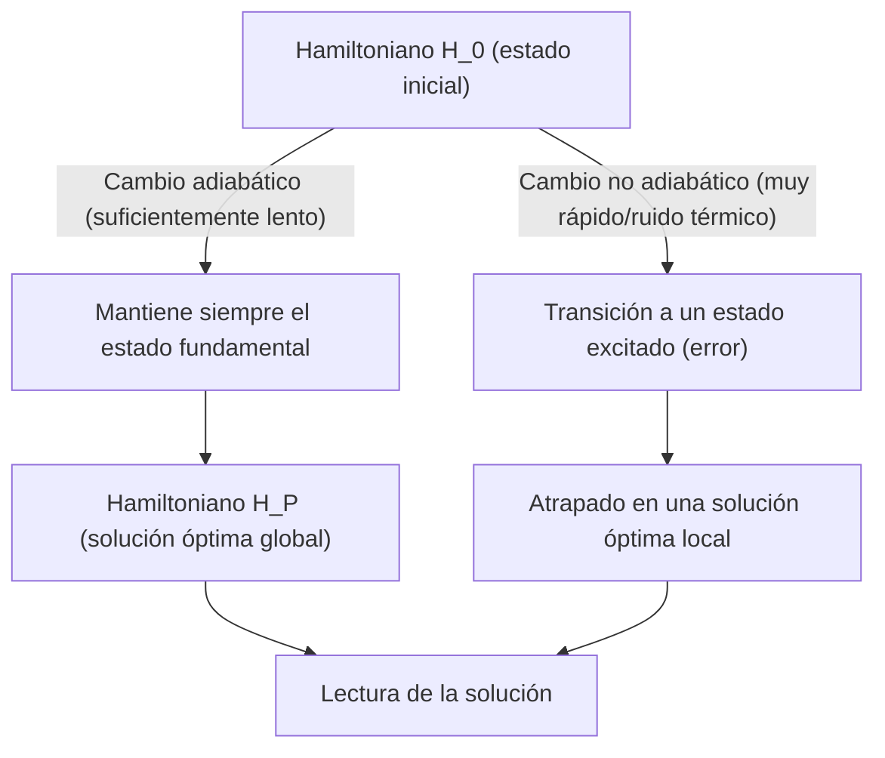
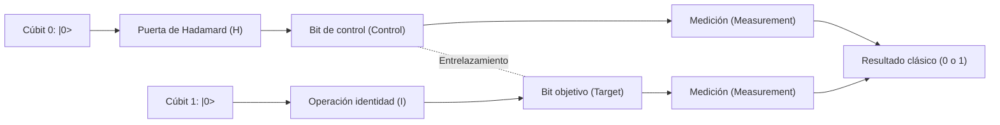
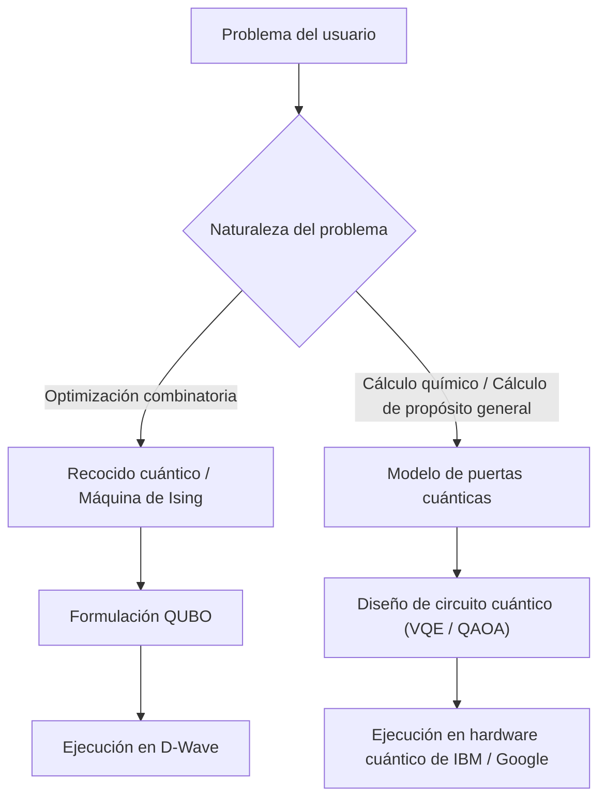

# Explicación sencilla sobre la diferencia entre el recocido cuántico y el modelo de puertas cuánticas

La computación cuántica es una tecnología de cálculo de próxima generación que tiene el potencial de resolver exponencialmente más rápido problemas específicos que tomarían una enorme cantidad de tiempo en las computadoras clásicas modernas (incluidas las supercomputadoras convencionales), utilizando principios de la mecánica cuántica (superposición y entrelazamiento cuántico).

Actualmente, como enfoques para hacer realidad las computadoras cuánticas, existen principalmente dos paradigmas principales: el **"Recocido cuántico" (Quantum Annealing)** y el **"Modelo de puertas cuánticas" (Quantum Gate Model)**. Estos dos métodos difieren enormemente en el enfoque físico subyacente, las tareas de cálculo en las que sobresalen y los desafíos de hardware en su implementación.

En este artículo, compararemos y explicaremos de manera exhaustiva estos dos métodos desde una perspectiva altamente técnica y detallada, abarcando principios físicos, modelos matemáticos (modelo de Ising, QUBO, transformaciones unitarias, etc.), limitaciones técnicas actuales y casos de uso específicos.

---

## 1. Fundamentos de la computación cuántica: la diferencia fundamental con las computadoras clásicas

Las computadoras clásicas procesan la información como "bits" (Bit) que adoptan un estado de "0" o "1". Por otro lado, las computadoras cuánticas utilizan "cúbits" (Qubit). Los cúbits pueden tener probabilísticamente ambos estados, 0 y 1, al mismo tiempo, gracias al principio de "superposición" (Superposition) de la mecánica cuántica.

Además, al utilizar un fenómeno llamado "entrelazamiento cuántico" (Entanglement), los estados de múltiples cúbits se correlacionan fuertemente entre sí, de modo que una operación en un solo cúbit afecta instantáneamente a todo el sistema. Esto hace posible el procesamiento de tipo paralelo (paralelismo cuántico).

Sin embargo, los estados cuánticos son extremadamente vulnerables al ruido externo (calor, ondas electromagnéticas, etc.), y la "decoherencia" (Decoherence), por la cual el estado se destruye y vuelve a un estado clásico, es un gran desafío. Las diferencias en el enfoque de este problema de ruido conducen a grandes diferencias en la filosofía de diseño entre el recocido y el modelo de puertas.

---

## 2. Detalles del recocido cuántico (Quantum Annealing)

El recocido cuántico es una arquitectura de cálculo especializada principalmente en resolver **"problemas de optimización combinatoria"**. Se basa en la teoría propuesta en 1998 por Hidetoshi Nishimori y Tadashi Kadowaki del Instituto Tecnológico de Tokio, y se hizo ampliamente conocido después de que la empresa canadiense D-Wave Systems lo comercializara por primera vez en el mundo.

### 2.1. Mecanismo físico: modelo de Ising de campo transversal y fluctuación cuántica

El recocido cuántico utiliza para el cálculo la propiedad de los sistemas físicos en el mundo natural de intentar establecerse en el "estado de menor energía (estado fundamental)".

En el enfoque clásico del "recocido simulado", se utilizan fluctuaciones térmicas para escapar de soluciones óptimas locales (mínimos locales). Por otro lado, el recocido cuántico utiliza la "fluctuación cuántica" (Quantum Fluctuation) para atravesar barreras de energía mediante el "efecto túnel cuántico" (Quantum Tunneling), explorando de manera más eficiente la solución óptima global (mínimo global).

La evolución temporal de un sistema de recocido cuántico se describe mediante el siguiente Hamiltoniano $H(t)$ (el operador que representa la energía total del sistema).

$$ H(t) = A(t) H_0 + B(t) H_P $$

Aquí, $t$ es el tiempo, $A(t)$ es una función que disminuye gradualmente y $B(t)$ es una función que aumenta gradualmente.

- **$H_0$ (Hamiltoniano inicial)**: Representa el campo transversal (Transverse field) y genera la fluctuación cuántica.
  $$ H_0 = - \sum_{i} \sigma_i^x $$
  ($\sigma_i^x$ es la matriz X de Pauli y representa la inversión de un bit).
- **$H_P$ (Hamiltoniano del problema)**: Es el modelo de Ising que representa el problema de optimización que se desea resolver.

En el estado inicial ($t=0$), $A(0)$ es máximo, y el sistema se encuentra en el estado fundamental de $H_0$ (un estado en el que todos los estados están superpuestos por igual). A partir de ahí, con el tiempo, se debilita lentamente el campo transversal y, al mismo tiempo, se fortalece la interacción del Hamiltoniano del problema.

### 2.2. Computación cuántica adiabática (Adiabatic Quantum Computation)

Lo importante en este proceso es el **"teorema adiabático" (Adiabatic Theorem)**. Según el teorema adiabático, si un sistema cambia de manera "suficientemente lenta (adiabática)", el sistema siempre permanecerá en el estado fundamental del Hamiltoniano en ese instante.

Es decir, cuando finalmente $A(t) \to 0$ y $B(t) \to 1$, el sistema ha alcanzado el estado fundamental de $H_P$, es decir, la **"solución exacta del problema de optimización"**.

### 2.3. Mapeo de QUBO al modelo de Ising

Para resolver problemas del mundo real con un recocedor cuántico, es necesario formular el problema en el formato **QUBO (Optimización Binaria Cuadrática Sin Restricciones: Quadratic Unconstrained Binary Optimization)**.

La función objetivo de QUBO se define de la siguiente manera:
$$ \min_{x \in \{0,1\}^n} \sum_{i} Q_{ii} x_i + \sum_{i < j} Q_{ij} x_i x_j $$
Aquí, $x_i \in \{0, 1\}$ son variables binarias y $Q$ es una matriz de pesos.

Dado que el hardware (como D-Wave) maneja espines físicos (arriba/abajo), es necesario convertir las variables al modelo de Ising utilizando $\sigma_i \in \{-1, +1\}$. La ecuación de conversión es la siguiente:
$$ x_i = \frac{1 - \sigma_i}{2} \quad \text{o} \quad \sigma_i = 1 - 2x_i $$

Sustituyendo esto en la ecuación QUBO y simplificando, se obtiene el Hamiltoniano $H_P$ del modelo de Ising:
$$ H_P = - \sum_{i<j} J_{ij} \sigma_i^z \sigma_j^z - \sum_{i} h_i \sigma_i^z $$
- $J_{ij}$: Interacción entre espines (coeficiente de acoplamiento). Fuerza de conexión entre cúbits físicos.
- $h_i$: Campo magnético local (sesgo) para cada espín.

### 2.4. Hardware de recocido cuántico y desafíos (ejemplo de D-Wave)

Los procesadores cuánticos de D-Wave se realizan utilizando dispositivos superconductores de interferencia cuántica (SQUID). Las conexiones entre cúbits físicos dependen del cableado del hardware y no están totalmente conectadas (un estado en el que todos los bits están conectados entre sí).
Aunque la conectividad ha mejorado evolucionando de la estructura inicial "Chimera graph" a "Pegasus" y "Zephyr graph", todavía existen limitaciones.

Por lo tanto, se necesita un proceso llamado **"Incrustación menor" (Minor Embedding)**, que mapea problemas con estructuras de grafos complejas en grafos físicos. Dado que esto representa una variable lógica utilizando múltiples cúbits físicos (una cadena), el número de cúbits efectivos utilizables disminuye y existe el problema de que la precisión del cálculo se reduce.

---

## 3. Detalles del modelo de puertas cuánticas (Quantum Gate Model)

El modelo de puertas cuánticas es una extensión en mecánica cuántica de las puertas lógicas de las computadoras clásicas (AND, OR, NOT, etc.) y es una arquitectura que permite la **"computación cuántica universal" (Universal Quantum Computation)**. Muchas empresas, como IBM, Google, Rigetti e IonQ, han adoptado este modelo.

### 3.1. Transformación unitaria y vector de estado

En el modelo de puertas cuánticas, el estado completo del sistema de cúbits se representa como un "vector de estado" (State Vector) $|\psi\rangle$. El estado de 1 cúbit se expresa como una combinación lineal de los estados fundamentales $|0\rangle$ y $|1\rangle$ de la siguiente manera:
$$ |\psi\rangle = \alpha |0\rangle + \beta |1\rangle $$
Aquí, $\alpha$ y $\beta$ son amplitudes de probabilidad complejas y satisfacen $|\alpha|^2 + |\beta|^2 = 1$. Geométricamente, este estado se visualiza como un punto en la "esfera de Bloch" (Bloch Sphere).

Los pasos del cálculo cuántico se describen como la aplicación de un **operador unitario (Unitary Operator) $U$** al vector de estado. Una matriz unitaria tiene la propiedad $U^\dagger U = I$ (el producto con su conjugado hermítico es la matriz identidad), y es una operación reversible correspondiente a la evolución temporal de la ecuación de Schrödinger en mecánica cuántica.
$$ |\psi_{t+1}\rangle = U_t |\psi_t\rangle $$

### 3.2. Puertas cuánticas básicas y modelo de circuitos

Un algoritmo de cálculo cuántico se diseña como una secuencia de puertas cuánticas (un circuito cuántico).

- **Puertas de Pauli (X, Y, Z)**: Rotación de 180 grados alrededor de cada eje en la esfera de Bloch. La puerta X equivale a la puerta NOT clásica.
- **Puerta de Hadamard (H)**: Transforma $|0\rangle$ en $\frac{|0\rangle + |1\rangle}{\sqrt{2}}$, creando un estado de superposición.
  $$ H = \frac{1}{\sqrt{2}} \begin{pmatrix} 1 & 1 \\ 1 & -1 \end{pmatrix} $$
- **Puerta CNOT (Controlled-NOT)**: Puerta de 2 cúbits. Aplica la puerta X al bit objetivo solo cuando el bit de control es $|1\rangle$. Esto genera entrelazamiento cuántico (Entanglement).

Cualquier algoritmo cuántico puede expresarse aproximadamente por una combinación de un pequeño número de puertas de 1 cúbit y puertas CNOT (conjunto de puertas universales).

### 3.3. Corrección de errores y el camino desde NISQ hasta FTQC

El mayor desafío del modelo de puertas cuánticas es la "decoherencia", en la cual los estados cuánticos son destruidos por el ruido. A medida que aumenta la profundidad de los pasos de cálculo (profundidad de las puertas), los errores se acumulan.

Para realizar cálculos ideales, la **corrección de errores cuánticos (Quantum Error Correction)** es indispensable. Por ejemplo, en métodos como el "código de superficie" (Surface Code), múltiples cúbits físicos se agrupan para formar un único "cúbit lógico" (Logical Qubit) libre de errores. Sin embargo, para crear un solo cúbit lógico se requieren de miles a decenas de miles de cúbits físicos, lo que genera una enorme sobrecarga.

La etapa en la que nos encontramos actualmente es la era de los dispositivos **NISQ (Noisy Intermediate-Scale Quantum)** de decenas a cientos de cúbits sin corrección de errores. Se necesitan muchos avances para lograr la **FTQC (Computación Cuántica Tolerante a Fallos: Fault-Tolerant Quantum Computing)** equipada con una corrección de errores completa.

---

## 4. Resumen de la comparación técnica y matemática

Comparamos las diferencias fundamentales entre ambas arquitecturas.

| Aspecto de comparación | Recocido cuántico (Quantum Annealing) | Modelo de puertas cuánticas (Gate Model) |
| :--- | :--- | :--- |
| **Modelo de cálculo** | Computación cuántica adiabática (evolución temporal continua del Hamiltoniano) | Transformación unitaria (secuencia discreta de operaciones de puertas) |
| **Problemas adecuados** | Problemas de optimización combinatoria (QUBO, modelo de Ising) | Universal (simulación de química cuántica, factorización de enteros, búsqueda, etc.) |
| **Capacidad de representación** | Optimización heurística (solución aproximada) | Equivalente a la máquina de Turing cuántica universal (en teoría, todos los cálculos son posibles) |
| **Ejemplos de implementación** | D-Wave Systems | IBM, Google, Quantinuum, IonQ, etc. |
| **Tolerancia al ruido** | Relativamente fuerte (permanece cerca del estado fundamental, tolera cierto ruido térmico) | Muy débil (el mínimo ruido desfasará y destruirá los resultados del cálculo) |
| **Escalabilidad** | Escala de miles a decenas de miles de cúbits (depende de la estructura física. Difícil de hacer bits lógicos) | Escala de cientos de cúbits (para FTQC se necesita una escala de millones) |

El recocido cuántico, como "coprocesador de propósito específico", es adecuado para resolver problemas de optimización complementando los límites de las computadoras clásicas. Por otro lado, el modelo de puertas cuánticas es la versión cuántica de una "computadora de propósito general" y, en última instancia, busca una capacidad de cálculo que supere a las computadoras clásicas (supremacía cuántica), pero la construcción del hardware es extremadamente difícil.

---

## 5. Limitaciones y desafíos actuales

### Limitaciones del recocido cuántico
1. **Restricciones de conectividad (Connectivity)**: Debido a la incrustación menor mencionada anteriormente, la cantidad de cúbits físicos necesarios aumenta exponencialmente a medida que crece el tamaño del problema.
2. **Precisión de los coeficientes (Precision)**: Los errores físicos al configurar parámetros analógicos como $J_{ij}$ y $h_i$ en el hardware están directamente relacionados con la calidad de la solución.
3. **Temperatura y transición no adiabática**: Dado que la temperatura del sistema no es el cero absoluto, existe la probabilidad de desviarse de la solución óptima debido a la excitación térmica.

### Limitaciones del modelo de puertas cuánticas
1. **Tiempo de coherencia (Coherence Time)**: El tiempo que se puede mantener un estado cuántico es de solo unos pocos microsegundos a milisegundos, limitando estrictamente el número de puertas (profundidad del circuito) que se pueden ejecutar en ese tiempo.
2. **Fidelidad de puerta (Gate Fidelity)**: La tasa de error en las operaciones de puertas de 2 cúbits (como CNOT) aún no es lo suficientemente baja (generalmente alrededor del 99.x%). Para hacer realidad la FTQC, esto debe elevarse al 99.99% o más.
3. **Volumen cuántico (Quantum Volume)**: El mayor desafío actual es escalar no solo el número de cúbits, sino la capacidad de cálculo efectiva (volumen cuántico) teniendo en cuenta las interconexiones y la tasa de error.

---

## 6. Casos de uso específicos y algoritmos

Veamos áreas de aplicación específicas en las que cada método sobresale.

### 6.1. Casos de uso del recocido cuántico
- **Logística y enrutamiento**: Optimización de rutas de entrega de muchos vehículos (variación del problema del viajante de comercio). Búsqueda de rutas en tiempo real considerando congestiones de tráfico.
- **Ingeniería financiera**: Optimización de carteras. Búsqueda de combinaciones de valores que maximicen los rendimientos mientras minimizan los riesgos.
- **Aprendizaje automático**: Selección de características (Feature Selection). Extracción de la combinación de variables que más contribuye a la predicción a partir de enormes conjuntos de datos.
- **Manufactura**: Problemas de programación de trabajos en fábricas (qué máquina procesa qué piezas y en qué orden es el más rápido).

### 6.2. Casos de uso del modelo de puertas cuánticas
- **Simulación de química cuántica**: Simulaciones de alta precisión de estados de energía moleculares y reacciones químicas.
- **Factorización de enteros (Algoritmo de Shor)**: Algoritmo que factoriza números compuestos enormes en tiempo polinomial. Si esto se vuelve práctico, las infraestructuras de criptografía de clave pública actuales como RSA se romperían, por lo que la transición a la criptografía poscuántica (PQC) es urgente.
- **Búsqueda en bases de datos (Algoritmo de Grover)**: Al buscar datos objetivo en una base de datos no ordenada, las computadoras clásicas requieren pasos $O(N)$, pero el algoritmo de Grover puede buscar en pasos $O(\sqrt{N})$.

### 6.3. Algoritmos híbridos en la era NISQ: VQE y QAOA
Para superar la limitación de los circuitos cuánticos poco profundos de los dispositivos NISQ, están ganando atención los "algoritmos cuánticos variacionales" (Variational Quantum Algorithms), que combinan las ventajas de las computadoras cuánticas y clásicas.

- **VQE (Solucionador propio cuántico variacional: Variational Quantum Eigensolver)**: Algoritmo para encontrar la energía del estado fundamental de las moléculas. Prepara estados cuánticos usando un circuito cuántico parametrizado (Ansatz) y mide el valor esperado de energía $\langle \psi(\theta) | H | \psi(\theta) \rangle$. Usando este valor esperado como función objetivo, actualiza el parámetro $\theta$ mediante un algoritmo de optimización clásico (como el descenso de gradiente). Repitiendo esto hasta que converja, encuentra el estado de energía preciso de la molécula.
- **QAOA (Algoritmo de optimización cuántica aproximada: Quantum Approximate Optimization Algorithm)**: Algoritmo que resuelve problemas de optimización combinatoria utilizando el modelo de puertas cuánticas. Aproxima la evolución temporal adiabática del recocido cuántico a operaciones de puertas discretas mediante "Trotterización" (Trotterization), y obtiene una solución aproximada aplicando el Hamiltoniano alternativamente. QAOA se considera un medio prometedor para resolver problemas de optimización con el modelo de puertas.

---

## 7. Conclusión

Tanto el recocido cuántico como el modelo de puertas cuánticas son iguales en el sentido de que utilizan las misteriosas propiedades de la mecánica cuántica como recursos computacionales, pero sus enfoques y objetivos finales son muy diferentes.

- **El recocido cuántico** es un "motor heurístico especializado" para producir resultados prácticos en una etapa temprana para problemas reales específicos llamados optimización combinatoria. Actualmente, varias empresas ya están avanzando en pruebas de concepto (PoC).
- **El modelo de puertas cuánticas** es una "computadora cuántica de propósito general" con el potencial de alterar fundamentalmente los paradigmas de las ciencias de la computación, desde simulaciones rigurosas en física y química hasta descifrado de códigos. Sin embargo, requiere de investigación y desarrollo a largo plazo para superar el enorme obstáculo de la corrección de errores.

En el futuro, se espera que se construya un entorno de **"computación heterogénea" (Heterogeneous Computing)**, donde las supercomputadoras clásicas (HPC) sean el núcleo, mientras que las máquinas de recocido se invoquen para tareas de optimización, y las computadoras cuánticas de tipo puerta para cálculos de química cuántica.

Las computadoras cuánticas aún son una tecnología en desarrollo, pero están experimentando rápidos avances tanto en hardware como en algoritmos. Comprender las matemáticas del modelo de Ising y los conceptos básicos de los circuitos cuánticos será una gran ventaja para la próxima era nativa cuántica.

---
*Este artículo es una explicación exhaustiva desde los conceptos básicos de la computación cuántica hasta las últimas tendencias de hardware. Continúe prestando atención a las futuras tendencias de investigación.*
