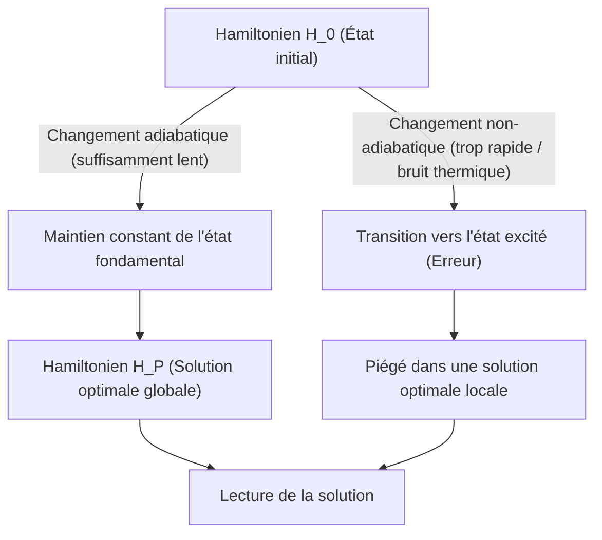
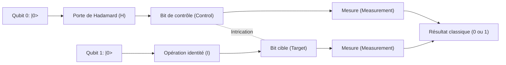
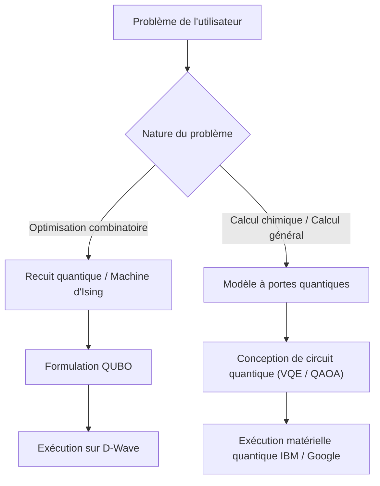

# Différence entre le recuit quantique et le modèle à portes quantiques expliquée simplement

L'informatique quantique est une technologie de calcul de nouvelle génération qui a le potentiel de résoudre des problèmes spécifiques, nécessitant un temps énorme pour les ordinateurs classiques actuels (y compris les superordinateurs conventionnels), de manière exponentiellement plus rapide en utilisant les principes de la mécanique quantique (superposition et intrication quantique).

Actuellement, il existe deux principaux paradigmes d'approche pour la réalisation des ordinateurs quantiques : **"le recuit quantique (Quantum Annealing)"** et **"le modèle à portes quantiques (Quantum Gate Model)"**. Ces deux méthodes diffèrent considérablement dans leurs approches physiques sous-jacentes, les tâches de calcul dans lesquelles elles excellent, et les défis matériels liés à leur mise en œuvre.

Cet article compare et explique ces deux méthodes en profondeur, depuis une perspective hautement détaillée et technique, abordant les principes physiques, les modèles mathématiques (modèle d'Ising, QUBO, transformations unitaires, etc.), les limites technologiques actuelles, jusqu'aux cas d'utilisation spécifiques.

---

## 1. Fondements du calcul quantique : Différences fondamentales avec les ordinateurs classiques

Les ordinateurs classiques traitent l'information sous forme de "bits (Bit)" qui prennent l'état "0" ou "1". En revanche, les ordinateurs quantiques utilisent des "qubits (Qubit)". Grâce au principe de "superposition (Superposition)" de la mécanique quantique, un qubit peut posséder simultanément et de manière probabiliste les états 0 et 1.

De plus, en utilisant un phénomène appelé "intrication quantique (Entanglement)", les états de plusieurs qubits deviennent fortement corrélés, de sorte qu'une opération sur un qubit affecte instantanément l'ensemble du système. Cela permet des calculs de type traitement parallèle (parallélisme quantique).

Cependant, les états quantiques sont extrêmement vulnérables aux bruits externes (chaleur, ondes électromagnétiques, etc.), et le phénomène de "décohérence (Decoherence)", où l'état se brise et revient à un état classique, constitue un défi majeur. La différence dans l'approche de ce problème de bruit conduit à une grande différence dans la philosophie de conception entre le recuit et le modèle à portes.

---

## 2. Détails du recuit quantique (Quantum Annealing)

Le recuit quantique est une architecture de calcul spécialisée principalement dans la résolution de **"problèmes d'optimisation combinatoire"**. Il est basé sur une théorie proposée en 1998 par Manpei Kadowaki et Hidetoshi Nishimori de l'Institut de Technologie de Tokyo (Tokyo Tech), et est devenu largement connu lorsque l'entreprise canadienne D-Wave Systems l'a commercialisé pour la première fois au monde.

### 2.1. Mécanisme physique : Modèle d'Ising en champ transverse et fluctuations quantiques

Le recuit quantique utilise la propriété des systèmes physiques naturels qui tendent à s'installer dans "l'état d'énergie le plus bas (état fondamental)" pour effectuer des calculs.

Dans l'approche classique du "recuit simulé (Simulated Annealing)", les fluctuations thermiques sont utilisées pour échapper aux solutions optimales locales (minimums locaux). En revanche, le recuit quantique utilise les "fluctuations quantiques (Quantum Fluctuation)" pour traverser les barrières d'énergie grâce à "l'effet tunnel quantique (Quantum Tunneling)", explorant ainsi plus efficacement la solution optimale globale (minimum global).

L'évolution temporelle du système de recuit quantique est décrite par le Hamiltonien suivant (l'opérateur représentant l'énergie totale du système) $H(t)$.

$$ H(t) = A(t) H_0 + B(t) H_P $$

Ici, $t$ est le temps, $A(t)$ est une fonction décroissante progressivement, et $B(t)$ est une fonction croissante progressivement.

- **$H_0$ (Hamiltonien initial)** : Représente le champ transverse (Transverse field) et génère les fluctuations quantiques.
  $$ H_0 = - \sum_{i} \sigma_i^x $$
  ($\sigma_i^x$ est la matrice de Pauli X, représentant l'inversion du bit.)
- **$H_P$ (Hamiltonien du problème)** : Le modèle d'Ising (Ising Model) représentant le problème d'optimisation à résoudre.

À l'état initial ($t=0$), $A(0)$ est au maximum, et le système est dans l'état fondamental de $H_0$ (un état où tous les états sont superposés de manière égale). À partir de là, on affaiblit lentement le champ transverse au fil du temps, tout en renforçant simultanément l'interaction du Hamiltonien du problème.

### 2.2. Calcul quantique adiabatique (Adiabatic Quantum Computation)

Ce qui est important dans ce processus, c'est le **"Théorème adiabatique (Adiabatic Theorem)"**. Selon le théorème adiabatique, si le système est modifié "suffisamment lentement (adiabatiquement)", le système restera toujours dans l'état fondamental du Hamiltonien à chaque instant.

En d'autres termes, lorsque finalement $A(t) \to 0$ et $B(t) \to 1$, le système a atteint l'état fondamental de $H_P$, c'est-à-dire **"la solution exacte du problème d'optimisation"**.

### 2.3. Cartographie de QUBO au modèle d'Ising

Pour résoudre des problèmes du monde réel avec un recuiseur quantique, le problème doit être formulé sous la forme **QUBO (Quadratic Unconstrained Binary Optimization : Optimisation binaire quadratique sans contrainte)**.

La fonction objectif de QUBO est définie comme suit.
$$ \min_{x \in \{0,1\}^n} \sum_{i} Q_{ii} x_i + \sum_{i < j} Q_{ij} x_i x_j $$
Ici, $x_i \in \{0, 1\}$ sont des variables binaires, et $Q$ est la matrice de poids.

Étant donné que le matériel (comme D-Wave) gère des spins physiques (vers le haut / vers le bas), il est nécessaire de convertir les variables en un modèle d'Ising utilisant $\sigma_i \in \{-1, +1\}$. La formule de conversion est la suivante.
$$ x_i = \frac{1 - \sigma_i}{2} \quad \text{ou} \quad \sigma_i = 1 - 2x_i $$

En substituant cela dans l'équation de QUBO et en simplifiant, on obtient le Hamiltonien $H_P$ du modèle d'Ising.
$$ H_P = - \sum_{i<j} J_{ij} \sigma_i^z \sigma_j^z - \sum_{i} h_i \sigma_i^z $$
- $J_{ij}$ : Interaction entre les spins (coefficient de couplage). La force de couplage entre les qubits physiques.
- $h_i$ : Champ magnétique local (biais) pour chaque spin.

### 2.4. Matériel et défis du recuit quantique (L'exemple de D-Wave)

Les processeurs quantiques de D-Wave sont réalisés à l'aide de dispositifs supraconducteurs à interférence quantique (SQUID). Le couplage entre les qubits physiques dépend du câblage matériel et n'est pas un couplage complet (un état où tous les bits sont interconnectés).
Évoluant du "Graphe Chimera (Chimera graph)" initial, au "Graphe Pegasus (Pegasus)" puis au "Graphe Zephyr (Zephyr)", la connectivité s'est améliorée, mais il reste encore des limitations.

Par conséquent, un processus appelé **"Plongement mineur (Minor Embedding)"** est nécessaire pour cartographier un problème avec une structure de graphe complexe sur le graphe physique. Étant donné que cela utilise plusieurs qubits physiques (une chaîne) pour représenter une variable logique, il y a le problème que le nombre effectif de qubits utilisables diminue, ce qui entraîne une réduction de la précision de calcul.

---

## 3. Détails du modèle à portes quantiques (Quantum Gate Model)

Le modèle à portes quantiques est une extension mécanique quantique des portes logiques des ordinateurs classiques (AND, OR, NOT, etc.), et est une architecture qui permet le **"Calcul Quantique Universel (Universal Quantum Computation)"**. De nombreuses entreprises comme IBM, Google, Rigetti et IonQ ont adopté cette approche.

### 3.1. Transformation unitaire et vecteur d'état

Dans le modèle à portes quantiques, l'état de l'ensemble du système de qubits est représenté comme un "Vecteur d'état (State Vector)" $|\psi\rangle$. L'état d'un qubit unique est exprimé par la combinaison linéaire des états de base $|0\rangle$ et $|1\rangle$ comme suit.
$$ |\psi\rangle = \alpha |0\rangle + \beta |1\rangle $$
Ici, $\alpha$ et $\beta$ sont des amplitudes de probabilité complexes, satisfaisant $|\alpha|^2 + |\beta|^2 = 1$. Cet état est géométriquement visualisé comme un point sur la "Sphère de Bloch (Bloch Sphere)".

L'étape de calcul quantique est décrite comme l'application d'un **opérateur unitaire (Unitary Operator) $U$** au vecteur d'état. Une matrice unitaire a la propriété que $U^\dagger U = I$ (le produit avec son conjugué hermitien donne la matrice identité), ce qui est une opération réversible correspondant à l'évolution temporelle de l'équation de Schrödinger en mécanique quantique.
$$ |\psi_{t+1}\rangle = U_t |\psi_t\rangle $$

### 3.2. Portes quantiques de base et modèle de circuit

L'algorithme de calcul quantique est conçu comme une séquence de portes quantiques (circuit quantique).

- **Portes de Pauli (X, Y, Z)** : Rotation de 180 degrés autour de chaque axe sur la sphère de Bloch. La porte X équivaut à la porte NOT classique.
- **Porte de Hadamard (H)** : Transforme $|0\rangle$ en $\frac{|0\rangle + |1\rangle}{\sqrt{2}}$, créant un état de superposition.
  $$ H = \frac{1}{\sqrt{2}} \begin{pmatrix} 1 & 1 \\ 1 & -1 \end{pmatrix} $$
- **Porte CNOT (Controlled-NOT)** : Porte à 2 qubits. Applique une porte X au bit cible uniquement lorsque le bit de contrôle est $|1\rangle$. Cela génère l'intrication quantique (Entanglement).

Tout algorithme quantique peut être exprimé de manière approximative par une combinaison d'un petit nombre de portes à 1 qubit et de portes CNOT (ensemble de portes universelles).

### 3.3. Correction d'erreurs et le chemin de NISQ à FTQC

Le plus grand défi du modèle à portes quantiques est la "décohérence", où l'état quantique est détruit par le bruit. À mesure que les étapes de calcul (profondeur de circuit) s'allongent, les erreurs s'accumulent.

Pour effectuer des calculs idéaux, la **correction d'erreurs quantiques (Quantum Error Correction)** est essentielle. Par exemple, avec des méthodes comme le "Code de surface (Surface Code)", plusieurs qubits physiques sont regroupés pour former un seul "qubit logique (Logical Qubit)" sans erreur. Cependant, la création d'un qubit logique nécessite des milliers à des dizaines de milliers de qubits physiques, ce qui entraîne une énorme surcharge.

L'étape à laquelle nous nous trouvons actuellement est l'ère des dispositifs **NISQ (Noisy Intermediate-Scale Quantum)** de plusieurs dizaines à centaines de qubits sans correction d'erreurs. La réalisation d'un **FTQC (Fault-Tolerant Quantum Computing : Calcul quantique tolérant aux pannes)** avec une correction d'erreurs complète nécessite encore de nombreuses percées.

---

## 4. Résumé de la comparaison technique et mathématique

Comparaison des différences fondamentales entre les deux architectures.

| Élément de comparaison | Recuit quantique (Quantum Annealing) | Modèle à portes quantiques (Gate Model) |
| :--- | :--- | :--- |
| **Modèle de calcul** | Calcul quantique adiabatique (évolution temporelle continue du Hamiltonien) | Transformation unitaire (séquence d'opérations de portes discrètes) |
| **Problèmes adaptés** | Problèmes d'optimisation combinatoire (QUBO, modèle d'Ising) | Universel (simulation de chimie quantique, factorisation en nombres premiers, recherche, etc.) |
| **Capacité d'expression** | Optimisation heuristique (solution approximative) | Équivalent à la machine de Turing quantique universelle (tout calcul est théoriquement possible) |
| **Exemples d'implémentation** | D-Wave Systems | IBM, Google, Quantinuum, IonQ, etc. |
| **Tolérance au bruit** | Relativement forte (car il reste près de l'état fondamental, un certain niveau de bruit thermique est tolérable) | Très faible (un léger bruit décale la phase et détruit le résultat du calcul) |
| **Évolutivité** | Échelle de milliers à dizaines de milliers de qubits (dépend de la structure physique. La création de bits logiques est difficile) | Échelle de centaines de qubits (nécessite une échelle de millions pour le FTQC) |

Le recuit quantique est adapté à la résolution de problèmes d'optimisation en tant que "coprocesseur spécifique" complétant les limites des ordinateurs classiques. D'autre part, le modèle à portes quantiques est la version quantique de l'"ordinateur polyvalent", et vise ultimement à une capacité de calcul qui surpasse les ordinateurs classiques (suprématie quantique), mais la construction du matériel est extrêmement difficile.

---

## 5. Limites et défis actuels

### Limites du recuit quantique
1. **Limitation de la connectivité (Connectivity)** : En raison du plongement mineur mentionné précédemment, lorsque la taille du problème augmente, le nombre de qubits physiques nécessaires augmente de manière exponentielle.
2. **Précision des coefficients (Precision)** : L'erreur physique lors du réglage des paramètres analogiques tels que $J_{ij}$ et $h_i$ sur le matériel affecte directement la qualité de la solution.
3. **Température et transitions non-adiabatiques** : Étant donné que la température du système n'est pas au zéro absolu, il y a une probabilité de s'écarter de la solution optimale en raison de l'excitation thermique.

### Limites du modèle à portes quantiques
1. **Temps de cohérence (Coherence Time)** : Le temps pendant lequel un état quantique peut être maintenu n'est que de quelques microsecondes à quelques millisecondes, ce qui limite sévèrement le nombre de portes (profondeur de circuit) pouvant être exécutées pendant ce temps.
2. **Fidélité des portes (Gate Fidelity)** : Le taux d'erreur de fonctionnement des portes à 2 qubits (CNOT, etc.) n'est toujours pas suffisamment bas (généralement autour de 99.x%). Pour réaliser le FTQC, cela doit être élevé à plus de 99.99%.
3. **Volume quantique (Quantum Volume)** : Le plus grand défi actuel est de mettre à l'échelle non seulement le nombre de qubits, mais aussi la capacité de calcul effective (volume quantique), qui tient compte de l'interconnexion et des taux d'erreur.

---

## 6. Cas d'utilisation spécifiques et algorithmes

Examinons les domaines d'application spécifiques dans lesquels chaque méthode excelle.

### 6.1. Cas d'utilisation du recuit quantique
- **Logistique et Routage** : Optimisation des itinéraires de livraison pour de multiples véhicules (une variation du problème du voyageur de commerce). Recherche d'itinéraire en temps réel tenant compte des embouteillages.
- **Ingénierie financière** : Optimisation de portefeuille. Recherche d'une combinaison de titres qui maximise le rendement tout en minimisant les risques.
- **Apprentissage automatique** : Sélection de caractéristiques (Feature Selection). Extraction de la combinaison de variables contribuant le plus à la prédiction à partir d'ensembles de données massifs.
- **Industrie manufacturière** : Problème d'ordonnancement d'atelier (Job-shop scheduling) dans les usines (quelle machine doit traiter quelle pièce et dans quel ordre pour être le plus rapide).

### 6.2. Cas d'utilisation du modèle à portes quantiques
- **Simulation de chimie quantique** : Simule les états énergétiques des molécules et les réactions chimiques avec une grande précision.
- **Factorisation en nombres premiers (Algorithme de Shor)** : Un algorithme qui factorise d'énormes nombres composés en temps polynomial. Lorsque cela sera mis en pratique, les infrastructures de cryptographie à clé publique actuelles, telles que le chiffrement RSA, seront compromises, rendant la transition vers la cryptographie post-quantique (PQC) urgente.
- **Recherche dans une base de données (Algorithme de Grover)** : Lors de la recherche de données cibles dans une base de données non triée, les ordinateurs classiques nécessitent $O(N)$ étapes, mais l'algorithme de Grover peut effectuer la recherche en $O(\sqrt{N})$ étapes.

### 6.3. Algorithmes hybrides de l'ère NISQ : VQE et QAOA
Pour surmonter la limitation des circuits quantiques peu profonds des dispositifs NISQ, les "Algorithmes quantiques variationnels (Variational Quantum Algorithms)", qui combinent les avantages des ordinateurs quantiques et classiques, attirent l'attention.

- **VQE (Variational Quantum Eigensolver)** : Algorithme pour trouver l'énergie de l'état fondamental d'une molécule. Il prépare un état quantique à l'aide d'un circuit quantique paramétré (Ansatz) et mesure l'espérance de l'énergie $\langle \psi(\theta) | H | \psi(\theta) \rangle$. En utilisant cette espérance comme fonction objectif, un algorithme d'optimisation classique (comme la descente de gradient) est utilisé pour mettre à jour les paramètres $\theta$. En répétant cela jusqu'à convergence, l'état énergétique précis de la molécule est trouvé.
- **QAOA (Quantum Approximate Optimization Algorithm)** : Algorithme pour résoudre des problèmes d'optimisation combinatoire à l'aide du modèle à portes quantiques. L'évolution temporelle adiabatique du recuit quantique est approximée en opérations de portes discrètes par la "Trotterisation (Trotterization)", et une solution approximative est obtenue en appliquant alternativement des Hamiltoniens. Le QAOA est prometteur comme un moyen puissant de résoudre des problèmes d'optimisation avec la méthode des portes.

---

## 7. Conclusion

Le recuit quantique et le modèle à portes quantiques sont identiques en ce sens qu'ils utilisent tous deux les propriétés mystérieuses de la mécanique quantique comme ressources de calcul, mais leurs approches et leurs objectifs sont très différents.

- **Le recuit quantique** est un "moteur heuristique spécialisé" conçu pour fournir des résultats pratiques à un stade précoce pour le problème réel spécifique de l'optimisation combinatoire. Actuellement, des démonstrations de faisabilité (PoC) sont déjà en cours par diverses entreprises.
- **Le modèle à portes quantiques** est un "ordinateur quantique universel" qui a le potentiel de renverser fondamentalement les paradigmes de la science informatique, des simulations rigoureuses en physique et chimie jusqu'au décryptage. Cependant, une recherche et développement à long terme est nécessaire pour surmonter l'énorme obstacle de la correction d'erreurs.

À l'avenir, il est attendu qu'un environnement de **"Calcul hétérogène (Heterogeneous computing)"** sera construit, où un superordinateur classique (HPC) servira de noyau, tout en faisant appel à des machines de recuit pour les tâches d'optimisation et à des ordinateurs quantiques de type porte pour les calculs de chimie quantique.

Les ordinateurs quantiques sont encore une technologie en développement, mais ils évoluent rapidement tant au niveau du matériel que des algorithmes. Comprendre les mathématiques du modèle d'Ising et les bases des circuits quantiques sera une arme majeure pour la prochaine ère quantique native.

---
*Cet article explique de manière exhaustive les concepts fondamentaux de l'informatique quantique jusqu'aux dernières tendances matérielles. Restez à l'écoute des futures tendances de recherche.*
