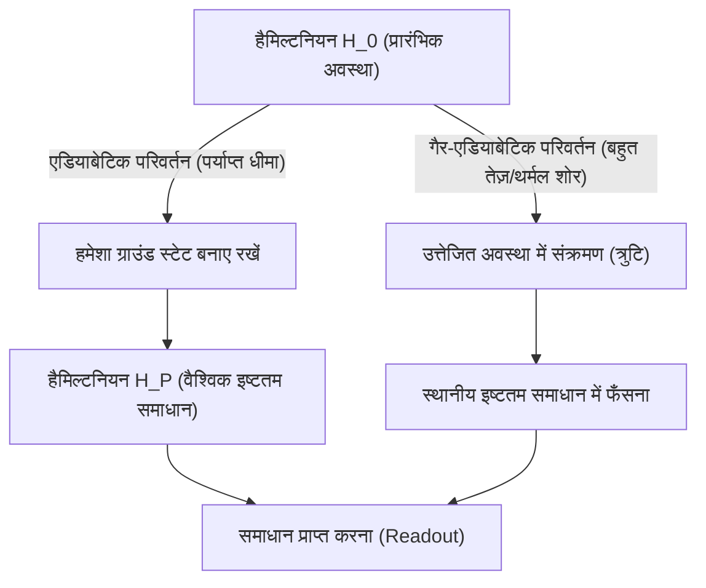
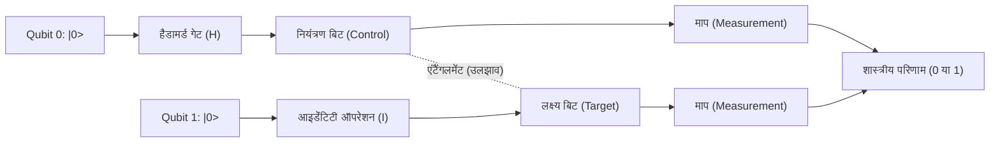
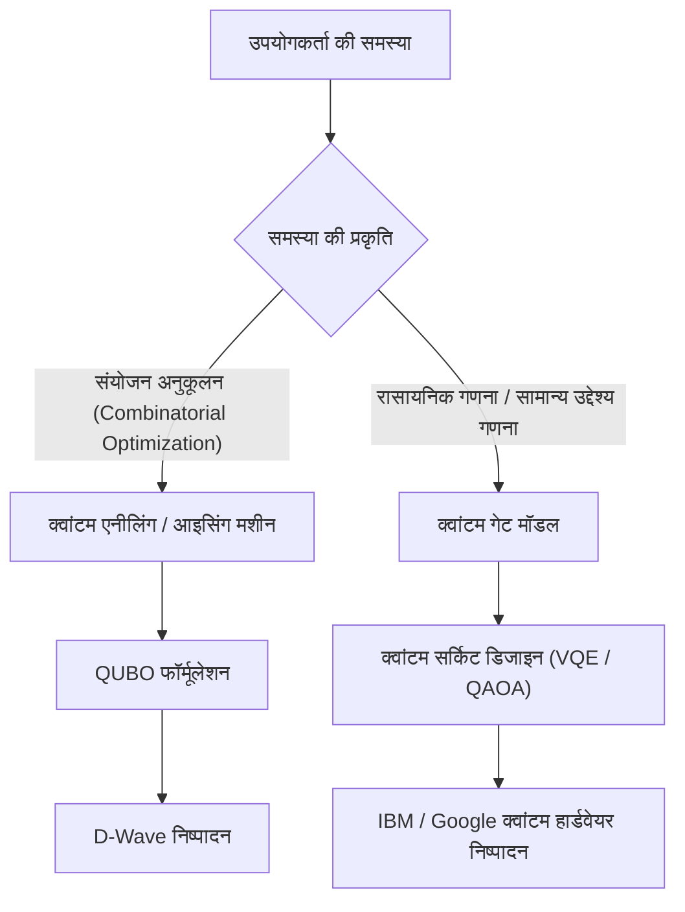

# क्वांटम एनीलिंग और क्वांटम गेट मॉडल के बीच का अंतर आसानी से समझाया गया

क्वांटम कंप्यूटिंग एक अगली पीढ़ी की कंप्यूटिंग तकनीक है जो क्वांटम मैकेनिकल सिद्धांतों (सुपरपोजिशन और क्वांटम एंटैंगलमेंट) का उपयोग करके उन विशिष्ट समस्याओं को बहुत तेज़ी से हल करने की क्षमता रखती है जिन्हें हल करने में आधुनिक शास्त्रीय कंप्यूटर (पारंपरिक सुपर कंप्यूटर सहित) को भारी समय लगता है।

वर्तमान में, क्वांटम कंप्यूटर को साकार करने के दृष्टिकोण को मोटे तौर पर दो मुख्य प्रतिमानों (पैराडाइम) में बांटा गया है: **"क्वांटम एनीलिंग (Quantum Annealing)"** और **"क्वांटम गेट मॉडल (Quantum Gate Model)"**। ये दो विधियां अपने अंतर्निहित भौतिक दृष्टिकोण, उन गणना कार्यों जिनमें वे उत्कृष्टता प्राप्त करते हैं, और कार्यान्वयन में हार्डवेयर चुनौतियों के मामले में बहुत भिन्न हैं।

इस लेख में, हम इन दो विधियों की भौतिक सिद्धांतों, गणितीय मॉडलों (आइसिंग मॉडल, QUBO, यूनिटरी ट्रांसफॉर्मेशन आदि), वर्तमान तकनीकी सीमाओं और विशिष्ट उपयोग के मामलों तक, बहुत विस्तृत और तकनीकी दृष्टिकोण से पूरी तरह से तुलना और व्याख्या करेंगे।

---

## 1. क्वांटम कंप्यूटिंग के मूल तत्व: शास्त्रीय कंप्यूटरों से बुनियादी अंतर

शास्त्रीय कंप्यूटर सूचनाओं को "बिट्स (Bits)" के रूप में प्रोसेस करते हैं, जो "0" या "1" की स्थिति लेते हैं। दूसरी ओर, क्वांटम कंप्यूटर "क्वांटम बिट्स (Qubits)" का उपयोग करते हैं। क्वांटम यांत्रिकी के "सुपरपोजिशन (Superposition)" के सिद्धांत के कारण क्वांटम बिट्स एक साथ संभावित रूप से 0 और 1 दोनों की स्थिति में हो सकते हैं।

इसके अलावा, "क्वांटम एंटैंगलमेंट (Entanglement)" नामक घटना का उपयोग करके, कई क्वांटम बिट्स की स्थितियाँ एक दूसरे के साथ मजबूती से सहसंबद्ध हो जाती हैं, और एक क्वांटम बिट पर किया गया कोई भी ऑपरेशन तुरंत पूरे सिस्टम को प्रभावित करता है। यह समानांतर प्रसंस्करण जैसी गणना (क्वांटम समानता) को सक्षम बनाता है।

हालांकि, क्वांटम अवस्था बाहरी शोर (जैसे गर्मी और विद्युत चुम्बकीय तरंगों) के प्रति बहुत संवेदनशील होती है, और "डिकोहेरेंस (Decoherence)"—जहां अवस्था टूट जाती है और एक शास्त्रीय अवस्था में लौट आती है—एक बड़ी चुनौती बन गई है। इस शोर की समस्या से निपटने के दृष्टिकोण में अंतर एनीलिंग और गेट विधियों के डिज़ाइन दर्शन में प्रमुख अंतर का कारण बना है।

---

## 2. क्वांटम एनीलिंग (Quantum Annealing) का विवरण

क्वांटम एनीलिंग एक समर्पित कंप्यूटिंग आर्किटेक्चर है जो मुख्य रूप से **"संयोजन अनुकूलन समस्याओं (Combinatorial Optimization Problems)"** को हल करने में माहिर है। यह 1998 में टोक्यो इंस्टीट्यूट ऑफ टेक्नोलॉजी के हिदेतोशी निशमोरी और मंपेई काडोवाकी द्वारा प्रस्तावित सिद्धांत पर आधारित है, और कनाडा की D-Wave Systems कंपनी द्वारा इसे दुनिया में पहली बार व्यावसायिक रूप से लॉन्च किए जाने के बाद यह व्यापक रूप से जाना जाने लगा।

### 2.1. भौतिक तंत्र: ट्रांसवर्स-फील्ड आइसिंग मॉडल और क्वांटम उतार-चढ़ाव (Quantum Fluctuation)

क्वांटम एनीलिंग इस भौतिक प्रणाली की प्रकृति का लाभ उठाता है कि प्राकृतिक दुनिया हमेशा "निम्नतम ऊर्जा अवस्था (ग्राउंड स्टेट/Ground State)" में बसने का प्रयास करती है।

शास्त्रीय दृष्टिकोण, जिसे "सिम्युलेटेड एनीलिंग (Simulated Annealing)" कहा जाता है, स्थानीय इष्टतम समाधान (लोकल मिनिमम) से बचने के लिए थर्मल उतार-चढ़ाव का उपयोग करता है। दूसरी ओर, क्वांटम एनीलिंग **"क्वांटम उतार-चढ़ाव (Quantum Fluctuation)"** का उपयोग करता है और "क्वांटम टनलिंग इफ़ेक्ट (Quantum Tunneling)" के माध्यम से ऊर्जा बाधाओं को पार करके अधिक कुशलता से वैश्विक इष्टतम समाधान (ग्लोबल मिनिमम) खोजता है।

क्वांटम एनीलिंग प्रणाली के समय विकास को निम्नलिखित हैमिल्टनियन (Hamiltonian) $H(t)$ द्वारा वर्णित किया गया है (जो सिस्टम की कुल ऊर्जा का प्रतिनिधित्व करने वाला एक ऑपरेटर है)।

$$ H(t) = A(t) H_0 + B(t) H_P $$

यहाँ, $t$ समय है, $A(t)$ धीरे-धीरे घटने वाला फलन (function) है, और $B(t)$ धीरे-धीरे बढ़ने वाला फलन है।

- **$H_0$ (प्रारंभिक हैमिल्टनियन)**: यह अनुप्रस्थ चुंबकीय क्षेत्र (Transverse field) को दर्शाता है और क्वांटम उतार-चढ़ाव उत्पन्न करता है।
  $$ H_0 = - \sum_{i} \sigma_i^x $$
  ($\sigma_i^x$ पाउली-X मैट्रिक्स है, जो बिट के उलटने का प्रतिनिधित्व करता है।)
- **$H_P$ (समस्या हैमिल्टनियन)**: यह हल की जाने वाली अनुकूलन समस्या को व्यक्त करने वाला आइसिंग मॉडल (Ising Model) है।

प्रारंभिक अवस्था ($t=0$) में, $A(0)$ अपने अधिकतम पर होता है, और सिस्टम $H_0$ की ग्राउंड स्टेट में होता है (एक ऐसी स्थिति जहां सभी स्थितियां समान रूप से सुपरपोज़्ड होती हैं)। वहाँ से, समय के साथ ट्रांसवर्स-फील्ड को धीरे-धीरे कमजोर किया जाता है, जबकि एक ही समय में समस्या हैमिल्टनियन की परस्पर क्रिया को मजबूत किया जाता है।

### 2.2. एडियाबेटिक क्वांटम कंप्यूटेशन (Adiabatic Quantum Computation)

इस प्रक्रिया में जो महत्वपूर्ण है वह है **"एडियाबेटिक प्रमेय (Adiabatic Theorem)"**। एडियाबेटिक प्रमेय के अनुसार, यदि सिस्टम को "पर्याप्त रूप से धीरे-धीरे (एडियाबेटिक रूप से)" बदला जाता है, तो सिस्टम हमेशा उस क्षण के हैमिल्टनियन की ग्राउंड स्टेट में बना रहता है।

दूसरे शब्दों में, जब अंततः $A(t) \to 0$ और $B(t) \to 1$ हो जाता है, तो सिस्टम $H_P$ की ग्राउंड स्टेट में पहुंच जाता है, यानी **"अनुकूलन समस्या का सटीक समाधान (Exact Solution)"**।

### 2.3. QUBO से आइसिंग मॉडल में मैपिंग

क्वांटम एनीलर के साथ वास्तविक दुनिया की समस्याओं को हल करने के लिए, समस्या को **QUBO (Quadratic Unconstrained Binary Optimization)** प्रारूप में तैयार करना आवश्यक है।

QUBO का उद्देश्य फलन (Objective function) इस प्रकार परिभाषित किया गया है:
$$ \min_{x \in \{0,1\}^n} \sum_{i} Q_{ii} x_i + \sum_{i < j} Q_{ij} x_i x_j $$
यहाँ, $x_i \in \{0, 1\}$ द्विआधारी चर (binary variable) है, और $Q$ वजन मैट्रिक्स (weight matrix) है।

चूँकि हार्डवेयर (जैसे D-Wave) भौतिक स्पिन (ऊपर/नीचे) को संभालता है, इसलिए चरों को $\sigma_i \in \{-1, +1\}$ का उपयोग करके आइसिंग मॉडल में बदलना आवश्यक है। रूपांतरण सूत्र इस प्रकार है:
$$ x_i = \frac{1 - \sigma_i}{2} \quad \text{या} \quad \sigma_i = 1 - 2x_i $$

इसे QUBO समीकरण में रखकर और हल करने पर, आइसिंग मॉडल का हैमिल्टनियन $H_P$ प्राप्त होता है:
$$ H_P = - \sum_{i<j} J_{ij} \sigma_i^z \sigma_j^z - \sum_{i} h_i \sigma_i^z $$
- $J_{ij}$: स्पिनों के बीच परस्पर क्रिया (युग्मन गुणांक/Coupling coefficient)। भौतिक क्यूबिट्स के बीच युग्मन शक्ति।
- $h_i$: प्रत्येक स्पिन के लिए स्थानीय चुंबकीय क्षेत्र (पूर्वाग्रह/Bias)।

### 2.4. क्वांटम एनीलिंग हार्डवेयर और चुनौतियाँ (D-Wave का उदाहरण)

D-Wave का क्वांटम प्रोसेसर सुपरकंडक्टिंग क्वांटम इंटरफेरेंस डिवाइस (SQUID) का उपयोग करके महसूस किया जाता है। भौतिक क्यूबिट्स के बीच का युग्मन हार्डवेयर वायरिंग पर निर्भर करता है और यह पूर्ण रूप से जुड़ा (fully connected) नहीं होता है (ऐसी स्थिति जहां सभी बिट्स आपस में जुड़े हों)।
शुरुआती "चिमेरा ग्राफ (Chimera graph)" से "पेगासस ग्राफ (Pegasus)" और फिर "ज़ेफायर ग्राफ (Zephyr)" तक विकास के साथ युग्मन की डिग्री में सुधार हुआ है, लेकिन अभी भी सीमाएं हैं।

इसलिए, भौतिक ग्राफ में जटिल ग्राफ संरचनाओं वाली समस्याओं को मैप करने के लिए **"माइनर एम्बेडिंग (Minor Embedding)"** नामक प्रक्रिया की आवश्यकता होती है। चूँकि यह एक तार्किक चर (logical variable) का प्रतिनिधित्व करने के लिए कई भौतिक क्यूबिट्स (चेन) का उपयोग करता है, यह उपयोग करने योग्य प्रभावी क्यूबिट्स की संख्या को कम कर देता है और गणना सटीकता में कमी जैसी चुनौती पेश करता है।

---

## 3. क्वांटम गेट मॉडल (Quantum Gate Model) का विवरण

क्वांटम गेट मॉडल शास्त्रीय कंप्यूटरों के लॉजिक गेट्स (AND, OR, NOT, आदि) का क्वांटम मैकेनिकल विस्तार है, और यह एक ऐसा आर्किटेक्चर है जो **"सार्वभौमिक क्वांटम गणना (Universal Quantum Computation)"** को सक्षम बनाता है। IBM, Google, Rigetti, और IonQ जैसी कई कंपनियां इस मॉडल को अपना रही हैं।

### 3.1. यूनिटरी ट्रांसफॉर्मेशन और स्टेट वेक्टर

क्वांटम गेट मॉडल में, क्वांटम बिट्स के पूरे सिस्टम की स्थिति को "स्टेट वेक्टर (State Vector)" $|\psi\rangle$ के रूप में दर्शाया जाता है। एक सिंगल क्यूबिट की स्थिति को बेसिस स्टेट्स $|0\rangle$ और $|1\rangle$ के रैखिक संयोजन (linear combination) के रूप में व्यक्त किया जाता है:
$$ |\psi\rangle = \alpha |0\rangle + \beta |1\rangle $$
यहाँ, $\alpha$ और $\beta$ जटिल संभाव्यता आयाम (complex probability amplitudes) हैं, जो $|\alpha|^2 + |\beta|^2 = 1$ को संतुष्ट करते हैं। इस अवस्था को ज्यामितीय रूप से "ब्लोच स्फीयर (Bloch Sphere)" पर एक बिंदु के रूप में देखा जाता है।

क्वांटम गणना में हर कदम को स्टेट वेक्टर पर **यूनिटरी ऑपरेटर (Unitary Operator) $U$** के उपयोग के रूप में वर्णित किया जाता है। एक यूनिटरी मैट्रिक्स की यह विशेषता होती है कि $U^\dagger U = I$ (हर्मिटियन संयुग्म/Hermitian conjugate के साथ इसका गुणनफल एक आइडेंटिटी मैट्रिक्स होता है), और यह क्वांटम यांत्रिकी में श्रोडिंगर समीकरण के समय विकास के अनुरूप एक प्रतिवर्ती (reversible) ऑपरेशन है।
$$ |\psi_{t+1}\rangle = U_t |\psi_t\rangle $$

### 3.2. बेसिक क्वांटम गेट्स और सर्किट मॉडल

क्वांटम कंप्यूटिंग एल्गोरिदम को क्वांटम गेट्स (क्वांटम सर्किट) के अनुक्रम के रूप में डिज़ाइन किया गया है।

- **पाउली गेट्स (X, Y, Z)**: ब्लोच स्फीयर में प्रत्येक अक्ष के चारों ओर 180-डिग्री घुमाव। X गेट शास्त्रीय NOT गेट के समतुल्य है।
- **हैडामर्ड गेट (H)**: यह $|0\rangle$ को $\frac{|0\rangle + |1\rangle}{\sqrt{2}}$ में परिवर्तित करता है, जिससे एक सुपरपोजिशन स्थिति बनती है।
  $$ H = \frac{1}{\sqrt{2}} \begin{pmatrix} 1 & 1 \\ 1 & -1 \end{pmatrix} $$
- **CNOT गेट (Controlled-NOT)**: 2-क्यूबिट गेट। यह लक्ष्य बिट (Target) पर X गेट को केवल तभी लागू करता है जब नियंत्रण बिट (Control) $|1\rangle$ होता है। यह क्वांटम एंटैंगलमेंट (Entanglement) उत्पन्न करता है।

किसी भी क्वांटम एल्गोरिदम को 1-क्यूबिट गेट्स और CNOT गेट्स की एक छोटी संख्या के संयोजन द्वारा अनुमानित रूप से दर्शाया जा सकता है (यूनिवर्सल गेट सेट)।

### 3.3. त्रुटि सुधार (Error Correction) और NISQ से FTQC तक का सफर

क्वांटम गेट मॉडल की सबसे बड़ी चुनौती "डिकोहेरेंस" है, जहाँ क्वांटम अवस्था शोर से नष्ट हो जाती है। कम्प्यूटेशनल कदम (गेट डेप्थ) जितने गहरे होते हैं, उतनी ही अधिक त्रुटियां जमा होती हैं।

आदर्श गणना करने के लिए, **क्वांटम एरर करेक्शन (Quantum Error Correction)** आवश्यक है। उदाहरण के लिए, "सरफेस कोड (Surface Code)" जैसे तरीकों में एक सिंगल त्रुटि-मुक्त "लॉजिकल क्यूबिट (Logical Qubit)" बनाने के लिए कई भौतिक क्यूबिट्स को एक साथ बंडल किया जाता है। हालाँकि, एक सिंगल लॉजिकल क्यूबिट बनाने के लिए हजारों से लेकर दसियों हज़ार भौतिक क्यूबिट्स की आवश्यकता होती है, जिसके परिणामस्वरूप बहुत अधिक ओवरहेड होता है।

हम जिस मौजूदा चरण में हैं वह दर्जनों से लेकर सैकड़ों क्यूबिट्स वाले **NISQ (Noisy Intermediate-Scale Quantum)** उपकरणों का युग है, जिनमें त्रुटि सुधार नहीं होता है। पूर्ण त्रुटि सुधार वाले **FTQC (Fault-Tolerant Quantum Computing)** को प्राप्त करने के लिए अभी भी कई सफलताओं (breakthroughs) की आवश्यकता है।

---

## 4. तकनीकी और गणितीय तुलना का सारांश

आइए दोनों आर्किटेक्चर के बीच बुनियादी अंतर की तुलना करें।

| तुलना का बिंदु | क्वांटम एनीलिंग (Quantum Annealing) | क्वांटम गेट मॉडल (Gate Model) |
| :--- | :--- | :--- |
| **गणना मॉडल** | एडियाबेटिक क्वांटम गणना (हैमिल्टनियन का निरंतर समय विकास) | यूनिटरी ट्रांसफॉर्मेशन (गेट ऑपरेशंस का असतत अनुक्रम) |
| **उपयुक्त समस्याएं** | संयोजन अनुकूलन समस्याएं (QUBO, आइसिंग मॉडल) | यूनिवर्सल (क्वांटम रासायनिक सिमुलेशन, प्राइम फैक्टराइजेशन, सर्च आदि) |
| **अभिव्यक्ति क्षमता** | हेयुरिस्टिक अनुकूलन (अनुमानित समाधान) | यूनिवर्सल क्वांटम ट्यूरिंग मशीन के समतुल्य (सिद्धांत रूप में सभी गणनाएँ संभव हैं) |
| **कार्यान्वयन के उदाहरण** | D-Wave Systems | IBM, Google, Quantinuum, IonQ आदि |
| **शोर के प्रति सहनशीलता** | अपेक्षाकृत मजबूत (कुछ थर्मल शोर स्वीकार्य है क्योंकि यह ग्राउंड स्टेट के पास रहता है) | बहुत कमजोर (थोड़ा सा भी शोर फेज को बदल देता है और गणना परिणामों को नष्ट कर देता है) |
| **स्केलेबिलिटी** | हजारों से दसियों हज़ार क्यूबिट का पैमाना (भौतिक संरचना पर निर्भर। लॉजिकल बिट्स में बदलना मुश्किल) | सैकड़ों क्यूबिट का पैमाना (FTQC के लिए लाखों का पैमाना आवश्यक) |

क्वांटम एनीलिंग एक "विशिष्ट-उद्देश्य कोप्रोसेसर" के रूप में शास्त्रीय कंप्यूटरों की सीमाओं को पूरक करके अनुकूलन समस्याओं को हल करने के लिए उपयुक्त है। दूसरी ओर, क्वांटम गेट मॉडल "सामान्य प्रयोजन कंप्यूटर" का क्वांटम संस्करण है, जिसका अंतिम लक्ष्य एक ऐसी गणना शक्ति (क्वांटम सर्वोच्चता/Quantum Supremacy) प्राप्त करना है जो शास्त्रीय कंप्यूटरों को पार कर जाए, लेकिन इसके लिए हार्डवेयर का निर्माण करना अत्यंत कठिन है।

---

## 5. वर्तमान सीमाएं और चुनौतियां

### क्वांटम एनीलिंग की सीमाएं
1. **कनेक्टिविटी की सीमा (Connectivity)**: पहले उल्लिखित माइनर एम्बेडिंग के कारण, समस्या के पैमाने के बढ़ने के साथ ही आवश्यक भौतिक क्यूबिट्स की संख्या तेजी से (exponentially) बढ़ती है।
2. **गुणांक की सटीकता (Precision)**: हार्डवेयर पर $J_{ij}$ और $h_i$ जैसे एनालॉग मापदंडों को सेट करते समय भौतिक त्रुटियाँ सीधे समाधान की गुणवत्ता को प्रभावित करती हैं।
3. **तापमान और गैर-एडियाबेटिक संक्रमण**: चूंकि सिस्टम का तापमान पूर्ण शून्य (absolute zero) नहीं होता है, इसलिए थर्मल उत्तेजना के कारण इष्टतम समाधान से भटकने की संभावना होती है।

### क्वांटम गेट मॉडल की सीमाएं
1. **कोहेरेंस समय (Coherence Time)**: जिस समय के लिए क्वांटम अवस्था को बनाए रखा जा सकता है वह केवल कुछ माइक्रोसेकंड से लेकर कुछ मिलीसेकंड तक होता है, जो उस दौरान निष्पादित किए जा सकने वाले गेट्स की संख्या (सर्किट की गहराई) को सख्ती से सीमित करता है।
2. **गेट फिडेलिटी (Gate Fidelity)**: 2-क्यूबिट गेट्स (जैसे CNOT) की परिचालन त्रुटि दर अभी भी पर्याप्त रूप से कम नहीं है (आमतौर पर 99.x% के आसपास)। FTQC को प्राप्त करने के लिए इसे 99.99% या उससे अधिक तक बढ़ाना आवश्यक है।
3. **क्वांटम वॉल्यूम (Quantum Volume)**: न केवल क्यूबिट्स की संख्या को बढ़ाना, बल्कि अंतर-कनेक्शन और त्रुटि दरों को ध्यान में रखते हुए वास्तविक कंप्यूटिंग शक्ति (क्वांटम वॉल्यूम) को मापना (scale करना) वर्तमान में सबसे बड़ी चुनौती है।

---

## 6. विशिष्ट उपयोग के मामले और एल्गोरिदम

आइए उन विशिष्ट अनुप्रयोग क्षेत्रों को देखें जहाँ प्रत्येक विधि उत्कृष्टता प्राप्त करती है।

### 6.1. क्वांटम एनीलिंग के उपयोग के मामले
- **लॉजिस्टिक्स और रूटिंग (Routing)**: कई वाहनों के लिए डिलीवरी रूटिंग अनुकूलन (ट्रैवलिंग सेल्समैन समस्या की विविधताएं)। यातायात भीड़ को ध्यान में रखते हुए वास्तविक समय में मार्ग खोजना।
- **वित्तीय इंजीनियरिंग (Financial Engineering)**: पोर्टफोलियो अनुकूलन। जोखिम को कम करते हुए रिटर्न को अधिकतम करने वाले शेयरों का संयोजन ढूँढना।
- **मशीन लर्निंग (Machine Learning)**: फीचर चयन (Feature Selection)। बड़े डेटासेट से पूर्वानुमानों में सबसे अधिक योगदान देने वाले चर संयोजनों को निकालना।
- **निर्माण (Manufacturing)**: कारखानों में जॉब शॉप शेड्यूलिंग की समस्या (कौन सी मशीन, कौन सा हिस्सा, और सबसे तेज़ गति से किस क्रम में प्रोसेस करे)।

### 6.2. क्वांटम गेट मॉडल के उपयोग के मामले
- **क्वांटम केमिकल सिमुलेशन**: उच्च सटीकता के साथ अणुओं की ऊर्जा अवस्थाओं और रासायनिक प्रतिक्रियाओं का अनुकरण।
- **प्राइम फैक्टराइजेशन (Shor's Algorithm)**: एक एल्गोरिदम जो बहुपद समय (polynomial time) में विशाल समग्र संख्याओं का अभाज्य गुणनखंडन (prime factorization) करता है। यदि इसे व्यावहारिक उपयोग में लाया जाता है, तो वर्तमान सार्वजनिक-कुंजी (public-key) एन्क्रिप्शन बुनियादी ढाँचा जैसे कि RSA एन्क्रिप्शन टूट जाएगा, जिससे पोस्ट-क्वांटम क्रिप्टोग्राफी (PQC) में संक्रमण एक तत्काल आवश्यकता बन जाएगी।
- **डेटाबेस सर्च (Grover's Algorithm)**: अव्यवस्थित (unsorted) डेटाबेस से वांछित डेटा खोजते समय, शास्त्रीय कंप्यूटरों को $O(N)$ चरणों की आवश्यकता होती है, लेकिन ग्रोवर के एल्गोरिदम के साथ $O(\sqrt{N})$ चरणों में खोजना संभव है।

### 6.3. NISQ युग में हाइब्रिड एल्गोरिदम: VQE और QAOA
NISQ उपकरणों में उथले क्वांटम सर्किट (shallow quantum circuits) की सीमाओं को दूर करने के लिए, "वेरिएशनल क्वांटम एल्गोरिदम (Variational Quantum Algorithms)" जो क्वांटम कंप्यूटर और शास्त्रीय कंप्यूटरों के लाभों को जोड़ते हैं, ध्यान आकर्षित कर रहे हैं।

- **VQE (Variational Quantum Eigensolver)**: एक अणु की जमीनी अवस्था (ground state) ऊर्जा ज्ञात करने के लिए एक एल्गोरिदम। यह क्वांटम अवस्था तैयार करने के लिए एक पैरामीटरयुक्त क्वांटम सर्किट (Ansatz) का उपयोग करता है और ऊर्जा प्रत्याशा मूल्य (expectation value) $\langle \psi(\theta) | H | \psi(\theta) \rangle$ मापता है। इस प्रत्याशा मूल्य को ऑब्जेक्टिव फंक्शन के रूप में उपयोग करते हुए, शास्त्रीय अनुकूलन एल्गोरिदम (जैसे ग्रेडिएंट डिसेंट/gradient descent) का उपयोग पैरामीटर $\theta$ को अपडेट करने के लिए किया जाता है। जब तक यह अभिसरण (converge) नहीं हो जाता, तब तक इसे दोहराकर अणु की सटीक ऊर्जा स्थिति प्राप्त की जाती है।
- **QAOA (Quantum Approximate Optimization Algorithm)**: क्वांटम गेट मॉडल का उपयोग करके संयोजन अनुकूलन समस्याओं को हल करने के लिए एक एल्गोरिदम। क्वांटम एनीलिंग के एडियाबेटिक समय विकास को "ट्रोटराइजेशन (Trotterization)" द्वारा असतत गेट संचालन (discrete gate operations) से अनुमानित किया जाता है, और हैमिल्टनियन को बारी-बारी से लागू करके एक अनुमानित समाधान प्राप्त किया जाता है। QAOA से गेट मॉडल का उपयोग करके अनुकूलन समस्याओं को हल करने के लिए एक शक्तिशाली साधन होने की उम्मीद है।

---

## 7. निष्कर्ष

क्वांटम एनीलिंग और क्वांटम गेट मॉडल दोनों ही इस मायने में समान हैं कि वे कंप्यूटिंग संसाधन के रूप में क्वांटम यांत्रिकी के रहस्यमय गुणों का उपयोग करते हैं, लेकिन उनके दृष्टिकोण और लक्ष्य बहुत अलग हैं।

- **क्वांटम एनीलिंग** एक "विशिष्ट-उद्देश्य हेयुरिस्टिक इंजन" है जिसे संयोजन अनुकूलन की विशिष्ट वास्तविक दुनिया की समस्याओं के लिए प्रारंभिक चरण में व्यावहारिक परिणाम देने के लिए डिज़ाइन किया गया है। वर्तमान में विभिन्न कंपनियों द्वारा प्रूफ-ऑफ-कांसेप्ट (PoC) प्रयोग पहले से ही चल रहे हैं।
- **क्वांटम गेट मॉडल** एक "सार्वभौमिक (यूनिवर्सल) क्वांटम कंप्यूटर" है जो भौतिकी और रसायन विज्ञान के सख्त अनुकरण से लेकर डिक्रिप्शन तक कंप्यूटर विज्ञान के प्रतिमान को मौलिक रूप से उखाड़ फेंकने की क्षमता रखता है। हालांकि, त्रुटि सुधार की विशाल दीवार को पार करने के लिए दीर्घकालिक अनुसंधान और विकास की आवश्यकता है।

भविष्य में, एक **"विषम (हेटेरोजेनियस) कंप्यूटिंग (Heterogeneous Computing)"** वातावरण का निर्माण किए जाने की उम्मीद है जहाँ शास्त्रीय सुपर कंप्यूटर (HPC) कोर (core) पर होंगे, अनुकूलन कार्यों के लिए एनीलिंग मशीन का उपयोग किया जाएगा, और क्वांटम रसायन गणनाओं के लिए गेट-प्रकार के क्वांटम कंप्यूटरों का उपयोग किया जाएगा।

यद्यपि क्वांटम कंप्यूटर अभी भी विकासशील तकनीक हैं, वे हार्डवेयर और एल्गोरिदम दोनों के मामले में तेजी से विकसित हो रहे हैं। आइसिंग मॉडल के गणित और क्वांटम सर्किट के मूल सिद्धांतों को समझना आने वाले क्वांटम नेटिव युग (Quantum Native Era) के लिए एक बड़ा हथियार होगा।

---
*यह लेख क्वांटम कंप्यूटिंग की बुनियादी अवधारणाओं से लेकर नवीनतम हार्डवेयर रुझानों तक सब कुछ विस्तार से समझाता है। कृपया भविष्य में भी नवीनतम अनुसंधान रुझानों पर नज़र बनाए रखें।*
