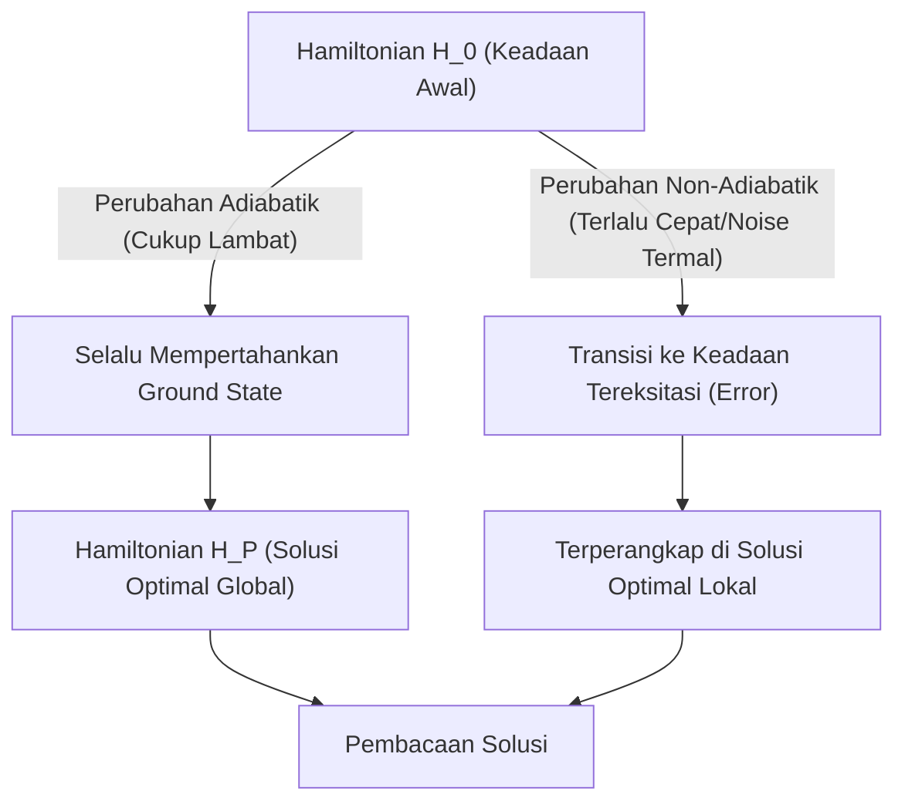
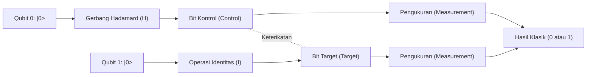
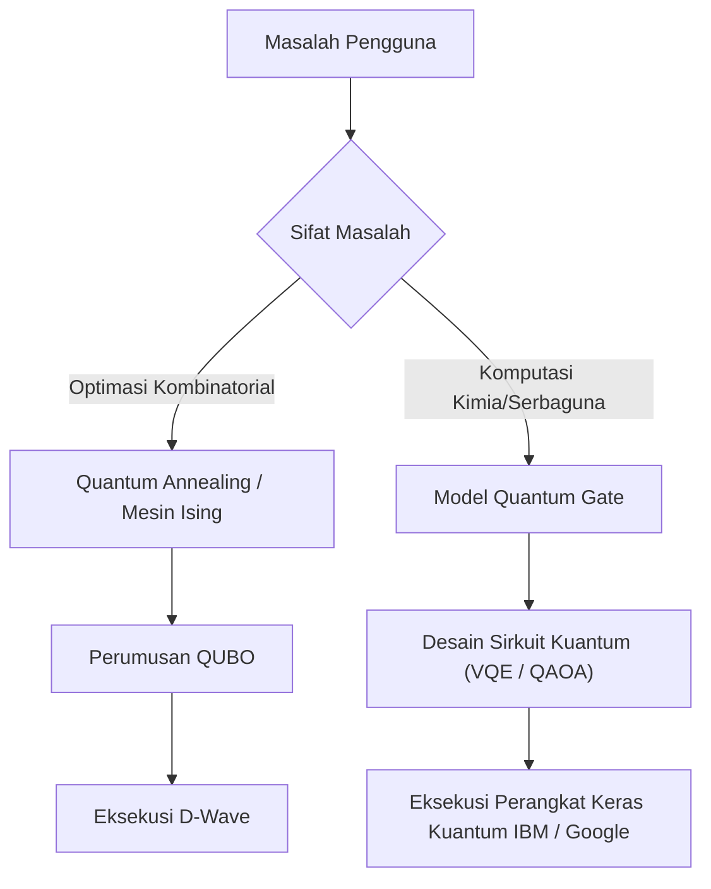

# Penjelasan Mudah tentang Perbedaan antara Quantum Annealing dan Model Quantum Gate

Komputasi kuantum adalah teknologi komputasi generasi berikutnya yang berpotensi memecahkan masalah tertentu, yang membutuhkan waktu sangat lama untuk dihitung oleh komputer klasik modern (termasuk superkomputer konvensional), dengan kecepatan yang luar biasa menggunakan prinsip-prinsip mekanika kuantum (superposisi dan keterikatan kuantum).

Saat ini, sebagai pendekatan menuju realisasi komputer kuantum, secara garis besar ada dua paradigma utama: **"Quantum Annealing"** dan **"Model Quantum Gate (Quantum Gate Model)"**. Kedua metode ini memiliki perbedaan besar dalam pendekatan fisik yang mendasarinya, tugas komputasi yang menjadi keunggulannya, serta tantangan perangkat keras dalam penerapannya.

Pada artikel ini, kita akan membandingkan dan menjelaskan kedua metode tersebut secara menyeluruh dan mendetail dari perspektif teknis, mulai dari prinsip fisik, model matematis (Model Ising, QUBO, transformasi uniter, dll.), batasan teknologi saat ini, hingga contoh penggunaan (use cases) yang spesifik.

---

## 1. Dasar Komputasi Kuantum: Perbedaan Mendasar dengan Komputer Klasik

Komputer klasik memproses informasi sebagai "bit" yang mengambil status "0" atau "1". Di sisi lain, komputer kuantum menggunakan "qubit" (quantum bit). Qubit, berdasarkan prinsip mekanika kuantum yaitu "Superposisi" (Superposition), dapat secara probabilistik memiliki status 0 dan 1 secara bersamaan.

Lebih lanjut, dengan memanfaatkan fenomena yang disebut "Keterikatan Kuantum" (Entanglement), keadaan beberapa qubit menjadi saling berkolerasi kuat, sehingga operasi pada satu qubit akan berdampak instan pada keseluruhan sistem. Hal ini memungkinkan komputasi paralel tingkat lanjut (paralelisme kuantum).

Akan tetapi, keadaan kuantum sangat rentan terhadap gangguan eksternal (seperti panas atau gelombang elektromagnetik), dan "Dekoherensi" (Decoherence) di mana keadaan kuantum rusak dan kembali menjadi keadaan klasik merupakan tantangan besar. Perbedaan cara menangani masalah noise ini bermuara pada perbedaan besar dalam filosofi desain antara Annealing dan Model Gate.

---

## 2. Rincian Quantum Annealing

Quantum Annealing adalah arsitektur komputasi khusus yang terutama dioptimalkan untuk memecahkan **"Masalah Optimasi Kombinatorial"**. Metode ini didasarkan pada teori yang diusulkan oleh Mampei Kadowaki dan Hidetoshi Nishimori dari Tokyo Institute of Technology pada tahun 1998, dan mulai dikenal luas setelah dikomersialkan pertama kali di dunia oleh D-Wave Systems dari Kanada.

### 2.1. Mekanisme Fisik: Model Ising Medan Transversal dan Fluktuasi Kuantum

Quantum Annealing memanfaatkan sifat sistem fisik di alam yang cenderung stabil menuju "keadaan dengan energi terendah (ground state)".

Pada pendekatan klasik yang disebut "Simulated Annealing", fluktuasi termal digunakan untuk keluar dari solusi optimal lokal (local minimum). Sebaliknya, pada Quantum Annealing, "Fluktuasi Kuantum" (Quantum Fluctuation) digunakan agar melalui "Efek Terowongan Kuantum" (Quantum Tunneling), penghalang energi dapat ditembus untuk mencari solusi optimal global (global minimum) dengan lebih efisien.

Evolusi waktu sistem Quantum Annealing dijelaskan dengan Hamiltonian (operator yang mewakili total energi sistem) $H(t)$ berikut:

$$ H(t) = A(t) H_0 + B(t) H_P $$

Di sini, $t$ adalah waktu, $A(t)$ adalah fungsi yang secara bertahap menurun, dan $B(t)$ adalah fungsi yang secara bertahap meningkat.

- **$H_0$ (Hamiltonian Awal)**: Mewakili medan transversal (Transverse field) yang menghasilkan fluktuasi kuantum.
  $$ H_0 = - \sum_{i} \sigma_i^x $$
  ($\sigma_i^x$ adalah matriks Pauli-X yang mewakili pembalikan bit.)
- **$H_P$ (Hamiltonian Masalah)**: Model Ising yang merepresentasikan masalah optimasi yang ingin diselesaikan.

Pada keadaan awal ($t=0$), $A(0)$ bernilai maksimal, dan sistem berada dalam ground state dari $H_0$ (di mana semua keadaan bersuperposisi secara merata). Seiring berjalannya waktu, medan transversal diperlemah secara perlahan, dan secara bersamaan interaksi pada Hamiltonian masalah diperkuat.

### 2.2. Komputasi Kuantum Adiabatik (Adiabatic Quantum Computation)

Hal yang penting dalam proses ini adalah **"Teorema Adiabatik" (Adiabatic Theorem)**. Menurut teorema adiabatik, jika sistem diubah "cukup lambat (secara adiabatik)", sistem akan selalu bertahan dalam ground state dari Hamiltonian pada setiap momen tersebut.

Artinya, saat pada akhirnya $A(t) \to 0$ dan $B(t) \to 1$, sistem telah mencapai ground state dari $H_P$, yaitu **"solusi eksak dari masalah optimasi"**.

### 2.3. Pemetaan dari QUBO ke Model Ising

Untuk memecahkan masalah dunia nyata pada Quantum Annealer, masalah tersebut harus dirumuskan dalam format **QUBO (Quadratic Unconstrained Binary Optimization)**.

Fungsi objektif QUBO didefinisikan sebagai berikut:
$$ \min_{x \in \{0,1\}^n} \sum_{i} Q_{ii} x_i + \sum_{i < j} Q_{ij} x_i x_j $$
Di sini, $x_i \in \{0, 1\}$ adalah variabel biner, dan $Q$ adalah matriks bobot.

Karena perangkat keras (seperti D-Wave) menangani spin fisik (arah atas/bawah), variabel harus dikonversi ke Model Ising yang menggunakan $\sigma_i \in \{-1, +1\}$. Rumus konversinya adalah:
$$ x_i = \frac{1 - \sigma_i}{2} \quad \text{atau} \quad \sigma_i = 1 - 2x_i $$

Dengan mensubstitusikan ini ke dalam persamaan QUBO dan menyederhanakannya, kita mendapatkan Hamiltonian Model Ising $H_P$:
$$ H_P = - \sum_{i<j} J_{ij} \sigma_i^z \sigma_j^z - \sum_{i} h_i \sigma_i^z $$
- $J_{ij}$: Interaksi antaram spin (koefisien kopling). Ini mewakili kekuatan ikatan antara qubit fisik.
- $h_i$: Medan magnet lokal (bias) pada setiap spin.

### 2.4. Perangkat Keras dan Tantangan Quantum Annealing (Contoh D-Wave)

Prosesor kuantum D-Wave direalisasikan menggunakan SQUID (Superconducting Quantum Interference Device). Keterhubungan antar qubit fisik bergantung pada pemasangan kabel perangkat keras dan bukan merupakan keterhubungan penuh (di mana semua bit terhubung satu sama lain).
Mulai dari "Chimera graph" awal, berkembang ke "Pegasus", dan kemudian "Zephyr graph", tingkat keterhubungan terus meningkat, namun batasan tetap ada.

Oleh karena itu, diperlukan proses **"Minor Embedding"** yang memetakan masalah dengan struktur graf kompleks ke graf fisik. Hal ini mengakibatkan satu variabel logis direpresentasikan oleh beberapa qubit fisik (chain), yang mengurangi jumlah efektif qubit yang dapat digunakan dan menurunkan akurasi komputasi.

---

## 3. Rincian Model Quantum Gate (Quantum Gate Model)

Model Quantum Gate adalah perluasan secara mekanika kuantum dari gerbang logika komputer klasik (seperti AND, OR, NOT), dan merupakan arsitektur yang memungkinkan **"Komputasi Kuantum Universal" (Universal Quantum Computation)**. Banyak perusahaan seperti IBM, Google, Rigetti, dan IonQ telah mengadopsi metode ini.

### 3.1. Transformasi Uniter dan Vektor Keadaan

Pada Model Quantum Gate, keadaan seluruh sistem qubit direpresentasikan sebagai "Vektor Keadaan" (State Vector) $|\psi\rangle$. Keadaan 1 qubit dinyatakan sebagai kombinasi linear dari basis keadaan $|0\rangle$ dan $|1\rangle$ sebagai berikut:
$$ |\psi\rangle = \alpha |0\rangle + \beta |1\rangle $$
Di mana $\alpha$ dan $\beta$ adalah amplitudo probabilitas kompleks yang memenuhi $|\alpha|^2 + |\beta|^2 = 1$. Keadaan ini dapat divisualisasikan secara geometris sebagai sebuah titik pada "Bloch Sphere" (Bola Bloch).

Langkah komputasi kuantum dideskripsikan sebagai penerapan **Operator Uniter (Unitary Operator) $U$** pada vektor keadaan. Matriks uniter memiliki sifat $U^\dagger U = I$ (hasil kali dengan konjugat Hermitiannya adalah matriks identitas), yang merupakan operasi reversibel yang sesuai dengan evolusi waktu dari Persamaan Schrödinger dalam mekanika kuantum.
$$ |\psi_{t+1}\rangle = U_t |\psi_t\rangle $$

### 3.2. Gerbang Kuantum Dasar dan Model Sirkuit

Algoritma komputasi kuantum didesain sebagai serangkaian urutan gerbang kuantum (sirkuit kuantum).

- **Gerbang Pauli (X, Y, Z)**: Rotasi 180 derajat mengelilingi setiap sumbu pada Bloch Sphere. Gerbang X setara dengan gerbang NOT klasik.
- **Gerbang Hadamard (H)**: Mengubah $|0\rangle$ menjadi $\frac{|0\rangle + |1\rangle}{\sqrt{2}}$, sehingga menciptakan keadaan superposisi.
  $$ H = \frac{1}{\sqrt{2}} \begin{pmatrix} 1 & 1 \\ 1 & -1 \end{pmatrix} $$
- **Gerbang CNOT (Controlled-NOT)**: Gerbang 2 qubit. Hanya ketika qubit kontrol bernilai $|1\rangle$, gerbang X akan diterapkan pada qubit target. Ini menghasilkan Keterikatan Kuantum (Entanglement).

Semua algoritma kuantum secara aproksimasi dapat direpresentasikan dengan kombinasi dari sejumlah kecil gerbang 1 qubit dan gerbang CNOT (Universal Gate Set).

### 3.3. Koreksi Kesalahan dan Perjalanan dari NISQ menuju FTQC

Tantangan terbesar dari Model Quantum Gate adalah "Dekoherensi", di mana keadaan kuantum dirusak oleh noise. Semakin dalam langkah komputasi (kedalaman gerbang), semakin banyak kesalahan yang menumpuk.

Untuk melakukan komputasi ideal, **Koreksi Kesalahan Kuantum (Quantum Error Correction)** sangatlah penting. Misalnya, dalam metode seperti "Surface Code", beberapa qubit fisik digabungkan untuk membentuk satu "Qubit Logis" (Logical Qubit) yang bebas kesalahan. Namun, untuk membuat satu qubit logis, diperlukan ribuan hingga puluhan ribu qubit fisik, sehingga menimbulkan overhead yang luar biasa.

Saat ini kita berada di era perangkat **NISQ (Noisy Intermediate-Scale Quantum)** yang memiliki puluhan hingga ratusan qubit tanpa koreksi kesalahan. Banyak terobosan masih dibutuhkan untuk mewujudkan **FTQC (Fault-Tolerant Quantum Computing)** dengan koreksi kesalahan penuh.

---

## 4. Ringkasan Perbandingan Teknis dan Matematis

Berikut adalah perbandingan perbedaan mendasar dari kedua arsitektur tersebut.

| Item Perbandingan | Quantum Annealing | Model Quantum Gate |
| :--- | :--- | :--- |
| **Model Komputasi** | Komputasi Kuantum Adiabatik (Evolusi waktu Hamiltonian secara kontinu) | Transformasi Uniter (Urutan operasi gerbang secara diskrit) |
| **Masalah yang Cocok** | Masalah Optimasi Kombinatorial (QUBO, Model Ising) | Universal (Simulasi kimia kuantum, faktorisasi prima, pencarian, dll.) |
| **Kemampuan Representasi**| Optimasi Heuristik (Solusi pendekatan) | Setara dengan Mesin Turing Kuantum Universal (Secara teori semua komputasi dimungkinkan) |
| **Contoh Implementasi** | D-Wave Systems | IBM, Google, Quantinuum, IonQ, dll. |
| **Ketahanan terhadap Noise**| Relatif kuat (Karena tetap berada di sekitar ground state, toleransi terhadap noise termal tertentu memungkinkan) | Sangat lemah (Sedikit saja noise dapat menggeser fase dan menghancurkan hasil perhitungan) |
| **Skalabilitas** | Skala ribuan hingga puluhan ribu qubit (Bergantung struktur fisik. Qubit logis sulit diwujudkan) | Skala ratusan qubit (Dibutuhkan skala jutaan untuk FTQC) |

Quantum Annealing cocok untuk digunakan sebagai "koprosesor dengan tujuan khusus", menyelesaikan masalah optimasi untuk melengkapi batas kemampuan komputer klasik. Di sisi lain, Model Quantum Gate adalah versi kuantum dari "komputer serbaguna", yang pada akhirnya bertujuan untuk mengungguli komputasi klasik (Quantum Supremacy), meskipun membangun perangkat kerasnya sangatlah sulit.

---

## 5. Batasan dan Tantangan Saat Ini

### Batasan Quantum Annealing
1. **Batasan Konektivitas (Connectivity)**: Akibat dari Minor Embedding yang disebutkan sebelumnya, jumlah qubit fisik yang dibutuhkan akan meningkat secara eksponensial seiring membesarnya skala masalah.
2. **Presisi Koefisien (Precision)**: Kesalahan fisik saat mengatur parameter analog seperti $J_{ij}$ dan $h_i$ pada perangkat keras berdampak langsung pada kualitas solusi.
3. **Suhu dan Transisi Non-Adiabatik**: Karena suhu sistem bukan nol absolut, ada kemungkinan sistem keluar dari solusi optimal akibat eksitasi termal.

### Batasan Model Quantum Gate
1. **Waktu Koherensi (Coherence Time)**: Waktu keadaan kuantum dapat dipertahankan hanya berkisar dari beberapa mikrodetik hingga milidetik, dan ini sangat membatasi jumlah gerbang (kedalaman sirkuit) yang dapat dieksekusi dalam waktu tersebut.
2. **Fidelitas Gerbang (Gate Fidelity)**: Tingkat error operasional pada gerbang 2 qubit (seperti CNOT) masih belum cukup rendah (umumnya sekitar 99.x%). Untuk mewujudkan FTQC, fidelitas ini harus ditingkatkan ke 99.99% atau lebih.
3. **Volume Kuantum (Quantum Volume)**: Peningkatan skalabilitas (bukan hanya jumlah qubit, tetapi kapasitas komputasi efektif (volume kuantum) yang memperhitungkan keterhubungan antar qubit dan tingkat error) adalah tantangan terbesar saat ini.

---

## 6. Contoh Penggunaan (Use Case) dan Algoritma Spesifik

Mari kita lihat area aplikasi spesifik yang menjadi keunggulan dari masing-masing metode.

### 6.1. Contoh Penggunaan Quantum Annealing
- **Logistik & Routing**: Optimasi rute pengiriman untuk banyak kendaraan (variasi dari Travelling Salesperson Problem). Pencarian rute real-time dengan mempertimbangkan kemacetan lalu lintas.
- **Rekayasa Keuangan**: Optimasi portofolio. Mencari kombinasi saham yang meminimalkan risiko sekaligus memaksimalkan keuntungan.
- **Machine Learning**: Seleksi Fitur (Feature Selection). Mengekstraksi kombinasi variabel yang berkontribusi paling besar terhadap prediksi dari kumpulan data yang masif.
- **Manufaktur**: Masalah penjadwalan Job Shop di pabrik (Menentukan suku cadang mana yang harus diproses di mesin mana, dalam urutan apa, agar prosesnya paling cepat).

### 6.2. Contoh Penggunaan Model Quantum Gate
- **Simulasi Kimia Kuantum**: Menyimulasikan tingkat energi molekul dan reaksi kimia dengan akurasi tinggi.
- **Faktorisasi Prima (Algoritma Shor)**: Algoritma yang memfaktorkan bilangan komposit raksasa dalam waktu polinomial. Jika ini berhasil dipraktikkan, infrastruktur kriptografi kunci publik saat ini seperti enkripsi RSA akan hancur, sehingga transisi ke kriptografi pasca-kuantum (PQC) menjadi hal yang mendesak.
- **Pencarian Basis Data (Algoritma Grover)**: Saat mencari data yang diinginkan dari basis data yang tidak terstruktur, komputer klasik membutuhkan waktu $O(N)$ langkah, sedangkan dengan algoritma Grover, pencarian dapat diselesaikan dalam $O(\sqrt{N})$ langkah.

### 6.3. Algoritma Hibrida di Era NISQ: VQE dan QAOA
Untuk mengatasi batasan dari sirkuit kuantum yang dangkal (shallow) pada perangkat NISQ, "Algoritma Kuantum Variasional" (Variational Quantum Algorithms), yang menggabungkan keunggulan komputer kuantum dan klasik, mulai menarik banyak perhatian.

- **VQE (Variational Quantum Eigensolver)**: Algoritma untuk mencari energi ground state sebuah molekul. Menggunakan sirkuit kuantum berparameter (Ansatz) untuk menyiapkan keadaan kuantum, dan nilai ekspektasi energi $\langle \psi(\theta) | H | \psi(\theta) \rangle$ diukur. Dengan menggunakan ekspektasi ini sebagai fungsi objektif, parameter $\theta$ diperbarui menggunakan algoritma optimasi klasik (seperti Gradient Descent). Mengulang ini hingga konvergen akan memberikan tingkat energi yang akurat dari molekul tersebut.
- **QAOA (Quantum Approximate Optimization Algorithm)**: Algoritma yang menyelesaikan masalah optimasi kombinatorial menggunakan Model Quantum Gate. Evolusi waktu adiabatik dari Quantum Annealing didekati ke dalam operasi gerbang diskrit melalui "Trotterisasi" (Trotterization), lalu menerapkan Hamiltonian secara bergantian untuk mendapatkan solusi hampiran (aproksimasi). QAOA diharapkan menjadi sarana ampuh untuk memecahkan masalah optimasi dengan Model Gate.

---

## 7. Kesimpulan

Meskipun Quantum Annealing dan Model Quantum Gate sama-sama memanfaatkan sifat magis mekanika kuantum sebagai sumber daya komputasi, pendekatan dan tujuan akhirnya sangat berbeda.

- **Quantum Annealing** adalah "mesin heuristik tujuan khusus" untuk menghasilkan solusi praktis sejak dini untuk masalah nyata tertentu, yaitu optimasi kombinatorial. Saat ini, uji coba (Proof of Concept/PoC) oleh berbagai perusahaan sedang berjalan dengan pesat.
- **Model Quantum Gate** adalah "komputer kuantum serbaguna" dengan potensi untuk mengubah paradigma ilmu komputer secara radikal, mulai dari simulasi fisika & kimia yang presisi, hingga pemecahan kode (kriptografi). Namun, penelitian dan pengembangan jangka panjang diperlukan untuk mengatasi kendala besar yaitu koreksi kesalahan.

Di masa depan, kita dapat memperkirakan akan terbangunnya lingkungan **"Komputasi Heterogen" (Heterogeneous Computing)**, yang pusatnya menggunakan superkomputer klasik (HPC), di mana tugas optimasi dialihkan ke mesin Annealing, sedangkan komputasi kimia kuantum dialihkan ke komputer kuantum model Gate.

Komputer kuantum masih dalam tahap perkembangan, namun baik perangkat keras maupun algoritmanya terus berkembang dengan sangat cepat dari hari ke hari. Memahami konsep matematis di balik Model Ising dan dasar-dasar sirkuit kuantum akan menjadi senjata andalan yang sangat berguna menuju era "Quantum Native" di masa mendatang.

---
*Artikel ini secara komprehensif menjelaskan komputasi kuantum, mulai dari konsep dasar hingga tren perangkat keras terbaru. Nantikan terus perkembangan penelitian terbaru di masa yang akan datang.*
