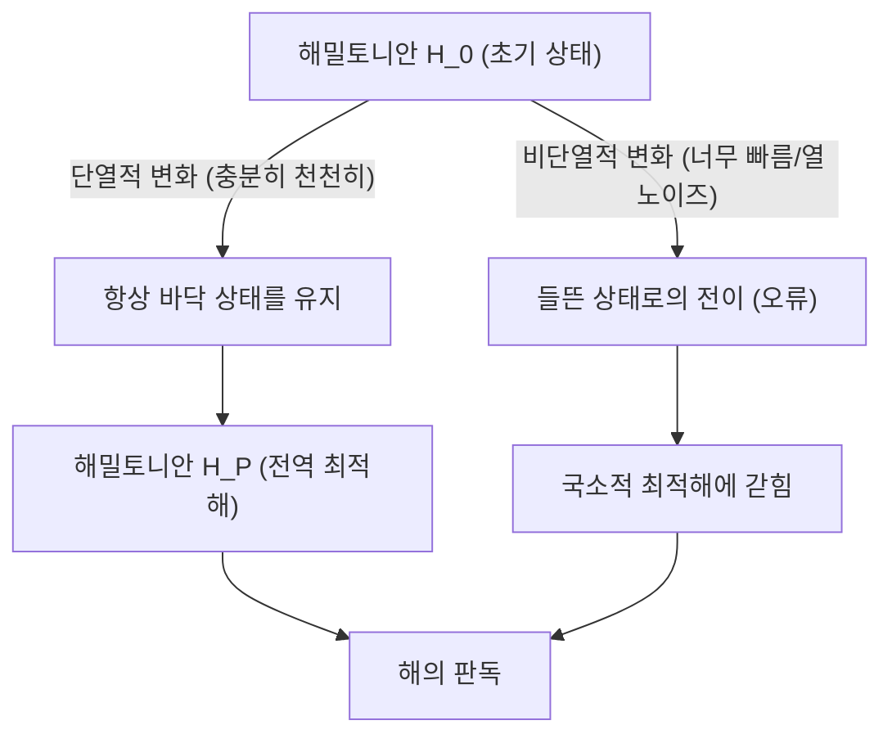
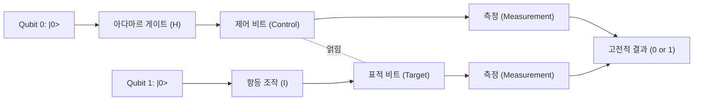
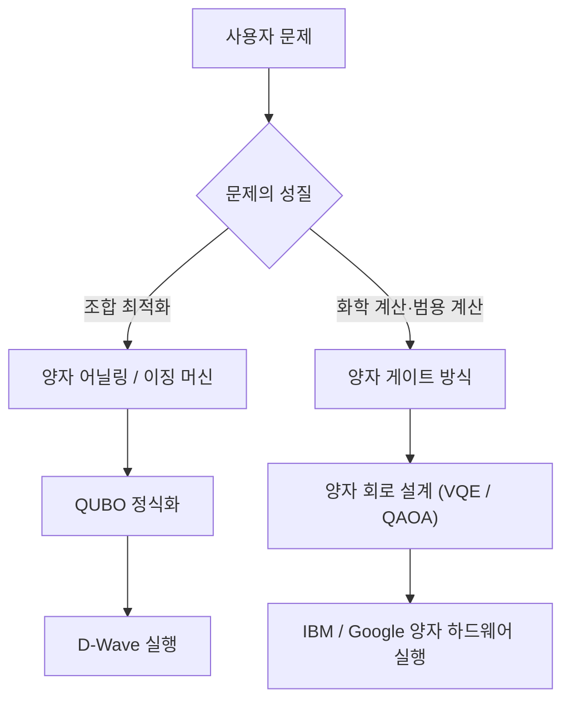

# 양자 어닐링과 양자 게이트 방식의 차이를 알기 쉽게 해설

양자 컴퓨팅은 현대의 고전 컴퓨터(기존의 슈퍼컴퓨터를 포함)로는 계산에 방대한 시간이 걸리는 특정 문제를, 양자 역학적인 원리(중첩이나 양자 얽힘)를 이용하여 비약적으로 빠르게 풀 수 있는 가능성을 지닌 차세대 계산 기술입니다.

현재 양자 컴퓨터 실현을 위한 접근 방식으로 크게 나누어 **'양자 어닐링(Quantum Annealing)'**과 **'양자 게이트 방식(Quantum Gate Model)'**이라는 두 가지 주류 패러다임이 존재합니다. 이 두 방식은 기반이 되는 물리적 접근 방식, 주로 다루는 계산 작업, 그리고 구현에 있어서의 하드웨어 과제가 크게 다릅니다.

본 기사에서는 이 두 방식에 대해 물리적인 원리, 수리 모델(Ising 모델, QUBO, 유니터리 변환 등), 현재의 기술적 한계, 그리고 구체적인 유스케이스에 이르기까지 매우 상세하고 기술적인 관점에서 철저하게 비교·해설합니다.

---

## 1. 양자 계산의 기초: 고전 컴퓨터와의 근본적인 차이

고전 컴퓨터는 정보를 '0' 또는 '1' 중 하나의 상태를 가지는 '비트(Bit)'로서 처리합니다. 반면 양자 컴퓨터는 '양자 비트(Qubit)'를 사용합니다. 양자 비트는 양자 역학의 '중첩(Superposition)' 원리에 의해 0과 1의 두 가지 상태를 동시에 확률적으로 가질 수 있습니다.

또한, '양자 얽힘(Entanglement)'이라고 불리는 현상을 이용함으로써 여러 양자 비트의 상태가 서로 강하게 상관관계를 가지며, 하나의 양자 비트에 대한 조작이 시스템 전체에 순식간에 영향을 미치게 됩니다. 이를 통해 병렬 처리적인 계산(양자 병렬성)이 가능해집니다.

그러나 양자 상태는 외부의 노이즈(열이나 전자파 등)에 대해 매우 취약하며, 상태가 깨져서 고전적인 상태로 돌아가 버리는 '결어긋남(Decoherence)'이 큰 과제가 되고 있습니다. 이 노이즈 문제에 대한 접근 방식의 차이가 어닐링과 게이트 방식의 설계 사상에 큰 차이를 가져오고 있습니다.

---

## 2. 양자 어닐링 (Quantum Annealing) 의 상세

양자 어닐링은 주로 **'조합 최적화 문제'**를 푸는 데 특화된 전용 계산 아키텍처입니다. 1998년 도쿄 공업 대학의 카도와키 만페이(門脇万平) 씨와 니시모리 히데토시(西森秀稔) 씨가 제안한 이론을 바탕으로 하고 있으며, 캐나다의 D-Wave Systems사가 세계 최초로 상용화함으로써 널리 알려지게 되었습니다.

### 2.1. 물리적 메커니즘: 횡자장 이징 모델과 양자 요동

양자 어닐링은 자연계의 물리계가 '에너지가 가장 낮은 상태(바닥 상태)'로 안정되려는 성질을 계산에 이용합니다.

고전적인 접근 방식인 '시뮬레이티드 어닐링(담금질 기법)'에서는 열 요동을 이용하여 국소 최적해(로컬 미니멈)에서 탈출합니다. 반면, 양자 어닐링에서는 '양자 요동(Quantum Fluctuation)'을 이용하고, '양자 터널 효과(Quantum Tunneling)'에 의해 에너지 장벽을 빠져나가, 보다 효율적으로 전역 최적해(글로벌 미니멈)를 탐색합니다.

양자 어닐링 계의 시간 발전은 다음의 해밀토니안(계의 전체 에너지를 나타내는 연산자) $H(t)$ 로 기술됩니다.

$$ H(t) = A(t) H_0 + B(t) H_P $$

여기서, $t$ 는 시간, $A(t)$ 는 서서히 감소하는 함수, $B(t)$ 는 서서히 증가하는 함수입니다.

- **$H_0$(초기 해밀토니안)**: 횡자장(Transverse field)을 나타내며, 양자 요동을 발생시킵니다.
  $$ H_0 = - \sum_{i} \sigma_i^x $$
  ($\sigma_i^x$ 는 파울리 X 행렬이며, 비트의 반전을 나타냅니다.)
- **$H_P$(문제 해밀토니안)**: 풀고자 하는 최적화 문제를 표현하는 이징 모델(Ising Model)입니다.

초기 상태 ($t=0$) 에서는 $A(0)$ 가 최대이며, 계는 $H_0$ 의 바닥 상태(모든 상태가 균등하게 중첩된 상태)에 있습니다. 거기서 시간을 두고 천천히 횡자장을 약화시키는 동시에 문제 해밀토니안의 상호작용을 강화해 나갑니다.

### 2.2. 단열 양자 계산 (Adiabatic Quantum Computation)

이 과정에서 중요한 것이 **'단열 정리(Adiabatic Theorem)'**입니다. 단열 정리에 따르면, 계를 '충분히 천천히(단열적으로)' 변화시키면, 계는 항상 그 순간의 해밀토니안의 바닥 상태에 계속 머무르게 됩니다.

즉, 최종적으로 $A(t) \to 0$, $B(t) \to 1$ 이 되었을 때, 계는 $H_P$ 의 바닥 상태, 즉 **'최적화 문제의 엄밀해'**에 도달해 있게 됩니다.

### 2.3. QUBO에서 Ising 모델로의 매핑

실세계의 문제를 양자 어닐러로 풀기 위해서는, 문제를 **QUBO(Quadratic Unconstrained Binary Optimization: 제약 없는 이차 이진 최적화)** 형식으로 정식화해야 합니다.

QUBO의 목적 함수는 다음과 같이 정의됩니다.
$$ \min_{x \in \{0,1\}^n} \sum_{i} Q_{ii} x_i + \sum_{i < j} Q_{ij} x_i x_j $$
여기서, $x_i \in \{0, 1\}$ 는 이진 변수, $Q$ 는 가중치 행렬입니다.

하드웨어(D-Wave 등)는 물리적인 스핀(위 방향/아래 방향)을 다루기 때문에, 변수를 $\sigma_i \in \{-1, +1\}$ 를 사용하는 이징 모델로 변환할 필요가 있습니다. 변환 식은 다음과 같습니다.
$$ x_i = \frac{1 - \sigma_i}{2} \quad \text{또는} \quad \sigma_i = 1 - 2x_i $$

이것을 QUBO 식에 대입하여 정리하면 이징 모델의 해밀토니안 $H_P$ 를 얻을 수 있습니다.
$$ H_P = - \sum_{i<j} J_{ij} \sigma_i^z \sigma_j^z - \sum_{i} h_i \sigma_i^z $$
- $J_{ij}$: 스핀 간의 상호작용(결합 계수). 물리적인 양자 비트 간의 결합 강도.
- $h_i$: 각 스핀에 대한 국소 자기장(바이어스).

### 2.4. 양자 어닐링의 하드웨어와 과제 (D-Wave의 예)

D-Wave의 양자 프로세서는 초전도 양자 간섭계(SQUID)를 사용하여 구현되었습니다. 물리적인 양자 비트들 간의 결합은 하드웨어의 배선에 의존하고 있으며, 완전 결합(모든 비트가 서로 연결된 상태)이 아닙니다.
초기의 '키메라 그래프(Chimera graph)'에서 '페가수스 그래프(Pegasus)', '제파 그래프(Zephyr)'로 진화하면서 결합도는 향상되었지만 여전히 제한이 있습니다.

그렇기 때문에 복잡한 그래프 구조를 가진 문제를 물리적인 그래프에 매핑하는 **'마이너 임베딩(Minor Embedding)'**이라는 처리가 필요합니다. 이로 인해 하나의 논리 변수를 여러 물리 양자 비트(체인)로 표현하게 되어, 사용할 수 있는 실질적인 양자 비트 수가 감소하고 계산 정밀도가 떨어지는 과제가 있습니다.

---

## 3. 양자 게이트 방식 (Quantum Gate Model) 의 상세

양자 게이트 방식은 고전 컴퓨터의 논리 게이트(AND, OR, NOT 등)를 양자 역학적으로 확장한 것으로, **'범용 양자 계산(Universal Quantum Computation)'**을 가능하게 하는 아키텍처입니다. IBM, Google, Rigetti, IonQ 등의 많은 기업이 이 방식을 채택하고 있습니다.

### 3.1. 유니터리 변환과 상태 벡터

양자 게이트 방식에서는 양자 비트 시스템 전체의 상태를 '상태 벡터(State Vector)' $|\psi\rangle$ 로서 표현합니다. 1 양자 비트의 상태는 다음과 같이 바닥 상태 $|0\rangle$ 과 $|1\rangle$ 의 선형 결합으로 나타냅니다.
$$ |\psi\rangle = \alpha |0\rangle + \beta |1\rangle $$
여기서, $\alpha$ 와 $\beta$ 는 복소 확률 진폭이며, $|\alpha|^2 + |\beta|^2 = 1$ 을 만족합니다. 이 상태는 기하학적으로 '블로흐 구(Bloch Sphere)' 상의 점으로 시각화됩니다.

양자 계산의 단계는 상태 벡터에 대한 **유니터리 연산자(Unitary Operator) $U$** 의 적용으로 기술됩니다. 유니터리 행렬은 $U^\dagger U = I$(에르미트 켤레와의 곱이 단위 행렬이 됨)라는 성질을 가지며, 양자 역학에 있어서 슈뢰딩거 방정식의 시간 발전에 대응하는 가역적인 조작입니다.
$$ |\psi_{t+1}\rangle = U_t |\psi_t\rangle $$

### 3.2. 기본적인 양자 게이트와 회로 모델

양자 계산 알고리즘은 일련의 양자 게이트 시퀀스(양자 회로)로서 설계됩니다.

- **파울리 게이트 (X, Y, Z)**: 블로흐 구에서의 각 축을 중심으로 한 180도 회전. X 게이트는 고전의 NOT 게이트에 해당합니다.
- **아다마르 게이트 (H)**: $|0\rangle$ 을 $\frac{|0\rangle + |1\rangle}{\sqrt{2}}$ 로 변환하여 중첩 상태를 만들어냅니다.
  $$ H = \frac{1}{\sqrt{2}} \begin{pmatrix} 1 & 1 \\ 1 & -1 \end{pmatrix} $$
- **CNOT 게이트 (Controlled-NOT)**: 2 양자 비트 게이트. 제어 비트가 $|1\rangle$ 일 때만 표적 비트에 X 게이트를 적용합니다. 이를 통해 양자 얽힘(Entanglement)을 생성합니다.

모든 양자 알고리즘은 소수의 1 양자 비트 게이트와 CNOT 게이트의 조합에 의해 근사적으로 표현할 수 있습니다(범용 게이트 세트).

### 3.3. 오류 정정과 NISQ에서 FTQC로의 길

양자 게이트 방식의 가장 큰 과제는 양자 상태가 노이즈에 의해 파괴되는 '결어긋남'입니다. 계산 단계(게이트 깊이)가 깊어질수록 오류가 축적됩니다.

이상적인 계산을 수행하기 위해서는 **양자 오류 정정(Quantum Error Correction)**이 필수적입니다. 예를 들어 '표면 부호(Surface Code)' 등의 기법에서는 여러 물리 양자 비트를 묶어 하나의 오류 없는 '논리 양자 비트(Logical Qubit)'를 구성합니다. 그러나 하나의 논리 양자 비트를 만들기 위해 수천~수만 개의 물리 양자 비트가 필요하게 되어 막대한 오버헤드가 발생합니다.

현재 우리가 있는 단계는 오류 정정이 없는 수십~수백 양자 비트의 **NISQ(Noisy Intermediate-Scale Quantum)** 디바이스 시대입니다. 완벽한 오류 정정을 갖춘 **FTQC(Fault-Tolerant Quantum Computing: 결함 허용 양자 계산)**의 실현에는 아직 많은 돌파구가 필요합니다.

---

## 4. 기술적·수학적 비교 요약

두 아키텍처의 근본적인 차이를 비교합니다.

| 비교 항목 | 양자 어닐링 (Quantum Annealing) | 양자 게이트 방식 (Gate Model) |
| :--- | :--- | :--- |
| **계산 모델** | 단열 양자 계산 (해밀토니안의 연속적인 시간 발전) | 유니터리 변환 (이산적인 게이트 조작의 시퀀스) |
| **적합한 문제** | 조합 최적화 문제 (QUBO, 이징 모델) | 범용 (양자 화학 시뮬레이션, 소인수 분해, 검색 등) |
| **표현 능력** | 휴리스틱 최적화 (근사해) | 범용 양자 튜링 머신과 등가 (이론상 모든 계산이 가능) |
| **구현 예** | D-Wave Systems | IBM, Google, Quantinuum, IonQ 등 |
| **노이즈 내성** | 비교적 강함 (바닥 상태 부근에 머물기 때문에 어느 정도의 열 노이즈는 허용 가능) | 매우 약함 (약간의 노이즈로 위상이 어긋나고 계산 결과가 파괴됨) |
| **확장성** | 수천~수만 양자 비트 규모 (물리적 구조에 의존. 논리 비트화는 어려움) | 수백 양자 비트 규모 (FTQC를 향해서는 수백만 규모가 필요) |

양자 어닐링은 '특정 목적의 코프로세서'로서 고전 컴퓨터의 한계를 보완하는 형태로 최적화 문제를 푸는 데 적합합니다. 반면 양자 게이트 방식은 '범용 컴퓨터'의 양자 버전이며, 궁극적으로는 고전 컴퓨터를 능가하는 계산 능력(양자 우월성)을 목표로 하지만 하드웨어 구축이 매우 어렵습니다.

---

## 5. 현재의 한계와 과제

### 양자 어닐링의 한계
1. **결합도의 제한 (Connectivity)**: 앞서 언급한 마이너 임베딩으로 인해 문제 규모가 커지면 필요한 물리 양자 비트 수가 지수 함수적으로 증가합니다.
2. **계수의 정밀도 (Precision)**: $J_{ij}$ 나 $h_i$ 같은 아날로그 파라미터를 하드웨어 상에 설정할 때의 물리적인 오차가 해의 품질에 직결됩니다.
3. **온도와 비단열 전이**: 시스템 온도가 절대 영도가 아니기 때문에 열적 들뜸(Thermal Excitation)에 의해 최적해에서 벗어날 확률이 있습니다.

### 양자 게이트 방식의 한계
1. **결어긋남 시간 (Coherence Time)**: 양자 상태를 유지할 수 있는 시간은 겨우 수 마이크로초에서 수 밀리초 정도이며, 그 사이에 실행할 수 있는 게이트 수(회로의 깊이)가 엄격하게 제한됩니다.
2. **게이트 충실도 (Gate Fidelity)**: 2 양자 비트 게이트(CNOT 등)의 조작 오류율이 아직 충분히 낮지 않습니다(일반적으로 99.x% 정도). FTQC의 실현을 위해서는 이를 99.99% 이상으로 끌어올릴 필요가 있습니다.
3. **양자 볼륨 (Quantum Volume)**: 단순한 양자 비트 수뿐만 아니라, 상호 결합이나 오류율을 고려한 실질적인 계산 능력(양자 볼륨)을 스케일링하는 것이 현재의 가장 큰 과제입니다.

---

## 6. 구체적인 유스케이스와 알고리즘

각 방식이 장점을 가지는 구체적인 응용 분야를 살펴보겠습니다.

### 6.1. 양자 어닐링의 유스케이스
- **물류·라우팅**: 다수 차량의 배송 경로 최적화(순회 외판원 문제의 변형). 교통 체증을 고려한 실시간 경로 탐색.
- **금융 공학**: 포트폴리오 최적화. 리스크를 최소화하면서 수익을 최대화하는 종목의 조합 탐색.
- **머신러닝**: 특성 선택(Feature Selection). 방대한 데이터셋에서 가장 예측에 기여하는 변수의 조합을 추출.
- **제조업**: 공장에서의 잡샵 스케줄링(Job-shop Scheduling) 문제(어떤 기계로 어떤 부품을 어떤 순서로 가공하는 것이 가장 빠른가).

### 6.2. 양자 게이트 방식의 유스케이스
- **양자 화학 시뮬레이션**: 분자의 에너지 상태나 화학 반응을 고정밀도로 시뮬레이트.
- **소인수 분해 (Shor의 알고리즘)**: 거대한 합성수를 다항식 시간에 소인수 분해하는 알고리즘. 이것이 실용화되면 현재의 RSA 암호 등의 공개키 암호 기반이 깨지기 때문에 내양자 계산기 암호(PQC)로의 전환이 시급해지고 있습니다.
- **데이터베이스 검색 (Grover의 알고리즘)**: 정렬되지 않은 데이터베이스에서 원하는 데이터를 검색할 때, 고전 컴퓨터에서는 $O(N)$ 의 단계가 필요하지만 Grover의 알고리즘에서는 $O(\sqrt{N})$ 의 단계로 검색 가능합니다.

### 6.3. NISQ 시대의 하이브리드 알고리즘: VQE와 QAOA
NISQ 디바이스의 얕은 양자 회로 제약을 극복하기 위해, 양자 컴퓨터와 고전 컴퓨터의 장점을 결합한 '변분 양자 알고리즘(Variational Quantum Algorithms)'이 주목받고 있습니다.

- **VQE (Variational Quantum Eigensolver)**: 분자의 바닥 상태 에너지를 구하는 알고리즘. 매개변수화된 양자 회로(Ansatz)를 사용하여 양자 상태를 준비하고, 에너지 기댓값 $\langle \psi(\theta) | H | \psi(\theta) \rangle$ 를 측정합니다. 이 기댓값을 목적 함수로 하여 고전 최적화 알고리즘(경사 하강법 등)을 사용해 매개변수 $\theta$ 를 업데이트합니다. 이것을 수렴할 때까지 반복함으로써 분자의 정확한 에너지 상태를 구합니다.
- **QAOA (Quantum Approximate Optimization Algorithm)**: 양자 게이트 방식을 사용하여 조합 최적화 문제를 푸는 알고리즘. 양자 어닐링의 단열적인 시간 발전을 '트로터 전개(Trotterization)'를 통해 이산적인 게이트 조작으로 근사하고, 번갈아가며 해밀토니안을 작용시킴으로써 근사해를 얻습니다. QAOA는 게이트 방식으로 최적화 문제를 푸는 유력한 수단으로 기대되고 있습니다.

---

## 7. 정리

양자 어닐링과 양자 게이트 방식은 모두 양자 역학의 신비한 성질을 계산 자원으로 활용한다는 점에서는 같지만, 그 접근 방식과 도달 목표는 크게 다릅니다.

- **양자 어닐링**은 조합 최적화라는 특정 실문제에 대해 조기에 실용적인 성과를 내기 위한 '특화형 휴리스틱 엔진'입니다. 현재 이미 다양한 기업들에 의해 실증 실험(PoC)이 진행되고 있습니다.
- **양자 게이트 방식**은 물리·화학의 엄밀한 시뮬레이션부터 암호 해독까지, 컴퓨터 과학의 패러다임을 근본적으로 뒤집을 가능성을 지닌 '범용 양자 컴퓨터'입니다. 단, 오류 정정이라는 거대한 벽을 넘기 위한 장기적인 연구 개발이 필요합니다.

장래에는 고전 슈퍼컴퓨터(HPC)를 핵심으로 하되 최적화 작업에는 어닐링 머신을, 양자 화학 계산에는 게이트형 양자 컴퓨터를 호출하는 식의 **'이종 혼합(헤테로지니어스) 컴퓨팅'** 환경이 구축될 것으로 생각됩니다.

양자 컴퓨터는 아직 발전 중인 기술이지만 하드웨어와 알고리즘 양쪽에서 일취월장하는 진화를 거듭하고 있습니다. 이징 모델의 수리나 양자 회로의 기초를 이해하는 것은 다가올 양자 네이티브 시대를 대비하는 큰 무기가 될 것입니다.

---
*이 기사는 양자 컴퓨팅의 기초 개념부터 최신 하드웨어 동향까지를 망라하여 해설한 것입니다. 앞으로도 최신 연구 동향에 주목해 주십시오.*
