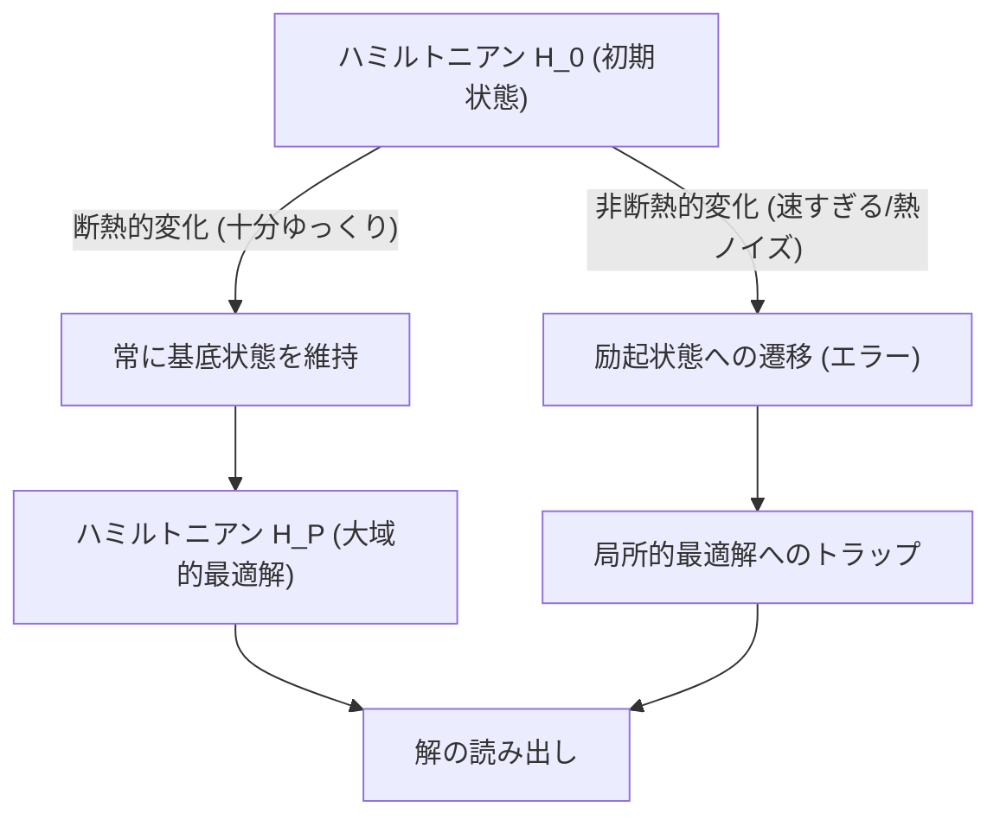
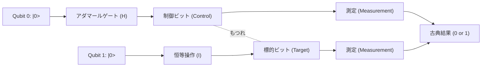
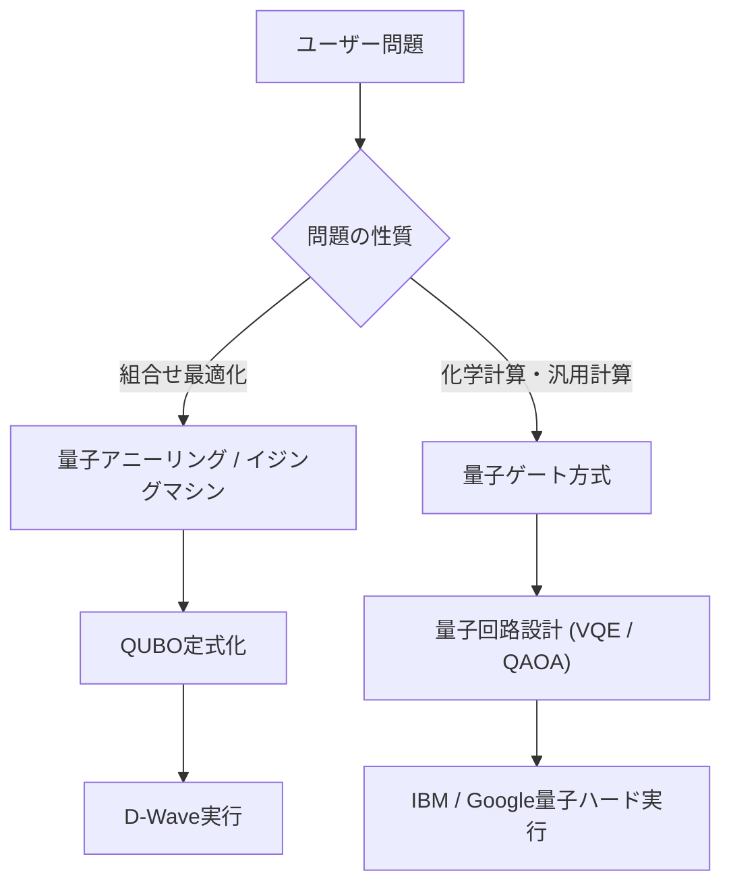

# 量子アニーリングと量子ゲート方式の違いをわかりやすく解説

量子コンピューティングは、現代の古典コンピュータ（従来のスーパーコンピュータを含む）では計算に膨大な時間を要する特定の問題を、量子力学的な原理（重ね合わせや量子もつれ）を利用して飛躍的に高速に解く可能性を秘めた次世代の計算技術です。

現在、量子コンピュータの実現に向けたアプローチとして、大きく分けて**「量子アニーリング（Quantum Annealing）」**と**「量子ゲート方式（Quantum Gate Model）」**の2つの主流なパラダイムが存在します。この2つの方式は、基盤となる物理的アプローチ、得意とする計算タスク、そして実装におけるハードウェアの課題が大きく異なります。

本記事では、これら2つの方式について、物理的な原理、数理モデル（Isingモデル、QUBO、ユニタリ変換など）、現在の技術的限界、そして具体的なユースケースに至るまで、非常に詳細かつ技術的な視点から徹底的に比較・解説します。

---

## 1. 量子計算の基礎：古典コンピュータとの根本的な違い

古典コンピュータは、情報を「0」または「1」のいずれかの状態をとる「ビット（Bit）」として処理します。一方、量子コンピュータは「量子ビット（Qubit）」を用います。量子ビットは、量子力学の「重ね合わせ（Superposition）」の原理により、0と1の両方の状態を同時に確率的に持つことができます。

さらに、「量子もつれ（Entanglement）」と呼ばれる現象を利用することで、複数の量子ビットの状態が互いに強く相関し、1つの量子ビットに対する操作がシステム全体に瞬時に影響を与えるようになります。これにより、並列処理的な計算（量子並列性）が可能となります。

しかし、量子状態は外部のノイズ（熱や電磁波など）に対して非常に脆弱であり、状態が壊れて古典的な状態に戻ってしまう「デコヒーレンス（Decoherence）」が大きな課題となっています。このノイズ問題に対するアプローチの違いが、アニーリングとゲート方式の設計思想の大きな違いに繋がっています。

---

## 2. 量子アニーリング (Quantum Annealing) の詳細

量子アニーリングは、主に**「組合せ最適化問題」**を解くことに特化した専用計算アーキテクチャです。1998年に東京工業大学の門脇万平氏と西森秀稔氏によって提案された理論をベースにしており、カナダのD-Wave Systems社が世界で初めて商用化したことで広く知られるようになりました。

### 2.1. 物理的メカニズム：横磁場イジングモデルと量子ゆらぎ

量子アニーリングは、自然界の物理系が「エネルギーが最も低い状態（基底状態）」へと落ち着こうとする性質を計算に利用します。

古典的なアプローチである「シミュレーティッド・アニーリング（焼きなまし法）」では、熱ゆらぎを利用して局所最適解（ローカルミニマム）から脱出します。一方、量子アニーリングでは「量子ゆらぎ（Quantum Fluctuation）」を利用し、「量子トンネル効果（Quantum Tunneling）」によってエネルギー障壁をすり抜け、より効率的に大域的最適解（グローバルミニマム）を探索します。

量子アニーリング系の時間発展は、以下のハミルトニアン（系の全エネルギーを表す演算子） $H(t)$ で記述されます。

$$ H(t) = A(t) H_0 + B(t) H_P $$

ここで、$t$ は時間、$A(t)$ は徐々に減少する関数、$B(t)$ は徐々に増加する関数です。

- **$H_0$（初期ハミルトニアン）**: 横磁場（Transverse field）を表し、量子ゆらぎを生み出します。
  $$ H_0 = - \sum_{i} \sigma_i^x $$
  （$\sigma_i^x$ はパウリX行列であり、ビットの反転を表します。）
- **$H_P$（問題ハミルトニアン）**: 解きたい最適化問題を表現するイジングモデル（Ising Model）です。

初期状態 ($t=0$) では $A(0)$ が最大であり、系は $H_0$ の基底状態（すべての状態が均等に重ね合わさった状態）にあります。そこから時間をかけてゆっくりと横磁場を弱め、同時に問題ハミルトニアンの相互作用を強めていきます。

### 2.2. 断熱量子計算 (Adiabatic Quantum Computation)

このプロセスにおいて重要なのが**「断熱定理（Adiabatic Theorem）」**です。断熱定理によれば、系を「十分にゆっくり（断熱的）」に変化させれば、系は常にその瞬間のハミルトニアンの基底状態に留まり続けます。

つまり、最終的に $A(t) \to 0$, $B(t) \to 1$ となったとき、系は $H_P$ の基底状態、すなわち**「最適化問題の厳密解」**に到達していることになります。

### 2.3. QUBOからIsingモデルへのマッピング

実世界の問題を量子アニーラで解くには、問題を**QUBO（Quadratic Unconstrained Binary Optimization：制約なし二次二値最適化）**形式で定式化する必要があります。

QUBOの目的関数は以下のように定義されます。
$$ \min_{x \in \{0,1\}^n} \sum_{i} Q_{ii} x_i + \sum_{i < j} Q_{ij} x_i x_j $$
ここで、$x_i \in \{0, 1\}$ は二値変数、$Q$ は重み行列です。

ハードウェア（D-Waveなど）は物理的なスピン（上向き/下向き）を扱うため、変数を $\sigma_i \in \{-1, +1\}$ を用いたイジングモデルに変換する必要があります。変換式は以下の通りです。
$$ x_i = \frac{1 - \sigma_i}{2} \quad \text{または} \quad \sigma_i = 1 - 2x_i $$

これをQUBOの式に代入して整理すると、イジングモデルのハミルトニアン $H_P$ が得られます。
$$ H_P = - \sum_{i<j} J_{ij} \sigma_i^z \sigma_j^z - \sum_{i} h_i \sigma_i^z $$
- $J_{ij}$: スピン間の相互作用（結合係数）。物理的な量子ビット間の結合強度。
- $h_i$: 各スピンに対する局所磁場（バイアス）。

### 2.4. 量子アニーリングのハードウェアと課題（D-Waveの例）

D-Waveの量子プロセッサは、超伝導量子干渉計（SQUID）を用いて実現されています。物理的な量子ビット同士の結合はハードウェアの配線に依存しており、完全結合（すべてのビットが相互に繋がっている状態）ではありません。
初期の「キメラグラフ（Chimera graph）」から、「ペガサスグラフ（Pegasus）」、「ゼファーグラフ（Zephyr）」へと進化し、結合度は向上していますが、依然として制限があります。

そのため、複雑なグラフ構造を持つ問題を物理的なグラフにマッピングする**「マイナー埋め込み（Minor Embedding）」**という処理が必要です。これにより、1つの論理変数を複数の物理量子ビット（チェーン）で表現するため、使用可能な実質的な量子ビット数が減少し、計算精度が低下する課題があります。

---

## 3. 量子ゲート方式 (Quantum Gate Model) の詳細

量子ゲート方式は、古典コンピュータの論理ゲート（AND, OR, NOTなど）を量子力学的に拡張したものであり、**「万能量子計算（Universal Quantum Computation）」**を可能にするアーキテクチャです。IBM、Google、Rigetti、IonQなどの多くの企業がこの方式を採用しています。

### 3.1. ユニタリ変換と状態ベクトル

量子ゲート方式では、量子ビットのシステム全体の状態を「状態ベクトル（State Vector）」 $|\psi\rangle$ として表現します。1量子ビットの状態は、以下のように基底状態 $|0\rangle$ と $|1\rangle$ の線形結合で表されます。
$$ |\psi\rangle = \alpha |0\rangle + \beta |1\rangle $$
ここで、$\alpha$ と $\beta$ は複素確率振幅であり、$|\alpha|^2 + |\beta|^2 = 1$ を満たします。この状態は幾何学的には「ブロッホ球（Bloch Sphere）」上の点として視覚化されます。

量子計算のステップは、状態ベクトルに対する**ユニタリ演算子（Unitary Operator） $U$** の適用として記述されます。ユニタリ行列は $U^\dagger U = I$（エルミート共役との積が単位行列になる）という性質を持ち、量子力学におけるシュレディンガー方程式の時間発展に対応する可逆な操作です。
$$ |\psi_{t+1}\rangle = U_t |\psi_t\rangle $$

### 3.2. 基本的な量子ゲートと回路モデル

量子計算アルゴリズムは、一連の量子ゲートのシーケンス（量子回路）として設計されます。

- **パウリゲート (X, Y, Z)**: ブロッホ球における各軸周りの180度回転。Xゲートは古典のNOTゲートに相当します。
- **アダマールゲート (H)**: $|0\rangle$ を $\frac{|0\rangle + |1\rangle}{\sqrt{2}}$ に変換し、重ね合わせ状態を作り出します。
  $$ H = \frac{1}{\sqrt{2}} \begin{pmatrix} 1 & 1 \\ 1 & -1 \end{pmatrix} $$
- **CNOTゲート (Controlled-NOT)**: 2量子ビットゲート。制御ビットが $|1\rangle$ のときのみ、標的ビットにXゲートを適用します。これにより量子もつれ（Entanglement）を生成します。

あらゆる量子アルゴリズムは、少数の1量子ビットゲートとCNOTゲートの組み合わせによって近似的に表現可能です（万能ゲートセット）。

### 3.3. 誤り訂正とNISQからFTQCへの道のり

量子ゲート方式の最大の課題は、量子状態がノイズによって破壊される「デコヒーレンス」です。計算ステップ（ゲート深度）が深くなるほどエラーが蓄積します。

理想的な計算を行うには**量子誤り訂正（Quantum Error Correction）**が不可欠です。例えば「表面符号（Surface Code）」などの手法では、複数の物理量子ビットを束ねて1つのエラーのない「論理量子ビット（Logical Qubit）」を構成します。しかし、1つの論理量子ビットを作るために数千〜数万の物理量子ビットが必要となり、膨大なオーバーヘッドが生じます。

現在我々がいる段階は、誤り訂正を持たない数十〜数百量子ビットの**NISQ（Noisy Intermediate-Scale Quantum）**デバイスの時代です。完全な誤り訂正を備えた**FTQC（Fault-Tolerant Quantum Computing：誤り耐性量子計算）**の実現には、まだ多くのブレイクスルーが必要です。

---

## 4. 技術的・数学的比較のまとめ

両者のアーキテクチャの根本的な違いを比較します。

| 比較項目 | 量子アニーリング (Quantum Annealing) | 量子ゲート方式 (Gate Model) |
| :--- | :--- | :--- |
| **計算モデル** | 断熱量子計算（ハミルトニアンの連続的な時間発展） | ユニタリ変換（離散的なゲート操作のシーケンス） |
| **適した問題** | 組合せ最適化問題 (QUBO, Isingモデル) | 万能（量子化学シミュレーション、素因数分解、検索など） |
| **表現能力** | ヒューリスティックな最適化（近似解） | 万能量子チューリングマシンと等価（理論上すべての計算が可能） |
| **実装例** | D-Wave Systems | IBM, Google, Quantinuum, IonQ など |
| **ノイズへの耐性** | 比較的強い（基底状態付近に留まるため、ある程度の熱ノイズは許容可能） | 非常に弱い（わずかなノイズで位相がずれ、計算結果が破壊される） |
| **スケーラビリティ** | 数千〜万量子ビット規模（物理構造に依存。論理ビット化は困難） | 数百量子ビット規模（FTQCに向けては数百万規模が必要） |

量子アニーリングは「特定目的のコプロセッサ」として、古典コンピュータの限界を補完する形で最適化問題を解くのに向いています。一方、量子ゲート方式は「汎用コンピュータ」の量子版であり、究極的には古典コンピュータを凌駕する計算能力（量子超越性）を目指していますが、ハードウェアの構築が極めて困難です。

---

## 5. 現在の限界と課題

### 量子アニーリングの限界
1. **結合度の制限（Connectivity）**: 先述のマイナー埋め込みにより、問題規模が大きくなると必要な物理量子ビット数が指数関数的に増加します。
2. **係数の精度（Precision）**: $J_{ij}$ や $h_i$ といったアナログパラメータをハードウェア上で設定する際の物理的な誤差が、解の品質に直結します。
3. **温度と非断熱遷移**: システム温度が絶対零度ではないため、熱励起によって最適解から外れる確率があります。

### 量子ゲート方式の限界
1. **コヒーレンス時間（Coherence Time）**: 量子状態を維持できる時間はわずか数マイクロ秒から数ミリ秒程度であり、その間に実行できるゲート数（回路の深さ）が厳しく制限されます。
2. **ゲート忠実度（Gate Fidelity）**: 2量子ビットゲート（CNOTなど）の操作エラー率がまだ十分に低くありません（一般に99.x%程度）。FTQCの実現にはこれを99.99%以上に引き上げる必要があります。
3. **量子ボリューム（Quantum Volume）**: 単なる量子ビット数だけでなく、相互結合やエラー率を加味した実質的な計算能力（量子ボリューム）をスケーリングすることが現在の最大の課題です。

---

## 6. 具体的なユースケースとアルゴリズム

それぞれの方式が得意とする具体的な応用領域を見ていきましょう。

### 6.1. 量子アニーリングのユースケース
- **物流・ルーティング**: 多数の車両の配送ルート最適化（巡回セールスマン問題のバリエーション）。交通渋滞を考慮したリアルタイムな経路探索。
- **金融工学**: ポートフォリオ最適化。リスクを最小化しつつリターンを最大化する銘柄の組み合わせ探索。
- **機械学習**: 特徴量選択（Feature Selection）。膨大なデータセットから最も予測に寄与する変数の組み合わせを抽出。
- **製造業**: 工場におけるジョブショップ・スケジューリング問題（どの機械でどの部品をどの順番で加工するのが最速か）。

### 6.2. 量子ゲート方式のユースケース
- **量子化学シミュレーション**: 分子のエネルギー状態や化学反応を高精度でシミュレート。
- **素因数分解（Shorのアルゴリズム）**: 巨大な合成数を多項式時間で素因数分解するアルゴリズム。これが実用化されると、現在のRSA暗号などの公開鍵暗号基盤が破られるため、耐量子計算機暗号（PQC）への移行が急務となっています。
- **データベース検索（Groverのアルゴリズム）**: 未整列のデータベースから目的のデータを検索する際、古典コンピュータでは $O(N)$ のステップが必要ですが、Groverのアルゴリズムでは $O(\sqrt{N})$ のステップで検索可能です。

### 6.3. NISQ時代のハイブリッドアルゴリズム：VQEとQAOA
NISQデバイスの浅い量子回路の制約を克服するため、量子コンピュータと古典コンピュータの利点を組み合わせた「変分量子アルゴリズム（Variational Quantum Algorithms）」が注目されています。

- **VQE (Variational Quantum Eigensolver)**: 分子の基底状態エネルギーを求めるアルゴリズム。パラメータ付きの量子回路（Ansatz）を用いて量子状態を準備し、エネルギー期待値 $\langle \psi(\theta) | H | \psi(\theta) \rangle$ を測定します。この期待値を目的関数として、古典の最適化アルゴリズム（勾配降下法など）を用いてパラメータ $\theta$ を更新します。これを収束するまで繰り返すことで、分子の正確なエネルギー状態を求めます。
- **QAOA (Quantum Approximate Optimization Algorithm)**: 量子ゲート方式を用いて組合せ最適化問題を解くアルゴリズム。量子アニーリングの断熱的な時間発展を「トロッター展開（Trotterization）」によって離散的なゲート操作に近似し、交互にハミルトニアンを作用させることで近似解を得ます。QAOAはゲート方式で最適化問題を解く有力な手段として期待されています。

---

## 7. まとめ

量子アニーリングと量子ゲート方式は、どちらも量子力学の不思議な性質を計算資源として活用するという点では同じですが、そのアプローチと到達目標は大きく異なります。

- **量子アニーリング**は、組合せ最適化という特定の実問題に対して、早期に実用的な成果を出すための「特化型ヒューリスティックエンジン」です。現在すでに様々な企業による実証実験（PoC）が進んでいます。
- **量子ゲート方式**は、物理・化学の厳密なシミュレーションから暗号解読まで、計算機科学のパラダイムを根底から覆す可能性を秘めた「汎用量子コンピュータ」です。ただし、誤り訂正という巨大な壁を乗り越えるための長期的な研究開発が必要です。

将来的には、古典スーパーコンピュータ（HPC）を中核としつつ、最適化タスクにはアニーリングマシンを、量子化学計算にはゲート型量子コンピュータを呼び出すような、**「異種混合（ヘテロジニアス）コンピューティング」**環境が構築されていくと考えられます。

量子コンピュータはまだ発展途上の技術ですが、ハードウェアとアルゴリズムの双方で日進月歩の進化を遂げています。イジングモデルの数理や量子回路の基礎を理解することは、来るべき量子ネイティブ時代に向けた大きな武器となるでしょう。

---
*この記事は量子コンピューティングの基礎概念から最新のハードウェア動向までを網羅的に解説したものです。今後も最新の研究動向にご注目ください。*
