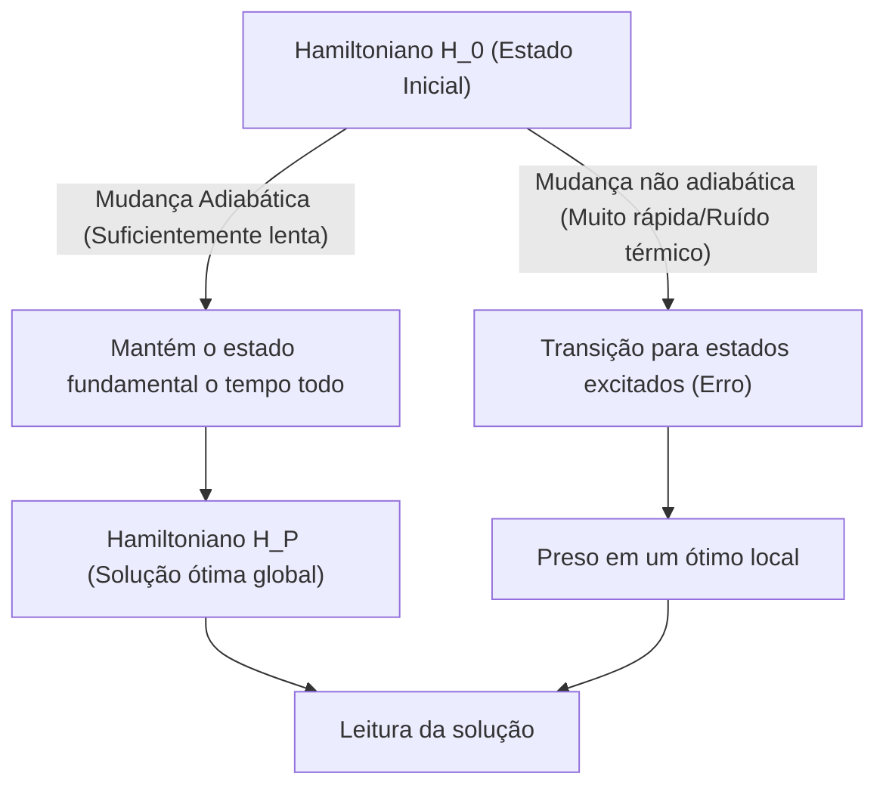
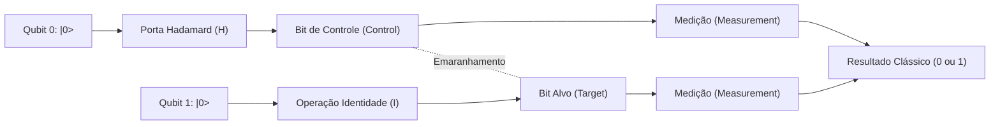
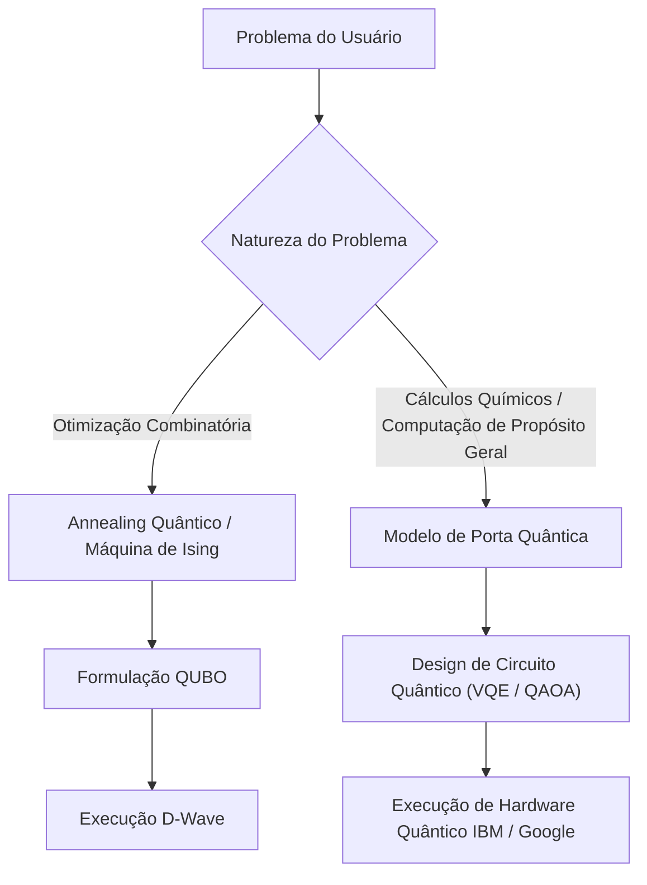

# A diferença entre Annealing Quântico e Modelo de Porta Quântica explicada de forma simples

A computação quântica é uma tecnologia de computação de próxima geração com o potencial de resolver de forma incrivelmente rápida, utilizando princípios da mecânica quântica (sobreposição e emaranhamento quântico), problemas específicos que levariam um tempo enorme para serem processados por computadores clássicos modernos (incluindo supercomputadores convencionais).

Atualmente, existem dois paradigmas principais na abordagem para a realização de computadores quânticos: **"Annealing Quântico" (Quantum Annealing)** e o **"Modelo de Porta Quântica" (Quantum Gate Model)**. Esses dois métodos diferem significativamente em sua abordagem física fundamental, nas tarefas computacionais em que se destacam e nos desafios de hardware na sua implementação.

Neste artigo, compararemos e explicaremos detalhadamente esses dois métodos a partir de uma perspectiva altamente técnica e detalhada, abrangendo os princípios físicos, modelos matemáticos (modelo de Ising, QUBO, transformações unitárias, etc.), as limitações tecnológicas atuais e os casos de uso específicos.

---

## 1. Fundamentos da Computação Quântica: A diferença fundamental em relação aos computadores clássicos

Os computadores clássicos processam informações como "Bits", que assumem o estado "0" ou "1". Em contraste, os computadores quânticos usam "Qubits" (Bits Quânticos). Graças ao princípio da "sobreposição" (Superposition) da mecânica quântica, os qubits podem manter os estados 0 e 1 simultaneamente de forma probabilística.

Além disso, utilizando um fenômeno chamado "emaranhamento quântico" (Entanglement), o estado de múltiplos qubits torna-se fortemente correlacionado, de modo que uma operação em um único qubit afeta instantaneamente todo o sistema. Isso possibilita a realização de cálculos semelhantes ao processamento paralelo (paralelismo quântico).

No entanto, os estados quânticos são extremamente vulneráveis a ruídos externos (como calor e ondas eletromagnéticas), e a "decoerência" (Decoherence) – onde o estado colapsa e retorna a um estado clássico – é um grande desafio. A diferença na abordagem a esse problema de ruído levou a grandes diferenças nas filosofias de design do annealing e do modelo de portas.

---

## 2. Detalhes do Annealing Quântico (Quantum Annealing)

O annealing quântico é uma arquitetura de computação especializada, focada principalmente em resolver **"problemas de otimização combinatória"**. Baseia-se na teoria proposta em 1998 por Hidetoshi Nishimori e Tadashi Kadowaki do Instituto de Tecnologia de Tóquio (Tokyo Tech), e tornou-se amplamente conhecido após ser comercializado pela primeira vez no mundo pela empresa canadense D-Wave Systems.

### 2.1. Mecanismo Físico: Modelo de Ising de campo transversal e flutuação quântica

O annealing quântico usa a propriedade natural dos sistemas físicos de tentar se acomodar no "estado de menor energia" (estado fundamental) para realizar cálculos.

Na abordagem clássica do "Simulated Annealing" (Recozimento Simulado), a flutuação térmica é usada para escapar das soluções ótimas locais (mínimos locais). Por outro lado, no annealing quântico, a "flutuação quântica" (Quantum Fluctuation) é usada para atravessar barreiras de energia por meio do "efeito de tunelamento quântico" (Quantum Tunneling), explorando de maneira mais eficiente a solução ótima global (mínimo global).

A evolução temporal do sistema de annealing quântico é descrita pelo seguinte Hamiltoniano (operador que representa a energia total do sistema) $H(t)$:

$$ H(t) = A(t) H_0 + B(t) H_P $$

Onde $t$ é o tempo, $A(t)$ é uma função que diminui gradualmente e $B(t)$ é uma função que aumenta gradualmente.

- **$H_0$ (Hamiltoniano inicial)**: Representa o campo transversal (Transverse field) e gera flutuações quânticas.
  $$ H_0 = - \sum_{i} \sigma_i^x $$
  ($\sigma_i^x$ é a matriz de Pauli X e representa a inversão de bits.)
- **$H_P$ (Hamiltoniano do problema)**: O modelo de Ising (Ising Model) que expressa o problema de otimização a ser resolvido.

No estado inicial ($t=0$), $A(0)$ está no seu máximo e o sistema está no estado fundamental de $H_0$ (um estado onde todos os estados possíveis estão uniformemente sobrepostos). A partir daí, o campo transversal é lentamente reduzido ao longo do tempo, enquanto simultaneamente a interação do Hamiltoniano do problema é aumentada.

### 2.2. Computação Quântica Adiabática (Adiabatic Quantum Computation)

O **"Teorema Adiabático" (Adiabatic Theorem)** é importante neste processo. De acordo com o teorema adiabático, se o sistema for alterado de forma "suficientemente lenta (adiabática)", o sistema permanecerá constantemente no estado fundamental do Hamiltoniano daquele momento.

Em outras palavras, quando no final tivermos $A(t) \to 0$ e $B(t) \to 1$, o sistema terá atingido o estado fundamental de $H_P$, ou seja, a **"solução exata do problema de otimização"**.

### 2.3. Mapeamento de QUBO para o Modelo de Ising

Para resolver problemas do mundo real em um annealer quântico, o problema deve ser formulado no formato **QUBO (Quadratic Unconstrained Binary Optimization)**.

A função objetivo do QUBO é definida da seguinte forma:
$$ \min_{x \in \{0,1\}^n} \sum_{i} Q_{ii} x_i + \sum_{i < j} Q_{ij} x_i x_j $$
Onde $x_i \in \{0, 1\}$ são variáveis binárias e $Q$ é a matriz de pesos.

Como o hardware (como os da D-Wave) lida com spins físicos (para cima / para baixo), é necessário converter as variáveis para o modelo de Ising usando $\sigma_i \in \{-1, +1\}$. A fórmula de conversão é a seguinte:
$$ x_i = \frac{1 - \sigma_i}{2} \quad \text{ou} \quad \sigma_i = 1 - 2x_i $$

Substituindo isso na equação do QUBO e simplificando, obtemos o Hamiltoniano do modelo de Ising $H_P$:
$$ H_P = - \sum_{i<j} J_{ij} \sigma_i^z \sigma_j^z - \sum_{i} h_i \sigma_i^z $$
- $J_{ij}$: A interação entre os spins (coeficiente de acoplamento). Força do acoplamento entre os qubits físicos.
- $h_i$: Campo magnético local (bias) aplicado a cada spin.

### 2.4. Hardware e desafios do Annealing Quântico (Exemplo da D-Wave)

Os processadores quânticos da D-Wave são realizados usando Dispositivos Supercondutores de Interferência Quântica (SQUID). O acoplamento entre qubits físicos depende do cabeamento de hardware e não apresenta acoplamento total (um estado em que todos os bits estão interconectados).
Embora o grau de acoplamento tenha melhorado, evoluindo do "Gráfico Chimera (Chimera graph)" original para o "Gráfico Pegasus (Pegasus)" e "Gráfico Zephyr (Zephyr)", ainda há limitações.

Por esse motivo, é necessário um processo chamado **"Incorporação de Menores (Minor Embedding)"**, que mapeia problemas com estruturas gráficas complexas nos gráficos físicos. Isso resulta em uma única variável lógica sendo representada por múltiplos qubits físicos (cadeias), o que reduz o número de qubits utilizáveis na prática e gera o problema de degradação da precisão do cálculo.

---

## 3. Detalhes do Modelo de Porta Quântica (Quantum Gate Model)

O modelo de porta quântica é uma extensão quântica das portas lógicas de computadores clássicos (AND, OR, NOT, etc.) e é uma arquitetura que permite a **"Computação Quântica Universal" (Universal Quantum Computation)**. Muitas empresas, como IBM, Google, Rigetti e IonQ, adotam esse método.

### 3.1. Transformações Unitárias e Vetores de Estado

No modelo de porta quântica, o estado de todo o sistema de qubits é expresso como um "Vetor de Estado" (State Vector) $|\psi\rangle$. O estado de 1 qubit é expresso como uma combinação linear dos estados base $|0\rangle$ e $|1\rangle$, como mostrado abaixo:
$$ |\psi\rangle = \alpha |0\rangle + \beta |1\rangle $$
Onde $\alpha$ e $\beta$ são amplitudes de probabilidade complexas, e satisfazem $|\alpha|^2 + |\beta|^2 = 1$. Esse estado é visualizado geometricamente como um ponto na "Esfera de Bloch" (Bloch Sphere).

As etapas da computação quântica são descritas como a aplicação de um **Operador Unitário (Unitary Operator) $U$** ao vetor de estado. Matrizes unitárias possuem a propriedade $U^\dagger U = I$ (o produto pelo seu conjugado hermitiano resulta na matriz identidade), sendo uma operação reversível que corresponde à evolução temporal da equação de Schrödinger na mecânica quântica.
$$ |\psi_{t+1}\rangle = U_t |\psi_t\rangle $$

### 3.2. Portas Quânticas Básicas e Modelo de Circuito

Algoritmos de computação quântica são projetados como uma sequência de portas quânticas (um circuito quântico).

- **Portas de Pauli (X, Y, Z)**: Rotações de 180 graus em torno de cada eixo na esfera de Bloch. A porta X equivale à porta clássica NOT.
- **Porta Hadamard (H)**: Transforma $|0\rangle$ em $\frac{|0\rangle + |1\rangle}{\sqrt{2}}$, criando um estado de sobreposição.
  $$ H = \frac{1}{\sqrt{2}} \begin{pmatrix} 1 & 1 \\ 1 & -1 \end{pmatrix} $$
- **Porta CNOT (Controlled-NOT)**: Uma porta de 2 qubits. Aplica a porta X ao bit alvo apenas quando o bit de controle é $|1\rangle$. Isso gera emaranhamento quântico (Entanglement).

Qualquer algoritmo quântico pode ser expresso de forma aproximada através da combinação de um pequeno número de portas de 1 qubit e portas CNOT (conjunto de portas universais).

### 3.3. Correção de Erros e o Caminho do NISQ para o FTQC

O maior desafio do modelo de porta quântica é a "decoerência", onde os estados quânticos são destruídos por ruídos. Conforme os passos de cálculo (profundidade das portas) aumentam, os erros se acumulam.

Para realizar cálculos ideais, a **Correção de Erros Quânticos (Quantum Error Correction)** é essencial. Por exemplo, em métodos como o "Código de Superfície" (Surface Code), agrupa-se múltiplos qubits físicos para formar 1 "qubit lógico" (Logical Qubit) sem erros. No entanto, são necessários milhares a dezenas de milhares de qubits físicos para criar 1 qubit lógico, resultando em um enorme custo indireto (overhead).

O estágio em que estamos agora é a era dos dispositivos **NISQ (Noisy Intermediate-Scale Quantum)** de dezenas a centenas de qubits sem correção de erros. Para alcançar o **FTQC (Fault-Tolerant Quantum Computing)** com correção de erros total, muitos avanços ainda são necessários.

---

## 4. Resumo da Comparação Técnica e Matemática

Vamos comparar as diferenças fundamentais entre as duas arquiteturas.

| Item de Comparação | Annealing Quântico (Quantum Annealing) | Modelo de Porta Quântica (Gate Model) |
| :--- | :--- | :--- |
| **Modelo Computacional** | Computação quântica adiabática (Evolução temporal contínua do Hamiltoniano) | Transformações unitárias (Sequência de operações discretas em portas) |
| **Problemas Adequados** | Problemas de otimização combinatória (QUBO, modelo de Ising) | Universal (Simulação química quântica, fatoração de primos, busca, etc.) |
| **Poder de Expressão** | Otimização heurística (Soluções aproximadas) | Equivalente à Máquina de Turing Quântica Universal (Teoricamente capaz de todos os cálculos) |
| **Exemplos de Implementação** | D-Wave Systems | IBM, Google, Quantinuum, IonQ, etc. |
| **Tolerância a Ruídos** | Relativamente alta (Permanece perto do estado fundamental, certo ruído térmico é aceitável) | Muito fraca (O mínimo ruído causa desalinhamento de fase e destrói o cálculo) |
| **Escalabilidade** | Milhares a dezenas de milhares de qubits (Depende da estrutura física. A conversão para qubits lógicos é difícil) | Escala de centenas de qubits (Milhões são necessários para FTQC) |

O Annealing Quântico atua como um "coprocessador para fins específicos", sendo adequado para resolver problemas de otimização complementando os limites dos computadores clássicos. Por outro lado, o Modelo de Porta Quântica é a versão quântica de um "computador de propósito geral" e visa fundamentalmente superar as capacidades de cálculo dos computadores clássicos (supremacia quântica), mas a construção do hardware é extremamente difícil.

---

## 5. Limitações e Desafios Atuais

### Limitações do Annealing Quântico
1. **Limitação de Conectividade (Connectivity)**: Devido à incorporação de menores (minor embedding) mencionada acima, à medida que a escala do problema aumenta, o número de qubits físicos necessários cresce exponencialmente.
2. **Precisão dos Coeficientes (Precision)**: Os erros físicos ao configurar os parâmetros analógicos, como $J_{ij}$ e $h_i$, no hardware, afetam diretamente a qualidade da solução.
3. **Temperatura e Transição Não Adiabática**: Como a temperatura do sistema não é o zero absoluto, há uma probabilidade de se desviar da solução ótima devido à excitação térmica.

### Limitações do Modelo de Porta Quântica
1. **Tempo de Coerência (Coherence Time)**: O tempo em que o estado quântico pode ser mantido é de apenas alguns microssegundos a milissegundos, limitando severamente o número de portas (profundidade do circuito) que podem ser executadas nesse intervalo.
2. **Fidelidade da Porta (Gate Fidelity)**: A taxa de erro nas operações de portas de 2 qubits (como a CNOT) ainda não é suficientemente baixa (geralmente em torno de 99,x%). Para realizar o FTQC, isso precisará ser elevado para mais de 99,99%.
3. **Volume Quântico (Quantum Volume)**: O maior desafio atual é escalar não apenas o número de qubits puros, mas a capacidade computacional efetiva (Volume Quântico), que leva em conta a interconexão e a taxa de erros.

---

## 6. Casos de Uso Específicos e Algoritmos

Vamos ver as áreas de aplicação específicas em que cada método se destaca.

### 6.1. Casos de Uso do Annealing Quântico
- **Logística e Roteamento**: Otimização de rotas de entrega para vários veículos (Variação do problema do caixeiro viajante). Busca de rotas em tempo real considerando o congestionamento do tráfego.
- **Engenharia Financeira**: Otimização de portfólios. Exploração da combinação de ativos para maximizar retornos enquanto se minimizam os riscos.
- **Aprendizado de Máquina (Machine Learning)**: Seleção de Características (Feature Selection). Extrair a combinação de variáveis que mais contribui para as previsões de um enorme conjunto de dados.
- **Manufatura**: O problema de escalonamento job-shop nas fábricas (qual máquina deve processar qual peça e em que ordem para ser a mais rápida).

### 6.2. Casos de Uso do Modelo de Porta Quântica
- **Simulação Química Quântica**: Simulação de alta precisão dos estados energéticos de moléculas e reações químicas.
- **Fatoração em Primos (Algoritmo de Shor)**: Um algoritmo para fatorar enormes números compostos em tempo polinomial. Se for colocado em uso prático, a infraestrutura atual de criptografia de chave pública, como o RSA, será quebrada, tornando urgente a transição para a criptografia pós-quântica (PQC).
- **Busca em Banco de Dados (Algoritmo de Grover)**: Quando se pesquisa dados em bancos de dados não classificados, computadores clássicos exigem etapas de $O(N)$, enquanto o algoritmo de Grover pode pesquisar em etapas de $O(\sqrt{N})$.

### 6.3. Algoritmos Híbridos na Era NISQ: VQE e QAOA
Para superar as limitações dos circuitos quânticos rasos dos dispositivos NISQ, algoritmos como os "Algoritmos Quânticos Variacionais" (Variational Quantum Algorithms), que combinam os pontos fortes dos computadores quânticos e clássicos, estão chamando a atenção.

- **VQE (Variational Quantum Eigensolver)**: Um algoritmo para calcular a energia do estado fundamental de moléculas. Ele prepara os estados quânticos usando um circuito quântico parametrizado (Ansatz) e mede o valor esperado da energia $\langle \psi(\theta) | H | \psi(\theta) \rangle$. Usando esse valor esperado como função objetivo, algoritmos clássicos de otimização (como a descida de gradiente) são usados para atualizar os parâmetros $\theta$. A repetição disso até a convergência fornece o estado exato de energia da molécula.
- **QAOA (Quantum Approximate Optimization Algorithm)**: Um algoritmo para resolver problemas de otimização combinatória usando o modelo de portas quânticas. Ele aproxima a evolução temporal adiabática do annealing quântico em operações de portas discretas por meio da "Trotterização" (Trotterization), aplicando alternadamente os Hamiltonianos para obter soluções aproximadas. O QAOA é considerado um meio promissor de resolver problemas de otimização na abordagem por portas.

---

## 7. Conclusão

Tanto o Annealing Quântico quanto o Modelo de Porta Quântica são semelhantes no sentido de que utilizam as misteriosas propriedades da mecânica quântica como um recurso computacional, mas suas abordagens e objetivos finais são amplamente diferentes.

- O **Annealing Quântico** é um "motor heurístico especializado" voltado para entregar de forma antecipada resultados práticos para problemas reais específicos de otimização combinatória. Diversas provas de conceito (PoCs) já estão em andamento por várias empresas.
- O **Modelo de Porta Quântica** é um "computador quântico de propósito geral" com o potencial de abalar fundamentalmente o paradigma da ciência da computação, que vai desde simulações rigorosas em física e química até decodificação de criptografia. No entanto, é necessária pesquisa e desenvolvimento a longo prazo para superar o enorme obstáculo da correção de erros.

No futuro, espera-se que um ambiente de **"computação heterogênea" (Heterogeneous Computing)** seja construído, tendo os supercomputadores clássicos (HPC) como o núcleo, enquanto as máquinas de annealing serão chamadas para tarefas de otimização e computadores quânticos baseados em portas para cálculos de química quântica.

Os computadores quânticos ainda são uma tecnologia em desenvolvimento, mas estão evoluindo a passos largos, tanto em hardware quanto em algoritmos. Compreender a matemática do modelo de Ising e os fundamentos dos circuitos quânticos será uma grande ferramenta para a era dos "nativos quânticos" que está por vir.

---
*Este artigo é uma explicação abrangente dos conceitos básicos da computação quântica até as tendências mais recentes de hardware. Fique atento às futuras tendências de pesquisa.*
