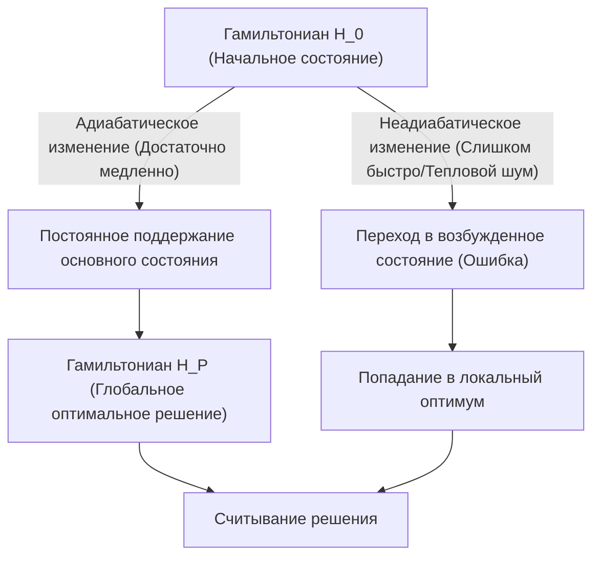
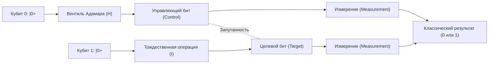
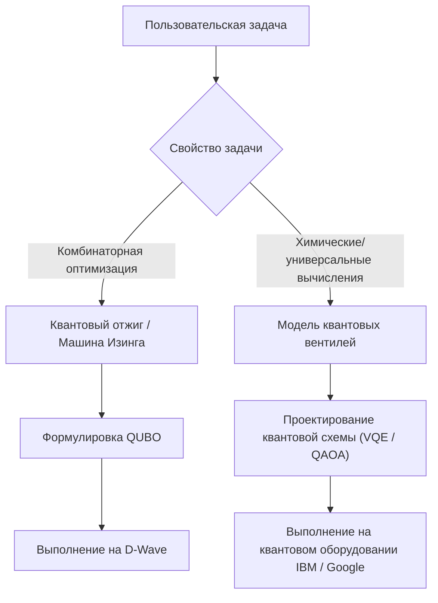

# Простое объяснение разницы между квантовым отжигом и квантовыми вентилями

Квантовые вычисления — это вычислительная технология следующего поколения, которая имеет потенциал экспоненциально быстрее решать определенные задачи, требующие огромного количества времени на современных классических компьютерах (включая традиционные суперкомпьютеры), используя принципы квантовой механики (суперпозицию и квантовую запутанность).

В настоящее время существуют две основные парадигмы в подходах к реализации квантовых компьютеров: **«квантовый отжиг (Quantum Annealing)»** и **«модель квантовых вентилей (Quantum Gate Model)»**. Эти два метода значительно различаются базовыми физическими подходами, задачами, в которых они сильны, а также аппаратными проблемами при реализации.

В этой статье мы подробно сравним и объясним эти два метода с очень глубокой и технической точки зрения: от физических принципов и математических моделей (модель Изинга, QUBO, унитарные преобразования и т. д.) до текущих технических ограничений и конкретных примеров использования.

---

## 1. Основы квантовых вычислений: фундаментальные отличия от классических компьютеров

Классические компьютеры обрабатывают информацию с помощью «битов (Bit)», которые могут принимать значения «0» или «1». С другой стороны, квантовые компьютеры используют «квантовые биты (Qubit)» (кубиты). Благодаря принципу «суперпозиции (Superposition)» из квантовой механики, кубит может одновременно с определенной вероятностью находиться в состояниях 0 и 1.

Кроме того, при использовании явления, называемого «квантовой запутанностью (Entanglement)», состояния нескольких кубитов оказываются сильно коррелированными друг с другом, так что воздействие на один кубит мгновенно влияет на всю систему. Это делает возможным выполнение вычислений, подобных параллельной обработке (квантовый параллелизм).

Однако квантовые состояния крайне уязвимы к внешнему шуму (такому как тепло или электромагнитные волны), и серьезной проблемой является «декогеренция (Decoherence)», при которой квантовое состояние разрушается и возвращается к классическому. Различия в подходах к решению этой проблемы шума привели к значительным различиям в философии проектирования квантового отжига и модели вентилей.

---

## 2. Подробно о квантовом отжиге (Quantum Annealing)

Квантовый отжиг — это специализированная вычислительная архитектура, предназначенная в первую очередь для решения **«задач комбинаторной оптимизации»**. Она основана на теории, предложенной в 1998 году Хидэтоси Нисимори и Тадаси Кадоваки из Токийского технологического института, и стала широко известна после того, как канадская компания D-Wave Systems впервые в мире коммерциализировала её.

### 2.1. Физический механизм: модель Изинга в поперечном магнитном поле и квантовые флуктуации

Квантовый отжиг использует для вычислений свойство природных физических систем стремиться к «состоянию с наименьшей энергией (основному состоянию)».

В классическом подходе «имитации отжига (Simulated Annealing)» тепловые флуктуации используются для выхода из локального оптимума (локального минимума). Напротив, квантовый отжиг использует «квантовые флуктуации (Quantum Fluctuation)» для прохождения через энергетические барьеры с помощью «квантового туннелирования (Quantum Tunneling)», тем самым более эффективно отыскивая глобальный оптимум (глобальный минимум).

Эволюция системы квантового отжига во времени описывается следующим гамильтонианом (оператором полной энергии системы) $H(t)$:

$$ H(t) = A(t) H_0 + B(t) H_P $$

Где $t$ — время, $A(t)$ — постепенно убывающая функция, а $B(t)$ — постепенно возрастающая функция.

- **$H_0$ (Начальный гамильтониан)**: Представляет поперечное магнитное поле (Transverse field) и порождает квантовые флуктуации.
  $$ H_0 = - \sum_{i} \sigma_i^x $$
  ($\sigma_i^x$ — матрица Паули X, представляющая переворот бита.)
- **$H_P$ (Гамильтониан задачи)**: Модель Изинга (Ising Model), которая выражает решаемую задачу оптимизации.

В начальном состоянии ($t=0$) $A(0)$ максимально, и система находится в основном состоянии $H_0$ (где все состояния равномерно суперпонированы). Затем с течением времени поперечное магнитное поле медленно ослабляется, и одновременно усиливается взаимодействие гамильтониана задачи.

### 2.2. Адиабатические квантовые вычисления (Adiabatic Quantum Computation)

В этом процессе важную роль играет **«адиабатическая теорема (Adiabatic Theorem)»**. Согласно ей, если систему изменять «достаточно медленно (адиабатически)», она всегда будет оставаться в основном состоянии гамильтониана на данный момент времени.

Это означает, что когда в конечном итоге $A(t) \to 0$ и $B(t) \to 1$, система достигает основного состояния $H_P$, то есть **«точного решения задачи оптимизации»**.

### 2.3. Преобразование от QUBO к модели Изинга

Чтобы решить реальную задачу на квантовом отжиге, необходимо сформулировать её в формате **QUBO (Quadratic Unconstrained Binary Optimization: квадратичная безусловная бинарная оптимизация)**.

Целевая функция QUBO определяется следующим образом:
$$ \min_{x \in \{0,1\}^n} \sum_{i} Q_{ii} x_i + \sum_{i < j} Q_{ij} x_i x_j $$
Где $x_i \in \{0, 1\}$ — двоичная переменная, а $Q$ — матрица весов.

Поскольку аппаратное обеспечение (например, D-Wave) работает с физическими спинами (вверх/вниз), необходимо преобразовать переменные в модель Изинга, используя $\sigma_i \in \{-1, +1\}$. Формула преобразования выглядит так:
$$ x_i = \frac{1 - \sigma_i}{2} \quad \text{или} \quad \sigma_i = 1 - 2x_i $$

Подставив это в уравнение QUBO и упростив, мы получим гамильтониан модели Изинга $H_P$:
$$ H_P = - \sum_{i<j} J_{ij} \sigma_i^z \sigma_j^z - \sum_{i} h_i \sigma_i^z $$
- $J_{ij}$: Взаимодействие между спинами (коэффициент связи). Физическая сила связи между кубитами.
- $h_i$: Локальное магнитное поле (смещение) для каждого спина.

### 2.4. Аппаратное обеспечение квантового отжига и его проблемы (на примере D-Wave)

Квантовые процессоры D-Wave реализованы с использованием сверхпроводящих квантовых интерферометров (SQUID). Физическая связь между кубитами зависит от аппаратной разводки, и они не имеют полной связности (когда все биты соединены друг с другом).
От раннего графа «Chimera» до «Pegasus» и «Zephyr», степень связности улучшилась, но ограничения всё ещё существуют.

Поэтому требуется процесс, называемый **«внедрением миноров (Minor Embedding)»**, который отображает задачу со сложной графовой структурой на физический граф. Поскольку при этом одна логическая переменная представляется несколькими физическими кубитами (цепочкой), возникает проблема: уменьшается эффективное количество доступных кубитов и снижается точность вычислений.

---

## 3. Подробно о модели квантовых вентилей (Quantum Gate Model)

Модель квантовых вентилей является квантовым расширением логических вентилей классического компьютера (AND, OR, NOT и т. д.) и представляет собой архитектуру, обеспечивающую **«универсальные квантовые вычисления (Universal Quantum Computation)»**. Многие компании, такие как IBM, Google, Rigetti и IonQ, используют этот подход.

### 3.1. Унитарные преобразования и вектор состояния

В модели квантовых вентилей состояние всей системы кубитов представляется как «вектор состояния (State Vector)» $|\psi\rangle$. Состояние одного кубита выражается как линейная комбинация базисных состояний $|0\rangle$ и $|1\rangle$:
$$ |\psi\rangle = \alpha |0\rangle + \beta |1\rangle $$
Где $\alpha$ и $\beta$ — комплексные амплитуды вероятности, удовлетворяющие условию $|\alpha|^2 + |\beta|^2 = 1$. Геометрически это состояние визуализируется как точка на «сфере Блоха (Bloch Sphere)».

Шаги квантовых вычислений описываются как применение **унитарного оператора (Unitary Operator) $U$** к вектору состояния. Унитарная матрица обладает свойством $U^\dagger U = I$ (её произведение с эрмитово сопряженной матрицей дает единичную матрицу), что соответствует обратимой операции, описывающей эволюцию во времени уравнения Шрёдингера в квантовой механике.
$$ |\psi_{t+1}\rangle = U_t |\psi_t\rangle $$

### 3.2. Основные квантовые вентили и модель схем

Алгоритм квантовых вычислений проектируется как последовательность квантовых вентилей (квантовая схема).

- **Вентили Паули (X, Y, Z)**: Поворот на 180 градусов вокруг каждой оси на сфере Блоха. Вентиль X эквивалентен классическому вентилю NOT.
- **Вентиль Адамара (H)**: Преобразует $|0\rangle$ в $\frac{|0\rangle + |1\rangle}{\sqrt{2}}$, создавая состояние суперпозиции.
  $$ H = \frac{1}{\sqrt{2}} \begin{pmatrix} 1 & 1 \\ 1 & -1 \end{pmatrix} $$
- **Вентиль CNOT (Controlled-NOT)**: Двухкубитный вентиль. Применяет вентиль X к целевому кубиту только в том случае, если управляющий кубит находится в состоянии $|1\rangle$. Это создает квантовую запутанность (Entanglement).

Любой квантовый алгоритм можно приблизительно выразить комбинацией небольшого числа однокубитных вентилей и вентилей CNOT (универсальный набор вентилей).

### 3.3. Коррекция ошибок и путь от NISQ к FTQC

Самая большая проблема модели квантовых вентилей — «декогеренция», при которой квантовое состояние разрушается из-за шума. Чем глубже шаг вычисления (глубина схемы), тем больше накапливается ошибок.

Для выполнения идеальных вычислений необходима **квантовая коррекция ошибок (Quantum Error Correction)**. Например, в таких методах, как «поверхностный код (Surface Code)», несколько физических кубитов объединяются для формирования одного «логического кубита (Logical Qubit)» без ошибок. Однако для создания одного логического кубита требуются тысячи или десятки тысяч физических кубитов, что приводит к огромным накладным расходам.

Этап, на котором мы находимся сейчас, — это эпоха устройств **NISQ (Noisy Intermediate-Scale Quantum)** с десятками или сотнями кубитов без коррекции ошибок. Для достижения **FTQC (Fault-Tolerant Quantum Computing: отказоустойчивые квантовые вычисления)** с полной коррекцией ошибок требуется еще множество прорывов.

---

## 4. Резюме технического и математического сравнения

Сравним фундаментальные различия между двумя архитектурами.

| Параметр сравнения | Квантовый отжиг (Quantum Annealing) | Модель квантовых вентилей (Gate Model) |
| :--- | :--- | :--- |
| **Вычислительная модель** | Адиабатические квантовые вычисления (непрерывная эволюция гамильтониана во времени) | Унитарные преобразования (последовательность дискретных вентильных операций) |
| **Подходящие задачи** | Задачи комбинаторной оптимизации (QUBO, модель Изинга) | Универсальные (квантово-химическое моделирование, факторизация, поиск и т. д.) |
| **Выразительная способность** | Эвристическая оптимизация (приближенные решения) | Эквивалентна универсальной квантовой машине Тьюринга (теоретически возможны любые вычисления) |
| **Примеры реализации** | D-Wave Systems | IBM, Google, Quantinuum, IonQ и др. |
| **Устойчивость к шуму** | Относительно высокая (остается вблизи основного состояния, допустим некоторый тепловой шум) | Очень низкая (даже небольшой шум вызывает сдвиг фазы и разрушает результат вычислений) |
| **Масштабируемость** | Масштаб от тысяч до десятков тысяч кубитов (зависит от физической структуры. Логические биты создавать сложно) | Масштаб сотен кубитов (для FTQC потребуются масштабы в миллионы) |

Квантовый отжиг подходит для решения задач оптимизации в качестве «сопроцессора специального назначения», дополняющего ограничения классических компьютеров. С другой стороны, модель квантовых вентилей является квантовой версией «универсального компьютера» и в конечном итоге стремится к вычислительной мощности, превосходящей классические компьютеры (квантовое превосходство), однако создание такого аппаратного обеспечения чрезвычайно сложно.

---

## 5. Текущие ограничения и проблемы

### Ограничения квантового отжига
1. **Ограничения связности (Connectivity)**: Из-за упомянутого ранее внедрения миноров требуемое количество физических кубитов экспоненциально возрастает по мере увеличения размера задачи.
2. **Точность коэффициентов (Precision)**: Физические ошибки при настройке на оборудовании таких аналоговых параметров, как $J_{ij}$ и $h_i$, напрямую влияют на качество решения.
3. **Температура и неадиабатические переходы**: Поскольку температура системы не равна абсолютному нулю, существует вероятность отклонения от оптимального решения из-за теплового возбуждения.

### Ограничения модели квантовых вентилей
1. **Время когерентности (Coherence Time)**: Время, в течение которого может поддерживаться квантовое состояние, составляет лишь от нескольких микросекунд до нескольких миллисекунд, и количество вентилей (глубина схемы), которые можно выполнить за это время, строго ограничено.
2. **Достоверность вентилей (Gate Fidelity)**: Частота ошибок операций для двухкубитных вентилей (например, CNOT) всё еще недостаточно низкая (обычно около 99.x%). Для реализации FTQC её необходимо повысить до 99.99% и выше.
3. **Квантовый объем (Quantum Volume)**: Текущая главная задача — масштабирование не только количества кубитов, но и эффективной вычислительной мощности (квантового объема) с учетом взаимосвязей и частоты ошибок.

---

## 6. Конкретные примеры использования и алгоритмы

Давайте рассмотрим конкретные области применения, в которых каждый из методов преуспевает.

### 6.1. Примеры использования квантового отжига
- **Логистика и маршрутизация**: Оптимизация маршрутов доставки для большого числа транспортных средств (вариации задачи коммивояжера). Поиск маршрутов в реальном времени с учетом пробок.
- **Финансовая инженерия**: Оптимизация портфеля. Поиск комбинации активов для максимизации доходности при минимизации рисков.
- **Машинное обучение**: Отбор признаков (Feature Selection). Извлечение комбинаций переменных из огромных наборов данных, которые вносят наибольший вклад в прогнозирование.
- **Производство**: Задача составления расписания (Job-shop scheduling) на заводах (на каком станке, какие детали и в каком порядке обрабатывать для максимальной скорости).

### 6.2. Примеры использования модели квантовых вентилей
- **Квантово-химическое моделирование**: Высокоточное моделирование энергетических состояний молекул и химических реакций.
- **Факторизация на простые множители (Алгоритм Шора)**: Алгоритм для факторизации огромных составных чисел за полиномиальное время. Если это будет реализовано на практике, текущая инфраструктура криптографии с открытым ключом, такая как шифрование RSA, будет взломана, поэтому переход на постквантовую криптографию (PQC) является насущной необходимостью.
- **Поиск в базе данных (Алгоритм Гровера)**: Для поиска нужных данных в неструктурированной базе данных классическому компьютеру требуется $O(N)$ шагов, тогда как алгоритм Гровера позволяет выполнить поиск за $O(\sqrt{N})$ шагов.

### 6.3. Гибридные алгоритмы эпохи NISQ: VQE и QAOA
Для преодоления ограничений неглубоких квантовых схем в устройствах NISQ привлекают внимание «вариационные квантовые алгоритмы (Variational Quantum Algorithms)», объединяющие преимущества квантовых и классических компьютеров.

- **VQE (Variational Quantum Eigensolver)**: Алгоритм для поиска энергии основного состояния молекулы. Он использует параметризованную квантовую схему (Ansatz) для подготовки квантового состояния и измерения ожидаемого значения энергии $\langle \psi(\theta) | H | \psi(\theta) \rangle$. Используя это ожидаемое значение в качестве целевой функции, параметры $\theta$ обновляются с помощью классического алгоритма оптимизации (например, градиентного спуска). Повторяя этот процесс до сходимости, определяется точное энергетическое состояние молекулы.
- **QAOA (Quantum Approximate Optimization Algorithm)**: Алгоритм для решения задач комбинаторной оптимизации с использованием модели квантовых вентилей. Адиабатическая эволюция времени квантового отжига аппроксимируется дискретными вентильными операциями с помощью «разложения Троттера (Trotterization)», и приблизительное решение получается путем поочередного применения гамильтониана. Ожидается, что QAOA станет мощным средством решения задач оптимизации на вентильных машинах.

---

## 7. Заключение

Квантовый отжиг и модель квантовых вентилей имеют много общего в том, что оба они используют загадочные свойства квантовой механики в качестве вычислительных ресурсов, однако их подходы и конечные цели сильно различаются.

- **Квантовый отжиг** — это «специализированная эвристическая машина» для достижения ранних практических результатов в решении конкретной реальной задачи комбинаторной оптимизации. В настоящее время различные компании уже проводят эксперименты для подтверждения концепции (PoC).
- **Модель квантовых вентилей** — это «универсальный квантовый компьютер» с потенциалом коренным образом изменить парадигму информатики, от строгих физико-химических симуляций до расшифровки кодов. Однако требуются долгосрочные исследования и разработки, чтобы преодолеть гигантский барьер коррекции ошибок.

В будущем ожидается создание **«гетерогенных (разнородных) вычислительных»** сред, в которых классические суперкомпьютеры (HPC) будут ядром, машины отжига будут вызываться для задач оптимизации, а квантовые компьютеры вентильного типа — для квантово-химических вычислений.

Квантовые компьютеры — всё ещё развивающаяся технология, но они стремительно эволюционируют как в аппаратном обеспечении, так и в алгоритмах. Понимание математики модели Изинга и основ квантовых схем станет мощным оружием в грядущую эпоху «квантовых аборигенов (quantum natives)».

---
*Эта статья представляет собой всестороннее объяснение от базовых концепций квантовых вычислений до последних тенденций в аппаратном обеспечении. Пожалуйста, продолжайте следить за последними тенденциями исследований в будущем.*
