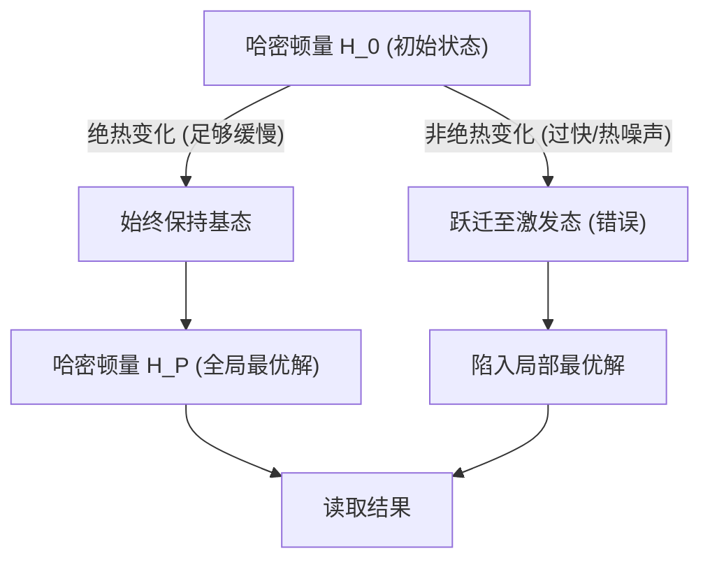
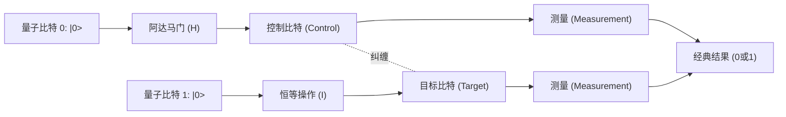
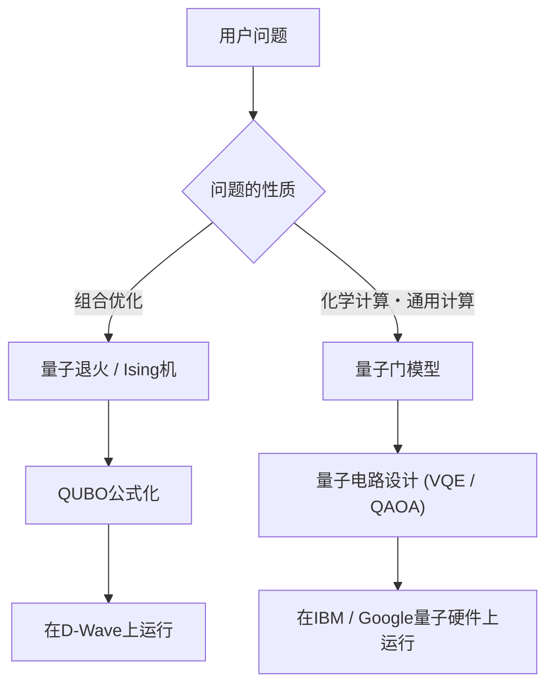

# 通俗易懂地解说量子退火与量子门模型的区别

量子计算是下一代计算技术，它利用量子力学原理（叠加态和量子纠缠），有望以突飞猛进的速度解决现代经典计算机（包括传统超级计算机）需要耗费大量时间才能解决的特定问题。

目前，实现量子计算机的方法主要分为两大主流范式：**“量子退火（Quantum Annealing）”**和**“量子门模型（Quantum Gate Model）”**。这两种方法在底层物理途径、擅长的计算任务以及硬件实现的挑战上存在巨大差异。

本文将从非常详细且专业的技术视角，对这两种方法进行彻底的比较与解说，涵盖物理原理、数学模型（如Ising模型、QUBO、酉变换等）、当前的技术局限性，直至具体的应用场景。

---

## 1. 量子计算的基础：与经典计算机的根本区别

经典计算机处理信息时使用的是状态为“0”或“1”的“比特（Bit）”。而量子计算机使用的是“量子比特（Qubit）”。由于量子力学的“叠加（Superposition）”原理，量子比特可以同时以一定概率拥有0和1的状态。

此外，通过利用被称为“量子纠缠（Entanglement）”的现象，多个量子比特的状态会相互产生强烈的相关性，对一个量子比特的操作会瞬间影响整个系统。这使得类似于并行处理的计算（量子并行性）成为可能。

然而，量子状态对外部噪声（如热量和电磁波等）非常脆弱，状态遭到破坏而退化为经典状态的“退相干（Decoherence）”是一个重大难题。针对这一噪声问题的不同处理方式，导致了量子退火和门模型在设计思想上的巨大差异。

---

## 2. 量子退火 (Quantum Annealing) 详解

量子退火主要是一种专用于解决**“组合优化问题”**的专用计算架构。它基于东京工业大学的门胁万平和西森秀稔在1998年提出的理论，随后由加拿大的D-Wave Systems公司在世界上首次实现商业化而广为人知。

### 2.1. 物理机制：横向磁场Ising模型与量子涨落

量子退火利用了自然界物理系统倾向于稳定在“最低能量状态（基态）”的特性来进行计算。

在经典的“模拟退火（Simulated Annealing）”方法中，利用热涨落（热波动）来逃离局部最优解。而在量子退火中，则是利用“量子涨落（Quantum Fluctuation）”，通过“量子隧道效应（Quantum Tunneling）”穿透能量势垒，从而更高效地寻找全局最优解。

量子退火系统的时间演化可由以下哈密顿量（表示系统总能量的算符）$H(t)$ 来描述：

$$ H(t) = A(t) H_0 + B(t) H_P $$

其中，$t$ 表示时间，$A(t)$ 是逐渐减小的函数，$B(t)$ 是逐渐增大的函数。

- **$H_0$（初始哈密顿量）**: 表示横向磁场（Transverse field），用于产生量子涨落。
  $$ H_0 = - \sum_{i} \sigma_i^x $$
  （$\sigma_i^x$ 为泡利X矩阵，表示比特的翻转。）
- **$H_P$（问题哈密顿量）**: 表示要解决的优化问题的Ising模型（Ising Model）。

在初始状态（$t=0$）下，$A(0)$ 达到最大，系统处于 $H_0$ 的基态（所有状态均匀叠加的状态）。然后随着时间的推移，缓慢地减弱横向磁场，同时增强问题哈密顿量的相互作用。

### 2.2. 绝热量子计算 (Adiabatic Quantum Computation)

在这一过程中，关键在于**“绝热定理（Adiabatic Theorem）”**。根据绝热定理，只要系统的变化“足够缓慢（绝热）”，系统就会始终保持在当前哈密顿量的基态。

也就是说，当最终 $A(t) \to 0$ 且 $B(t) \to 1$ 时，系统就会处于 $H_P$ 的基态，即得到了**“优化问题的精确解”**。

### 2.3. 从QUBO到Ising模型的映射

要在量子退火机上解决实际问题，必须将问题转化为**QUBO（Quadratic Unconstrained Binary Optimization：无约束二次伪布尔优化）**的形式。

QUBO的目标函数定义如下：
$$ \min_{x \in \{0,1\}^n} \sum_{i} Q_{ii} x_i + \sum_{i < j} Q_{ij} x_i x_j $$
其中，$x_i \in \{0, 1\}$ 是二值变量，$Q$ 是权重矩阵。

由于硬件（如D-Wave）处理的是物理自旋（向上/向下），我们需要将其转换为使用变量 $\sigma_i \in \{-1, +1\}$ 的Ising模型。转换公式如下：
$$ x_i = \frac{1 - \sigma_i}{2} \quad \text{或} \quad \sigma_i = 1 - 2x_i $$

将此公式代入QUBO方程并整理，即可得到Ising模型的哈密顿量 $H_P$：
$$ H_P = - \sum_{i<j} J_{ij} \sigma_i^z \sigma_j^z - \sum_{i} h_i \sigma_i^z $$
- $J_{ij}$: 自旋之间的相互作用（耦合系数）。代表物理量子比特之间的耦合强度。
- $h_i$: 作用于每个自旋的局部磁场（偏置）。

### 2.4. 量子退火的硬件与挑战（以D-Wave为例）

D-Wave的量子处理器是使用超导量子干涉器件（SQUID）实现的。物理量子比特之间的连接依赖于硬件布线，并非全连接（即所有比特相互连接）。
从早期的“嵌合体图（Chimera graph）”，到“飞马图（Pegasus）”，再到“和风图（Zephyr）”，虽然连接度有所提升，但仍存在限制。

因此，需要一种称为**“次图嵌入（Minor Embedding）”**的处理，将具有复杂图结构的问题映射到物理图上。通过这种方式，一个逻辑变量由多个物理量子比特（链）表示，这会导致可用的实际量子比特数减少，并降低计算精度。

---

## 3. 量子门模型 (Quantum Gate Model) 详解

量子门模型是经典计算机逻辑门（如AND、OR、NOT等）的量子力学扩展，是一种能够实现**“通用量子计算（Universal Quantum Computation）”**的架构。包括IBM、Google、Rigetti、IonQ等在内的许多公司都采用了这种方法。

### 3.1. 酉变换与状态向量

在量子门模型中，整个量子比特系统的状态用“状态向量（State Vector）” $|\psi\rangle$ 来表示。一个量子比特的状态可以表示为基态 $|0\rangle$ 和 $|1\rangle$ 的线性组合：
$$ |\psi\rangle = \alpha |0\rangle + \beta |1\rangle $$
这里，$\alpha$ 和 $\beta$ 是复概率幅，且满足 $|\alpha|^2 + |\beta|^2 = 1$。从几何学上看，这种状态可以可视化为“布洛赫球面（Bloch Sphere）”上的一个点。

量子计算的步骤被描述为对状态向量应用**酉算符（Unitary Operator） $U$**。酉矩阵具有 $U^\dagger U = I$（与其埃尔米特共轭的乘积为单位矩阵）的性质，对应于量子力学中薛定谔方程时间演化的可逆操作。
$$ |\psi_{t+1}\rangle = U_t |\psi_t\rangle $$

### 3.2. 基本量子门与电路模型

量子计算算法被设计为一系列量子门的操作序列（量子电路）。

- **泡利门 (X, Y, Z)**: 对应于布洛赫球面上绕各轴旋转180度。X门相当于经典计算中的NOT门。
- **阿达马门 (H)**: 将 $|0\rangle$ 转换为 $\frac{|0\rangle + |1\rangle}{\sqrt{2}}$，从而创造叠加态。
  $$ H = \frac{1}{\sqrt{2}} \begin{pmatrix} 1 & 1 \\ 1 & -1 \end{pmatrix} $$
- **CNOT门 (Controlled-NOT)**: 这是一个双量子比特门。只有当控制比特（Control qubit）为 $|1\rangle$ 时，才对目标比特（Target qubit）应用X门操作。这可以生成量子纠缠（Entanglement）。

任何量子算法都可以通过少量单量子比特门和CNOT门的组合进行近似表达（通用门集）。

### 3.3. 纠错以及从NISQ到FTQC之路

量子门模型最大的挑战在于量子状态因噪声而受到破坏的“退相干”现象。随着计算步骤（门深度）的增加，错误会逐渐积累。

为了进行理想的计算，**量子纠错（Quantum Error Correction）**是必不可少的。例如，通过“表面码（Surface Code）”等方法，将多个物理量子比特捆绑在一起，构成一个没有错误的“逻辑量子比特（Logical Qubit）”。然而，要构建一个逻辑量子比特，需要数千至数万个物理量子比特，这将带来巨大的开销。

我们目前所处的阶段是**NISQ（Noisy Intermediate-Scale Quantum：含噪声中型量子）**时代，设备拥有数十至数百个量子比特但缺乏纠错能力。要实现具备完全纠错能力的**FTQC（Fault-Tolerant Quantum Computing：容错量子计算）**，仍需要取得许多突破。

---

## 4. 技术与数学对比总结

下面对比这两种架构的根本差异：

| 对比项目 | 量子退火 (Quantum Annealing) | 量子门模型 (Gate Model) |
| :--- | :--- | :--- |
| **计算模型** | 绝热量子计算（哈密顿量的连续时间演化） | 酉变换（离散的门操作序列） |
| **适用问题** | 组合优化问题 (QUBO, Ising模型) | 通用型（量子化学模拟、质因数分解、搜索等） |
| **表达能力** | 启发式优化（近似解） | 等同于通用量子图灵机（理论上可以进行所有计算） |
| **实现案例** | D-Wave Systems | IBM, Google, Quantinuum, IonQ 等 |
| **抗噪能力** | 相对较强（由于停留在基态附近，可容忍一定程度的热噪声） | 非常弱（轻微的噪声即可导致相位偏移，破坏计算结果） |
| **可扩展性** | 数千至数万量子比特规模（依赖物理结构。逻辑比特化较困难） | 数百量子比特规模（走向FTQC需要数百万规模） |

量子退火作为一种“特定目的的协处理器”，非常适合用于弥补经典计算机的不足以解决优化问题。相比之下，量子门模型是“通用计算机”的量子版，最终目标是实现超越经典计算机的计算能力（量子霸权），但其硬件的构建极为困难。

---

## 5. 当前的局限与挑战

### 量子退火的局限
1. **连接度限制（Connectivity）**: 由于前述的次图嵌入，当问题规模增大时，所需的物理量子比特数量会呈指数级增长。
2. **系数精度（Precision）**: 在硬件上设置 $J_{ij}$ 和 $h_i$ 等模拟参数时的物理误差会直接影响解的质量。
3. **温度与非绝热跃迁**: 因为系统温度并非绝对零度，热激发可能导致系统偏离最优解。

### 量子门模型的局限
1. **相干时间（Coherence Time）**: 维持量子状态的时间非常短，通常只有几微秒到几毫秒，这严格限制了在此期间可执行的门数量（电路深度）。
2. **门保真度（Gate Fidelity）**: 双量子比特门（如CNOT）的操作错误率仍然不够低（通常在99.x%左右）。要实现FTQC，必须将其提高到99.99%以上。
3. **量子体积（Quantum Volume）**: 目前最大的挑战在于，如何提升不仅考虑量子比特数量，还结合互连性和错误率在内的实际计算能力（量子体积）。

---

## 6. 具体的应用场景与算法

让我们看看每种方法擅长的具体应用领域。

### 6.1. 量子退火的应用场景
- **物流与路线规划**: 大量车辆的配送路线优化（旅行商问题的变体）。考虑交通拥堵的实时路线探索。
- **金融工程**: 投资组合优化。在风险最小化的同时探索回报最大化的投资组合。
- **机器学习**: 特征选择（Feature Selection）。从海量数据集中提取对预测贡献最大的变量组合。
- **制造业**: 工厂中的车间作业调度问题（确定哪个机器按什么顺序加工哪个零件速度最快）。

### 6.2. 量子门模型的应用场景
- **量子化学模拟**: 高精度模拟分子的能量状态和化学反应。
- **质因数分解（Shor算法）**: 能够在多项式时间内分解巨大合数的算法。一旦该算法投入实际应用，目前的RSA等公钥加密基础设施将被破解，因此向抗量子密码（PQC）过渡已迫在眉睫。
- **数据库搜索（Grover算法）**: 在未排序的数据库中搜索目标数据时，经典计算机需要 $O(N)$ 步，而Grover算法只需 $O(\sqrt{N})$ 步即可完成搜索。

### 6.3. NISQ时代的混合算法：VQE与QAOA
为了克服NISQ设备量子电路较浅的限制，结合了量子计算机和经典计算机优点的“变分量子算法（Variational Quantum Algorithms）”正备受关注。

- **VQE (Variational Quantum Eigensolver：变分量子本征求解器)**: 用于求解分子基态能量的算法。使用带参数的量子电路（Ansatz）制备量子态，并测量能量期望值 $\langle \psi(\theta) | H | \psi(\theta) \rangle$。将此期望值作为目标函数，利用经典的优化算法（如梯度下降法）更新参数 $\theta$。不断重复直至收敛，从而求得分子的精确能量状态。
- **QAOA (Quantum Approximate Optimization Algorithm：量子近似优化算法)**: 使用量子门模型解决组合优化问题的算法。它通过“Trotter展开（Trotterization）”将量子退火的绝热时间演化近似为离散的门操作，通过交替施加哈密顿量来获得近似解。QAOA被寄予厚望，有望成为通过门模型解决优化问题的有效手段。

---

## 7. 总结

量子退火和量子门模型在利用量子力学的奇妙特性作为计算资源方面是相同的，但它们的方法和目标却有很大不同。

- **量子退火** 是一种“专用启发式引擎”，旨在针对组合优化这一特定的实际问题，尽早取得实用成果。目前许多企业已经在推进各种概念验证（PoC）。
- **量子门模型** 是一种“通用量子计算机”，具有从根本上颠覆计算机科学范式的潜力，涵盖从严格的物理和化学模拟到密码破解等领域。然而，要克服纠错这一巨大障碍，还需要长期的研究和开发。

在未来，预计将建立起一种以经典超级计算机（HPC）为核心，调用退火机处理优化任务，并调用门模型量子计算机处理量子化学计算的**“异构（Heterogeneous）计算”**环境。

虽然量子计算机仍在发展中，但其硬件和算法都取得了日新月异的进步。理解Ising模型的数学原理和量子电路的基础知识，将成为迎接即将到来的量子原生时代的强大武器。

---
*本文全面解说了从量子计算的基本概念到最新的硬件动态。请继续关注未来的最新研究动向。*
