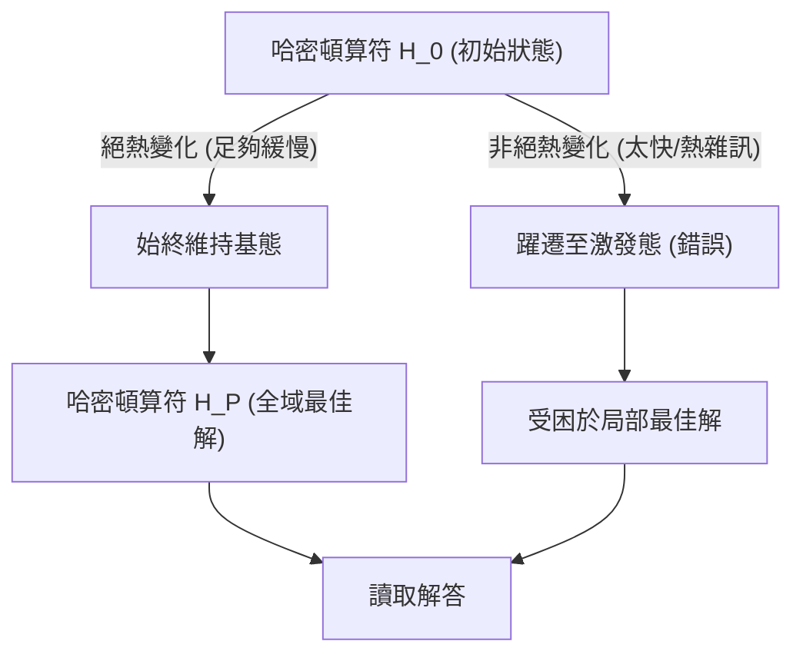
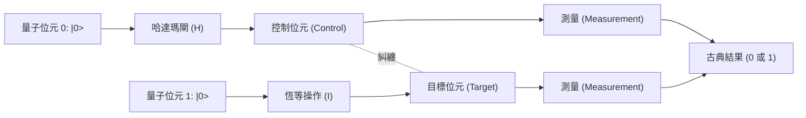
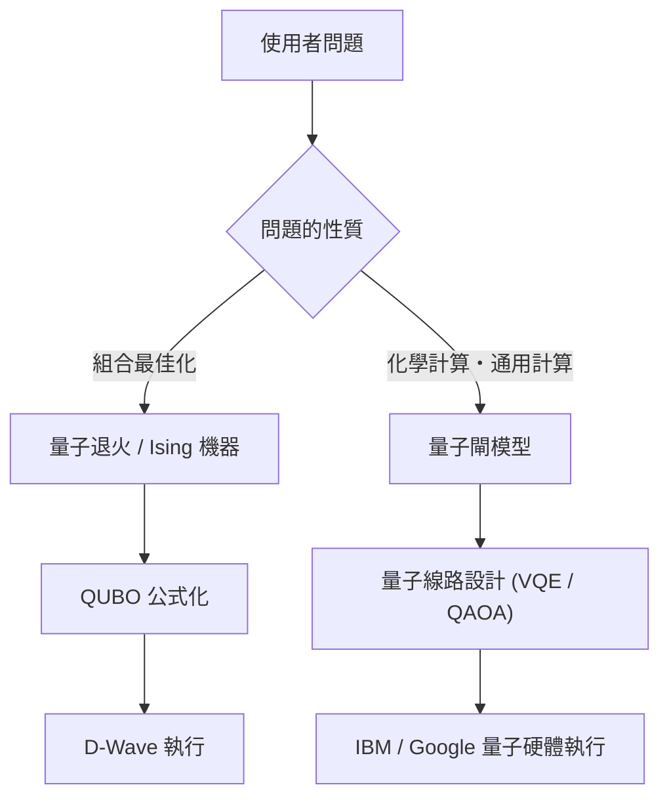

# 深入淺出：量子退火與量子閘模型的差異

量子運算是下一代的運算技術，利用量子力學原理（疊加與量子糾纏），能夠將現代古典電腦（包含傳統的超級電腦）需要耗費龐大時間才能解決的特定問題，以飛躍般的速度求解。

目前，實現量子電腦的方法大致可分為兩大主流範式：**「量子退火（Quantum Annealing）」**與**「量子閘模型（Quantum Gate Model）」**。這兩種架構在基礎物理方法、擅長的運算任務以及硬體實作所面臨的挑戰上，都有著巨大的差異。

本文將從物理原理、數學模型（Ising模型、QUBO、么正變換等）、當前的技術限制，一直到具體的使用案例，以非常詳細且具技術性的視角，對這兩種架構進行徹底的比較與解說。

---

## 1. 量子運算的基礎：與古典電腦的根本差異

古典電腦在處理資訊時，使用的是狀態為「0」或「1」的「位元（Bit）」。另一方面，量子電腦使用的是「量子位元（Qubit）」。藉由量子力學中的「疊加（Superposition）」原理，量子位元可以機率性地同時擁有 0 與 1 的狀態。

此外，透過利用被稱為「量子糾纏（Entanglement）」的現象，多個量子位元的狀態會產生強烈的相互關聯，對單一量子位元的操作將會瞬間影響整個系統。這使得類似平行處理的運算（量子平行性）成為可能。

然而，量子狀態對於外部雜訊（如熱能或電磁波等）非常脆弱，狀態一旦被破壞就會退化回古典狀態，這被稱為「退相干（Decoherence）」，是目前面臨的一大難題。對於解決這種雜訊問題的不同方法，也導致了退火與量子閘模型在設計理念上的巨大差異。

---

## 2. 量子退火 (Quantum Annealing) 詳細解說

量子退火主要是一種專門用來求解**「組合最佳化問題」**的專用運算架構。它以 1998 年由東京工業大學的門脇萬平與西森秀稔所提出的理論為基礎，並因為加拿大 D-Wave Systems 公司在全球首次將其商業化而廣為人知。

### 2.1. 物理機制：橫向磁場 Ising 模型與量子漲落

量子退火利用了自然界物理系統傾向於穩定在「能量最低狀態（基態）」的特性來進行運算。

在古典的方法「模擬退火（Simulated Annealing）」中，是利用熱漲落來逃離局部最佳解（局部最小值）。另一方面，量子退火則是利用「量子漲落（Quantum Fluctuation）」，透過「量子穿隧效應（Quantum Tunneling）」來穿透能量障壁，從而更有效率地探索全域最佳解（全域最小值）。

量子退火系統的時間演化可以由以下的哈密頓算符（代表系統總能量的運算子） $H(t)$ 來描述：

$$ H(t) = A(t) H_0 + B(t) H_P $$

這裡，$t$ 是時間，$A(t)$ 是一個逐漸遞減的函數，而 $B(t)$ 是一個逐漸遞增的函數。

- **$H_0$（初始哈密頓算符）**: 代表橫向磁場（Transverse field），用來產生量子漲落。
  $$ H_0 = - \sum_{i} \sigma_i^x $$
  （$\sigma_i^x$ 是包立 X 矩陣，代表位元的反轉。）
- **$H_P$（問題哈密頓算符）**: 用來表示想要求解的最佳化問題的 Ising 模型（Ising Model）。

在初始狀態 ($t=0$) 時，$A(0)$ 處於最大值，系統處於 $H_0$ 的基態（所有狀態均勻疊加的狀態）。接著隨著時間慢慢地減弱橫向磁場，同時增強問題哈密頓算符的交互作用。

### 2.2. 絕熱量子運算 (Adiabatic Quantum Computation)

在這個過程中非常重要的是**「絕熱定理（Adiabatic Theorem）」**。根據絕熱定理，如果系統的變化「夠慢（絕熱地）」，系統就會一直停留在每個瞬間的哈密頓算符的基態。

也就是說，當最終 $A(t) \to 0$, $B(t) \to 1$ 時，系統會達到 $H_P$ 的基態，亦即得到了**「最佳化問題的精確解」**。

### 2.3. 從 QUBO 映射到 Ising 模型

要在量子退火機上求解現實世界的問題，必須將問題公式化為**QUBO（Quadratic Unconstrained Binary Optimization：無約束二次二元最佳化）**的形式。

QUBO 的目標函數定義如下：
$$ \min_{x \in \{0,1\}^n} \sum_{i} Q_{ii} x_i + \sum_{i < j} Q_{ij} x_i x_j $$
這裡，$x_i \in \{0, 1\}$ 是二元變數，$Q$ 是權重矩陣。

由於硬體（例如 D-Wave）處理的是物理自旋（朝上/朝下），因此需要將變數轉換為使用 $\sigma_i \in \{-1, +1\}$ 的 Ising 模型。轉換公式如下：
$$ x_i = \frac{1 - \sigma_i}{2} \quad \text{或} \quad \sigma_i = 1 - 2x_i $$

將其代入 QUBO 的公式並進行整理後，就可以得到 Ising 模型的哈密頓算符 $H_P$：
$$ H_P = - \sum_{i<j} J_{ij} \sigma_i^z \sigma_j^z - \sum_{i} h_i \sigma_i^z $$
- $J_{ij}$: 自旋間的交互作用（耦合係數）。物理量子位元間的耦合強度。
- $h_i$: 作用於各個自旋的局部磁場（偏置）。

### 2.4. 量子退火的硬體與挑戰（以 D-Wave 為例）

D-Wave 的量子處理器是利用超導量子干涉儀（SQUID）來實現的。物理量子位元之間的耦合取決於硬體的佈線，並非完全耦合（所有的位元都相互連接的狀態）。
從早期的「奇美拉圖（Chimera graph）」，演進到「飛馬圖（Pegasus）」以及「微風圖（Zephyr）」，雖然耦合度有所提升，但仍然存在限制。

因此，需要一個名為**「子圖嵌入（Minor Embedding）」**的處理程序，將具有複雜圖形結構的問題映射到物理圖形上。這會導致用多個物理量子位元（鏈）來表示一個邏輯變數，從而減少可用的有效量子位元數量，並伴隨著運算精度下降的問題。

---

## 3. 量子閘模型 (Quantum Gate Model) 詳細解說

量子閘模型是將古典電腦的邏輯閘（AND, OR, NOT 等）擴展到量子力學領域的產物，是能夠實現**「通用量子運算（Universal Quantum Computation）」**的架構。包含 IBM、Google、Rigetti、IonQ 等許多公司都採用了這種架構。

### 3.1. 么正變換與狀態向量

在量子閘模型中，整個量子位元系統的狀態被表示為一個「狀態向量（State Vector）」 $|\psi\rangle$。1 個量子位元的狀態可以表示為基態 $|0\rangle$ 與 $|1\rangle$ 的線性組合：
$$ |\psi\rangle = \alpha |0\rangle + \beta |1\rangle $$
這裡，$\alpha$ 與 $\beta$ 是複數機率幅，並且滿足 $|\alpha|^2 + |\beta|^2 = 1$。在幾何學上，這個狀態可以視覺化為「布洛赫球面（Bloch Sphere）」上的一點。

量子運算的步驟被描述為對狀態向量應用**么正算符（Unitary Operator） $U$**。么正矩陣具有 $U^\dagger U = I$（與其埃爾米特共軛的乘積為單位矩陣）的特性，這對應於量子力學中薛丁格方程式的時間演化，是一個可逆的操作。
$$ |\psi_{t+1}\rangle = U_t |\psi_t\rangle $$

### 3.2. 基本的量子閘與線路模型

量子運算演算法被設計為一連串的量子閘序列（量子線路）。

- **包立閘 (X, Y, Z)**: 在布洛赫球面上沿著各個軸旋轉 180 度。X 閘相當於古典的 NOT 閘。
- **哈達瑪閘 (H)**: 將 $|0\rangle$ 轉換為 $\frac{|0\rangle + |1\rangle}{\sqrt{2}}$，從而創造出疊加狀態。
  $$ H = \frac{1}{\sqrt{2}} \begin{pmatrix} 1 & 1 \\ 1 & -1 \end{pmatrix} $$
- **CNOT 閘 (Controlled-NOT)**: 2 個量子位元的閘。只有當控制位元為 $|1\rangle$ 時，才對目標位元施加 X 閘。這會產生量子糾纏（Entanglement）。

任何量子演算法都可以藉由少數的單量子位元閘與 CNOT 閘的組合來近似表示（通用閘集合）。

### 3.3. 錯誤更正與從 NISQ 到 FTQC 的道路

量子閘模型最大的挑戰在於量子狀態會被雜訊破壞的「退相干」現象。當運算步驟（閘深度）越深，錯誤就會累積得越多。

為了進行理想的運算，**量子錯誤更正（Quantum Error Correction）**是不可或缺的。舉例來說，在「表面碼（Surface Code）」等方法中，會將多個物理量子位元綑綁在一起，構成一個無錯誤的「邏輯量子位元（Logical Qubit）」。然而，為了一個邏輯量子位元，需要數千到數萬個物理量子位元，這會產生龐大的額外開銷（Overhead）。

我們目前所處的階段，是尚未具備錯誤更正能力，僅擁有數十到數百個量子位元的**NISQ（Noisy Intermediate-Scale Quantum，有雜訊的中等規模量子）**設備時代。要實現具備完整錯誤更正能力的**FTQC（Fault-Tolerant Quantum Computing：容錯量子運算）**，還需要許多技術上的突破。

---

## 4. 技術與數學比較總結

以下比較這兩種架構的根本差異：

| 比較項目 | 量子退火 (Quantum Annealing) | 量子閘模型 (Gate Model) |
| :--- | :--- | :--- |
| **運算模型** | 絕熱量子運算（哈密頓算符的連續時間演化） | 么正變換（離散量子閘操作的序列） |
| **適合的問題** | 組合最佳化問題 (QUBO, Ising 模型) | 通用型（量子化學模擬、質因數分解、搜尋等） |
| **表達能力** | 啟發式最佳化（近似解） | 等同於通用量子圖靈機（理論上可進行所有運算） |
| **實作範例** | D-Wave Systems | IBM, Google, Quantinuum, IonQ 等 |
| **對雜訊的耐受度** | 相對較強（因為停留在基態附近，可容許一定程度的熱雜訊） | 非常弱（輕微的雜訊就會導致相位偏移，破壞運算結果） |
| **擴展性 (Scalability)** | 數千至數萬量子位元規模（取決於物理結構，難以邏輯位元化） | 數百量子位元規模（邁向 FTQC 需要數百萬規模） |

量子退火適合作為「特定用途的輔助處理器（Coprocessor）」，以彌補古典電腦極限的方式來求解最佳化問題。另一方面，量子閘模型是「通用電腦」的量子版本，終極目標是追求超越古典電腦的運算能力（量子霸權），但硬體的建構極其困難。

---

## 5. 當前的限制與挑戰

### 量子退火的限制
1. **耦合度的限制（Connectivity）**: 由於前面提到的子圖嵌入，當問題規模變大時，所需的物理量子位元數量會呈指數增長。
2. **係數的精度（Precision）**: 在硬體上設定 $J_{ij}$ 與 $h_i$ 等類比參數時所產生的物理誤差，會直接影響解的品質。
3. **溫度與非絕熱躍遷**: 由於系統溫度並非絕對零度，存在因熱激發而偏離最佳解的機率。

### 量子閘模型的限制
1. **相干時間（Coherence Time）**: 能夠維持量子狀態的時間僅有幾微秒到幾毫秒左右，這嚴格限制了在此期間能夠執行的量子閘數量（線路深度）。
2. **閘保真度（Gate Fidelity）**: 2 量子位元閘（如 CNOT 等）的操作錯誤率仍然不夠低（一般約為 99.x% 左右）。為了實現 FTQC，必須將其提升至 99.99% 以上。
3. **量子體積（Quantum Volume）**: 不僅僅是量子位元數，如何擴展考量了交互耦合與錯誤率的實質運算能力（量子體積），是當前最大的挑戰。

---

## 6. 具體的使用案例與演算法

接下來看看兩種架構各自擅長的具體應用領域。

### 6.1. 量子退火的使用案例
- **物流與路線規劃**: 大量車輛的配送路線最佳化（旅行推銷員問題的變體）。考慮交通壅塞的即時路徑搜尋。
- **金融工程**: 投資組合最佳化。尋找在最小化風險的同時最大化報酬的股票組合。
- **機器學習**: 特徵選擇（Feature Selection）。從龐大的資料集中提取對預測最有貢獻的變數組合。
- **製造業**: 工廠中的零工車間排程問題（Job-shop scheduling problem，決定哪個零件在哪台機器上以什麼順序加工最快）。

### 6.2. 量子閘模型的使用案例
- **量子化學模擬**: 高精度地模擬分子的能量狀態與化學反應。
- **質因數分解（Shor 演算法）**: 能在多項式時間內對巨大的合成數進行質因數分解的演算法。一旦其實用化，將會破解當前如 RSA 等公開金鑰密碼基礎建設，因此轉向抗量子密碼學（PQC）已成為當務之急。
- **資料庫搜尋（Grover 演算法）**: 從未排序的資料庫中搜尋目標資料時，古典電腦需要 $O(N)$ 的步驟，而 Grover 演算法則能在 $O(\sqrt{N})$ 的步驟內完成搜尋。

### 6.3. NISQ 時代的混合演算法：VQE 與 QAOA
為克服 NISQ 設備中淺層量子線路的限制，結合量子電腦與古典電腦優勢的「變分量子演算法（Variational Quantum Algorithms）」正受到矚目。

- **VQE (Variational Quantum Eigensolver)**: 求解分子基態能量的演算法。使用帶有參數的量子線路（Ansatz）來準備量子狀態，並測量能量期望值 $\langle \psi(\theta) | H | \psi(\theta) \rangle$。將此期望值作為目標函數，使用古典的最佳化演算法（如梯度下降法等）來更新參數 $\theta$。藉由反覆執行此過程直到收斂，以求得分子準確的能量狀態。
- **QAOA (Quantum Approximate Optimization Algorithm)**: 使用量子閘模型來求解組合最佳化問題的演算法。它藉由「特羅特展開（Trotterization）」，將量子退火的絕熱時間演化近似為離散的量子閘操作，並交替作用哈密頓算符以獲得近似解。QAOA 被期待成為利用閘模型求解最佳化問題的有力手段。

---

## 7. 總結

量子退火與量子閘模型，兩者在利用量子力學的奇妙性質作為運算資源這一點上是相同的，但其方法與達成的目標卻有著巨大的差異。

- **量子退火**是為了解決組合最佳化這類特定實際問題，以期及早產出實用成果的「特化型啟發式引擎」。目前已有許多企業正在推進各種概念驗證（PoC）。
- **量子閘模型**則是從物理與化學的嚴密模擬，一直到密碼破解，蘊含著從根本顛覆計算機科學範式的「通用量子電腦」。然而，為了跨越錯誤更正這座巨大的高牆，需要長期的研究與開發。

在未來，預期將會建立起以古典超級電腦（HPC）為核心，遇到最佳化任務時呼叫退火機，進行量子化學計算時呼叫閘模型量子電腦的**「異質運算（Heterogeneous Computing）」**環境。

量子電腦雖然仍是一項發展中的技術，但在硬體與演算法雙方面都正在日新月異地進化。理解 Ising 模型的數學原理以及量子線路的基礎，將成為迎接即將到來的量子原生時代的強大武器。

---
*本文全面解說了從量子運算的基礎概念到最新硬體動向的各個面向。請持續關注未來的最新研究動向。*
