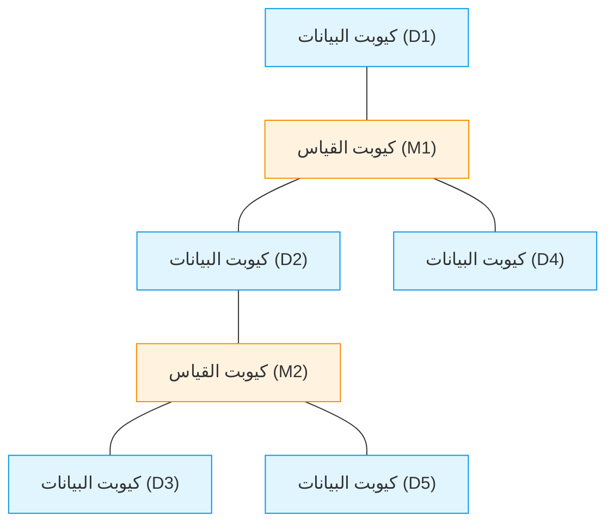
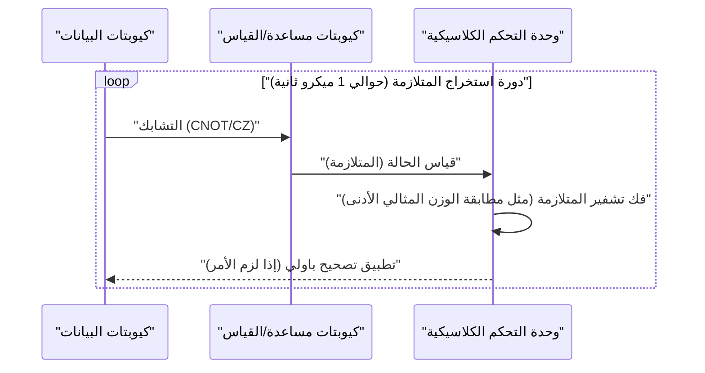
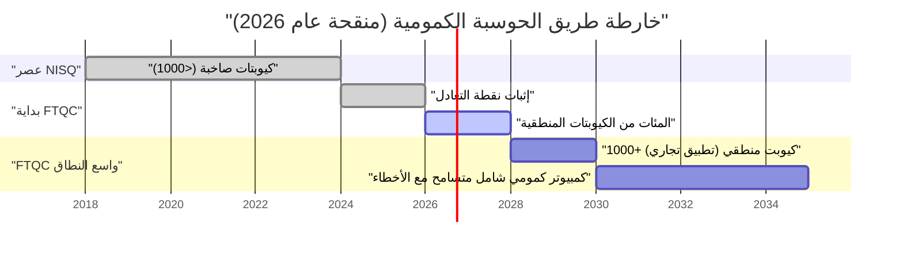

## 1. مقدمة: إلى أين وصلت الحواسيب الكمومية في عام 2026؟

اعتبارًا من عام 2026، شهدت الحوسبة الكمومية تحولًا حاسمًا من "حلم نظري" في الماضي إلى "واقع هندسي". ومع اتضاح حدود أجهزة **NISQ (Noisy Intermediate-Scale Quantum)**، التي كانت سائدة حتى سنوات قليلة مضت، وجهت المؤسسات البحثية وعمالقة التكنولوجيا حول العالم أنظارها نحو تحقيق "الحوسبة الكمومية المتسامحة مع الأخطاء (FTQC: Fault-Tolerant Quantum Computing)".

في هذا المقال، سنتعمق في الوضع الحالي للحواسيب الكمومية مع دمج أحدث الاختراقات لعام 2026. على وجه الخصوص، سنشرح بالتفصيل تصحيح الخطأ الكمومي (الكود السطحي)، والفرق بين الكيوبتات المادية والكيوبتات المنطقية، والتقدم في الحوسبة الكمومية الطوبولوجية، والخطوط الأمامية لطرق الموصلات الفائقة ومصائد الأيونات.

---

## 2. أساسيات الحالة الكمومية والدقة (Fidelity)

الكيوبت (Qubit)، وهو الوحدة الأساسية للحاسوب الكمومي، يختلف عن البت الكلاسيكي (0 أو 1) حيث يمكن أن يتخذ حالة تراكب (Superposition) من 0 و 1. يتم التعبير عن حالة الكيوبت المفرد كمتجه في فضاء هيلبرت على النحو التالي:

$$
|\psi\rangle = \alpha|0\rangle + \beta|1\rangle
$$

هنا، $\alpha$ و $\beta$ عبارة عن سعات احتمالية لأعداد مركبة، وتستوفي شرط التسوية التالي:

$$
|\alpha|^2 + |\beta|^2 = 1
$$

من أهم المؤشرات لقياس أداء الحوسبة الكمومية هو **الدقة (Fidelity)**. يتم تعريف الدقة $F$ بين الحالة الكمومية المثالية $|\psi\rangle$ ومصفوفة الكثافة الفعلية $\rho$ التي تدهورت بسبب الضوضاء وأصبحت حالة مختلطة على النحو التالي:

$$
F(\rho, |\psi\rangle) = \langle \psi | \rho | \psi \rangle
$$

اعتبارًا من عام 2026، أصبحت دقة البوابات ثنائية الكيوبت (مثل: بوابة CNOT وبوابة CZ) في طريقة الموصلات الفائقة تتجاوز حاجز **99.99%** (ما يسمى بـ "تسعات أربعة") بشكل مستقر. هذا الرقم يتجاوز بكثير عتبة تصحيح الخطأ باستخدام الكود السطحي (حوالي 99%)، وهو أحد أكبر الاختراقات نحو الاستخدام العملي.

---

## 3. حدود عصر NISQ والتحول النموذجي نحو FTQC

شهدت أواخر العقد الأول من القرن الحادي والعشرين وأوائل العقد الثاني من القرن الحادي والعشرين عصر NISQ (Noisy Intermediate-Scale Quantum)، وهي أجهزة تحتوي على عشرات إلى مئات الكيوبتات بدون تصحيح للأخطاء. ومع ذلك، كان لـ NISQ حدود واضحة.

مع زيادة عمق الدائرة (Depth)، تتراكم الأخطاء بشكل أسي، مما يجعل من المستحيل الحصول على نتائج حسابية ذات معنى. يتحلل الاحتمال الإجمالي للنجاح $P_{success}$ عند عمق الدائرة $D$ بالنسبة لدقة البوابة المفردة $f$ وعدد البوابات $N$ على النحو التالي:

$$
P_{success} \approx f^N
$$

إذا تم تطبيق 1000 بوابة بدقة $f = 0.99$، فستصبح النتيجة $0.99^{1000} \approx 4.3 \times 10^{-5}$، وستُدفن النتائج تقريبًا في ضوضاء عشوائية. لذلك، في عام 2026، تتركز الموارد على توليد **الكيوبتات المنطقية (Logical Qubit)** بدلاً من التوسيع المباشر لخوارزميات NISQ (مثل VQE و QAOA).

---

## 4. تصحيح الخطأ الكمومي والكيوبتات المنطقية: الخطوط الأمامية للكود السطحي

تصحيح الخطأ الكمومي (QEC: Quantum Error Correction) هو تقنية تقوم بتشفير العديد من "الكيوبتات المادية" لإنشاء "كيوبت منطقي" واحد واكتشاف الأخطاء وتصحيحها. التقنية الأكثر واعدة حاليًا هي **الكود السطحي (Surface Code)**.

### 4.1 بنية الكود السطحي (Surface Code)

في الكود السطحي، يتم ترتيب الكيوبتات في شبكة ثنائية الأبعاد. تُصطف كيوبتات البيانات (التي تحتفظ بالمعلومات الفعلية) وكيوبتات القياس (لقياس المتلازمة) مثل نمط رقعة الشطرنج.

باستخدام عوامل الاستقرار (Stabilizers) $S_x$ و $S_z$، تتم مراقبة انعكاس البت (خطأ X) وانعكاس الطور (خطأ Z) باستمرار.

$$
S_x = \prod_{i \in \text{star}} X_i, \quad S_z = \prod_{j \in \text{plaquette}} Z_j
$$

كان التطور المهم في عام 2026 هو الاختراق الكامل لـ "نقطة التعادل (Break-even point)". وبعبارة أخرى، أصبحت الضوضاء التي تمت إزالتها بواسطة تصحيح الخطأ أكبر من الضوضاء الناتجة عن الدائرة الإضافية لإجراء تصحيح الخطأ، وتجاوز العمر الافتراضي للكيوبت المنطقي العمر الافتراضي للكيوبت المادي بعدة مراتب من حيث الحجم.

### 4.2 دورة تصحيح الخطأ الكمومي

يعمل تصحيح الخطأ كحلقة تغذية مرتدة مستمرة.

حاليًا، تم ترسيخ تقنية تنفيذ عملية فك التشفير الكلاسيكية هذه (تحليل المتلازمة) في نانو ثانية باستخدام FPGA و ASIC المخصصة، ودخل تصحيح الخطأ في الوقت الفعلي مرحلة الاستخدام العملي.

---

## 5. تطور بنية الأجهزة (إصدار 2026)

تتطور الأجهزة الكمومية في عام 2026 بشكل أساسي حول ثلاثة محاور: "طريقة الموصلات الفائقة"، و"طريقة مصيدة الأيونات"، و"الطريقة الطوبولوجية".

### 5.1 تكامل الكيوبتات فائقة التوصيل

طريقة الموصلات الفائقة هي مجال تقوده شركات مثل IBM و Google، وتعتبر كيوبتات الترانزمون (Transmon) باستخدام وصلات جوزيفسون هي السائدة. في عام 2026، تم تحقيق شريحة ضخمة تدمج الآلاف إلى عشرة آلاف كيوبت مادي على شريحة واحدة.

الجدير بالذكر هو ترسيخ **الاتصالات الكمومية بين الوحدات (Quantum Interconnects)**. تم تنفيذ النقل الآني الكمومي بين الشرائح باستخدام فوتونات الموجات الدقيقة على المستوى التجاري، مما أتاح تجاوز قيود الحجم لثلاجة التخفيف الواحدة.

### 5.2 التوسع ثنائي الأبعاد لمصيدة الأيونات والترابط البصري

في طريقة مصيدة الأيونات (التي تقودها شركات مثل Quantinuum و IonQ)، يتم استخدام حالات الطاقة الداخلية للأيونات المعلقة في الفراغ ككيوبتات. مقارنة بطريقة الموصلات الفائقة، تتمتع بميزة أوقات تماسك T1/T2 طويلة جدًا وإمكانية الاتصال الشامل (All-to-All Connectivity).

كان الاختراق في عام 2026 هو جعل بنية QCCD (Quantum Charge Coupled Device) ثنائية الأبعاد وتوليد التشابك عالي السرعة بين المصائد المتعددة باستخدام الترابط الضوئي. أدى هذا إلى تحسين "بطء سرعة البوابة" و"قابلية التوسع"، وهي نقاط الضعف في مصيدة الأيونات، بشكل كبير.

### 5.3 الحوسبة الكمومية الطوبولوجية: التحكم في الأنيونات

دخلت **الحوسبة الكمومية الطوبولوجية**، والتي اعتبرت لفترة طويلة وجودًا نظريًا، أخيرًا مرحلة العرض التجريبي في عام 2026. تستخدم هذه الطريقة، التي تروج لها شركة Microsoft وغيرها، أنيونات غير أبيلية (Non-Abelian Anyons) تسمى "أنماط مايورانا الصفرية (Majorana Zero Modes)".

يتم تنفيذ البوابات الكمومية عن طريق عملية تسمى "التضفير (Braiding)" التي تبدل مواقع جزيئات الأنيون.

$$
|\psi_{final}\rangle = B_{ij} |\psi_{initial}\rangle
$$

هنا $B_{ij}$ هو عامل التضفير. الطريقة الطوبولوجية مقاومة بطبيعتها للضوضاء البيئية (مقاومة الأخطاء على مستوى الأجهزة) لأن تخزين المعلومات لا يعتمد على الحالة الموضعية للجسيمات، بل على طوبولوجيا "العقدة" بأكملها. في عام 2026، تم تأكيد توليد أول كيوبت منطقي طوبولوجي عالي الدقة في العالم، مما جذب الانتباه كطريق مختصر قوي نحو FTQC.

---

## 6. خارطة الطريق نحو الاستخدام العملي والآفاق

لكي تظهر الحواسيب الكمومية حقًا **التفوق الكمومي (Quantum Advantage)** الذي تتفوق فيه على الحواسيب الكلاسيكية (الحواسيب الفائقة) في مجالات مثل "الحسابات الكيميائية"، و"علم المواد"، و"النمذجة المالية"، هناك حاجة إلى آلاف الكيوبتات المنطقية.

### 6.1 التحديات والمستقبل الذي نواجهه حاليًا
يتمثل التحدي الأكبر اعتبارًا من عام 2026 في قدرة التبريد لأجهزة التبريد العملاقة (ثلاجات التخفيف) للحفاظ على درجات حرارة منخفضة للغاية، والأسلاك التي تربط معدات التحكم في درجة حرارة الغرفة والشرائح الكمومية المبردة (عنق الزجاجة في الإدخال والإخراج). استجابة لذلك، يتقدم تطوير رقائق التحكم CMOS التي تعمل في بيئات التبريد العميق (Cryo-CMOS) بوتيرة سريعة.

### الخاتمة

سيتم تسجيل عام 2026 في تاريخ الحواسيب الكمومية كـ "العام الأول لتوسيع نطاق الكيوبتات المنطقية". من خلال إثبات خوارزميات تصحيح الخطأ، ووحدات الأجهزة، والتطور السريع للنهج الطوبولوجي، لم يعد "اليوم الذي تصبح فيه عملية" قصة من المستقبل البعيد، بل أصبح يمكن اعتباره كمعلم محدد في غضون السنوات القليلة القادمة. بالنسبة لمطوري الخوارزميات الكمومية والشركات، يمكن القول إن الوقت الحالي هو الوقت المناسب للاستثمار بجدية في حل المشكلات باستخدام التقنيات الكمومية الأصلية.

---
*تمت كتابة هذا المقال استنادًا إلى أحدث الأوراق البحثية في الحوسبة الكمومية واتجاهات الصناعة اعتبارًا من عام 2026.*

