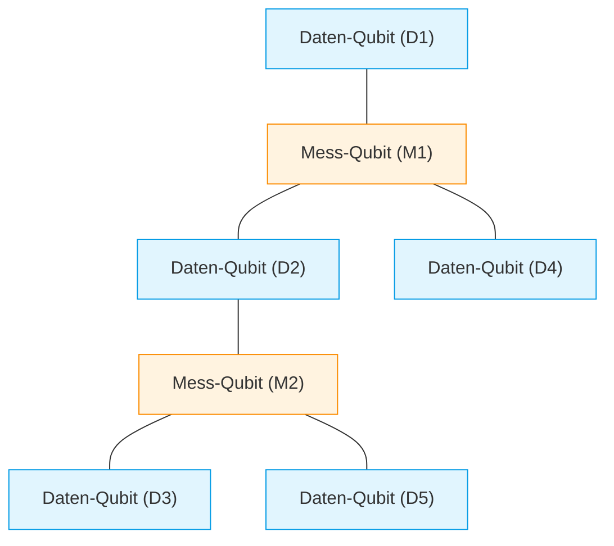
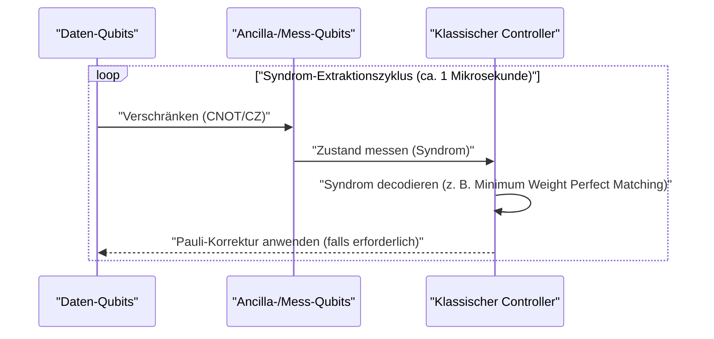
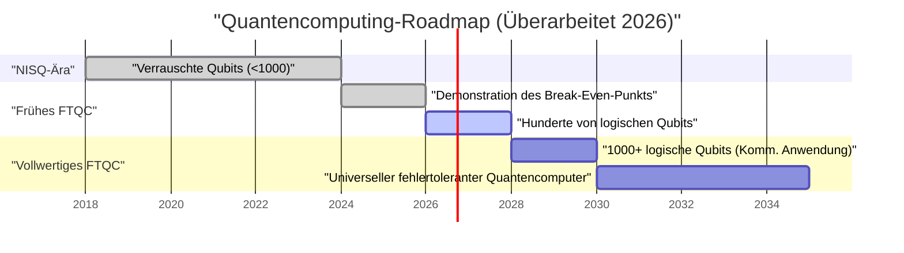

## 1. Einführung: Wie weit sind Quantencomputer im Jahr 2026 gekommen?

Im Jahr 2026 hat das Quantencomputing einen entscheidenden Wandel vom einstigen „theoretischen Traum“ zur „ingenieurstechnischen Realität“ vollzogen. Da die Grenzen der bis vor wenigen Jahren noch vorherrschenden **NISQ (Noisy Intermediate-Scale Quantum)**-Geräte deutlich wurden, haben Forschungseinrichtungen und Tech-Giganten weltweit das Ruder in Richtung der Realisierung des „fehlertoleranten Quantencomputings (FTQC: Fault-Tolerant Quantum Computing)“ herumgerissen.

In diesem Artikel werden wir den aktuellen Stand von Quantencomputern eingehend beleuchten und dabei die neuesten Durchbrüche des Jahres 2026 miteinbeziehen. Insbesondere werden wir die Quantenfehlerkorrektur (Oberflächencode), den Unterschied zwischen physischen und logischen Qubits, Fortschritte beim topologischen Quantencomputing sowie die neuesten Entwicklungen bei supraleitenden und Ionenfallen-Ansätzen im Detail erläutern.

---

## 2. Grundlagen von Quantenzuständen und Fidelität (Fidelity)

Das Qubit, die grundlegende Einheit eines Quantencomputers, kann sich im Gegensatz zu einem klassischen Bit (0 oder 1) in einem Überlagerungszustand (Superposition) von 0 und 1 befinden. Der Zustand eines einzelnen Qubits wird als Vektor in einem Hilbertraum wie folgt dargestellt:

$$
|\psi\rangle = \alpha|0\rangle + \beta|1\rangle
$$

Hierbei sind $\alpha$ und $\beta$ komplexe Wahrscheinlichkeitsamplituden, die die folgende Normalisierungsbedingung erfüllen:

$$
|\alpha|^2 + |\beta|^2 = 1
$$

Eine extrem wichtige Kennzahl zur Messung der Leistung von Quantenberechnungen ist die **Fidelität (Fidelity)**. Die Fidelität $F$ zwischen einem idealen Quantenzustand $|\psi\rangle$ und einer durch Rauschen degradierten, zu einem gemischten Zustand gewordenen tatsächlichen Dichtematrix $\rho$ ist wie folgt definiert:

$$
F(\rho, |\psi\rangle) = \langle \psi | \rho | \psi \rangle
$$

Heutzutage, im Jahr 2026, hat die Fidelität von 2-Qubit-Gattern (z. B. CNOT- oder CZ-Gattern) bei supraleitenden Systemen stabil die Hürde von **99,99 %** (die sogenannten „vier Neunen“) überschritten. Dies liegt deutlich über dem Schwellenwert für die Fehlerkorrektur mit Oberflächencodes (ca. 99 %) und ist einer der größten Durchbrüche auf dem Weg zur praktischen Anwendung.

---

## 3. Die Grenzen der NISQ-Ära und der Paradigmenwechsel zu FTQC

Von den späten 2010er bis in die frühen 2020er Jahre hinein war die Ära von NISQ (Noisy Intermediate-Scale Quantum), also von Geräten mit zehn bis hunderten von Qubits ohne Fehlerkorrektur. NISQ hatte jedoch klare Grenzen.

Mit zunehmender Schaltkreistiefe (Depth) häufen sich Fehler exponentiell an, was es unmöglich macht, aussagekräftige Berechnungsergebnisse zu erzielen. Die Gesamterfolgswahrscheinlichkeit $P_{success}$ bei einer Schaltkreistiefe $D$ nimmt in Bezug auf die Fidelität eines einzelnen Gatters $f$ und die Anzahl der Gatter $N$ wie folgt ab:

$$
P_{success} \approx f^N
$$

Wenn man 1000 Gatter mit $f = 0,99$ anwendet, ergibt sich $0,99^{1000} \approx 4,3 \times 10^{-5}$, und das Ergebnis geht fast vollständig in zufälligem Rauschen unter. Daher konzentrieren sich die Ressourcen im Jahr 2026 weniger auf die direkte Skalierung von NISQ-Algorithmen (wie VQE oder QAOA), sondern auf die Erzeugung von **logischen Qubits (Logical Qubits)**.

---

## 4. Quantenfehlerkorrektur und logische Qubits: Die vorderste Front des Oberflächencodes

Die Quantenfehlerkorrektur (QEC: Quantum Error Correction) ist eine Technologie, bei der mehrere „physische Qubits“ kodiert werden, um ein einzelnes „logisches Qubit“ zu erzeugen und Fehler zu erkennen und zu korrigieren. Derzeit gilt der **Oberflächencode (Surface Code)** als am vielversprechendsten.

### 4.1 Struktur des Oberflächencodes (Surface Code)

Beim Oberflächencode werden die Qubits in einem zweidimensionalen Gitter angeordnet. Daten-Qubits (die die eigentlichen Informationen speichern) und Mess-Qubits (für die Syndrommessung) sind schachbrettartig angeordnet.

Mithilfe der Stabilisator-Operatoren $S_x$ und $S_z$ werden Bitflips (X-Fehler) und Phasenflips (Z-Fehler) kontinuierlich überwacht.

$$
S_x = \prod_{i \in \text{star}} X_i, \quad S_z = \prod_{j \in \text{plaquette}} Z_j
$$

Ein entscheidender Fortschritt im Jahr 2026 war das vollständige Durchbrechen des „Break-Even-Punkts (Break-even point)“. Das bedeutet, dass das durch die Fehlerkorrektur beseitigte Rauschen größer wurde als das zusätzliche Rauschen, das durch die für die Fehlerkorrektur erforderlichen Schaltkreise entsteht, sodass die Lebensdauer von logischen Qubits die von physischen Qubits um viele Größenordnungen übertrifft.

### 4.2 Der Zyklus der Quantenfehlerkorrektur

Die Fehlerkorrektur fungiert als kontinuierliche Feedbackschleife.

Mittlerweile hat sich die Technologie etabliert, diesen klassischen Dekodierungsprozess (Syndromanalyse) mit FPGAs oder dedizierten ASICs im Nanosekundenbereich durchzuführen, wodurch die Fehlerkorrektur in Echtzeit das Stadium der praktischen Anwendung erreicht hat.

---

## 5. Die Evolution der Hardware-Architektur (Ausgabe 2026)

Die Quantenhardware im Jahr 2026 entwickelt sich hauptsächlich entlang dreier Achsen: „Supraleitender Ansatz“, „Ionenfallen-Ansatz“ und „Topologischer Ansatz“.

### 5.1 Integration von supraleitenden Qubits

Der supraleitende Ansatz ist ein Bereich, der von IBM und Google angeführt wird, wobei Transmon-Qubits (Transmon) mit Josephson-Kontakten vorherrschen. Im Jahr 2026 wurden Mega-Chips realisiert, die Tausende bis Zehntausende von physischen Qubits auf einem einzigen Chip integrieren.

Besonders hervorzuheben ist die Etablierung von **quantenmechanischen Verbindungen zwischen Modulen (Quantum Interconnects)**. Die Quantenteleportation zwischen Chips mithilfe von Mikrowellenphotonen wurde auf kommerziellem Niveau implementiert, wodurch die Größenbeschränkungen eines einzelnen Mischkryostaten (Verdünnungskühlschranks) umgangen werden können.

### 5.2 Zweidimensionale Skalierung von Ionenfallen und optische Interconnects

Beim Ionenfallen-Ansatz (vorangetrieben unter anderem von Quantinuum und IonQ) werden die internen Energiezustände von im Vakuum schwebenden Ionen als Qubits genutzt. Im Vergleich zum supraleitenden Ansatz haben sie den Vorteil extrem langer T1/T2-Kohärenzzeiten und ermöglichen eine All-to-All-Konnektivität (All-to-All Connectivity).

Der Durchbruch des Jahres 2026 ist die zweidimensionale Ausrichtung der QCCD-Architektur (Quantum Charge Coupled Device) und die Hochgeschwindigkeits-Verschränkungserzeugung zwischen mehreren Fallen mithilfe von photonischen Interconnects. Dadurch wurden die Schwächen der Ionenfallen, nämlich „langsame Gatter-Geschwindigkeit“ und „mangelnde Skalierbarkeit“, dramatisch verbessert.

### 5.3 Topologisches Quantencomputing: Kontrolle von Anyonen

Das **topologische Quantencomputing**, das lange Zeit als rein theoretisch galt, hat im Jahr 2026 endlich die Phase der experimentellen Demonstration erreicht. Dieser Ansatz, der unter anderem von Microsoft vorangetrieben wird, nutzt nicht-abelsche Anyonen (Non-Abelian Anyons), die als „Majorana-Nullmoden (Majorana Zero Modes)“ bezeichnet werden.

Quantengatter werden durch eine Operation namens „Braiding (Flechten)“ ausgeführt, bei der die Positionen der Anyon-Teilchen vertauscht werden.

$$
|\psi_{final}\rangle = B_{ij} |\psi_{initial}\rangle
$$

Hierbei ist $B_{ij}$ der Braiding-Operator. Da beim topologischen Ansatz die Speicherung von Informationen nicht vom lokalen Zustand der Teilchen abhängt, sondern von der Topologie der gesamten „Knoten“, ist er von Natur aus widerstandsfähig gegen Umgebungsrauschen (Fehlertoleranz auf Hardware-Ebene). Im Jahr 2026 wurde weltweit zum ersten Mal die Erzeugung topologischer logischer Qubits mit hoher Fidelität bestätigt, was große Aufmerksamkeit als starke Abkürzung zu FTQC erregte.

---

## 6. Roadmap und Ausblick auf die praktische Anwendung

Damit Quantencomputer ihre **Quantenüberlegenheit (Quantum Advantage)**, mit der sie klassische Computer (Supercomputer) in Bereichen wie „chemische Berechnungen“, „Materialwissenschaften“ und „Finanzmodellierung“ übertreffen, wirklich entfalten können, sind Tausende von logischen Qubits erforderlich.

### 6.1 Aktuelle Herausforderungen und die Zukunft
Die größte Herausforderung im Jahr 2026 ist die Kühlkapazität der riesigen Kryostate (Verdünnungskühlschränke) zur Aufrechterhaltung der extrem niedrigen Temperaturen sowie die Verkabelung (I/O-Flaschenhals), die die Steuergeräte bei Raumtemperatur mit den Quantenchips bei tiefen Temperaturen verbindet. Um dem zu begegnen, schreitet die Entwicklung von CMOS-Controller-Chips (Cryo-CMOS), die in kryogenen Umgebungen funktionieren, rasant voran.

### Fazit

Das Jahr 2026 wird in die Geschichte der Quantencomputer als „das erste Jahr der Skalierung logischer Qubits“ eingehen. Dank der Demonstration von Fehlerkorrekturalgorithmen, der Modularisierung der Hardware und der rasanten Fortschritte beim topologischen Ansatz ist der „Tag der praktischen Anwendung“ keine ferne Zukunft mehr, sondern kann als konkreter Meilenstein für die nächsten Jahre angesehen werden. Für Entwickler von Quantenalgorithmen und Unternehmen ist jetzt genau der richtige Zeitpunkt, um ernsthaft in quantennative Problemlösungen zu investieren.

---
*Dieser Artikel basiert auf den neuesten Forschungsarbeiten und Branchentrends im Bereich des Quantencomputings mit Stand 2026.*

