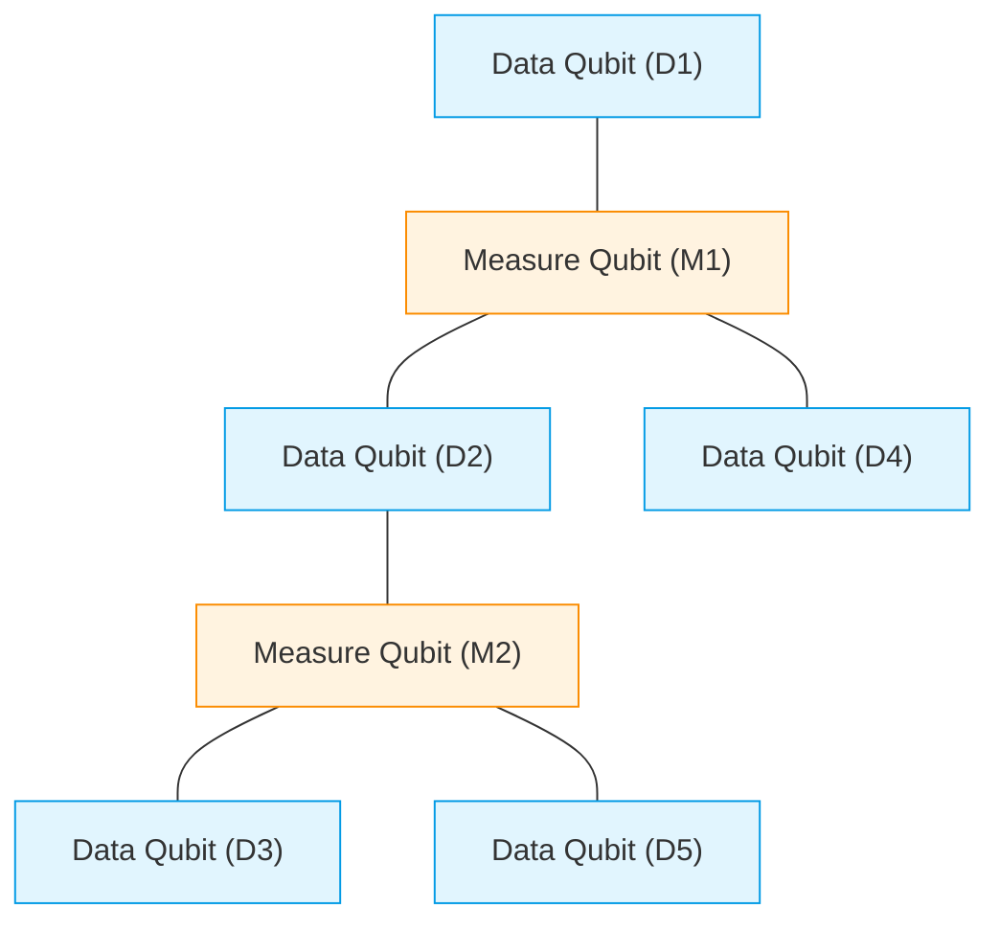
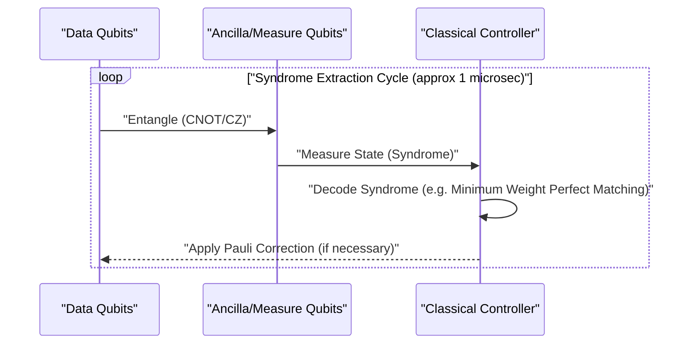
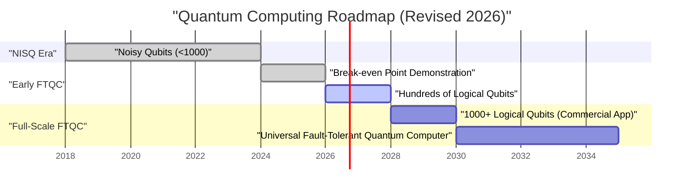

## 1. Introduction: Where Quantum Computing Stands in 2026

As of 2026, quantum computing has made a decisive shift from a "theoretical dream" to an "engineering reality." As the limitations of **NISQ (Noisy Intermediate-Scale Quantum)** devices—which were mainstream until a few years ago—became clear, research institutions and tech giants around the world shifted their focus toward realizing "FTQC (Fault-Tolerant Quantum Computing)."

In this article, we will delve deep into the current state of quantum computers, incorporating the latest breakthroughs of 2026. In particular, we will detail quantum error correction (surface codes), the difference between physical and logical qubits, advancements in topological quantum computing, and the frontlines of superconducting and ion-trap architectures.

---

## 2. Fundamentals of Quantum States and Fidelity

The qubit, the fundamental unit of a quantum computer, differs from a classical bit (0 or 1) in that it can exist in a superposition of 0 and 1. The state of a single qubit is represented as a vector on a Hilbert space as follows:

$$
|\psi\rangle = \alpha|0\rangle + \beta|1\rangle
$$

Here, $\alpha$ and $\beta$ are complex probability amplitudes that satisfy the following normalization condition:

$$
|\alpha|^2 + |\beta|^2 = 1
$$

An extremely important metric for measuring the performance of quantum computation is **Fidelity**. The fidelity $F$ between an ideal quantum state $|\psi\rangle$ and an actual density matrix $\rho$ that has degraded into a mixed state due to noise is defined as follows:

$$
F(\rho, |\psi\rangle) = \langle \psi | \rho | \psi \rangle
$$

As of 2026, the fidelity of 2-qubit gates (e.g., CNOT and CZ gates) has stably surpassed the **99.99%** barrier (the so-called "four nines") in superconducting architectures. This significantly exceeds the threshold for error correction using surface codes (about 99%), making it one of the biggest breakthroughs toward practical application.

---

## 3. The Limits of the NISQ Era and the Paradigm Shift to FTQC

The late 2010s to the early 2020s was the era of NISQ (Noisy Intermediate-Scale Quantum)—devices with tens to hundreds of qubits without error correction. However, NISQ had clear limitations.

As the circuit depth increases, errors accumulate exponentially, making it impossible to obtain meaningful computation results. The overall success probability $P_{success}$ at a circuit depth $D$ decays with respect to the single-gate fidelity $f$ and the number of gates $N$ as follows:

$$
P_{success} \approx f^N
$$

If $f = 0.99$ and 1000 gates are applied, $0.99^{1000} \approx 4.3 \times 10^{-5}$, and the result is almost entirely buried in random noise. For this reason, in 2026, resources are heavily concentrated on generating **Logical Qubits** rather than directly scaling up NISQ algorithms (like VQE and QAOA).

---

## 4. Quantum Error Correction and Logical Qubits: The Forefront of Surface Codes

Quantum Error Correction (QEC) is a technology that encodes multiple "physical qubits" to create a single "logical qubit," detecting and correcting errors. The most promising approach currently is the **Surface Code**.

### 4.1 Structure of the Surface Code

In a surface code, qubits are arranged in a 2-dimensional grid. Data qubits (which hold the actual information) and measurement qubits (for syndrome measurement) are arranged in a checkerboard pattern.

Bit-flip (X errors) and phase-flip (Z errors) are constantly monitored using the stabilizer operators $S_x$ and $S_z$.

$$
S_x = \prod_{i \in \text{star}} X_i, \quad S_z = \prod_{j \in \text{plaquette}} Z_j
$$

A significant advancement in 2026 is that the "Break-even point" has been completely surpassed. In other words, the noise removed by error correction has become greater than the noise introduced by the extra circuitry required for it, allowing the lifespan of a logical qubit to exceed that of a physical qubit by orders of magnitude.

### 4.2 The Quantum Error Correction Cycle

Error correction functions as a continuous feedback loop.

Currently, the technology to execute this classical decoding process (syndrome analysis) in nanoseconds using FPGAs or dedicated ASICs has been established, and real-time error correction has entered the practical stage.

---

## 5. Evolution of Hardware Architectures (2026 Edition)

Quantum hardware in 2026 is evolving primarily along three axes: "Superconducting," "Ion-Trap," and "Topological."

### 5.1 Integration of Superconducting Qubits

The superconducting approach is a field led by companies like IBM and Google, with Transmon qubits using Josephson junctions being the mainstream. In 2026, megachips integrating thousands to ten thousand physical qubits on a single chip became a reality.

Notably, **Quantum Interconnects (module-to-module quantum communication)** have been established. Quantum teleportation between chips using microwave photons has been implemented at a commercial level, making it possible to bypass the size limitations of a single dilution refrigerator.

### 5.2 2D Scaling and Optical Interconnects for Ion Traps

The ion-trap architecture (led by Quantinuum, IonQ, etc.) uses the internal energy states of ions suspended in a vacuum as qubits. Compared to superconducting methods, they boast extremely long T1/T2 coherence times and have the advantage of all-to-all connectivity.

The 2026 breakthrough involved expanding the QCCD (Quantum Charge Coupled Device) architecture into two dimensions and generating high-speed entanglement between multiple traps using photonic interconnects. This drastically improved the slow gate speeds and scalability issues that were weaknesses of the ion-trap method.

### 5.3 Topological Quantum Computing: Controlling Anyons

**Topological quantum computing**, long considered theoretical, has finally entered the phase of experimental demonstration in 2026. This approach, promoted by Microsoft and others, uses non-Abelian anyons called "Majorana Zero Modes."

Quantum gates are executed through an operation called "Braiding," which involves swapping the positions of anyon particles.

$$
|\psi_{final}\rangle = B_{ij} |\psi_{initial}\rangle
$$

Here, $B_{ij}$ is the braiding operator. Because the topological approach relies on the global topology of the "knots" rather than the local state of particles to store information, it is inherently robust against environmental noise (hardware-level fault tolerance). In 2026, the world's first generation of high-fidelity topological logical qubits was confirmed, drawing attention as a powerful shortcut to FTQC.

---

## 6. Roadmap to Practical Application and Future Outlook

To truly demonstrate **Quantum Advantage**, where quantum computers overwhelm classical computers (supercomputers) in fields like "chemical computation," "materials science," and "financial modeling," thousands of logical qubits are required.

### 6.1 Current Challenges and the Future
The biggest challenges as of 2026 are the cooling capacity of the massive cryostats (dilution refrigerators) needed to maintain ultra-low temperatures, and the wiring (I/O bottleneck) connecting room-temperature control equipment to the cryogenic quantum chips. In response, the development of Cryo-CMOS controller chips that operate in cryogenic environments is advancing rapidly.

### Conclusion

2026 will likely be recorded in the history of quantum computing as "the first year of logical qubit scaling." With the demonstration of error correction algorithms, the modularization of hardware, and rapid progress in the topological approach, "the day they become practical" is no longer a tale of the distant future but a concrete milestone to look forward to within the next few years. For developers and companies in the quantum algorithm space, now is the time to seriously invest in quantum-native problem solving.

---
*This article was written based on the latest quantum computing research papers and industry trends as of 2026.*
