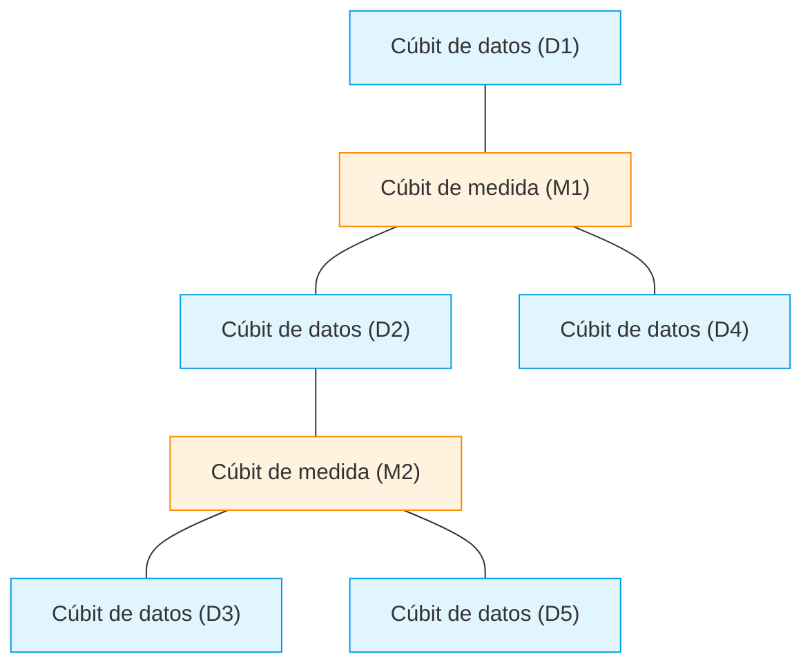
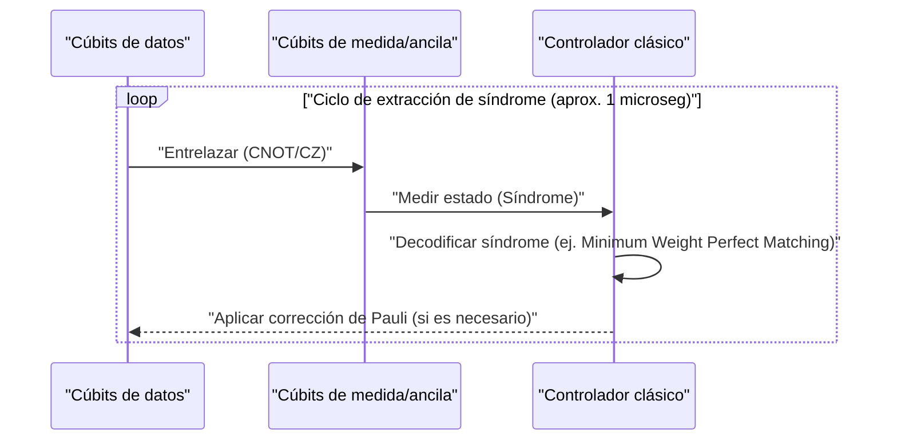
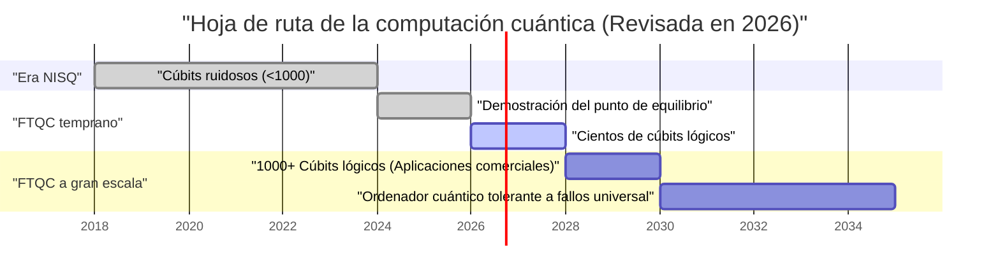

## 1. Introducción: En 2026, ¿hasta dónde han llegado los ordenadores cuánticos?

En la actualidad, en 2026, la computación cuántica ha experimentado un cambio decisivo de ser un antiguo "sueño teórico" a una "realidad de ingeniería". A medida que los límites de los dispositivos **NISQ (Noisy Intermediate-Scale Quantum)**, que eran la corriente principal hasta hace unos años, se han vuelto evidentes, las instituciones de investigación y los gigantes tecnológicos de todo el mundo han cambiado de rumbo hacia la realización de la "Computación Cuántica Tolerante a Fallos (FTQC: Fault-Tolerant Quantum Computing)".

En este artículo, profundizaremos en el estado actual de los ordenadores cuánticos, intercalando los últimos avances de 2026. En particular, explicaremos en detalle la corrección de errores cuánticos (código de superficie), la diferencia entre cúbits físicos y lógicos, el progreso de la computación cuántica topológica y la vanguardia de los métodos superconductores y de trampa de iones.

---

## 2. Conceptos básicos del estado cuántico y la fidelidad

El cúbit (Qubit), que es la unidad básica de un ordenador cuántico, a diferencia de un bit clásico (0 o 1), puede tomar un estado de superposición (Superposition) de 0 y 1. El estado de un solo cúbit se representa como un vector en el espacio de Hilbert de la siguiente manera:

$$
|\psi\rangle = \alpha|0\rangle + \beta|1\rangle
$$

Aquí, $\alpha$ y $\beta$ son amplitudes de probabilidad complejas y satisfacen la siguiente condición de normalización:

$$
|\alpha|^2 + |\beta|^2 = 1
$$

Una métrica extremadamente importante para medir el rendimiento de la computación cuántica es la **fidelidad (Fidelity)**. La fidelidad $F$ entre el estado cuántico ideal $|\psi\rangle$ y la matriz de densidad real $\rho$ que se ha degradado a un estado mixto debido al ruido se define de la siguiente manera:

$$
F(\rho, |\psi\rangle) = \langle \psi | \rho | \psi \rangle
$$

En la actualidad, en 2026, la fidelidad de las puertas de 2 cúbits (por ejemplo, las puertas CNOT o CZ) ha superado constantemente la barrera del **99,99%** (los llamados "cuatro nueves") utilizando el método superconductor. Esta es una cifra que supera con creces el umbral de corrección de errores mediante el código de superficie (aproximadamente el 99%), siendo uno de los mayores avances hacia su aplicación práctica.

---

## 3. Los límites de la era NISQ y el cambio de paradigma hacia FTQC

Desde finales de la década de 2010 hasta principios de la de 2020 fue la era de NISQ (Noisy Intermediate-Scale Quantum), dispositivos con decenas a cientos de cúbits que no tenían corrección de errores. Sin embargo, NISQ tenía límites claros.

A medida que aumenta la profundidad (Depth) del circuito, los errores se acumulan exponencialmente, lo que hace imposible obtener resultados de cálculo significativos. La probabilidad general de éxito $P_{success}$ a una profundidad de circuito $D$ decae en relación con la fidelidad $f$ de una sola puerta y el número de puertas $N$ de la siguiente manera:

$$
P_{success} \approx f^N
$$

Si se aplican 1000 puertas con $f = 0.99$, resultará en $0.99^{1000} \approx 4.3 \times 10^{-5}$, y el resultado quedará casi sepultado en el ruido aleatorio. Por esta razón, en 2026, los recursos se concentran en la generación de **cúbits lógicos (Logical Qubit)** en lugar de escalar directamente los algoritmos NISQ (como VQE y QAOA).

---

## 4. Corrección de errores cuánticos y cúbits lógicos: La vanguardia del código de superficie

La corrección de errores cuánticos (QEC: Quantum Error Correction) es una tecnología que codifica múltiples "cúbits físicos" para crear un único "cúbit lógico" y detecta y corrige errores. Actualmente, el más prometedor es el **código de superficie (Surface Code)**.

### 4.1 Estructura del código de superficie (Surface Code)

En el código de superficie, los cúbits se organizan en una cuadrícula bidimensional. Los cúbits de datos (que contienen la información real) y los cúbits de medida (para medir el síndrome) están dispuestos en un patrón de tablero de ajedrez.

Utilizando los operadores estabilizadores $S_x$ y $S_z$, se monitorizan constantemente los cambios de bit (errores X) y los cambios de fase (errores Z).

$$
S_x = \prod_{i \in \text{star}} X_i, \quad S_z = \prod_{j \in \text{plaquette}} Z_j
$$

Un avance significativo en 2026 es que se ha superado por completo el "punto de equilibrio (Break-even point)". Es decir, el ruido eliminado por la corrección de errores es ahora mayor que el ruido causado por los circuitos adicionales para realizar la corrección de errores, y la vida útil del cúbit lógico supera a la del cúbit físico en varios órdenes de magnitud.

### 4.2 El ciclo de corrección de errores cuánticos

La corrección de errores funciona como un bucle de retroalimentación continuo.

Hoy en día, se ha establecido la tecnología para ejecutar este proceso de decodificación clásica (análisis del síndrome) en nanosegundos utilizando FPGAs y ASICs dedicados, y la corrección de errores en tiempo real ha entrado en la fase práctica.

---

## 5. Evolución de la arquitectura de hardware (Edición 2026)

El hardware cuántico en 2026 está evolucionando principalmente a lo largo de tres ejes: "método superconductor", "método de trampa de iones" y "método topológico".

### 5.1 Integración de cúbits superconductores

El método superconductor es un campo liderado por IBM y Google, donde predominan los cúbits transmon (Transmon) utilizando uniones Josephson. En 2026, se han hecho realidad megachips que integran entre miles y decenas de miles de cúbits físicos en un solo chip.

Lo que es especialmente destacable es el establecimiento de **comunicaciones cuánticas entre módulos (Quantum Interconnects)**. La teleportación cuántica entre chips utilizando fotones de microondas se ha implementado a nivel comercial, permitiendo eludir las restricciones de tamaño de un solo refrigerador de dilución.

### 5.2 Escalado bidimensional e interconexiones ópticas de trampas de iones

El método de trampa de iones (liderado por empresas como Quantinuum e IonQ) utiliza los estados de energía internos de los iones suspendidos en el vacío como cúbits. En comparación con el método superconductor, tiene la ventaja de tiempos de coherencia T1/T2 extremadamente largos y permite conectividad de todos con todos (All-to-All Connectivity).

Los avances de 2026 son la bidimensionalización de la arquitectura QCCD (Quantum Charge Coupled Device) y la generación de entrelazamiento de alta velocidad entre múltiples trampas mediante interconexiones fotónicas. Como resultado, la "baja velocidad de las puertas" y la "escalabilidad", que eran las debilidades de la trampa de iones, se han mejorado drásticamente.

### 5.3 Computación cuántica topológica: Control de anyones

La **computación cuántica topológica**, considerada durante mucho tiempo una existencia teórica, finalmente ha entrado en la fase de demostración experimental en 2026. Este método, promovido por empresas como Microsoft, utiliza anyones no abelianos (Non-Abelian Anyons) llamados "modos cero de Majorana (Majorana Zero Modes)".

Las puertas cuánticas se ejecutan mediante una operación llamada "trenzado (Braiding)", que intercambia las posiciones de las partículas de los anyones.

$$
|\psi_{final}\rangle = B_{ij} |\psi_{initial}\rangle
$$

Donde $B_{ij}$ es el operador de trenzado. El método topológico es inherentemente resistente al ruido ambiental (tolerancia a errores a nivel de hardware) porque la preservación de la información no depende de los estados locales de las partículas, sino de la topología global de los "nudos". En 2026, se confirmó la generación de un cúbit lógico topológico de alta fidelidad por primera vez en el mundo, atrayendo la atención como un poderoso atajo hacia FTQC.

---

## 6. Hoja de ruta y perspectivas para la aplicación práctica

Para que los ordenadores cuánticos demuestren verdaderamente la **supremacía cuántica (Quantum Advantage)** superando a los ordenadores clásicos (superordenadores) en "cálculos químicos", "ciencia de materiales", "modelado financiero", etc., se necesitan miles de cúbits lógicos.

### 6.1 Retos actuales y el futuro
El mayor reto en 2026 es la capacidad de enfriamiento del enorme criostato (refrigerador de dilución) para mantener temperaturas ultrabajas, y el cableado (cuello de botella de E/S) que conecta el equipo de control a temperatura ambiente con el chip cuántico a temperatura ultrabaja. En respuesta a esto, el desarrollo de chips controladores CMOS (Cryo-CMOS) que funcionan en un entorno de temperatura ultrabaja avanza a un ritmo rápido.

### Conclusión

2026 será registrado en la historia de la computación cuántica como "el año inaugural del escalado de los cúbits lógicos". Con la demostración de algoritmos de corrección de errores, la modularización del hardware y el rápido avance de los enfoques topológicos, "el día en que se vuelvan prácticos" ya no es un futuro lejano, sino que puede ser visto como un hito concreto dentro de los próximos años. Para los desarrolladores de algoritmos cuánticos y las empresas, ahora es el momento de invertir seriamente en la resolución de problemas nativos cuánticos.

---
*Este artículo se basa en los últimos trabajos de investigación en computación cuántica y tendencias de la industria en 2026.*

