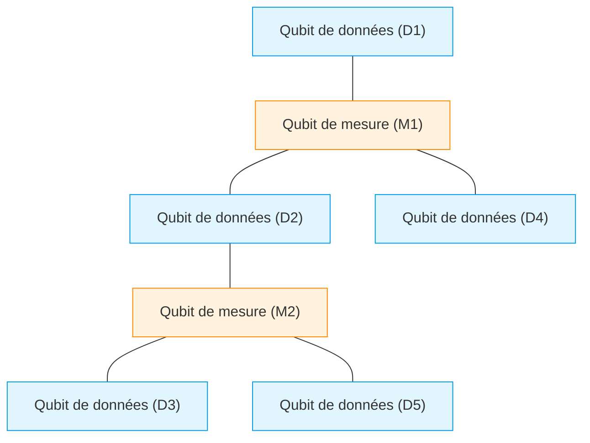
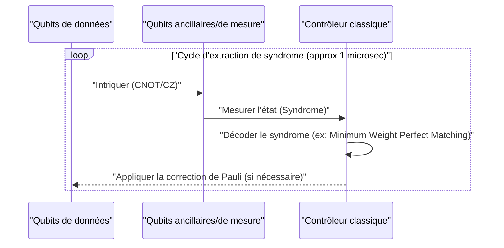
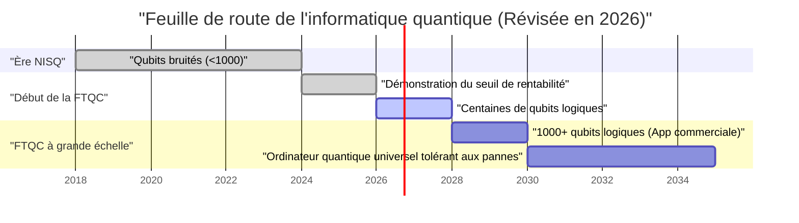

## 1. Introduction : Où en sont les ordinateurs quantiques en 2026 ?

En 2026, l'informatique quantique a connu un changement décisif, passant d'un ancien "rêve théorique" à une "réalité technique". Alors que les limites des dispositifs **NISQ (Noisy Intermediate-Scale Quantum)**, qui dominaient jusqu'à il y a quelques années, sont devenues claires, les instituts de recherche et les géants de la technologie du monde entier se sont orientés vers la réalisation de "l'informatique quantique tolérante aux pannes (FTQC : Fault-Tolerant Quantum Computing)".

Dans cet article, nous explorerons en profondeur l'état actuel des ordinateurs quantiques, en intégrant les dernières avancées de 2026. En particulier, nous détaillerons la correction d'erreurs quantiques (code de surface), la différence entre les qubits physiques et les qubits logiques, les progrès de l'informatique quantique topologique, et l'avant-garde des méthodes à supraconducteurs et à pièges à ions.

---

## 2. Fondements de l'état quantique et fidélité (Fidelity)

L'unité fondamentale d'un ordinateur quantique, le bit quantique (Qubit), contrairement au bit classique (0 ou 1), peut prendre un état de superposition de 0 et de 1. L'état d'un seul qubit est représenté comme un vecteur dans l'espace de Hilbert comme suit :

$$
|\psi\rangle = \alpha|0\rangle + \beta|1\rangle
$$

Ici, $\alpha$ et $\beta$ sont des amplitudes de probabilité complexes, satisfaisant la condition de normalisation suivante :

$$
|\alpha|^2 + |\beta|^2 = 1
$$

Un indicateur extrêmement important pour mesurer les performances des calculs quantiques est la **fidélité (Fidelity)**. La fidélité $F$ entre l'état quantique idéal $|\psi\rangle$ et la matrice densité réelle $\rho$, qui s'est dégradée pour devenir un état mixte à cause du bruit, est définie comme suit :

$$
F(\rho, |\psi\rangle) = \langle \psi | \rho | \psi \rangle
$$

À l'heure actuelle en 2026, la fidélité des portes à 2 qubits (ex : portes CNOT et portes CZ) dépasse désormais de manière stable le mur des **99,99 %** (ce que l'on appelle les "4 neufs") dans les systèmes supraconducteurs. Il s'agit d'un chiffre qui dépasse largement le seuil de correction d'erreurs par le code de surface (environ 99 %), et constitue l'une des plus grandes avancées vers une application pratique.

---

## 3. Les limites de l'ère NISQ et le changement de paradigme vers FTQC

La période allant de la fin des années 2010 au début des années 2020 fut l'ère des NISQ (Noisy Intermediate-Scale Quantum), des dispositifs de quelques dizaines à quelques centaines de qubits dépourvus de correction d'erreurs. Cependant, les dispositifs NISQ avaient des limites claires.

À mesure que la profondeur (Depth) du circuit augmente, les erreurs s'accumulent de manière exponentielle, rendant impossible l'obtention de résultats de calcul significatifs. La probabilité de succès globale $P_{success}$ à une profondeur de circuit $D$ décroît par rapport à la fidélité d'une seule porte $f$ et au nombre de portes $N$ comme suit :

$$
P_{success} \approx f^N
$$

Si $f = 0.99$ et que 1000 portes sont appliquées, le résultat sera $0.99^{1000} \approx 4.3 \times 10^{-5}$, et sera presque enfoui dans le bruit aléatoire. Pour cette raison, en 2026, au lieu d'une mise à l'échelle directe des algorithmes NISQ (comme VQE ou QAOA), les ressources se concentrent sur la génération de **qubits logiques (Logical Qubit)**.

---

## 4. Correction d'erreurs quantiques et qubits logiques : À la pointe du code de surface

La correction d'erreurs quantiques (QEC : Quantum Error Correction) est une technologie qui encode plusieurs "qubits physiques" pour créer un "qubit logique", permettant de détecter et de corriger les erreurs. Actuellement, le code le plus prometteur est le **code de surface (Surface Code)**.

### 4.1 Structure du code de surface (Surface Code)

Dans le code de surface, les qubits sont disposés dans une grille bidimensionnelle. Les qubits de données (conservant les informations réelles) et les qubits de mesure (pour la mesure du syndrome) sont disposés comme sur un damier.

Il utilise les opérateurs de stabilisateur $S_x$ et $S_z$ pour surveiller constamment le retournement de bit (erreur X) et le retournement de phase (erreur Z).

$$
S_x = \prod_{i \in \text{star}} X_i, \quad S_z = \prod_{j \in \text{plaquette}} Z_j
$$

L'avancée majeure de 2026 est le dépassement complet du "seuil de rentabilité (Break-even point)". En d'autres termes, le bruit éliminé par la correction d'erreurs est devenu plus important que le bruit causé par les circuits supplémentaires pour l'effectuer, permettant ainsi à la durée de vie du qubit logique de dépasser de plusieurs ordres de grandeur celle du qubit physique.

### 4.2 Cycle de correction d'erreurs quantiques

La correction d'erreurs fonctionne comme une boucle de rétroaction continue.

Aujourd'hui, la technologie pour exécuter ce traitement de décodage classique (analyse de syndrome) en nanosecondes avec des FPGA ou des ASIC dédiés a été établie, et la correction d'erreurs en temps réel est entrée dans la phase de mise en œuvre pratique.

---

## 5. Évolution de l'architecture matérielle (Édition 2026)

Le matériel quantique en 2026 évolue principalement selon trois axes : la "méthode à supraconducteurs", la "méthode à pièges à ions" et la "méthode topologique".

### 5.1 Intégration des qubits supraconducteurs

La méthode supraconductrice est un domaine mené par IBM et Google, et le qubit transmon utilisant des jonctions Josephson y est dominant. En 2026, des mégapuces intégrant des milliers à dix mille qubits physiques sur une seule puce ont été réalisées.

Il convient de noter tout particulièrement l'établissement d'**interconnexions quantiques inter-modules (Quantum Interconnects)**. La téléportation quantique entre puces utilisant des photons micro-ondes a été implémentée au niveau commercial, permettant de contourner les limites de taille d'un seul réfrigérateur à dilution.

### 5.2 Mise à l'échelle bidimensionnelle des pièges à ions et interconnexion optique

La méthode des pièges à ions (menée par Quantinuum, IonQ, etc.) utilise les états d'énergie interne des ions en suspension dans le vide comme qubits. Comparée à la méthode supraconductrice, elle présente l'avantage d'un temps de cohérence T1/T2 extrêmement long et permet une connectivité globale (All-to-All Connectivity).

La percée de 2026 fut la bidimensionnalisation de l'architecture QCCD (Quantum Charge Coupled Device) et la génération d'intrication à grande vitesse entre plusieurs pièges à l'aide d'interconnexions photoniques. Cela a considérablement amélioré la "lenteur de la vitesse de porte" et la "scalabilité", qui étaient les points faibles des pièges à ions.

### 5.3 Informatique quantique topologique : Contrôle des anyons

L'**informatique quantique topologique**, longtemps considérée comme une existence théorique, est finalement entrée dans la phase de démonstration expérimentale en 2026. Cette méthode, promue par des entreprises telles que Microsoft, utilise des anyons non abéliens (Non-Abelian Anyons) appelés "modes zéro de Majorana (Majorana Zero Modes)".

Les portes quantiques sont exécutées par une opération de tressage (Braiding) qui intervertit les positions des particules d'anyons.

$$
|\psi_{final}\rangle = B_{ij} |\psi_{initial}\rangle
$$

Ici, $B_{ij}$ est l'opérateur de tressage. L'approche topologique est intrinsèquement résistante au bruit de l'environnement (tolérance aux pannes au niveau matériel) car la préservation de l'information ne dépend pas de l'état local de la particule, mais de la topologie globale du "nœud". En 2026, la création du premier qubit logique topologique à haute fidélité au monde a été confirmée, attirant l'attention en tant que raccourci puissant vers le FTQC.

---

## 6. Feuille de route et perspectives vers une application pratique

Pour que l'ordinateur quantique démontre véritablement l'**avantage quantique (Quantum Advantage)** en surpassant les ordinateurs classiques (supercalculateurs) dans des domaines tels que la "chimie computationnelle", la "science des matériaux" et la "modélisation financière", des milliers de qubits logiques sont nécessaires.

### 6.1 Défis actuels et avenir
Le plus grand défi à l'heure actuelle en 2026 réside dans la capacité de refroidissement des immenses cryostats (réfrigérateurs à dilution) nécessaires au maintien de températures extrêmement basses, et dans le câblage (goulot d'étranglement des E/S) reliant l'équipement de contrôle à température ambiante et la puce quantique à température cryogénique. Face à cela, le développement de puces de contrôle CMOS fonctionnant en environnement cryogénique (Cryo-CMOS) progresse à un rythme effréné.

### Conclusion

L'année 2026 sera enregistrée dans l'histoire des ordinateurs quantiques comme "l'année inaugurale de la mise à l'échelle des qubits logiques". Grâce à la démonstration des algorithmes de correction d'erreurs, à la modularisation du matériel et aux progrès rapides de l'approche topologique, le "jour de la mise en pratique" n'est plus une histoire lointaine, mais un jalon concret à atteindre d'ici quelques années. Pour les développeurs d'algorithmes quantiques et les entreprises, c'est le moment idéal pour investir sérieusement dans la résolution de problèmes en mode "quantum-native".

---
*Cet article a été rédigé sur la base des dernières recherches et tendances de l'industrie de l'informatique quantique en 2026.*
