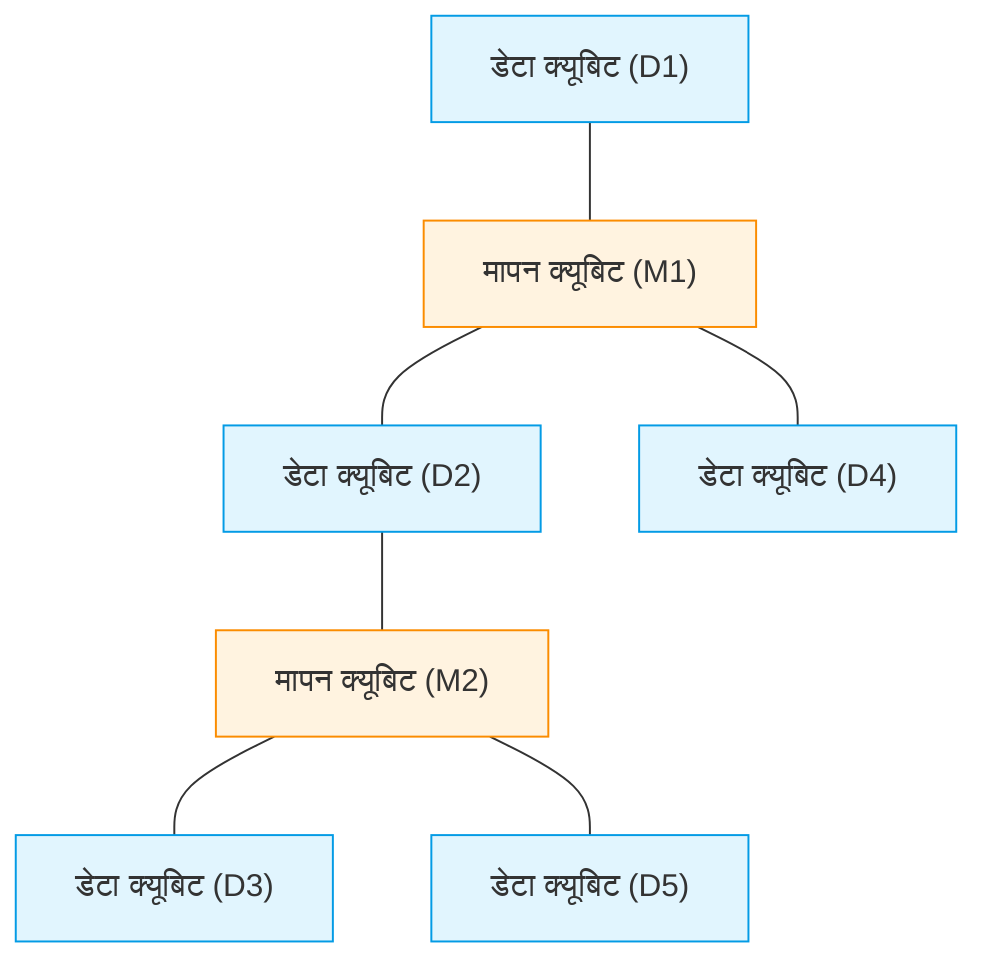
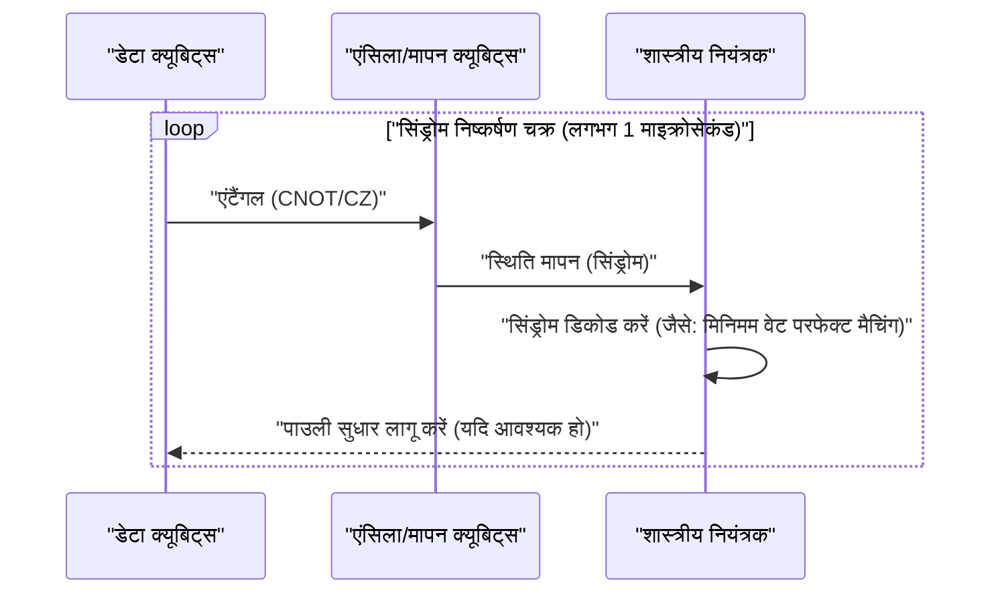
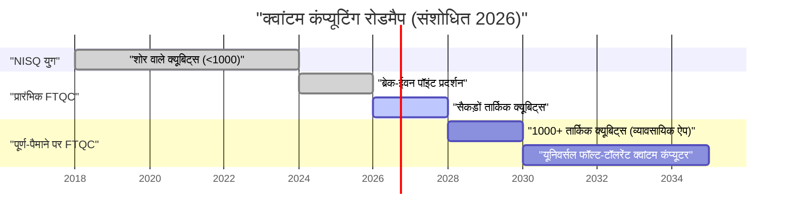

## 1. प्रस्तावना: 2026 में, क्वांटम कंप्यूटर कहाँ तक पहुँच चुका है?

वर्तमान 2026 में, क्वांटम कंप्यूटिंग ने अतीत के "सैद्धांतिक सपने" से "इंजीनियरिंग वास्तविकता" की ओर एक निर्णायक छलांग लगाई है। कुछ वर्षों पहले तक मुख्यधारा रहे **NISQ (Noisy Intermediate-Scale Quantum)** उपकरणों की सीमाएँ स्पष्ट होने के साथ, दुनिया भर के अनुसंधान संस्थानों और टेक दिग्गजों ने "फॉल्ट-टॉलरेंट क्वांटम कंप्यूटिंग (FTQC: Fault-Tolerant Quantum Computing)" को साकार करने की दिशा में कदम बढ़ाया है।

इस लेख में, 2026 की नवीनतम सफलताओं के साथ-साथ क्वांटम कंप्यूटर की वर्तमान स्थिति पर गहराई से चर्चा की जाएगी। विशेष रूप से, क्वांटम त्रुटि सुधार (सरफेस कोड), भौतिक क्वांटम बिट (क्यूबिट) और तार्किक क्वांटम बिट के बीच का अंतर, टोपोलॉजिकल क्वांटम गणना में प्रगति, और सुपरकंडक्टिंग व आयन ट्रैप पद्धतियों के सबसे उन्नत मोर्चों को विस्तार से समझाया जाएगा।

---

## 2. क्वांटम अवस्था की मूल बातें और फिडेलिटी (विश्वसनीयता)

क्वांटम कंप्यूटर की मूल इकाई क्वांटम बिट (Qubit), शास्त्रीय बिट (0 या 1) के विपरीत, 0 और 1 की सुपरपोजिशन (Superposition) अवस्था ले सकती है। एकल क्वांटम बिट की अवस्था को हिल्बर्ट स्पेस (Hilbert space) पर एक वेक्टर के रूप में इस प्रकार दर्शाया जाता है:

$$
|\psi\rangle = \alpha|0\rangle + \beta|1\rangle
$$

यहाँ, $\alpha$ और $\beta$ सम्मिश्र संभाव्यता आयाम (probability amplitudes) हैं, जो निम्नलिखित सामान्यीकरण शर्त को पूरा करते हैं:

$$
|\alpha|^2 + |\beta|^2 = 1
$$

क्वांटम गणना के प्रदर्शन को मापने के लिए सबसे महत्वपूर्ण मीट्रिक **फिडेलिटी (Fidelity)** है। आदर्श क्वांटम अवस्था $|\psi\rangle$ और शोर (noise) के कारण विकृत होकर मिश्रित अवस्था में बदल चुके वास्तविक घनत्व मैट्रिक्स (density matrix) $\rho$ के बीच फिडेलिटी $F$ को इस प्रकार परिभाषित किया जाता है:

$$
F(\rho, |\psi\rangle) = \langle \psi | \rho | \psi \rangle
$$

वर्तमान 2026 में, 2-क्यूबिट गेट (जैसे: CNOT गेट या CZ गेट) की फिडेलिटी सुपरकंडक्टिंग पद्धति में **99.99%** की बाधा (तथाकथित "4 नाइन") को लगातार पार करने लगी है। यह सरफेस कोड द्वारा त्रुटि सुधार की सीमा (लगभग 99%) से काफी अधिक है, और यह व्यावहारिक उपयोग की दिशा में सबसे बड़ी सफलताओं में से एक है।

---

## 3. NISQ युग की सीमाएँ और FTQC की ओर प्रतिमान बदलाव (Paradigm Shift)

2010 के दशक के उत्तरार्ध से 2020 के दशक के पूर्वार्ध तक का समय बिना त्रुटि सुधार वाले दसियों से लेकर सैकड़ों क्वांटम बिट वाले उपकरणों, अर्थात NISQ (Noisy Intermediate-Scale Quantum) का युग था। हालाँकि, NISQ की स्पष्ट सीमाएँ थीं।

जैसे-जैसे सर्किट की गहराई (Depth) बढ़ती है, त्रुटियाँ घातांकीय रूप से (exponentially) जमा होती जाती हैं, जिससे सार्थक गणना परिणाम प्राप्त करना असंभव हो जाता है। सर्किट की गहराई $D$ पर समग्र सफलता की संभावना $P_{success}$, एकल गेट की फिडेलिटी $f$ और गेट्स की संख्या $N$ के सापेक्ष इस प्रकार घटती है:

$$
P_{success} \approx f^N
$$

यदि $f = 0.99$ के साथ 1000 गेट्स लागू किए जाएं, तो परिणाम $0.99^{1000} \approx 4.3 \times 10^{-5}$ होगा, जो लगभग यादृच्छिक शोर (random noise) में दब जाता है। इस कारण से, 2026 में, NISQ एल्गोरिदम (जैसे VQE या QAOA) को सीधे स्केल अप करने के बजाय, **तार्किक क्वांटम बिट (Logical Qubit)** उत्पन्न करने पर संसाधनों को केंद्रित किया जा रहा है।

---

## 4. क्वांटम त्रुटि सुधार और तार्किक क्वांटम बिट: सरफेस कोड का उन्नत मोर्चा

क्वांटम त्रुटि सुधार (QEC: Quantum Error Correction) एक ऐसी तकनीक है जो कई "भौतिक क्वांटम बिट्स" को एन्कोड करके एक "तार्किक क्वांटम बिट" बनाती है और त्रुटियों का पता लगाकर उन्हें सुधारती है। वर्तमान में सबसे आशाजनक तरीका **सरफेस कोड (Surface Code)** माना जा रहा है।

### 4.1 सरफेस कोड (Surface Code) की संरचना

सरफेस कोड में, क्वांटम बिट्स को द्वि-आयामी (2D) ग्रिड में व्यवस्थित किया जाता है। डेटा क्वांटम बिट (जो वास्तविक जानकारी रखते हैं) और मापन क्वांटम बिट (सिंड्रोम मापन के लिए) चेकरबोर्ड पैटर्न (checkerboard pattern) में व्यवस्थित होते हैं।

स्टेबलाइजर ऑपरेटर $S_x$ और $S_z$ का उपयोग करके, बिट फ्लिप (X त्रुटि) और फेज फ्लिप (Z त्रुटि) की लगातार निगरानी की जाती है।

$$
S_x = \prod_{i \in \text{star}} X_i, \quad S_z = \prod_{j \in \text{plaquette}} Z_j
$$

2026 की महत्वपूर्ण प्रगति यह है कि "ब्रेक-ईवन पॉइंट (Break-even point)" को पूरी तरह से पार कर लिया गया है। इसका मतलब है कि त्रुटि सुधार के लिए आवश्यक अतिरिक्त सर्किट द्वारा उत्पन्न शोर की तुलना में, त्रुटि सुधार द्वारा हटाए गए शोर की मात्रा अधिक हो गई है, और तार्किक क्वांटम बिट का जीवनकाल भौतिक क्वांटम बिट के जीवनकाल से कई गुना अधिक हो गया है।

### 4.2 क्वांटम त्रुटि सुधार चक्र

त्रुटि सुधार एक निरंतर फीडबैक लूप के रूप में कार्य करता है।

वर्तमान में, इस शास्त्रीय डिकोडिंग प्रक्रिया (सिंड्रोम विश्लेषण) को नैनोसेकंड स्केल पर निष्पादित करने के लिए FPGA और समर्पित ASIC तकनीकें स्थापित हो चुकी हैं, और वास्तविक समय (real-time) में त्रुटि सुधार व्यावहारिक चरण में प्रवेश कर चुका है।

---

## 5. हार्डवेयर आर्किटेक्चर का विकास (2026 संस्करण)

2026 में क्वांटम हार्डवेयर मुख्य रूप से तीन दिशाओं में विकसित हो रहा है: "सुपरकंडक्टिंग विधि," "आयन ट्रैप विधि," और "टोपोलॉजिकल विधि।"

### 5.1 सुपरकंडक्टिंग क्वांटम बिट का एकीकरण (Integration)

सुपरकंडक्टिंग विधि एक ऐसा क्षेत्र है जिसका नेतृत्व IBM और Google कर रहे हैं, और जोसेफसन जंक्शन (Josephson junction) का उपयोग करने वाले ट्रांसमोन (Transmon) क्वांटम बिट मुख्यधारा में हैं। 2026 में, एक ही चिप पर हजारों से लेकर दस हजार भौतिक क्वांटम बिट्स को एकीकृत करने वाले मेगाचिप साकार हो चुके हैं।

विशेष रूप से उल्लेखनीय **मॉड्यूल के बीच क्वांटम संचार (Quantum Interconnects)** की स्थापना है। माइक्रोवेव फोटॉन का उपयोग करते हुए चिप्स के बीच क्वांटम टेलीपोर्टेशन को व्यावसायिक स्तर पर लागू किया गया জ্ঞिा गया है, जिससे एकल डाइल्यूशन रेफ्रिजरेटर (dilution refrigerator) के आकार की सीमा से बचना संभव हो गया है।

### 5.2 आयन ट्रैप की 2D स्केलिंग और ऑप्टिकल इंटरकनेक्ट

आयन ट्रैप विधि (जिसका नेतृत्व Quantinuum और IonQ कर रहे हैं) में वैक्यूम में तैरते आयनों की आंतरिक ऊर्जा अवस्थाओं को क्वांटम बिट के रूप में उपयोग किया जाता है। सुपरकंडक्टिंग विधि की तुलना में, इसका T1/T2 कोहेरेंस (coherence) समय अत्यधिक लंबा होता है, और ऑल-टू-ऑल कनेक्टिविटी (All-to-All Connectivity) संभव है।

2026 की सफलता QCCD (क्वांटम चार्ज कपल्ड डिवाइस) आर्किटेक्चर का द्वि-आयामी (2D) निर्माण और फोटोनिक इंटरकनेक्ट का उपयोग करके मल्टी-ट्रैप्स के बीच उच्च गति वाले एंटैंगलमेंट का निर्माण है। इससे आयन ट्रैप की कमजोरियां "धीमी गेट गति" और "स्केलेबिलिटी (scalability)" में नाटकीय रूप से सुधार हुआ है।

### 5.3 टोपोलॉजिकल क्वांटम गणना: एनीऑन का नियंत्रण

**टोपोलॉजिकल क्वांटम गणना**, जिसे लंबे समय से केवल सैद्धांतिक माना जाता था, 2026 में अंततः प्रायोगिक प्रदर्शन के चरण में प्रवेश कर चुकी है। Microsoft और अन्य द्वारा संचालित यह विधि "मेजरना जीरो मोड्स (Majorana Zero Modes)" नामक गैर-अबेलियन एनीऑन्स (Non-Abelian Anyons) का उपयोग करती है।

एनीऑन कणों की स्थिति बदलने के लिए "ब्रेडिंग (Braiding)" नामक ऑपरेशन का उपयोग करके क्वांटम गेट्स निष्पादित किए जाते हैं।

$$
|\psi_{final}\rangle = B_{ij} |\psi_{initial}\rangle
$$

यहाँ $B_{ij}$ ब्रेडिंग ऑपरेटर है। टोपोलॉजिकल विधि में, सूचना का संरक्षण कणों की स्थानीय अवस्था पर निर्भर नहीं करता, बल्कि पूरी "गांठ" की टोपोलॉजी पर निर्भर करता है, इसलिए यह पर्यावरणीय शोर के प्रति स्वाभाविक रूप से प्रतिरोधी (हार्डवेयर-स्तर की त्रुटि सहनशीलता) है। 2026 में, दुनिया में पहली बार उच्च-फिडेलिटी वाले टोपोलॉजिकल तार्किक क्वांटम बिट के निर्माण की पुष्टि की गई थी, और यह FTQC के लिए एक शक्तिशाली शॉर्टकट के रूप में ध्यान आकर्षित कर रहा है।

---

## 6. व्यावहारिक उपयोग की दिशा में रोडमैप और भविष्य की संभावनाएं

ताकि क्वांटम कंप्यूटर वास्तव में **क्वांटम सर्वोच्चता (Quantum Advantage)** प्रदर्शित कर सके, जो "रासायनिक गणना," "पदार्थ विज्ञान," और "वित्तीय मॉडलिंग" जैसे क्षेत्रों में शास्त्रीय कंप्यूटर (सुपरकंप्यूटर) को मात दे, इसके लिए हजारों तार्किक क्वांटम बिट्स की आवश्यकता है।

### 6.1 वर्तमान में सामना की जा रही चुनौतियां और भविष्य
2026 तक की सबसे बड़ी चुनौती क्रायोस्टेट (डाइल्यूशन रेफ्रिजरेटर) की शीतलन क्षमता है, जो अत्यंत कम तापमान बनाए रखने के लिए आवश्यक है, और कमरे के तापमान नियंत्रण उपकरण को क्रायोजेनिक क्वांटम चिप से जोड़ने वाली वायरिंग (I/O बॉटलनेक) है। इसके जवाब में, क्रायोजेनिक वातावरण में काम करने में सक्षम CMOS (Cryo-CMOS) कंट्रोलर चिप्स का विकास तेजी से आगे बढ़ रहा है।

### निष्कर्ष

2026 को क्वांटम कंप्यूटर के इतिहास में "तार्किक क्वांटम बिट स्केल-अप के प्रथम वर्ष" के रूप में दर्ज किया जाएगा। त्रुटि सुधार एल्गोरिदम के प्रदर्शन, हार्डवेयर के मॉडर्नाइजेशन और टोपोलॉजिकल दृष्टिकोण में तेजी से प्रगति के साथ, "व्यावहारिक उपयोग का दिन" अब दूर के भविष्य की बात नहीं है, बल्कि एक विशिष्ट मील का पत्थर है जिसे अगले कुछ वर्षों में देखा जा सकता है। क्वांटम एल्गोरिदम के डेवलपर्स और कंपनियों के लिए, यह क्वांटम-नेटिव समस्या-समाधान में गंभीरता से निवेश करने का सही समय है।

---
*यह लेख 2026 के नवीनतम क्वांटम कंप्यूटिंग शोध पत्रों और उद्योग के रुझानों के आधार पर लिखा गया है।*

