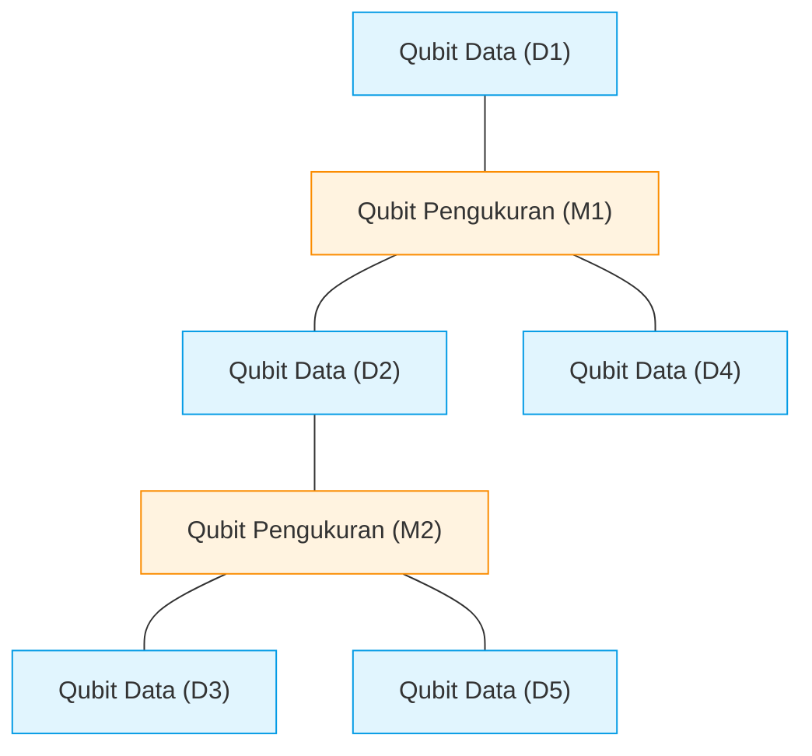
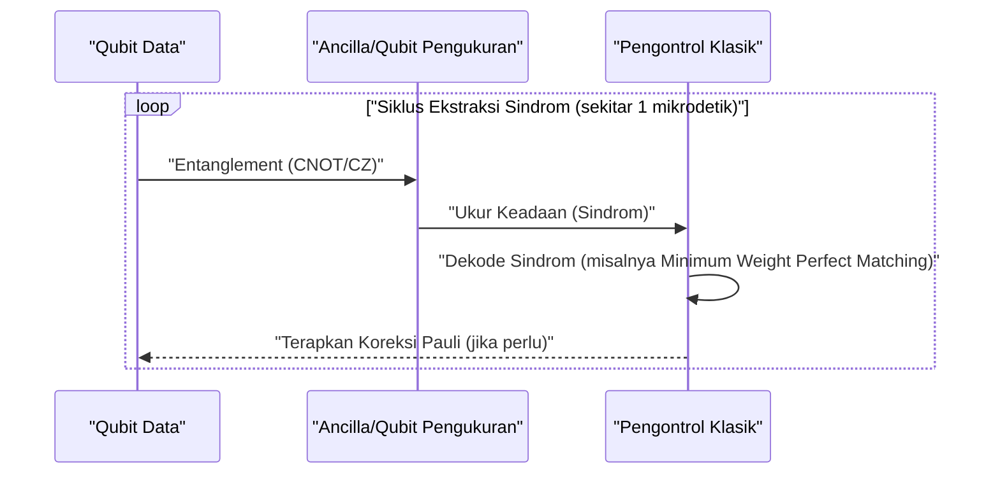
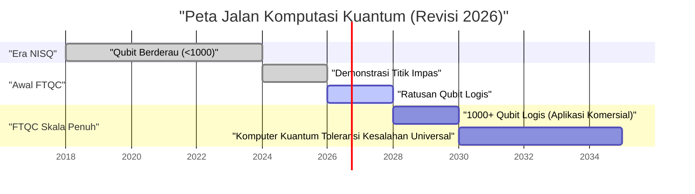

## 1. Pendahuluan: Sejauh Mana Komputer Kuantum Berkembang di Tahun 2026?

Pada tahun 2026 saat ini, komputasi kuantum telah membuat pergeseran yang menentukan dari "mimpi teoretis" di masa lalu menjadi "realitas rekayasa". Seiring dengan semakin jelasnya batasan perangkat **NISQ (Noisy Intermediate-Scale Quantum)** yang merupakan arus utama hingga beberapa tahun lalu, lembaga penelitian dan raksasa teknologi di seluruh dunia telah mengalihkan haluan menuju realisasi "Komputasi Kuantum Toleransi Kesalahan (FTQC: Fault-Tolerant Quantum Computing)".

Dalam artikel ini, kita akan menggali lebih dalam posisi komputer kuantum saat ini, sekaligus membahas terobosan terbaru di tahun 2026. Secara khusus, kita akan menjelaskan secara rinci tentang koreksi kesalahan kuantum (kode permukaan), perbedaan antara qubit fisik dan qubit logis, kemajuan komputasi kuantum topologis, serta garis depan metode superkonduktor dan perangkap ion.

---

## 2. Dasar-dasar Keadaan Kuantum dan Fidelitas (Fidelity)

Qubit, yang merupakan unit dasar dari komputer kuantum, berbeda dari bit klasik (0 atau 1) karena dapat mengambil keadaan superposisi (Superposition) antara 0 dan 1. Keadaan dari sebuah qubit tunggal direpresentasikan sebagai vektor dalam ruang Hilbert sebagai berikut:

$$
|\psi\rangle = \alpha|0\rangle + \beta|1\rangle
$$

Di sini, $\alpha$ dan $\beta$ adalah amplitudo probabilitas berupa bilangan kompleks, yang memenuhi kondisi normalisasi berikut:

$$
|\alpha|^2 + |\beta|^2 = 1
$$

Metrik yang sangat penting dalam mengukur kinerja komputasi kuantum adalah **Fidelitas (Fidelity)**. Fidelitas $F$ antara keadaan kuantum ideal $|\psi\rangle$ dan matriks densitas aktual $\rho$ yang telah terdegradasi menjadi keadaan campuran akibat derau (noise), didefinisikan sebagai berikut:

$$
F(\rho, |\psi\rangle) = \langle \psi | \rho | \psi \rangle
$$

Saat ini di tahun 2026, fidelitas gerbang 2-qubit (contoh: gerbang CNOT atau gerbang CZ) dengan metode superkonduktor telah secara stabil melampaui batas **99,99%** (yang dikenal sebagai "4 nine"). Angka ini jauh melampaui ambang batas koreksi kesalahan oleh kode permukaan (sekitar 99%), dan merupakan salah satu terobosan terbesar menuju penggunaan praktis.

---

## 3. Batasan Era NISQ dan Pergeseran Paradigma ke FTQC

Periode dari akhir 2010-an hingga awal 2020-an adalah era NISQ (Noisy Intermediate-Scale Quantum), yaitu perangkat dengan puluhan hingga ratusan qubit tanpa koreksi kesalahan. Namun, NISQ memiliki batasan yang jelas.

Seiring bertambahnya kedalaman (Depth) sirkuit, kesalahan terakumulasi secara eksponensial, sehingga mustahil untuk mendapatkan hasil komputasi yang bermakna. Probabilitas keberhasilan keseluruhan $P_{success}$ pada sirkuit dengan kedalaman $D$ menurun relatif terhadap fidelitas gerbang tunggal $f$ dan jumlah gerbang $N$ sebagai berikut:

$$
P_{success} \approx f^N
$$

Jika kita menerapkan 1000 gerbang dengan $f = 0.99$, maka hasilnya adalah $0.99^{1000} \approx 4.3 \times 10^{-5}$, dan hasilnya hampir tenggelam dalam derau acak. Oleh karena itu, pada tahun 2026, sumber daya tidak lagi difokuskan pada peningkatan skala algoritma NISQ secara langsung (seperti VQE atau QAOA), melainkan dipusatkan pada pembuatan **Qubit Logis (Logical Qubit)**.

---

## 4. Koreksi Kesalahan Kuantum dan Qubit Logis: Garis Depan Kode Permukaan

Koreksi Kesalahan Kuantum (QEC: Quantum Error Correction) adalah teknologi yang mengodekan beberapa "qubit fisik" untuk menciptakan satu "qubit logis" guna mendeteksi dan mengoreksi kesalahan. Saat ini, metode yang dianggap paling menjanjikan adalah **Kode Permukaan (Surface Code)**.

### 4.1 Struktur Kode Permukaan (Surface Code)

Dalam kode permukaan, qubit disusun dalam bentuk kisi 2 dimensi. Qubit data (yang menyimpan informasi aktual) dan qubit pengukuran (untuk pengukuran sindrom) disusun seperti pola papan catur.

Dengan menggunakan operator penstabil (stabilizer) $S_x$ dan $S_z$, sistem secara terus-menerus memantau pembalikan bit (kesalahan X) dan pembalikan fase (kesalahan Z).

$$
S_x = \prod_{i \in \text{star}} X_i, \quad S_z = \prod_{j \in \text{plaquette}} Z_j
$$

Kemajuan penting di tahun 2026 adalah keberhasilan menembus "Titik Impas (Break-even point)" sepenuhnya. Artinya, derau yang dihilangkan oleh koreksi kesalahan kini lebih besar daripada derau yang ditimbulkan oleh sirkuit tambahan yang digunakan untuk melakukan koreksi kesalahan tersebut, sehingga umur qubit logis kini bisa melampaui umur qubit fisik hingga beberapa orde besaran.

### 4.2 Siklus Koreksi Kesalahan Kuantum

Koreksi kesalahan berfungsi sebagai putaran umpan balik (feedback loop) yang berkelanjutan.

Saat ini, teknologi untuk menjalankan proses dekode klasik ini (analisis sindrom) dalam skala nanodetik menggunakan FPGA atau ASIC khusus telah mapan, dan koreksi kesalahan secara waktu nyata (real-time) telah memasuki tahap praktis.

---

## 5. Evolusi Arsitektur Perangkat Keras (Edisi 2026)

Perangkat keras kuantum di tahun 2026 berevolusi terutama pada tiga poros: "metode superkonduktor", "metode perangkap ion", dan "metode topologis".

### 5.1 Integrasi Qubit Superkonduktor

Metode superkonduktor adalah bidang yang dipimpin oleh perusahaan seperti IBM dan Google, dengan qubit Transmon yang menggunakan sambungan Josephson sebagai arus utama. Pada tahun 2026, sebuah chip mega (megachip) yang mengintegrasikan ribuan hingga puluhan ribu qubit fisik pada satu chip tunggal telah terealisasi.

Yang patut dicatat adalah penetapan **Interkoneksi Kuantum Antarmodul (Quantum Interconnects)**. Teleportasi kuantum antar-chip menggunakan foton gelombang mikro telah diimplementasikan pada tingkat komersial, sehingga memungkinkan kita untuk menghindari batasan ukuran dari satu kulkas dilusi (dilution refrigerator).

### 5.2 Penskalaan 2 Dimensi Perangkap Ion dan Interkoneksi Optik

Pada metode perangkap ion (dipimpin oleh Quantinuum, IonQ, dll.), status energi internal ion yang melayang dalam ruang hampa digunakan sebagai qubit. Dibandingkan dengan metode superkonduktor, ia memiliki keuntungan berupa waktu koherensi T1/T2 yang sangat panjang serta konektivitas menyeluruh (All-to-All Connectivity) yang dimungkinkan.

Terobosan di tahun 2026 adalah visualisasi 2 dimensi dari arsitektur QCCD (Quantum Charge Coupled Device) dan pembuatan entanglement berkecepatan tinggi antar multi-perangkap menggunakan interkoneksi fotonik. Hal ini secara drastis memperbaiki "lambatnya kecepatan gerbang" dan "skalabilitas" yang sebelumnya menjadi kelemahan perangkap ion.

### 5.3 Komputasi Kuantum Topologis: Pengendalian Anyon

**Komputasi kuantum topologis**, yang lama dianggap hanya ada secara teori, akhirnya memasuki fase pembuktian eksperimental pada tahun 2026. Metode yang didorong oleh Microsoft dan lainnya ini menggunakan anyon non-Abelian (Non-Abelian Anyons) yang disebut "Mode Nol Majorana (Majorana Zero Modes)".

Gerbang kuantum dijalankan melalui operasi yang disebut "Jalinan (Braiding)", yang menukar posisi partikel anyon.

$$
|\psi_{final}\rangle = B_{ij} |\psi_{initial}\rangle
$$

Di sini, $B_{ij}$ adalah operator jalinan. Karena metode topologis bergantung pada topologi "simpul" keseluruhan alih-alih pada keadaan lokal partikel untuk menyimpan informasi, metode ini secara inheren tahan terhadap derau lingkungan (toleransi kesalahan di tingkat perangkat keras). Pada tahun 2026, pembentukan qubit logis topologis dengan fidelitas tinggi berhasil dikonfirmasi untuk pertama kalinya di dunia, dan hal ini menarik perhatian sebagai jalan pintas yang kuat menuju FTQC.

---

## 6. Peta Jalan dan Prospek Menuju Penggunaan Praktis

Untuk benar-benar mewujudkan **Keunggulan Kuantum (Quantum Advantage)**, di mana komputer kuantum mengungguli komputer klasik (superkomputer) di bidang seperti "komputasi kimia", "ilmu material", dan "pemodelan keuangan", diperlukan ribuan qubit logis.

### 6.1 Tantangan yang Dihadapi Saat Ini dan Masa Depan
Tantangan terbesar per tahun 2026 adalah kapasitas pendinginan dari kriostat raksasa (kulkas dilusi) untuk mempertahankan suhu sangat rendah, serta pemasangan kabel (bottleneck I/O) yang menghubungkan perangkat pengendali pada suhu ruang dengan chip kuantum bersuhu sangat rendah. Sebagai solusinya, pengembangan chip pengontrol CMOS yang beroperasi di lingkungan bersuhu sangat rendah (Cryo-CMOS) sedang berjalan dengan sangat cepat.

### Kesimpulan

Tahun 2026 akan tercatat dalam sejarah komputer kuantum sebagai "Tahun Pertama Penskalaan Qubit Logis". Dengan pembuktian algoritma koreksi kesalahan, modularisasi perangkat keras, dan kemajuan pesat dalam pendekatan topologis, "hari ketika komputer kuantum menjadi praktis" bukan lagi cerita dari masa depan yang jauh, melainkan sebuah tonggak pencapaian konkret yang dapat kita nantikan dalam beberapa tahun mendatang. Bagi para pengembang algoritma kuantum dan perusahaan, sekaranglah waktu yang tepat untuk berinvestasi secara serius pada pemecahan masalah kuantum-native.

---
*Artikel ini ditulis berdasarkan makalah penelitian komputasi kuantum terbaru dan tren industri per tahun 2026.*
