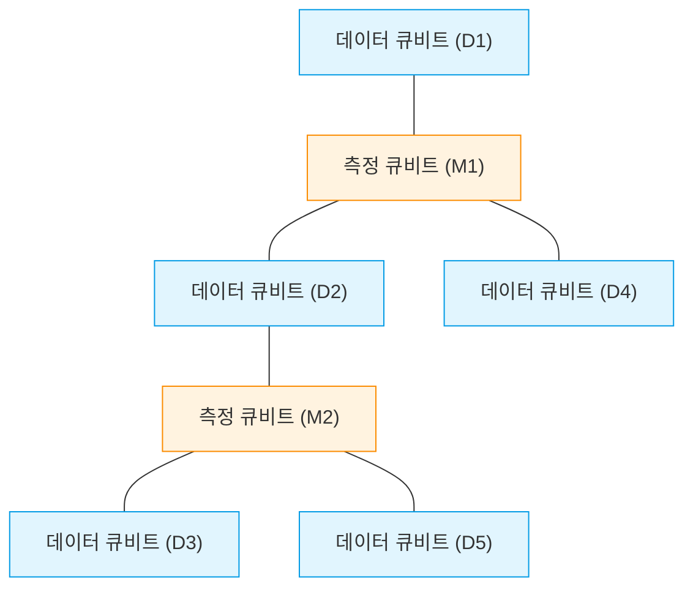
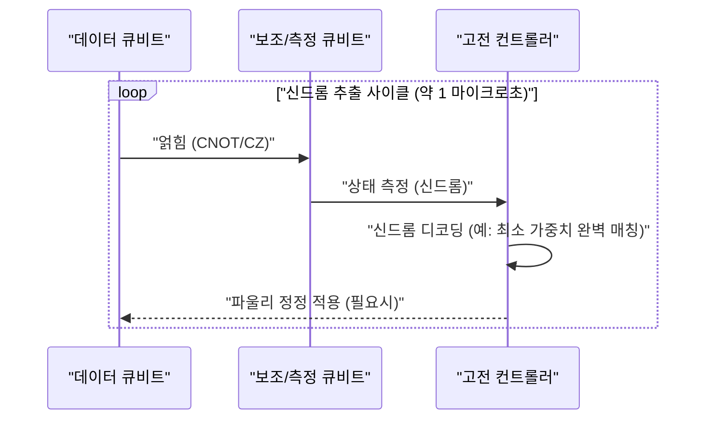
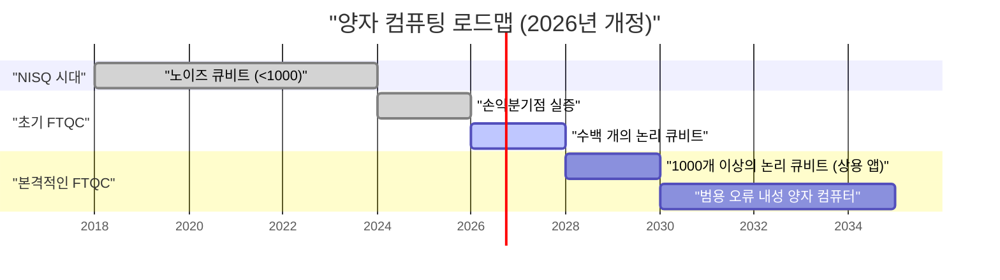

## 1. 시작하며: 2026년, 양자 컴퓨터는 어디까지 왔는가

2026년 현재, 양자 컴퓨팅은 과거의 '이론상의 꿈'에서 '공학적인 현실'로 결정적인 전환을 이루었습니다. 수년 전까지 주류였던 **NISQ(Noisy Intermediate-Scale Quantum)** 디바이스의 한계가 명확해짐에 따라, 전 세계의 연구 기관과 거대 기술 기업들은 '오류 내성 양자 컴퓨팅(FTQC: Fault-Tolerant Quantum Computing)'의 실현으로 방향을 틀었습니다.

이 글에서는 2026년의 최신 돌파구를 교차하며, 양자 컴퓨터의 현재 위치를 깊이 파고듭니다. 특히, 양자 오류 정정(표면 부호), 물리 큐비트와 논리 큐비트의 차이, 위상 양자 컴퓨팅의 진전, 그리고 초전도·이온 트랩 방식의 최전선에 대해 자세히 설명합니다.

---

## 2. 양자 상태의 기초와 피델리티(충실도)

양자 컴퓨터의 기본 단위인 양자 비트(Qubit)는 고전적인 비트(0 또는 1)와는 달리, 0과 1의 중첩 상태(Superposition)를 취할 수 있습니다. 단일 큐비트의 상태는 힐베르트 공간 상의 벡터로서 다음과 같이 표현됩니다.

$$
|\psi\rangle = \alpha|0\rangle + \beta|1\rangle
$$

여기서 $\alpha$와 $\beta$는 복소수인 확률 진폭이며, 다음의 정규화 조건을 만족합니다.

$$
|\alpha|^2 + |\beta|^2 = 1
$$

양자 컴퓨팅의 성능을 측정하는 데 있어 매우 중요한 지표가 **피델리티(Fidelity)**입니다. 이상적인 양자 상태 $|\psi\rangle$와 노이즈에 의해 열화되어 혼합 상태가 된 실제 밀도 행렬 $\rho$ 간의 피델리티 $F$는 다음과 같이 정의됩니다.

$$
F(\rho, |\psi\rangle) = \langle \psi | \rho | \psi \rangle
$$

2026년 현재, 2큐비트 게이트(예: CNOT 게이트나 CZ 게이트)의 피델리티는 초전도 방식에서 **99.99%**의 장벽(이른바 '4나인')을 안정적으로 넘어서게 되었습니다. 이는 표면 부호에 의한 오류 정정 임계값(약 99%)을 크게 웃도는 수치이며, 상용화를 향한 가장 큰 돌파구 중 하나입니다.

---

## 3. NISQ 시대의 한계와 FTQC로의 패러다임 전환

2010년대 후반부터 2020년대 전반에 걸쳐서는 오류 정정을 가지지 않는 수십~수백 큐비트의 디바이스인 NISQ(Noisy Intermediate-Scale Quantum)의 시대였습니다. 하지만, NISQ에는 명확한 한계가 있었습니다.

회로의 깊이(Depth)가 증가함에 따라 오류가 지수 함수적으로 축적되어, 의미 있는 계산 결과를 얻는 것이 불가능해집니다. 회로의 깊이 $D$에서의 전체 성공 확률 $P_{success}$는 단일 게이트의 피델리티 $f$와 게이트 수 $N$에 대해 다음과 같이 감쇠합니다.

$$
P_{success} \approx f^N
$$

만약 $f = 0.99$에서 1000개의 게이트를 적용한 경우, $0.99^{1000} \approx 4.3 \times 10^{-5}$가 되어 결과는 거의 랜덤 노이즈에 묻혀버리게 됩니다. 이로 인해 2026년에는 NISQ 알고리즘(VQE나 QAOA 등)의 직접적인 스케일업보다는 **논리 큐비트(Logical Qubit)**의 생성에 자원이 집중되고 있습니다.

---

## 4. 양자 오류 정정과 논리 큐비트: 표면 부호의 최전선

양자 오류 정정(QEC: Quantum Error Correction)은 여러 '물리 큐비트'를 인코딩하여 하나의 '논리 큐비트'를 만들어내어, 오류를 감지하고 정정하는 기술입니다. 현재 가장 유망하게 여겨지는 것이 **표면 부호(Surface Code)**입니다.

### 4.1 표면 부호(Surface Code)의 구조

표면 부호에서는 큐비트를 2차원 격자 형태로 배치합니다. 데이터 큐비트(실제 정보를 유지)와 측정 큐비트(신드롬 측정용)가 체크무늬처럼 늘어섭니다.

안정자(Stabilizer) 연산자 $S_x$와 $S_z$를 사용하여, 비트 반전(X 오류)과 위상 반전(Z 오류)을 끊임없이 감시합니다.

$$
S_x = \prod_{i \in \text{star}} X_i, \quad S_z = \prod_{j \in \text{plaquette}} Z_j
$$

2026년의 중대한 진전은 '손익분기점(Break-even point)'을 완전히 돌파했다는 것입니다. 즉, 오류 정정을 수행하기 위한 여분의 회로가 일으키는 노이즈보다 오류 정정에 의해 제거되는 노이즈가 더 커지게 되어, 논리 큐비트의 수명이 물리 큐비트의 수명을 몇 자릿수나 웃돌게 되었습니다.

### 4.2 양자 오류 정정의 사이클

오류 정정은 지속적인 피드백 루프로 기능합니다.

현재는 이러한 고전적인 디코딩 처리(신드롬 해석)를 FPGA나 전용 ASIC에서 나노초 단위로 실행하는 기술이 확립되어, 실시간 오류 정정이 실용화 단계에 접어들었습니다.

---

## 5. 하드웨어 아키텍처의 진화 (2026년판)

2026년의 양자 하드웨어는 주로 '초전도 방식', '이온 트랩 방식', '위상(Topological) 방식'의 세 가지 축으로 진화하고 있습니다.

### 5.1 초전도 큐비트의 집적화

초전도 방식은 IBM이나 Google이 이끌고 있는 분야이며, 조셉슨 접합을 이용한 트랜즈몬(Transmon) 큐비트가 주류입니다. 2026년에는 단일 칩 상에 수천에서 일만 개의 물리 큐비트를 집적하는 메가 칩이 실현되었습니다.

특기할 만한 점은 **모듈 간 양자 통신(Quantum Interconnects)**의 확립입니다. 마이크로파 광자를 이용한 칩 간의 양자 원격 이동(Quantum Teleportation)이 상용 수준에서 구현되어, 단일 희석 냉동기의 크기 제한을 우회할 수 있게 되었습니다.

### 5.2 이온 트랩의 2차원 스케일링과 광 인터커넥트

이온 트랩 방식(Quantinuum이나 IonQ 등이 주도)에서는 진공 중에 부유하는 이온의 내부 에너지 상태를 큐비트로 사용합니다. 초전도 방식과 비교하여 T1/T2 결맞음(Coherence) 시간이 극히 길고, 전결합(All-to-All Connectivity)이 가능하다는 장점이 있습니다.

2026년의 돌파구는 QCCD(Quantum Charge Coupled Device) 아키텍처의 2차원화와 광 인터커넥트(Photonic Interconnect)를 이용한 다중 트랩 간의 고속 얽힘 생성입니다. 이로 인해 이온 트랩의 약점이었던 '느린 게이트 속도'와 '확장성'이 극적으로 개선되었습니다.

### 5.3 위상 양자 컴퓨팅: 애니온의 제어

오랫동안 이론상의 존재로 여겨져 왔던 **위상 양자 컴퓨팅**이 2026년에 마침내 실험적인 실증 단계에 들어섰습니다. Microsoft 등이 추진하는 이 방식은 '마요라나 제로 모드(Majorana Zero Modes)'라고 불리는 비가환 애니온(Non-Abelian Anyons)을 사용합니다.

애니온 입자의 위치를 맞바꾸는 '브레이딩(Braiding, 땋기)'이라는 조작을 통해 양자 게이트를 실행합니다.

$$
|\psi_{final}\rangle = B_{ij} |\psi_{initial}\rangle
$$

여기서 $B_{ij}$는 브레이딩 연산자입니다. 위상 방식은 정보의 저장이 입자의 국소적인 상태가 아니라 전체의 '매듭' 위상(Topology)에 의존하기 때문에, 환경 노이즈에 대해 본질적으로 내성(하드웨어 수준에서의 오류 내성)을 가지고 있습니다. 2026년에 세계 최초로 고충실도의 위상 논리 큐비트 생성이 확인되어, FTQC를 향한 강력한 지름길로 주목받고 있습니다.

---

## 6. 실용화를 향한 로드맵과 전망

양자 컴퓨터가 '화학 계산', '재료 과학', '금융 모델링' 등에서 고전 컴퓨터(슈퍼 컴퓨터)를 압도하는 **양자 우위(Quantum Advantage)**를 진정으로 발휘하기 위해서는 수천 개의 논리 큐비트가 필요합니다.

### 6.1 현재 직면한 과제와 미래
2026년 시점에서의 최대 과제는 극저온을 유지하기 위한 거대한 크라이오스탯(희석 냉동기)의 냉각 능력과, 실온의 제어 장치와 극저온의 양자 칩을 연결하는 배선(I/O 병목 현상)입니다. 이에 대응하여 극저온 환경에서 동작하는 CMOS(Cryo-CMOS) 컨트롤러 칩의 개발이 빠른 속도로 진행되고 있습니다.

### 결론

2026년은 양자 컴퓨터의 역사에 있어 '논리 큐비트 스케일업 원년'으로 기록될 것입니다. 오류 정정 알고리즘의 실증, 하드웨어의 모듈화, 그리고 위상 접근법의 급진전에 의해 '실용화되는 날'은 더 이상 먼 미래의 이야기가 아니라, 향후 몇 년 이내의 구체적인 이정표로 내다볼 수 있게 되었습니다. 양자 알고리즘 개발자나 기업들에게 있어, 지금이야말로 양자 네이티브한 문제 해결에 본격적으로 투자해야 할 적기라고 할 수 있습니다.

---
*이 글은 2026년 시점의 최신 양자 컴퓨팅 연구 논문 및 업계 동향을 바탕으로 작성되었습니다.*

