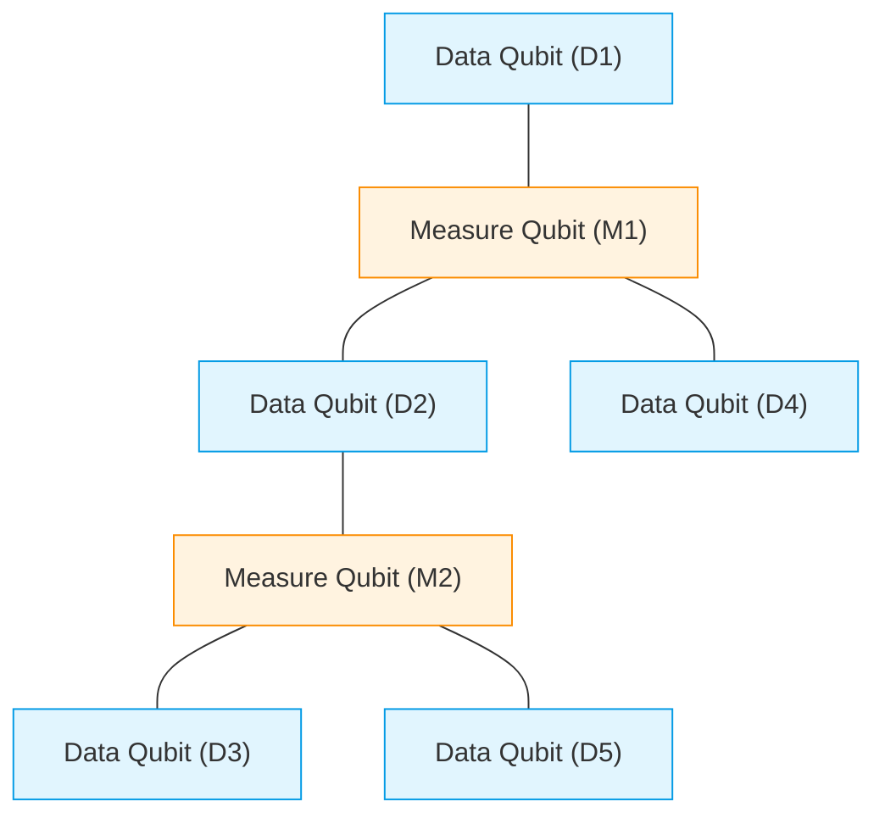
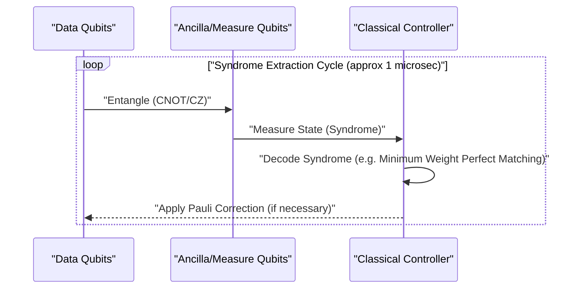
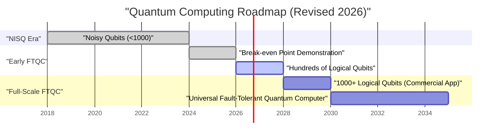

## 1. はじめに：2026年、量子コンピュータはどこまで来たのか

2026年現在、量子コンピューティングはかつての「理論上の夢」から「工学的な現実」へと決定的なシフトを遂げました。数年前まで主流であった**NISQ（Noisy Intermediate-Scale Quantum）**デバイスの限界が明確になるにつれ、世界中の研究機関とテックジャイアントは「誤り耐性量子計算（FTQC: Fault-Tolerant Quantum Computing）」の実現へと舵を切りました。

この記事では、2026年の最新のブレイクスルーを交えながら、量子コンピュータの現在地を深く掘り下げます。特に、量子エラー訂正（表面符号）、物理量子ビットと論理量子ビットの違い、トポロジカル量子計算の進展、そして超伝導・イオントラップ方式の最前線について詳解します。

---

## 2. 量子状態の基礎とフィデリティ（忠実度）

量子コンピュータの基本単位である量子ビット（Qubit）は、古典的なビット（0または1）とは異なり、0と1の重ね合わせ状態（Superposition）をとることができます。単一の量子ビットの状態は、ヒルベルト空間上のベクトルとして次のように表されます。

$$
|\psi\rangle = \alpha|0\rangle + \beta|1\rangle
$$

ここで、$\alpha$ と $\beta$ は複素数の確率振幅であり、以下の規格化条件を満たします。

$$
|\alpha|^2 + |\beta|^2 = 1
$$

量子計算の性能を測る上で極めて重要な指標が**フィデリティ（Fidelity）**です。理想的な量子状態 $|\psi\rangle$ と、ノイズによって劣化し混合状態となった実際の密度行列 $\rho$ との間のフィデリティ $F$ は次のように定義されます。

$$
F(\rho, |\psi\rangle) = \langle \psi | \rho | \psi \rangle
$$

2026年の現在、2量子ビットゲート（例：CNOTゲートやCZゲート）のフィデリティは、超伝導方式で**99.99%**の壁（いわゆる「4ナイン」）を安定して超えるようになりました。これは表面符号によるエラー訂正の閾値（約99%）を大幅に上回る数値であり、実用化に向けた最大のブレイクスルーの一つです。

---

## 3. NISQ時代の限界とFTQCへのパラダイムシフト

2010年代後半から2020年代前半にかけては、エラー訂正を持たない数十〜数百量子ビットのデバイスであるNISQ（Noisy Intermediate-Scale Quantum）の時代でした。しかし、NISQには明確な限界がありました。

回路の深さ（Depth）が増すにつれてエラーが指数関数的に蓄積し、意味のある計算結果を得ることが不可能になります。回路の深さ $D$ における全体の成功確率 $P_{success}$ は、単一ゲートのフィデリティ $f$ とゲート数 $N$ に対して次のように減衰します。

$$
P_{success} \approx f^N
$$

もし $f = 0.99$ で1000個のゲートを適用した場合、$0.99^{1000} \approx 4.3 \times 10^{-5}$ となり、結果はほぼランダムノイズに埋もれてしまいます。このため、2026年においては、NISQアルゴリズム（VQEやQAOAなど）の直接的なスケールアップよりも、**論理量子ビット（Logical Qubit）**の生成にリソースが集中しています。

---

## 4. 量子エラー訂正と論理量子ビット：表面符号の最前線

量子エラー訂正（QEC: Quantum Error Correction）は、複数の「物理量子ビット」をエンコードして1つの「論理量子ビット」を作り出し、エラーを検知・訂正する技術です。現在最も有望視されているのが**表面符号（Surface Code）**です。

### 4.1 表面符号（Surface Code）の構造

表面符号では、量子ビットを2次元の格子状に配置します。データ量子ビット（実際の情報を保持）と測定量子ビット（シンドローム測定用）が市松模様のように並びます。

スタビライザー演算子 $S_x$ と $S_z$ を用いて、ビット反転（Xエラー）と位相反転（Zエラー）を絶えず監視します。

$$
S_x = \prod_{i \in \text{star}} X_i, \quad S_z = \prod_{j \in \text{plaquette}} Z_j
$$

2026年の重大な進展は、「ブレイクイーブン点（Break-even point）」を完全に突破したことです。すなわち、エラー訂正を行うための余分な回路が引き起こすノイズよりも、エラー訂正によって取り除かれるノイズの方が大きくなり、論理量子ビットの寿命が物理量子ビットの寿命を何桁も上回るようになりました。

### 4.2 量子エラー訂正のサイクル

エラー訂正は継続的なフィードバックループとして機能します。

現在では、この古典的なデコード処理（シンドロームの解析）をFPGAや専用ASICでナノ秒単位で実行する技術が確立され、リアルタイムでのエラー訂正が実用段階に入っています。

---

## 5. ハードウェアアーキテクチャの進化（2026年版）

2026年における量子ハードウェアは、主に「超伝導方式」「イオントラップ方式」「トポロジカル方式」の3つの軸で進化しています。

### 5.1 超伝導量子ビットの集積化

超伝導方式は、IBMやGoogleがリードする分野であり、ジョセフソン接合を用いたトランズモン（Transmon）量子ビットが主流です。2026年には、単一チップ上に数千から一万の物理量子ビットを集積するメガチップが実現しました。

特筆すべきは、**モジュール間量子通信（Quantum Interconnects）**の確立です。マイクロ波光子を用いたチップ間の量子テレポーテーションが商用レベルで実装され、単一の希釈冷凍機のサイズ制限を回避できるようになりました。

### 5.2 イオントラップの2次元スケーリングと光インターコネクト

イオントラップ方式（QuantinuumやIonQなどが主導）では、真空中に浮遊するイオンの内部エネルギー状態を量子ビットとして用います。超伝導方式と比較して、T1/T2コヒーレンス時間が極めて長く、全結合（All-to-All Connectivity）が可能という利点があります。

2026年のブレイクスルーは、QCCD（Quantum Charge Coupled Device）アーキテクチャの2次元化と、フォトニックインターコネクトを用いたマルチトラップ間の高速エンタングルメント生成です。これにより、イオントラップの弱点であった「ゲート速度の遅さ」と「スケーラビリティ」が劇的に改善されました。

### 5.3 トポロジカル量子計算：エニオンの制御

長らく理論上の存在とされてきた**トポロジカル量子計算**が、2026年に遂に実験的な実証のフェーズに入りました。Microsoftなどが推し進めるこの方式は、「マヨラナゼロモード（Majorana Zero Modes）」と呼ばれる非可換エニオン（Non-Abelian Anyons）を用います。

エニオンの粒子の位置を入れ替える「ブレイディング（Braiding）」という操作によって量子ゲートを実行します。

$$
|\psi_{final}\rangle = B_{ij} |\psi_{initial}\rangle
$$

ここで $B_{ij}$ はブレイディング演算子です。トポロジカル方式は、情報の保存が粒子の局所的な状態ではなく、全体の「結び目」のトポロジーに依存するため、環境ノイズに対して本質的に耐性（ハードウェアレベルでのエラー耐性）を持っています。2026年に世界で初めて高忠実度なトポロジカル論理量子ビットの生成が確認され、FTQCへの強力なショートカットとして注目を集めています。

---

## 6. 実用化に向けたロードマップと展望

量子コンピュータが「化学計算」「材料科学」「金融モデリング」などで古典コンピュータ（スーパーコンピュータ）を圧倒する**量子超越性（Quantum Advantage）**を真に発揮するためには、数千の論理量子ビットが必要です。

### 6.1 現在直面している課題と未来
2026年時点での最大の課題は、極低温を維持するための巨大なクライオスタット（希釈冷凍機）の冷却能力と、室温の制御装置と極低温の量子チップを繋ぐ配線（I/Oボトルネック）です。これに対して、極低温環境で動作するCMOS（Cryo-CMOS）コントローラチップの開発が急ピッチで進んでいます。

### 結論

2026年は、量子コンピュータの歴史において「論理量子ビットのスケールアップ元年」として記録されるでしょう。エラー訂正アルゴリズムの実証、ハードウェアのモジュール化、そしてトポロジカルアプローチの急進展により、「実用化される日」はもはや遠い未来の話ではなく、今後数年以内の具体的なマイルストーンとして見据えることができるようになりました。量子アルゴリズムの開発者や企業にとって、今こそ量子ネイティブな問題解決へと本格的に投資すべきタイミングと言えます。

---
*この記事は2026年時点の最新の量子コンピューティング研究論文および業界動向に基づいて執筆されています。*

