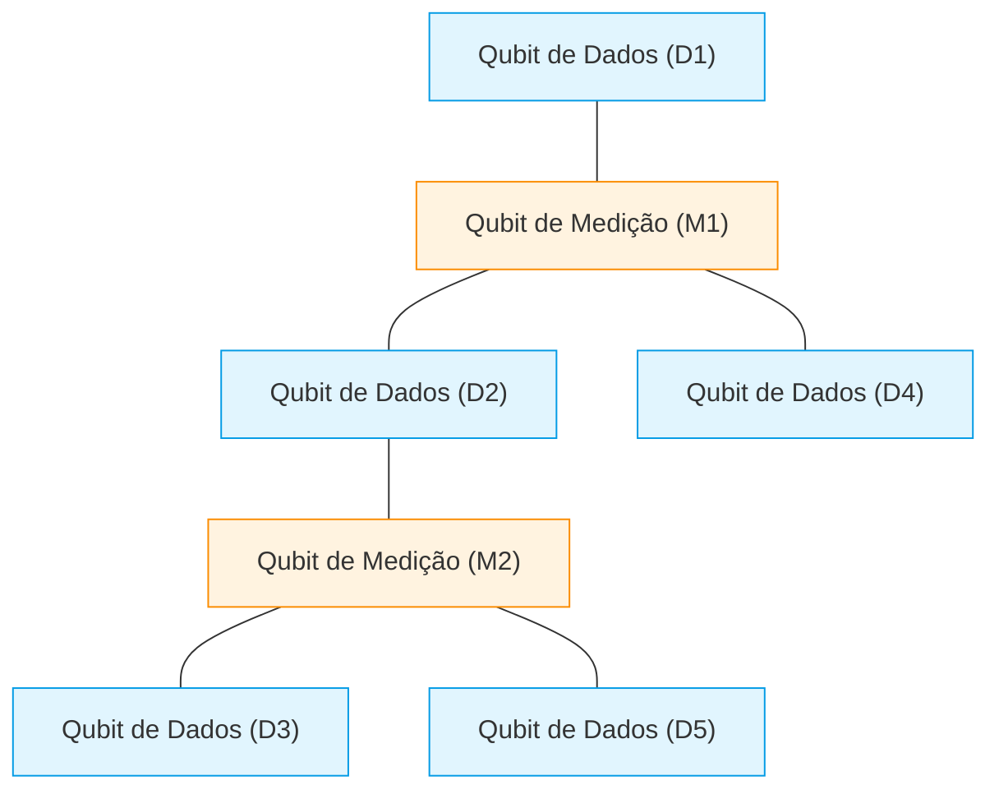
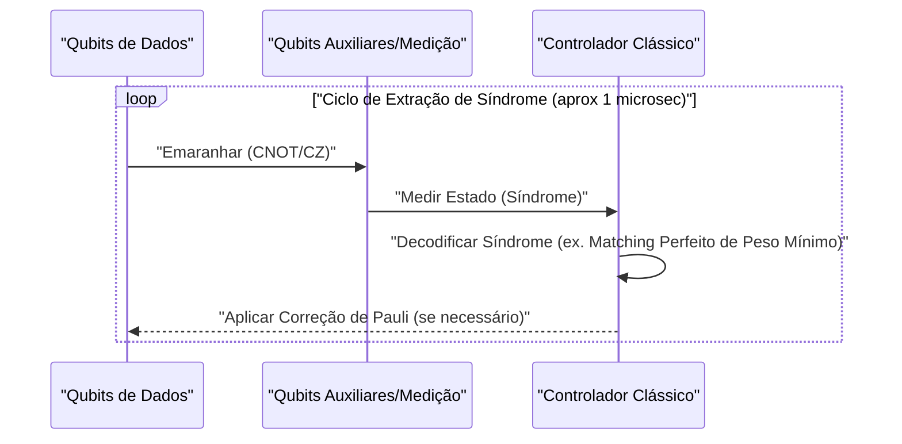
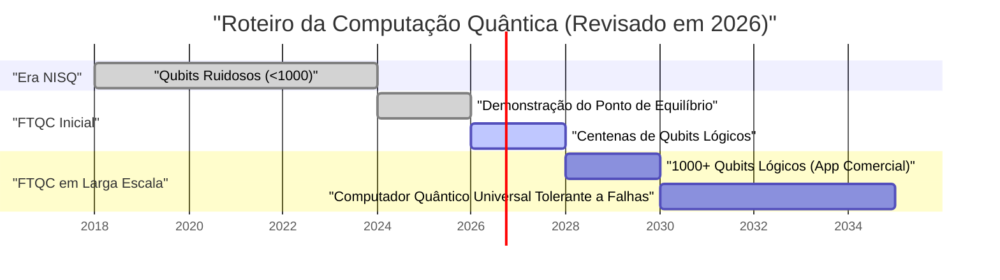

## 1. Introdução: Até onde chegaram os computadores quânticos em 2026?

Atualmente, em 2026, a computação quântica passou por uma mudança decisiva, deixando de ser um "sonho teórico" do passado para se tornar uma "realidade de engenharia". À medida que os limites dos dispositivos **NISQ (Noisy Intermediate-Scale Quantum)**, que eram predominantes até poucos anos atrás, tornaram-se claros, instituições de pesquisa e gigantes da tecnologia em todo o mundo mudaram o rumo em direção à realização da "Computação Quântica Tolerante a Falhas (FTQC: Fault-Tolerant Quantum Computing)".

Neste artigo, aprofundaremos na situação atual dos computadores quânticos, entrelaçando as descobertas mais recentes de 2026. Em particular, detalharemos a correção de erros quânticos (código de superfície), a diferença entre qubits físicos e lógicos, o avanço da computação quântica topológica e a vanguarda das abordagens de supercondutores e armadilhas de íons.

---

## 2. Fundamentos do estado quântico e fidelidade

A unidade básica de um computador quântico, o qubit (Qubit), diferentemente do bit clássico (0 ou 1), pode assumir um estado de superposição (Superposition) de 0 e 1. O estado de um único qubit é representado como um vetor em um espaço de Hilbert da seguinte forma:

$$
|\psi\rangle = \alpha|0\rangle + \beta|1\rangle
$$

Aqui, $\alpha$ e $\beta$ são amplitudes de probabilidade complexas e satisfazem a seguinte condição de normalização:

$$
|\alpha|^2 + |\beta|^2 = 1
$$

Um indicador extremamente importante para medir o desempenho da computação quântica é a **fidelidade (Fidelity)**. A fidelidade $F$ entre o estado quântico ideal $|\psi\rangle$ e a verdadeira matriz de densidade $\rho$, que se degradou e se tornou um estado misto devido ao ruído, é definida da seguinte forma:

$$
F(\rho, |\psi\rangle) = \langle \psi | \rho | \psi \rangle
$$

Atualmente em 2026, a fidelidade de portas de 2 qubits (ex: portas CNOT e portas CZ) superou de forma estável a barreira dos **99,99%** (os chamados "quatro noves") na abordagem de supercondutores. Este é um valor que excede significativamente o limite de correção de erros através de códigos de superfície (cerca de 99%), sendo um dos maiores avanços para a aplicação prática.

---

## 3. Os limites da era NISQ e a mudança de paradigma para a FTQC

O período entre o final da década de 2010 e o início da década de 2020 foi a era do NISQ (Noisy Intermediate-Scale Quantum), caracterizada por dispositivos de dezenas a centenas de qubits sem correção de erros. No entanto, o NISQ tinha limites claros.

À medida que a profundidade (Depth) do circuito aumenta, os erros se acumulam de forma exponencial, tornando impossível obter um resultado de cálculo significativo. A probabilidade de sucesso geral $P_{success}$ na profundidade do circuito $D$ decai em relação à fidelidade de uma única porta $f$ e ao número de portas $N$ da seguinte forma:

$$
P_{success} \approx f^N
$$

Se aplicarmos 1000 portas com $f = 0.99$, o resultado será $0.99^{1000} \approx 4.3 \times 10^{-5}$, e o resultado ficará quase completamente submerso em ruído aleatório. Por esse motivo, em 2026, os recursos estão concentrados na geração de **qubits lógicos (Logical Qubit)**, em vez de expandir diretamente os algoritmos NISQ (como VQE e QAOA).

---

## 4. Correção de erros quânticos e qubits lógicos: A vanguarda dos códigos de superfície

A correção de erros quânticos (QEC: Quantum Error Correction) é uma tecnologia que codifica vários "qubits físicos" para criar um "qubit lógico", detectando e corrigindo erros. Atualmente, o mais promissor é o **código de superfície (Surface Code)**.

### 4.1 Estrutura do código de superfície (Surface Code)

No código de superfície, os qubits são dispostos em uma rede bidimensional. Os qubits de dados (que retêm as informações reais) e os qubits de medição (para a medição da síndrome) estão alinhados em um padrão quadriculado.

Usando os operadores estabilizadores $S_x$ e $S_z$, monitoramos constantemente a inversão de bits (erro X) e a inversão de fase (erro Z).

$$
S_x = \prod_{i \in \text{star}} X_i, \quad S_z = \prod_{j \in \text{plaquette}} Z_j
$$

O avanço significativo de 2026 foi superar completamente o "ponto de equilíbrio (Break-even point)". Ou seja, o ruído removido pela correção de erros tornou-se maior que o ruído causado por circuitos adicionais para executá-la, e a vida útil dos qubits lógicos agora excede a dos qubits físicos em várias ordens de magnitude.

### 4.2 O ciclo de correção de erros quânticos

A correção de erros funciona como um ciclo contínuo de feedback.

Atualmente, foi estabelecida a tecnologia para executar este processamento de decodificação clássico (análise de síndrome) em unidades de nanossegundos em FPGAs ou ASICs dedicados, e a correção de erros em tempo real entrou na fase prática.

---

## 5. Evolução da arquitetura de hardware (Versão 2026)

O hardware quântico em 2026 está evoluindo principalmente em torno de três eixos: "abordagem de supercondutores", "abordagem de armadilhas de íons" e "abordagem topológica".

### 5.1 Integração de qubits supercondutores

A abordagem de supercondutores é uma área liderada pela IBM e pelo Google, na qual os qubits transmon (Transmon) usando junções Josephson são predominantes. Em 2026, foram realizados megachips integrando de milhares a dez mil qubits físicos em um único chip.

Destaca-se o estabelecimento de **interconexões quânticas intermodulares (Quantum Interconnects)**. O teletransporte quântico entre chips usando fótons de microondas foi implementado a nível comercial, permitindo contornar as limitações de tamanho de um único refrigerador de diluição.

### 5.2 Escalonamento 2D e interconexão óptica de armadilhas de íons

Na abordagem de armadilhas de íons (liderada por empresas como Quantinuum e IonQ), os estados de energia interna de íons suspensos no vácuo são usados como qubits. Em comparação com a abordagem de supercondutores, tem a vantagem de tempos de coerência T1/T2 extremamente longos e a possibilidade de conectividade completa (All-to-All Connectivity).

O avanço de 2026 foi a bidimensionalização da arquitetura QCCD (Quantum Charge Coupled Device) e a rápida geração de emaranhamento entre várias armadilhas usando interconexões fotônicas. Isso melhorou drasticamente a "baixa velocidade das portas" e a "escalabilidade", que eram pontos fracos das armadilhas de íons.

### 5.3 Computação quântica topológica: O controle de anyons

Considerada uma existência teórica por muito tempo, a **computação quântica topológica** finalmente entrou na fase de demonstração experimental em 2026. Esta abordagem, promovida pela Microsoft e outros, usa anyons não-abelianos (Non-Abelian Anyons) chamados "modos zero de Majorana (Majorana Zero Modes)".

As portas quânticas são executadas através de uma operação chamada "entrelaçamento (Braiding)", que troca as posições das partículas de anyon.

$$
|\psi_{final}\rangle = B_{ij} |\psi_{initial}\rangle
$$

Aqui, $B_{ij}$ é o operador de entrelaçamento. Como o armazenamento de informações na abordagem topológica não depende do estado local da partícula, mas da topologia geral do "nó", ela é inerentemente resistente ao ruído ambiental (tolerância a falhas no nível do hardware). Em 2026, foi confirmada pela primeira vez no mundo a geração de qubits lógicos topológicos de alta fidelidade, chamando a atenção como um atalho poderoso para a FTQC.

---

## 6. Roteiro para aplicação prática e perspectivas

Para que os computadores quânticos realmente demonstrem a **vantagem quântica (Quantum Advantage)** superando os computadores clássicos (supercomputadores) em áreas como "cálculos químicos", "ciência dos materiais" e "modelagem financeira", são necessários milhares de qubits lógicos.

### 6.1 Os desafios atuais e o futuro
O maior desafio em 2026 é a capacidade de resfriamento dos enormes criostatos (refrigeradores de diluição) para manter temperaturas ultrabaixas, e a fiação (gargalo de I/O) que conecta o equipamento de controle em temperatura ambiente e os chips quânticos em temperatura ultrabaixa. Em resposta a isso, o desenvolvimento de chips controladores CMOS que operam em ambientes criogênicos (Cryo-CMOS) está avançando em ritmo acelerado.

### Conclusão

O ano de 2026 provavelmente será registrado na história dos computadores quânticos como o "primeiro ano da expansão dos qubits lógicos". Com a demonstração de algoritmos de correção de erros, a modularização de hardware e o rápido progresso da abordagem topológica, "o dia em que se tornarão práticos" não é mais uma história de um futuro distante, mas algo que pode ser visualizado como um marco concreto para os próximos anos. Para os desenvolvedores de algoritmos quânticos e as empresas, pode-se dizer que agora é o momento exato para investir seriamente na resolução de problemas quânticos nativos.

---
*Este artigo foi escrito com base nos mais recentes artigos de pesquisa sobre computação quântica e tendências da indústria a partir de 2026.*

