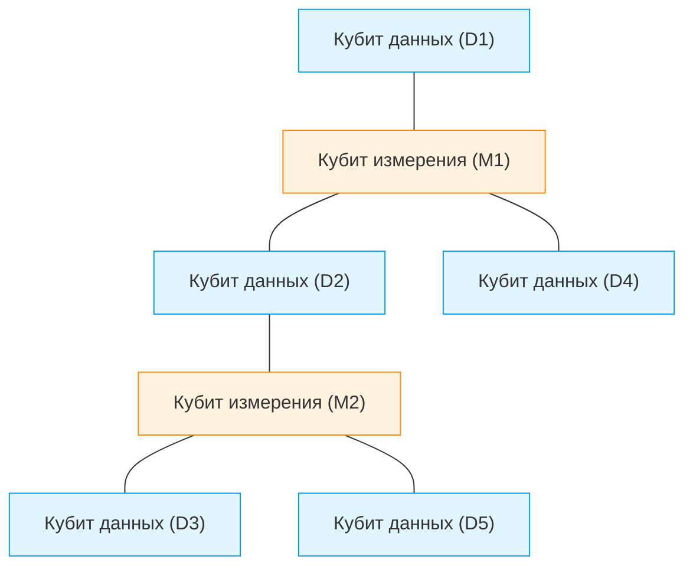
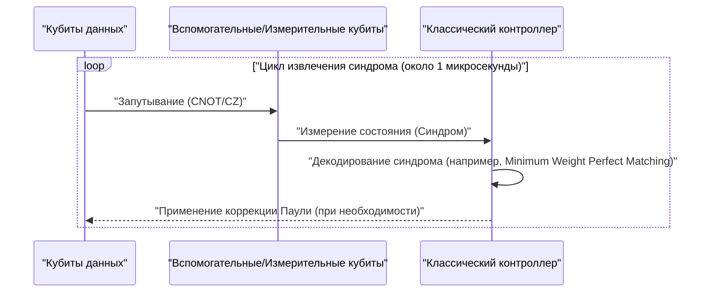
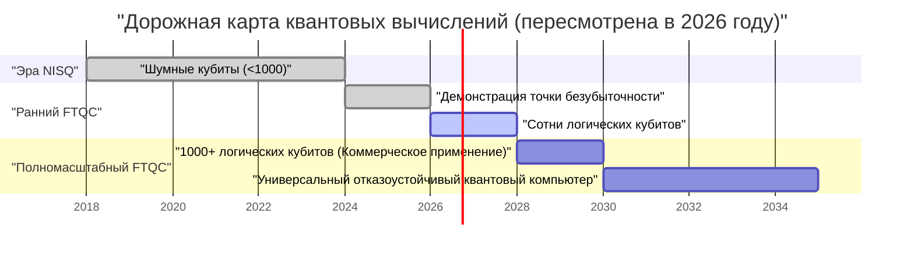

## 1. Введение: Насколько продвинулись квантовые компьютеры к 2026 году

По состоянию на 2026 год квантовые вычисления совершили решающий переход от "теоретической мечты" к "инженерной реальности". По мере того, как ограничения устройств **NISQ (Noisy Intermediate-Scale Quantum)**, которые были мейнстримом еще несколько лет назад, стали очевидны, исследовательские институты и технологические гиганты по всему миру взяли курс на реализацию "отказоустойчивых квантовых вычислений (FTQC: Fault-Tolerant Quantum Computing)".

В этой статье мы глубоко погрузимся в текущее состояние квантовых компьютеров с учетом последних прорывов 2026 года. В частности, мы подробно рассмотрим квантовую коррекцию ошибок (поверхностный код), разницу между физическими и логическими кубитами, прогресс в топологических квантовых вычислениях, а также передовые достижения в сверхпроводящих и ионных ловушках.

---

## 2. Основы квантовых состояний и точность (Fidelity)

Кубит (Qubit), базовая единица квантового компьютера, в отличие от классического бита (0 или 1), может находиться в состоянии суперпозиции 0 и 1 (Superposition). Состояние одиночного кубита представляется в виде вектора в гильбертовом пространстве следующим образом:

$$
|\psi\rangle = \alpha|0\rangle + \beta|1\rangle
$$

Где $\alpha$ и $\beta$ — комплексные амплитуды вероятности, удовлетворяющие следующему условию нормировки:

$$
|\alpha|^2 + |\beta|^2 = 1
$$

Чрезвычайно важным показателем при оценке производительности квантовых вычислений является **точность (Fidelity)**. Точность $F$ между идеальным квантовым состоянием $|\psi\rangle$ и фактической матрицей плотности $\rho$, которая деградировала из-за шума и стала смешанным состоянием, определяется следующим образом:

$$
F(\rho, |\psi\rangle) = \langle \psi | \rho | \psi \rangle
$$

В 2026 году точность двухкубитных вентилей (например, вентилей CNOT и CZ) в сверхпроводящих системах стала стабильно превышать барьер в **99,99%** (так называемые "четыре девятки"). Это значение значительно превышает порог коррекции ошибок поверхностного кода (около 99%) и является одним из крупнейших прорывов на пути к практическому применению.

---

## 3. Пределы эры NISQ и смена парадигмы к FTQC

Период со второй половины 2010-х до первой половины 2020-х годов был эрой NISQ (Noisy Intermediate-Scale Quantum) — устройств от нескольких десятков до сотен кубитов без коррекции ошибок. Однако у NISQ были четкие ограничения.

По мере увеличения глубины схемы (Depth) ошибки накапливаются экспоненциально, что делает невозможным получение значимых результатов вычислений. Общая вероятность успеха $P_{success}$ при глубине схемы $D$ затухает относительно точности одиночного вентиля $f$ и количества вентилей $N$ следующим образом:

$$
P_{success} \approx f^N
$$

Если $f = 0.99$ и применяется 1000 вентилей, то $0.99^{1000} \approx 4.3 \times 10^{-5}$, и результат почти полностью теряется в случайном шуме. По этой причине в 2026 году ресурсы сосредоточены на создании **логических кубитов (Logical Qubit)**, а не на прямом масштабировании алгоритмов NISQ (таких как VQE или QAOA).

---

## 4. Квантовая коррекция ошибок и логические кубиты: передовая линия поверхностного кода

Квантовая коррекция ошибок (QEC: Quantum Error Correction) — это технология, которая кодирует несколько "физических кубитов" для создания одного "логического кубита", обнаруживая и исправляя ошибки. В настоящее время наиболее перспективным считается **поверхностный код (Surface Code)**.

### 4.1 Структура поверхностного кода (Surface Code)

В поверхностном коде кубиты располагаются в виде двумерной решетки. Кубиты данных (хранящие фактическую информацию) и кубиты измерения (для измерения синдрома) располагаются в шахматном порядке.

Используя операторы стабилизатора $S_x$ и $S_z$, постоянно отслеживаются перевороты битов (X-ошибки) и перевороты фазы (Z-ошибки).

$$
S_x = \prod_{i \in \text{star}} X_i, \quad S_z = \prod_{j \in \text{plaquette}} Z_j
$$

Важным достижением 2026 года стало полное преодоление "точки безубыточности (Break-even point)". Иными словами, шум, устраняемый коррекцией ошибок, стал больше, чем шум, вызываемый дополнительными схемами коррекции, и срок жизни логических кубитов стал на несколько порядков превышать срок жизни физических кубитов.

### 4.2 Цикл квантовой коррекции ошибок

Коррекция ошибок работает как непрерывный цикл обратной связи.

В настоящее время создана технология, позволяющая выполнять это классическое декодирование (анализ синдрома) на FPGA или специализированных ASIC за наносекунды, и коррекция ошибок в реальном времени перешла на стадию практического применения.

---

## 5. Эволюция аппаратной архитектуры (Версия 2026 года)

В 2026 году квантовое аппаратное обеспечение развивается в основном по трем направлениям: "сверхпроводящие системы", "ионные ловушки" и "топологические системы".

### 5.1 Интеграция сверхпроводящих кубитов

Сверхпроводящие системы — область, в которой лидируют IBM и Google; в ней доминируют трансмонные (Transmon) кубиты, использующие джозефсоновские переходы. К 2026 году были созданы мегачипы, интегрирующие от нескольких тысяч до десяти тысяч физических кубитов на одном кристалле.

Особо следует отметить создание **межмодульных квантовых коммуникаций (Quantum Interconnects)**. Квантовая телепортация между чипами с использованием микроволновых фотонов была реализована на коммерческом уровне, что позволило обойти ограничения по размеру одного рефрижератора растворения.

### 5.2 Двумерное масштабирование ионных ловушек и оптические межсоединения

Системы ионных ловушек (возглавляемые Quantinuum, IonQ и др.) используют внутренние энергетические состояния ионов, левитирующих в вакууме, в качестве кубитов. По сравнению со сверхпроводящими системами их преимущество заключается в чрезвычайно длительном времени когерентности T1/T2 и возможности связи "каждый с каждым" (All-to-All Connectivity).

Прорывом 2026 года стал переход архитектуры QCCD (Quantum Charge Coupled Device) в двумерный формат и высокоскоростная генерация запутанности между несколькими ловушками с использованием фотонных межсоединений. Это кардинально улучшило "низкую скорость вентилей" и "масштабируемость", которые были слабыми местами ионных ловушек.

### 5.3 Топологические квантовые вычисления: контроль энионов

**Топологические квантовые вычисления**, долгое время считавшиеся теоретическими, в 2026 году наконец перешли на стадию экспериментальной проверки. Этот метод, продвигаемый Microsoft и другими, использует неабелевы энионы (Non-Abelian Anyons), называемые "нулевыми модами Майораны (Majorana Zero Modes)".

Квантовые вентили выполняются с помощью операции "плетения (Braiding)", которая меняет местами позиции энионных частиц.

$$
|\psi_{final}\rangle = B_{ij} |\psi_{initial}\rangle
$$

Где $B_{ij}$ — оператор плетения. Топологический подход по своей сути устойчив к шуму окружающей среды (аппаратный уровень отказоустойчивости), поскольку хранение информации зависит от топологии всего "узла", а не от локального состояния частиц. В 2026 году впервые в мире было подтверждено создание топологических логических кубитов с высокой точностью, что привлекло внимание как мощный короткий путь к FTQC.

---

## 6. Дорожная карта и перспективы практического применения

Чтобы квантовые компьютеры могли по-настоящему продемонстрировать **квантовое превосходство (Quantum Advantage)**, превосходя классические компьютеры (суперкомпьютеры) в таких областях, как "вычислительная химия", "материаловедение" и "финансовое моделирование", требуются тысячи логических кубитов.

### 6.1 Текущие проблемы и будущее
Крупнейшими проблемами по состоянию на 2026 год являются охлаждающая способность гигантских криостатов (рефрижераторов растворения) для поддержания сверхнизких температур, а также проводка (узкое место ввода/вывода), соединяющая устройства управления при комнатной температуре и криогенные квантовые чипы. В ответ на это ускоренными темпами разрабатываются чипы контроллеров CMOS (Cryo-CMOS), работающие в криогенных условиях.

### Заключение

2026 год войдет в историю квантовых компьютеров как "первый год масштабирования логических кубитов". Благодаря демонстрации алгоритмов коррекции ошибок, модуляризации аппаратного обеспечения и стремительному прогрессу топологического подхода, "день практического применения" больше не является далеким будущим, а стал конкретным рубежом ближайших нескольких лет. Для разработчиков квантовых алгоритмов и компаний сейчас самое время инвестировать в решение задач с помощью квантовых технологий.

---
*Эта статья написана на основе новейших исследовательских работ и отраслевых тенденций в области квантовых вычислений по состоянию на 2026 год.*
