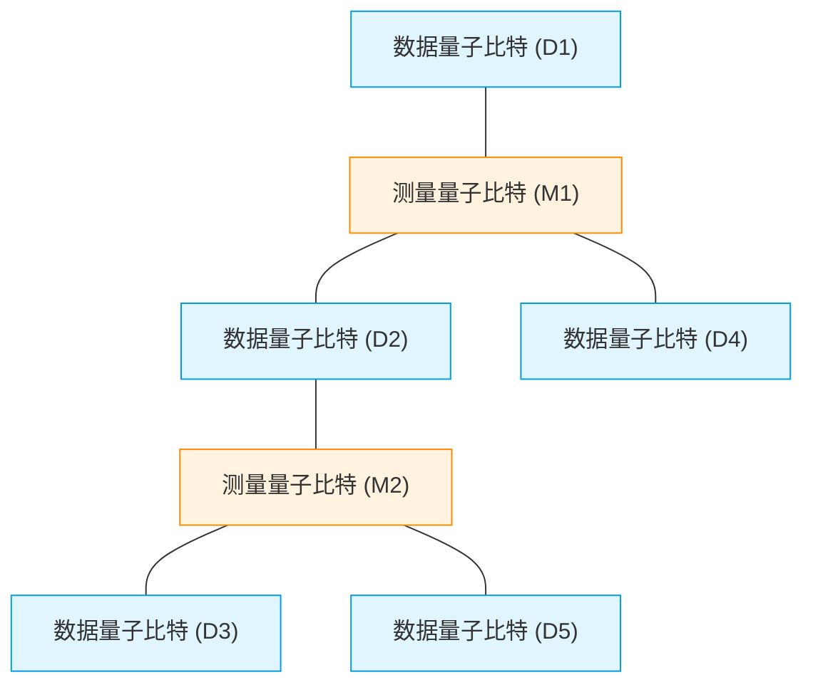
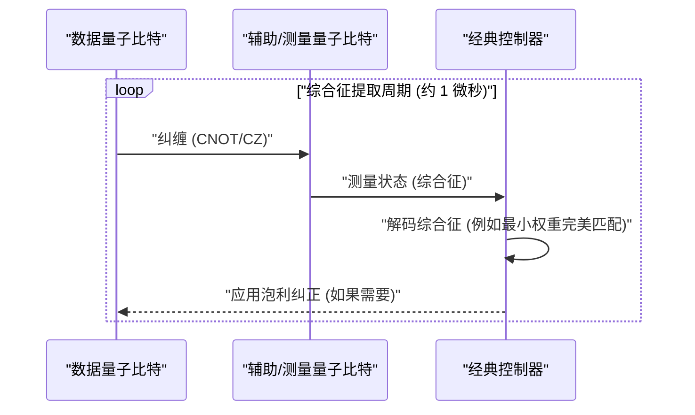
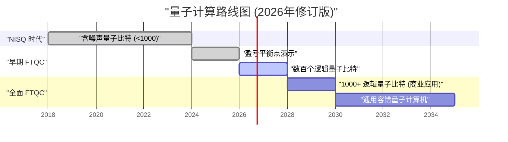

## 1. 引言：2026年，量子计算机发展到了什么程度

截至2026年，量子计算已经完成了从昔日“理论上的梦想”到“工程上的现实”的决定性转变。随着几年前还是主流的**NISQ（Noisy Intermediate-Scale Quantum，含噪声中等规模量子）**设备的局限性变得明显，世界各地的研究机构和科技巨头纷纷转向实现“容错量子计算（FTQC: Fault-Tolerant Quantum Computing）”。

本文将结合2026年的最新突破，深入探讨量子计算机的现状。特别是，将详细讲解量子纠错（表面码）、物理量子比特与逻辑量子比特的区别、拓扑量子计算的进展，以及超导和离子阱方式的最前沿。

---

## 2. 量子态基础与保真度（Fidelity）

量子计算机的基本单位是量子比特（Qubit），与经典比特（0或1）不同，它可以处于0和1的叠加态（Superposition）。单个量子比特的状态可以表示为希尔伯特空间上的向量，如下所示：

$$
|\psi\rangle = \alpha|0\rangle + \beta|1\rangle
$$

这里，$\alpha$ 和 $\beta$ 是复数概率幅，并满足以下归一化条件：

$$
|\alpha|^2 + |\beta|^2 = 1
$$

在衡量量子计算性能时，一个极其重要的指标是**保真度（Fidelity）**。理想量子态 $|\psi\rangle$ 与因噪声退化而变成混合态的实际密度矩阵 $\rho$ 之间的保真度 $F$ 定义如下：

$$
F(\rho, |\psi\rangle) = \langle \psi | \rho | \psi \rangle
$$

到2026年，双量子比特门（例如：CNOT门和CZ门）的保真度在超导方式下已经能够稳定突破**99.99%**的壁垒（即所谓的“4个9”）。这一数值大幅超过了表面码纠错的阈值（约99%），是迈向实用化的最大突破之一。

---

## 3. NISQ时代的局限与向FTQC的范式转变

2010年代后半期到2020年代前半期是NISQ（Noisy Intermediate-Scale Quantum）时代，即拥有几十到几百个量子比特且不具备纠错能力的设备。然而，NISQ存在明显的局限性。

随着电路深度（Depth）的增加，错误会呈指数级积累，导致无法获得有意义的计算结果。电路深度 $D$ 下的整体成功概率 $P_{success}$ 随单门保真度 $f$ 和门数量 $N$ 衰减如下：

$$
P_{success} \approx f^N
$$

如果 $f = 0.99$ 并应用1000个门，那么 $0.99^{1000} \approx 4.3 \times 10^{-5}$，结果将几乎完全被随机噪声淹没。因此，在2026年，相较于直接扩展NISQ算法（如VQE或QAOA等），资源更多地集中在生成**逻辑量子比特（Logical Qubit）**上。

---

## 4. 量子纠错与逻辑量子比特：表面码的最前沿

量子纠错（QEC: Quantum Error Correction）是一种通过编码多个“物理量子比特”来创建一个“逻辑量子比特”，从而检测并纠正错误的技术。目前最被看好的是**表面码（Surface Code）**。

### 4.1 表面码（Surface Code）的结构

在表面码中，量子比特被排列成二维网格状。数据量子比特（保存实际信息）和测量量子比特（用于综合征测量）像棋盘格一样交错排列。

使用稳定子算符 $S_x$ 和 $S_z$ 不断监控比特翻转（X错误）和相位翻转（Z错误）。

$$
S_x = \prod_{i \in \text{star}} X_i, \quad S_z = \prod_{j \in \text{plaquette}} Z_j
$$

2026年的重大进展是完全突破了“盈亏平衡点（Break-even point）”。也就是说，通过纠错消除的噪声大于执行纠错所需的额外电路引起的噪声，逻辑量子比特的寿命开始比物理量子比特的寿命高出好几个数量级。

### 4.2 量子纠错循环

纠错作为一个持续的反馈回路运行。

目前，利用FPGA或专用ASIC在纳秒级别执行这种经典解码处理（综合征分析）的技术已经成熟，实时纠错已进入实用阶段。

---

## 5. 硬件架构的演进（2026年版）

2026年的量子硬件主要在“超导方式”、“离子阱方式”和“拓扑方式”这三个方向上演进。

### 5.1 超导量子比特的集成化

超导方式是IBM和Google主导的领域，主要使用基于约瑟夫森结的Transmon量子比特。到2026年，实现了在单芯片上集成数千到一万个物理量子比特的超大型芯片。

值得一提的是**模块间量子通信（Quantum Interconnects）**的确立。利用微波光子实现芯片间的量子隐形传态已达到商业应用水平，从而能够避开单一稀释制冷机尺寸的限制。

### 5.2 离子阱的二维扩展与光互连

在离子阱方式（由Quantinuum和IonQ等主导）中，使用悬浮在真空中的离子的内部能态作为量子比特。与超导方式相比，其优势在于T1/T2相干时间极长，并且支持全连接（All-to-All Connectivity）。

2026年的突破在于QCCD（Quantum Charge Coupled Device）架构的二维化，以及使用光子互连在多阱之间生成高速纠缠。这使得离子阱曾存在的“门操作速度慢”和“可扩展性”等弱点得到了极大的改善。

### 5.3 拓扑量子计算：任意子的控制

长期以来被认为是理论存在的**拓扑量子计算**在2026年终于进入了实验验证阶段。由Microsoft等公司推动的这种方式，使用被称为“马约拉纳零模（Majorana Zero Modes）”的非阿贝尔任意子（Non-Abelian Anyons）。

通过交换任意子粒子位置的“编织（Braiding）”操作来执行量子门。

$$
|\psi_{final}\rangle = B_{ij} |\psi_{initial}\rangle
$$

这里 $B_{ij}$ 是编织算符。拓扑方式的信息存储不依赖于粒子的局域状态，而是依赖于整体“结”的拓扑结构，因此它本质上对环境噪声具有免疫力（硬件级别的容错能力）。2026年世界上首次确认了高保真度拓扑逻辑量子比特的生成，作为通向FTQC的强大捷径而备受瞩目。

---

## 6. 面向实用化的路线图与展望

要让量子计算机在“化学计算”、“材料科学”、“金融建模”等领域真正发挥出压倒经典计算机（超级计算机）的**量子霸权（Quantum Advantage，也称量子优势）**，需要数千个逻辑量子比特。

### 6.1 当前面临的挑战与未来
截至2026年，最大的挑战在于维持极低温的巨大低温恒温器（稀释制冷机）的冷却能力，以及连接室温控制设备与极低温量子芯片的布线（I/O瓶颈）。针对这一点，能够在极低温环境下运行的CMOS（Cryo-CMOS）控制芯片的开发正在全速推进。

### 结论

2026年将在量子计算机的历史上被记载为“逻辑量子比特扩展元年”。通过纠错算法的验证、硬件的模块化以及拓扑方法的快速进展，“实用化的日子”已不再是遥远的未来，而是可以预见为未来几年内的具体里程碑。对于量子算法开发者和企业而言，现在正是开始全面投资于量子原生问题解决方案的绝佳时机。

---
*本文基于截至2026年最新的量子计算研究论文及行业动态撰写。*
