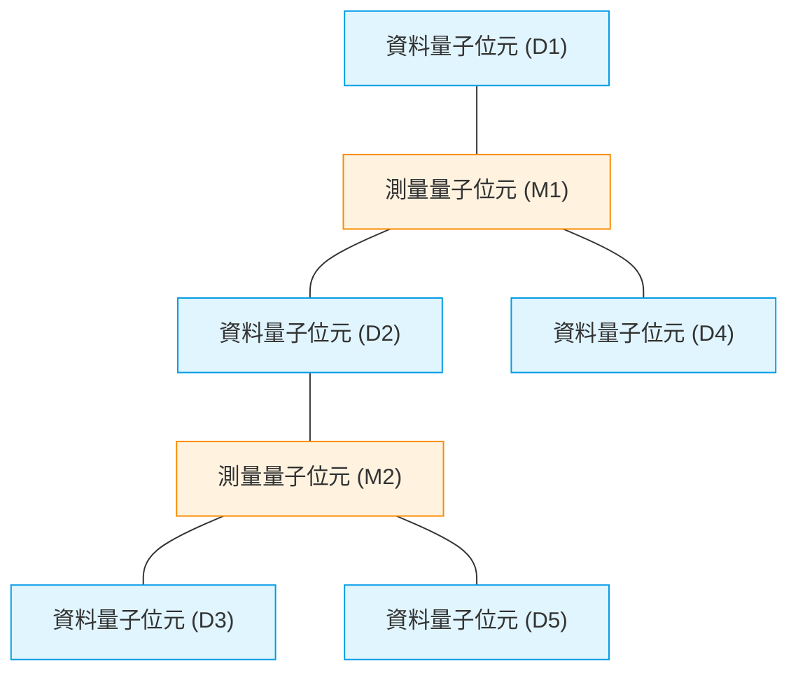
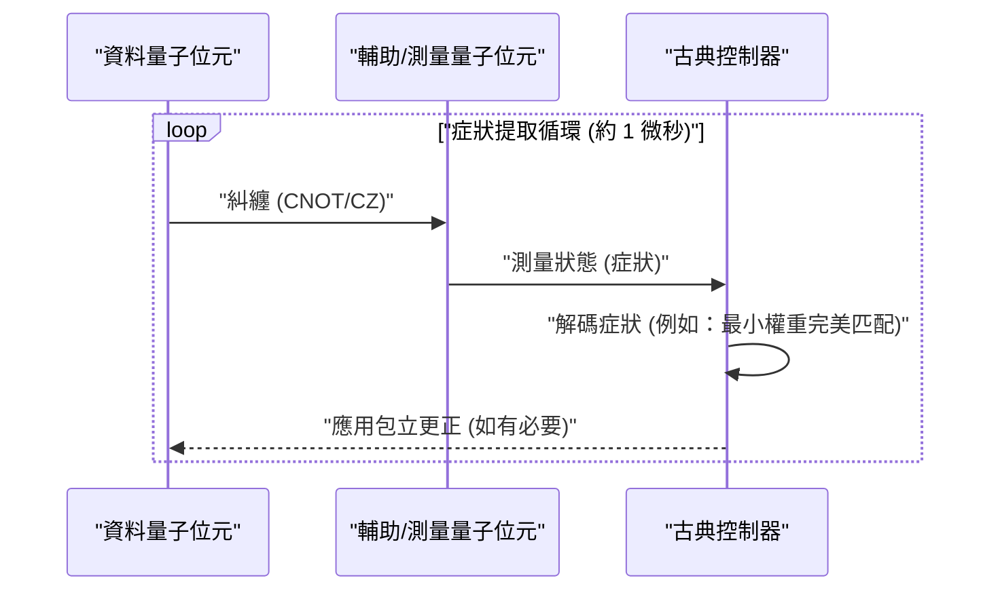
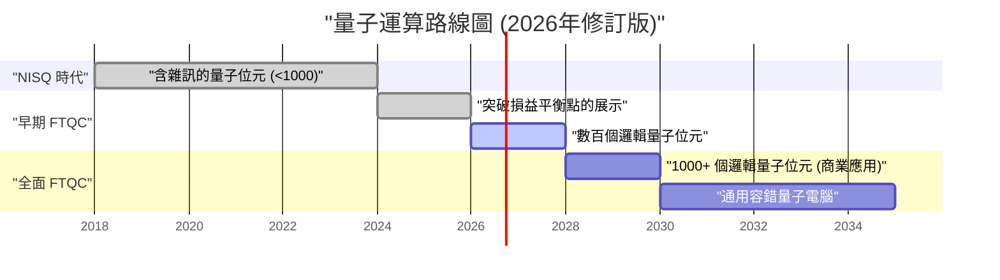

## 1. 前言：2026年，量子電腦發展到了什麼程度

2026年現在，量子運算已經從過去的「理論上的夢想」經歷了決定性的轉變，成為了「工程上的現實」。隨著幾年前仍是主流的**NISQ（Noisy Intermediate-Scale Quantum，雜訊中型量子）**裝置的極限變得明確，世界各地的研究機構與科技巨頭已將發展方向轉向實現「容錯量子運算（FTQC: Fault-Tolerant Quantum Computing）」。

在本文中，我們將結合2026年的最新突破，深入探討量子電腦的現狀。特別是將詳細解說量子錯誤更正（表面碼）、物理量子位元與邏輯量子位元的差異、拓撲量子運算的進展，以及超導與離子阱方式的最前線。

---

## 2. 量子態的基礎與保真度（Fidelity）

作為量子電腦基本單位的量子位元（Qubit），不同於古典位元（0或1），可以呈現0與1的疊加態（Superposition）。單一量子位元的狀態在希爾伯特空間中以向量表示如下：

$$
|\psi\rangle = \alpha|0\rangle + \beta|1\rangle
$$

這裡，$\alpha$ 與 $\beta$ 為複數的機率幅，並滿足以下的歸一化條件：

$$
|\alpha|^2 + |\beta|^2 = 1
$$

在衡量量子運算效能時，一個極為重要的指標是**保真度（Fidelity）**。理想的量子態 $|\psi\rangle$ 與受到雜訊退化而成為混合態的實際密度矩陣 $\rho$ 之間的保真度 $F$ 定義如下：

$$
F(\rho, |\psi\rangle) = \langle \psi | \rho | \psi \rangle
$$

在2026年的現在，2量子位元閘（例如：CNOT閘或CZ閘）的保真度，在超導方式中已能穩定突破**99.99%**的障壁（即所謂的「四個九」）。這大幅超越了表面碼進行錯誤更正的閾值（約99%），是邁向實用化的最大突破之一。

---

## 3. NISQ時代的極限與向FTQC的典範轉移

從2010年代後半到2020年代前半，是屬於不具備錯誤更正、擁有數十至數百個量子位元裝置的NISQ（Noisy Intermediate-Scale Quantum）時代。然而，NISQ有著明確的極限。

隨著電路深度（Depth）增加，錯誤會呈指數級累積，使得獲得有意義的運算結果變得不可能。在電路深度 $D$ 下的整體成功機率 $P_{success}$，相對於單一閘的保真度 $f$ 與閘的數量 $N$，會以下列方式衰減：

$$
P_{success} \approx f^N
$$

如果 $f = 0.99$ 且套用了1000個閘，則 $0.99^{1000} \approx 4.3 \times 10^{-5}$，結果將幾乎被隨機雜訊所掩蓋。因此，在2026年，比起直接擴展NISQ演算法（如VQE或QAOA），資源更集中於**邏輯量子位元（Logical Qubit）**的生成。

---

## 4. 量子錯誤更正與邏輯量子位元：表面碼的最前線

量子錯誤更正（QEC: Quantum Error Correction）是一種將多個「物理量子位元」編碼以創造出1個「邏輯量子位元」，並檢測與更正錯誤的技術。目前最被看好的是**表面碼（Surface Code）**。

### 4.1 表面碼（Surface Code）的結構

在表面碼中，量子位元被配置為二維的網格狀。資料量子位元（保存實際資訊）與測量量子位元（用於症狀測量）如棋盤格般排列。

利用穩定子算符 $S_x$ 與 $S_z$，持續監控位元反轉（X錯誤）與相位反轉（Z錯誤）。

$$
S_x = \prod_{i \in \text{star}} X_i, \quad S_z = \prod_{j \in \text{plaquette}} Z_j
$$

2026年的重大進展，是完全突破了「損益平衡點（Break-even point）」。也就是說，因執行錯誤更正而消除的雜訊，已大於額外電路所引入的雜訊，使得邏輯量子位元的壽命比物理量子位元的壽命高出了好幾個數量級。

### 4.2 量子錯誤更正的循環

錯誤更正作為一個持續的回饋迴圈運作。

現在，使用FPGA或專用ASIC以奈秒為單位執行這種古典解碼處理（症狀分析）的技術已經確立，即時錯誤更正已進入實用階段。

---

## 5. 硬體架構的進化（2026年版）

2026年的量子硬體主要在「超導方式」、「離子阱方式」及「拓撲方式」三個軸向上持續進化。

### 5.1 超導量子位元的整合

超導方式是由IBM與Google領軍的領域，主要使用以約瑟夫森接面（Josephson Junction）構成的傳輸子（Transmon）量子位元。2026年，在單一晶片上整合數千至一萬個物理量子位元的巨型晶片已經實現。

值得特別提及的是**模組間量子通訊（Quantum Interconnects）**的確立。使用微波光子進行晶片間的量子遙傳已達商業級實作，使得繞過單一稀釋冷凍機的尺寸限制成為可能。

### 5.2 離子阱的二維擴展與光互連

離子阱方式（由Quantinuum與IonQ等主導）使用懸浮在真空中的離子的內部能量狀態作為量子位元。與超導方式相比，其具有T1/T2同調時間極長，且可實現全連接（All-to-All Connectivity）的優點。

2026年的突破在於QCCD（Quantum Charge Coupled Device）架構的二維化，以及利用光子互連（Photonic Interconnects）在多個阱之間快速生成糾纏。這大幅改善了過去離子阱在「閘速度緩慢」與「擴展性」上的弱點。

### 5.3 拓撲量子運算：任意子的控制

長期以來被認為僅存在於理論上的**拓撲量子運算**，終於在2026年進入了實驗證實的階段。由Microsoft等推動的此種方式，使用了被稱為「馬約拉納零模（Majorana Zero Modes）」的非阿貝爾任意子（Non-Abelian Anyons）。

透過交換任意子粒子位置的「編織（Braiding）」操作來執行量子閘。

$$
|\psi_{final}\rangle = B_{ij} |\psi_{initial}\rangle
$$

這裡 $B_{ij}$ 為編織算符。拓撲方式由於資訊的保存不依賴於粒子的局部狀態，而是依賴整體「紐結」的拓撲結構，因此在本質上對環境雜訊具有抵抗力（硬體級別的容錯性）。2026年，世界上首次確認了高保真度拓撲邏輯量子位元的生成，作為通往FTQC的強大捷徑而備受矚目。

---

## 6. 邁向實用化的路線圖與展望

為了讓量子電腦在「化學計算」、「材料科學」、「金融建模」等領域中，真正展現出壓倒古典電腦（超級電腦）的**量子霸權（Quantum Advantage）**，需要數千個邏輯量子位元。

### 6.1 目前面臨的挑戰與未來
2026年最大的挑戰，在於維持極低溫的巨大低溫恆溫器（稀釋冷凍機）的冷卻能力，以及連接室溫控制裝置與極低溫量子晶片的線路（I/O瓶頸）。為了解決這個問題，能在極低溫環境下運作的CMOS（Cryo-CMOS）控制器晶片的開發正以極快的速度推進。

### 結論

2026年將被記錄為量子電腦歷史上的「邏輯量子位元擴展元年」。藉由錯誤更正演算法的證實、硬體的模組化，以及拓撲方法的快速進展，「實用化的日子」已不再是遙遠未來的空談，而是可以在未來數年內預見的具體里程碑。對於量子演算法的開發者與企業而言，現在正是正式投資於量子原生解決方案的最佳時機。

---
*本文是基於2026年最新的量子運算研究論文與業界動態所撰寫。*
