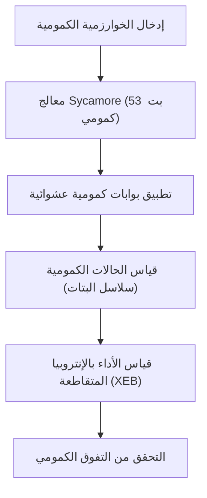
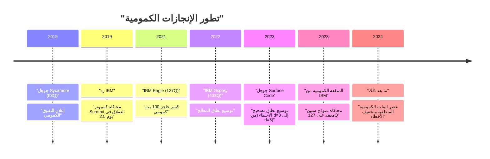
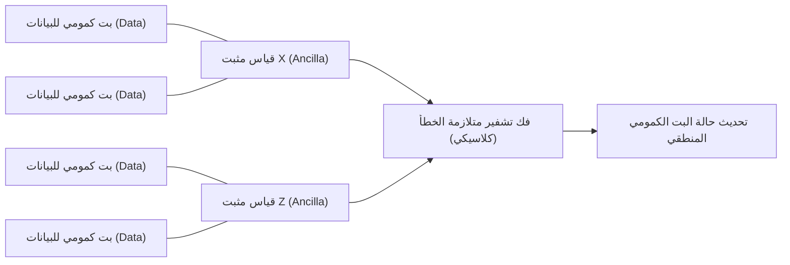

## 1. مقدمة: فجر الحوسبة الكمومية و"التفوق الكمومي"

تتمتع الحوسبة الكمومية بالقدرة على حل المشكلات المعقدة التي لا تستطيع أجهزة الكمبيوتر الكلاسيكية (مثل أجهزة الكمبيوتر الشخصية وأجهزة الكمبيوتر العملاقة التي نستخدمها يوميًا) حلها في وقت واقعي، وذلك من خلال تطبيق ميكانيكا الكم - المبدأ الأساسي للفيزياء - في معالجة المعلومات. لطالما كان هذا المجال نظريًا في المقام الأول، ولكن في السنوات الأخيرة، اشتدت المنافسة نحو التطبيق العملي بفضل التقدم السريع في الأجهزة.

ومن بين أبرز المصطلحات التي لفتت الانتباه في هذا السياق هو "التفوق الكمومي" (Quantum Supremacy). يشير هذا إلى اللحظة التي يظهر فيها الكمبيوتر الكمومي قدرة حسابية تتفوق بشكل ساحق على الكمبيوتر الكلاسيكي في مهمة حسابية محددة. في هذا المقال، سنشرح، مع التعمق التقني والرياضي، التعريف الدقيق للتفوق الكمومي، وتفاصيل تجربة معالج "Sycamore" من جوجل الذي أُعلن عن تحقيقه هذا الإنجاز لأول مرة في العالم عام 2019، وردود IBM ونهجها الخاص حيال ذلك، بالإضافة إلى أحدث خارطة طريق لتجاوز أكبر عقبة أمام الاستخدام العملي الحقيقي: "تصحيح الأخطاء الكمومية" (QEC) و"الحوسبة الكمومية المتسامحة مع الأخطاء" (FTQC).

---

## 2. الخلفية النظرية: أساسيات الحوسبة الكمومية وفئات التعقيد

لفهم التفوق الكمومي، من الضروري أولاً فهم الأساس الرياضي للحوسبة الكمومية ومكانتها في نظرية التعقيد الحسابي.

### البتات الكمومية والتراكب
بينما أصغر وحدة للمعلومات في الكمبيوتر الكلاسيكي هي البت (0 أو 1)، يستخدم الكمبيوتر الكمومي البت الكمومي (Qubit). يتم تمثيل حالة البت الكمومي الواحد $|\psi\rangle$ كتركيبة خطية مركبة للحالات الأساسية $|0\rangle$ و $|1\rangle$.

$$
|\psi\rangle = \alpha|0\rangle + \beta|1\rangle
$$

حيث إن $\alpha, \beta \in \mathbb{C}$، ويحققان شرط المعايرة $|\alpha|^2 + |\beta|^2 = 1$. تُعرف هذه الخاصية باسم "التراكب" (Superposition).

### التشابك (Entanglement) وحاصل الضرب الموتّر (Tensor Product)
عند وجود عدة بتات كمومية، يتم تمثيل حالة النظام بأكمله كحاصل ضرب موتّر لفضاءات الحالة للبتات الكمومية الفردية. نظام يتكون من $n$ بت كمومي يصبح متجهًا على فضاء هيلبرت ذي أبعاد $2^n$ ويُرمز له بـ $\mathcal{H}^{\otimes n}$.

$$
|\Psi\rangle = \sum_{x \in \{0, 1\}^n} c_x |x\rangle
$$

حيث إن $\sum |c_x|^2 = 1$. تسمى الحالة التي لا تكون فيها البتات الكمومية مستقلة عن بعضها وتعتمد حالة أحدها على الآخر بـ "التشابك الكمومي" (Quantum Entanglement). وبفضل ذلك، يمتلك الكمبيوتر الكمومي الإمكانية لمعالجة فضاء حالة شاسع يتزايد أُسّياً في نفس الوقت.

### التعريف النظري لتعقيد التفوق الكمومي
في نظرية التعقيد الحسابي، تُعرف فئة المشكلات التي يمكن للكمبيوتر الكلاسيكي حلها بكفاءة (في وقت كثير الحدود) باسم **BPP** (وقت احتمالي كثير الحدود ذو خطأ مقيد). من ناحية أخرى، تُعرف فئة المشكلات التي يمكن للكمبيوتر الكمومي حلها بكفاءة باسم **BQP** (وقت كمومي كثير الحدود ذو خطأ مقيد).

إثبات التفوق الكمومي يعني "تنفيذ مهمة معينة على جهاز كمومي فعلي تكون ضمن BQP ولكنها ليست ضمن BPP (أو يُرجح بشدة ألا تكون كذلك)، وتجاوز محاكاة الكمبيوتر العملاق الكلاسيكي من حيث الوقت والموارد". ويمكن اعتبار ذلك محاولة تاريخية لدحض أطروحة تشيرش-تورينج الموسعة ("يمكن محاكاة جميع نماذج الحوسبة الممكنة فيزيائيًا بواسطة آلة تورينج احتمالية في وقت كثير الحدود") من خلال تجربة فيزيائية.

---

## 3. عام 2019: إثبات التفوق الكمومي بواسطة جوجل

في أكتوبر 2019، أعلن فريق Google Quantum AI في المجلة العلمية "Nature" عن تحقيق التفوق الكمومي باستخدام معالج فائق التوصيل مكون من 53 بتًا كموميًا يُدعى "Sycamore".

### بنية معالج Sycamore
يتكون معالج Sycamore من 54 بتًا كموميًا فائق التوصيل من نوع Transmon مرتبة في شبكة ثنائية الأبعاد (استُخدم منها 53 بتًا لأن أحدها كان معطلاً في التجربة). وُضعت قارنات قابلة للضبط (Tunable Coupler) بين البتات الكمومية المتجاورة، مما حقق بوابات ثنائية البت الكمومي عالية السرعة والدقة (مزيج بين بوابة iSWAP وبوابة Z المتحكم بها).

### أخذ عينات الدوائر الكمومية العشوائية (RCS)
المهمة التي اختارتها جوجل كانت "أخذ عينات الدوائر الكمومية العشوائية". تتضمن هذه المهمة تطبيق بوابات بت كمومي واحد وبوابتين بشكل عشوائي على مدى دورات متعددة (بعمق $m$)، وأخذ عينات من التوزيع الاحتمالي لسلاسل البتات الناتجة عن قياس الحالة النهائية.

احتمال خروج سلسلة البتات $x$ من دائرة كمومية عشوائية مثالية (خالية من الضوضاء) ليس توزيعًا منتظمًا، بل يُظهر نمطًا يشبه أنماط التداخل يُعرف باسم توزيع بورتر-توماس (Porter-Thomas distribution). لأخذ عينات من هذا التوزيع باستخدام كمبيوتر كلاسيكي، يُتطلب محاكاة متجه الحالة بالكامل، ويزداد التعقيد الحسابي بشكل أُسّي بالنسبة لعدد البتات الكمومية $n$ وعمق الدائرة $m$.

### تقييم الدقة (Fidelity): قياس الأداء بالإنتروبيا المتقاطعة الخطية (XEB)
لإثبات أن نتائج التجربة ليست مجرد ضوضاء، بل هي نتيجة حساب كمومي فعلي، استخدمت جوجل قياس الأداء بالإنتروبيا المتقاطعة الخطية (XEB). يتم حساب الاحتمال المثالي للدائرة $P(x_i)$ لسلاسل البتات $x_i$ التي تم الحصول عليها في التجربة باستخدام كمبيوتر كلاسيكي، وتُحسب الدقة $\mathcal{F}_{\text{XEB}}$ باستخدام المعادلة التالية:

$$
\mathcal{F}_{\text{XEB}} = 2^n \langle P(x_i) \rangle_{i} - 1
$$

إذا كانت $\mathcal{F}_{\text{XEB}}$ تساوي 0، فهذا يعني ضوضاء كاملة، وإذا كانت 1، فهذا يعني معالج كمومي مثالي خالٍ من الضوضاء. حقق معالج Sycamore دقة $\mathcal{F}_{\text{XEB}} \approx 0.002$ (0.2%) في دائرة بعمق 20. قد تبدو هذه القيمة منخفضة للوهلة الأولى، لكنها قيمة أكبر من الصفر وذات دلالة إحصائية، وتُعد إنجازًا مذهلاً في التحكم في فضاء حالة بحجم $2^{53} \approx 9 \times 10^{15}$.

تمت نمذجة معدل الخطأ الإجمالي تقريبًا كحاصل ضرب لأخطاء البوابات الفردية وأخطاء القياس وغيرها:

$$
\mathcal{F} \approx (1 - e_1)^{N_1}(1 - e_2)^{N_2} \cdots \approx \prod_{g \in 1Q} (1 - e_g) \prod_{g \in 2Q} (1 - e_g) \prod_{q} (1 - e_{RO})
$$

(ملاحظة: $e_g$ يمثل خطأ البوابة، و $e_{RO}$ يمثل خطأ القياس)

ادعت جوجل أن محاكاة هذه الدائرة على الكمبيوتر العملاق الكلاسيكي (Summit) ستستغرق حوالي 10,000 عام. في المقابل، أكمل Sycamore أخذ العينات في 200 ثانية فقط.

---

## 4. رد IBM: من "التفوق" إلى "المنفعة (Utility)"

أحدث إعلان جوجل صدمة في جميع أنحاء العالم، لكن IBM، التي طورت أكبر كمبيوتر عملاق في العالم آنذاك "Summit" والتي تقود بنفسها تطوير أجهزة الكمبيوتر الكمومية، نشرت على الفور ورقة بحثية تدحض هذا الادعاء.

### تحسين المحاكاة الكلاسيكية باستخدام انكماش الشبكات الموتّرة
كان جوهر رد IBM هو أن "تحسين الخوارزميات والموارد على جانب الكمبيوتر الكلاسيكي كان غير كافٍ". فقد استند تقدير جوجل البالغ 10,000 عام على محاكي متجه الحالة الذي يحسب التطور الزمني لمعادلة شرودنغر كما هي، لكن IBM أشارت إلى أنه باستخدام تقنية تُسمى "الشبكات الموتّرة" (Tensor Network)، يمكن تقليص وقت المحاكاة بشكل كبير.

في الشبكات الموتّرة، يتم التعبير عن عمليات البوابات في الدائرة الكمومية كعمليات على مصفوفات متعددة الأبعاد (موتّرات)، ويتم تحسين ترتيب "انكماش" (Contraction) الشبكة. وعلاوة على ذلك، ادعت IBM أنه بالاستفادة الكاملة من سعة التخزين الهائلة لجهاز Summit البالغة 250 بيتابايت (من خلال هيكلة الأقراص والذاكرة)، من الممكن الاحتفاظ بمتجه الحالة بالكامل وإجراء محاكاة أكثر دقة في "يومين ونصف" فقط.

### الميزة الكمومية (Quantum Advantage) والمنفعة الكمومية (Quantum Utility)
نتيجة لهذا النقاش، انتقل التوجه العام في الصناعة من التركيز فقط على "تنفيذ مهام مصطنعة مستحيلة كلاسيكيًا (التفوق - Supremacy)"، إلى مرحلة "إظهار تفوق جوهري على المقاربات الكلاسيكية في المشكلات الواقعية المفيدة (الميزة الكمومية - Quantum Advantage)"، وأخيراً إلى "عمل الكمبيوتر الكمومي كأداة جديدة للاكتشافات العلمية (المنفعة الكمومية - Quantum Utility)".

تتجنب IBM نفسها استخدام كلمة "التفوق"، وقد اقترحت مقاييس أداء شاملة للمعالجات الكمومية مثل "الحجم الكمومي" (Quantum Volume) و "CLOPS" (عمليات طبقة الدائرة في الثانية)، مع التركيز في تطويرها على التوازن بين حجم الأجهزة وجودتها.

---

## 5. الجبهة التالية: تخفيف الأخطاء (Error Mitigation) وتصحيح الأخطاء الكمومية (QEC)

تُعرف أجهزة الكمبيوتر الكمومية الحالية باسم "NISQ" (الأجهزة الكمومية الصاخبة متوسطة النطاق)، وهي عُرضة لتأثير الضوضاء (الأخطاء الناتجة عن التفاعل مع البيئة الخارجية أو التحكم غير المثالي). وعند إجراء حسابات طويلة، تضيع النتائج وسط هذه الضوضاء. للتغلب على هذه المشكلة، هناك نهجان رئيسيان: "تخفيف الأخطاء" (Error Mitigation) و"تصحيح الأخطاء الكمومية" (Quantum Error Correction).

### تخفيف الأخطاء (Error Mitigation)
تخفيف الأخطاء هو أسلوب لإزالة تأثير الضوضاء من القيمة المتوقعة لنتائج الحساب من خلال المعالجة اللاحقة الكلاسيكية دون تعديل الأجهزة الكمومية. في عام 2023، استخدمت IBM معالج "Eagle" المكون من 127 بتًا كموميًا جنبًا إلى جنب مع تقنيات تخفيف الأخطاء مثل "الاستقراء الصفري للضوضاء" (ZNE)، ونجحت في تحقيق دقة تجاوزت أحدث طرق الشبكات الموتّرة التقريبية في محاكاة التطور الزمني لنموذج إيزينج المعقد، مما يثبت "المنفعة الكمومية" (Quantum Utility).

### تصحيح الأخطاء الكمومية (QEC) والبتات الكمومية المنطقية
ومع ذلك، من أجل تنفيذ أي خوارزمية معقدة في نهاية المطاف (مثل خوارزمية شور لتحليل العوامل أو الحسابات الكيميائية الكمومية المعقدة)، فإن تخفيف الأخطاء وحده لا يكفي، ويصبح "تصحيح الأخطاء الكمومية" (QEC)، الذي يكتشف الأخطاء ويصححها ديناميكيًا، أمرًا لا غنى عنه.

النهج السائد في QEC هو ما يُعرف بـ "الرمز السطحي" (Surface Code). يتمثل هذا النهج في ترتيب عدة بتات كمومية فيزيائية (بتات البيانات) في شبكة ثنائية الأبعاد، مع وضع بتات كمومية للقياس (بتات أنسيلا) بينها لإجراء فحوصات التكافؤ (Parity checks) المعروفة باسم "المثبتات" (Stabilizers) بشكل مستمر.

#### نظرية العتبة (Threshold Theorem) والمسافة $d$
يوجد في تصحيح الأخطاء الكمومية ما يُعرف بـ "نظرية العتبة". إذا كان معدل الخطأ في البت الكمومي الفيزيائي $p$ أقل من عتبة معينة $p_{th}$ (حوالي 1% في حالة الرمز السطحي)، فإنه من خلال زيادة مسافة الرمز (Distance) $d$ (أي تخصيص المزيد من البتات الفيزيائية لبت منطقي واحد)، يمكن خفض معدل الخطأ المنطقي $p_L$ بشكل أُسّي.

يتم التعبير عن المعادلة التقريبية لمعدل الخطأ المنطقي على النحو التالي:

$$
p_L \approx \Lambda \left( \frac{p}{p_{th}} \right)^{\frac{d+1}{2}}
$$

حيث إن $\Lambda$ هو مقدار ثابت. إذا كان $p < p_{th}$، فكلما زادت $d$، قل $p_L$. ولكن، في حالة $p > p_{th}$، فإن زيادة عدد البتات الكمومية الفيزيائية ستؤدي إلى تراكم الضوضاء وتفاقم معدل الخطأ المنطقي.

#### إنجاز جوجل عام 2023: إثبات تقليل الخطأ من خلال زيادة المسافة
في فبراير 2023، نشرت جوجل ورقة بحثية بارزة في مجلة "Nature". فقد أثبتوا لأول مرة في العالم، باستخدام الجيل الثالث من معالج Sycamore، أنه عند زيادة مسافة الرمز السطحي من $d=3$ (باستخدام 17 بتًا فيزيائيًا) إلى $d=5$ (باستخدام 49 بتًا فيزيائيًا)، ينخفض معدل الخطأ المنطقي بشكل طفيف من 3.028% إلى 2.914%.

وهذا يعني الدخول في المنطقة التي يكون فيها $p < p_{th}$، ويدل على اكتمال أهم إثبات للمفهوم (Proof of Concept) نحو تحقيق FTQC، حيث أن زيادة عدد البتات الفيزيائية ستؤدي حتمًا إلى تحسين الأداء.

---

## 6. خارطة الطريق والتطلعات نحو الحوسبة الكمومية المتسامحة مع الأخطاء (FTQC)

تخوض كل من جوجل وIBM، بالرغم من تبنيهما لبنى هندسية ومقاربات مختلفة، منافسة تطويرية شرسة نحو هدفهما النهائي المتمثل في الحوسبة الكمومية المتسامحة مع الأخطاء (FTQC).

### مقاربة IBM: الوحدات النمطية (Modularization) وشبكات Heavy-Hex
تركز IBM، بالتوازي مع خفض معدلات الخطأ بشكل جذري، على توسيع نطاق معالجاتها. فبينما تتحدى حدود الشريحة الواحدة من خلال معالجات "Eagle (127Q)" و"Osprey (433Q)" و"Condor (1121Q)"، أعلنت أيضًا عن بنية معمارية معتمدة على الوحدات النمطية تُسمى "Quantum System Two". بالإضافة إلى ذلك، تعتمد في طوبولوجيا ربط البتات الكمومية على بنية شبكية تُدعى "Heavy-Hex"، والتي تقلل من التداخل غير المرغوب فيه وتزيد من الاستقرار. استراتيجية IBM هي نهج هجين يسعى إلى تحقيق المنفعة من خلال التخفيف المتقدم للأخطاء على المدى القصير، مع إدخال QEC تدريجيًا.

### مقاربة جوجل: تحسين جودة البتات الكمومية المنطقية
تتمحور استراتيجية جوجل حول التركيز على خفض معدل الخطأ في البت الكمومي المنطقي الواحد إلى أقصى حد ممكن (إلى $10^{-6}$ مثلاً) بدلاً من الزيادة السريعة في عدد البتات الفيزيائية. وبناءً على ذلك، تهدف إلى بناء نظام واسع النطاق يشغّل الآلاف أو عشرات الآلاف من البتات الكمومية الفيزيائية بالتوازي، من خلال إرساء تقنية نقل الحالات الكمومية بين الوحدات (الروابط الكمومية - Quantum Interconnects).

يُعد تطبيق البروتوكولات لتنفيذ بوابات غير كليفورد (مثل تقطير الحالة السحرية - Magic State Distillation) بأسلوب متسامح مع الأخطاء من العقبات التكنولوجية الكبيرة في المستقبل. لتشغيل خوارزمية شور العملية لفك تشفير RSA بحجم 2048 بتًا، يُقال إن الأمر يتطلب آلافًا من البتات الكمومية المنطقية بمعدل خطأ أقل من $10^{-8}$، مما يُترجم إلى ملايين أو عشرات الملايين من البتات الكمومية الفيزيائية، لذا لا يزال الطريق طويلاً.

---

## 7. الخاتمة

كان "التفوق الكمومي" معلمًا بارزًا في تاريخ أجهزة الكمبيوتر الكمومية، حيث أثبت فيزيائيًا الإمكانيات النظرية للحواسيب. دفع إثبات جوجل في عام 2019 والردود البناءة من IBM الصناعة بأكملها من مجرد الإثبات النظري إلى السعي الحقيقي نحو المنفعة (Utility)، وصولاً إلى عصر الهندسة الجادة نحو الحوسبة الكمومية المتسامحة مع الأخطاء (FTQC).

نحن نقف حاليًا في مرحلة انتقالية من أجهزة NISQ المليئة بالضوضاء إلى أجهزة بتات كمومية منطقية مزودة بتصحيح الأخطاء. وفي غضون السنوات القليلة القادمة إلى العقد القادم، ستصبح اكتشافات علم المواد الجديدة، وثورة عمليات اكتشاف الأدوية، والاختراقات في مشاكل التحسين حقيقة واقعة تزامنًا مع هذا التطور في الأجهزة الكمومية.

سنظل نراقب عن كثب تحركات جوجل وIBM، بالإضافة إلى الباحثين حول العالم الذين يشكلون مستقبل علوم الكمبيوتر.
