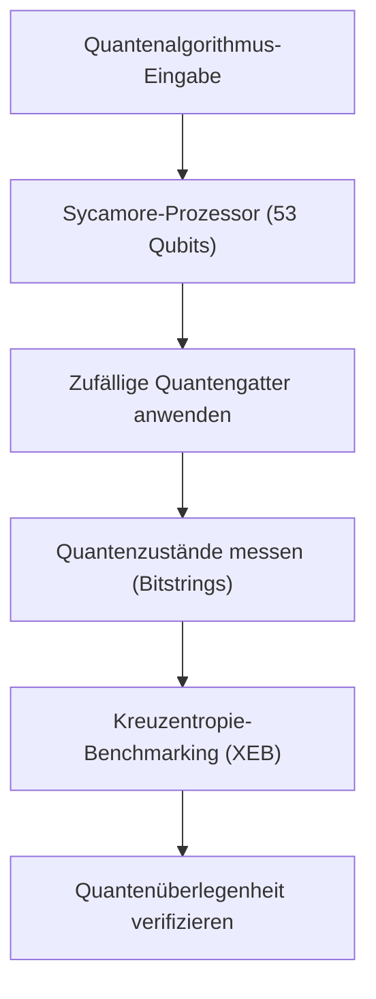
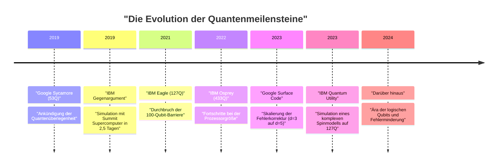
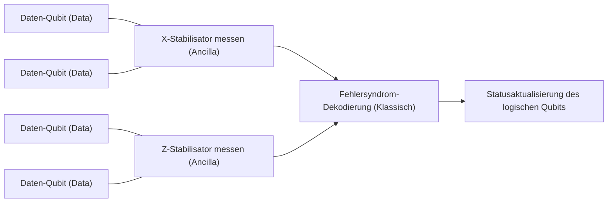

## 1. Einleitung: Die Morgendämmerung des Quantencomputings und die "Quantenüberlegenheit"

Quantencomputing birgt das Potenzial, komplexe Probleme in realistischer Zeit zu lösen, die für klassische Computer (die PCs und Supercomputer, die wir derzeit täglich nutzen) unlösbar sind, indem es die Quantenmechanik, ein Grundprinzip der Physik, auf die Informationsverarbeitung anwendet. Dieses Feld wurde lange Zeit hauptsächlich theoretisch erforscht, aber in den letzten Jahren hat sich der Wettbewerb um die praktische Anwendung durch rasante Fortschritte bei der Hardware intensiviert.

Eines der Schlüsselworte, das dabei die meiste Aufmerksamkeit erregt hat, ist "Quantenüberlegenheit" (Quantum Supremacy). Dies bezeichnet den Moment, in dem ein Quantencomputer bei einer bestimmten Berechnungsaufgabe eine Rechenleistung zeigt, die die eines klassischen Computers überwältigt. Dieser Artikel beginnt mit der genauen Definition der Quantenüberlegenheit, erläutert die Details des Experiments von Googles "Sycamore"-Prozessor, der 2019 bekannt gab, als Erster weltweit diesen Meilenstein erreicht zu haben, die Gegenargumente und den eigenen Ansatz von IBM daraufhin und geht schließlich technisch und mathematisch auf die "Quantenfehlerkorrektur" (Quantum Error Correction: QEC) und das "fehlertolerante Quantencomputing" (Fault-Tolerant Quantum Computing: FTQC) ein, welche die größten Hürden für eine echte praktische Anwendung darstellen.

---

## 2. Theoretischer Hintergrund: Grundlagen der Quantenberechnung und Komplexitätsklassen

Um die Quantenüberlegenheit zu verstehen, muss man zunächst die mathematischen Grundlagen der Quantenberechnung und ihre Stellung in der rechnerischen Komplexitätstheorie verstehen.

### Qubits und Superposition
Während die kleinste Informationseinheit in einem klassischen Computer das Bit (0 oder 1) ist, verwenden Quantencomputer Quantenbits (Qubits). Der Zustand $|\psi\rangle$ eines Qubits wird als komplexe Linearkombination der Basiszustände $|0\rangle$ und $|1\rangle$ dargestellt.

$$
|\psi\rangle = \alpha|0\rangle + \beta|1\rangle
$$

Hierbei sind $\alpha, \beta \in \mathbb{C}$ und erfüllen die Normierungsbedingung $|\alpha|^2 + |\beta|^2 = 1$. Diese Eigenschaft wird als "Superposition" (Überlagerung) bezeichnet.

### Verschränkung (Entanglement) und Tensorprodukt
Wenn mehrere Qubits vorhanden sind, wird der Zustand des gesamten Systems durch das Tensorprodukt der Zustandsräume der einzelnen Qubits dargestellt. Ein System aus $n$ Qubits ist ein Vektor im $2^n$-dimensionalen Hilbertraum $\mathcal{H}^{\otimes n}$.

$$
|\Psi\rangle = \sum_{x \in \{0, 1\}^n} c_x |x\rangle
$$

Hierbei ist $\sum |c_x|^2 = 1$. Der Zustand, in dem Qubits nicht unabhängig sind, sondern der Zustand des einen von dem des anderen abhängt, wird als "Quantenverschränkung" (Quantum Entanglement) bezeichnet. Dadurch hat ein Quantencomputer das Potenzial, einen exponentiell großen Zustandsraum gleichzeitig zu verarbeiten.

### Komplexitätstheoretische Definition der Quantenüberlegenheit
In der rechnerischen Komplexitätstheorie wird die Klasse der Probleme, die von einem klassischen Computer effizient (in polynomieller Zeit) gelöst werden können, als **BPP** (Bounded-error Probabilistic Polynomial time) bezeichnet. Andererseits ist die Klasse der Probleme, die von einem Quantencomputer effizient gelöst werden können, **BQP** (Bounded-error Quantum Polynomial time).

Der Nachweis der Quantenüberlegenheit bedeutet, "eine spezifische Aufgabe, die in BQP, aber nicht in BPP enthalten ist (oder bei der die Wahrscheinlichkeit dafür extrem hoch ist), auf tatsächlicher Quantenhardware auszuführen und klassische Supercomputer in Bezug auf Zeit und Ressourcen bei der Simulation zu übertreffen". Man kann dies als historischen Versuch bezeichnen, die erweiterte Church-Turing-These ("Jedes physikalisch realisierbare Berechnungsmodell kann durch eine probabilistische Turingmaschine in polynomieller Zeit simuliert werden") durch physikalische Experimente zu widerlegen.

---

## 3. 2019: Demonstration der Quantenüberlegenheit durch Google

Im Oktober 2019 gab das Google Quantum AI-Team in der Fachzeitschrift "Nature" bekannt, dass sie mit dem 53-Qubit-Supraleiter-Prozessor "Sycamore" die Quantenüberlegenheit erreicht hätten.

### Architektur des Sycamore-Prozessors
Der Sycamore-Prozessor besteht aus 54 supraleitenden Transmon-Qubits, die in einem zweidimensionalen Gitter angeordnet sind (im Experiment wurden 53 verwendet, da eines defekt war). Zwischen benachbarten Qubits sind variable Koppler (Tunable Couplers) angeordnet, um schnelle und hochpräzise 2-Qubit-Gatter (einen Hybrid aus iSWAP-Gatter und kontrolliertem Z-Gatter) zu realisieren.

### Zufälliges Quantenschaltkreis-Sampling (Random Circuit Sampling: RCS)
Die von Google gewählte Aufgabe war das "zufällige Quantenschaltkreis-Sampling". Dabei werden zufällig ausgewählte 1-Qubit-Gatter und 2-Qubit-Gatter über mehrere Zyklen (Tiefe $m$) angewendet, der Endzustand wird gemessen, und aus der resultierenden Wahrscheinlichkeitsverteilung der Bitstrings wird ein Sampling durchgeführt.

Die Wahrscheinlichkeit eines Bitstrings $x$, der von einem idealen (rauschfreien) zufälligen Quantenschaltkreis ausgegeben wird, ist keine Gleichverteilung, sondern zeigt ein Interferenzmuster-ähnliches Muster, das als Porter-Thomas-Verteilung bezeichnet wird. Um aus dieser Verteilung mit einem klassischen Computer abzutasten, ist eine Simulation des gesamten Zustandsvektors erforderlich, und der Rechenaufwand steigt exponentiell mit der Anzahl der Qubits $n$ und der Schaltkreistiefe $m$.

### Bewertung der Genauigkeit (Fidelity): Lineares Kreuzentropie-Benchmarking (XEB)
Um zu beweisen, dass die experimentellen Ergebnisse nicht nur Rauschen waren, sondern tatsächlich das Ergebnis einer Quantenberechnung, verwendete Google das lineare Kreuzentropie-Benchmarking (Linear Cross-Entropy Benchmarking: XEB). Die ideale Wahrscheinlichkeit $P(x_i)$ des Schaltkreises für die im Experiment erhaltenen Bitstrings $x_i$ wird auf einem klassischen Computer berechnet, und die Genauigkeit (Fidelity) $\mathcal{F}_{\text{XEB}}$ wird mit der folgenden Formel ermittelt:

$$
\mathcal{F}_{\text{XEB}} = 2^n \langle P(x_i) \rangle_{i} - 1
$$

Wenn $\mathcal{F}_{\text{XEB}}$ 0 ist, bedeutet dies vollständiges Rauschen, bei 1 einen idealen Quantenprozessor ohne Rauschen. Der Sycamore-Prozessor erreichte bei einem Schaltkreis der Tiefe 20 ein $\mathcal{F}_{\text{XEB}} \approx 0.002$ (0,2%). Dies scheint auf den ersten Blick gering, ist aber ein statistisch signifikanter Wert über null und stellte einen erstaunlichen Erfolg dar, bei dem ein Zustandsraum von $2^{53} \approx 9 \times 10^{15}$ kontrolliert wurde.

Die Gesamtfehlerrate wurde näherungsweise als Produkt einzelner Gatterfehler, Messfehler usw. modelliert.

$$
\mathcal{F} \approx (1 - e_1)^{N_1}(1 - e_2)^{N_2} \cdots \approx \prod_{g \in 1Q} (1 - e_g) \prod_{g \in 2Q} (1 - e_g) \prod_{q} (1 - e_{RO})
$$

（※ $e_g$ ist der Gatterfehler, $e_{RO}$ ist der Messfehler）

Google behauptete, dass die Simulation dieses Schaltkreises auf einem klassischen Supercomputer (Summit) etwa 10.000 Jahre dauern würde. Im Gegensatz dazu schloss Sycamore das Sampling in nur 200 Sekunden ab.

---

## 4. Gegenargument von IBM: Von der "Überlegenheit" zur "Nützlichkeit" (Utility)

Die Ankündigung von Google schockierte die Welt, aber IBM, Entwickler des weltweit größten Supercomputers "Summit" und selbst treibende Kraft in der Quantencomputerentwicklung, veröffentlichte umgehend ein Paper, das dieser Behauptung widersprach.

### Verbesserung der klassischen Simulation durch Tensornetzwerk-Kontraktion
Der Kern von IBMs Gegenargument war, dass "die Algorithmen und die Ressourcenoptimierung auf Seiten des klassischen Computers unzureichend sind". Google stützte seine Schätzung von 10.000 Jahren auf einen Zustandsvektor-Simulator, der die Zeitentwicklung der Schrödinger-Gleichung direkt berechnet. IBM wies jedoch darauf hin, dass die Simulationszeit durch eine Methode namens "Tensornetzwerk" (Tensor Network) drastisch verkürzt werden könnte.

In einem Tensornetzwerk werden die Gatteroperationen des Quantenschaltkreises als Operationen auf mehrdimensionalen Arrays (Tensoren) dargestellt und die Reihenfolge der "Kontraktion" (Contraction) des Netzwerks optimiert. Wenn man zudem den riesigen Speicherplatz von Summit in Höhe von 250 PB (Hierarchisierung von Festplatte und Speicher) voll ausnutzt, so IBM, könne man den gesamten Zustandsvektor im Speicher halten und eine präzisere Simulation in nur "zweieinhalb Tagen" durchführen.

### Quantum Advantage und Quantum Utility
Durch diese Debatte verlagerte sich der Trend in der gesamten Branche von dem Beharren darauf, "eine künstliche Aufgabe auszuführen, die klassisch unmöglich ist (Supremacy)", hin zum Nachweis, "bei nützlichen Problemen der realen Welt einen substanziellen Vorteil gegenüber klassischen Ansätzen zu zeigen (Quantum Advantage)" und weiter zu der Phase, in der "Quantencomputer als neues Werkzeug für wissenschaftliche Entdeckungen fungieren (Quantum Utility)".

IBM selbst vermeidet den Begriff "Überlegenheit" und schlägt Indikatoren wie das "Quantenvolumen" (Quantum Volume) und "CLOPS (Circuit Layer Operations Per Second)" als umfassende Leistungskennzahlen für Quantenprozessoren vor, wobei eine Entwicklung verfolgt wird, die das Gleichgewicht zwischen der Größe und der Qualität der Hardware betont.

---

## 5. Die nächste Grenze: Fehlerminderung (Error Mitigation) und Quantenfehlerkorrektur (QEC)

Heutige Quantencomputer werden als "NISQ" (Noisy Intermediate-Scale Quantum) bezeichnet und sind anfällig für Rauschen (Fehler aufgrund von Wechselwirkungen mit der äußeren Umgebung oder unvollständiger Kontrolle), sodass bei langen Berechnungen die Ergebnisse im Rauschen untergehen. Ansätze zur Überwindung dieses Problems lassen sich grob in "Fehlerminderung" (Error Mitigation) und "Quantenfehlerkorrektur" (Quantum Error Correction) unterteilen.

### Fehlerminderung (Error Mitigation)
Fehlerminderung ist eine Methode, bei der die Auswirkungen von Rauschen durch klassische Nachbearbeitung aus den Erwartungswerten der Berechnungsergebnisse entfernt werden, ohne die Quantenhardware zu verändern. Im Jahr 2023 demonstrierte IBM durch die Kombination des 127-Qubit-"Eagle"-Prozessors mit Fehlerminderungstechniken wie der "Zero-Noise Extrapolation" (ZNE) eine Präzision bei der Zeitentwicklungs-Simulation komplexer Ising-Modelle, die modernste approximative Tensornetzwerk-Methoden übertraf, und bewies damit die "Quantum Utility" (Quantennützlichkeit).

### Quantenfehlerkorrektur (QEC) und logische Qubits
Um jedoch letztendlich beliebig komplexe Algorithmen (z. B. Shors Faktorisierungsalgorithmus oder komplexe quantenchemische Berechnungen) auszuführen, reicht Fehlerminderung allein nicht aus; eine "Quantenfehlerkorrektur" (QEC), die Fehler dynamisch erkennt und korrigiert, ist unerlässlich.

Der Mainstream-Ansatz für QEC ist der "Oberflächencode" (Surface Code). Hierbei werden mehrere physikalische Qubits (Daten-Qubits) in einem zweidimensionalen Gitter angeordnet, und dazwischen werden Mess-Qubits (Ancilla-Qubits) platziert, um kontinuierlich Paritätsprüfungen, sogenannte "Stabilisatoren" (Stabilizers), durchzuführen.

#### Schwellenwertsatz (Threshold Theorem) und Distanz $d$
In der Quantenfehlerkorrektur gibt es den "Schwellenwertsatz". Wenn die Fehlerrate $p$ der physikalischen Qubits unter einem bestimmten Schwellenwert $p_{th}$ (beim Oberflächencode etwa um die 1%) liegt, kann die logische Fehlerrate $p_L$ exponentiell gesenkt werden, indem die Code-Distanz $d$ vergrößert wird (indem mehr physikalische Qubits einem logischen Qubit zugewiesen werden).

Eine Näherungsgleichung für die logische Fehlerrate wird wie folgt dargestellt:

$$
p_L \approx \Lambda \left( \frac{p}{p_{th}} \right)^{\frac{d+1}{2}}
$$

Hierbei ist $\Lambda$ eine Konstante. Solange $p < p_{th}$ ist, wird $p_L$ umso kleiner, je größer $d$ wird. Wenn jedoch $p > p_{th}$ ist, sammelt sich umso mehr Rauschen an, je mehr physikalische Qubits hinzugefügt werden, und die logische Fehlerrate verschlechtert sich.

#### Googles Meilenstein 2023: Demonstration der Fehlerreduktion durch Vergrößerung der Distanz
Im Februar 2023 veröffentlichte Google ein bahnbrechendes Paper in "Nature". Mit dem Sycamore-Prozessor der dritten Generation demonstrierten sie weltweit zum ersten Mal, dass bei einer Erweiterung der Distanz des Oberflächencodes von $d=3$ (unter Verwendung von 17 physikalischen Qubits) auf $d=5$ (unter Verwendung von 49 physikalischen Qubits) die logische Fehlerrate leicht von 3,028% auf 2,914% sank.

Dies bedeutet den Eintritt in den Bereich $p < p_{th}$ und zeigt, dass der wichtigste Proof of Concept (Prinzipnachweis) auf dem Weg zum FTQC abgeschlossen wurde: Die Leistung verbessert sich, je mehr physikalische Qubits hinzugefügt werden.

---

## 6. Roadmap und Ausblick auf FTQC (Fehlertolerantes Quantencomputing)

Google und IBM liefern sich einen harten Entwicklungswettbewerb in Richtung ihres ultimativen Ziels, dem FTQC (Fault-Tolerant Quantum Computing), wenn auch mit unterschiedlichen Architekturen und Ansätzen.

### Der Ansatz von IBM: Modularisierung und Heavy-Hex-Gitter
IBM konzentriert sich darauf, die Prozessorgröße zu skalieren und gleichzeitig die Fehlerraten drastisch zu senken. Während sie mit "Eagle (127Q)", "Osprey (433Q)" und "Condor (1121Q)" die Grenzen einzelner Chips ausreizen, kündigten sie eine modulare Architektur namens "Quantum System Two" an. Für die Kopplungstopologie der Qubits verwenden sie zudem ein "Heavy-Hex-Gitter", das unnötiges Übersprechen (Crosstalk) reduziert und die Stabilität erhöht. IBMs Strategie ist ein hybrider Ansatz, der kurzfristig Nützlichkeit durch fortschrittliche Fehlerminderung anstrebt und schrittweise QEC einführt.

### Der Ansatz von Google: Qualitätsverbesserung logischer Qubits
Die Strategie von Google legt weniger Wert auf eine rasante Erhöhung der Anzahl physikalischer Qubits, sondern konzentriert sich darauf, die Fehlerrate eines einzigen logischen Qubits bis zum Äußersten zu minimieren (z. B. auf $10^{-6}$). Darauf aufbauend streben sie die Etablierung von Technologien zum Transfer von Quantenzuständen zwischen Modulen (Quantum Interconnects) an, um ein groß angelegtes System zu schaffen, das Tausende bis Zehntausende physikalische Qubits parallel betreibt.

Die fehlertolerante Implementierung von Protokollen für Nicht-Clifford-Gatter, wie etwa die Destillation magischer Zustände (Magic State Distillation), stellt ebenfalls eine große zukünftige technische Hürde dar. Es wird geschätzt, dass für die Ausführung eines praktischen Shor-Algorithmus zum Knacken einer 2048-Bit-RSA-Verschlüsselung Tausende logischer Qubits mit einer Fehlerrate von unter $10^{-8}$ erforderlich sind, was in Millionen bis zig Millionen physikalischer Qubits resultiert. Der Weg dorthin ist noch lang.

---

## 7. Fazit

Die "Quantenüberlegenheit" war ein wichtiger Meilenstein in der Geschichte des Quantencomputers, der das theoretische Potenzial von Computern physikalisch bewies. Die Demonstration von Google im Jahr 2019 und die konstruktiven Gegenargumente von IBM haben die gesamte Branche von bloßen theoretischen Beweisen in eine Ära echten Engineerings geführt, in der die tatsächliche Nützlichkeit (Utility) und schließlich das fehlertolerante Quantencomputing (FTQC) angestrebt werden.

Wir erleben derzeit die Übergangsphase von stark verrauschten NISQ-Geräten hin zu logischen Qubit-Geräten, die mit Fehlerkorrektur ausgestattet sind. In den nächsten Jahren bis hin zu einem Jahrzehnt werden mit dieser Evolution der Quantenhardware neue Entdeckungen in den Materialwissenschaften, Revolutionen in der Medikamentenentwicklung und Durchbrüche bei Optimierungsproblemen Realität werden.

Die künftigen Entwicklungen von Google, IBM und Forschern auf der ganzen Welt, welche die Informatik der Zukunft prägen werden, bleiben weiterhin höchst spannend.
