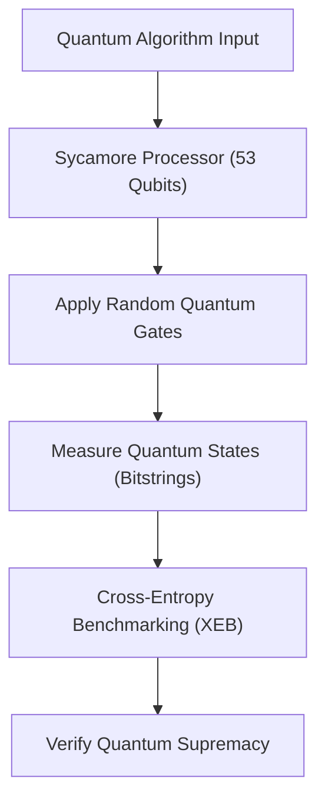
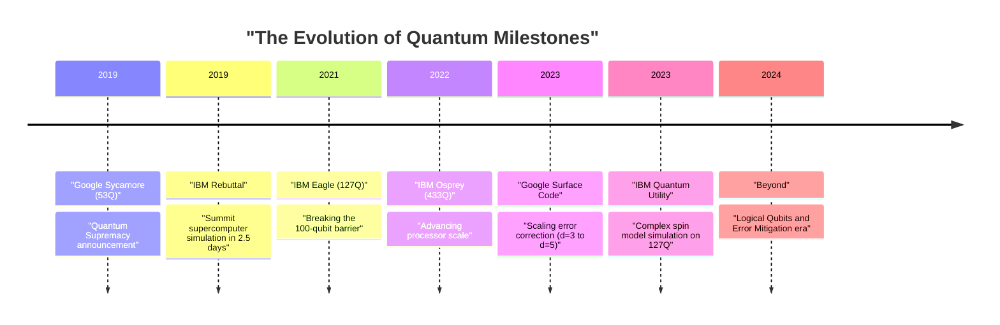
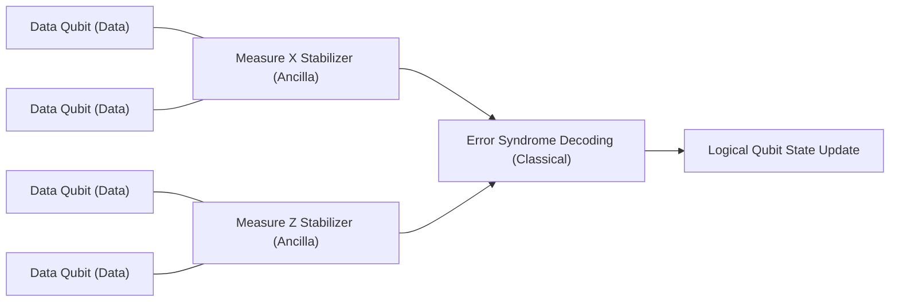

## 1. Introduction: The Dawn of Quantum Computing and "Quantum Supremacy"

Quantum computing has the potential to solve complex problems that cannot be solved within a realistic timeframe by classical computers (the PCs and supercomputers we use daily) by applying quantum mechanics, the fundamental principle of physics, to information processing. For a long time, this field was primarily focused on theoretical research, but in recent years, rapid hardware advancements have intensified the race toward practical application.

One of the most attention-grabbing keywords in this context is "Quantum Supremacy." This refers to the moment when a quantum computer demonstrates overwhelming computational power over classical computers in a specific computational task. In this article, starting from the strict definition of quantum supremacy, we will provide a detailed technical and mathematical deep dive into the 2019 experiment by Google's "Sycamore" processor—which was announced as the first in the world to reach this milestone—as well as IBM's rebuttal and unique approach, and the latest roadmap towards "Quantum Error Correction (QEC)" and "Fault-Tolerant Quantum Computing (FTQC)," which represent the biggest barriers to true practical application.

---

## 2. Theoretical Background: Fundamentals of Quantum Computing and Complexity Classes

To understand quantum supremacy, it is first necessary to understand the mathematical foundations of quantum computing and its position in computational complexity theory.

### Qubits and Superposition
While the smallest unit of information in a classical computer is a bit (0 or 1), a quantum computer uses a qubit (Quantum bit). The state $|\psi\rangle$ of a single qubit is represented by a complex linear combination of the basis states $|0\rangle$ and $|1\rangle$.

$$
|\psi\rangle = \alpha|0\rangle + \beta|1\rangle
$$

Here, $\alpha, \beta \in \mathbb{C}$, and they satisfy the normalization condition $|\alpha|^2 + |\beta|^2 = 1$. This property is called "Superposition."

### Entanglement and Tensor Product
When there are multiple qubits, the state of the entire system is represented by the tensor product of the state spaces of the individual qubits. A system of $n$ qubits becomes a vector on a $2^n$-dimensional Hilbert space $\mathcal{H}^{\otimes n}$.

$$
|\Psi\rangle = \sum_{x \in \{0, 1\}^n} c_x |x\rangle
$$

Here, $\sum |c_x|^2 = 1$. A state where qubits are not independent, and the state of one depends on the other, is called "Quantum Entanglement." This gives quantum computers the potential to simultaneously process an exponentially vast state space.

### Computational Complexity Theory Definition of Quantum Supremacy
In computational complexity theory, the class of problems that classical computers can solve efficiently (in polynomial time) is called **BPP** (Bounded-error Probabilistic Polynomial time). On the other hand, the class of problems that quantum computers can solve efficiently is **BQP** (Bounded-error Quantum Polynomial time).

Demonstrating quantum supremacy means "executing a specific task on actual quantum hardware that is included in BQP but not in BPP (or is extremely likely not to be), and surpassing simulation by classical supercomputers in terms of time and resources." It can be considered a historical attempt to falsify the extended Church-Turing thesis ("Any physically realizable computational model can be simulated by a probabilistic Turing machine in polynomial time") through physical experiment.

---

## 3. 2019: Google's Demonstration of Quantum Supremacy

In October 2019, the Google Quantum AI team announced in the scientific journal *Nature* that they had achieved quantum supremacy using a 53-qubit superconducting processor called "Sycamore."

### Architecture of the Sycamore Processor
The Sycamore processor consists of 54 transmon superconducting qubits arranged in a 2D grid (53 were used in the experiment as one was malfunctioning). Tunable couplers are placed between adjacent qubits, realizing fast and highly accurate two-qubit gates (a hybrid of iSWAP and controlled-Z gates).

### Random Circuit Sampling (RCS)
The task Google chose was "Random Circuit Sampling." This involves applying randomly chosen single-qubit gates and two-qubit gates over multiple cycles (depth $m$), and sampling from the probability distribution of bitstrings obtained by measuring the final state.

The probability of a bitstring $x$ output from an ideal (noise-free) random quantum circuit is not a uniform distribution, but exhibits an interference fringe-like pattern called a Porter-Thomas distribution. To sample from this distribution on a classical computer requires simulating the entire state vector, and the computational complexity increases exponentially with respect to the number of qubits $n$ and the circuit depth $m$.

### Evaluating Fidelity: Linear Cross-Entropy Benchmarking (XEB)
To prove that the experimental results were not just noise, but the results of actual quantum computation, Google used Linear Cross-Entropy Benchmarking (XEB). The ideal probability $P(x_i)$ of the circuit for the bitstring $x_i$ obtained in the experiment is calculated using a classical computer, and the fidelity $\mathcal{F}_{\text{XEB}}$ is obtained by the following formula:

$$
\mathcal{F}_{\text{XEB}} = 2^n \langle P(x_i) \rangle_{i} - 1
$$

If $\mathcal{F}_{\text{XEB}}$ is 0, it means complete noise, and if it is 1, it means an ideal quantum processor without noise. The Sycamore processor achieved $\mathcal{F}_{\text{XEB}} \approx 0.002$ (0.2%) for a circuit with depth 20. At first glance, this seems low, but it is a statistically significant value above zero, representing an astonishing achievement of controlling a state space of $2^{53} \approx 9 \times 10^{15}$.

The overall error rate was approximately modeled as the product of individual gate errors, measurement errors, etc.

$$
\mathcal{F} \approx (1 - e_1)^{N_1}(1 - e_2)^{N_2} \cdots \approx \prod_{g \in 1Q} (1 - e_g) \prod_{g \in 2Q} (1 - e_g) \prod_{q} (1 - e_{RO})
$$

(* $e_g$ is the gate error, $e_{RO}$ is the measurement error)

Google claimed that it would take a classical supercomputer (Summit) about 10,000 years to simulate this circuit. In contrast, Sycamore completed the sampling in just 200 seconds.

---

## 4. IBM's Rebuttal: From "Supremacy" to "Utility"

Google's announcement shocked the world, but IBM, which developed the world's largest supercomputer "Summit" and is itself a leader in quantum computer development, immediately published a paper rebutting this claim.

### Improving Classical Simulation via Tensor Network Contraction
The core of IBM's rebuttal was that "the optimization of algorithms and resources on the classical computer side was insufficient." Google assumed a state vector simulator that directly calculates the time evolution of the Schrödinger equation and came up with the 10,000-year estimate. However, IBM pointed out that the simulation time could be dramatically reduced by using a method called a "Tensor Network."

In a tensor network, the gate operations of a quantum circuit are represented as operations on multi-dimensional arrays (tensors), and the order of network "contraction" is optimized. Furthermore, they claimed that by fully utilizing Summit's massive 250 PB of storage (hierarchical disk and memory), a higher-precision simulation would be possible in just "2.5 days" while maintaining the entire state vector.

### Quantum Advantage and Quantum Utility
Triggered by this debate, the trend in the entire industry shifted from merely adhering to "executing artificial tasks impossible for classical computers (Supremacy)" to a phase of "demonstrating a practical advantage over classical approaches in useful real-world problems (Quantum Advantage)," and further to "quantum computers functioning as new tools for scientific discovery (Quantum Utility)."

IBM itself avoided the word "Supremacy" and advocated "Quantum Volume" and "CLOPS (Circuit Layer Operations Per Second)" as comprehensive performance metrics for quantum processors, promoting development that emphasizes a balance between hardware scale and quality.

---

## 5. The Next Frontier: Error Mitigation and Quantum Error Correction (QEC)

Current quantum computers are called "NISQ (Noisy Intermediate-Scale Quantum)," and they are susceptible to noise (errors due to interactions with the external environment or imperfect control). When performing long computations, the results get buried in noise. There are broadly two approaches to overcoming this problem: "Error Mitigation" and "Quantum Error Correction."

### Error Mitigation
Error mitigation is a method to remove the effects of noise from the expected values of calculation results through classical post-processing without changing the quantum hardware. In 2023, IBM achieved a precision that surpassed state-of-the-art approximate tensor network methods in a time evolution simulation of a complex Ising model by combining its 127-qubit "Eagle" processor with error mitigation techniques such as "Zero-Noise Extrapolation (ZNE)," thereby demonstrating "Quantum Utility."

### Quantum Error Correction (QEC) and Logical Qubits
However, to ultimately run any arbitrary complex algorithm (e.g., Shor's factoring algorithm or complex quantum chemistry calculations), error mitigation alone is insufficient, and "Quantum Error Correction (QEC)," which dynamically detects and corrects errors, is essential.

The mainstream approach for QEC is the "Surface Code." This is a method where multiple physical qubits (data qubits) are arranged in a 2D grid, and measurement qubits (ancilla qubits) are placed between them to continuously perform parity checks called "Stabilizers."

#### The Threshold Theorem and Distance $d$
A "Threshold Theorem" exists in quantum error correction. When the error rate $p$ of physical qubits is below a certain threshold $p_{th}$ (around 1% for the surface code), increasing the code distance $d$ (allocating more physical qubits to a single logical qubit) can exponentially reduce the logical error rate $p_L$.

The approximate formula for the logical error rate is expressed as follows:

$$
p_L \approx \Lambda \left( \frac{p}{p_{th}} \right)^{\frac{d+1}{2}}
$$

Here, $\Lambda$ is a constant. If $p < p_{th}$, increasing $d$ makes $p_L$ smaller. However, if $p > p_{th}$, increasing physical qubits conversely accumulates noise, worsening the logical error rate.

#### Google's 2023 Milestone: Demonstrating Error Reduction by Scaling Distance
In February 2023, Google published a monumental paper in *Nature*. They became the first in the world to demonstrate that when expanding the distance of the surface code from $d=3$ (using 17 physical qubits) to $d=5$ (using 49 physical qubits) using their 3rd generation Sycamore processor, the logical error rate slightly decreased from 3.028% to 2.914%.

This means they have stepped into the region where $p < p_{th}$, showing that the most important Proof of Concept towards FTQC—where performance improves as more physical qubits are added—has been completed.

---

## 6. Roadmap and Prospects for FTQC (Fault-Tolerant Quantum Computing)

While adopting different architectures and approaches, Google and IBM are engaged in fierce development competition towards the ultimate goal of FTQC (Fault-Tolerant Quantum Computing).

### IBM's Approach: Modularization and Heavy-Hex Lattices
IBM is focusing on scaling up processors in parallel with drastically reducing error rates. While challenging the limits of single chips with "Eagle (127Q)," "Osprey (433Q)," and "Condor (1121Q)," they announced a modular architecture called "Quantum System Two." In addition, for the qubit coupling topology, they have adopted a "Heavy-Hex lattice" that reduces unnecessary crosstalk and increases stability. IBM's strategy is a hybrid approach that gradually introduces QEC while pursuing utility through advanced error mitigation in the short term.

### Google's Approach: Improving Logical Qubit Quality
Google's strategy places greater emphasis on extremely lowering the error rate of a single logical qubit (e.g., down to $10^{-6}$) rather than rapidly increasing the number of physical qubits. Upon achieving this, they aim for a large-scale system that runs thousands to tens of thousands of physical qubits in parallel by establishing technologies for transferring quantum states between modules (Quantum Interconnects).

Implementing protocols to fault-tolerantly execute non-Clifford gates, such as Magic State Distillation, will also be a major technical hurdle in the future. To run a practical Shor's algorithm and crack a 2048-bit RSA cipher, it is said that thousands of logical qubits with an error rate of $10^{-8}$ or less are required, equating to millions to tens of millions of physical qubits, meaning the journey is still long.

---

## 7. Conclusion

"Quantum Supremacy" was an important milestone in the history of quantum computers that physically proved the theoretical potential of computing machines. Google's 2019 demonstration and IBM's constructive rebuttal pushed the entire industry from mere theoretical proof into an era of genuine engineering towards the pursuit of actual Utility and, ultimately, Fault-Tolerant Quantum Computing (FTQC).

Currently, we are witnessing a transitional phase from noisy NISQ devices to logical qubit devices equipped with error correction. In the next five to ten years, new discoveries in materials science, revolutions in the drug discovery process, and breakthroughs in optimization problems will likely become a reality alongside the evolution of this quantum hardware.

We must keep a close eye on the movements of Google, IBM, and researchers worldwide who are shaping the future of computer science.
