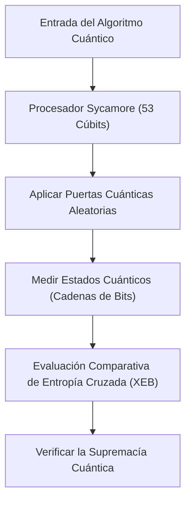
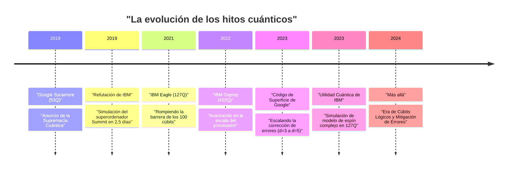
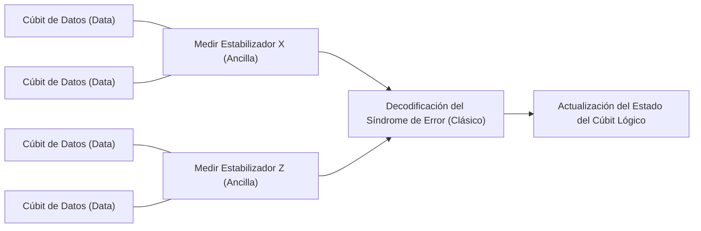

## 1. Introducción: El amanecer de la computación cuántica y la "supremacía cuántica"

La computación cuántica tiene el potencial de resolver problemas complejos que los ordenadores clásicos (los PC y superordenadores que usamos habitualmente en la actualidad) no pueden resolver en un tiempo realista, aplicando la mecánica cuántica, el principio fundamental de la física, al procesamiento de información. Este campo ha sido principalmente de investigación teórica durante mucho tiempo, pero en los últimos años, con el rápido avance del hardware, la competencia por la aplicación práctica se ha intensificado.

Una de las palabras clave que más atención ha atraído es la "supremacía cuántica" (Quantum Supremacy). Esto se refiere al momento en que un ordenador cuántico demuestra una capacidad de cálculo que abruma a los ordenadores clásicos en una tarea computacional específica. En este artículo, explicaremos detalladamente y con profundidad técnica y matemática desde la definición estricta de supremacía cuántica, los detalles del experimento del procesador "Sycamore" de Google que anunció haber alcanzado este hito mundial en 2019, la refutación y el enfoque propio de IBM al respecto, hasta las últimas hojas de ruta hacia la "corrección de errores cuánticos" (Quantum Error Correction: QEC) y la "computación cuántica tolerante a fallos" (Fault-Tolerant Quantum Computing: FTQC), que son el mayor obstáculo para su verdadera aplicación práctica.

---

## 2. Antecedentes teóricos: Fundamentos de la computación cuántica y clases de complejidad

Para entender la supremacía cuántica, primero es necesario comprender los fundamentos matemáticos de la computación cuántica y su posición en la teoría de la complejidad computacional.

### Cúbits (Qubits) y superposición
La unidad mínima de información en un ordenador clásico es el bit (0 o 1), pero en un ordenador cuántico se utiliza el cúbit (Qubit). El estado $|\psi\rangle$ de un cúbit se representa como una combinación lineal compleja de los estados base $|0\rangle$ y $|1\rangle$.

$$
|\psi\rangle = \alpha|0\rangle + \beta|1\rangle
$$

Donde $\alpha, \beta \in \mathbb{C}$, y cumplen con la condición de normalización $|\alpha|^2 + |\beta|^2 = 1$. A esta propiedad se le llama "superposición" (Superposition).

### Entrelazamiento (Entanglement) y producto tensorial
Cuando hay varios cúbits, el estado de todo el sistema se representa por el producto tensorial del espacio de estados de cada cúbit individual. Un sistema de $n$ cúbits es un vector en el espacio de Hilbert de $2^n$ dimensiones $\mathcal{H}^{\otimes n}$.

$$
|\Psi\rangle = \sum_{x \in \{0, 1\}^n} c_x |x\rangle
$$

Donde $\sum |c_x|^2 = 1$. El estado en el que los cúbits no son independientes entre sí y el estado de uno depende del otro se llama "entrelazamiento cuántico" (Quantum Entanglement). Esto le da a los ordenadores cuánticos el potencial de procesar simultáneamente un espacio de estados exponencialmente vasto.

### Definición teórica de la complejidad computacional de la supremacía cuántica
En la teoría de la complejidad computacional, la clase de problemas que un ordenador clásico puede resolver eficientemente (en tiempo polinómico) se llama **BPP** (Bounded-error Probabilistic Polynomial time). Por otro lado, la clase de problemas que un ordenador cuántico puede resolver eficientemente es **BQP** (Bounded-error Quantum Polynomial time).

Demostrar la supremacía cuántica significa "ejecutar en hardware cuántico real una tarea específica que está incluida en BQP pero no en BPP (o es muy probable que no lo esté), y superar la simulación por superordenadores clásicos en términos de tiempo y recursos". Se puede decir que es un intento histórico de refutar mediante experimentos físicos la tesis extendida de Church-Turing ("todo modelo de computación físicamente realizable puede ser simulado en tiempo polinómico por una máquina de Turing probabilística").

---

## 3. 2019: Demostración de la supremacía cuántica por Google

En octubre de 2019, el equipo de Google Quantum AI anunció en la revista científica "Nature" que habían logrado la supremacía cuántica utilizando un procesador superconductor de 53 cúbits llamado "Sycamore".

### Arquitectura del procesador Sycamore
El procesador Sycamore está compuesto por 54 cúbits superconductores tipo Transmon dispuestos en una cuadrícula bidimensional (se usaron 53 porque uno de ellos falló durante el experimento). Se colocaron acopladores ajustables (Tunable Couplers) entre los cúbits adyacentes para realizar puertas de dos cúbits (un híbrido de puerta iSWAP y puerta Z controlada) de alta velocidad y alta precisión.

### Muestreo de circuitos cuánticos aleatorios (Random Circuit Sampling: RCS)
La tarea elegida por Google fue el "muestreo de circuitos cuánticos aleatorios". Consiste en aplicar puertas de un solo cúbit y de dos cúbits elegidas al azar durante múltiples ciclos (profundidad $m$), y luego medir el estado final para muestrear a partir de la distribución de probabilidad de las cadenas de bits obtenidas.

La probabilidad de la cadena de bits $x$ que sale de un circuito cuántico aleatorio ideal (sin ruido) no es una distribución uniforme, sino que muestra un patrón similar a un patrón de interferencia llamado distribución de Porter-Thomas (Porter-Thomas distribution). Para muestrear a partir de esta distribución en un ordenador clásico se requiere la simulación de todo el vector de estado, y la complejidad computacional aumenta exponencialmente con el número de cúbits $n$ y la profundidad del circuito $m$.

### Evaluación de la fidelidad (Fidelity): Evaluación comparativa de entropía cruzada lineal (XEB)
Para demostrar que los resultados del experimento no eran mero ruido, sino los resultados de un cálculo cuántico real, Google utilizó la evaluación comparativa de entropía cruzada lineal (Linear Cross-Entropy Benchmarking: XEB). Se calcula la probabilidad ideal $P(x_i)$ del circuito para la cadena de bits $x_i$ obtenida en el experimento con un ordenador clásico, y la fidelidad $\mathcal{F}_{\text{XEB}}$ se calcula con la siguiente fórmula:

$$
\mathcal{F}_{\text{XEB}} = 2^n \langle P(x_i) \rangle_{i} - 1
$$

Si $\mathcal{F}_{\text{XEB}}$ es 0, significa ruido puro; si es 1, significa un procesador cuántico ideal sin ruido. El procesador Sycamore logró $\mathcal{F}_{\text{XEB}} \approx 0.002$ (0,2%) en un circuito de profundidad 20. Aunque parece bajo a primera vista, fue un valor estadísticamente significativo mayor que cero y un logro asombroso al controlar un espacio de estados de $2^{53} \approx 9 \times 10^{15}$.

La tasa de error global se modeló aproximadamente como el producto de los errores individuales de las puertas, errores de medición, etc.

$$
\mathcal{F} \approx (1 - e_1)^{N_1}(1 - e_2)^{N_2} \cdots \approx \prod_{g \in 1Q} (1 - e_g) \prod_{g \in 2Q} (1 - e_g) \prod_{q} (1 - e_{RO})
$$

(* $e_g$ es el error de la puerta, $e_{RO}$ es el error de medición)

Google afirmó que a un superordenador clásico (Summit) le llevaría unos 10.000 años simular este circuito. En contraste, Sycamore completó el muestreo en solo 200 segundos.

---

## 4. La refutación de IBM: De la "supremacía" a la "utilidad" (Utility)

El anuncio de Google sorprendió al mundo entero, pero IBM, quien desarrolló el superordenador más grande del mundo "Summit" y es también líder en el desarrollo de ordenadores cuánticos, publicó de inmediato un documento refutando esta afirmación.

### Mejora de la simulación clásica mediante la contracción de redes tensoriales
El núcleo de la refutación de IBM fue que "la optimización del algoritmo y los recursos del lado del ordenador clásico eran insuficientes". Google basó su estimación de 10.000 años asumiendo un simulador de vector de estado que calcula directamente la evolución temporal de la ecuación de Schrödinger, pero IBM señaló que al usar una técnica llamada "redes tensoriales" (Tensor Network), el tiempo de simulación podría reducirse drásticamente.

En las redes tensoriales, las operaciones de puertas de los circuitos cuánticos se representan como cálculos de matrices multidimensionales (tensores), y se optimiza el orden de la "contracción" (Contraction) de la red. Además, afirmaron que al utilizar plenamente el enorme almacenamiento de 250 PB de Summit (estratificación de disco y memoria), era posible retener todo el vector de estado y realizar una simulación de mayor precisión en solo "dos días y medio".

### Ventaja cuántica (Quantum Advantage) y utilidad cuántica (Quantum Utility)
Con este debate como punto de inflexión, la tendencia de toda la industria pasó de aferrarse simplemente a "ejecutar tareas artificiales que son imposibles clásicamente (Supremacy)", a demostrar una "ventaja sustancial sobre los enfoques clásicos en problemas útiles del mundo real (Quantum Advantage)", y más aún a la fase en la que "el ordenador cuántico funciona como una nueva herramienta para el descubrimiento científico (Quantum Utility)".

La propia IBM evita el término "supremacía" y aboga por el "volumen cuántico" (Quantum Volume) y los "CLOPS (Circuit Layer Operations Per Second)" como indicadores integrales de rendimiento de los procesadores cuánticos, avanzando en un desarrollo que enfatiza el equilibrio entre la escala y la calidad del hardware.

---

## 5. La próxima frontera: Mitigación de errores (Error Mitigation) y corrección de errores cuánticos (QEC)

Los ordenadores cuánticos actuales se denominan "NISQ (Noisy Intermediate-Scale Quantum)" y son susceptibles a los efectos del ruido (errores debidos a la interacción con el entorno externo y la imperfección del control), y cuando realizan cálculos largos, los resultados quedan enterrados en el ruido. Los enfoques para superar este problema se dividen a grandes rasgos en dos: "mitigación de errores" (Error Mitigation) y "corrección de errores cuánticos" (Quantum Error Correction).

### Mitigación de errores (Error Mitigation)
La mitigación de errores es una técnica que elimina los efectos del ruido de los valores esperados de los resultados computacionales mediante el posprocesamiento clásico, sin alterar el hardware cuántico. En 2023, IBM logró la "utilidad cuántica" (Quantum Utility) combinando el procesador "Eagle" de 127 cúbits con técnicas de mitigación de errores como la "extrapolación de ruido cero" (Zero-Noise Extrapolation: ZNE), superando la precisión de los métodos de redes tensoriales aproximadas de última generación en la simulación de la evolución temporal de modelos de Ising complejos.

### Corrección de errores cuánticos (QEC) y cúbits lógicos
Sin embargo, en última instancia, para ejecutar algoritmos complejos arbitrarios (por ejemplo, el algoritmo de factorización de Shor o cálculos químicos cuánticos complejos), la mitigación de errores por sí sola es insuficiente, y es indispensable la "corrección de errores cuánticos" (QEC) que detecta y corrige errores dinámicamente.

El enfoque principal de QEC es el "código de superficie" (Surface Code). Este es un método que organiza múltiples cúbits físicos (cúbits de datos) en una cuadrícula bidimensional, coloca cúbits para medición (cúbits ancilla) entre ellos, y realiza verificaciones de paridad continuas llamadas "estabilizadores" (Stabilizers).

#### Teorema del umbral (Threshold Theorem) y distancia $d$
Existe un "teorema del umbral" para la corrección de errores cuánticos. Si la tasa de error $p$ de los cúbits físicos está por debajo de un cierto umbral $p_{th}$ (alrededor del 1% en el caso de los códigos de superficie), se puede reducir la tasa de error lógico $p_L$ de manera exponencial al aumentar la distancia del código (Distance) $d$ (asignando más cúbits físicos a un cúbit lógico).

La fórmula aproximada de la tasa de error lógico se expresa de la siguiente manera:

$$
p_L \approx \Lambda \left( \frac{p}{p_{th}} \right)^{\frac{d+1}{2}}
$$

Donde $\Lambda$ es una constante. Si $p < p_{th}$, cuanto mayor sea $d$, menor será $p_L$. Sin embargo, si $p > p_{th}$, cuantos más cúbits físicos se añadan, más ruido se acumulará, empeorando la tasa de error lógico.

#### Hito de Google en 2023: Demostración de la reducción de errores ampliando la distancia
En febrero de 2023, Google publicó un artículo monumental en "Nature". Utilizando el procesador Sycamore de tercera generación, demostraron por primera vez en el mundo que al ampliar la distancia del código de superficie de $d=3$ (usando 17 cúbits físicos) a $d=5$ (usando 49 cúbits físicos), la tasa de error lógico disminuyó ligeramente del 3,028% al 2,914%.

Esto significa que entraron en la región de $p < p_{th}$, indicando que se ha completado la prueba de concepto (Proof of Concept) más importante hacia la FTQC: que el rendimiento mejora cuantos más cúbits físicos se añadan.

---

## 6. Hoja de ruta y perspectivas hacia la FTQC (Computación cuántica tolerante a fallos)

Google e IBM están inmersos en una feroz competencia de desarrollo hacia el objetivo final de la FTQC (Fault-Tolerant Quantum Computing), adoptando arquitecturas y enfoques diferentes respectivamente.

### El enfoque de IBM: Modularización y celosía Heavy-Hex
IBM se está centrando en ampliar el procesador al mismo tiempo que reduce drásticamente las tasas de error. Mientras desafían los límites de un solo chip con "Eagle (127Q)", "Osprey (433Q)" y "Condor (1121Q)", han anunciado una arquitectura modular llamada "Quantum System Two". Además, para la topología de conexión de los cúbits, han adoptado la "celosía Heavy-Hex" para reducir la diafonía (crosstalk) innecesaria y aumentar la estabilidad. La estrategia de IBM es un enfoque híbrido que persigue la utilidad con mitigación de errores avanzada a corto plazo, introduciendo gradualmente la QEC.

### El enfoque de Google: Mejora de la calidad de los cúbits lógicos
La estrategia de Google pone el énfasis en reducir la tasa de error de un solo cúbit lógico al extremo (por ejemplo, reducirla a $10^{-6}$) más que en aumentar rápidamente el número de cúbits físicos. Sobre esa base, tienen como objetivo establecer una tecnología para transferir estados cuánticos entre módulos (Quantum Interconnects) y construir un sistema a gran escala que opere desde miles hasta decenas de miles de cúbits físicos en paralelo.

La implementación de protocolos para ejecutar puertas no de Clifford con tolerancia a fallos, como la destilación de estados mágicos (Magic State Distillation), también será un gran obstáculo técnico en el futuro. Para ejecutar el algoritmo práctico de Shor y descifrar la criptografía RSA de 2048 bits, se dice que se necesitarán miles de cúbits lógicos con una tasa de error inferior a $10^{-8}$, lo que equivale a entre millones y decenas de millones de cúbits físicos, por lo que el camino aún es largo.

---

## 7. Conclusión

La "supremacía cuántica" fue un hito importante en la historia de los ordenadores cuánticos que demostró físicamente el potencial teórico de la computación. La demostración de Google en 2019 y la refutación constructiva de IBM impulsaron a toda la industria desde una mera prueba teórica hacia la búsqueda de la utilidad (Utility) real, y finalmente hacia una era de ingeniería a gran escala para la computación cuántica tolerante a fallos (FTQC).

Actualmente somos testigos del período de transición desde los dispositivos NISQ plagados de ruido hasta los dispositivos de cúbits lógicos equipados con corrección de errores. En los próximos años o décadas, los nuevos descubrimientos en la ciencia de los materiales, las revoluciones en el proceso de descubrimiento de fármacos y los avances en los problemas de optimización se harán realidad junto con la evolución de este hardware cuántico.

No podemos perder de vista las tendencias de Google, IBM y los investigadores de todo el mundo que están dando forma al futuro de la informática.
