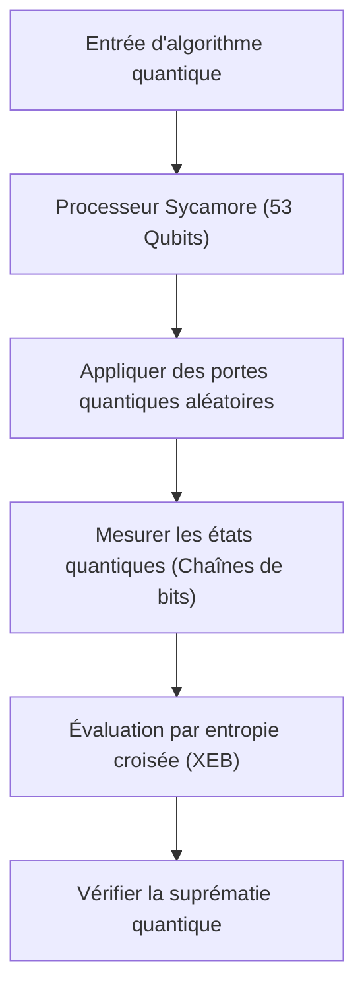
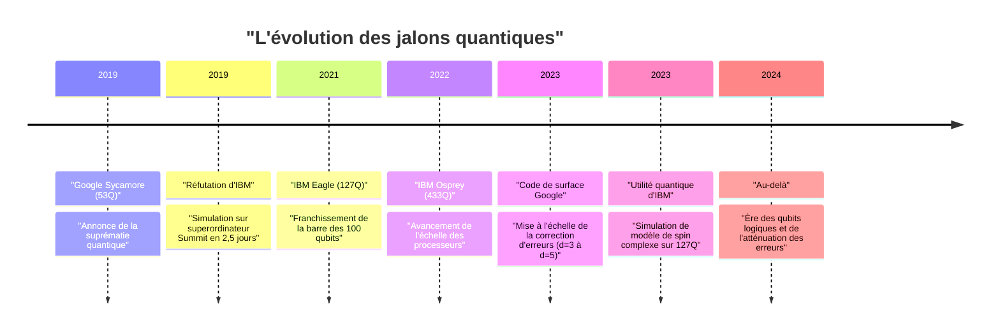
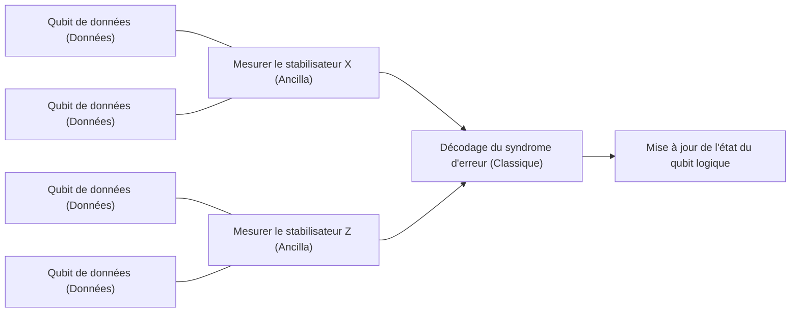

## 1. Introduction : L'aube de l'informatique quantique et la « Suprématie quantique »

L'informatique quantique recèle le potentiel de résoudre des problèmes complexes, insolubles dans un délai réaliste par des ordinateurs classiques (les PC et les superordinateurs que nous utilisons quotidiennement), en appliquant les principes fondamentaux de la physique, à savoir la mécanique quantique, au traitement de l'information. Pendant longtemps, ce domaine a été principalement limité à la recherche théorique, mais ces dernières années, les progrès rapides du matériel ont intensifié la course vers une application pratique.

Parmi ces développements, l'un des mots-clés ayant attiré le plus d'attention est la « Suprématie quantique » (Quantum Supremacy). Cela désigne le moment où un ordinateur quantique démontre une puissance de calcul écrasante par rapport à un ordinateur classique pour une tâche de calcul spécifique. Dans cet article, nous partirons de la définition rigoureuse de la suprématie quantique, puis nous expliquerons en détail l'expérience du processeur « Sycamore » de Google, annoncée en 2019 comme ayant atteint ce jalon historique pour la première fois au monde. Nous aborderons également la réfutation et l'approche unique d'IBM, ainsi que les dernières tendances vers la « Correction d'erreurs quantiques » (Quantum Error Correction : QEC) et le « Calcul quantique tolérant aux pannes » (Fault-Tolerant Quantum Computing : FTQC), qui constituent les obstacles majeurs à une véritable mise en pratique, tout en approfondissant les aspects techniques et mathématiques.

---

## 2. Contexte théorique : Fondements du calcul quantique et classes de complexité

Pour comprendre la suprématie quantique, il est d'abord nécessaire d'appréhender les fondements mathématiques du calcul quantique et son positionnement dans la théorie de la complexité algorithmique.

### Qubits et Superposition
Alors que la plus petite unité d'information dans un ordinateur classique est le bit (0 ou 1), un ordinateur quantique utilise le qubit (Quantum bit). L'état d'un seul qubit $|\psi\rangle$ est représenté par une combinaison linéaire complexe des états de base $|0\rangle$ et $|1\rangle$.

$$
|\psi\rangle = \alpha|0\rangle + \beta|1\rangle
$$

Ici, $\alpha, \beta \in \mathbb{C}$, et ils satisfont la condition de normalisation $|\alpha|^2 + |\beta|^2 = 1$. Cette propriété est appelée « Superposition » (Superposition).

### Intrication (Entanglement) et Produit tensoriel
Lorsqu'il existe plusieurs qubits, l'état du système global est représenté par le produit tensoriel des espaces d'états des qubits individuels. Un système de $n$ qubits devient un vecteur sur un espace de Hilbert de dimension $2^n$, $\mathcal{H}^{\otimes n}$.

$$
|\Psi\rangle = \sum_{x \in \{0, 1\}^n} c_x |x\rangle
$$

Ici, $\sum |c_x|^2 = 1$. L'état dans lequel les qubits ne sont pas indépendants et où l'état de l'un dépend de l'autre est appelé « Intrication quantique » (Quantum Entanglement). Grâce à cela, un ordinateur quantique possède le potentiel de traiter simultanément un espace d'états exponentiellement vaste.

### Définition de la suprématie quantique dans la théorie de la complexité algorithmique
Dans la théorie de la complexité algorithmique, la classe des problèmes pouvant être résolus efficacement (en temps polynomial) par un ordinateur classique est appelée **BPP** (Bounded-error Probabilistic Polynomial time). D'autre part, la classe des problèmes pouvant être résolus efficacement par un ordinateur quantique est **BQP** (Bounded-error Quantum Polynomial time).

Démontrer la suprématie quantique signifie « exécuter une tâche spécifique qui est incluse dans BQP mais pas dans BPP (ou dont la probabilité d'y être est extrêmement faible) sur du matériel quantique réel, et surpasser en temps et en ressources une simulation par un superordinateur classique ». On peut dire que c'est une tentative historique de réfuter par une expérience physique la thèse étendue de Church-Turing (« tout modèle de calcul physiquement réalisable peut être simulé en temps polynomial par une machine de Turing probabiliste »).

---

## 3. 2019 : Démonstration de la suprématie quantique par Google

En octobre 2019, l'équipe Google Quantum AI a annoncé dans la revue scientifique *Nature* avoir atteint la suprématie quantique en utilisant le processeur supraconducteur « Sycamore » de 53 qubits.

### Architecture du processeur Sycamore
Le processeur Sycamore est composé de 54 qubits supraconducteurs de type Transmon arrangés dans une grille bidimensionnelle (un qubit étant défectueux lors de l'expérience, 53 ont été utilisés). Des coupleurs ajustables (Tunable Couplers) sont placés entre les qubits adjacents, permettant de réaliser des portes à 2 qubits (un hybride entre la porte iSWAP et la porte Z contrôlée) rapides et très précises.

### Échantillonnage de circuits quantiques aléatoires (Random Circuit Sampling : RCS)
La tâche choisie par Google est « l'échantillonnage de circuits quantiques aléatoires ». Cela consiste à appliquer de manière répétée des portes quantiques à un qubit et à deux qubits choisies au hasard sur plusieurs cycles (profondeur $m$), puis à effectuer un échantillonnage à partir de la distribution de probabilité des chaînes de bits obtenues en mesurant l'état final.

La probabilité d'obtenir une chaîne de bits $x$ à partir d'un circuit quantique aléatoire idéal (sans bruit) ne suit pas une distribution uniforme, mais présente un motif semblable à des franges d'interférence, appelé distribution de Porter-Thomas (Porter-Thomas distribution). Pour échantillonner à partir de cette distribution avec un ordinateur classique, il est nécessaire de simuler l'ensemble du vecteur d'état, et la complexité de calcul augmente de manière exponentielle avec le nombre de qubits $n$ et la profondeur du circuit $m$.

### Évaluation de la fidélité (Fidelity) : Évaluation par entropie croisée linéaire (XEB)
Pour prouver que les résultats de l'expérience n'étaient pas simplement du bruit, mais bien les résultats d'un calcul quantique réel, Google a utilisé l'évaluation par entropie croisée linéaire (Linear Cross-Entropy Benchmarking : XEB). La probabilité idéale $P(x_i)$ du circuit pour la chaîne de bits $x_i$ obtenue lors de l'expérience est calculée par un ordinateur classique, et la fidélité $\mathcal{F}_{\text{XEB}}$ est déterminée par la formule suivante.

$$
\mathcal{F}_{\text{XEB}} = 2^n \langle P(x_i) \rangle_{i} - 1
$$

Si $\mathcal{F}_{\text{XEB}}$ est de 0, cela signifie un bruit complet, et s'il est de 1, cela signifie un processeur quantique idéal sans bruit. Le processeur Sycamore a atteint $\mathcal{F}_{\text{XEB}} \approx 0,002$ (0,2 %) pour un circuit d'une profondeur de 20. Bien que cela paraisse faible au premier abord, il s'agissait d'une valeur statistiquement significative supérieure à zéro, et d'un exploit remarquable ayant réussi à contrôler un espace d'états de $2^{53} \approx 9 \times 10^{15}$.

Le taux d'erreur global a été modélisé de manière approximative comme le produit des erreurs de portes individuelles, des erreurs de mesure, etc.

$$
\mathcal{F} \approx (1 - e_1)^{N_1}(1 - e_2)^{N_2} \cdots \approx \prod_{g \in 1Q} (1 - e_g) \prod_{g \in 2Q} (1 - e_g) \prod_{q} (1 - e_{RO})
$$

(* $e_g$ correspond à l'erreur de porte, $e_{RO}$ à l'erreur de mesure)

Google a affirmé qu'il faudrait environ 10 000 ans pour simuler ce circuit sur le superordinateur classique (Summit). En revanche, Sycamore a terminé l'échantillonnage en seulement 200 secondes.

---

## 4. La réfutation d'IBM : De la « Suprématie » à l'« Utilité » (Utility)

L'annonce de Google a provoqué une onde de choc dans le monde entier, mais IBM, qui a développé le plus grand superordinateur du monde « Summit » et qui est également un leader dans le développement d'ordinateurs quantiques, a immédiatement publié un article pour réfuter cette affirmation.

### Amélioration de la simulation classique par contraction de réseaux tensoriels
Le cœur de la réfutation d'IBM résidait dans le fait que « l'optimisation des algorithmes et des ressources du côté des ordinateurs classiques était insuffisante ». Google avait estimé le délai de 10 000 ans en se basant sur un simulateur de vecteur d'état calculant directement l'évolution temporelle de l'équation de Schrödinger. IBM a cependant souligné que l'utilisation d'une méthode appelée « Réseaux tensoriels » (Tensor Network) permettait de réduire drastiquement le temps de simulation.

Dans les réseaux tensoriels, les opérations de portes d'un circuit quantique sont représentées comme des calculs de tableaux multidimensionnels (tenseurs), et l'ordre de la « contraction » (Contraction) du réseau est optimisé. De plus, IBM a affirmé qu'en exploitant pleinement le stockage massif de 250 Po de Summit (hiérarchisation du disque et de la mémoire), il était possible de réaliser une simulation de plus haute précision en seulement « 2,5 jours » tout en conservant l'intégralité du vecteur d'état.

### Avantage quantique (Quantum Advantage) et Utilité quantique (Quantum Utility)
À la suite de ce débat, la tendance générale de l'industrie est passée de l'obsession d'« exécuter une tâche artificielle impossible classiquement (Supremacy) » à celle de « démontrer un avantage substantiel par rapport aux approches classiques sur des problèmes utiles du monde réel (Quantum Advantage) », puis à la phase où « l'ordinateur quantique agit comme un nouvel outil de découverte scientifique (Quantum Utility) ».

IBM elle-même évite le terme « suprématie » et propose des métriques de performance globale des processeurs quantiques telles que le « Volume quantique » (Quantum Volume) ou les « CLOPS (Circuit Layer Operations Per Second) », en poursuivant un développement qui met l'accent sur l'équilibre entre l'échelle et la qualité du matériel.

---

## 5. La prochaine frontière : Atténuation des erreurs (Error Mitigation) et Correction d'erreurs quantiques (QEC)

Les ordinateurs quantiques actuels sont appelés « NISQ (Noisy Intermediate-Scale Quantum) ». Ils sont sensibles aux bruits (erreurs dues aux interactions avec l'environnement externe ou à des imperfections de contrôle), et lors de longs calculs, les résultats se retrouvent noyés dans le bruit. Pour surmonter ce problème, il existe deux grandes approches : l'« Atténuation des erreurs » (Error Mitigation) et la « Correction d'erreurs quantiques » (Quantum Error Correction).

### Atténuation des erreurs (Error Mitigation)
L'atténuation des erreurs est une méthode qui élimine l'impact du bruit de la valeur attendue des résultats de calcul par un post-traitement classique, sans modifier le matériel quantique. En 2023, en combinant son processeur « Eagle » de 127 qubits avec des techniques d'atténuation des erreurs telles que l'« Extrapolation du bruit à zéro » (Zero-Noise Extrapolation : ZNE), IBM a atteint une précision dépassant la méthode des réseaux tensoriels approximatifs de pointe dans la simulation de l'évolution temporelle d'un modèle d'Ising complexe, démontrant ainsi l'« Utilité quantique » (Quantum Utility).

### Correction d'erreurs quantiques (QEC) et Qubits logiques
Cependant, pour pouvoir finalement exécuter n'importe quel algorithme complexe (par exemple, l'algorithme de factorisation de Shor ou des calculs de chimie quantique complexes), l'atténuation des erreurs seule est insuffisante, et la « Correction d'erreurs quantiques » (QEC), qui détecte et corrige dynamiquement les erreurs, est indispensable.

L'approche dominante en matière de QEC est le « Code de surface » (Surface Code). Il s'agit d'une méthode consistant à arranger plusieurs qubits physiques (qubits de données) dans une grille bidimensionnelle, et à placer des qubits de mesure (qubits ancilla) entre eux pour effectuer de manière continue des vérifications de parité appelées « Stabilisateurs » (Stabilizer).

#### Théorème du seuil (Threshold Theorem) et Distance $d$
La correction d'erreurs quantiques s'appuie sur le « Théorème du seuil ». Si le taux d'erreur des qubits physiques $p$ est inférieur à un certain seuil $p_{th}$ (environ 1 % pour le code de surface), il est possible de réduire de manière exponentielle le taux d'erreur logique $p_L$ en augmentant la distance de code (Distance) $d$ (c'est-à-dire en allouant plus de qubits physiques à un seul qubit logique).

La formule approximative du taux d'erreur logique s'exprime comme suit :

$$
p_L \approx \Lambda \left( \frac{p}{p_{th}} \right)^{\frac{d+1}{2}}
$$

Ici, $\Lambda$ est une constante. Si $p < p_{th}$, plus $d$ est grand, plus $p_L$ diminue. Cependant, si $p > p_{th}$, l'ajout de qubits physiques entraîne une accumulation de bruit, détériorant le taux d'erreur logique.

#### Jalon de Google en 2023 : Démonstration de la réduction des erreurs par l'extension de la distance
En février 2023, Google a publié un article monumental dans *Nature*. En utilisant son processeur Sycamore de 3ème génération, ils ont démontré pour la première fois au monde qu'en étendant la distance du code de surface de $d=3$ (utilisation de 17 qubits physiques) à $d=5$ (utilisation de 49 qubits physiques), le taux d'erreur logique diminuait légèrement, passant de 3,028 % à 2,914 %.

Cela signifie qu'ils ont pénétré dans la zone où $p < p_{th}$, et cela indique que la validation de principe (Proof of Concept) la plus importante vers le FTQC, à savoir que plus on augmente le nombre de qubits physiques, plus les performances s'améliorent, a été réalisée.

---

## 6. Feuille de route et perspectives vers le FTQC (Calcul quantique tolérant aux pannes)

Google et IBM, bien qu'adoptant des architectures et des approches différentes, se livrent à une course au développement acharnée vers leur objectif final, le FTQC (Fault-Tolerant Quantum Computing).

### L'approche d'IBM : Modularisation et grille Heavy-Hex
IBM se concentre sur la mise à l'échelle de ses processeurs tout en cherchant à réduire drastiquement le taux d'erreur. Tout en repoussant les limites des puces uniques avec « Eagle (127Q) », « Osprey (433Q) » et « Condor (1121Q) », ils ont annoncé une architecture modulaire appelée « Quantum System Two ». De plus, ils adoptent une « Grille Heavy-Hex » (Heavy-Hex lattice) pour la topologie de couplage de leurs qubits, ce qui réduit la diaphonie (crosstalk) indésirable et augmente la stabilité. La stratégie d'IBM est une approche hybride : poursuivre l'utilité à court terme grâce à une atténuation avancée des erreurs, tout en introduisant progressivement la QEC.

### L'approche de Google : Amélioration de la qualité des qubits logiques
La stratégie de Google met davantage l'accent sur la réduction extrême du taux d'erreur d'un seul qubit logique (par exemple, jusqu'à $10^{-6}$) plutôt que sur l'augmentation rapide du nombre de qubits physiques. Sur cette base, ils visent à établir une technologie de transfert des états quantiques entre les modules (Quantum Interconnects) et à créer un système à grande échelle faisant fonctionner plusieurs milliers à plusieurs dizaines de milliers de qubits physiques en parallèle.

La mise en œuvre de protocoles permettant d'exécuter des portes non-Clifford avec une tolérance aux pannes, comme la distillation d'états magiques (Magic State Distillation), constituera également un obstacle technique majeur à l'avenir. Pour exécuter un algorithme de Shor pratique capable de casser un chiffrement RSA de 2048 bits, il faudrait des milliers de qubits logiques avec un taux d'erreur inférieur à $10^{-8}$, ce qui équivaut à plusieurs millions ou dizaines de millions de qubits physiques, ce qui indique que le chemin est encore long.

---

## 7. Conclusion

La « Suprématie quantique » a constitué une étape importante dans l'histoire des ordinateurs quantiques, prouvant physiquement le potentiel théorique de ces machines. La démonstration de Google en 2019 et la réfutation constructive d'IBM ont poussé l'ensemble de l'industrie au-delà d'une simple preuve théorique vers la poursuite d'une utilité réelle (Utility), puis vers l'ère de l'ingénierie à part entière menant au calcul quantique tolérant aux pannes (FTQC).

Aujourd'hui, nous assistons à une période de transition entre les dispositifs NISQ remplis de bruit et les dispositifs à qubits logiques dotés d'une correction d'erreurs. Au cours des cinq à dix prochaines années, de nouvelles découvertes en science des matériaux, des révolutions dans le processus de découverte de médicaments, et des avancées majeures dans les problèmes d'optimisation deviendront réalité en tandem avec l'évolution de ce matériel quantique.

Il faudra continuer de suivre de près les développements de Google, d'IBM, et des chercheurs du monde entier qui façonnent l'informatique de demain.
