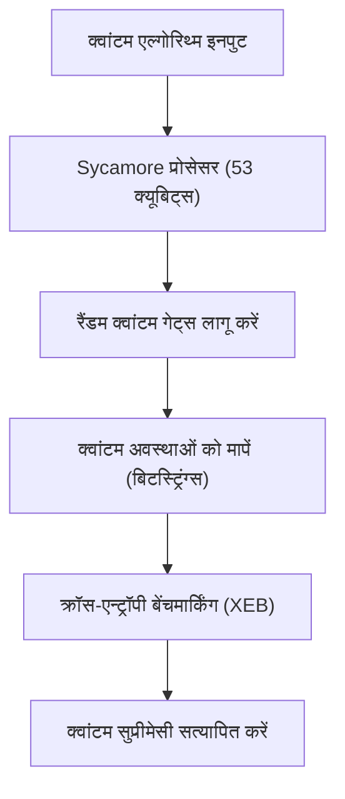
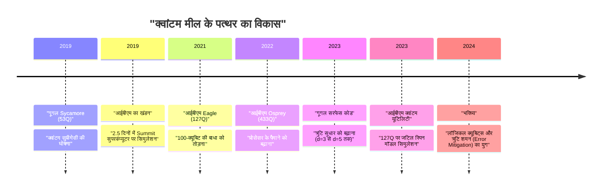
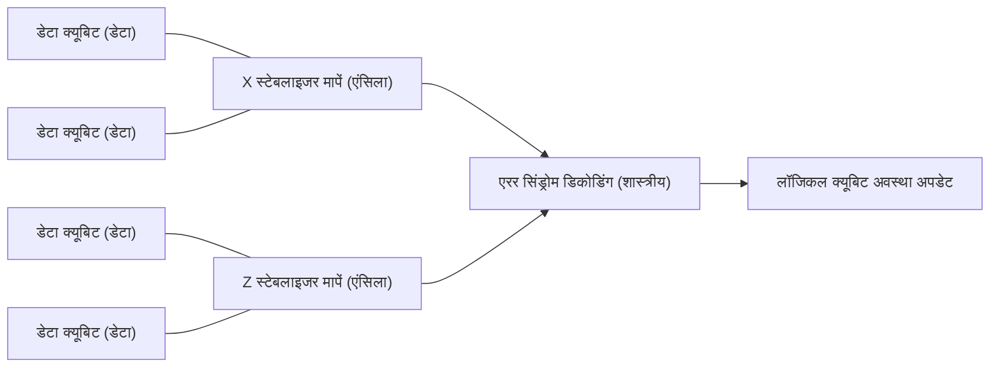

## 1. परिचय: क्वांटम कंप्यूटिंग की सुबह और "क्वांटम सुप्रीमेसी" (क्वांटम सर्वोच्चता)

क्वांटम कंप्यूटिंग, भौतिकी के मूल सिद्धांत क्वांटम यांत्रिकी को सूचना प्रसंस्करण में लागू करके, जटिल समस्याओं को हल करने की क्षमता रखता है जिन्हें शास्त्रीय कंप्यूटर (क्लासिकल कंप्यूटर, जैसे वर्तमान में हम जो पीसी या सुपरकंप्यूटर का उपयोग करते हैं) यथार्थवादी समय सीमा में हल नहीं कर सकते। इस क्षेत्र में लंबे समय तक सैद्धांतिक शोध प्रमुख था, लेकिन हाल के वर्षों में, हार्डवेयर की तीव्र प्रगति के कारण व्यावहारिक उपयोग की ओर प्रतिस्पर्धा तेज हो गई है।

इनमें सबसे ज्यादा ध्यान आकर्षित करने वाले शब्दों में से एक "क्वांटम सुप्रीमेसी (Quantum Supremacy)" है। यह उस क्षण को संदर्भित करता है जब किसी विशिष्ट गणना कार्य में क्वांटम कंप्यूटर शास्त्रीय कंप्यूटर को पछाड़ने वाली गणना क्षमता प्रदर्शित करता है। इस लेख में, हम क्वांटम सुप्रीमेसी की सटीक परिभाषा से शुरुआत करेंगे, 2019 में दुनिया में पहली बार इस मील के पत्थर तक पहुंचने की घोषणा करने वाले गूगल के "Sycamore" प्रोसेसर के प्रयोग का विवरण, इसके खिलाफ आईबीएम का खंडन और उनके अनूठे दृष्टिकोण, और वास्तविक व्यावहारिक उपयोग में सबसे बड़ी बाधा, "क्वांटम त्रुटि सुधार (Quantum Error Correction: QEC)" और "फॉल्ट-टोलरेंट क्वांटम कंप्यूटिंग (Fault-Tolerant Quantum Computing: FTQC)" के नवीनतम रोडमैप पर तकनीकी और गणितीय गहराई के साथ चर्चा करेंगे।

---

## 2. सैद्धांतिक पृष्ठभूमि: क्वांटम गणना की मूल बातें और जटिलता वर्ग (Complexity Classes)

क्वांटम सुप्रीमेसी को समझने के लिए, पहले क्वांटम गणना की गणितीय नींव और कम्प्यूटेशनल जटिलता सिद्धांत में इसके स्थान को समझना आवश्यक है।

### क्यूबिट (Qubit) और सुपरपोजिशन (Superposition)
क्लासिकल कंप्यूटर में सूचना की सबसे छोटी इकाई बिट (0 या 1) होती है, लेकिन क्वांटम कंप्यूटर में क्यूबिट (Qubit) का उपयोग किया जाता है। एक क्यूबिट की अवस्था $|\psi\rangle$, बेसिस अवस्थाओं (Basis states) $|0\rangle$ और $|1\rangle$ के जटिल रेखीय संयोजन (complex linear combination) द्वारा दर्शाई जाती है।

$$
|\psi\rangle = \alpha|0\rangle + \beta|1\rangle
$$

यहाँ, $\alpha, \beta \in \mathbb{C}$ हैं, जो सामान्यीकरण शर्त (normalization condition) $|\alpha|^2 + |\beta|^2 = 1$ को पूरा करते हैं। इस गुण को "सुपरपोजिशन (Superposition)" कहा जाता है।

### एंटैंगलमेंट (Entanglement) और टेंसर प्रोडक्ट
जब कई क्यूबिट होते हैं, तो संपूर्ण सिस्टम की अवस्था को व्यक्तिगत क्यूबिट की अवस्था स्थान (state space) के टेंसर प्रोडक्ट द्वारा दर्शाया जाता है। $n$ क्यूबिट का सिस्टम, $2^n$ आयामी हिल्बर्ट स्पेस $\mathcal{H}^{\otimes n}$ पर एक वेक्टर होता है।

$$
|\Psi\rangle = \sum_{x \in \{0, 1\}^n} c_x |x\rangle
$$

यहाँ, $\sum |c_x|^2 = 1$ है। वह अवस्था जिसमें क्यूबिट स्वतंत्र नहीं होते हैं और एक की अवस्था दूसरे पर निर्भर करती है, उसे "क्वांटम एंटैंगलमेंट (Quantum Entanglement)" कहा जाता है। इसके कारण, क्वांटम कंप्यूटर में एक साथ तेजी से बढ़ते विशाल स्टेट स्पेस को प्रोसेस करने की क्षमता होती है।

### क्वांटम सुप्रीमेसी की कम्प्यूटेशनल जटिलता सैद्धांतिक परिभाषा
कम्प्यूटेशनल जटिलता सिद्धांत में, जिन समस्याओं को शास्त्रीय कंप्यूटर कुशलता से (बहुपद समय या polynomial time में) हल कर सकता है, उस वर्ग को **BPP** (Bounded-error Probabilistic Polynomial time) कहा जाता है। वहीं, जिन समस्याओं को क्वांटम कंप्यूटर कुशलता से हल कर सकता है, उस वर्ग को **BQP** (Bounded-error Quantum Polynomial time) कहा जाता है।

क्वांटम सुप्रीमेसी के प्रदर्शन का मतलब है "एक विशिष्ट कार्य जो BQP में शामिल है लेकिन BPP में नहीं है (या इसकी संभावना बहुत अधिक है) को वास्तविक क्वांटम हार्डवेयर पर निष्पादित करना और शास्त्रीय सुपरकंप्यूटर द्वारा सिमुलेशन को समय और संसाधनों के मामले में पार करना।" यह एक ऐतिहासिक प्रयास है जो विस्तारित चर्च-ट्यूरिंग थीसिस (Extended Church-Turing thesis) ("सभी भौतिक रूप से संभव गणना मॉडल को संभाव्य ट्यूरिंग मशीन द्वारा बहुपद समय में अनुकरण किया जा सकता है") को भौतिक प्रयोग द्वारा गलत साबित करता है।

---

## 3. 2019: गूगल द्वारा क्वांटम सुप्रीमेसी का प्रदर्शन

अक्टूबर 2019 में, Google Quantum AI टीम ने वैज्ञानिक पत्रिका 'Nature' में घोषणा की कि उन्होंने 53-क्यूबिट सुपरकंडक्टिंग प्रोसेसर "Sycamore" का उपयोग करके क्वांटम सुप्रीमेसी हासिल कर ली है।

### Sycamore प्रोसेसर का आर्किटेक्चर
Sycamore प्रोसेसर 54 ट्रांसमोन (Transmon) प्रकार के सुपरकंडक्टिंग क्यूबिट्स से बना है जिन्हें 2-आयामी ग्रिड में व्यवस्थित किया गया है (प्रयोग में 53 का उपयोग किया गया था क्योंकि एक काम नहीं कर रहा था)। आसन्न क्यूबिट्स के बीच ट्यूनेबल कपलर्स (Tunable Couplers) रखे गए थे, जिसने हाई-स्पीड और हाई-प्रिसिजन 2-क्यूबिट गेट्स (iSWAP गेट और कंट्रोल्ड-Z गेट का हाइब्रिड) को महसूस किया।

### रैंडम क्वांटम सर्किट सैंपलिंग (Random Circuit Sampling: RCS)
गूगल ने जो कार्य चुना वह "रैंडम सर्किट सैंपलिंग" है। इसमें यादृच्छिक रूप से (randomly) चुने गए सिंगल-क्यूबिट गेट्स और 2-क्यूबिट गेट्स को कई चक्रों (गहराई $m$) में लागू किया जाता है, और अंतिम अवस्था को मापकर प्राप्त बिटस्ट्रिंग्स के प्रायिकता वितरण (probability distribution) से सैंपलिंग की जाती है।

एक आदर्श (शोर-मुक्त) रैंडम क्वांटम सर्किट से आउटपुट बिटस्ट्रिंग $x$ की प्रायिकता, एक समान वितरण नहीं होती है, बल्कि यह व्यतिकरण फ्रिंज (interference fringes) जैसा पैटर्न दिखाती है जिसे पोर्टर-थॉमस वितरण (Porter-Thomas distribution) कहा जाता है। एक शास्त्रीय कंप्यूटर पर इस वितरण से सैंपलिंग करने के लिए, संपूर्ण अवस्था वेक्टर के सिमुलेशन की आवश्यकता होती है, और कम्प्यूटेशनल जटिलता क्यूबिट्स की संख्या $n$ और सर्किट की गहराई $m$ के साथ घातांकीय (exponentially) रूप से बढ़ती है।

### फिडेलिटी (Fidelity) का मूल्यांकन: लीनियर क्रॉस-एन्ट्रॉपी बेंचमार्क (XEB)
यह साबित करने के लिए कि प्रयोगात्मक परिणाम केवल शोर (noise) नहीं है बल्कि वास्तव में किए गए क्वांटम गणना का परिणाम है, गूगल ने लीनियर क्रॉस-एन्ट्रॉपी बेंचमार्किंग (Linear Cross-Entropy Benchmarking: XEB) का उपयोग किया। प्रयोग में प्राप्त बिटस्ट्रिंग $x_i$ के लिए सर्किट की आदर्श प्रायिकता $P(x_i)$ की गणना शास्त्रीय कंप्यूटर से की जाती है, और फिडेलिटी $\mathcal{F}_{\text{XEB}}$ निम्नलिखित सूत्र द्वारा निकाली जाती है:

$$
\mathcal{F}_{\text{XEB}} = 2^n \langle P(x_i) \rangle_{i} - 1
$$

यदि $\mathcal{F}_{\text{XEB}}$ 0 है, तो इसका अर्थ है पूर्ण शोर, और यदि यह 1 है, तो इसका अर्थ है शोर-मुक्त आदर्श क्वांटम प्रोसेसर। Sycamore प्रोसेसर ने गहराई 20 वाले सर्किट में $\mathcal{F}_{\text{XEB}} \approx 0.002$ (0.2%) हासिल किया। यह पहली नजर में कम लग सकता है, लेकिन यह सांख्यिकीय रूप से महत्वपूर्ण शून्य से अधिक का मूल्य था, और यह $2^{53} \approx 9 \times 10^{15}$ के स्टेट स्पेस को नियंत्रित करने वाली एक आश्चर्यजनक उपलब्धि थी।

समग्र त्रुटि दर (overall error rate) को व्यक्तिगत गेट त्रुटियों, माप त्रुटियों आदि के उत्पाद के रूप में लगभग मॉडल किया गया था:

$$
\mathcal{F} \approx (1 - e_1)^{N_1}(1 - e_2)^{N_2} \cdots \approx \prod_{g \in 1Q} (1 - e_g) \prod_{g \in 2Q} (1 - e_g) \prod_{q} (1 - e_{RO})
$$

(※ $e_g$ गेट त्रुटि है, $e_{RO}$ माप त्रुटि है)

गूगल ने दावा किया कि इस सर्किट को क्लासिकल सुपरकंप्यूटर (Summit) पर सिमुलेट करने में लगभग 10,000 साल लगेंगे। इसके विपरीत, Sycamore ने केवल 200 सेकंड में सैंपलिंग पूरी कर ली।

---

## 4. आईबीएम का खंडन: "सुप्रीमेसी" से "उपयोगिता (Utility)" की ओर

गूगल की घोषणा ने दुनिया भर में हलचल मचा दी, लेकिन आईबीएम, जिसने दुनिया का सबसे बड़ा सुपरकंप्यूटर "Summit" विकसित किया था और जो खुद क्वांटम कंप्यूटर के विकास में अग्रणी है, ने तुरंत एक पेपर प्रकाशित किया जिसमें इस दावे का खंडन किया गया।

### टेंसर नेटवर्क संकुचन (Contraction) द्वारा शास्त्रीय सिमुलेशन में सुधार
आईबीएम के खंडन का मूल यह था कि "शास्त्रीय कंप्यूटर पक्ष पर एल्गोरिथ्म और संसाधनों का अनुकूलन (optimization) अपर्याप्त है।" गूगल ने श्रोडिंगर समीकरण के समय विकास (time evolution) की सीधे गणना करने वाले स्टेट वेक्टर सिमुलेटर को मानकर 10,000 साल का अनुमान लगाया था, लेकिन आईबीएम ने बताया कि "टेंसर नेटवर्क (Tensor Network)" नामक विधि का उपयोग करके सिमुलेशन समय को काफी कम किया जा सकता है।

टेंसर नेटवर्क में, क्वांटम सर्किट के गेट संचालन को बहुआयामी सरणियों (टेंसर) के संचालन के रूप में दर्शाया जाता है, और नेटवर्क के "संकुचन (Contraction)" के क्रम को अनुकूलित किया जाता है। इसके अलावा, उन्होंने दावा किया कि यदि Summit के विशाल 250 PB स्टोरेज (डिस्क और मेमोरी का स्तरीकरण) का पूरी तरह से उपयोग किया जाए, तो संपूर्ण अवस्था वेक्टर को बनाए रखते हुए केवल "ढाई दिन (2.5 दिन)" में उच्च सटीकता के साथ सिमुलेशन संभव है।

### क्वांटम एडवांटेज और क्वांटम यूटिलिटी (Quantum Utility)
इस बहस ने पूरे उद्योग के रुझान को बदल दिया, जो केवल "शास्त्रीय रूप से असंभव कृत्रिम कार्यों को निष्पादित करने (Supremacy)" की जिद से हटकर, "वास्तविक दुनिया की उपयोगी समस्याओं में शास्त्रीय दृष्टिकोण की तुलना में महत्वपूर्ण श्रेष्ठता प्रदर्शित करने (Quantum Advantage)", और आगे चलकर "क्वांटम कंप्यूटर का वैज्ञानिक खोज के नए उपकरण के रूप में काम करना (Quantum Utility)" के चरण में प्रवेश कर गया।

आईबीएम खुद "सुप्रीमेसी" शब्द से बचता है, क्वांटम प्रोसेसर के समग्र प्रदर्शन संकेतक के रूप में "क्वांटम वॉल्यूम (Quantum Volume)" और "CLOPS (Circuit Layer Operations Per Second)" का प्रस्ताव रखता है, और हार्डवेयर के पैमाने (scale) और गुणवत्ता के संतुलन पर जोर देते हुए विकास को आगे बढ़ा रहा है।

---

## 5. अगला फ्रंटियर: त्रुटि शमन (Error Mitigation) और क्वांटम त्रुटि सुधार (QEC)

वर्तमान क्वांटम कंप्यूटरों को "NISQ (Noisy Intermediate-Scale Quantum)" कहा जाता है। ये शोर (बाहरी वातावरण के साथ संपर्क या अपूर्ण नियंत्रण के कारण होने वाली त्रुटियों) के प्रति संवेदनशील होते हैं, और लंबी गणना करने पर परिणाम शोर में दब जाते हैं। इस समस्या को दूर करने के दृष्टिकोण को मुख्य रूप से दो भागों में बांटा जा सकता है: "त्रुटि शमन (Error Mitigation)" और "क्वांटम त्रुटि सुधार (Quantum Error Correction)"।

### त्रुटि शमन (Error Mitigation)
त्रुटि शमन क्वांटम हार्डवेयर को बदले बिना शास्त्रीय पोस्ट-प्रोसेसिंग द्वारा गणना परिणामों के अपेक्षित मान (expected value) से शोर के प्रभाव को दूर करने की एक विधि है। 2023 में, आईबीएम ने अपने 127-क्यूबिट "Eagle" प्रोसेसर को "जीरो-नॉइज़ एक्स्ट्रापोलेशन (Zero-Noise Extrapolation: ZNE)" जैसी त्रुटि शमन तकनीकों के साथ जोड़कर एक जटिल आइसिंग मॉडल (Ising model) के समय विकास सिमुलेशन में अत्याधुनिक अनुमानित टेंसर नेटवर्क विधियों को पार करते हुए "क्वांटम यूटिलिटी" का प्रदर्शन किया।

### क्वांटम त्रुटि सुधार (QEC) और लॉजिकल क्यूबिट्स
हालांकि, अंततः किसी भी जटिल एल्गोरिथ्म (जैसे कि शोर का फैक्टराइजेशन एल्गोरिथ्म (Shor's algorithm) या जटिल क्वांटम रसायन विज्ञान गणना) को निष्पादित करने के लिए, त्रुटि शमन अकेले पर्याप्त नहीं है। इसके लिए "क्वांटम त्रुटि सुधार (QEC)" अपरिहार्य है, जो गतिशील रूप से त्रुटियों का पता लगाता है और उन्हें सुधारता है।

QEC का मुख्य दृष्टिकोण "सरफेस कोड (Surface Code)" है। इस तकनीक में, कई भौतिक क्यूबिट्स (डेटा क्यूबिट्स) को 2-आयामी ग्रिड में व्यवस्थित किया जाता है, और उनके बीच माप क्यूबिट्स (एंसिला क्यूबिट्स, Ancilla qubits) को "स्टेबलाइजर (Stabilizer)" नामक पैरिटी चेक को लगातार करने के लिए रखा जाता है।

#### थ्रेसहोल्ड प्रमेय (Threshold Theorem) और दूरी $d$
क्वांटम त्रुटि सुधार में एक "थ्रेसहोल्ड प्रमेय" होता है। यदि भौतिक क्यूबिट की त्रुटि दर $p$ एक विशिष्ट थ्रेसहोल्ड $p_{th}$ (सरफेस कोड के मामले में लगभग 1%) से कम है, तो कोड की दूरी (Distance) $d$ बढ़ाकर (एक लॉजिकल क्यूबिट के लिए अधिक भौतिक क्यूबिट्स निर्दिष्ट करके) लॉजिकल त्रुटि दर $p_L$ को घातीय (exponentially) रूप से कम किया जा सकता है।

लॉजिकल त्रुटि दर के अनुमानित सूत्र को इस प्रकार व्यक्त किया जाता है:

$$
p_L \approx \Lambda \left( \frac{p}{p_{th}} \right)^{\frac{d+1}{2}}
$$

यहाँ, $\Lambda$ एक स्थिरांक (constant) है। यदि $p < p_{th}$ है, तो $d$ जितना बड़ा होगा, $p_L$ उतना ही छोटा होगा। हालांकि, यदि $p > p_{th}$ है, तो अधिक भौतिक क्यूबिट्स जोड़ने से शोर जमा हो जाएगा और लॉजिकल त्रुटि दर खराब हो जाएगी।

#### गूगल का 2023 माइलस्टोन: दूरी बढ़ाकर त्रुटि में कमी का प्रदर्शन
फरवरी 2023 में, गूगल ने 'Nature' में एक ऐतिहासिक पेपर प्रकाशित किया। उन्होंने अपने तीसरी पीढ़ी के Sycamore प्रोसेसर का उपयोग करके दुनिया में पहली बार यह प्रदर्शित किया कि जब सरफेस कोड की दूरी को $d=3$ (17 भौतिक क्यूबिट्स का उपयोग) से $d=5$ (49 भौतिक क्यूबिट्स का उपयोग) तक बढ़ाया गया, तो लॉजिकल त्रुटि दर थोड़ी कम होकर 3.028% से 2.914% हो गई।

इसका मतलब है कि हमने $p < p_{th}$ के क्षेत्र में कदम रखा है, और यह प्रदर्शित करता है कि FTQC की दिशा में सबसे महत्वपूर्ण अवधारणा का प्रमाण (Proof of Concept) पूरा हो गया है, जहाँ भौतिक क्यूबिट्स बढ़ाने से प्रदर्शन में सुधार होता है।

---

## 6. FTQC (फॉल्ट-टोलरेंट क्वांटम कंप्यूटिंग) की ओर रोडमैप और भविष्य की संभावनाएं

गूगल और आईबीएम, हालांकि अलग-अलग आर्किटेक्चर और दृष्टिकोण अपना रहे हैं, अंतिम लक्ष्य FTQC (फॉल्ट-टोलरेंट क्वांटम कंप्यूटिंग) की दिशा में तीव्र विकास प्रतिस्पर्धा में लगे हुए हैं।

### आईबीएम का दृष्टिकोण: मॉड्यूलरिटी और हेवी-हेक्स (Heavy-Hex) लैटिस
आईबीएम त्रुटि दर को काफी हद तक कम करने के साथ-साथ प्रोसेसर के पैमाने को बढ़ाने पर ध्यान केंद्रित कर रहा है। "Eagle (127Q)", "Osprey (433Q)" और "Condor (1121Q)" के साथ सिंगल-चिप की सीमा को चुनौती देते हुए, उन्होंने "Quantum System Two" नामक एक मॉड्यूलर आर्किटेक्चर की घोषणा की है। इसके अलावा, क्यूबिट्स की कपलिंग टोपोलॉजी के लिए, वे "हेवी-हेक्स (Heavy-Hex) लैटिस" अपनाते हैं, जो अनावश्यक क्रॉसटॉक (crosstalk) को कम करता है और स्थिरता बढ़ाता है। आईबीएम की रणनीति एक हाइब्रिड दृष्टिकोण है, जो अल्पावधि में उन्नत त्रुटि शमन के साथ उपयोगिता को आगे बढ़ाती है और धीरे-धीरे QEC पेश करती है।

### गूगल का दृष्टिकोण: लॉजिकल क्यूबिट्स की गुणवत्ता में सुधार
गूगल की रणनीति भौतिक क्यूबिट्स की संख्या में तेजी से वृद्धि करने के बजाय, एक लॉजिकल क्यूबिट की त्रुटि दर को सीमा तक कम करने (उदाहरण के लिए $10^{-6}$ तक कम करने) पर अधिक केंद्रित है। इसके आधार पर, वे मॉड्यूल के बीच क्वांटम अवस्थाओं को स्थानांतरित करने के लिए प्रौद्योगिकी (Quantum Interconnects) स्थापित करने और एक बड़े पैमाने की प्रणाली का लक्ष्य बना रहे हैं जो समानांतर में हजारों से दसियों हज़ार भौतिक क्यूबिट संचालित करेगी।

मैजिक स्टेट डिस्टिलेशन (Magic State Distillation) जैसे नॉन-क्लिफोर्ड गेट्स को फॉल्ट-टोलरेंट तरीके से लागू करने के लिए प्रोटोकॉल का कार्यान्वयन भी भविष्य में एक बड़ी तकनीकी बाधा होगी। एक व्यावहारिक शोर (Shor) के एल्गोरिथ्म को निष्पादित करने और 2048-बिट आरएसए (RSA) एन्क्रिप्शन को क्रैक करने के लिए, $10^{-8}$ या उससे कम त्रुटि दर वाले हजारों लॉजिकल क्यूबिट्स और लाखों से करोड़ों भौतिक क्यूबिट्स की आवश्यकता होगी, और यह सफर अभी लंबा है।

---

## 7. निष्कर्ष

क्वांटम कंप्यूटर के इतिहास में, "क्वांटम सुप्रीमेसी" एक महत्वपूर्ण मील का पत्थर था जिसने कंप्यूटर की सैद्धांतिक क्षमता को भौतिक रूप से साबित किया। 2019 में गूगल के प्रदर्शन और आईबीएम के रचनात्मक खंडन ने पूरे उद्योग को महज सैद्धांतिक प्रमाण से परे, वास्तविक उपयोगिता (Utility) की खोज और अंततः फॉल्ट-टोलरेंट क्वांटम कंप्यूटिंग (FTQC) की ओर पूर्ण इंजीनियरिंग के युग में धकेल दिया।

वर्तमान में हम शोरगुल वाले NISQ उपकरणों से त्रुटि सुधार से लैस लॉजिकल क्यूबिट उपकरणों के संक्रमण काल ​​के साक्षी बन रहे हैं। अगले कुछ वर्षों से एक दशक के भीतर, इस क्वांटम हार्डवेयर के विकास के साथ-साथ नए सामग्री विज्ञान की खोजें, दवा निर्माण (drug discovery) प्रक्रिया में क्रांति, और अनुकूलन समस्याओं (optimization problems) में सफलताएं एक वास्तविकता बन जाएंगी।

भविष्य के कंप्यूटर विज्ञान को आकार देने वाले गूगल और आईबीएम के साथ-साथ दुनिया भर के शोधकर्ताओं के रुझानों पर नज़र रखना रोमांचक होगा।
