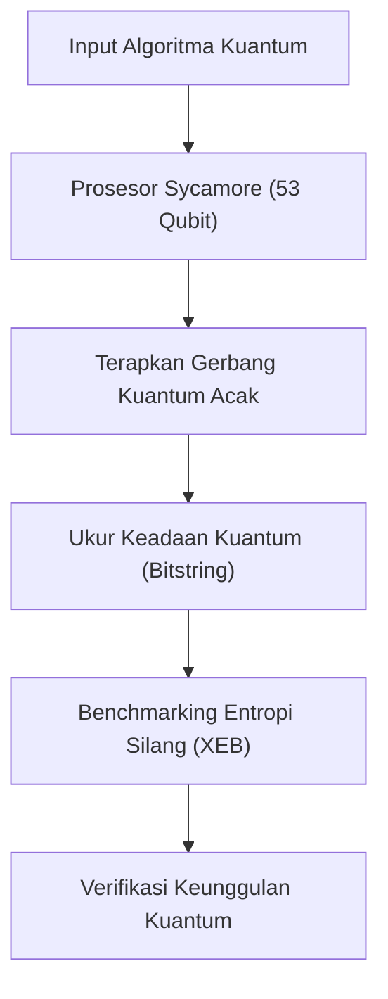
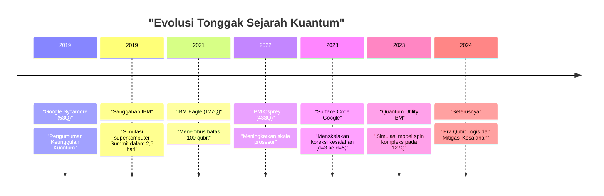
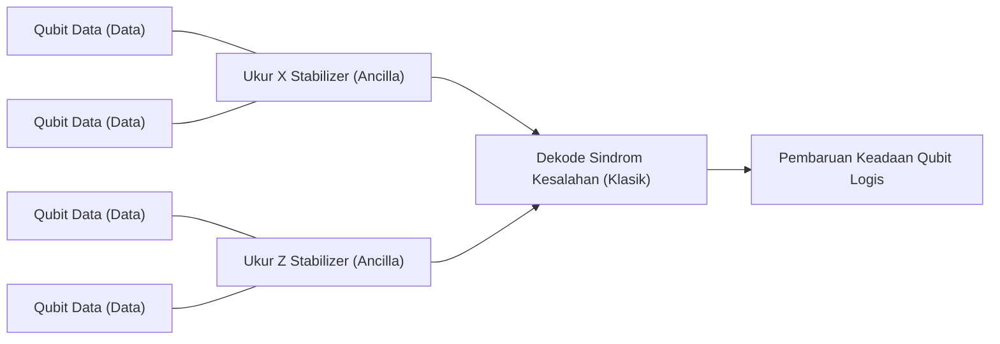

## 1. Pendahuluan: Fajar Komputasi Kuantum dan "Keunggulan Kuantum"

Komputasi kuantum memiliki potensi untuk memecahkan masalah kompleks yang tidak dapat diselesaikan dalam waktu yang realistis oleh komputer klasik (PC dan superkomputer yang biasa kita gunakan sehari-hari) dengan mengaplikasikan mekanika kuantum, prinsip fundamental fisika, ke dalam pemrosesan informasi. Bidang ini telah lama didominasi oleh penelitian teoritis, tetapi dalam beberapa tahun terakhir, kemajuan pesat pada perangkat keras telah mengintensifkan persaingan menuju penerapan praktis.

Salah satu kata kunci yang paling banyak menarik perhatian dalam hal ini adalah "Keunggulan Kuantum (Quantum Supremacy)". Ini merujuk pada momen ketika komputer kuantum menunjukkan kemampuan komputasi yang melampaui komputer klasik dalam tugas komputasi tertentu. Dalam artikel ini, kita akan membahas secara rinci, dari definisi ketat tentang keunggulan kuantum, detail eksperimen dari prosesor "Sycamore" Google yang diumumkan sebagai yang pertama di dunia mencapai tonggak sejarah ini pada tahun 2019, sanggahan dan pendekatan unik dari IBM terhadap hal tersebut, hingga peta jalan terbaru menuju "Koreksi Kesalahan Kuantum (Quantum Error Correction: QEC)" dan "Komputasi Kuantum Toleran Kesalahan (Fault-Tolerant Quantum Computing: FTQC)", yang merupakan hambatan terbesar menuju penerapan praktis yang sesungguhnya, sembari menggali lebih dalam dari sisi teknis dan matematis.

---

## 2. Latar Belakang Teoritis: Dasar Komputasi Kuantum dan Kelas Kompleksitas

Untuk memahami keunggulan kuantum, pertama-tama kita perlu memahami dasar matematis komputasi kuantum dan posisinya dalam teori kompleksitas komputasi.

### Qubit dan Superposisi
Unit informasi terkecil dalam komputer klasik adalah bit (0 atau 1), sedangkan komputer kuantum menggunakan qubit (Quantum bit). Keadaan 1 qubit $|\psi\rangle$ direpresentasikan oleh kombinasi linear kompleks dari keadaan basis $|0\rangle$ dan $|1\rangle$.

$$
|\psi\rangle = \alpha|0\rangle + \beta|1\rangle
$$

Di sini, $\alpha, \beta \in \mathbb{C}$, dan memenuhi kondisi normalisasi $|\alpha|^2 + |\beta|^2 = 1$. Sifat ini disebut "Superposisi (Superposition)".

### Keterikatan (Entanglement) dan Produk Tensor
Ketika ada beberapa qubit, keadaan sistem secara keseluruhan direpresentasikan oleh produk tensor dari ruang keadaan masing-masing qubit. Sistem $n$ qubit akan menjadi vektor dalam ruang Hilbert berdimensi $2^n$ $\mathcal{H}^{\otimes n}$.

$$
|\Psi\rangle = \sum_{x \in \{0, 1\}^n} c_x |x\rangle
$$

Di sini, $\sum |c_x|^2 = 1$. Keadaan di mana qubit tidak independen dan keadaan yang satu bergantung pada keadaan yang lain disebut "Keterikatan Kuantum (Quantum Entanglement)". Hal ini memberikan komputer kuantum potensi untuk memproses ruang keadaan yang sangat luas yang meningkat secara eksponensial dalam waktu yang bersamaan.

### Definisi Teoritis Kompleksitas Komputasi dari Keunggulan Kuantum
Dalam teori kompleksitas komputasi, kelas masalah yang dapat diselesaikan secara efisien (dalam waktu polinomial) oleh komputer klasik disebut **BPP** (Bounded-error Probabilistic Polynomial time). Di sisi lain, kelas masalah yang dapat diselesaikan secara efisien oleh komputer kuantum adalah **BQP** (Bounded-error Quantum Polynomial time).

Mendemonstrasikan keunggulan kuantum berarti "menjalankan tugas tertentu yang termasuk dalam BQP tetapi tidak termasuk dalam BPP (atau kemungkinannya sangat tinggi) pada perangkat keras kuantum nyata, dan mengungguli simulasi oleh superkomputer klasik dari segi waktu dan sumber daya." Hal ini dapat dikatakan sebagai upaya bersejarah untuk menyangkal Tesis Church-Turing yang diperluas ("semua model komputasi yang dapat diwujudkan secara fisik dapat disimulasikan secara efisien dalam waktu polinomial oleh mesin Turing probabilistik") melalui eksperimen fisik.

---

## 3. Tahun 2019: Demonstrasi Keunggulan Kuantum oleh Google

Pada bulan Oktober 2019, tim Google Quantum AI mengumumkan di jurnal ilmiah "Nature" bahwa mereka telah mencapai keunggulan kuantum menggunakan prosesor superkonduktor 53-qubit bernama "Sycamore".

### Arsitektur Prosesor Sycamore
Prosesor Sycamore terdiri dari 54 qubit superkonduktor tipe Transmon yang disusun dalam kisi 2 dimensi (hanya 53 yang digunakan dalam eksperimen karena 1 mengalami kerusakan fungsi). Coupler yang dapat disesuaikan (Tunable Coupler) ditempatkan di antara qubit yang berdekatan untuk merealisasikan gerbang 2-qubit yang cepat dan berpresisi tinggi (hibrida dari gerbang iSWAP dan gerbang kontrol Z).

### Pengambilan Sampel Sirkuit Kuantum Acak (Random Circuit Sampling: RCS)
Tugas yang dipilih oleh Google adalah "Pengambilan Sampel Sirkuit Kuantum Acak". Ini melibatkan penerapan gerbang 1-qubit dan 2-qubit yang dipilih secara acak selama beberapa siklus (kedalaman $m$), lalu mengukur keadaan akhir untuk mengambil sampel dari distribusi probabilitas string bit yang dihasilkan.

Probabilitas bitstring $x$ yang dihasilkan dari sirkuit kuantum acak yang ideal (tanpa noise) bukanlah distribusi seragam, melainkan menunjukkan pola mirip pita interferensi yang disebut distribusi Porter-Thomas. Untuk mengambil sampel dari distribusi ini dengan komputer klasik, diperlukan simulasi dari seluruh vektor keadaan, di mana kompleksitas komputasinya meningkat secara eksponensial terhadap jumlah qubit $n$ dan kedalaman sirkuit $m$.

### Evaluasi Fidelitas (Fidelity): Benchmarking Entropi Silang Linear (XEB)
Untuk membuktikan bahwa hasil eksperimen bukan sekadar noise melainkan hasil dari perhitungan kuantum yang sebenarnya, Google menggunakan Benchmarking Entropi Silang Linear (Linear Cross-Entropy Benchmarking: XEB). Probabilitas ideal $P(x_i)$ dari sirkuit untuk bitstring $x_i$ yang diperoleh dalam eksperimen dihitung dengan komputer klasik, dan fidelitas $\mathcal{F}_{\text{XEB}}$ dicari menggunakan rumus berikut.

$$
\mathcal{F}_{\text{XEB}} = 2^n \langle P(x_i) \rangle_{i} - 1
$$

Jika $\mathcal{F}_{\text{XEB}}$ bernilai 0, maka itu adalah noise murni, dan jika 1, itu berarti prosesor kuantum ideal tanpa noise. Prosesor Sycamore mencapai $\mathcal{F}_{\text{XEB}} \approx 0.002$ (0,2%) pada sirkuit dengan kedalaman 20. Meski sekilas tampak rendah, nilai ini secara statistik lebih besar dari nol secara signifikan, dan merupakan pencapaian luar biasa dalam mengendalikan ruang keadaan sebesar $2^{53} \approx 9 \times 10^{15}$.

Tingkat kesalahan keseluruhan dimodelkan secara perkiraan sebagai produk dari kesalahan gerbang individual, kesalahan pengukuran, dan lain-lain.

$$
\mathcal{F} \approx (1 - e_1)^{N_1}(1 - e_2)^{N_2} \cdots \approx \prod_{g \in 1Q} (1 - e_g) \prod_{g \in 2Q} (1 - e_g) \prod_{q} (1 - e_{RO})
$$

(Keterangan: $e_g$ adalah kesalahan gerbang, $e_{RO}$ adalah kesalahan pengukuran)

Google mengklaim bahwa butuh sekitar 10.000 tahun bagi superkomputer klasik (Summit) untuk menyimulasikan sirkuit ini. Sebaliknya, Sycamore menyelesaikan pengambilan sampel hanya dalam 200 detik.

---

## 4. Sanggahan IBM: Dari "Keunggulan" Menjadi "Kegunaan (Utility)"

Pengumuman Google mengejutkan seluruh dunia, tetapi IBM, pengembang superkomputer terbesar di dunia "Summit" dan pelopor dalam pengembangan komputer kuantum itu sendiri, segera mempublikasikan makalah yang menyanggah klaim tersebut.

### Peningkatan Simulasi Klasik melalui Kontraksi Jaringan Tensor
Inti dari sanggahan IBM adalah bahwa "optimalisasi algoritma dan sumber daya pada sisi komputer klasik masih belum cukup". Google mendasarkan perkiraan 10.000 tahun pada simulator vektor keadaan yang secara langsung menghitung evolusi waktu dari persamaan Schrödinger, tetapi IBM menunjukkan bahwa waktu simulasi dapat dipersingkat secara drastis dengan menggunakan metode yang disebut "Jaringan Tensor (Tensor Network)".

Dalam jaringan tensor, operasi gerbang sirkuit kuantum direpresentasikan sebagai operasi array multidimensi (tensor), dan urutan "kontraksi (Contraction)" jaringan dioptimalkan. Lebih jauh lagi, mereka mengklaim bahwa dengan memanfaatkan sepenuhnya penyimpanan masif Summit yang mencapai 250 PB (hierarki disk dan memori), simulasi berpresisi lebih tinggi dapat diselesaikan hanya dalam "dua setengah hari" dengan tetap menyimpan seluruh vektor keadaan.

### Quantum Advantage dan Quantum Utility
Perdebatan ini memicu pergeseran tren di seluruh industri, dari kebiasaan terpaku pada "melakukan tugas buatan yang mustahil dilakukan secara klasik (Supremacy)" menjadi "menunjukkan keunggulan praktis yang nyata di atas pendekatan klasik pada masalah dunia nyata yang berguna (Quantum Advantage)", dan bahkan menuju fase di mana "komputer kuantum berfungsi sebagai alat baru untuk penemuan ilmiah (Quantum Utility)".

IBM sendiri menghindari penggunaan istilah "keunggulan" dan mengusulkan "Volume Kuantum (Quantum Volume)" serta "CLOPS (Circuit Layer Operations Per Second)" sebagai metrik kinerja komprehensif dari prosesor kuantum, dan mendorong pengembangan yang berfokus pada keseimbangan antara skala dan kualitas perangkat keras.

---

## 5. Frontier Selanjutnya: Mitigasi Kesalahan (Error Mitigation) dan Koreksi Kesalahan Kuantum (QEC)

Komputer kuantum saat ini disebut "NISQ (Noisy Intermediate-Scale Quantum)", rentan terhadap pengaruh noise (kesalahan karena ketidaksempurnaan kontrol atau interaksi dengan lingkungan eksternal), dan hasilnya akan tenggelam dalam noise jika komputasi panjang dilakukan. Pendekatan untuk mengatasi masalah ini secara garis besar terbagi menjadi dua: "Mitigasi Kesalahan (Error Mitigation)" dan "Koreksi Kesalahan Kuantum (Quantum Error Correction)".

### Mitigasi Kesalahan (Error Mitigation)
Mitigasi kesalahan adalah teknik menghilangkan efek noise dari nilai yang diharapkan dari hasil komputasi melalui pemrosesan akhir klasik tanpa mengubah perangkat keras kuantum. Pada tahun 2023, IBM memadukan prosesor "Eagle" 127 qubit dengan teknik mitigasi kesalahan seperti "Ekstrapolasi Nol-Noise (Zero-Noise Extrapolation: ZNE)" untuk mencapai akurasi yang melampaui metode jaringan tensor hampiran paling mutakhir dalam simulasi evolusi waktu dari model Ising kompleks, dengan mendemonstrasikan "Quantum Utility (Kegunaan Kuantum)".

### Koreksi Kesalahan Kuantum (QEC) dan Qubit Logis
Namun, untuk pada akhirnya menjalankan algoritma kompleks apa pun (misalnya algoritma faktorisasi Shor atau komputasi kimia kuantum yang kompleks), mitigasi kesalahan saja tidak cukup, dan "Koreksi Kesalahan Kuantum (QEC)", yang secara dinamis mendeteksi dan memperbaiki kesalahan, mutlak diperlukan.

Pendekatan QEC yang paling umum adalah "Kode Permukaan (Surface Code)". Ini adalah metode di mana beberapa qubit fisik (qubit data) ditempatkan dalam kisi dua dimensi, dan qubit pengukuran (qubit ancilla) ditempatkan di antara mereka untuk terus-menerus menjalankan pengecekan paritas yang disebut "Stabilizer".

#### Teorema Ambang Batas (Threshold Theorem) dan Jarak $d$
Ada "Teorema Ambang Batas" dalam koreksi kesalahan kuantum. Jika tingkat kesalahan qubit fisik $p$ jatuh di bawah ambang batas tertentu $p_{th}$ (sekitar 1% untuk Surface Code), maka tingkat kesalahan logis $p_L$ dapat diturunkan secara eksponensial dengan meningkatkan jarak kode (Distance) $d$ (mengalokasikan lebih banyak qubit fisik ke dalam satu qubit logis).

Persamaan hampiran untuk tingkat kesalahan logis dinyatakan sebagai berikut:

$$
p_L \approx \Lambda \left( \frac{p}{p_{th}} \right)^{\frac{d+1}{2}}
$$

Di sini, $\Lambda$ adalah konstanta. Jika $p < p_{th}$, semakin besar $d$, maka semakin kecil $p_L$. Namun, jika $p > p_{th}$, menambahkan lebih banyak qubit fisik justru akan mengakumulasi noise, dan tingkat kesalahan logis akan memburuk.

#### Tonggak Sejarah Google 2023: Demonstrasi Pengurangan Kesalahan dengan Memperluas Jarak
Pada Februari 2023, Google menerbitkan makalah monumental di jurnal "Nature". Menggunakan prosesor Sycamore generasi ke-3, mereka menjadi yang pertama di dunia mendemonstrasikan bahwa saat jarak Surface Code diperluas dari $d=3$ (menggunakan 17 qubit fisik) menjadi $d=5$ (menggunakan 49 qubit fisik), tingkat kesalahan logis sedikit turun dari 3,028% menjadi 2,914%.

Ini berarti bahwa mereka telah melangkah ke wilayah $p < p_{th}$, dan mengindikasikan bahwa pembuktian konsep (Proof of Concept) yang paling penting menuju FTQC telah diselesaikan: bahwa kinerja akan meningkat seiring dengan penambahan qubit fisik.

---

## 6. Peta Jalan dan Prospek Menuju FTQC (Komputasi Kuantum Toleran Kesalahan)

Google dan IBM sama-sama terlibat dalam persaingan pengembangan yang sengit menuju tujuan akhir FTQC (Fault-Tolerant Quantum Computing), meskipun masing-masing mengambil arsitektur dan pendekatan yang berbeda.

### Pendekatan IBM: Modularisasi dan Kisi Heavy-Hex
Sejalan dengan usahanya untuk secara drastis menurunkan tingkat kesalahan, IBM juga fokus untuk menskalakan prosesornya. Sambil menantang batas-batas chip tunggal dengan "Eagle (127Q)", "Osprey (433Q)", dan "Condor (1121Q)", IBM juga mengumumkan arsitektur modular yang disebut "Quantum System Two". Selain itu, untuk topologi pengikatan antar qubit, mereka menggunakan "Kisi Heavy-Hex" guna mengurangi crosstalk yang tak diinginkan serta meningkatkan stabilitas. Strategi IBM adalah pendekatan hibrida: mengejar kegunaan dalam jangka pendek melalui mitigasi kesalahan mutakhir sambil secara bertahap memperkenalkan QEC.

### Pendekatan Google: Peningkatan Kualitas Qubit Logis
Strategi Google lebih menekankan pada penurunan tingkat kesalahan satu qubit logis serendah mungkin (misalnya menurunkannya menjadi $10^{-6}$) daripada meningkatkan jumlah qubit fisik secara drastis. Berangkat dari titik tersebut, Google berupaya memapankan teknologi interkoneksi kuantum (Quantum Interconnects) untuk mentransfer keadaan kuantum antar modul, membidik sistem skala besar di mana ribuan hingga puluhan ribu qubit fisik dapat beroperasi secara paralel.

Implementasi protokol untuk menjalankan gerbang non-Clifford dengan toleransi kesalahan, seperti penyulingan keadaan ajaib (Magic State Distillation), juga akan menjadi rintangan teknologi utama di masa mendatang. Untuk menjalankan algoritma Shor praktis dan memecahkan enkripsi RSA 2048-bit, kabarnya dibutuhkan ribuan qubit logis dengan tingkat kesalahan $10^{-8}$ atau lebih rendah, yang setara dengan jutaan hingga puluhan juta qubit fisik, menandakan bahwa perjalanan masih panjang.

---

## 7. Penutup

"Keunggulan Kuantum" adalah tonggak penting dalam sejarah komputer kuantum yang secara fisik membuktikan potensi teoritis dari mesin komputasi. Demonstrasi tahun 2019 oleh Google dan sanggahan konstruktif oleh IBM mendorong seluruh industri dari sekadar pembuktian teoritis menuju pencarian kegunaan (Utility) praktis, dan ke era rekayasa nyata yang diarahkan pada komputasi kuantum toleran kesalahan (FTQC).

Saat ini kita sedang menyaksikan periode transisi dari perangkat NISQ yang penuh noise ke perangkat qubit logis yang dilengkapi koreksi kesalahan. Dalam beberapa tahun hingga satu dekade ke depan, penemuan baru dalam ilmu material, revolusi dalam proses penemuan obat, dan terobosan dalam masalah optimisasi akan menjadi kenyataan seiring dengan evolusi perangkat keras kuantum ini.

Kita harus terus mengawasi pergerakan dari Google, IBM, dan para peneliti di seluruh dunia yang sedang membentuk ilmu komputasi masa depan.
