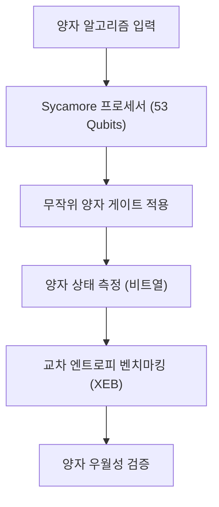
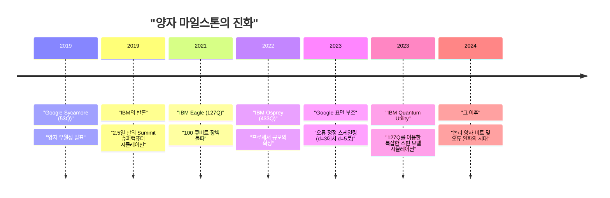
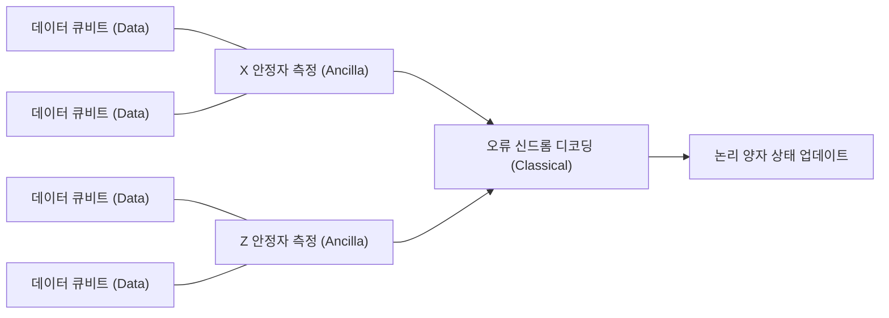

## 1. 머리말: 양자 컴퓨팅의 여명과 '양자 우월성'

양자 컴퓨팅은 물리학의 근본 원리인 양자역학을 정보 처리에 응용함으로써, 고전 컴퓨터(현재 우리가 일상적으로 사용하는 PC나 슈퍼컴퓨터)로는 현실적인 시간 내에 풀 수 없는 복잡한 문제를 해결할 가능성을 품고 있습니다. 이 분야는 오랫동안 이론적인 연구가 주를 이루었으나, 최근 하드웨어의 급속한 진보로 실용화를 향한 경쟁이 격화되고 있습니다.

그 중에서도 가장 큰 주목을 받은 키워드 중 하나가 '양자 우월성(Quantum Supremacy)'입니다. 이는 특정 계산 작업에서 양자 컴퓨터가 고전 컴퓨터를 압도하는 계산 능력을 보여주는 순간을 의미합니다. 본 기사에서는 양자 우월성의 엄밀한 정의를 시작으로, 2019년 세계 최초로 이 마일스톤에 도달했다고 발표한 Google의 'Sycamore(시카모어)' 프로세서의 실험 세부 내용, 이에 대한 IBM의 반론과 독자적인 접근법, 그리고 진정한 실용화를 위한 가장 큰 장벽인 '양자 오류 정정(Quantum Error Correction: QEC)'과 '결함 허용 양자 컴퓨팅(Fault-Tolerant Quantum Computing: FTQC)'을 향한 최신 로드맵에 대해 기술적이고 수학적으로 깊이 있게 해설합니다.

---

## 2. 이론적 배경: 양자 계산의 기초와 복잡도 클래스

양자 우월성을 이해하기 위해서는 먼저 양자 계산의 수학적 기초와 계산 복잡도 이론에서의 위치를 이해해야 합니다.

### 양자 비트와 중첩

고전 컴퓨터에서 정보의 최소 단위는 비트(0 또는 1)이지만, 양자 컴퓨터에서는 양자 비트(Qubit, 큐비트)를 사용합니다. 1개의 양자 비트 상태 $|\psi\rangle$ 는 기저 상태 $|0\rangle$ 와 $|1\rangle$ 의 복소 선형 결합으로 표현됩니다.

$$
|\psi\rangle = \alpha|0\rangle + \beta|1\rangle
$$

여기서 $\alpha, \beta \in \mathbb{C}$ 이며, 규격화 조건 $|\alpha|^2 + |\beta|^2 = 1$ 을 만족합니다. 이 성질을 '중첩(Superposition)'이라고 부릅니다.

### 얽힘(Entanglement)과 텐서곱

여러 양자 비트가 존재할 경우, 시스템 전체의 상태는 개별 양자 비트 상태 공간의 텐서곱으로 표현됩니다. $n$ 양자 비트 시스템은 $2^n$ 차원의 힐베르트 공간 $\mathcal{H}^{\otimes n}$ 상의 벡터가 됩니다.

$$
|\Psi\rangle = \sum_{x \in \{0, 1\}^n} c_x |x\rangle
$$

여기서 $\sum |c_x|^2 = 1$ 입니다. 양자 비트들이 독립적이지 않고 한쪽의 상태가 다른 쪽에 의존하는 상태를 '양자 얽힘(Quantum Entanglement)'이라고 부릅니다. 이를 통해 양자 컴퓨터는 지수함수적으로 방대한 상태 공간을 동시에 처리할 수 있는 잠재력을 갖게 됩니다.

### 양자 우월성의 계산 복잡도 이론적 정의

계산 복잡도 이론에서 고전 컴퓨터가 효율적으로(다항 시간 내에) 풀 수 있는 문제의 클래스를 **BPP**(Bounded-error Probabilistic Polynomial time)라고 부릅니다. 반면, 양자 컴퓨터가 효율적으로 풀 수 있는 문제의 클래스는 **BQP**(Bounded-error Quantum Polynomial time)입니다.

양자 우월성의 실증이란, "BQP에는 포함되지만 BPP에는 포함되지 않는(혹은 그럴 가능성이 매우 높은) 특정 작업을 실제 양자 하드웨어에서 실행하여, 고전 슈퍼컴퓨터에 의한 시뮬레이션을 시간적·자원적으로 능가하는 것"을 의미합니다. 확장된 처치-튜링 명제("모든 물리적으로 실현 가능한 계산 모델은 확률적 튜링 기계에 의해 다항 시간 내에 시뮬레이션할 수 있다")를 물리적인 실험을 통해 반증하는 역사적인 시도라고 할 수 있습니다.

---

## 3. 2019년: Google에 의한 양자 우월성 실증

2019년 10월, Google Quantum AI 팀은 과학 저널 『Nature』를 통해 53 양자 비트의 초전도 프로세서 'Sycamore(시카모어)'를 사용하여 양자 우월성을 달성했다고 발표했습니다.

### Sycamore 프로세서의 아키텍처

Sycamore 프로세서는 2차원 격자 형태로 배치된 54개의 트랜스몬(Transmon)형 초전도 양자 비트로 구성되어 있습니다(실험에서는 1개가 오작동하여 53개를 사용). 인접한 양자 비트 사이에는 가변 결합기(Tunable Coupler)가 배치되어 고속이며 고정밀도인 2 양자 비트 게이트(iSWAP 게이트와 제어 Z 게이트의 하이브리드)를 구현했습니다.

### 무작위 양자 회로 샘플링(Random Circuit Sampling: RCS)

Google이 선택한 작업은 '무작위 양자 회로 샘플링'입니다. 이는 무작위로 선택된 단일 양자 비트 게이트와 2 양자 비트 게이트를 여러 사이클(깊이 $m$)에 걸쳐 적용하고, 최종 상태를 측정하여 얻어지는 비트열의 확률 분포에서 샘플링을 수행하는 것입니다.

이상적인(노이즈가 없는) 무작위 양자 회로에서 출력되는 비트열 $x$ 의 확률은 균일 분포가 아니라 포터-토마스 분포(Porter-Thomas distribution)라고 불리는 간섭무늬와 같은 패턴을 보여줍니다. 고전 컴퓨터로 이 분포에서 샘플링을 하려면 상태 벡터 전체의 시뮬레이션이 필요하며, 계산량은 양자 비트 수 $n$ 과 회로의 깊이 $m$ 에 대해 지수함수적으로 증가합니다.

### 충실도(Fidelity) 평가: 선형 교차 엔트로피 벤치마크(XEB)

실험 결과가 단순한 노이즈가 아니라 실제로 양자 계산이 이루어진 결과임을 증명하기 위해, Google은 선형 교차 엔트로피 벤치마크(Linear Cross-Entropy Benchmarking: XEB)를 사용했습니다. 실험에서 얻은 비트열 $x_i$ 에 대한 회로의 이상적인 확률 $P(x_i)$ 를 고전 컴퓨터로 계산하고, 다음 식을 통해 충실도 $\mathcal{F}_{\text{XEB}}$ 를 구합니다.

$$
\mathcal{F}_{\text{XEB}} = 2^n \langle P(x_i) \rangle_{i} - 1
$$

$\mathcal{F}_{\text{XEB}}$ 가 0이면 완전한 노이즈, 1이면 노이즈가 없는 이상적인 양자 프로세서를 의미합니다. Sycamore 프로세서는 깊이 20의 회로에서 $\mathcal{F}_{\text{XEB}} \approx 0.002$ (0.2%)를 달성했습니다. 언뜻 낮아 보이지만 통계적으로 유의미한 0 이상의 값이며, $2^{53} \approx 9 \times 10^{15}$ 의 상태 공간을 제어한 경이적인 성과였습니다.

전체 오류율은 개별 게이트 오류, 측정 오류 등의 곱으로 근사적으로 모델링되었습니다.

$$
\mathcal{F} \approx (1 - e_1)^{N_1}(1 - e_2)^{N_2} \cdots \approx \prod_{g \in 1Q} (1 - e_g) \prod_{g \in 2Q} (1 - e_g) \prod_{q} (1 - e_{RO})
$$

(※ $e_g$ 는 게이트 오류, $e_{RO}$ 는 측정 오류)

Google은 이 회로를 고전 슈퍼컴퓨터(Summit)로 시뮬레이션하려면 약 1만 년이 걸릴 것이라고 주장했습니다. 반면, Sycamore는 불과 200초 만에 샘플링을 완료했습니다.

---

## 4. IBM의 반론: '우월성'에서 '유용성(Utility)'으로

Google의 발표는 전 세계에 충격을 주었지만, 세계 최대의 슈퍼컴퓨터 'Summit'을 개발하고 스스로도 양자 컴퓨터 개발을 선도하는 IBM은 즉각적으로 이 주장에 반론을 제기하는 논문을 공개했습니다.

### 텐서 네트워크 축약을 통한 고전 시뮬레이션의 개선

IBM 반론의 핵심은 '고전 컴퓨터 측의 알고리즘과 자원 최적화가 불충분하다'는 점에 있었습니다. Google은 슈뢰딩거 방정식의 시간 발전을 그대로 계산하는 상태 벡터 시뮬레이터를 전제로 1만 년이라는 추정치를 제시했지만, IBM은 '텐서 네트워크(Tensor Network)'라는 기법을 사용하면 시뮬레이션 시간을 획기적으로 단축할 수 있다고 지적했습니다.

텐서 네트워크에서는 양자 회로의 게이트 조작을 다차원 배열(텐서) 연산으로 표현하고 네트워크의 '축약(Contraction)' 순서를 최적화합니다. 게다가 Summit이 가진 250 PB라는 거대한 스토리지(디스크와 메모리의 계층화)를 최대한 활용하면 상태 벡터 전체를 유지하면서 단 '2.5일' 만에 더 높은 정밀도의 시뮬레이션이 가능하다고 주장했습니다.

### Quantum Advantage와 Quantum Utility

이 논쟁을 계기로 업계 전체의 트렌드는 단순히 '고전적으로는 불가능한 인공적 작업을 실행하는 것(Supremacy)'에 대한 집착에서, '실제 사회의 유용한 문제에 대해 고전적인 접근법보다 실질적인 우위성을 보여주는 것(Quantum Advantage)', 나아가 '양자 컴퓨터가 과학적 발견의 새로운 도구로서 기능하는 것(Quantum Utility)'이라는 단계로 이행해 갔습니다.

IBM 자체는 '우월성'이라는 단어를 피하고, 양자 프로세서의 종합적인 성능 지표로서 '양자 볼륨(Quantum Volume)'이나 'CLOPS (Circuit Layer Operations Per Second)'를 제창하며 하드웨어의 규모와 품질의 균형을 중시하는 개발을 진행하고 있습니다.

---

## 5. 다음 프론티어: 오류 완화(Error Mitigation)와 양자 오류 정정(QEC)

현재의 양자 컴퓨터는 'NISQ(Noisy Intermediate-Scale Quantum)'라고 불리며, 노이즈(외부 환경과의 상호작용이나 제어의 불완전성으로 인한 오류)의 영향을 받기 쉬워 긴 계산을 수행하면 결과가 노이즈에 묻혀버립니다. 이 문제를 극복하기 위한 접근법에는 크게 '오류 완화(Error Mitigation)'와 '양자 오류 정정(Quantum Error Correction)' 두 가지가 있습니다.

### 오류 완화(Error Mitigation)

오류 완화는 양자 하드웨어를 변경하지 않고 고전적인 후처리를 통해 계산 결과의 기댓값에서 노이즈의 영향을 제거하는 기법입니다. IBM은 2023년 127 양자 비트의 'Eagle' 프로세서와 '영점 노이즈 외삽(Zero-Noise Extrapolation: ZNE)' 등의 오류 완화 기술을 결합하여, 복잡한 이징 모델의 시간 발전 시뮬레이션에서 최첨단 근사 텐서 네트워크 방법을 뛰어넘는 정확도를 달성하며 'Quantum Utility(양자 유용성)'를 실증했습니다.

### 양자 오류 정정(QEC)과 논리 양자 비트

그러나 궁극적으로 임의의 복잡한 알고리즘(예를 들어 Shor의 소인수분해 알고리즘이나 복잡한 양자 화학 계산)을 실행하기 위해서는 오류 완화만으로는 불충분하며, 오류를 동적으로 감지하고 정정하는 '양자 오류 정정(QEC)'이 필수적입니다.

QEC의 주류 접근법이 '표면 부호(Surface Code)'입니다. 이는 여러 물리 양자 비트(데이터 양자 비트)를 2차원 격자 형태로 배치하고, 그 사이에 측정용 양자 비트(앤실라 양자 비트)를 배치하여 '안정자(Stabilizer)'라고 불리는 패리티 검사를 연속적으로 수행하는 기법입니다.

#### 임계값 정리(Threshold Theorem)와 거리 $d$

양자 오류 정정에는 '임계값 정리'가 존재합니다. 물리 양자 비트의 오류율 $p$ 가 특정 임계값 $p_{th}$ (표면 부호의 경우 약 1% 내외)를 밑도는 경우, 부호 거리(Distance) $d$ 를 늘림으로써(더 많은 물리 양자 비트를 1개의 논리 양자 비트에 할당함으로써) 논리 오류율 $p_L$ 을 지수함수적으로 낮출 수 있습니다.

논리 오류율의 근사식은 다음과 같이 표현됩니다.

$$
p_L \approx \Lambda \left( \frac{p}{p_{th}} \right)^{\frac{d+1}{2}}
$$

여기서 $\Lambda$ 는 상수입니다. $p < p_{th}$ 라면 $d$ 를 키울수록 $p_L$ 은 작아집니다. 그러나 $p > p_{th}$ 인 경우, 물리 양자 비트를 늘릴수록 오히려 노이즈가 축적되어 논리 오류율이 악화되고 맙니다.

#### Google의 2023년 마일스톤: 거리 확장을 통한 오류 감소 실증

2023년 2월, Google은 『Nature』에 기념비적인 논문을 발표했습니다. 그들은 3세대 Sycamore 프로세서를 사용하여 표면 부호의 거리를 $d=3$(17 물리 양자 비트 사용)에서 $d=5$(49 물리 양자 비트 사용)로 확장했을 때, 논리 오류율이 3.028%에서 2.914%로 미세하게 감소하는 것을 세계 최초로 실증한 것입니다.

이는 $p < p_{th}$ 영역에 발을 들여놓았음을 의미하며, 물리 양자 비트를 늘리면 늘릴수록 성능이 향상된다는, FTQC를 향한 가장 중요한 원리 증명(Proof of Concept)이 완료되었음을 보여줍니다.

---

## 6. FTQC(결함 허용 양자 컴퓨팅)를 향한 로드맵과 전망

Google과 IBM은 각각 다른 아키텍처와 접근법을 채택하면서도, 최종 목표인 FTQC(Fault-Tolerant Quantum Computing)를 향해 치열한 개발 경쟁을 벌이고 있습니다.

### IBM의 접근법: 모듈화와 헤비 헥스 격자

IBM은 오류율을 철저히 낮추는 것과 병행하여 프로세서의 스케일업에 주력하고 있습니다. 'Eagle(127Q)', 'Osprey(433Q)', 'Condor(1121Q)'로 단일 칩의 한계에 도전하는 한편, 'Quantum System Two'라는 모듈형 아키텍처를 발표했습니다. 또한 양자 비트의 결합 토폴로지에는 불필요한 크로스토크를 줄이고 안정성을 높이는 '헤비 헥스(Heavy-Hex) 격자'를 채택하고 있습니다. IBM의 전략은 단기적으로는 고도화된 오류 완화로 유용성을 추구하면서 단계적으로 QEC를 도입해 나가는 하이브리드 접근법입니다.

### Google의 접근법: 논리 양자 비트의 품질 향상

Google의 전략은 물리 양자 비트의 수를 급격히 늘리기보다는 1개의 논리 양자 비트 오류율을 극한까지 낮추는(예를 들어 $10^{-6}$ 까지 낮추는) 데 중점을 두고 있습니다. 그 바탕 위에 모듈 간 양자 상태를 전송하는 기술(Quantum Interconnects)을 확립하여, 수천~수만 개의 물리 양자 비트를 병렬로 동작시키는 대규모 시스템을 목표로 하고 있습니다.

매직 상태 증류(Magic State Distillation) 등 비클리포드 게이트를 결함 허용적으로 실행하기 위한 프로토콜 구현도 앞으로의 큰 기술적 장애물이 됩니다. 실용적인 Shor의 알고리즘을 실행하여 2048비트의 RSA 암호를 해독하려면 오류율 $10^{-8}$ 이하의 논리 양자 비트가 수천 개, 물리 양자 비트로 환산하면 수백만~수천만 개가 필요하다고 알려져 있어 아직 갈 길이 멉니다.

---

## 7. 맺음말

'양자 우월성'은 양자 컴퓨터 역사상 계산기의 이론적 잠재력을 물리적으로 증명한 중요한 마일스톤이었습니다. Google이 2019년에 보여준 실증과 IBM의 건설적인 반론은 업계 전체를 단순한 이론적 증명에서 벗어나, 실제 유용성(Utility)의 추구, 그리고 최종적인 결함 허용 양자 컴퓨팅(FTQC)을 향한 본격적인 엔지니어링 시대로 밀어 올렸습니다.

현재 우리는 노이즈투성이인 NISQ 장치에서 오류 정정 기능을 갖춘 논리 양자 비트 장치로 넘어가는 과도기에 서 있습니다. 앞으로 몇 년에서 십 년 사이에 새로운 재료 과학의 발견, 신약 개발 프로세스의 혁명, 그리고 최적화 문제의 돌파구가 이러한 양자 하드웨어의 진화와 함께 현실이 될 것입니다.

미래의 컴퓨터 과학을 형성해 나갈 Google과 IBM, 그리고 전 세계 연구자들의 동향에서 앞으로도 눈을 뗄 수 없습니다.
