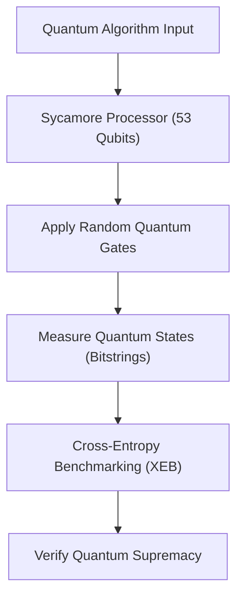
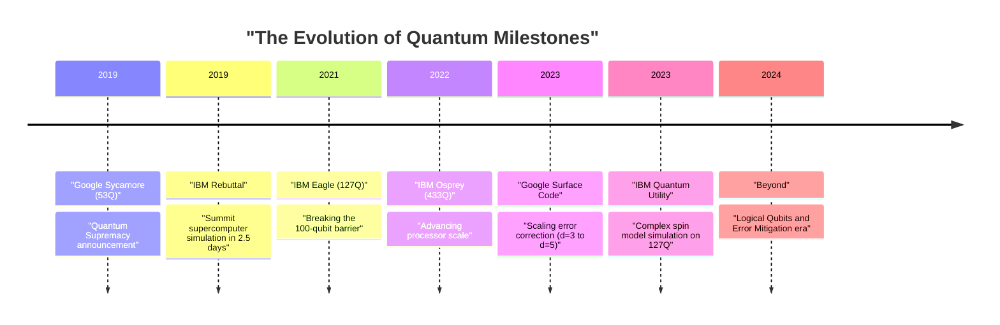
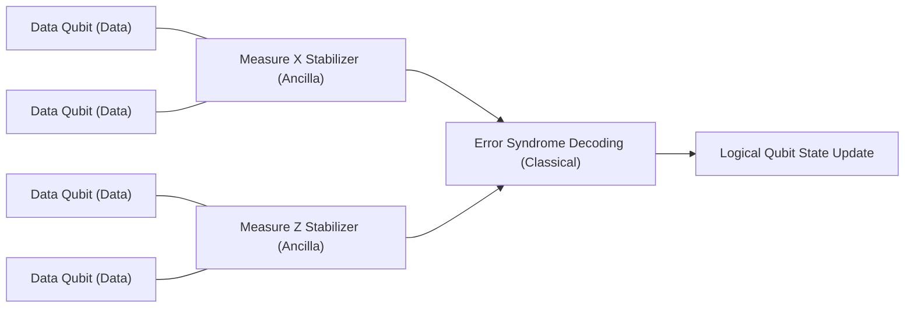

## 1. はじめに：量子コンピューティングの夜明けと「量子超越性」

量子コンピューティングは、物理学の根本原理である量子力学を情報処理に応用することで、古典コンピュータ（現在私たちが日常的に使用しているPCやスーパーコンピュータ）では現実的な時間内で解くことができない複雑な問題を解決する可能性を秘めています。この分野は長らく理論的な研究が主でしたが、近年、ハードウェアの急速な進歩により、実用化に向けた競争が激化しています。

その中で最も注目を集めたキーワードの一つが「量子超越性（Quantum Supremacy）」です。これは、特定の計算タスクにおいて、量子コンピュータが古典コンピュータを圧倒する計算能力を示す瞬間を指します。本記事では、量子超越性の厳密な定義から始まり、2019年に世界で初めてこのマイルストーンに到達したと発表したGoogleの「Sycamore」プロセッサの実験詳細、それに対するIBMの反論と独自のアプローチ、そして真の実用化に向けた最大の障壁である「量子誤り訂正（Quantum Error Correction: QEC）」と「誤り耐性量子計算（Fault-Tolerant Quantum Computing: FTQC）」への最新のロードマップについて、技術的かつ数学的な深掘りを行いつつ解説します。

---

## 2. 理論的背景：量子計算の基礎と複雑性クラス

量子超越性を理解するためには、まず量子計算の数学的基礎と、計算複雑性理論における位置づけを理解する必要があります。

### 量子ビットと重ね合わせ
古典コンピュータにおける情報の最小単位はビット（0または1）ですが、量子コンピュータでは量子ビット（Qubit）を使用します。1つの量子ビットの状態 $|\psi\rangle$ は、基底状態 $|0\rangle$ と $|1\rangle$ の複素線形結合で表されます。

$$
|\psi\rangle = \alpha|0\rangle + \beta|1\rangle
$$

ここで、$\alpha, \beta \in \mathbb{C}$ であり、規格化条件 $|\alpha|^2 + |\beta|^2 = 1$ を満たします。この性質を「重ね合わせ（Superposition）」と呼びます。

### もつれ（Entanglement）とテンソル積
複数の量子ビットが存在する場合、システム全体の状態は個々の量子ビットの状態空間のテンソル積で表されます。$n$ 量子ビットのシステムは、$2^n$ 次元のヒルベルト空間 $\mathcal{H}^{\otimes n}$ 上のベクトルとなります。

$$
|\Psi\rangle = \sum_{x \in \{0, 1\}^n} c_x |x\rangle
$$

ここで、$\sum |c_x|^2 = 1$ です。量子ビット同士が独立しておらず、一方の状態が他方に依存する状態を「量子もつれ（Quantum Entanglement）」と呼びます。これにより、量子コンピュータは指数関数的に広大な状態空間を同時に処理するポテンシャルを持ちます。

### 量子超越性の計算複雑性理論的定義
計算複雑性理論において、古典コンピュータが効率的に（多項式時間で）解ける問題のクラスを **BPP** (Bounded-error Probabilistic Polynomial time) と呼びます。一方、量子コンピュータが効率的に解ける問題のクラスは **BQP** (Bounded-error Quantum Polynomial time) です。

量子超越性の実証とは、「BQPには含まれるが、BPPには含まれない（あるいはその可能性が極めて高い）特定のタスクを、実際の量子ハードウェアで実行し、古典スーパーコンピュータによるシミュレーションを時間的・リソース的に凌駕すること」を意味します。拡張チャーチ・チューリングのテーゼ（「すべての物理的に実現可能な計算モデルは、確率的チューリングマシンによって多項式時間でシミュレートできる」）を物理的な実験によって反証する歴史的な試みと言えます。

---

## 3. 2019年：Googleによる量子超越性の実証

2019年10月、Google Quantum AIチームは科学誌『Nature』にて、53量子ビットの超伝導プロセッサ「Sycamore（シカモア）」を用いて量子超越性を達成したと発表しました。

### Sycamoreプロセッサのアーキテクチャ
Sycamoreプロセッサは、2次元格子状に配置された54個のトランズモン（Transmon）型超伝導量子ビットから構成されています（実験では1個が動作不良だったため53個を使用）。隣接する量子ビット間には可変結合器（Tunable Coupler）が配置され、高速かつ高精度な2量子ビットゲート（iSWAPゲートと制御Zゲートのハイブリッド）を実現しました。

### ランダム量子回路サンプリング（Random Circuit Sampling: RCS）
Googleが選んだタスクは「ランダム量子回路サンプリング」です。これは、ランダムに選ばれた単一量子ビットゲートと2量子ビットゲートを複数サイクル（深さ $m$）にわたって適用し、最終的な状態を測定して得られるビット列の確率分布からサンプリングを行うというものです。

理想的な（ノイズのない）ランダム量子回路から出力されるビット列 $x$ の確率は、均一分布ではなく、ポーター・トーマス分布（Porter-Thomas distribution）と呼ばれる干渉縞のようなパターンを示します。古典コンピュータでこの分布からサンプリングするためには、状態ベクトル全体のシミュレーションが必要となり、計算量は量子ビット数 $n$ と回路の深さ $m$ に対して指数関数的に増加します。

### 忠実度（Fidelity）の評価：線形交差エントロピーベンチマーク（XEB）
実験結果が単なるノイズではなく、実際に量子計算が行われた結果であることを証明するために、Googleは線形交差エントロピーベンチマーク（Linear Cross-Entropy Benchmarking: XEB）を使用しました。実験で得られたビット列 $x_i$ に対する回路の理想的な確率 $P(x_i)$ を古典計算機で計算し、以下の式で忠実度 $\mathcal{F}_{\text{XEB}}$ を求めます。

$$
\mathcal{F}_{\text{XEB}} = 2^n \langle P(x_i) \rangle_{i} - 1
$$

$\mathcal{F}_{\text{XEB}}$ が0であれば完全なノイズ、1であればノイズのない理想的な量子プロセッサを意味します。Sycamoreプロセッサは、深さ20の回路において $\mathcal{F}_{\text{XEB}} \approx 0.002$ (0.2%) を達成しました。一見低く見えますが、統計的に有意なゼロ以上の値であり、$2^{53} \approx 9 \times 10^{15}$ の状態空間を制御した驚異的な成果でした。

全体のエラー率は、個々のゲートエラー、測定エラーなどの積として近似的にモデル化されました。

$$
\mathcal{F} \approx (1 - e_1)^{N_1}(1 - e_2)^{N_2} \cdots \approx \prod_{g \in 1Q} (1 - e_g) \prod_{g \in 2Q} (1 - e_g) \prod_{q} (1 - e_{RO})
$$

（※ $e_g$ はゲートエラー、$e_{RO}$ は測定エラー）

Googleは、この回路を古典スーパーコンピュータ（Summit）でシミュレートするには約1万年かかると主張しました。対して、Sycamoreはわずか200秒でサンプリングを完了しました。

---

## 4. IBMの反論：「超越性」から「有用性（Utility）」へ

Googleの発表は世界中に衝撃を与えましたが、世界最大のスーパーコンピュータ「Summit」を開発し、自らも量子コンピュータ開発を牽引するIBMは、直ちにこの主張に反論する論文を公開しました。

### テンソルネットワーク収縮による古典シミュレーションの改善
IBMの反論の核心は、「古典コンピュータ側のアルゴリズムとリソースの最適化が不十分である」という点にありました。Googleはシュレディンガー方程式の時間発展をそのまま計算する状態ベクトルシミュレータを前提として1万年という見積もりを出しましたが、IBMは「テンソルネットワーク（Tensor Network）」と呼ばれる手法を用いることで、シミュレーション時間を劇的に短縮できると指摘しました。

テンソルネットワークでは、量子回路のゲート操作を多次元配列（テンソル）の演算として表現し、ネットワークの「収縮（Contraction）」の順序を最適化します。さらに、Summitの持つ250 PBという巨大なストレージ（ディスクとメモリの階層化）をフル活用すれば、状態ベクトル全体を保持しつつ、わずか「2日半」でより高精度なシミュレーションが可能であると主張しました。

### Quantum Advantage と Quantum Utility
この議論を契機として、業界全体のトレンドは、単に「古典では不可能な人工的タスクを実行する（Supremacy）」ことへの固執から、「実社会の有用な問題において、古典的アプローチよりも実質的な優位性を示すこと（Quantum Advantage）」、さらには「量子コンピュータが科学的発見の新しいツールとして機能する（Quantum Utility）」というフェーズへと移行していきました。

IBM自身は「超越性」という言葉を避け、量子プロセッサの総合的な性能指標として「量子ボリューム（Quantum Volume）」や「CLOPS (Circuit Layer Operations Per Second)」を提唱し、ハードウェアの規模と品質のバランスを重視した開発を進めています。

---

## 5. 次なるフロンティア：エラー緩和（Error Mitigation）と量子誤り訂正（QEC）

現在の量子コンピュータは「NISQ（Noisy Intermediate-Scale Quantum）」と呼ばれ、ノイズ（外部環境との相互作用や制御の不完全さによるエラー）の影響を受けやすく、長い計算を行うと結果がノイズに埋もれてしまいます。この問題を克服するためのアプローチには、大きく分けて「エラー緩和（Error Mitigation）」と「量子誤り訂正（Quantum Error Correction）」の2つがあります。

### エラー緩和（Error Mitigation）
エラー緩和は、量子ハードウェアを変更することなく、古典的な後処理によって計算結果の期待値からノイズの影響を取り除く手法です。IBMは2023年、127量子ビットの「Eagle」プロセッサと「ゼロノイズ外挿（Zero-Noise Extrapolation: ZNE）」などのエラー緩和技術を組み合わせることで、複雑なイジングモデルの時間発展シミュレーションにおいて、最先端の近似テンソルネットワーク法を超える精度を達成し、「Quantum Utility（量子有用性）」を実証しました。

### 量子誤り訂正（QEC）と論理量子ビット
しかし、最終的に任意の複雑なアルゴリズム（例えばShorの因数分解アルゴリズムや複雑な量子化学計算）を実行するためには、エラー緩和だけでは不十分であり、エラーを動的に検出し訂正する「量子誤り訂正（QEC）」が不可欠です。

QECの主流なアプローチが「表面符号（Surface Code）」です。これは、複数の物理量子ビット（データ量子ビット）を2次元格子状に配置し、その間に測定用量子ビット（アンシラ量子ビット）を配置して「スタビライザー（Stabilizer）」と呼ばれるパリティチェックを連続的に行う手法です。

#### しきい値定理（Threshold Theorem）と距離 $d$
量子誤り訂正には「しきい値定理」が存在します。物理量子ビットのエラー率 $p$ が特定のしきい値 $p_{th}$ （表面符号の場合はおよそ 1% 前後）を下回っている場合、符号距離（Distance）$d$ を大きくする（より多くの物理量子ビットを1つの論理量子ビットに割り当てる）ことで、論理エラー率 $p_L$ を指数関数的に下げることができます。

論理エラー率の近似式は次のように表されます。

$$
p_L \approx \Lambda \left( \frac{p}{p_{th}} \right)^{\frac{d+1}{2}}
$$

ここで、$\Lambda$ は定数です。$p < p_{th}$ であれば、$d$ を大きくするほど $p_L$ は小さくなります。しかし、$p > p_{th}$ の場合、物理量子ビットを増やすほど逆にノイズが蓄積し、論理エラー率が悪化してしまいます。

#### Googleの2023年マイルストーン：距離の拡張によるエラー低減の実証
2023年2月、Googleは『Nature』に記念碑的な論文を発表しました。彼らは第3世代のSycamoreプロセッサを用いて、表面符号の距離を $d=3$（17物理量子ビット使用）から $d=5$（49物理量子ビット使用）に拡張した際、論理エラー率が 3.028% から 2.914% へとわずかに低下することを世界で初めて実証したのです。

これは、$p < p_{th}$ の領域に足を踏み入れたことを意味し、物理量子ビットを増やせば増やすほど性能が向上するという、FTQCに向けた最も重要な原理検証（Proof of Concept）が完了したことを示しています。

---

## 6. FTQC（誤り耐性量子計算）に向けたロードマップと展望

GoogleとIBMは、それぞれ異なるアーキテクチャとアプローチを採用しながらも、最終的な目標であるFTQC（Fault-Tolerant Quantum Computing）に向けて激しい開発競争を繰り広げています。

### IBMのアプローチ：モジュラー化とヘビーヘックス格子
IBMは、エラー率を徹底的に下げることと並行して、プロセッサのスケールアップに注力しています。「Eagle(127Q)」「Osprey(433Q)」「Condor(1121Q)」と単一チップの限界に挑む一方で、「Quantum System Two」というモジュラー型アーキテクチャを発表しました。また、量子ビットの結合トポロジーには、不要なクロストークを減らし、安定性を高める「ヘビーヘックス（Heavy-Hex）格子」を採用しています。IBMの戦略は、短期的には高度なエラー緩和で有用性を追求しつつ、段階的にQECを導入していくハイブリッドなアプローチです。

### Googleのアプローチ：論理量子ビットの品質向上
Googleの戦略は、物理量子ビットの数を急激に増やすよりも、1つの論理量子ビットのエラー率を極限まで下げる（例えば $10^{-6}$ まで下げる）ことに重きを置いています。その上で、モジュール間で量子状態を転送する技術（Quantum Interconnects）を確立し、数千〜数万の物理量子ビットを並列に動作させる大規模システムを目指しています。

マジック状態蒸留（Magic State Distillation）などの非クリフォードゲートを誤り耐性を持って実行するためのプロトコル実装も、今後の大きな技術的ハードルとなります。実用的なShorのアルゴリズムを実行して2048ビットのRSA暗号を解読するには、エラー率 $10^{-8}$ 以下の論理量子ビットが数千個、物理量子ビット換算で数百万〜数千万個必要と言われており、道のりはまだ長いです。

---

## 7. おわりに

「量子超越性」は、量子コンピュータの歴史において、計算機の理論的ポテンシャルを物理的に証明した重要なマイルストーンでした。Googleによる2019年の実証とIBMによる建設的な反論は、業界全体を単なる理論的証明から、実際の有用性（Utility）の追求、そして最終的な誤り耐性量子計算（FTQC）に向けた本格的なエンジニアリングの時代へと押し上げました。

現在私たちは、ノイズまみれのNISQデバイスから、エラー訂正を備えた論理量子ビットデバイスへの過渡期に立ち会っています。今後数年から十年の間に、新しい材料科学の発見、創薬プロセスの革命、そして最適化問題のブレイクスルーが、この量子ハードウェアの進化と共に現実のものとなるでしょう。

未来の計算機科学を形作るGoogleとIBM、そして世界中の研究者たちの動向から、今後も目が離せません。
