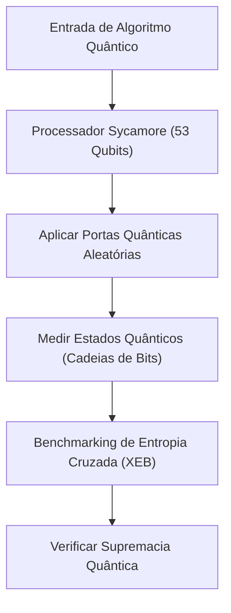
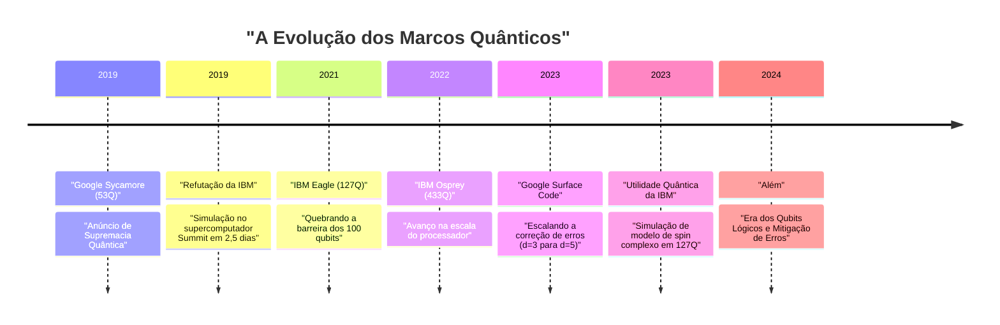
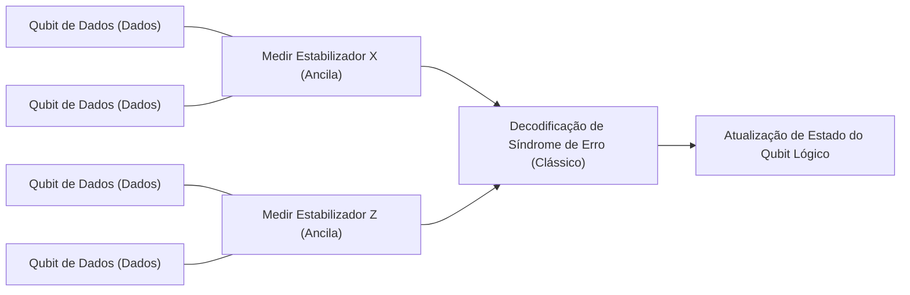

## 1. Introdução: O Amanhecer da Computação Quântica e a "Supremacia Quântica"

A computação quântica tem o potencial de resolver problemas complexos, que não podem ser resolvidos em um tempo realista por computadores clássicos (os PCs e supercomputadores que usamos diariamente hoje), aplicando a mecânica quântica, o princípio fundamental da física, ao processamento de informações. Este campo tem sido predominantemente de pesquisa teórica por muito tempo, mas nos últimos anos, o rápido avanço do hardware tem intensificado a competição pela sua aplicação prática.

Nesse contexto, uma das palavras-chave que mais chamou a atenção foi "Supremacia Quântica" (Quantum Supremacy). Isso se refere ao momento em que um computador quântico demonstra uma capacidade de computação que supera a de um computador clássico em uma tarefa de cálculo específica. Neste artigo, partindo da definição rigorosa de supremacia quântica, explicaremos em detalhes o experimento do processador "Sycamore" do Google, que anunciou ter alcançado este marco pela primeira vez no mundo em 2019, as contra-argumentações e abordagens únicas da IBM em relação a isso, e o mais recente roteiro para a "Correção Quântica de Erros" (Quantum Error Correction: QEC) e a "Computação Quântica Tolerante a Falhas" (Fault-Tolerant Quantum Computing: FTQC), que são as maiores barreiras para a verdadeira aplicação prática, aprofundando-se nos aspectos técnicos e matemáticos.

---

## 2. Antecedentes Teóricos: Fundamentos da Computação Quântica e Classes de Complexidade

Para entender a supremacia quântica, é primeiro necessário entender os fundamentos matemáticos da computação quântica e seu posicionamento na teoria da complexidade computacional.

### Qubits e Sobreposição
A menor unidade de informação em um computador clássico é o bit (0 ou 1), mas em um computador quântico, utiliza-se o qubit (Qubit). O estado de um único qubit $|\psi\rangle$ é representado por uma combinação linear complexa dos estados de base $|0\rangle$ e $|1\rangle$.

$$
|\psi\rangle = \alpha|0\rangle + \beta|1\rangle
$$

Onde $\alpha, \beta \in \mathbb{C}$, e satisfaz a condição de normalização $|\alpha|^2 + |\beta|^2 = 1$. Esta propriedade é chamada de "Sobreposição" (Superposition).

### Emaranhamento (Entanglement) e Produto Tensorial
Quando existem múltiplos qubits, o estado de todo o sistema é representado pelo produto tensorial dos espaços de estados dos qubits individuais. Um sistema de $n$ qubits é um vetor em um espaço de Hilbert $\mathcal{H}^{\otimes n}$ de $2^n$ dimensões.

$$
|\Psi\rangle = \sum_{x \in \{0, 1\}^n} c_x |x\rangle
$$

Onde $\sum |c_x|^2 = 1$. O estado em que os qubits não são independentes entre si e o estado de um depende do outro é chamado de "Emaranhamento Quântico" (Quantum Entanglement). Isso dá aos computadores quânticos o potencial de processar simultaneamente um espaço de estados exponencialmente vasto.

### Definição na Teoria da Complexidade Computacional da Supremacia Quântica
Na teoria da complexidade computacional, a classe de problemas que um computador clássico pode resolver eficientemente (em tempo polinomial) é chamada de **BPP** (Bounded-error Probabilistic Polynomial time). Por outro lado, a classe de problemas que um computador quântico pode resolver eficientemente é a **BQP** (Bounded-error Quantum Polynomial time).

A demonstração da supremacia quântica significa "executar uma tarefa específica incluída em BQP, mas não incluída em BPP (ou com uma probabilidade extremamente alta de não ser), em hardware quântico real e superar a simulação por supercomputadores clássicos em termos de tempo e recursos". Pode-se dizer que é uma tentativa histórica de refutar a tese de Church-Turing estendida ("todos os modelos de computação fisicamente realizáveis podem ser simulados eficientemente por uma máquina de Turing probabilística em tempo polinomial") por meio de um experimento físico.

---

## 3. 2019: Demonstração da Supremacia Quântica pelo Google

Em outubro de 2019, a equipe do Google Quantum AI anunciou na revista científica "Nature" que havia alcançado a supremacia quântica usando o processador supercondutor de 53 qubits "Sycamore".

### Arquitetura do Processador Sycamore
O processador Sycamore consiste em 54 qubits supercondutores do tipo Transmon dispostos em uma grade bidimensional (no experimento, 53 foram usados devido ao mau funcionamento de um). Acopladores variáveis (Tunable Couplers) foram colocados entre qubits adjacentes, realizando portas de 2 qubits (um híbrido de portas iSWAP e portas Z controladas) de alta velocidade e alta precisão.

### Amostragem de Circuito Quântico Aleatório (Random Circuit Sampling: RCS)
A tarefa escolhida pelo Google foi a "amostragem de circuito quântico aleatório". Isso envolve a aplicação de portas de um único qubit e portas de dois qubits escolhidas aleatoriamente ao longo de vários ciclos (profundidade $m$) e, em seguida, a realização de amostragem a partir da distribuição de probabilidade das cadeias de bits obtidas medindo o estado final.

A probabilidade de uma cadeia de bits $x$ ser produzida por um circuito quântico aleatório ideal (sem ruído) não é uma distribuição uniforme, mas mostra um padrão semelhante a franjas de interferência chamado distribuição de Porter-Thomas. Para amostrar dessa distribuição em um computador clássico, é necessária a simulação de todo o vetor de estado, e a complexidade computacional aumenta exponencialmente com o número de qubits $n$ e a profundidade do circuito $m$.

### Avaliação de Fidelidade (Fidelity): Benchmarking de Entropia Cruzada Linear (XEB)
Para provar que os resultados do experimento não eram mero ruído, mas os resultados de cálculos quânticos reais, o Google usou o benchmarking de entropia cruzada linear (Linear Cross-Entropy Benchmarking: XEB). Eles calcularam a probabilidade ideal $P(x_i)$ do circuito para a cadeia de bits $x_i$ obtida no experimento usando um computador clássico e calcularam a fidelidade $\mathcal{F}_{\text{XEB}}$ com a seguinte fórmula:

$$
\mathcal{F}_{\text{XEB}} = 2^n \langle P(x_i) \rangle_{i} - 1
$$

Se $\mathcal{F}_{\text{XEB}}$ for 0, significa ruído puro, e se for 1, significa um processador quântico ideal sem ruído. O processador Sycamore alcançou $\mathcal{F}_{\text{XEB}} \approx 0.002$ (0,2%) em um circuito de profundidade 20. Embora pareça baixo à primeira vista, é um valor estatisticamente significativo maior que zero, sendo uma conquista impressionante de controle de um espaço de estados de $2^{53} \approx 9 \times 10^{15}$.

A taxa de erro geral foi modelada de forma aproximada como o produto de erros de portas individuais, erros de medição, etc.

$$
\mathcal{F} \approx (1 - e_1)^{N_1}(1 - e_2)^{N_2} \cdots \approx \prod_{g \in 1Q} (1 - e_g) \prod_{g \in 2Q} (1 - e_g) \prod_{q} (1 - e_{RO})
$$

（※ Onde $e_g$ é o erro da porta e $e_{RO}$ é o erro de medição）

O Google argumentou que levaria cerca de 10.000 anos para simular esse circuito em um supercomputador clássico (Summit). Em contraste, o Sycamore completou a amostragem em apenas 200 segundos.

---

## 4. A Contra-argumentação da IBM: Da "Supremacia" para a "Utilidade" (Utility)

O anúncio do Google chocou o mundo, mas a IBM, que desenvolveu o maior supercomputador do mundo, o "Summit", e que também lidera o desenvolvimento de computadores quânticos, publicou rapidamente um artigo refutando essa afirmação.

### Melhoria da Simulação Clássica pela Contração de Redes Tensoriais
O núcleo da contra-argumentação da IBM era que "a otimização de algoritmos e recursos no lado do computador clássico foi insuficiente". O Google fez uma estimativa de 10.000 anos presumindo um simulador de vetor de estado que calcula diretamente a evolução temporal da equação de Schrödinger, mas a IBM apontou que o tempo de simulação poderia ser drasticamente reduzido pelo uso de um método chamado "Redes Tensoriais" (Tensor Network).

Nas redes tensoriais, as operações das portas do circuito quântico são representadas como operações de matrizes multidimensionais (tensores), e a ordem de "contração" (Contraction) da rede é otimizada. Além disso, eles argumentaram que, se a enorme capacidade de armazenamento de 250 PB do Summit (uma hierarquia de discos e memória) fosse totalmente utilizada, uma simulação de maior precisão seria possível em apenas "dois dias e meio", mantendo todo o vetor de estado.

### Vantagem Quântica (Quantum Advantage) e Utilidade Quântica (Quantum Utility)
Impulsionada por esse debate, a tendência de toda a indústria mudou da fixação em "executar uma tarefa artificial impossível em meios clássicos (Supremacia)" para "demonstrar uma vantagem substancial sobre a abordagem clássica em problemas úteis do mundo real (Vantagem Quântica)", e ainda mais para a fase em que "os computadores quânticos funcionam como uma nova ferramenta para a descoberta científica (Utilidade Quântica)".

A própria IBM evita o termo "supremacia" e propôs o "Volume Quântico" (Quantum Volume) e "CLOPS (Circuit Layer Operations Per Second)" como indicadores de desempenho abrangentes para processadores quânticos, promovendo o desenvolvimento com ênfase no equilíbrio entre a escala e a qualidade do hardware.

---

## 5. A Próxima Fronteira: Mitigação de Erros (Error Mitigation) e Correção Quântica de Erros (QEC)

Os computadores quânticos atuais são chamados de "NISQ (Noisy Intermediate-Scale Quantum)" e são suscetíveis a ruídos (erros devido à interação com o ambiente externo e controle imperfeito), de modo que, se cálculos longos forem executados, os resultados serão encobertos por ruídos. As abordagens para superar esse problema são amplamente divididas em "Mitigação de Erros" (Error Mitigation) e "Correção Quântica de Erros" (Quantum Error Correction).

### Mitigação de Erros (Error Mitigation)
A mitigação de erros é um método para remover o efeito do ruído do valor esperado do resultado do cálculo por meio de pós-processamento clássico, sem alterar o hardware quântico. Em 2023, a IBM demonstrou a "Utilidade Quântica" combinando o processador "Eagle" de 127 qubits com técnicas de mitigação de erros, como a "Extrapolação de Ruído Zero" (Zero-Noise Extrapolation: ZNE), para alcançar uma precisão superior ao método avançado de aproximação de rede tensorial na simulação da evolução temporal de modelos complexos de Ising.

### Correção Quântica de Erros (QEC) e Qubits Lógicos
No entanto, para executar algoritmos arbitrariamente complexos (por exemplo, o algoritmo de fatoração de Shor ou cálculos de química quântica complexos) em última análise, a mitigação de erros por si só não é suficiente, e a "Correção Quântica de Erros" (QEC), que detecta e corrige erros dinamicamente, é indispensável.

A principal abordagem em QEC é o "Código de Superfície" (Surface Code). Este é um método em que vários qubits físicos (qubits de dados) são dispostos em uma grade bidimensional, e qubits de medição (qubits de ancila) são colocados entre eles para realizar verificações de paridade contínuas chamadas "Estabilizadores" (Stabilizers).

#### Teorema do Limiar (Threshold Theorem) e Distância $d$
Existe um "Teorema do Limiar" para a correção quântica de erros. Quando a taxa de erro $p$ dos qubits físicos está abaixo de um determinado limiar $p_{th}$ (em torno de 1% para o código de superfície), a taxa de erro lógico $p_L$ pode ser reduzida exponencialmente aumentando a distância (Distance) do código $d$ (alocando mais qubits físicos a um qubit lógico).

A fórmula de aproximação para a taxa de erro lógico é expressa da seguinte forma:

$$
p_L \approx \Lambda \left( \frac{p}{p_{th}} \right)^{\frac{d+1}{2}}
$$

Onde $\Lambda$ é uma constante. Se $p < p_{th}$, quanto maior o valor de $d$, menor será $p_L$. No entanto, se $p > p_{th}$, o aumento do número de qubits físicos acumula mais ruído, piorando a taxa de erro lógico.

#### Marco do Google em 2023: Demonstração de Redução de Erros Ampliando a Distância
Em fevereiro de 2023, o Google publicou um artigo monumental na "Nature". Eles usaram seu processador Sycamore de 3ª geração para demonstrar, pela primeira vez no mundo, que ao estender a distância do código de superfície de $d=3$ (usando 17 qubits físicos) para $d=5$ (usando 49 qubits físicos), a taxa de erro lógico diminuiu ligeiramente de 3,028% para 2,914%.

Isso significa que eles entraram no regime $p < p_{th}$, indicando a conclusão da mais importante Prova de Conceito (Proof of Concept) em direção à FTQC, onde o desempenho melhora à medida que o número de qubits físicos aumenta.

---

## 6. Roteiro e Perspectivas para FTQC (Computação Quântica Tolerante a Falhas)

Embora o Google e a IBM adotem arquiteturas e abordagens diferentes, eles estão envolvidos em uma competição acirrada de desenvolvimento em direção ao seu objetivo final: a FTQC (Fault-Tolerant Quantum Computing).

### A Abordagem da IBM: Modularidade e Grade Heavy-Hex
A IBM está se concentrando em aumentar a escala de seus processadores em paralelo com a redução rigorosa da taxa de erro. Enquanto desafiam os limites de chips individuais com "Eagle (127Q)", "Osprey (433Q)" e "Condor (1121Q)", eles anunciaram uma arquitetura modular chamada "Quantum System Two". Além disso, para a topologia de acoplamento dos qubits, eles adotaram uma "Grade Heavy-Hex", que reduz o crosstalk (interferência) indesejado e melhora a estabilidade. A estratégia da IBM é uma abordagem híbrida: buscar a utilidade a curto prazo por meio da mitigação avançada de erros, ao mesmo tempo em que introduz a QEC em etapas.

### A Abordagem do Google: Melhoria da Qualidade dos Qubits Lógicos
A estratégia do Google dá maior ênfase em reduzir drasticamente a taxa de erro de um único qubit lógico (por exemplo, reduzindo para $10^{-6}$), em vez de aumentar rapidamente o número de qubits físicos. Com base nisso, eles visam estabelecer tecnologia de transferência de estados quânticos entre módulos (Interconexões Quânticas) em direção a um sistema em grande escala que opera milhares a dezenas de milhares de qubits físicos em paralelo.

A implementação de protocolos para executar portas não Clifford, como a destilação de estados mágicos (Magic State Distillation), de maneira tolerante a falhas será um grande obstáculo tecnológico no futuro. Diz-se que a execução do algoritmo de Shor na prática para decifrar a criptografia RSA de 2048 bits exigirá milhares de qubits lógicos com uma taxa de erro de $10^{-8}$ ou inferior, o que se traduz em milhões a dezenas de milhões de qubits físicos, o que indica que o caminho ainda é longo.

---

## 7. Conclusão

A "Supremacia Quântica" foi um marco importante na história dos computadores quânticos, provando fisicamente o potencial teórico das máquinas de computação. A demonstração do Google em 2019 e a refutação construtiva da IBM impulsionaram a indústria inteira de uma prova puramente teórica para a busca pela utilidade real (Utility) e, finalmente, para a era de engenharia de larga escala voltada à Computação Quântica Tolerante a Falhas (FTQC).

Estamos atualmente testemunhando o período de transição de dispositivos NISQ ruidosos para dispositivos de qubits lógicos equipados com correção de erros. Nos próximos anos a décadas, a descoberta de novos materiais científicos, a revolução nos processos de descoberta de medicamentos e os avanços nos problemas de otimização se tornarão realidade junto com esta evolução do hardware quântico.

Devemos continuar de olho nas tendências do Google e da IBM, bem como dos pesquisadores em todo o mundo, à medida que moldam a ciência da computação do futuro.
