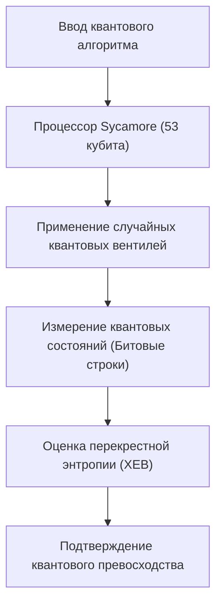
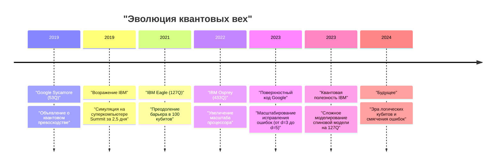
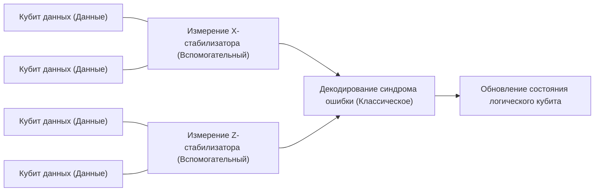

## 1. Введение: Рассвет квантовых вычислений и «квантовое превосходство»

Квантовые вычисления таят в себе потенциал решения сложных проблем, которые классические компьютеры (ПК и суперкомпьютеры, которыми мы пользуемся каждый день) не могут решить за разумное время, применяя квантовую механику, фундаментальный принцип физики, к обработке информации. Эта область долгое время оставалась преимущественно теоретической, но в последние годы из-за быстрого развития аппаратного обеспечения конкуренция за практическое применение обострилась.

Одним из ключевых слов, привлекших наибольшее внимание в этом контексте, является «квантовое превосходство» (Quantum Supremacy). Оно означает момент, когда квантовый компьютер демонстрирует вычислительную мощность, превосходящую возможности классического компьютера в выполнении определенной вычислительной задачи. В этой статье мы начнем со строгого определения квантового превосходства, подробно рассмотрим эксперимент с процессором Google «Sycamore», который, как было объявлено в 2019 году, впервые в мире достиг этой вехи, возражения IBM и их собственный подход, а также углубимся в технические и математические детали последней дорожной карты к «квантовому исправлению ошибок» (Quantum Error Correction: QEC) и «отказоустойчивым квантовым вычислениям» (Fault-Tolerant Quantum Computing: FTQC), которые являются главными препятствиями на пути к истинному практическому применению.

---

## 2. Теоретические основы: Основы квантовых вычислений и классы сложности

Чтобы понять квантовое превосходство, сначала необходимо понять математические основы квантовых вычислений и их место в теории вычислительной сложности.

### Квантовые биты и суперпозиция
Наименьшей единицей информации в классическом компьютере является бит (0 или 1), но в квантовом компьютере используются квантовые биты (кубиты, Qubit). Состояние одного кубита $|\psi\rangle$ выражается как комплексная линейная комбинация базисных состояний $|0\rangle$ и $|1\rangle$.

$$
|\psi\rangle = \alpha|0\rangle + \beta|1\rangle
$$

Здесь $\alpha, \beta \in \mathbb{C}$ и удовлетворяют условию нормировки $|\alpha|^2 + |\beta|^2 = 1$. Это свойство называется «суперпозицией» (Superposition).

### Запутанность (Entanglement) и тензорное произведение
Когда присутствует несколько кубитов, состояние всей системы выражается тензорным произведением пространств состояний отдельных кубитов. Система из $n$ кубитов является вектором в $2^n$-мерном гильбертовом пространстве $\mathcal{H}^{\otimes n}$.

$$
|\Psi\rangle = \sum_{x \in \{0, 1\}^n} c_x |x\rangle
$$

Здесь $\sum |c_x|^2 = 1$. Состояние, в котором кубиты не независимы, а состояние одного зависит от состояния другого, называется «квантовой запутанностью» (Quantum Entanglement). Это дает квантовым компьютерам потенциал для одновременной обработки экспоненциально огромного пространства состояний.

### Определение квантового превосходства с точки зрения теории вычислительной сложности
В теории вычислительной сложности класс задач, которые эффективно (за полиномиальное время) могут быть решены классическим компьютером, называется **BPP** (Bounded-error Probabilistic Polynomial time). С другой стороны, класс задач, которые эффективно решает квантовый компьютер, — это **BQP** (Bounded-error Quantum Polynomial time).

Демонстрация квантового превосходства означает «выполнение определенной задачи, которая принадлежит классу BQP, но не принадлежит BPP (или вероятность этого крайне высока), на реальном квантовом оборудовании, и превосходство над симуляцией на классическом суперкомпьютере по времени и ресурсам». Это можно назвать исторической попыткой физического опровержения расширенного тезиса Черча-Тьюринга («любая физически реализуемая вычислительная модель может быть смоделирована вероятностной машиной Тьюринга за полиномиальное время»).

---

## 3. 2019 год: Демонстрация квантового превосходства от Google

В октябре 2019 года команда Google Quantum AI объявила в научном журнале *Nature*, что они достигли квантового превосходства, используя сверхпроводящий процессор «Sycamore» с 53 кубитами.

### Архитектура процессора Sycamore
Процессор Sycamore состоит из 54 сверхпроводящих кубитов типа трансмон (Transmon), расположенных в виде двумерной решетки (в эксперименте использовалось 53, так как один был неисправен). Между соседними кубитами расположены перестраиваемые связи (Tunable Coupler), реализующие высокоскоростные и высокоточные двухкубитные вентили (гибрид вентиля iSWAP и управляемого Z-вентиля).

### Сэмплинг случайных квантовых цепей (Random Circuit Sampling: RCS)
Задача, выбранная Google, — «сэмплинг случайных квантовых цепей». Она заключается в применении случайно выбранных однокубитных и двухкубитных вентилей на протяжении нескольких циклов (глубина $m$), измерении конечного состояния и получении сэмплов из результирующего распределения вероятностей битовых строк.

Вероятность получения битовой строки $x$ на выходе идеальной (без шума) случайной квантовой цепи представляет собой не равномерное распределение, а паттерн, похожий на интерференционную картину, называемый распределением Портера-Томаса (Porter-Thomas distribution). Чтобы получить выборку из этого распределения на классическом компьютере, необходимо смоделировать весь вектор состояния, и вычислительная сложность возрастает экспоненциально относительно количества кубитов $n$ и глубины цепи $m$.

### Оценка точности (Fidelity): Линейная перекрестная энтропия (XEB)
Чтобы доказать, что результаты эксперимента — это не просто шум, а результаты реально выполненных квантовых вычислений, Google использовала оценку линейной перекрестной энтропии (Linear Cross-Entropy Benchmarking: XEB). Идеальная вероятность цепи $P(x_i)$ для битовой строки $x_i$, полученной в эксперименте, рассчитывается на классическом компьютере, и точность $\mathcal{F}_{\text{XEB}}$ определяется по следующей формуле:

$$
\mathcal{F}_{\text{XEB}} = 2^n \langle P(x_i) \rangle_{i} - 1
$$

Если $\mathcal{F}_{\text{XEB}}$ равно 0, это означает полный шум, если 1 — идеальный квантовый процессор без шума. Процессор Sycamore достиг $\mathcal{F}_{\text{XEB}} \approx 0.002$ (0,2%) для цепи глубиной 20. На первый взгляд это значение кажется низким, но это статистически значимая величина, превышающая ноль, и она стала удивительным достижением контроля над пространством состояний размером $2^{53} \approx 9 \times 10^{15}$.

Общий уровень ошибок приближенно моделировался как произведение ошибок отдельных вентилей, ошибок измерения и т.д.

$$
\mathcal{F} \approx (1 - e_1)^{N_1}(1 - e_2)^{N_2} \cdots \approx \prod_{g \in 1Q} (1 - e_g) \prod_{g \in 2Q} (1 - e_g) \prod_{q} (1 - e_{RO})
$$

(※ $e_g$ — ошибка вентиля, $e_{RO}$ — ошибка измерения)

Google утверждала, что моделирование этой цепи на классическом суперкомпьютере (Summit) займет около 10 000 лет. Sycamore, напротив, завершил сэмплинг всего за 200 секунд.

---

## 4. Возражения IBM: От «превосходства» к «полезности» (Utility)

Объявление Google шокировало мир, но IBM, разработчик крупнейшего в мире суперкомпьютера «Summit» и лидер в разработке квантовых компьютеров, немедленно опубликовала статью, опровергающую это заявление.

### Улучшение классической симуляции за счет свертки тензорных сетей
Суть возражений IBM заключалась в том, что «алгоритмы и оптимизация ресурсов на стороне классического компьютера были недостаточны». Оценка Google в 10 000 лет основывалась на симуляторе вектора состояния, который напрямую вычисляет эволюцию во времени уравнения Шрёдингера, но IBM отметила, что время симуляции можно резко сократить, используя метод, называемый «тензорной сетью» (Tensor Network).

В тензорных сетях операции вентилей в квантовой цепи представляются как вычисления с многомерными массивами (тензорами), и оптимизируется порядок «свертки» (Contraction) сети. Кроме того, они утверждали, что если полностью использовать огромное хранилище Summit объемом 250 ПБ (иерархическая структура дисков и памяти), можно выполнить более точную симуляцию всего за «два с половиной дня», сохраняя при этом весь вектор состояния.

### Квантовое преимущество (Quantum Advantage) и Квантовая полезность (Quantum Utility)
Под влиянием этих дебатов тенденция во всей индустрии сместилась от простой зацикленности на «выполнении искусственных задач, невозможных для классических компьютеров (Supremacy)» к фазе «демонстрации существенного преимущества над классическими подходами в полезных задачах реального мира (Quantum Advantage)», а затем и к фазе, когда «квантовые компьютеры служат новым инструментом для научных открытий (Quantum Utility)».

Сама компания IBM избегает слова «превосходство» и предлагает «Квантовый объем» (Quantum Volume) и «CLOPS (Circuit Layer Operations Per Second)» в качестве комплексных показателей производительности квантовых процессоров, продвигая разработки с акцентом на баланс масштаба и качества оборудования.

---

## 5. Следующий рубеж: Смягчение ошибок (Error Mitigation) и квантовое исправление ошибок (QEC)

Современные квантовые компьютеры называются «NISQ» (Noisy Intermediate-Scale Quantum) и подвержены влиянию шума (ошибок, вызванных взаимодействием с внешней средой и несовершенством управления), из-за чего результаты длительных вычислений тонут в шуме. Подходы к преодолению этой проблемы можно разделить на две основные категории: «смягчение ошибок» (Error Mitigation) и «квантовое исправление ошибок» (Quantum Error Correction).

### Смягчение ошибок (Error Mitigation)
Смягчение ошибок — это метод устранения влияния шума на ожидаемое значение результатов вычислений с помощью классической постобработки, без изменения квантового аппаратного обеспечения. В 2023 году IBM, объединив 127-кубитный процессор «Eagle» с методами смягчения ошибок, такими как «экстраполяция нулевого шума» (Zero-Noise Extrapolation: ZNE), достигла точности, превосходящей передовые методы аппроксимации тензорных сетей, в моделировании временной эволюции сложной модели Изинга, тем самым продемонстрировав «Квантовую полезность» (Quantum Utility).

### Квантовое исправление ошибок (QEC) и логические кубиты
Однако для выполнения алгоритмов произвольной сложности (например, алгоритма факторизации Шора или сложных квантово-химических расчетов) одного лишь смягчения ошибок недостаточно. Совершенно необходимо «квантовое исправление ошибок» (QEC), которое динамически обнаруживает и исправляет ошибки.

Основным подходом к QEC является «поверхностный код» (Surface Code). В этом методе множество физических кубитов (кубитов данных) размещаются в виде двумерной решетки, а между ними располагаются кубиты для измерения (вспомогательные кубиты, Ancilla), которые непрерывно выполняют проверки четности, называемые «стабилизаторами» (Stabilizer).

#### Теорема о пороге (Threshold Theorem) и расстояние $d$
Для квантового исправления ошибок существует «теорема о пороге». Если уровень ошибок физического кубита $p$ падает ниже определенного порога $p_{th}$ (для поверхностного кода это около 1%), то путем увеличения кодового расстояния (Distance) $d$ (назначения большего количества физических кубитов одному логическому кубиту) можно экспоненциально снизить уровень логических ошибок $p_L$.

Приближенная формула для уровня логических ошибок выглядит следующим образом:

$$
p_L \approx \Lambda \left( \frac{p}{p_{th}} \right)^{\frac{d+1}{2}}
$$

Где $\Lambda$ — константа. Если $p < p_{th}$, то чем больше $d$, тем меньше становится $p_L$. Однако если $p > p_{th}$, увеличение количества физических кубитов, наоборот, приводит к накоплению шума и ухудшению уровня логических ошибок.

#### Веха Google 2023 года: Демонстрация снижения ошибок за счет увеличения расстояния
В феврале 2023 года Google опубликовала эпохальную статью в журнале *Nature*. Используя процессор Sycamore 3-го поколения, они впервые в мире продемонстрировали, что при увеличении расстояния поверхностного кода с $d=3$ (используется 17 физических кубитов) до $d=5$ (используется 49 физических кубитов), уровень логических ошибок незначительно снижается с 3,028% до 2,914%.

Это означает вступление в область $p < p_{th}$ и свидетельствует о завершении важнейшей проверки концепции (Proof of Concept) на пути к FTQC, подтверждающей, что чем больше физических кубитов, тем выше производительность.

---

## 6. Дорожная карта и перспективы FTQC (отказоустойчивых квантовых вычислений)

Google и IBM ведут ожесточенную конкуренцию в разработке на пути к своей конечной цели — FTQC (Fault-Tolerant Quantum Computing), применяя при этом разные архитектуры и подходы.

### Подход IBM: Модульность и решетка Heavy-Hex
IBM фокусируется на масштабировании процессоров наряду с радикальным снижением уровня ошибок. Бросая вызов ограничениям одного чипа с помощью процессоров «Eagle (127Q)», «Osprey (433Q)» и «Condor (1121Q)», они также анонсировали модульную архитектуру под названием «Quantum System Two». Кроме того, для топологии связи кубитов они используют решетку «Heavy-Hex», которая снижает нежелательные перекрестные помехи и повышает стабильность. Стратегия IBM — это гибридный подход, при котором в краткосрочной перспективе они стремятся к полезности за счет продвинутого смягчения ошибок, постепенно внедряя QEC.

### Подход Google: Повышение качества логических кубитов
Стратегия Google больше сосредоточена на максимальном снижении уровня ошибок одного логического кубита (например, до $10^{-6}$), чем на быстром увеличении количества физических кубитов. Опираясь на это, они стремятся создать крупномасштабные системы, в которых работают параллельно тысячи и десятки тысяч физических кубитов, разрабатывая технологии передачи квантовых состояний между модулями (Quantum Interconnects).

Реализация протоколов для отказоустойчивого выполнения неклиффордовых вентилей, таких как дистилляция магических состояний (Magic State Distillation), также станет серьезным техническим препятствием в будущем. Считается, что для выполнения практического алгоритма Шора и взлома 2048-битного шифра RSA потребуются тысячи логических кубитов с уровнем ошибок ниже $10^{-8}$, что эквивалентно миллионам или десяткам миллионов физических кубитов, так что путь еще долгий.

---

## 7. Заключение

«Квантовое превосходство» стало важной вехой в истории квантовых компьютеров, физически доказавшей теоретический потенциал этих вычислительных машин. Демонстрация Google в 2019 году и конструктивные возражения IBM перевели всю индустрию от простых теоретических доказательств к поиску реальной полезности (Utility) и началу эпохи серьезной инженерии, направленной на достижение отказоустойчивых квантовых вычислений (FTQC).

Сейчас мы являемся свидетелями переходного периода от зашумленных устройств NISQ к устройствам на логических кубитах с исправлением ошибок. В течение следующих нескольких лет или десятилетия новые открытия в материаловедении, революция в процессах разработки лекарств и прорывы в решении задач оптимизации станут реальностью благодаря эволюции этого квантового оборудования.

В дальнейшем мы будем пристально следить за развитием Google, IBM и исследователей со всего мира, которые формируют будущее компьютерных наук.
