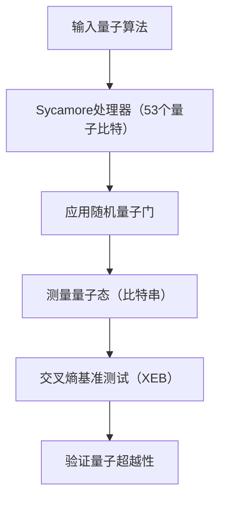
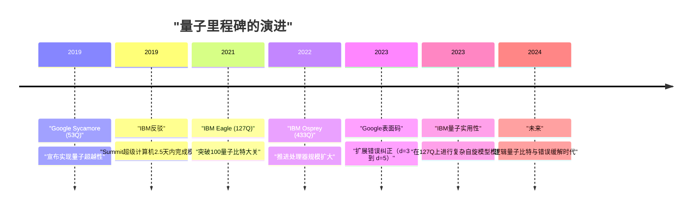
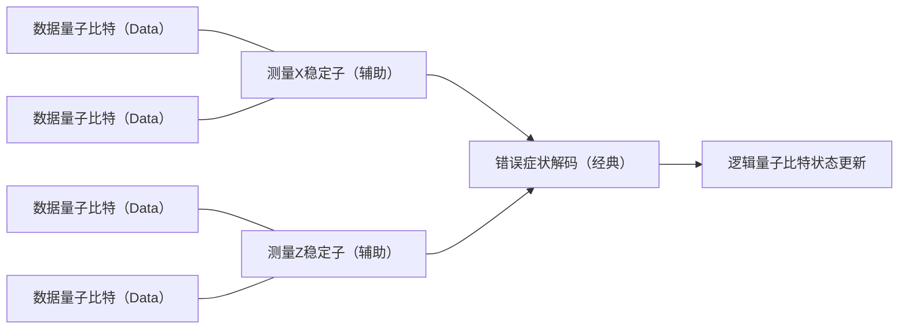

## 1. 引言：量子计算的黎明与“量子超越性”

量子计算通过将作为物理学根本原理的量子力学应用于信息处理，蕴含着解决经典计算机（我们现在日常使用的个人电脑和超级计算机）在现实时间内无法解决的复杂问题的潜力。这一领域长期以来以理论研究为主，但近年来，随着硬件的快速进步，迈向实用化的竞争正日益激烈。

其中最受瞩目的关键词之一就是“量子超越性（Quantum Supremacy）”。这指的是在特定的计算任务中，量子计算机展现出压倒经典计算机计算能力的瞬间。本文将从量子超越性的严格定义出发，详细探讨2019年宣布在世界上首次达成这一里程碑的Google“Sycamore”处理器的实验细节、IBM对此的反驳及独特方法，以及迈向真正实用化的最大障碍——“量子纠错（Quantum Error Correction: QEC）”和“容错量子计算（Fault-Tolerant Quantum Computing: FTQC）”的最新路线图，并进行技术和数学层面的深入解说。

---

## 2. 理论背景：量子计算的基础与复杂性类

为了理解量子超越性，首先需要理解量子计算的数学基础及其在计算复杂性理论中的定位。

### 量子比特与叠加态
经典计算机中信息的最小单位是比特（0或1），而量子计算机使用的是量子比特（Qubit）。1个量子比特的状态 $|\psi\rangle$ 可以表示为基态 $|0\rangle$ 和 $|1\rangle$ 的复数线性组合。

$$
|\psi\rangle = \alpha|0\rangle + \beta|1\rangle
$$

这里，$\alpha, \beta \in \mathbb{C}$，且满足归一化条件 $|\alpha|^2 + |\beta|^2 = 1$。这种性质被称为“叠加（Superposition）”。

### 纠缠（Entanglement）与张量积
当存在多个量子比特时，整个系统的状态由各个量子比特状态空间的张量积表示。$n$ 个量子比特的系统是 $2^n$ 维希尔伯特空间 $\mathcal{H}^{\otimes n}$ 上的向量。

$$
|\Psi\rangle = \sum_{x \in \{0, 1\}^n} c_x |x\rangle
$$

这里，$\sum |c_x|^2 = 1$。量子比特之间并不独立，一个的状态依赖于另一个状态的情形被称为“量子纠缠（Quantum Entanglement）”。借助这一点，量子计算机具有同时处理呈指数级广阔状态空间的潜力。

### 量子超越性的计算复杂性理论定义
在计算复杂性理论中，经典计算机能够高效（在多项式时间内）解决的问题类被称为 **BPP** (Bounded-error Probabilistic Polynomial time)。另一方面，量子计算机能够高效解决的问题类是 **BQP** (Bounded-error Quantum Polynomial time)。

实证量子超越性意味着“在实际的量子硬件上执行包含在BQP中但不包含在BPP中（或可能性极高）的特定任务，并在时间与资源上凌驾于经典超级计算机的模拟”。可以说，这是通过物理实验来反驳扩展丘奇-图灵论题（“所有物理上可实现的计算模型都能由概率图灵机在多项式时间内模拟”）的历史性尝试。

---

## 3. 2019年：Google对量子超越性的实证

2019年10月，Google Quantum AI团队在科学期刊《Nature》上宣布，他们使用53个量子比特的超导处理器“Sycamore（悬铃木）”实现了量子超越性。

### Sycamore处理器的架构
Sycamore处理器由呈二维网格状排列的54个Transmon型超导量子比特组成（实验中由于1个出现故障，实际使用了53个）。相邻量子比特之间配置了可调耦合器（Tunable Coupler），实现了高速且高精度的双量子比特门（iSWAP门和控制Z门的混合）。

### 随机量子电路采样（Random Circuit Sampling: RCS）
Google选择的任务是“随机量子电路采样”。该任务通过在多个周期（深度 $m$）内应用随机选择的单量子比特门和双量子比特门，测量最终状态，并从获得的比特串的概率分布中进行采样。

理想（无噪声）的随机量子电路输出比特串 $x$ 的概率并不是均匀分布的，而是呈现出一种被称为波特-托马斯分布（Porter-Thomas distribution）的类似干涉条纹的模式。为了在经典计算机上从该分布中采样，需要模拟整个状态向量，计算量相对于量子比特数 $n$ 和电路深度 $m$ 呈指数级增长。

### 保真度（Fidelity）的评估：线性交叉熵基准测试（XEB）
为了证明实验结果不仅仅是噪声，而是实际进行了量子计算的结果，Google使用了线性交叉熵基准测试（Linear Cross-Entropy Benchmarking: XEB）。通过经典计算机计算实验中获得的比特串 $x_i$ 对应的电路理想概率 $P(x_i)$，并通过以下公式求得保真度 $\mathcal{F}_{\text{XEB}}$。

$$
\mathcal{F}_{\text{XEB}} = 2^n \langle P(x_i) \rangle_{i} - 1
$$

如果 $\mathcal{F}_{\text{XEB}}$ 为0，则意味着完全是噪声；如果是1，则意味着是没有噪声的理想量子处理器。Sycamore处理器在深度为20的电路中实现了 $\mathcal{F}_{\text{XEB}} \approx 0.002$ (0.2%)。乍一看似乎很低，但它在统计学上是显著大于零的值，并且是控制了 $2^{53} \approx 9 \times 10^{15}$ 状态空间的惊人成果。

整体的错误率被近似建模为各个门错误、测量错误等的乘积。

$$
\mathcal{F} \approx (1 - e_1)^{N_1}(1 - e_2)^{N_2} \cdots \approx \prod_{g \in 1Q} (1 - e_g) \prod_{g \in 2Q} (1 - e_g) \prod_{q} (1 - e_{RO})
$$

（※ $e_g$ 为门错误，$e_{RO}$ 为测量错误）

Google声称，使用经典超级计算机（Summit）模拟这个电路需要大约1万年。相比之下，Sycamore仅用了200秒就完成了采样。

---

## 4. IBM的反驳：从“超越性”到“实用性（Utility）”

Google的宣布震惊了世界，但开发了世界最大超级计算机“Summit”并同样引领量子计算机开发的IBM，立即发表论文反驳了这一主张。

### 通过张量网络收缩改善经典模拟
IBM反驳的核心在于“经典计算机一侧的算法和资源优化不足”。Google基于直接计算薛定谔方程时间演化的状态向量模拟器，得出了需要1万年的估计，但IBM指出，通过使用一种称为“张量网络（Tensor Network）”的方法，可以显著缩短模拟时间。

在张量网络中，量子电路的门操作被表示为多维数组（张量）的运算，并对网络的“收缩（Contraction）”顺序进行优化。此外，IBM主张如果充分利用Summit拥有的250 PB巨大存储空间（磁盘与内存分层），可以在保留整个状态向量的同时，在仅仅“两天半”内进行更高精度的模拟。

### Quantum Advantage 与 Quantum Utility
以此争论为契机，整个行业的趋势从执着于“执行经典计算机无法完成的人工任务（Supremacy）”，逐渐转变为“在现实社会的有用问题上，展现出相比经典方法实质性的优势（Quantum Advantage）”，进而迈入“量子计算机作为科学发现的新工具发挥作用（Quantum Utility）”的阶段。

IBM自身避开了“超越性”一词，提出了作为量子处理器综合性能指标的“量子体积（Quantum Volume）”和“CLOPS (Circuit Layer Operations Per Second)”，并推动了注重硬件规模与质量平衡的研发。

---

## 5. 下一个前沿：错误缓解（Error Mitigation）与量子纠错（QEC）

目前的量子计算机被称为“NISQ（Noisy Intermediate-Scale Quantum）”，容易受到噪声（由于与外部环境相互作用或控制不完善导致的错误）的影响，如果进行长时间计算，结果就会被噪声淹没。为了克服这个问题，主要有“错误缓解（Error Mitigation）”和“量子纠错（Quantum Error Correction）”两种方法。

### 错误缓解（Error Mitigation）
错误缓解是一种不改变量子硬件，通过经典后处理从计算结果的期望值中去除噪声影响的方法。IBM在2023年将127量子比特的“Eagle”处理器与“零噪声外推（Zero-Noise Extrapolation: ZNE）”等错误缓解技术相结合，在复杂伊辛模型的时间演化模拟中，达到了超越最先进近似张量网络法的精度，从而实证了“Quantum Utility（量子实用性）”。

### 量子纠错（QEC）与逻辑量子比特
然而，为了最终执行任意复杂的算法（例如Shor的因数分解算法或复杂的量子化学计算），仅靠错误缓解是不够的，必须要有动态检测并纠正错误的“量子纠错（QEC）”。

QEC的主流方法是“表面码（Surface Code）”。这种方法将多个物理量子比特（数据量子比特）排列成二维网格，并在它们之间放置用于测量的量子比特（辅助量子比特），以连续进行被称为“稳定子（Stabilizer）”的奇偶校验。

#### 阈值定理（Threshold Theorem）与距离 $d$
量子纠错存在“阈值定理”。当物理量子比特的错误率 $p$ 低于特定阈值 $p_{th}$（在表面码的情况下约为 1% 左右）时，通过增加码距（Distance）$d$（将更多物理量子比特分配给1个逻辑量子比特），可以呈指数级地降低逻辑错误率 $p_L$。

逻辑错误率的近似公式表示如下：

$$
p_L \approx \Lambda \left( \frac{p}{p_{th}} \right)^{\frac{d+1}{2}}
$$

这里，$\Lambda$ 是常数。只要 $p < p_{th}$，随着 $d$ 的增大，$p_L$ 就会变得越小。然而，如果 $p > p_{th}$，增加物理量子比特反而会导致噪声积累，从而恶化逻辑错误率。

#### Google的2023年里程碑：通过扩展距离实证错误降低
2023年2月，Google在《Nature》上发表了一篇具有里程碑意义的论文。他们使用第三代Sycamore处理器，在世界上首次实证了当表面码的距离从 $d=3$（使用17个物理量子比特）扩展到 $d=5$（使用49个物理量子比特）时，逻辑错误率从 3.028% 略微下降到 2.914%。

这意味着他们已经踏入了 $p < p_{th}$ 的区域，表明随着物理量子比特数量的增加，性能也会随之提升，这标志着迈向FTQC最重要的原理验证（Proof of Concept）已经完成。

---

## 6. 迈向FTQC（容错量子计算）的路线图与展望

Google和IBM虽然采用了不同的架构和方法，但都在为了最终目标——FTQC（Fault-Tolerant Quantum Computing）而展开激烈的研发竞争。

### IBM的方法：模块化与重六边形网格
IBM在致力于将错误率降至最低的同时，也专注于处理器的规模扩大。在以“Eagle(127Q)”、“Osprey(433Q)”、“Condor(1121Q)”挑战单芯片极限的同时，他们还发布了名为“Quantum System Two”的模块化架构。此外，在量子比特的耦合拓扑结构上，采用了能够减少不必要的串扰并提高稳定性的“重六边形（Heavy-Hex）网格”。IBM的战略是在短期内通过高级错误缓解来追求实用性，同时分阶段引入QEC的混合方法。

### Google的方法：提升逻辑量子比特的质量
Google的战略侧重于将单个逻辑量子比特的错误率降至极限（例如降至 $10^{-6}$），而不是急剧增加物理量子比特的数量。在此基础上，确立在模块之间传输量子态的技术（Quantum Interconnects），旨在打造能让数千至数万个物理量子比特并行运行的大规模系统。

要以容错的方式执行魔法状态蒸馏（Magic State Distillation）等非克利福德门，相关的协议实现也将是未来重大的技术障碍。据说为了执行实用的Shor算法以破解2048位的RSA加密，需要数千个错误率在 $10^{-8}$ 以下的逻辑量子比特，换算成物理量子比特则需要数百万至数千万个，道路依然漫长。

---

## 7. 结语

在量子计算机的历史中，“量子超越性”是通过物理方式证明计算机理论潜力的重要里程碑。Google在2019年的实证以及IBM建设性的反驳，将整个行业从单纯的理论证明推向了追求实际实用性（Utility）以及最终迈向容错量子计算（FTQC）的真正工程时代。

如今，我们正见证着从充满噪声的NISQ设备向具备错误纠正功能的逻辑量子比特设备的过渡期。在未来几年到十年间，新的材料科学发现、新药研发流程的革命，以及优化问题的突破，都将随着这种量子硬件的演进而成为现实。

塑造未来计算机科学的Google和IBM，以及世界各地研究人员的动态，将持续值得我们密切关注。
