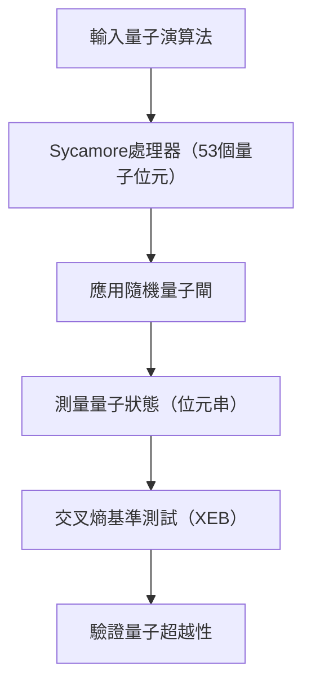
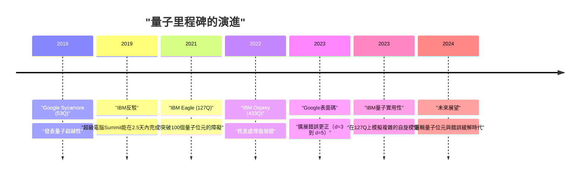
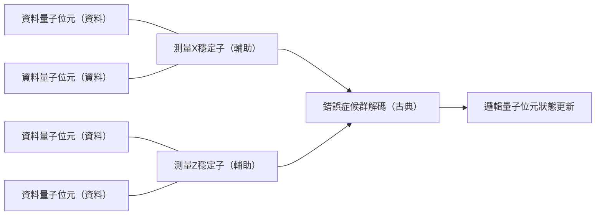

## 1. 前言：量子計算的黎明與「量子超越性」

量子計算透過將物理學的基本原理——量子力學應用於資訊處理，具備了解決古典電腦（我們現在日常使用的個人電腦或超級電腦）在現實時間內無法解開的複雜問題的潛力。這個領域長久以來以理論研究為主，但近年來，隨著硬體的快速進步，邁向實用化的競爭正日益激烈。

其中最受矚目的關鍵字之一就是「量子超越性（Quantum Supremacy，或稱量子霸權）」。這指的是在特定的計算任務中，量子電腦展現出壓倒古典電腦計算能力的瞬間。本文將從量子超越性的嚴格定義開始，詳細解說Google在2019年宣布全球首次達成此里程碑的「Sycamore」處理器的實驗細節、IBM對此的反駁與獨特策略，以及邁向真正實用化最大障礙的「量子錯誤更正（Quantum Error Correction: QEC）」與「容錯量子計算（Fault-Tolerant Quantum Computing: FTQC）」的最新發展藍圖，並進行技術與數學上的深入探討。

---

## 2. 理論背景：量子計算的基礎與複雜度類別

為了理解量子超越性，首先必須了解量子計算的數學基礎，以及其在計算複雜度理論中的定位。

### 量子位元與疊加態 (Superposition)
古典電腦中資訊的最小單位是位元（0或1），但在量子電腦中則使用量子位元（Qubit）。一個量子位元的狀態 $|\psi\rangle$ ，可由基底狀態 $|0\rangle$ 與 $|1\rangle$ 的複數線性組合來表示：

$$
|\psi\rangle = \alpha|0\rangle + \beta|1\rangle
$$

這裡 $\alpha, \beta \in \mathbb{C}$，且滿足歸一化條件 $|\alpha|^2 + |\beta|^2 = 1$。這種性質被稱為「疊加（Superposition）」。

### 量子糾纏（Entanglement）與張量積
當存在多個量子位元時，整個系統的狀態可以由個別量子位元狀態空間的張量積來表示。$n$ 個量子位元的系統，會成為 $2^n$ 維希爾伯特空間 $\mathcal{H}^{\otimes n}$ 上的向量。

$$
|\Psi\rangle = \sum_{x \in \{0, 1\}^n} c_x |x\rangle
$$

這裡 $\sum |c_x|^2 = 1$。量子位元之間並非獨立，其中一方的狀態依賴於另一方狀態的現象稱為「量子糾纏（Quantum Entanglement）」。藉由這種特性，量子電腦擁有了同時處理呈指數級擴張的龐大狀態空間的潛力。

### 量子超越性在計算複雜度理論上的定義
在計算複雜度理論中，古典電腦能夠有效率地（在多項式時間內）解決的問題類別稱為 **BPP** (Bounded-error Probabilistic Polynomial time)。另一方面，量子電腦能夠有效率地解決的問題類別則是 **BQP** (Bounded-error Quantum Polynomial time)。

實證量子超越性，意味著「在實際的量子硬體上，執行屬於BQP但不屬於BPP（或可能性極高）的特定任務，並在時間與資源上超越古典超級電腦的模擬」。這可以說是透過物理實驗來反證延伸的邱奇－圖靈論題（「所有物理上可實現的計算模型，皆可由機率圖靈機在多項式時間內模擬」）的一項歷史性嘗試。

---

## 3. 2019年：Google實證量子超越性

2019年10月，Google Quantum AI團隊在科學期刊《Nature》上宣布，他們使用53個量子位元的超導處理器「Sycamore」，成功達成了量子超越性。

### Sycamore處理器的架構
Sycamore處理器由排列成二維網格狀的54個Transmon型超導量子位元組成（實驗中因有1個運作不良，故使用了53個）。相鄰的量子位元之間配置了可調耦合器（Tunable Coupler），實現了高速且高精度的雙量子位元閘（iSWAP閘與控制Z閘的混合）。

### 隨機量子電路取樣（Random Circuit Sampling: RCS）
Google選擇的任務是「隨機量子電路取樣」。這是在多個週期（深度 $m$）內，應用隨機選擇的單量子位元閘與雙量子位元閘，並測量最終狀態，從所得的位元串機率分布中進行取樣的過程。

從理想的（無雜訊）隨機量子電路輸出的位元串 $x$ 的機率並非均勻分布，而是呈現被稱為波特-湯瑪斯分布（Porter-Thomas distribution）的干涉條紋般模式。為了用古典電腦從這個分布中取樣，必須對整個狀態向量進行模擬，其計算量會相對於量子位元數 $n$ 與電路深度 $m$ 呈指數級增加。

### 忠誠度（Fidelity）評估：線性交叉熵基準測試（XEB）
為了證明實驗結果並非單純的雜訊，而是確實進行了量子計算的結果，Google使用了線性交叉熵基準測試（Linear Cross-Entropy Benchmarking: XEB）。使用古典電腦計算出針對實驗中獲得的位元串 $x_i$ 其電路的理想機率 $P(x_i)$，並透過以下公式求得忠誠度 $\mathcal{F}_{\text{XEB}}$。

$$
\mathcal{F}_{\text{XEB}} = 2^n \langle P(x_i) \rangle_{i} - 1
$$

$\mathcal{F}_{\text{XEB}}$ 若為0代表完全是雜訊，為1則代表無雜訊的理想量子處理器。Sycamore處理器在深度為20的電路中，達成了 $\mathcal{F}_{\text{XEB}} \approx 0.002$ (0.2%)。乍看之下很低，但這是在統計上具顯著意義的大於零的值，是成功控制了高達 $2^{53} \approx 9 \times 10^{15}$ 狀態空間的驚人成果。

整體的錯誤率被近似模型化為各個閘錯誤、測量錯誤等的乘積。

$$
\mathcal{F} \approx (1 - e_1)^{N_1}(1 - e_2)^{N_2} \cdots \approx \prod_{g \in 1Q} (1 - e_g) \prod_{g \in 2Q} (1 - e_g) \prod_{q} (1 - e_{RO})
$$

（※ $e_g$ 為閘錯誤，$e_{RO}$ 為測量錯誤）

Google主張，若要使用古典超級電腦（Summit）來模擬這個電路，大約需要花費1萬年的時間。相對地，Sycamore僅花了200秒就完成了取樣。

---

## 4. IBM的反駁：從「超越性」到「實用性（Utility）」

Google的發表震撼了全世界，但開發出全球最大超級電腦「Summit」且同樣引領著量子電腦開發的IBM，立刻發表了反駁此一主張的論文。

### 透過張量網路收縮改善古典模擬
IBM反駁的核心在於「古典電腦端的演算法與資源最佳化不足」。Google是在假設直接計算薛丁格方程式時間演進的狀態向量模擬器的前提下，估算出需要1萬年，但IBM指出，只要使用被稱為「張量網路（Tensor Network）」的方法，就能夠大幅縮短模擬時間。

在張量網路中，量子電路的閘操作被表示為多維陣列（張量）的運算，並將網路「收縮（Contraction）」的順序最佳化。他們主張，如果能充分活用Summit所擁有的250 PB龐大儲存空間（硬碟與記憶體的階層化），就能在保留整個狀態向量的情況下，僅用「2天半」的時間完成更高精度的模擬。

### 量子優勢（Quantum Advantage）與量子實用性（Quantum Utility）
以這場爭論為契機，整個業界的趨勢，開始從單純執著於「執行古典電腦無法做到的人為任務（超越性）」轉移到「在現實社會的實用問題上，展現出比古典方法更具實質的優勢（量子優勢）」，甚至是「讓量子電腦發揮作為科學發現新工具的功能（量子實用性）」的階段。

IBM本身避開了「超越性」一詞，提倡以「量子體積（Quantum Volume）」與「CLOPS (Circuit Layer Operations Per Second)」作為量子處理器的綜合性能指標，並推動著重於硬體規模與品質平衡的開發。

---

## 5. 下一個前沿：錯誤緩解（Error Mitigation）與量子錯誤更正（QEC）

目前的量子電腦被稱為「NISQ（Noisy Intermediate-Scale Quantum）」，容易受到雜訊（與外部環境的互動或控制不完美所造成的錯誤）的影響，進行長時間計算時，結果就會被雜訊淹沒。為了解決這個問題，主要分為「錯誤緩解（Error Mitigation）」與「量子錯誤更正（Quantum Error Correction）」兩種策略。

### 錯誤緩解（Error Mitigation）
錯誤緩解是一種不需要改變量子硬體，僅透過古典的後處理，從計算結果的期望值中去除雜訊影響的手法。IBM在2023年，將127個量子位元的「Eagle」處理器與「零雜訊外推（Zero-Noise Extrapolation: ZNE）」等錯誤緩解技術結合，在複雜的易辛模型（Ising model）時間演進模擬中，達成了超越最先進的近似張量網路法的精度，實證了「量子實用性（Quantum Utility）」。

### 量子錯誤更正（QEC）與邏輯量子位元
然而，為了最終能夠執行任意複雜的演算法（例如Shor的質因數分解演算法或複雜的量子化學計算），單靠錯誤緩解是不夠的，動態偵測並修正錯誤的「量子錯誤更正（QEC）」是不可或缺的。

QEC的主流方法是「表面碼（Surface Code）」。這是一種將多個物理量子位元（資料量子位元）排列成二維網格狀，並在其中配置測量用的量子位元（輔助量子位元），連續進行被稱為「穩定子（Stabilizer）」的同位元檢查的手法。

#### 閾值定理（Threshold Theorem）與距離 $d$
量子錯誤更正中存在著「閾值定理」。當物理量子位元的錯誤率 $p$ 低於特定的閾值 $p_{th}$（表面碼的情況約在 1% 左右）時，透過增加碼距離（Distance）$d$（將更多的物理量子位元分配給一個邏輯量子位元），就能夠呈指數級地降低邏輯錯誤率 $p_L$。

邏輯錯誤率的近似公式如下所示：

$$
p_L \approx \Lambda \left( \frac{p}{p_{th}} \right)^{\frac{d+1}{2}}
$$

這裡 $\Lambda$ 為常數。只要 $p < p_{th}$，$d$ 越大 $p_L$ 就會越小。然而，若 $p > p_{th}$，增加物理量子位元反而會導致雜訊累積，使邏輯錯誤率惡化。

#### Google在2023年的里程碑：實證透過擴展距離降低錯誤
2023年2月，Google在《Nature》上發表了一篇具有紀念意義的論文。他們使用第三代的Sycamore處理器，全球首次實證了當表面碼的距離從 $d=3$（使用17個物理量子位元）擴展到 $d=5$（使用49個物理量子位元）時，邏輯錯誤率從 3.028% 微微下降到了 2.914%。

這意味著已經踏入了 $p < p_{th}$ 的領域，證明了只要增加物理量子位元效能就會提升，這象徵著邁向FTQC最重要的一項概念驗證（Proof of Concept）已經完成。

---

## 6. 邁向FTQC（容錯量子計算）的發展藍圖與展望

Google與IBM雖然各自採用了不同的架構與策略，但都在為了最終目標FTQC（Fault-Tolerant Quantum Computing，容錯量子計算）展開著激烈的開發競爭。

### IBM的策略：模組化與重六角（Heavy-Hex）網格
IBM在徹底降低錯誤率的同時，也致力於處理器的規模擴充。在挑戰「Eagle(127Q)」、「Osprey(433Q)」、「Condor(1121Q)」等單一晶片極限的同時，也發表了名為「Quantum System Two」的模組化架構。此外，在量子位元的耦合拓撲結構上，採用了能減少不必要的串擾（crosstalk）並提高穩定性的「重六角（Heavy-Hex）網格」。IBM的策略是一種混合式方法，短期內透過高度的錯誤緩解追求實用性，並階段性地導入QEC。

### Google的策略：提升邏輯量子位元品質
Google的策略比起急遽增加物理量子位元的數量，更著重於將單個邏輯量子位元的錯誤率降低到極限（例如降至 $10^{-6}$）。在此基礎上，建立在模組之間傳輸量子狀態的技術（Quantum Interconnects），目標是打造能讓數千至數萬個物理量子位元平行運作的大規模系統。

為了以容錯方式執行如魔法態蒸餾（Magic State Distillation）等非克里福閘（Non-Clifford gates）的協定實作，也將是未來的重大技術障礙。據說若要執行實用的Shor演算法來破解2048位元的RSA密碼，大約需要數千個錯誤率在 $10^{-8}$ 以下的邏輯量子位元，換算成物理量子位元則需要數百萬至數千萬個，前方的道路依然漫長。

---

## 7. 結語

「量子超越性」是量子電腦歷史上，在物理層面證明計算機理論潛力的重要里程碑。Google在2019年的實證與IBM建設性的反駁，將整個業界從單純的理論證明，推動到了追求實際實用性（Utility），以及邁向最終容錯量子計算（FTQC）的正式工程時代。

現在，我們正處於從充滿雜訊的NISQ裝置，過渡到具備錯誤更正功能之邏輯量子位元裝置的過渡期。在未來的數年到十年內，隨著這些量子硬體的進化，新材料科學的發現、新藥開發過程的革命，以及最佳化問題的突破，都將成為現實。

塑造未來計算機科學的Google與IBM，以及全世界研究者們的動向，未來也將持續令人矚目。
