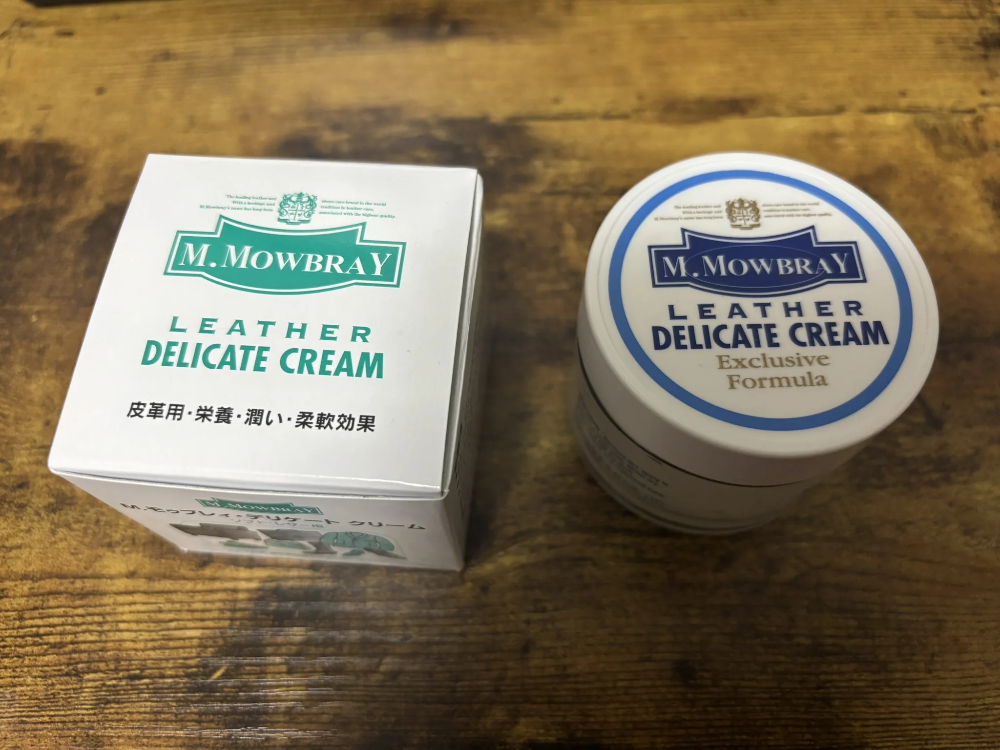
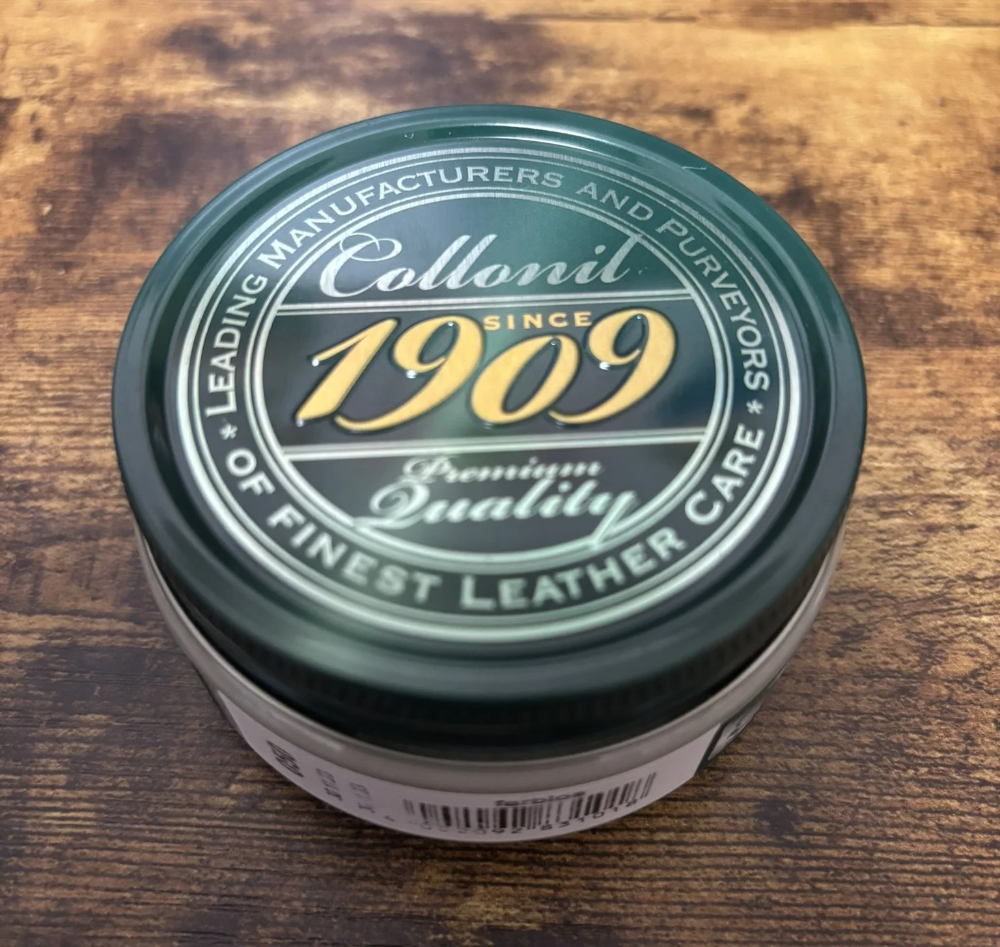
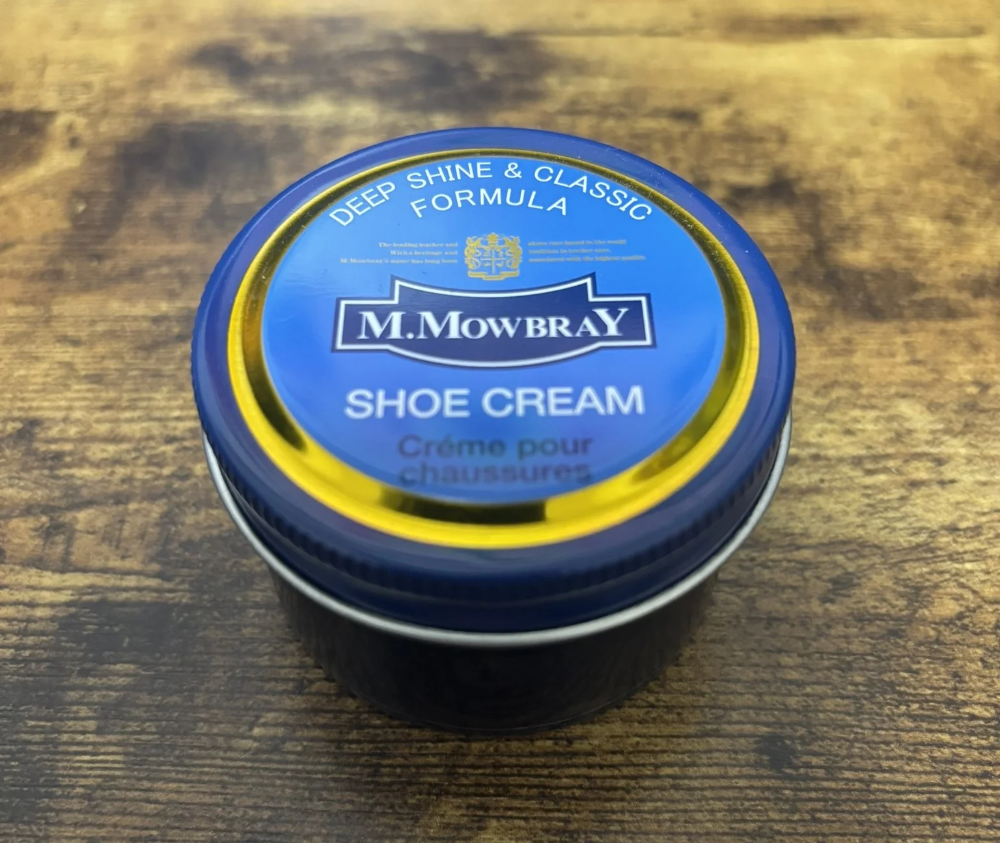
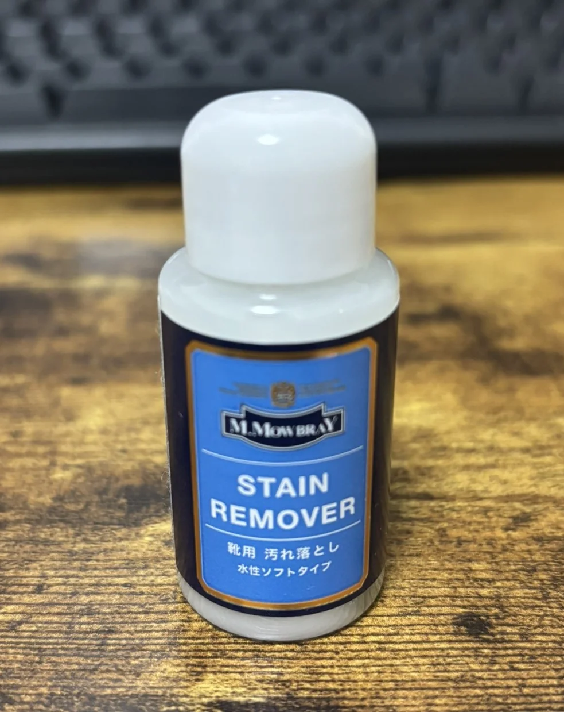

Baru-baru ini, saya mulai tertarik dengan produk kulit dan telah membeli berbagai barang. Seiring dengan itu, minat saya terhadap perawatan produk kulit juga tumbuh, dan saya telah mengumpulkan beberapa produk terkait yang ingin saya perkenalkan.

# Produk Perawatan Kulit yang Baru Saja Dibeli

## M.MOWBRAY DELICATE CREAM

Harga: sekitar 1.320 yen

Krim ini memberikan nutrisi, kelembapan, dan efek fleksibilitas.
Tidak memberikan kilau, tetapi cocok untuk kulit yang membutuhkan banyak kelembapan.
Baunya tidak menyengat, meski ada sedikit aroma.
Karena tidak berwarna, saya rasa krim ini sangat serbaguna. Karena teksturnya yang ringan,
mungkin lebih baik menggunakan sedikit lebih banyak dibandingkan krim lainnya.

## Collonil 1909 Supreme Creme de Luxe

Harga: sekitar 1.777 yen

Krim yang terkenal, standar, dan serbaguna yang tidak mudah meninggalkan noda. Krim ini memperbaiki warna kulit dan membuatnya lembap.
Memberikan sedikit kilau. Berwarna putih dan tampaknya juga memiliki efek menolak air.

## M.MOWBRAY SHOE CREAM (Hitam)

Harga: sekitar 1.000 yen

Krim untuk sepatu. Mengandung lilin, minyak, dan pelarut organik.
Memperbaiki warna kulit dan memberikan kilau. Karena berwarna hitam, ini digunakan untuk kulit hitam.
Saya menggunakannya untuk sepatu jas saya.

## M.MOWBRAY STAIN REMOVER

Harga: sekitar 700 yen

Ini adalah produk yang didapat saat saya membeli sikat.
Pembersih sepatu berbahan dasar air. Menghilangkan kotoran dari kulit.
Basahi kain secukupnya dan gosok kulit dengan lembut untuk mengangkat kotoran.
