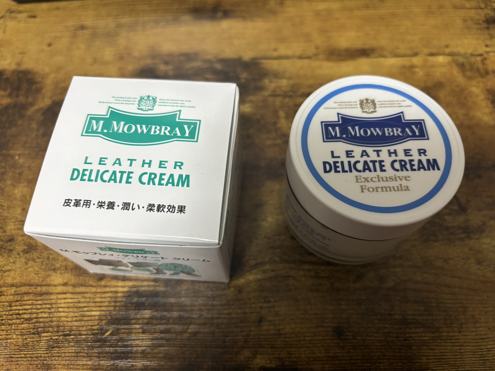
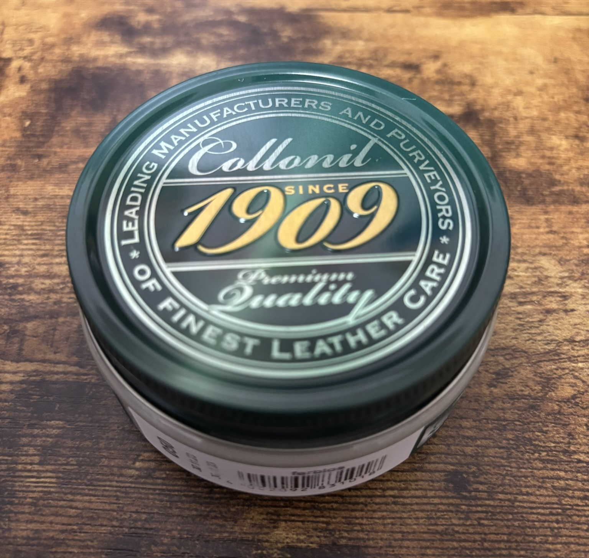
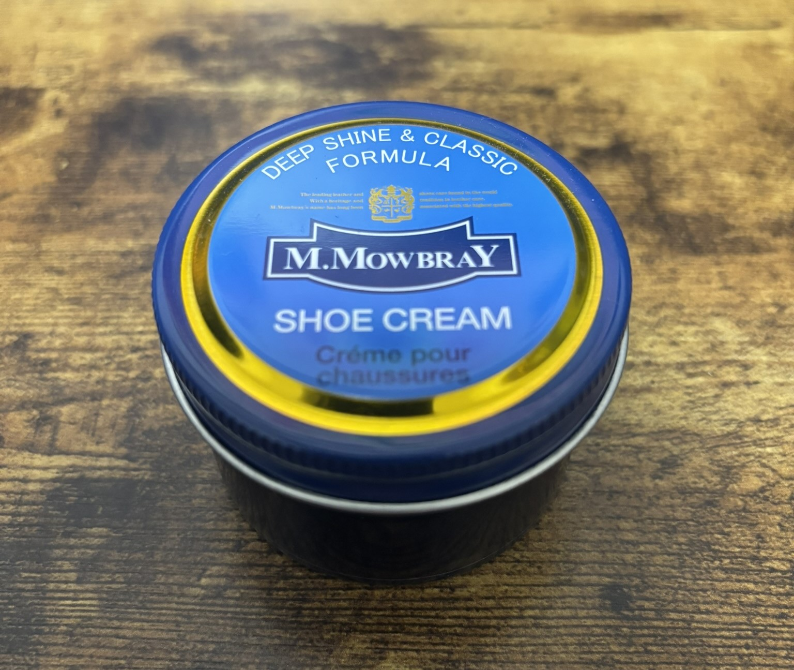
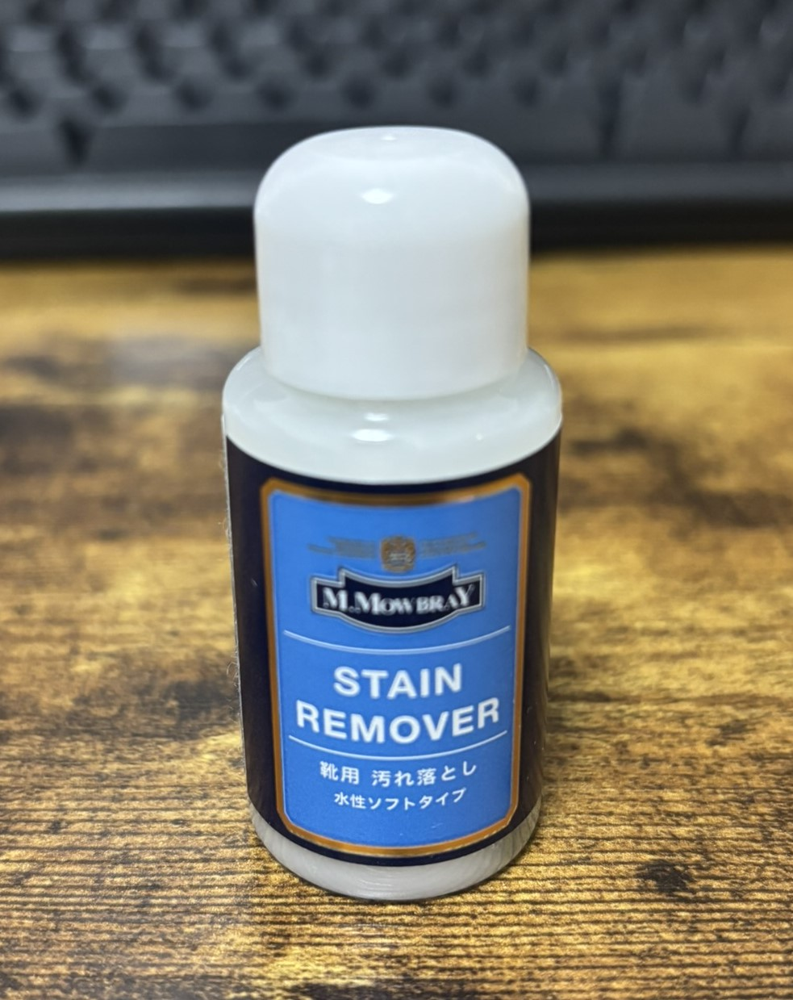

最近我對皮革製品產生了興趣，並購買了各種物品。在這樣的過程中，我也對皮革製品的保養產生了興趣，因此準備了一些相關用品來向大家介紹。

# 最近購買的皮革保養用品

## M.MOWBRAY DELICATE CREAM

價格：約 1,320 日圓

這款乳霜具有營養補給、保濕和柔軟的效果。
雖然不會產生光澤，但非常適合需要大量水分和滋潤的皮革。
味道不會令人討厭，但稍微有一點氣味。
因為是無色的，我認為用途非常廣泛。因為是比較清爽的乳霜，
與其他乳霜相比，稍微多用一點可能會比較好。

## Collonil 1909 Supreme Creme de Luxe

價格：約 1,777 日圓

知名、標準且萬用的乳霜，不容易產生斑點。這是一款能修補皮革顏色並使其保持濕潤的乳霜。
會產生少許光澤。因為是白色的，似乎也能期待撥水的效果。

## M.MOWBRAY SHOE CREAM (黑色)

價格：約 1,000 日圓

鞋用乳霜。含有蠟、油脂和有機溶劑。
修補皮革的顏色並產生光澤。因為是黑色的，適用於黑色皮革。
我把它用在西裝皮鞋上。

## M.MOWBRAY STAIN REMOVER

價格：約 700 日圓

這是我買刷子時附贈的。
鞋用水性清潔劑。去除皮革上的污垢。
讓布充分吸收後，輕輕擦拭皮革即可去除污垢。
