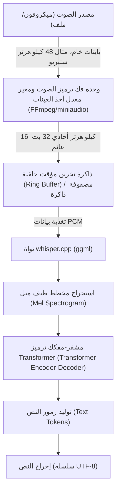

## 1. مقدمة: لماذا C++ للتعرف على الصوت؟

منذ أن أصبحت مفتوحة المصدر، تم استخدام "Whisper"، نموذج التعرف على الصوت عالي الدقة الذي طورته OpenAI، في العديد من التطبيقات. بينما يُعتبر استخدامه في بيئة Python (استنادًا إلى PyTorch) شائعًا، فإن الاعتماد على مترجم Python يُعد عنق زجاجة كبير للأداء عند الدمج في **الأجهزة الطرفية (الهواتف الذكية، أجهزة إنترنت الأشياء، الأنظمة المدمجة)** أو **تطبيقات C++ الأصلية التي تتطلب استجابة عالية في الوقت الفعلي** (محركات الألعاب، برامج الصوت الرقمية (DAW)، الروبوتات، إلخ).

هنا يأتي دور **[whisper.cpp](https://github.com/ggerganov/whisper.cpp)** الذي طوره Georgi Gerganov ليكون المنقذ. تعتمد هذه المكتبة على `ggml`، وهي مكتبة حسابات موتر (tensor) مخصصة للتعلم الآلي، لتقليل التبعيات إلى أقصى حد وتحقيق استدلال Whisper باستخدام C/C++ فقط.

في هذا المقال، سنشرح بالتفصيل كيفية دمج أفضل ميزات التعرف على الصوت في مشروع C++ الخاص بك باستخدام `whisper.cpp`، بدءًا من أساسيات معالجة الإشارات الصوتية، وطريقة الاستخدام التفصيلية لواجهة برمجة التطبيقات (API)، وإدارة الذاكرة، وتحسين تعدد المسارات (Multi-threading)، وصولًا إلى أنماط تنفيذ المعالجة في الوقت الفعلي.

---

## 2. معالجة الإشارات الصوتية ومتطلبات الإدخال لـ Whisper

لجعل الذكاء الاصطناعي يفهم الصوت، يجب تحويل الإشارات التناظرية "الصوت" إلى بيانات رقمية وتنسيقها بصيغة (موتّرات) يمكن لنموذج الذكاء الاصطناعي معالجتها. صيغة الصوت التي يتطلبها Whisper صارمة للغاية.

### 2.1 صيغة الصوت المطلوبة لـ Whisper

يقبل نموذج Whisper بيانات الصوت بالمواصفات التالية كمدخلات:

* **معدل أخذ العينات (Sample Rate)**: 16,000 هرتز (16 كيلو هرتز)
* **عدد القنوات (Channels)**: 1 (أحادي/Mono)
* **نوع البيانات (Data Type)**: عدد فاصلة عائمة 32-بت (`float` في C/C++)
* **التطبيع (Normalization)**: قيم مُحجّمة في النطاق $[-1.0, 1.0]$

على سبيل المثال، إذا تم إدخال ملف صوتي بجودة القرص المضغوط (44.1 كيلو هرتز، ستيريو، 16-بت PCM)، فيجب إجراء خفض لمعدل أخذ العينات (Downsampling)، ومزج القنوات (Mixdown)، وتحويل الصيغة مسبقًا.

معادلة حساب معدل نقل البيانات هي كما يلي:

$$ \text{Data Rate (bytes/sec)} = \text{Sample Rate} \times \text{Channels} \times \frac{\text{Bit Depth}}{8} $$

حجم البيانات لثانية واحدة وفقًا لمتطلبات Whisper (16 كيلو هرتز، قناة واحدة، 32-بت عائم) هو:

$$ 16000 \times 1 \times \frac{32}{8} = 64,000 \text{ bytes/sec (64 KB/s)} $$

نظرًا لأنه خفيف للغاية، فإن التخزين المؤقت (Buffering) ممكن تمامًا حتى على الأجهزة الطرفية ذات النطاق الترددي المحدود للذاكرة.

### 2.2 رياضيات تحويل مخطط طيف ميل (Mel Spectrogram)

داخليًا، لا يعالج Whisper بيانات الموجات الصوتية أحادية البعد (Raw Waveform) بشكل مباشر. يتم إدخالها إلى نموذج Transformer بعد تحويلها إلى **مخطط طيف ميل (Mel-Spectrogram)**، وهو تمثيل للتردد أقرب إلى خصائص السمع البشري. يتضمن `whisper.cpp` عملية التحويل هذه داخل تطبيق C++، لكن فهم كيفية عمله مفيد للتعامل مع الضوضاء وتحسين المعالجة المسبقة.

يتم تقريب المعادلة الرياضية لتحويل التردد العادي $f$ (هرتز) إلى مقياس ميل $m$ كما يلي:

$$ m = 2595 \log_{10} \left( 1 + \frac{f}{700} \right) $$

على العكس من ذلك، يكون التحويل العكسي من مقياس ميل إلى التردد كما يلي:

$$ f = 700 \left( 10^{\frac{m}{2595}} - 1 \right) $$

علاوة على ذلك، يتم تحويل الموجة الصوتية إلى مجال الزمن-التردد عن طريق **تحويل فورييه قصير الأمد (STFT: Short-Time Fourier Transform)**. يتم التعبير عن الشكل المنفصل لـ STFT باستخدام دالة النافذة $w(n)$ على النحو التالي:

$$ X(m, k) = \sum_{n=0}^{N-1} x(n + mH) w(n) e^{-j \frac{2\pi}{N} k n} $$
*(هنا، $N$ هو حجم نافذة FFT، $H$ هو حجم القفزة (Hop size)، و $w(n)$ هي دالة نافذة مثل نافذة هان (Hann window))*

يستخدم نموذج Whisper عادةً حجم نافذة $N = 400$ (25 مللي ثانية)، وحجم قفزة $H = 160$ (10 مللي ثانية)، و 80-أبعاد من بنك مرشحات ميل (Mel filter bank). يتم تنفيذ استخراج الميزات هذا تلقائيًا (وبسرعة باستخدام تعليمات SIMD) عند استدعاء `whisper_full()` داخل `whisper.cpp`.

---

## 3. هندسة النظام وتصميم مسار المعالجة (Pipeline)

دعونا نصمم مسار معالجة للصوت في تطبيق C++. يبدأ التدفق من إدخال الملف أو إدخال الميكروفون، ويمر بالمعالجة المسبقة، ثم الاستدلال بواسطة `whisper.cpp`، ويصل أخيرًا إلى إخراج النص.



ما يجب أن يكون التطبيق مسؤولاً عنه هو **القسم من A إلى C (فك ترميز الصوت وتغيير معدل أخذ العينات)** في المخطط أعلاه. نظرًا لأن `whisper.cpp` نفسه لا يتضمن وحدة لفك ترميز الملفات الصوتية، فإن أفضل ممارسة هي استخدام مكتبات مثل FFmpeg أو `miniaudio` معًا.

---

## 4. بناء ودمج whisper.cpp

هذه هي الخطوات لدمج `whisper.cpp` في مشروعك. استخدام CMake هو الأكثر مرونة وتوافقًا.

### إعداد CMakeLists.txt

يمكن دمج `whisper.cpp` ككود مصدري في المشروع أو إضافته كـ submodule وربطه.

```cmake
cmake_minimum_required(VERSION 3.14)
project(WhisperApp C CXX)

set(CMAKE_CXX_STANDARD 17)
set(CMAKE_CXX_STANDARD_REQUIRED ON)

# تفعيل تعليمات وحدة المعالجة المركزية الموسعة (AVX، F16C، إلخ)
# في نظام MacOS، سيتم تفعيل إطار عمل NEON/Accelerate تلقائيًا
set(WHISPER_SUPPORT_SDL2 OFF CACHE BOOL "" FORCE)
add_subdirectory(whisper.cpp)

add_executable(whisper_app main.cpp)
target_link_libraries(whisper_app PRIVATE whisper)
```

بهذا الإعداد، سيتم بناء الواجهة الخلفية (backend) المحسّنة للغاية `ggml` الخاصة بـ `whisper.cpp` وربطها بشكل ثابت بتطبيقك.

---

## 5. تفاصيل C++ API وخطوات التنفيذ

الآن، دعونا نلقي نظرة على كود C++ الفعلي ونشرح كيفية استخدام واجهة برمجة التطبيقات (API).

### 5.1 تهيئة السياق (Context) وتحميل النموذج

في `whisper.cpp`، تتم إدارة جميع الحالات وتخصيص الذاكرة من خلال هيكل (struct) `whisper_context`.

```cpp
#include "whisper.h"
#include <iostream>
#include <vector>
#include <string>

int main() {
    // 1. تهيئة المعلمات
    struct whisper_context_params cparams = whisper_context_default_params();
    cparams.use_gpu = true; // استخدم تسريع GPU (CuBLAS/Metal) إذا كان متاحًا

    // 2. تحميل النموذج (نموذج ثنائي بصيغة ggml)
    const std::string model_path = "models/ggml-base.bin";
    struct whisper_context * ctx = whisper_init_from_file_with_params(model_path.c_str(), cparams);

    if (ctx == nullptr) {
        std::cerr << "خطأ: فشل في تحميل النموذج - " << model_path << std::endl;
        return 1;
    }
    
    std::cout << "تم تحميل النموذج بنجاح." << std::endl;
```

ملف النموذج بتنسيق `.bin` المكمّم (Quantized) الخاص بهم. استخدم برنامج التحويل النصي الموجود في المستودع الرسمي أو قم بتنزيله مباشرة من HuggingFace. في البيئات ذات الذاكرة المحدودة بصرامة، يمكن أن يؤدي استخدام نماذج التكميم 4-بت (مثل: `ggml-base-q4_0.bin`) إلى تقليل استهلاك ذاكرة الوصول العشوائي (RAM) إلى حوالي الربع.

### 5.2 إعداد معلمات الاستدلال

بعد ذلك، نقوم بإعداد `whisper_full_params` الذي يتحكم في سلوك الاستدلال.

```cpp
    // 3. إعداد معلمات الاستدلال الكامل (استخدام أخذ العينات الجشع Greedy Sampling)
    struct whisper_full_params wparams = whisper_full_default_params(WHISPER_SAMPLING_GREEDY);
    
    // إعداد عدد المسارات (Threads) (الأمثل هو مطابقته لعدد النوى المادية لوحدة المعالجة المركزية)
    wparams.n_threads = 4;
    
    // إعداد اللغة ("auto" للكشف التلقائي، "ar" لتحديد العربية، "ja" لليابانية)
    wparams.language = "ja";
    
    // منع الإخراج القياسي للنتائج الوسيطة (للتحكم فيه داخل التطبيق)
    wparams.print_progress = false;
    wparams.print_realtime = false;
    
    // ميزة الترجمة (صحيح true إذا كنت تريد ترجمة الصوت مباشرة إلى نص إنجليزي)
    wparams.translate = false;
```

### 5.3 تجهيز بيانات الصوت وتنفيذ الاستدلال

هنا نفترض أنه تم بالفعل تخزين بيانات صوتية بتردد 16 كيلو هرتز في `std::vector<float>`.

```cpp
    // بيانات صوتية افتراضية (في الواقع، بيانات PCM تم الحصول عليها من ملف أو ميكروفون)
    // 3 ثوان (16000 هرتز * 3 ثوان = 48000 عينة)
    std::vector<float> pcmf32(48000, 0.0f); 

    // 4. تنفيذ الاستدلال
    if (whisper_full(ctx, wparams, pcmf32.data(), pcmf32.size()) != 0) {
        std::cerr << "خطأ: فشل في تنفيذ whisper_full." << std::endl;
        whisper_free(ctx);
        return 1;
    }
```

### 5.4 استخراج النتائج

بمجرد اكتمال `whisper_full`، يتم حفظ نتائج التعرف مقسمة إلى أجزاء (segments) داخل السياق.

```cpp
    // 5. الحصول على النتائج وعرضها
    const int n_segments = whisper_full_n_segments(ctx);
    
    for (int i = 0; i < n_segments; ++i) {
        const char * text = whisper_full_get_segment_text(ctx, i);
        
        // الحصول على الطابع الزمني (الوحدة: 10 مللي ثانية)
        const int64_t t0 = whisper_full_get_segment_t0(ctx, i);
        const int64_t t1 = whisper_full_get_segment_t1(ctx, i);
        
        std::cout << "[" << (t0 * 10.0) << " مللي ثانية -> " << (t1 * 10.0) << " مللي ثانية]: " 
                  << text << std::endl;
    }

    // 6. تحرير الذاكرة
    whisper_free(ctx);
    return 0;
}
```

تعتبر كتلة الشفرة هذه النموذج الأساسي والأبسط لاستخدام Whisper في C++.

---

## 6. التنفيذ المتقدم للتعرف على الصوت في الوقت الفعلي

من السهل معالجة الملفات المسجلة مسبقًا، ولكن لتحسين تجربة المستخدم (UX) في التطبيق، من الضروري الحصول على "تعرف على الصوت في الوقت الفعلي (التعرف المتدفق)" من إدخال الميكروفون.

لتنفيذ ذلك، تعد بنية متعددة المسارات (Multi-thread architecture) وإدارة التدفق الصوتي باستخدام الذاكرة المؤقتة الحلقية (Ring Buffer) أمورًا لا غنى عنها.


### 6.1 أهمية اكتشاف النشاط الصوتي (VAD)

في المعالجة بالوقت الفعلي، يعد تنفيذ الاستدلال باستمرار حتى على فترات الصمت إهدارًا لموارد الحوسبة. من خلال إدراج خوارزمية VAD (معالجة عتبة تعتمد على الطاقة البسيطة، أو WebRTC VAD، وما إلى ذلك) في المرحلة السابقة، ننفذ تحكمًا حيث **"يبدأ التخزين المؤقت فقط عند بدء التحدث، ويتم تشغيل `whisper_full` عند انتهاء التحدث (فترة صمت معينة)"**.

### 6.2 نهج النافذة المنزلقة (Sliding Window)

إذا استمر التحدث لفترة طويلة، يُستخدم نهج "النافذة المنزلقة" لاقتطاع أجزاء كل بضع ثوان وتنفيذ الاستدلال. ومع ذلك، إذا قمت ببساطة بتقطيع الصوت بشكل عشوائي، فقد يتم قطعه في منتصف الكلمة، مما يؤدي إلى انخفاض كبير في دقة التعرف.

كحل، نستخدم تقنية **"إجراء الاستدلال دائمًا بحيث يتضمن سياق الثواني الـ N الماضية مباشرة"** (تداخل/Overlap). في `whisper.cpp`، هناك ميزة تسمى `wparams.prompt_tokens` التي ترحّل رموز النص السابقة كموجه (prompt)، مما يسمح بالتعرف على البث بدقة عالية مع الحفاظ على السياق.

---

## 7. إدارة الذاكرة وتحسين الأجهزة الطرفية

سنتعمق أكثر في الأداء وكفاءة الذاكرة، وهما أكبر مزايا `whisper.cpp`.

### 7.1 قوة مكتبة موتر (Tensor) ggml

`ggml`، وهي الواجهة الخلفية لـ `whisper.cpp`، هي مكتبة موتر مكتوبة بلغة C ولا تحتوي على تبعيات. الميزة الأكبر هي أنها تدعم **التكميم الديناميكي لبيانات الوزن (Quantization)**.

على سبيل المثال، دعونا نحسب حجم الذاكرة لنموذج Whisper `Small` (حوالي 240 مليون معامل/Parameter).
في العادة (16-بت عائم = 2 بايت):

$$ \text{Memory (FP16)} \approx 244,000,000 \times 2 \text{ bytes} \approx 488 \text{ MB} $$

إذا تم تحويل هذا إلى تكميم 4-بت (صيغة Q4_0)، سيكون المتوسط 0.5 بايت لكل معلمة (حوالي 0.56 بايت عند تضمين النفقات الإضافية مثل عوامل القياس).

$$ \text{Memory (Q4\_0)} \approx 244,000,000 \times 0.56 \text{ bytes} \approx 137 \text{ MB} $$

في البيئات التي تعاني من قيود صارمة على ذاكرة الوصول العشوائي (RAM) مثل أجهزة iOS أو Raspberry Pi، فإن هذا التخفيض في بصمة الذاكرة يرتبط ارتباطًا مباشرًا بالاستقرار العام للتطبيق.

### 7.2 الاستفادة من تسريع الأجهزة (Hardware Acceleration)

على الرغم من أنها سريعة بما يكفي بواسطة وحدة المعالجة المركزية (CPU) وحدها مع تعليمات AVX2 و NEON، إلا أن `whisper.cpp` تدعم أيضًا تسريع الأجهزة لمختلف وحدات المعالجة الرسومية (GPUs) ووحدات المعالجة العصبية (NPUs) كواجهات خلفية (backends).

* **Apple Silicon (Mac/iOS)**: دعم Metal API من خلال `ggml-metal`. استدلال فائق السرعة باستخدام GPU.
* **NVIDIA GPU (Windows/Linux)**: دعم `cuBLAS`. حدد `-DWHISPER_CUBLAS=ON` أثناء البناء بواسطة CMake.
* **Intel (Windows/Linux)**: دعم الواجهة الخلفية `OpenVINO`. يمكن الاستفادة من NPU على أحدث معالجات Intel Core.

عند استخدام هذه المسرّعات في مشروع C++، فغالبًا لا تكون هناك حاجة لتعديل كود المصدر. إذا تم تعيين `cparams.use_gpu = true;` عند تهيئة السياق، فسيتم نقل المعالجة تلقائيًا إلى الأجهزة بناءً على الواجهة الخلفية التي تم بناؤها.

### 7.3 ضبط ذاكرة التخزين المؤقت (Cache) وعدد المسارات (Threads)

إعداد `wparams.n_threads` مهم للغاية. مجرد زيادة عدد المسارات بشكل عشوائي لن يؤدي إلى تحسين الأداء بسبب عنق الزجاجة في النطاق الترددي للذاكرة (Memory Bound).

كقاعدة عامة، من المثالي تحديد عدد المسارات بالصيغة التالية:

$$ N_{\text{threads}} = \min(\text{Physical CPU Cores}, 4 \sim 8) $$

إذا قمت بتضمين النوى المنطقية (Logical Cores) مثل Hyper-Threading، فغالبًا ما تحدث تعارضات في ذاكرة التخزين المؤقت، وستنخفض سرعة الاستدلال بدلاً من ذلك، لذا فإن القاعدة الذهبية هي ضبطه على **عدد النوى المادية (Physical Cores)**. عند استخدام `std::thread::hardware_concurrency()` من C++11، فإنه يُرجع عدد النوى المنطقية، لذلك نوصي إما بترميزه بقيم ثابتة وفقًا للبيئة، أو استخدام واجهات برمجة تطبيقات على مستوى نظام التشغيل للحصول على النوى المادية.

---

## 8. الخاتمة

في هذا المقال، شرحنا بالتفصيل كيفية دمج أفضل ذكاء اصطناعي للتعرف على الصوت في مشاريع C++ باستخدام `whisper.cpp`، بدءًا من النظرية والتطبيق وحتى التحسين.

* **الالتزام بمتطلبات الإدخال**: الالتزام الصارم بـ 16 كيلو هرتز، قناة واحدة، و 32-بت عائم.
* **استخدام واجهة برمجة التطبيقات (API) البديهي**: تصميم بسيط يكتمل فيه الاستدلال فقط باستخدام `whisper_init_from_file_with_params` و `whisper_full`.
* **المعالجة في الوقت الفعلي**: التحكم متعدد المسارات (Multi-thread) مع VAD والنافذة المنزلقة (Sliding window).
* **تحسين هائل**: الاستفادة من تكميم 4-بت عبر `ggml` وواجهات الأجهزة الخلفية مثل Metal/cuBLAS.

يرجى الاستفادة من `whisper.cpp` لتطوير تطبيقات معالجة الصوت التي تعمل بسرعة وأمان في البيئات الأصلية، والابتعاد عن التبعية لبيئات Python الضخمة أو واجهات برمجة تطبيقات الحوسبة السحابية (Cloud APIs). من منظور حماية الخصوصية وزمن الوصول (Latency)، سيكون الذكاء الاصطناعي الذي يعمل محليًا بالكامل تقنية أساسية بالغة الأهمية في تطوير البرمجيات المستقبلية.

