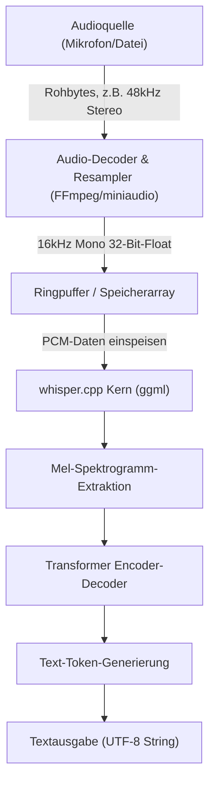
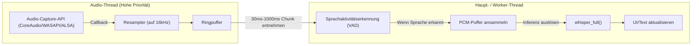

## 1. Einführung: Warum Spracherkennung in C++?

Seit das von OpenAI entwickelte hochpräzise Spracherkennungsmodell "Whisper" als Open Source veröffentlicht wurde, wird es in verschiedenen Anwendungen eingesetzt. Die Nutzung in einer Python-Umgebung (PyTorch-basiert) ist üblich, aber bei der Integration in **Edge-Geräte (Smartphones, IoT-Geräte, eingebettete Systeme)** oder **native C++-Anwendungen, die eine hohe Echtzeitleistung erfordern** (Game-Engines, DAW-Software, Robotik usw.), wird die Abhängigkeit vom Python-Interpreter zu einem großen Leistungsengpass.

Hier kommt **[whisper.cpp](https://github.com/ggerganov/whisper.cpp)**, entwickelt von Georgi Gerganov, zur Rettung. Diese Bibliothek basiert auf `ggml`, einer Tensor-Berechnungsbibliothek für maschinelles Lernen. Sie reduziert Abhängigkeiten auf ein absolutes Minimum und realisiert Whisper-Inferenz ausschließlich in C/C++.

In diesem Artikel werden wir ausführlich erläutern, wie Sie mithilfe dieser `whisper.cpp` hochmoderne Spracherkennungsfunktionen in Ihr eigenes C++-Projekt integrieren können. Dabei decken wir alles ab: von den Grundlagen der Audiosignalverarbeitung über die detaillierte Nutzung der API, Speicherverwaltung, Multithreading-Optimierung bis hin zu Implementierungsmustern für die Echtzeitverarbeitung.

---

## 2. Audiosignalverarbeitung und Eingabeanforderungen von Whisper

Damit die KI Sprache verstehen kann, ist es notwendig, das analoge Signal "Ton" in digitale Daten umzuwandeln und in ein Format (Tensor) zu bringen, das das KI-Modell verarbeiten kann. Das von Whisper geforderte Audioformat ist sehr streng.

### 2.1 Von Whisper gefordertes Audioformat

Das Whisper-Modell akzeptiert Audiodaten mit den folgenden Spezifikationen als Eingabe:

* **Abtastrate (Sample Rate)**: 16.000 Hz (16 kHz)
* **Kanalanzahl (Channels)**: 1 (Mono)
* **Datentyp (Data Type)**: 32-Bit-Gleitkommazahl (`float` in C/C++)
* **Normalisierung (Normalization)**: Werte skaliert im Bereich $[-1.0, 1.0]$

Wenn beispielsweise eine Audiodatei in CD-Qualität (44,1 kHz, Stereo, 16-Bit-PCM) als Eingabe verwendet wird, müssen zuvor ein Downsampling, ein Downmix der Kanäle und eine Formatkonvertierung durchgeführt werden.

Die Formel zur Berechnung der Datenübertragungsrate lautet wie folgt:

$$ \text{Data Rate (bytes/sec)} = \text{Sample Rate} \times \text{Channels} \times \frac{\text{Bit Depth}}{8} $$

Die Datengröße pro Sekunde für die Whisper-Anforderungen (16 kHz, 1 Kanal, 32-Bit-Float) beträgt:

$$ 16000 \times 1 \times \frac{32}{8} = 64,000 \text{ bytes/sec (64 KB/s)} $$

Da dies sehr leichtgewichtig ist, ist eine ausreichende Pufferung auch auf Edge-Geräten mit begrenzter Speicherbandbreite möglich.

### 2.2 Mathematik der Mel-Spektrogramm-Konvertierung

Intern verarbeitet Whisper 1D-Audiowellendaten (Raw Waveform) nicht direkt. Sie werden in ein **Mel-Spektrogramm (Mel-Spectrogram)** umgewandelt, eine Frequenzdarstellung, die dem menschlichen Gehör nahekommt, bevor sie in das Transformer-Modell eingegeben werden. `whisper.cpp` enthält diesen Konvertierungsprozess innerhalb seiner C++-Implementierung, aber das Verständnis der Mechanik ist hilfreich für die Rauschunterdrückung und Optimierung der Vorverarbeitung.

Die Formel zur Umwandlung einer normalen Frequenz $f$ (Hz) in die Mel-Skala $m$ wird wie folgt approximiert:

$$ m = 2595 \log_{10} \left( 1 + \frac{f}{700} \right) $$

Umgekehrt lautet die inverse Transformation von der Mel-Skala zur Frequenz wie folgt:

$$ f = 700 \left( 10^{\frac{m}{2595}} - 1 \right) $$

Darüber hinaus wird die Audiowellenform durch eine **Kurzzeit-Fourier-Transformation (STFT: Short-Time Fourier Transform)** in den Zeit-Frequenz-Bereich transformiert. Die diskrete Form der STFT mit einer Fensterfunktion $w(n)$ wird wie folgt ausgedrückt:

$$ X(m, k) = \sum_{n=0}^{N-1} x(n + mH) w(n) e^{-j \frac{2\pi}{N} k n} $$
*(Hier ist $N$ die FFT-Fenstergröße, $H$ die Hop-Größe und $w(n)$ eine Fensterfunktion wie das Hann-Fenster)*

Das Whisper-Modell verwendet typischerweise eine Fenstergröße $N = 400$ (25 ms), eine Hop-Größe $H = 160$ (10 ms) und eine 80-dimensionale Mel-Filterbank. Diese Merkmalsextraktion wird automatisch (und dank SIMD-Befehlen schnell) ausgeführt, wenn `whisper_full()` in `whisper.cpp` aufgerufen wird.

---

## 3. Architektur und Pipeline-Design

Lassen Sie uns eine Audioverarbeitungs-Pipeline in einer C++-Anwendung entwerfen. Der Ablauf beginnt mit einer Datei- oder Mikrofoneingabe, durchläuft die Vorverarbeitung, gefolgt von der Inferenz durch `whisper.cpp`, und endet mit der Textausgabe.



Der Bereich, für den die Anwendung verantwortlich sein sollte, ist der **Abschnitt von A bis C in der obigen Abbildung (Audio-Decodierung und Resampling)**. Da `whisper.cpp` selbst keinen Audio-Decoder enthält, ist es die beste Praxis, es in Kombination mit Bibliotheken wie FFmpeg oder `miniaudio` zu verwenden.

---

## 4. Bauen und Integrieren von whisper.cpp

Hier sind die Schritte zur Integration von `whisper.cpp` in Ihr Projekt. Die Verwendung von CMake ist am vielseitigsten.

### CMakeLists.txt konfigurieren

`whisper.cpp` wird entweder als Quellcode in das Projekt aufgenommen oder als Submodul hinzugefügt und verlinkt.

```cmake
cmake_minimum_required(VERSION 3.14)
project(WhisperApp C CXX)

set(CMAKE_CXX_STANDARD 17)
set(CMAKE_CXX_STANDARD_REQUIRED ON)

# Aktivieren von CPU-Erweiterungsbefehlen (AVX, F16C, etc.)
# Auf MacOS wird das NEON/Accelerate-Framework automatisch aktiviert
set(WHISPER_SUPPORT_SDL2 OFF CACHE BOOL "" FORCE)
add_subdirectory(whisper.cpp)

add_executable(whisper_app main.cpp)
target_link_libraries(whisper_app PRIVATE whisper)
```

Mit dieser Konfiguration wird das hochoptimierte `ggml`-Backend von `whisper.cpp` erstellt und statisch mit Ihrer Anwendung verlinkt.

---

## 5. Details zur C++-API und Implementierungsschritte

Nun schauen wir uns den tatsächlichen C++-Code an und erklären, wie man die API aufruft.

### 5.1 Kontextinitialisierung und Modell-Laden

In `whisper.cpp` werden alle Zustände und Speicherzuweisungen durch die Struktur `whisper_context` verwaltet.

```cpp
#include "whisper.h"
#include <iostream>
#include <vector>
#include <string>

int main() {
    // 1. Parameter-Initialisierung
    struct whisper_context_params cparams = whisper_context_default_params();
    cparams.use_gpu = true; // GPU-Beschleunigung (CuBLAS/Metal) verwenden, falls verfügbar

    // 2. Modell laden (Binärmodell im ggml-Format)
    const std::string model_path = "models/ggml-base.bin";
    struct whisper_context * ctx = whisper_init_from_file_with_params(model_path.c_str(), cparams);

    if (ctx == nullptr) {
        std::cerr << "Fehler: Fehler beim Laden des Modells - " << model_path << std::endl;
        return 1;
    }
    
    std::cout << "Modell erfolgreich geladen." << std::endl;
```

Die Modelldatei liegt in einem einzigartig quantisierten `.bin`-Format vor. Sie können das Konvertierungsskript aus dem offiziellen Repository verwenden oder es direkt von HuggingFace herunterladen. In Umgebungen mit strengen Speicherbeschränkungen reduziert die Verwendung von 4-Bit-quantisierten Modellen (z. B. `ggml-base-q4_0.bin`) den RAM-Verbrauch auf etwa ein Viertel.

### 5.2 Konfiguration der Inferenzparameter

Als nächstes richten wir `whisper_full_params` ein, um das Verhalten der Inferenz zu steuern.

```cpp
    // 3. Einstellen der Parameter für die vollständige Inferenz (Verwendung von Greedy Sampling)
    struct whisper_full_params wparams = whisper_full_default_params(WHISPER_SAMPLING_GREEDY);
    
    // Einstellung der Thread-Anzahl (am besten an die Anzahl der physischen CPU-Kerne anpassen)
    wparams.n_threads = 4;
    
    // Spracheinstellung ("auto" für automatische Erkennung, "de" für die Angabe von Deutsch)
    wparams.language = "de";
    
    // Unterdrückung der Standardausgabe für Zwischenergebnisse (zur Kontrolle innerhalb der App)
    wparams.print_progress = false;
    wparams.print_realtime = false;
    
    // Übersetzungsfunktion (true, wenn deutsches Audio direkt in englischen Text übersetzt werden soll)
    wparams.translate = false;
```

### 5.3 Vorbereitung der Audiodaten und Ausführung der Inferenz

Hier gehen wir davon aus, dass 16-kHz-Audiodaten bereits in `std::vector<float>` gespeichert sind.

```cpp
    // Virtuelle Audiodaten (tatsächlich PCM-Daten von einer Datei oder einem Mikrofon)
    // 3 Sekunden lang (16000 Hz * 3 sec = 48000 Samples)
    std::vector<float> pcmf32(48000, 0.0f); 

    // 4. Ausführung der Inferenz
    if (whisper_full(ctx, wparams, pcmf32.data(), pcmf32.size()) != 0) {
        std::cerr << "Fehler: Ausführung von whisper_full fehlgeschlagen." << std::endl;
        whisper_free(ctx);
        return 1;
    }
```

### 5.4 Extrahieren der Ergebnisse

Wenn `whisper_full` abgeschlossen ist, werden die Erkennungsergebnisse im Kontext nach Segmenten gespeichert.

```cpp
    // 5. Ergebnisse abrufen und anzeigen
    const int n_segments = whisper_full_n_segments(ctx);
    
    for (int i = 0; i < n_segments; ++i) {
        const char * text = whisper_full_get_segment_text(ctx, i);
        
        // Zeitstempel abrufen (Einheit: 10 ms)
        const int64_t t0 = whisper_full_get_segment_t0(ctx, i);
        const int64_t t1 = whisper_full_get_segment_t1(ctx, i);
        
        std::cout << "[" << (t0 * 10.0) << " ms -> " << (t1 * 10.0) << " ms]: " 
                  << text << std::endl;
    }

    // 6. Speicher freigeben
    whisper_free(ctx);
    return 0;
}
```

Dieser Codeblock ist die grundlegendste Vorlage für die Verwendung von Whisper in C++.

---

## 6. Fortgeschrittene Implementierung von Echtzeit-Spracherkennung

Das Verarbeiten von vorab aufgezeichneten Dateien ist einfach, aber um die Benutzererfahrung (UX) einer Anwendung zu verbessern, ist eine "Echtzeit-Spracherkennung (Streaming-Erkennung)" über den Mikrofoneingang erforderlich.

Um dies zu implementieren, sind eine Multithreading-Architektur und die Verwaltung des Audiostreams durch einen Ringpuffer (Ring Buffer) unerlässlich.



### 6.1 Die Bedeutung der Voice Activity Detection (VAD)

Bei der Echtzeitverarbeitung ist es eine Verschwendung von Rechenressourcen, ständig Inferenzen auch für stille Abschnitte durchzuführen. Indem man einen VAD-Algorithmus (einen einfachen energie-basierten Schwellenwertprozess oder WebRTC VAD usw.) in die vorhergehende Stufe einfügt, wird die Steuerung erreicht: **"Starten Sie die Pufferung nur, wenn eine Äußerung beginnt, und stoßen Sie `whisper_full` an dem Punkt an, an dem die Äußerung endet (eine bestimmte Zeit der Stille)."**

### 6.2 Sliding-Window-Ansatz

Wenn eine Äußerung lange andauert, verwenden wir die "Sliding-Window"-Methode, bei der die Inferenz alle paar Sekunden durch Ausschneiden von Chunks durchgeführt wird. Wenn Sie den Ton jedoch einfach abhacken, wird er mitten in einem Wort abgeschnitten und die Erkennungsgenauigkeit sinkt erheblich.

Als Gegenmaßnahme verwenden wir eine Methode (Überlappung), bei der **"die Inferenz immer den Kontext der vorherigen N Sekunden in der Vergangenheit einschließt"**. `whisper.cpp` hat auch eine Funktion namens `wparams.prompt_tokens`, die vergangene Text-Token als Prompt übernimmt, was eine hochgenaue Streaming-Erkennung unter Beibehaltung des Kontexts ermöglicht.

---

## 7. Speicherverwaltung und Optimierung für Edge-Geräte

Wir werden uns eingehend mit Leistung und Speichereffizienz befassen, dem größten Vorteil von `whisper.cpp`.

### 7.1 Die Leistungsfähigkeit der ggml-Tensorbibliothek

Das Backend von `whisper.cpp`, `ggml`, ist eine C-Tensorbibliothek ohne Abhängigkeiten. Das wichtigste Merkmal ist, dass es eine **dynamische Quantisierung (Quantization)** von Gewichtsdaten unterstützt.

Berechnen wir beispielsweise die Speichergröße des Modells Whisper `Small` (ca. 240 Millionen Parameter).
Im Normalfall (16-Bit-Float = 2 Byte):

$$ \text{Memory (FP16)} \approx 244,000,000 \times 2 \text{ bytes} \approx 488 \text{ MB} $$

Wenn dies in eine 4-Bit-Quantisierung (Q4_0-Format) umgewandelt wird, beträgt der Durchschnitt 0,5 Byte pro Parameter (etwa 0,56 Byte einschließlich Overhead wie Skalierungsfaktoren).

$$ \text{Memory (Q4\_0)} \approx 244,000,000 \times 0.56 \text{ bytes} \approx 137 \text{ MB} $$

In Umgebungen mit strengen RAM-Einschränkungen, wie iOS-Geräten und Raspberry Pi, hängt diese Reduzierung des Speicherbedarfs direkt mit der Gesamtstabilität der Anwendung zusammen.

### 7.2 Nutzung von Hardwarebeschleunigung

Obwohl die CPU allein durch AVX2- und NEON-Befehle schnell genug ist, unterstützt `whisper.cpp` auch Hardwarebeschleunigung verschiedener GPUs und NPUs als Backends.

* **Apple Silicon (Mac/iOS)**: Metal-API-Unterstützung über `ggml-metal`. Ultraschnelle Inferenz mittels GPU.
* **NVIDIA GPU (Windows/Linux)**: `cuBLAS`-Unterstützung. Geben Sie beim CMake-Build `-DWHISPER_CUBLAS=ON` an.
* **Intel (Windows/Linux)**: Unterstützung für das `OpenVINO`-Backend. Kann die NPU der neuesten Intel Core-Prozessoren nutzen.

Wenn Sie diese Beschleuniger in C++-Projekten verwenden, müssen Sie den Quellcode fast nicht ändern. Solange `cparams.use_gpu = true;` bei der Kontextinitialisierung gesetzt ist, wird automatisch an die Hardware delegiert, basierend auf dem erstellten Backend.

### 7.3 Abstimmung von Caches und Thread-Anzahl

Die Einstellung von `wparams.n_threads` ist sehr wichtig. Ein bloßes Erhöhen der Thread-Anzahl wird die Leistung aufgrund eines Speicherbandbreiten-Engpasses (Memory Bound) nicht verbessern.

Als Faustregel ist es ideal, die Anzahl der Threads mit der folgenden Formel zu bestimmen:

$$ N_{\text{threads}} = \min(\text{Physische CPU-Kerne}, 4 \sim 8) $$

Wenn logische Kerne wie Hyper-Threading einbezogen werden, treten häufig Cache-Konflikte auf und die Inferenzgeschwindigkeit sinkt im Gegenteil. Daher ist es eine eiserne Regel, diese auf die **Anzahl der physischen Kerne** einzustellen. Wenn Sie `std::thread::hardware_concurrency()` in C++11 verwenden, gibt es die Anzahl der logischen Kerne zurück, daher wird empfohlen, die Anzahl der physischen Kerne fest zu codieren oder eine API auf Betriebssystemebene entsprechend Ihrer Umgebung zu verwenden, um sie zu erhalten.

---

## 8. Zusammenfassung

In diesem Artikel haben wir ausführlich, von der Theorie über die Praxis bis hin zur Optimierung, erklärt, wie man die modernste Spracherkennungs-KI mithilfe von `whisper.cpp` in C++-Projekte integriert.

* **Einhaltung der Eingabeanforderungen**: Strikte Einhaltung von 16 kHz, 1 Kanal, 32-Bit-Float.
* **Intuitive API-Nutzung**: Ein einfaches Design, bei dem die Inferenz mit nur `whisper_init_from_file_with_params` und `whisper_full` abgeschlossen wird.
* **Echtzeitverarbeitung**: Multithreading-Steuerung mit VAD und Sliding Window.
* **Überwältigende Optimierung**: Vorteile der 4-Bit-Quantisierung durch `ggml` und Hardware-Backends wie Metal/cuBLAS.

Bitte machen Sie sich `whisper.cpp` zunutze, um Spracherkennungsanwendungen zu entwickeln, die nativ, schnell und sicher laufen, frei von der Abhängigkeit von riesigen Python-Umgebungen und Cloud-APIs. Eine lokal abgeschlossene KI wird aus Gründen des Datenschutzes und der Latenzzeit eine äußerst wichtige Schlüsseltechnologie in der zukünftigen Softwareentwicklung sein.

