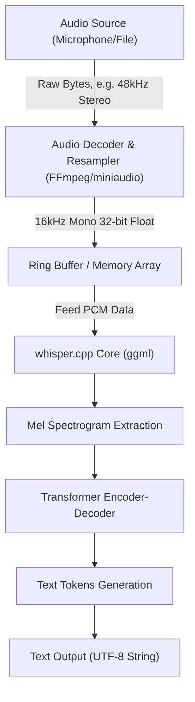
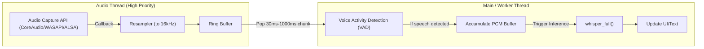

## 1. Introduction: Why C++ for Speech Recognition?

Since OpenAI open-sourced its highly accurate speech recognition model, "Whisper," it has been utilized in various applications. While it is commonly used in Python environments (based on PyTorch), relying on a Python interpreter becomes a major performance bottleneck when integrating it into **edge devices (smartphones, IoT devices, embedded systems)** or **native C++ applications that require strict real-time performance** (game engines, DAW software, robotics, etc.).

This is where **[whisper.cpp](https://github.com/ggerganov/whisper.cpp)**, developed by Georgi Gerganov, comes to the rescue. Based on `ggml`, a tensor computation library for machine learning, this library minimizes dependencies and implements Whisper's inference entirely in C/C++.

In this article, we will thoroughly explain how to integrate top-tier speech recognition capabilities into your custom C++ project using `whisper.cpp`. We will cover everything from the basics of audio signal processing, detailed API usage, memory management, and multi-threading optimization, to implementation patterns for real-time processing.

---

## 2. Audio Signal Processing and Whisper's Input Requirements

To make an AI understand speech, we must convert the analog signal ("sound") into digital data and format it into a tensor that the AI model can process. The audio format required by Whisper is very strict.

### 2.1 Audio Format Required by Whisper

The Whisper model accepts audio data with the following specifications:

* **Sample Rate**: 16,000 Hz (16 kHz)
* **Channels**: 1 (Mono)
* **Data Type**: 32-bit floating point (`float` in C/C++)
* **Normalization**: Values scaled to the range of $[-1.0, 1.0]$

For example, if you input an audio file with CD quality (44.1kHz, Stereo, 16-bit PCM), you must perform downsampling, channel mixdown, and format conversion beforehand.

The formula for calculating the data transfer rate is as follows:

$$ \text{Data Rate (bytes/sec)} = \text{Sample Rate} \times \text{Channels} \times \frac{\text{Bit Depth}}{8} $$

For Whisper's requirements (16kHz, 1ch, 32-bit Float), the data size per second is:

$$ 16000 \times 1 \times \frac{32}{8} = 64,000 \text{ bytes/sec (64 KB/s)} $$

Since this is extremely lightweight, even edge devices with limited memory bandwidth can easily buffer it.

### 2.2 The Mathematics of Mel-Spectrogram Conversion

Internally, Whisper does not process 1D audio waveform data (Raw Waveform) directly. The audio is converted into a **Mel-Spectrogram**, a frequency representation close to human auditory characteristics, before being fed into the Transformer model. While `whisper.cpp` includes this conversion process within its C++ implementation, understanding how it works is useful for noise mitigation and optimizing preprocessing.

The mathematical formula to convert a regular frequency $f$ (Hz) into the Mel scale $m$ is approximated as follows:

$$ m = 2595 \log_{10} \left( 1 + \frac{f}{700} \right) $$

Conversely, the inverse conversion from the Mel scale back to frequency is:

$$ f = 700 \left( 10^{\frac{m}{2595}} - 1 \right) $$

Furthermore, the audio waveform is transformed into the time-frequency domain using the **Short-Time Fourier Transform (STFT)**. The discrete form of STFT using a window function $w(n)$ is expressed as:

$$ X(m, k) = \sum_{n=0}^{N-1} x(n + mH) w(n) e^{-j \frac{2\pi}{N} k n} $$
*(Here, $N$ is the FFT window size, $H$ is the hop size, and $w(n)$ is a window function like the Hann window)*

The Whisper model typically uses a window size $N = 400$ (25ms), a hop size $H = 160$ (10ms), and an 80-dimensional Mel filter bank. This feature extraction is executed automatically (and rapidly using SIMD instructions) when calling `whisper_full()` within `whisper.cpp`.

---

## 3. Architecture and Pipeline Design

Let's design the audio processing pipeline in a C++ application. The flow starts from a file or microphone input, goes through preprocessing, inference via `whisper.cpp`, and finally reaches the text output.



The application is responsible for the **section from A to C (audio decoding and resampling)** in the diagram above. Since `whisper.cpp` itself does not include an audio file decoder, the best practice is to combine it with libraries like FFmpeg or `miniaudio`.

---

## 4. Building and Integrating whisper.cpp

Here are the steps to integrate `whisper.cpp` into your project. Using CMake is the most versatile approach.

### CMakeLists.txt Configuration

You can include `whisper.cpp` into your project as source code or add it as a submodule and link it.

```cmake
cmake_minimum_required(VERSION 3.14)
project(WhisperApp C CXX)

set(CMAKE_CXX_STANDARD 17)
set(CMAKE_CXX_STANDARD_REQUIRED ON)

# Enable CPU instruction extensions (AVX, F16C, etc.)
# For MacOS, the NEON/Accelerate framework is automatically enabled
set(WHISPER_SUPPORT_SDL2 OFF CACHE BOOL "" FORCE)
add_subdirectory(whisper.cpp)

add_executable(whisper_app main.cpp)
target_link_libraries(whisper_app PRIVATE whisper)
```

With this configuration, the highly optimized `ggml` backend of `whisper.cpp` is built and statically linked to your application.

---

## 5. C++ API Details and Implementation Steps

Now, let's explain how to use the API by looking at actual C++ code.

### 5.1 Context Initialization and Model Loading

In `whisper.cpp`, all states and memory allocations are managed by the `whisper_context` struct.

```cpp
#include "whisper.h"
#include <iostream>
#include <vector>
#include <string>

int main() {
    // 1. Initialize parameters
    struct whisper_context_params cparams = whisper_context_default_params();
    cparams.use_gpu = true; // Use GPU acceleration (CuBLAS/Metal) if available

    // 2. Load the model (ggml format binary model)
    const std::string model_path = "models/ggml-base.bin";
    struct whisper_context * ctx = whisper_init_from_file_with_params(model_path.c_str(), cparams);

    if (ctx == nullptr) {
        std::cerr << "Error: Failed to load the model - " << model_path << std::endl;
        return 1;
    }
    
    std::cout << "Model loaded successfully." << std::endl;

    // 3. Set parameters for full inference (using Greedy Sampling)
    struct whisper_full_params wparams = whisper_full_default_params(WHISPER_SAMPLING_GREEDY);
    
    // Set the number of threads (matching the physical CPU cores is optimal)
    wparams.n_threads = 4;
    
    // Language setting ("auto" for auto-detection, "ja" for Japanese)
    wparams.language = "ja";
    
    // Suppress standard output for intermediate results (to control it within the app)
    wparams.print_progress = false;
    wparams.print_realtime = false;
    
    // Translation feature (set to true to directly translate Japanese audio to English text)
    wparams.translate = false;

    // Virtual audio data (in reality, PCM data obtained from a file or microphone)
    // 3 seconds (16000 Hz * 3 sec = 48000 samples)
    std::vector<float> pcmf32(48000, 0.0f); 

    // 4. Run inference
    if (whisper_full(ctx, wparams, pcmf32.data(), pcmf32.size()) != 0) {
        std::cerr << "Error: Failed to execute whisper_full." << std::endl;
        whisper_free(ctx);
        return 1;
    }

    // 5. Retrieve and display the results
    const int n_segments = whisper_full_n_segments(ctx);
    
    for (int i = 0; i < n_segments; ++i) {
        const char * text = whisper_full_get_segment_text(ctx, i);
        
        // Retrieve timestamps (Unit: 10ms)
        const int64_t t0 = whisper_full_get_segment_t0(ctx, i);
        const int64_t t1 = whisper_full_get_segment_t1(ctx, i);
        
        std::cout << "[" << (t0 * 10.0) << " ms -> " << (t1 * 10.0) << " ms]: " 
                  << text << std::endl;
    }

    // 6. Free memory
    whisper_free(ctx);
    return 0;
}
```

This code block serves as the most fundamental template for using Whisper in C++.

---

## 6. Advanced Implementation of Real-Time Speech Recognition

Processing pre-recorded files is easy, but to improve the application's UX, "real-time speech recognition (streaming recognition)" from a microphone input is necessary.

To implement this, a multi-threaded architecture and managing the audio stream using a Ring Buffer are essential.



### 6.1 The Importance of Voice Activity Detection (VAD)

In real-time processing, it is a waste of computational resources to constantly run inference on silent parts. By inserting a VAD algorithm (like simple energy-based thresholding or WebRTC VAD) in the preceding stage, you can implement control logic such as: **"Start buffering only when speech begins, and kick off `whisper_full` when speech ends (after a certain period of silence)."**

### 6.2 Sliding Window Approach

When speech continues for a long time, we use a "sliding window" approach where chunks are cut out every few seconds for inference. However, if you simply chop the audio abruptly, words may be cut off in the middle, significantly degrading recognition accuracy.

As a countermeasure, we use a technique where we **"always run inference including the context of the past N seconds"** (overlapping). `whisper.cpp` also has a feature called `wparams.prompt_tokens` that carries over past text tokens as a prompt, enabling highly accurate streaming recognition that maintains context.

---

## 7. Memory Management and Optimization for Edge Devices

Let's delve deeper into performance and memory efficiency, which are the greatest advantages of `whisper.cpp`.

### 7.1 The Power of the ggml Tensor Library

`ggml`, the backend of `whisper.cpp`, is a C-language tensor library with no dependencies. Its biggest feature is its support for **dynamic quantization of weight data**.

For example, let's calculate the memory size of the Whisper `Small` model (about 244 million parameters).
For standard precision (16-bit Float = 2 bytes):

$$ \text{Memory (FP16)} \approx 244,000,000 \times 2 \text{ bytes} \approx 488 \text{ MB} $$

If we convert this to 4-bit quantization (Q4_0 format), it averages about 0.5 bytes per parameter (approximately 0.56 bytes including overhead like scaling factors).

$$ \text{Memory (Q4\_0)} \approx 244,000,000 \times 0.56 \text{ bytes} \approx 137 \text{ MB} $$

In environments with strict RAM constraints like iOS devices or Raspberry Pi, reducing this memory footprint directly translates to the overall stability of the application.

### 7.2 Utilizing Hardware Acceleration

While it is sufficiently fast on a CPU alone due to AVX2 or NEON instructions, `whisper.cpp` also supports hardware acceleration from various GPUs and NPUs as backends.

* **Apple Silicon (Mac/iOS)**: Metal API support via `ggml-metal`. Ultra-fast inference using the GPU.
* **NVIDIA GPU (Windows/Linux)**: `cuBLAS` support. Specify `-DWHISPER_CUBLAS=ON` during CMake build.
* **Intel (Windows/Linux)**: `OpenVINO` backend support. Can utilize the NPU on the latest Intel Core processors.

When using these accelerators in a C++ project, there is almost no need to modify the source code. As long as `cparams.use_gpu = true;` is set during context initialization, the workload is automatically offloaded to the hardware depending on the built backend.

### 7.3 Tuning Caches and the Number of Threads

The setting of `wparams.n_threads` is extremely important. Blindly increasing the number of threads will not improve performance due to the memory bandwidth bottleneck (Memory Bound).

As a rule of thumb, it is ideal to determine the number of threads using the following formula:

$$ N_{\text{threads}} = \min(\text{Physical CPU Cores}, 4 \sim 8) $$

Including logical cores like Hyper-Threading often causes cache contention and conversely slows down the inference speed, so setting it to the **number of physical cores** is a golden rule. If you use `std::thread::hardware_concurrency()` in C++11, it returns the number of logical cores, so it is recommended to hardcode it depending on the environment or get the physical core count via OS-level APIs.

---

## 8. Conclusion

In this article, we thoroughly explained how to leverage `whisper.cpp` to integrate top-tier speech recognition AI into a C++ project, covering everything from theory to practice and optimization.

* **Strict adherence to input requirements**: Ensure 16kHz, 1ch, 32-bit Float.
* **Intuitive API usage**: A simple design where inference is completed just with `whisper_init_from_file_with_params` and `whisper_full`.
* **Real-time implementation**: Multi-thread control using VAD and sliding windows.
* **Overwhelming optimization**: The benefits of 4-bit quantization via `ggml` and hardware backends like Metal/cuBLAS.

Break free from dependencies on massive Python environments or cloud APIs, and please make use of `whisper.cpp` to develop audio processing applications that run fast and securely in native environments. Local-only AI will become an extremely crucial core technology in future software development from the perspectives of privacy protection and latency.
