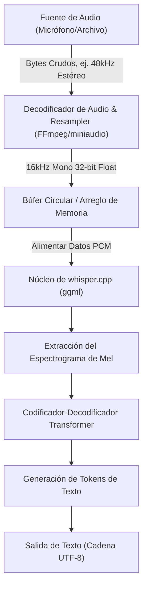
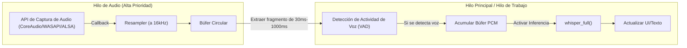

## 1. Introducción: ¿Por qué reconocimiento de voz en C++?

El modelo de reconocimiento de voz de alta precisión "Whisper", desarrollado por OpenAI, ha sido utilizado en diversas aplicaciones desde que se convirtió en código abierto. Aunque su uso en entornos Python (basados en PyTorch) es común, al integrarlo en **dispositivos edge (teléfonos inteligentes, equipos IoT, sistemas embebidos)** o en **aplicaciones nativas de C++ que requieren alta capacidad de tiempo real** (motores de juegos, software DAW, robótica, etc.), la dependencia del intérprete de Python se convierte en un importante cuello de botella para el rendimiento.

Aquí es donde entra en juego el salvador: **[whisper.cpp](https://github.com/ggerganov/whisper.cpp)**, desarrollado por Georgi Gerganov. Esta biblioteca, basada en la biblioteca de cálculo tensorial para aprendizaje automático `ggml`, reduce las dependencias al límite y logra la inferencia de Whisper únicamente con C/C++.

En este artículo, explicaremos exhaustivamente cómo utilizar `whisper.cpp` para integrar funciones de reconocimiento de voz de primer nivel en sus propios proyectos C++, abarcando desde los fundamentos del procesamiento de señales de audio, el uso detallado de la API, la gestión de memoria, la optimización de múltiples hilos, hasta los patrones de implementación del procesamiento en tiempo real.

---

## 2. Procesamiento de señales de audio y requisitos de entrada de Whisper

Para que la IA entienda el habla, es necesario convertir el "sonido" (una señal analógica) en datos digitales y transformarlo a un formato (tensor) que el modelo de IA pueda procesar. El formato de audio que exige Whisper es muy estricto.

### 2.1 Formato de audio exigido por Whisper

El modelo Whisper acepta como entrada datos de audio con las siguientes especificaciones:

* **Frecuencia de muestreo (Sample Rate)**: 16,000 Hz (16 kHz)
* **Número de canales (Channels)**: 1 (monoaural)
* **Tipo de datos (Data Type)**: Número de punto flotante de 32 bits (`float` en C/C++)
* **Normalización (Normalization)**: Valores escalados en el rango de $[-1.0, 1.0]$

Por ejemplo, si se introduce un archivo de audio con calidad de CD (44.1kHz, estéreo, PCM de 16 bits), se debe realizar previamente un submuestreo (downsampling), una mezcla de canales (mixdown) y una conversión de formato.

La fórmula para calcular la tasa de transferencia de datos es la siguiente:

$$ \text{Data Rate (bytes/sec)} = \text{Sample Rate} \times \text{Channels} \times \frac{\text{Bit Depth}}{8} $$

El tamaño de los datos por segundo bajo los requisitos de Whisper (16kHz, 1 canal, Float de 32 bits) es:

$$ 16000 \times 1 \times \frac{32}{8} = 64,000 \text{ bytes/sec (64 KB/s)} $$

Al ser muy ligero, es completamente posible realizar el almacenamiento en búfer (buffering) incluso en dispositivos edge con ancho de banda de memoria limitado.

### 2.2 Matemáticas de la conversión del espectrograma de Mel

Internamente, Whisper no procesa directamente los datos de forma de onda de audio unidimensional (Raw Waveform). Antes de ingresar al modelo Transformer, se convierte a un **espectrograma de Mel (Mel-Spectrogram)**, que es una representación de frecuencia cercana a las características de la audición humana. `whisper.cpp` incluye este proceso de conversión dentro de su implementación en C++, pero comprender su mecanismo es útil para lidiar con el ruido y optimizar el preprocesamiento.

La fórmula para convertir la frecuencia normal $f$ (Hz) a la escala Mel $m$ se aproxima de la siguiente manera:

$$ m = 2595 \log_{10} \left( 1 + \frac{f}{700} \right) $$

A la inversa, la conversión inversa de la escala Mel a la frecuencia es la siguiente:

$$ f = 700 \left( 10^{\frac{m}{2595}} - 1 \right) $$

Además, la forma de onda de audio se convierte al dominio del tiempo y la frecuencia mediante la **Transformada de Fourier de Corto Tiempo (STFT: Short-Time Fourier Transform)**. La forma discreta de STFT usando una función de ventana $w(n)$ se expresa de la siguiente manera:

$$ X(m, k) = \sum_{n=0}^{N-1} x(n + mH) w(n) e^{-j \frac{2\pi}{N} k n} $$
*(Aquí, $N$ es el tamaño de la ventana FFT, $H$ es el tamaño del salto (hop size) y $w(n)$ es una función de ventana, como la ventana de Hann)*

El modelo Whisper normalmente utiliza un tamaño de ventana $N = 400$ (25ms), un tamaño de salto $H = 160$ (10ms) y un banco de filtros Mel de 80 dimensiones. Esta extracción de características se ejecuta automáticamente (y a alta velocidad utilizando instrucciones SIMD) cuando se llama a `whisper_full()` dentro de `whisper.cpp`.

---

## 3. Arquitectura y diseño del pipeline

Diseñemos un pipeline de procesamiento de audio en una aplicación C++. Es el flujo que comienza desde la entrada de archivo o micrófono, pasa por el preprocesamiento, la inferencia mediante `whisper.cpp`, y termina en la salida de texto.



La aplicación debe ser responsable de la **sección desde A hasta C en el diagrama anterior (decodificación de audio y remuestreo)**. Dado que `whisper.cpp` en sí mismo no incluye un decodificador de archivos de audio, la mejor práctica es utilizarlo en combinación con bibliotecas como FFmpeg o `miniaudio`.

---

## 4. Compilación e integración de whisper.cpp

Estos son los pasos para integrar `whisper.cpp` en su proyecto. Usar CMake es lo más versátil.

### Configuración de CMakeLists.txt

`whisper.cpp` se puede incorporar al proyecto como código fuente o agregarse como submódulo y enlazarse.

```cmake
cmake_minimum_required(VERSION 3.14)
project(WhisperApp C CXX)

set(CMAKE_CXX_STANDARD 17)
set(CMAKE_CXX_STANDARD_REQUIRED ON)

# Habilitación de instrucciones extendidas de CPU (AVX, F16C, etc.)
# Para MacOS, el framework NEON/Accelerate se habilita automáticamente
set(WHISPER_SUPPORT_SDL2 OFF CACHE BOOL "" FORCE)
add_subdirectory(whisper.cpp)

add_executable(whisper_app main.cpp)
target_link_libraries(whisper_app PRIVATE whisper)
```

Con esta configuración, el backend `ggml` altamente optimizado de `whisper.cpp` se compilará y se enlazará estáticamente a su aplicación.

---

## 5. Detalles y pasos de implementación de la API de C++

Ahora, explicaremos cómo llamar a la API observando el código C++ real.

### 5.1 Inicialización del contexto y carga del modelo

En `whisper.cpp`, todos los estados y asignaciones de memoria se gestionan a través de la estructura `whisper_context`.

```cpp
#include "whisper.h"
#include <iostream>
#include <vector>
#include <string>

int main() {
    // 1. Inicialización de parámetros
    struct whisper_context_params cparams = whisper_context_default_params();
    cparams.use_gpu = true; // Usar aceleración GPU (CuBLAS/Metal) si está disponible

    // 2. Carga del modelo (modelo binario en formato ggml)
    const std::string model_path = "models/ggml-base.bin";
    struct whisper_context * ctx = whisper_init_from_file_with_params(model_path.c_str(), cparams);

    if (ctx == nullptr) {
        std::cerr << "Error: Fallo al cargar el modelo - " << model_path << std::endl;
        return 1;
    }
    
    std::cout << "Modelo cargado con éxito." << std::endl;
```

Los archivos del modelo están en un formato `.bin` cuantizado de manera propietaria. Puede utilizar los scripts de conversión en el repositorio oficial o descargarlos directamente de HuggingFace. En entornos con estrictas limitaciones de memoria, el uso de modelos cuantizados de 4 bits (por ejemplo, `ggml-base-q4_0.bin`) puede reducir el consumo de RAM a aproximadamente 1/4.

### 5.2 Configuración de parámetros de inferencia

A continuación, configure `whisper_full_params`, que controla el comportamiento de la inferencia.

```cpp
    // 3. Configuración de los parámetros para inferencia completa (usando Greedy Sampling)
    struct whisper_full_params wparams = whisper_full_default_params(WHISPER_SAMPLING_GREEDY);
    
    // Configuración del número de hilos (lo óptimo es ajustarlo al número de núcleos físicos de la CPU)
    wparams.n_threads = 4;
    
    // Configuración de idioma (detección automática es "auto", para japonés se especifica "ja")
    wparams.language = "ja";
    
    // Suprimir la salida estándar de resultados intermedios (para controlarlo dentro de la aplicación)
    wparams.print_progress = false;
    wparams.print_realtime = false;
    
    // Función de traducción (true si se traduce directamente audio en japonés a texto en inglés)
    wparams.translate = false;
```

### 5.3 Preparación de datos de audio y ejecución de la inferencia

Aquí asumimos que los datos de audio a 16kHz ya están almacenados en un `std::vector<float>`.

```cpp
    // Datos de audio virtuales (en realidad, datos PCM obtenidos de un archivo o micrófono)
    // 3 segundos (16000 Hz * 3 seg = 48000 muestras)
    std::vector<float> pcmf32(48000, 0.0f); 

    // 4. Ejecución de la inferencia
    if (whisper_full(ctx, wparams, pcmf32.data(), pcmf32.size()) != 0) {
        std::cerr << "Error: Fallo al ejecutar whisper_full." << std::endl;
        whisper_free(ctx);
        return 1;
    }
```

### 5.4 Extracción de resultados

Cuando `whisper_full` se completa, los resultados del reconocimiento se guardan en el contexto por segmentos.

```cpp
    // 5. Obtención y visualización de los resultados
    const int n_segments = whisper_full_n_segments(ctx);
    
    for (int i = 0; i < n_segments; ++i) {
        const char * text = whisper_full_get_segment_text(ctx, i);
        
        // Obtención de marcas de tiempo (unidad: 10ms)
        const int64_t t0 = whisper_full_get_segment_t0(ctx, i);
        const int64_t t1 = whisper_full_get_segment_t1(ctx, i);
        
        std::cout << "[" << (t0 * 10.0) << " ms -> " << (t1 * 10.0) << " ms]: " 
                  << text << std::endl;
    }

    // 6. Liberación de memoria
    whisper_free(ctx);
    return 0;
}
```

Este bloque de código sirve como la plantilla más básica para usar Whisper en C++.

---

## 6. Implementación avanzada del reconocimiento de voz en tiempo real

Procesar archivos pregrabados es sencillo, pero para mejorar la experiencia de usuario (UX) de una aplicación, se necesita el "reconocimiento de voz en tiempo real (reconocimiento en streaming)" desde la entrada de un micrófono.

Para implementar esto, es indispensable gestionar el flujo de audio mediante una arquitectura de múltiples hilos y un búfer circular (Ring Buffer).



### 6.1 Importancia de la Detección de Actividad de Voz (VAD)

En el procesamiento en tiempo real, ejecutar constantemente la inferencia, incluso en partes silenciosas, es un desperdicio de recursos computacionales. Al intercalar un algoritmo VAD (como el procesamiento de umbral basado en energía simple o WebRTC VAD) en la etapa preliminar, se realiza el control de **"iniciar el almacenamiento en búfer solo cuando se inicia el habla, y activar `whisper_full` en el momento en que el habla termina (un cierto tiempo de silencio)"**.

### 6.2 Enfoque de ventana deslizante (Sliding Window)

Cuando el habla continúa por mucho tiempo, se utiliza la técnica de "ventana deslizante", que recorta fragmentos cada pocos segundos y realiza la inferencia. Sin embargo, si simplemente se corta el audio bruscamente, se cortará a mitad de las palabras y la precisión del reconocimiento disminuirá drásticamente.

Como contramedida, se utiliza una técnica en la que **"siempre se incluye el contexto de los últimos N segundos pasados para realizar la inferencia"** (superposición). `whisper.cpp` también tiene una función llamada `wparams.prompt_tokens` que transfiere tokens de texto anteriores como indicaciones (prompts), lo que permite un reconocimiento en streaming de alta precisión manteniendo el contexto.

---

## 7. Gestión de memoria y optimización para dispositivos edge

Profundizaremos en el rendimiento y la eficiencia de la memoria, que son las mayores ventajas de `whisper.cpp`.

### 7.1 El poder de la biblioteca de tensores ggml

El backend de `whisper.cpp`, `ggml`, es una biblioteca de tensores en C sin dependencias. Su mayor característica es que admite la **cuantización dinámica (Quantization) de los datos de los pesos**.

Por ejemplo, calculemos el tamaño de memoria del modelo Whisper `Small` (aproximadamente 240 millones de parámetros).
En el caso normal (Float de 16 bits = 2 bytes):

$$ \text{Memory (FP16)} \approx 244,000,000 \times 2 \text{ bytes} \approx 488 \text{ MB} $$

Si se convierte a cuantización de 4 bits (formato Q4_0), será en promedio 0.5 bytes por parámetro (aproximadamente 0.56 bytes si se incluye la sobrecarga como los factores de escala).

$$ \text{Memory (Q4\_0)} \approx 244,000,000 \times 0.56 \text{ bytes} \approx 137 \text{ MB} $$

En entornos con estrictas limitaciones de RAM, como dispositivos iOS o Raspberry Pi, esta reducción de la huella de memoria (memory footprint) se relaciona directamente con la estabilidad general de la aplicación.

### 7.2 Uso de la aceleración por hardware

Aunque es lo suficientemente rápido solo con la CPU usando instrucciones AVX2 o NEON, `whisper.cpp` también admite varios tipos de aceleración de hardware de GPU/NPU como backend.

* **Apple Silicon (Mac/iOS)**: Soporte para Metal API mediante `ggml-metal`. Inferencia ultra rápida utilizando la GPU.
* **NVIDIA GPU (Windows/Linux)**: Soporte para `cuBLAS`. Especifique `-DWHISPER_CUBLAS=ON` al compilar con CMake.
* **Intel (Windows/Linux)**: Soporte para el backend `OpenVINO`. Permite aprovechar la NPU en los procesadores Intel Core más recientes.

Al utilizar estos aceleradores en un proyecto de C++, casi no es necesario modificar el código fuente. Siempre que se configure `cparams.use_gpu = true;` al inicializar el contexto, se descargará automáticamente en el hardware según el backend compilado.

### 7.3 Ajuste de caché y número de hilos

La configuración de `wparams.n_threads` es muy importante. Aumentar a ciegas el número de hilos no mejorará el rendimiento debido a los cuellos de botella del ancho de banda de la memoria (Memory Bound).

Como regla empírica, lo ideal es determinar el número de hilos utilizando la siguiente fórmula:

$$ N_{\text{threads}} = \min(\text{Physical CPU Cores}, 4 \sim 8) $$

Si se incluyen los núcleos lógicos, como en el Hyper-Threading, a menudo se producen conflictos en la caché y la velocidad de inferencia disminuye; por lo tanto, la regla general es establecerlo en el **número de núcleos físicos**. Como el uso de `std::thread::hardware_concurrency()` en C++11 devuelve el número de núcleos lógicos, se recomienda codificar esto (hardcode) según el entorno u obtener el número de núcleos físicos utilizando APIs a nivel del sistema operativo.

---

## 8. Conclusión

En este artículo, hemos explicado en detalle cómo utilizar `whisper.cpp` para integrar la IA de reconocimiento de voz de primer nivel en proyectos C++, desde la teoría hasta la práctica y la optimización.

* **Cumplimiento de los requisitos de entrada**: Apego estricto a 16kHz, 1 canal, Float de 32 bits.
* **Uso intuitivo de la API**: Un diseño simple en el que la inferencia se completa solo con `whisper_init_from_file_with_params` y `whisper_full`.
* **Procesamiento en tiempo real**: Control de múltiples hilos mediante VAD y ventana deslizante.
* **Optimización asombrosa**: Los beneficios de la cuantización de 4 bits con `ggml` y los backends de hardware como Metal/cuBLAS.

Corte la dependencia de entornos de Python enormes y de las APIs en la nube, y utilice `whisper.cpp` para el desarrollo de aplicaciones de procesamiento de audio que se ejecuten de manera rápida y segura en entornos nativos. Desde el punto de vista de la protección de la privacidad y la latencia, la IA de ejecución local será una tecnología clave extremadamente importante en el desarrollo de software del futuro.
