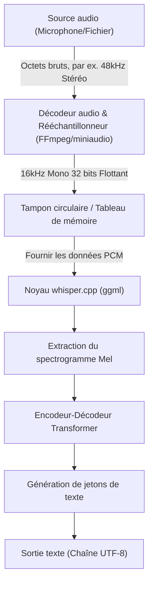
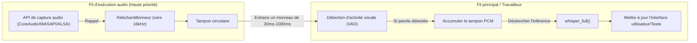

## 1. Introduction : Pourquoi la reconnaissance vocale en C++ ?

Le modèle de reconnaissance vocale de haute précision « Whisper », développé par OpenAI, est utilisé dans diverses applications depuis qu'il a été rendu open source. Bien qu'il soit couramment utilisé dans un environnement Python (basé sur PyTorch), l'intégration dans des **appareils périphériques (smartphones, appareils IoT, systèmes embarqués)** ou des **applications natives C++ nécessitant de hautes performances en temps réel** (moteurs de jeu, logiciels DAW, robotique, etc.) rend la dépendance à l'interpréteur Python un goulot d'étranglement majeur pour les performances.

Le sauveur ici est **[whisper.cpp](https://github.com/ggerganov/whisper.cpp)**, développé par M. Georgi Gerganov. Cette bibliothèque, basée sur la bibliothèque de calcul tensoriel pour l'apprentissage automatique `ggml`, réduit les dépendances à la limite absolue et réalise l'inférence de Whisper uniquement en C/C++.

Cet article expliquera de manière exhaustive comment utiliser `whisper.cpp` pour intégrer des fonctionnalités de reconnaissance vocale de pointe dans vos propres projets C++, allant des bases du traitement des signaux audio, de l'utilisation détaillée de l'API, de la gestion de la mémoire, de l'optimisation multithread, jusqu'aux modèles d'implémentation de traitement en temps réel.

---

## 2. Traitement des signaux audio et exigences d'entrée de Whisper

Pour qu'une IA comprenne la parole, le « son », qui est un signal analogique, doit être converti en données numériques et décomposé en un format (tenseur) que le modèle d'IA peut traiter. Le format audio requis par Whisper est très strict.

### 2.1 Format audio requis par Whisper

Le modèle Whisper accepte des données audio avec les spécifications suivantes en entrée :

* **Fréquence d'échantillonnage (Sample Rate)** : 16 000 Hz (16 kHz)
* **Nombre de canaux (Channels)** : 1 (Mono)
* **Type de données (Data Type)** : Nombre à virgule flottante de 32 bits (`float` en C/C++)
* **Normalisation (Normalization)** : Valeurs mises à l'échelle dans la plage de $[-1.0, 1.0]$

Par exemple, si vous utilisez un fichier audio de qualité CD (44,1 kHz, stéréo, 16 bits PCM) comme entrée, vous devez effectuer au préalable un sous-échantillonnage, un mixage réducteur des canaux et une conversion de format.

La formule de calcul du taux de transfert de données est la suivante :

$$ \text{Data Rate (bytes/sec)} = \text{Sample Rate} \times \text{Channels} \times \frac{\text{Bit Depth}}{8} $$

La taille des données par seconde pour les exigences de Whisper (16 kHz, 1 canal, 32 bits Float) est :

$$ 16000 \times 1 \times \frac{32}{8} = 64,000 \text{ bytes/sec (64 KB/s)} $$

Étant très léger, la mise en mémoire tampon est tout à fait possible même sur les appareils périphériques avec une bande passante mémoire limitée.

### 2.2 Mathématiques de la conversion en spectrogramme Mel

En interne, Whisper ne traite pas directement les données de forme d'onde audio unidimensionnelles (Raw Waveform). Avant d'être transmises au modèle Transformer, elles sont converties en un **spectrogramme Mel (Mel-Spectrogram)**, qui est une représentation fréquentielle proche des caractéristiques de l'audition humaine. `whisper.cpp` inclut ce processus de conversion dans son implémentation C++, mais en comprendre le mécanisme est utile pour la réduction du bruit et l'optimisation du prétraitement.

La formule pour convertir une fréquence normale $f$ (Hz) à l'échelle Mel $m$ est approximée comme suit :

$$ m = 2595 \log_{10} \left( 1 + \frac{f}{700} \right) $$

Inversement, la transformation de l'échelle Mel vers la fréquence est :

$$ f = 700 \left( 10^{\frac{m}{2595}} - 1 \right) $$

De plus, la forme d'onde audio est convertie dans le domaine temps-fréquence par une **Transformation de Fourier à court terme (STFT: Short-Time Fourier Transform)**. La forme discrète de la STFT utilisant une fonction de fenêtrage $w(n)$ est exprimée comme suit :

$$ X(m, k) = \sum_{n=0}^{N-1} x(n + mH) w(n) e^{-j \frac{2\pi}{N} k n} $$
*(Où $N$ est la taille de la fenêtre FFT, $H$ est la taille de saut, et $w(n)$ est une fonction de fenêtrage comme la fenêtre de Hann)*

Le modèle Whisper utilise généralement une taille de fenêtre $N = 400$ (25 ms), une taille de saut $H = 160$ (10 ms) et une banque de filtres Mel à 80 dimensions. Cette extraction de caractéristiques est effectuée automatiquement (et rapidement à l'aide d'instructions SIMD) lors de l'appel de `whisper_full()` dans `whisper.cpp`.

---

## 3. Architecture et conception du pipeline

Concevons le pipeline de traitement audio dans une application C++. Le flux commence par une entrée de fichier ou de microphone, passe par le prétraitement, suivi de l'inférence par `whisper.cpp`, et enfin de la sortie texte.



La responsabilité du côté de l'application est la **section de A à C (décodage et rééchantillonnage audio)** dans le diagramme ci-dessus. Comme `whisper.cpp` lui-même n'inclut pas de décodeur de fichier audio, la meilleure pratique consiste à l'utiliser en combinaison avec des bibliothèques telles que FFmpeg ou `miniaudio`.

---

## 4. Construction et introduction de whisper.cpp

Voici les étapes pour intégrer `whisper.cpp` dans votre projet. L'utilisation de CMake est la plus polyvalente.

### Configuration de CMakeLists.txt

`whisper.cpp` peut être inclus dans le projet sous forme de code source, ou ajouté en tant que sous-module et lié.

```cmake
cmake_minimum_required(VERSION 3.14)
project(WhisperApp C CXX)

set(CMAKE_CXX_STANDARD 17)
set(CMAKE_CXX_STANDARD_REQUIRED ON)

# Activation des instructions d'extension CPU (AVX, F16C, etc.)
# Sur MacOS, le framework NEON/Accelerate est automatiquement activé
set(WHISPER_SUPPORT_SDL2 OFF CACHE BOOL "" FORCE)
add_subdirectory(whisper.cpp)

add_executable(whisper_app main.cpp)
target_link_libraries(whisper_app PRIVATE whisper)
```

Avec cette configuration, le backend `ggml` hautement optimisé de `whisper.cpp` sera construit et lié statiquement à l'application.

---

## 5. Détails de l'API C++ et étapes d'implémentation

Maintenant, expliquons comment appeler l'API en regardant le code C++ réel.

### 5.1 Initialisation du contexte et chargement du modèle

Dans `whisper.cpp`, tous les états et l'allocation de mémoire sont gérés par la structure `whisper_context`.

```cpp
#include "whisper.h"
#include <iostream>
#include <vector>
#include <string>

int main() {
    // 1. Initialisation des paramètres
    struct whisper_context_params cparams = whisper_context_default_params();
    cparams.use_gpu = true; // Utiliser l'accélération GPU (CuBLAS/Metal) si disponible

    // 2. Chargement du modèle (modèle binaire au format ggml)
    const std::string model_path = "models/ggml-base.bin";
    struct whisper_context * ctx = whisper_init_from_file_with_params(model_path.c_str(), cparams);

    if (ctx == nullptr) {
        std::cerr << "Erreur : Échec du chargement du modèle - " << model_path << std::endl;
        return 1;
    }
    
    std::cout << "Le modèle a été chargé avec succès." << std::endl;
```

Le fichier de modèle est dans un format `.bin` quantifié de manière unique. Vous pouvez utiliser le script de conversion dans le dépôt officiel ou le télécharger directement depuis HuggingFace. Dans les environnements avec des limites de mémoire strictes, l'utilisation d'un modèle quantifié sur 4 bits (par exemple, `ggml-base-q4_0.bin`) peut réduire la consommation de RAM à environ un quart.

### 5.2 Configuration des paramètres d'inférence

Ensuite, nous configurons `whisper_full_params` qui contrôle le comportement de l'inférence.

```cpp
    // 3. Configuration des paramètres pour l'inférence complète (Utilise l'échantillonnage glouton - Greedy Sampling)
    struct whisper_full_params wparams = whisper_full_default_params(WHISPER_SAMPLING_GREEDY);
    
    // Configuration du nombre de threads (le mieux est de correspondre au nombre de cœurs physiques du CPU)
    wparams.n_threads = 4;
    
    // Configuration de la langue (La détection automatique est "auto", la spécification japonaise est "ja")
    wparams.language = "ja";
    
    // Supprimer la sortie standard des résultats intermédiaires (pour la contrôler dans l'application)
    wparams.print_progress = false;
    wparams.print_realtime = false;
    
    // Fonctionnalité de traduction (true si on traduit l'audio japonais directement en texte anglais)
    wparams.translate = false;
```

### 5.3 Préparation des données audio et exécution de l'inférence

Ici, nous supposons que les données audio 16 kHz sont déjà stockées dans un `std::vector<float>`.

```cpp
    // Données audio virtuelles (en réalité, des données PCM acquises à partir d'un fichier ou d'un micro)
    // 3 secondes (16000 Hz * 3 sec = 48000 échantillons)
    std::vector<float> pcmf32(48000, 0.0f); 

    // 4. Exécution de l'inférence
    if (whisper_full(ctx, wparams, pcmf32.data(), pcmf32.size()) != 0) {
        std::cerr << "Erreur : Échec de l'exécution de whisper_full." << std::endl;
        whisper_free(ctx);
        return 1;
    }
```

### 5.4 Extraction des résultats

Une fois `whisper_full` terminé, les résultats de la reconnaissance sont sauvegardés segment par segment dans le contexte.

```cpp
    // 5. Récupération et affichage des résultats
    const int n_segments = whisper_full_n_segments(ctx);
    
    for (int i = 0; i < n_segments; ++i) {
        const char * text = whisper_full_get_segment_text(ctx, i);
        
        // Obtenir l'horodatage (Unité : 10ms)
        const int64_t t0 = whisper_full_get_segment_t0(ctx, i);
        const int64_t t1 = whisper_full_get_segment_t1(ctx, i);
        
        std::cout << "[" << (t0 * 10.0) << " ms -> " << (t1 * 10.0) << " ms]: " 
                  << text << std::endl;
    }

    // 6. Libération de la mémoire
    whisper_free(ctx);
    return 0;
}
```

Ce bloc de code est le modèle le plus basique pour utiliser Whisper en C++.

---

## 6. Implémentation avancée de la reconnaissance vocale en temps réel

Le traitement de fichiers préenregistrés est facile, mais pour améliorer l'expérience utilisateur (UX) d'une application, la "reconnaissance vocale en temps réel (reconnaissance en continu)" à partir de l'entrée du microphone est nécessaire.

Pour implémenter cela, une architecture multithread et la gestion du flux audio par le biais d'un tampon circulaire (Ring Buffer) sont indispensables.



### 6.1 L'importance de la détection d'activité vocale (VAD)

Dans le traitement en temps réel, exécuter constamment des inférences même sur les parties silencieuses est un gaspillage de ressources informatiques. En insérant un algorithme VAD (tel qu'un seuillage basé sur l'énergie simple ou WebRTC VAD) à l'étape précédente, vous pouvez contrôler le flux de sorte que **"la mise en mémoire tampon ne commence que lorsque la parole commence, et que `whisper_full` soit déclenché à la fin de la parole (après une certaine période de silence)."**

### 6.2 L'approche de la fenêtre glissante

Si le discours se poursuit pendant longtemps, on utilise une méthode de "fenêtre glissante", dans laquelle des morceaux de quelques secondes sont découpés et soumis à inférence. Cependant, si le son est simplement coupé, des mots seront coupés en plein milieu et la précision de la reconnaissance chutera considérablement.

Pour contrer cela, on utilise une technique qui consiste à **"toujours inclure le contexte des N secondes précédentes dans l'inférence"** (chevauchement). `whisper.cpp` possède également une fonctionnalité `wparams.prompt_tokens` pour hériter des jetons de texte passés comme invite, ce qui permet une reconnaissance en continu de haute précision tout en conservant le contexte.

---

## 7. Gestion de la mémoire et optimisation pour les appareils périphériques

Nous approfondirons l'avantage le plus important de `whisper.cpp` : ses performances et son efficacité de mémoire.

### 7.1 La puissance de la bibliothèque tensorielle ggml

`ggml`, le backend de `whisper.cpp`, est une bibliothèque tensorielle en langage C sans dépendances. Sa plus grande caractéristique est la prise en charge de la **quantification dynamique (Quantization) des données de poids**.

Par exemple, calculons la taille de la mémoire du modèle Whisper `Small` (environ 240 millions de paramètres).
Dans le cas normal (Flottant 16 bits = 2 octets) :

$$ \text{Memory (FP16)} \approx 244,000,000 \times 2 \text{ bytes} \approx 488 \text{ MB} $$

Si cela est converti en quantification sur 4 bits (format Q4_0), la moyenne est de 0,5 octet par paramètre (environ 0,56 octet si l'on inclut la surcharge des facteurs d'échelle, etc.).

$$ \text{Memory (Q4\_0)} \approx 244,000,000 \times 0.56 \text{ bytes} \approx 137 \text{ MB} $$

Dans des environnements soumis à de fortes contraintes de RAM, comme les appareils iOS et les Raspberry Pi, cette réduction de l'empreinte mémoire se traduit directement par la stabilité globale de l'application.

### 7.2 Utilisation de l'accélération matérielle

Bien que le processeur (CPU) seul soit suffisamment rapide avec les instructions AVX2 ou NEON, `whisper.cpp` prend également en charge l'accélération matérielle de divers GPU et NPU en tant que backend.

* **Apple Silicon (Mac/iOS)** : Prise en charge de l'API Metal via `ggml-metal`. Inférence ultra-rapide utilisant le GPU.
* **NVIDIA GPU (Windows/Linux)** : Prise en charge de `cuBLAS`. Spécifiez `-DWHISPER_CUBLAS=ON` lors de la construction avec CMake.
* **Intel (Windows/Linux)** : Prise en charge du backend `OpenVINO`. Peut tirer parti du NPU sur les derniers processeurs Intel Core.

Si vous souhaitez utiliser ces accélérateurs dans votre projet C++, il n'est presque pas nécessaire de modifier le code source. Tant que `cparams.use_gpu = true;` est défini lors de l'initialisation du contexte, il sera automatiquement déchargé sur le matériel en fonction du backend construit.

### 7.3 Ajustement du cache et du nombre de threads

La configuration de `wparams.n_threads` est très importante. Augmenter le nombre de threads sans discernement n'améliorera pas les performances en raison du goulot d'étranglement de la bande passante mémoire (Memory Bound).

En règle générale, il est idéal de déterminer le nombre de threads à l'aide de la formule suivante :

$$ N_{\text{threads}} = \min(\text{Cœurs CPU Physiques}, 4 \sim 8) $$

Si l'on inclut les cœurs logiques tels que l'Hyper-Threading, les conflits de cache se produisent souvent, réduisant en fait la vitesse d'inférence. Par conséquent, la règle d'or est de la définir sur le **nombre de cœurs physiques**. Si vous utilisez `std::thread::hardware_concurrency()` en C++11, il renvoie le nombre de cœurs logiques. Il est donc recommandé de coder en dur en fonction de l'environnement ou d'obtenir le nombre de cœurs physiques avec une API de niveau système d'exploitation.

---

## 8. Conclusion

Dans cet article, nous avons expliqué en détail comment utiliser `whisper.cpp` pour intégrer l'IA de reconnaissance vocale de premier ordre dans des projets C++, couvrant la théorie, la pratique et l'optimisation.

* **Respect des exigences d'entrée** : Application stricte du 16 kHz, 1 canal, Flottant 32 bits.
* **Utilisation intuitive de l'API** : Une conception simple où l'inférence peut être complétée uniquement avec `whisper_init_from_file_with_params` et `whisper_full`.
* **Mise en œuvre en temps réel** : Contrôle multithread via VAD et fenêtres glissantes.
* **Optimisation impressionnante** : Les avantages de la quantification 4 bits via `ggml` et des backends matériels tels que Metal/cuBLAS.

Veuillez utiliser `whisper.cpp` pour développer des applications de traitement audio hautement sécurisées et rapides dans un environnement natif, en vous libérant des dépendances aux énormes environnements Python et aux API cloud. L'IA entièrement locale est appelée à devenir une technologie fondamentale extrêmement importante dans le développement logiciel futur du point de vue de la protection de la vie privée et de la latence.
