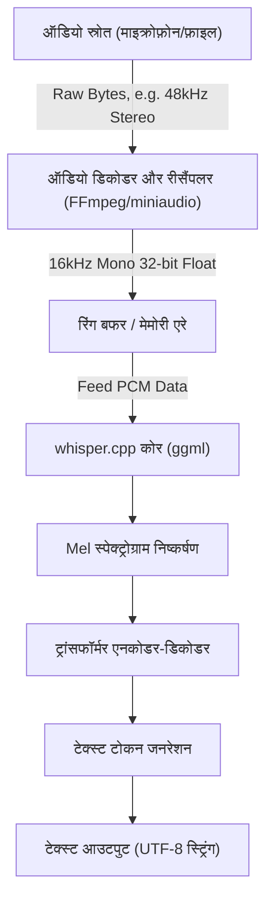
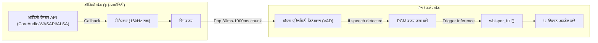

## 1. परिचय: C++ में स्पीच रिकग्निशन क्यों?

OpenAI द्वारा विकसित उच्च-सटीकता वाला स्पीच रिकग्निशन मॉडल "Whisper", ओपन सोर्स होने के बाद से विभिन्न एप्लिकेशन्स में उपयोग किया जा रहा है। हालांकि आमतौर पर इसका उपयोग Python वातावरण (PyTorch पर आधारित) में किया जाता है, लेकिन **एज डिवाइसेज (स्मार्टफोन, IoT डिवाइस, एम्बेडेड सिस्टम)** और **उच्च रियल-टाइम प्रदर्शन की आवश्यकता वाले नेटिव C++ एप्लिकेशन्स** (गेम इंजन, DAW सॉफ्टवेयर, रोबोटिक्स आदि) में इसे एम्बेड करते समय, Python इंटरप्रेटर पर निर्भरता परफॉरमेंस के लिए एक बड़ी बाधा बन जाती है।

इसलिए, Georgi Gerganov द्वारा विकसित **[whisper.cpp](https://github.com/ggerganov/whisper.cpp)** एक तारणहार के रूप में सामने आता है। यह लाइब्रेरी मशीन लर्निंग के लिए एक टेंसर कंप्यूटेशन लाइब्रेरी `ggml` पर आधारित है, जो निर्भरता को काफी कम करती है और केवल C/C++ का उपयोग करके Whisper इन्फेरेंस को सक्षम बनाती है।

इस लेख में, हम इस बात पर गहराई से चर्चा करेंगे कि `whisper.cpp` का उपयोग करके अपने C++ प्रोजेक्ट में बेहतरीन स्पीच रिकग्निशन क्षमताओं को कैसे एकीकृत किया जाए। इसमें ऑडियो सिग्नल प्रोसेसिंग के बेसिक्स, API का विस्तृत उपयोग, मेमोरी मैनेजमेंट, मल्टी-थ्रेडिंग ऑप्टिमाइज़ेशन, और रियल-टाइम प्रोसेसिंग के इम्प्लीमेंटेशन पैटर्न शामिल हैं।

---

## 2. ऑडियो सिग्नल प्रोसेसिंग और Whisper की इनपुट आवश्यकताएं

AI को आवाज़ समझने के लिए, एनालॉग सिग्नल "आवाज़" को डिजिटल डेटा में बदलना पड़ता है, और इसे ऐसे फॉर्मेट (टेंसर) में बदलना होता है जिसे AI मॉडल प्रोसेस कर सके। Whisper द्वारा आवश्यक ऑडियो फॉर्मेट बहुत सख्त है।

### 2.1 Whisper द्वारा आवश्यक ऑडियो फॉर्मेट

Whisper मॉडल निम्नलिखित विशिष्टताओं वाले ऑडियो डेटा को इनपुट के रूप में स्वीकार करता है:

* **सैंपलिंग फ्रीक्वेंसी (Sample Rate)**: 16,000 Hz (16 kHz)
* **चैनलों की संख्या (Channels)**: 1 (मोनो)
* **डेटा प्रकार (Data Type)**: 32-bit फ्लोटिंग पॉइंट (`float` in C/C++)
* **नॉर्मलाइजेशन (Normalization)**: $[-1.0, 1.0]$ की सीमा में स्केल किया गया मान

उदाहरण के लिए, यदि आप एक सीडी-क्वालिटी (44.1kHz, स्टीरियो, 16-bit PCM) ऑडियो फ़ाइल का उपयोग इनपुट के रूप में करते हैं, तो आपको पहले डाउनसैंपलिंग, चैनल मिक्सडाउन, और फॉर्मेट रूपांतरण करना होगा।

डेटा ट्रांसफर दर की गणना का सूत्र इस प्रकार है:

$$ \text{Data Rate (bytes/sec)} = \text{Sample Rate} \times \text{Channels} \times \frac{\text{Bit Depth}}{8} $$

Whisper की आवश्यकताओं (16kHz, 1ch, 32-bit Float) के आधार पर 1 सेकंड का डेटा साइज़ है:

$$ 16000 \times 1 \times \frac{32}{8} = 64,000 \text{ bytes/sec (64 KB/s)} $$

चूंकि यह बहुत हल्का है, इसलिए सीमित मेमोरी बैंडविड्थ वाले एज डिवाइस भी आसानी से बफरिंग संभाल सकते हैं।

### 2.2 Mel स्पेक्ट्रोग्राम रूपांतरण का गणित

Whisper आंतरिक रूप से 1-आयामी ऑडियो वेवफॉर्म डेटा (Raw Waveform) को सीधे प्रोसेस नहीं करता है। ट्रांसफॉर्मर मॉडल में इनपुट किए जाने से पहले इसे **मेल-स्पेक्ट्रोग्राम (Mel-Spectrogram)** में बदल दिया जाता है, जो मानव श्रवण विशेषताओं के करीब एक फ्रीक्वेंसी प्रतिनिधित्व है। `whisper.cpp` में यह रूपांतरण प्रक्रिया इसके C++ कार्यान्वयन के भीतर शामिल है, लेकिन यह समझना नॉइज़ रिडक्शन और प्री-प्रोसेसिंग ऑप्टिमाइज़ेशन में मदद कर सकता है।

सामान्य फ्रीक्वेंसी $f$ (Hz) को Mel स्केल $m$ में बदलने का सूत्र इस प्रकार अनुमानित है:

$$ m = 2595 \log_{10} \left( 1 + \frac{f}{700} \right) $$

इसके विपरीत, Mel स्केल से फ्रीक्वेंसी में वापस बदलने का सूत्र इस प्रकार है:

$$ f = 700 \left( 10^{\frac{m}{2595}} - 1 \right) $$

इसके अलावा, ऑडियो वेवफॉर्म को **शॉर्ट-टाइम फूरियर ट्रांसफॉर्म (STFT: Short-Time Fourier Transform)** द्वारा समय-आवृत्ति डोमेन में बदला जाता है। विंडो फ़ंक्शन $w(n)$ का उपयोग करके STFT का असतत रूप इस प्रकार व्यक्त किया जाता है:

$$ X(m, k) = \sum_{n=0}^{N-1} x(n + mH) w(n) e^{-j \frac{2\pi}{N} k n} $$
*(यहां, $N$ FFT विंडो आकार है, $H$ हॉप आकार है, और $w(n)$ हान विंडो जैसा एक विंडो फ़ंक्शन है)*

Whisper मॉडल में आमतौर पर $N = 400$ (25ms) का विंडो साइज़, $H = 160$ (10ms) का हॉप साइज़, और 80-आयामी Mel फ़िल्टर बैंक का उपयोग किया जाता है। यह फ़ीचर एक्सट्रैक्शन `whisper.cpp` में `whisper_full()` को कॉल करने पर स्वचालित रूप से (और SIMD निर्देशों का उपयोग करके तेज़ी से) निष्पादित होता है।

---

## 3. आर्किटेक्चर और पाइपलाइन डिज़ाइन

आइए C++ एप्लिकेशन में ऑडियो प्रोसेसिंग पाइपलाइन डिज़ाइन करें। यह फ़ाइल इनपुट या माइक्रोफ़ोन इनपुट से शुरू होता है, प्री-प्रोसेसिंग से गुज़रता है, `whisper.cpp` के साथ इन्फेरेंस करता है, और अंततः टेक्स्ट आउटपुट देता है।



एप्लिकेशन को उपर्युक्त आरेख में **A से C तक के अनुभाग (ऑडियो डिकोडिंग और रीसैंपलिंग)** के लिए जिम्मेदार होना चाहिए। चूंकि `whisper.cpp` में स्वयं ऑडियो फ़ाइलों के लिए डिकोडर शामिल नहीं है, इसलिए FFmpeg या `miniaudio` जैसी लाइब्रेरीज़ का संयोजन उपयोग करना सबसे अच्छा अभ्यास है।

---

## 4. whisper.cpp को बिल्ड करना और शामिल करना

अपने प्रोजेक्ट में `whisper.cpp` को शामिल करने के लिए चरण। CMake का उपयोग करना सबसे बहुमुखी तरीका है।

### CMakeLists.txt का कॉन्फ़िगरेशन

`whisper.cpp` को प्रोजेक्ट में सोर्स कोड के रूप में शामिल किया जा सकता है या एक सबमॉड्यूल के रूप में जोड़कर लिंक किया जा सकता है।

```cmake
cmake_minimum_required(VERSION 3.14)
project(WhisperApp C CXX)

set(CMAKE_CXX_STANDARD 17)
set(CMAKE_CXX_STANDARD_REQUIRED ON)

# CPU एक्सटेंशन निर्देशों को सक्षम करें (AVX, F16C आदि)
# macOS के मामले में, NEON/Accelerate फ्रेमवर्क स्वचालित रूप से सक्षम हो जाएगा
set(WHISPER_SUPPORT_SDL2 OFF CACHE BOOL "" FORCE)
add_subdirectory(whisper.cpp)

add_executable(whisper_app main.cpp)
target_link_libraries(whisper_app PRIVATE whisper)
```

इस सेटिंग के साथ, `whisper.cpp` का अत्यधिक अनुकूलित `ggml` बैकएंड बिल्ड किया जाता है और एप्लिकेशन के साथ स्टेटिक रूप से लिंक किया जाता है।

---

## 5. C++ API विवरण और इम्प्लीमेंटेशन चरण

अब, वास्तविक C++ कोड को देखते हुए API का उपयोग करने का तरीका समझते हैं।

### 5.1 कॉन्टेक्स्ट को इनिशियलाइज़ करना और मॉडल को लोड करना

`whisper.cpp` में, सभी स्टेट और मेमोरी एलोकेशन `whisper_context` संरचना द्वारा प्रबंधित किए जाते हैं।

```cpp
#include "whisper.h"
#include <iostream>
#include <vector>
#include <string>

int main() {
    // 1. पैरामीटर्स को इनिशियलाइज़ करें
    struct whisper_context_params cparams = whisper_context_default_params();
    cparams.use_gpu = true; // GPU एक्सीलरेशन (CuBLAS/Metal) उपलब्ध होने पर उपयोग करें

    // 2. मॉडल लोड करें (ggml फॉर्मेट में बाइनरी मॉडल)
    const std::string model_path = "models/ggml-base.bin";
    struct whisper_context * ctx = whisper_init_from_file_with_params(model_path.c_str(), cparams);

    if (ctx == nullptr) {
        std::cerr << "त्रुटि: मॉडल लोड करने में विफल - " << model_path << std::endl;
        return 1;
    }
    
    std::cout << "मॉडल सफलतापूर्वक लोड हो गया।" << std::endl;
```

मॉडल फ़ाइल अपने स्वयं के क्वांटाइज़्ड `.bin` फॉर्मेट में है। आप आधिकारिक रिपॉजिटरी में रूपांतरण स्क्रिप्ट का उपयोग कर सकते हैं या सीधे HuggingFace से डाउनलोड कर सकते हैं। सीमित मेमोरी वाले वातावरण में, 4-bit क्वांटाइज़्ड मॉडल (उदाहरण: `ggml-base-q4_0.bin`) का उपयोग करने से RAM की खपत लगभग 1/4 तक कम हो सकती है।

### 5.2 इन्फेरेंस पैरामीटर्स सेट करना

अगला, हम `whisper_full_params` सेट करते हैं जो इन्फेरेंस के व्यवहार को नियंत्रित करता है।

```cpp
    // 3. पूर्ण इन्फेरेंस पैरामीटर्स सेट करें (Greedy Sampling का उपयोग करके)
    struct whisper_full_params wparams = whisper_full_default_params(WHISPER_SAMPLING_GREEDY);
    
    // थ्रेड्स की संख्या सेट करें (CPU के भौतिक कोर की संख्या से मेल खाना सबसे अच्छा है)
    wparams.n_threads = 4;
    
    // भाषा सेटिंग (स्वचालित पहचान के लिए "auto", जापानी के लिए "ja" निर्दिष्ट करें)
    wparams.language = "ja";
    
    // मध्यवर्ती परिणामों के मानक आउटपुट को रोकें (ताकि एप्लिकेशन के भीतर नियंत्रित किया जा सके)
    wparams.print_progress = false;
    wparams.print_realtime = false;
    
    // अनुवाद सुविधा (जापानी ऑडियो को सीधे अंग्रेजी टेक्स्ट में अनुवाद करने के लिए true)
    wparams.translate = false;
```

### 5.3 ऑडियो डेटा तैयार करना और इन्फेरेंस निष्पादित करना

यहां, हम मान लेते हैं कि 16kHz ऑडियो डेटा पहले से ही `std::vector<float>` में संग्रहीत है।

```cpp
    // वर्चुअल ऑडियो डेटा (वास्तव में फ़ाइल या माइक्रोफ़ोन से प्राप्त PCM डेटा)
    // 3 सेकंड के लिए (16000 Hz * 3 sec = 48000 samples)
    std::vector<float> pcmf32(48000, 0.0f); 

    // 4. इन्फेरेंस निष्पादित करें
    if (whisper_full(ctx, wparams, pcmf32.data(), pcmf32.size()) != 0) {
        std::cerr << "त्रुटि: whisper_full निष्पादित करने में विफल।" << std::endl;
        whisper_free(ctx);
        return 1;
    }
```

### 5.4 परिणाम निकालना

जब `whisper_full` पूरा हो जाता है, तो पहचान परिणाम सेगमेंट दर सेगमेंट कॉन्टेक्स्ट में सहेज लिए जाते हैं।

```cpp
    // 5. परिणाम प्राप्त करें और प्रदर्शित करें
    const int n_segments = whisper_full_n_segments(ctx);
    
    for (int i = 0; i < n_segments; ++i) {
        const char * text = whisper_full_get_segment_text(ctx, i);
        
        // टाइमस्टैम्प प्राप्त करें (इकाई: 10ms)
        const int64_t t0 = whisper_full_get_segment_t0(ctx, i);
        const int64_t t1 = whisper_full_get_segment_t1(ctx, i);
        
        std::cout << "[" << (t0 * 10.0) << " ms -> " << (t1 * 10.0) << " ms]: " 
                  << text << std::endl;
    }

    // 6. मेमोरी मुक्त करें
    whisper_free(ctx);
    return 0;
}
```

यह कोड ब्लॉक C++ में Whisper का उपयोग करने के लिए सबसे बुनियादी टेम्प्लेट है।

---

## 6. रियल-टाइम स्पीच रिकग्निशन का उन्नत इम्प्लीमेंटेशन

पहले से रिकॉर्ड की गई फ़ाइलों को प्रोसेस करना आसान है, लेकिन एप्लिकेशन के UX को बेहतर बनाने के लिए, माइक्रोफ़ोन इनपुट से "रियल-टाइम स्पीच रिकग्निशन (स्ट्रीमिंग रिकग्निशन)" आवश्यक है।

इसे लागू करने के लिए, मल्टी-थ्रेड आर्किटेक्चर और रिंग बफर (Ring Buffer) के माध्यम से ऑडियो स्ट्रीम का प्रबंधन आवश्यक है।



### 6.1 वॉयस एक्टिविटी डिटेक्शन (VAD) का महत्व

रियल-टाइम प्रोसेसिंग में, साइलेंट भागों के लिए लगातार इन्फेरेंस निष्पादित करना गणना संसाधनों की बर्बादी है। पहले चरण में VAD एल्गोरिथम (जैसे सरल ऊर्जा-आधारित थ्रेशोल्डिंग या WebRTC VAD) शामिल करके, हम यह नियंत्रण स्थापित कर सकते हैं: **"बफरिंग केवल तभी शुरू करें जब कोई बोलना शुरू करे, और `whisper_full` को तभी ट्रिगर करें जब बोलना बंद हो जाए (एक निश्चित अवधि तक मौन)।"**

### 6.2 स्लाइडिंग विंडो एप्रोच

जब भाषण लंबे समय तक जारी रहता है, तो हम एक "स्लाइडिंग विंडो" तकनीक का उपयोग करते हैं, जहां हर कुछ सेकंड में चंक्स को निकाला जाता है और इन्फेरेंस किया जाता है। हालाँकि, यदि आप ऑडियो को बिना किसी ओवरलैप के बस काट देते हैं, तो यह शब्दों के बीच में कट सकता है, जिससे रिकग्निशन की सटीकता काफी कम हो जाती है।

एक समाधान के रूप में, एक ऐसी विधि का उपयोग किया जाता है जो **"हमेशा इन्फेरेंस में पिछले N सेकंड का कॉन्टेक्स्ट शामिल करती है"** (ओवरलैपिंग)। `whisper.cpp` में `wparams.prompt_tokens` नामक एक सुविधा भी है जो पिछले टेक्स्ट टोकन को प्रॉम्प्ट के रूप में आगे बढ़ाती है, जिससे संदर्भ को बनाए रखते हुए अत्यधिक सटीक स्ट्रीमिंग रिकग्निशन की अनुमति मिलती है।

---

## 7. मेमोरी प्रबंधन और एज डिवाइस के लिए ऑप्टिमाइज़ेशन

आइए `whisper.cpp` के सबसे बड़े फायदों: परफॉरमेंस और मेमोरी दक्षता में गहराई से गोता लगाएँ।

### 7.1 ggml टेंसर लाइब्रेरी की शक्ति

`whisper.cpp` का बैकएंड, `ggml`, एक C भाषा की टेंसर लाइब्रेरी है जिसकी कोई बाहरी निर्भरता नहीं है। इसकी सबसे बड़ी विशेषता यह है कि यह **वजन डेटा (Weight Data) के डायनेमिक क्वांटाइज़ेशन (Quantization)** का समर्थन करती है।

उदाहरण के लिए, आइए Whisper `Small` मॉडल (लगभग 244 मिलियन पैरामीटर्स) के मेमोरी साइज़ की गणना करें।
सामान्य स्थिति में (16-bit Float = 2 बाइट्स):

$$ \text{Memory (FP16)} \approx 244,000,000 \times 2 \text{ bytes} \approx 488 \text{ MB} $$

जब इसे 4-bit क्वांटाइज़ेशन (Q4_0 फॉर्मेट) में परिवर्तित किया जाता है, तो यह औसतन 0.5 बाइट्स प्रति पैरामीटर (स्केलिंग कारकों जैसे ओवरहेड सहित लगभग 0.56 बाइट्स) हो जाता है।

$$ \text{Memory (Q4\_0)} \approx 244,000,000 \times 0.56 \text{ bytes} \approx 137 \text{ MB} $$

iOS डिवाइस या Raspberry Pi जैसे सख्त RAM सीमाओं वाले वातावरण में, मेमोरी फ़ुटप्रिंट में यह कमी सीधे एप्लिकेशन की समग्र स्थिरता से संबंधित है।

### 7.2 हार्डवेयर एक्सीलरेशन का उपयोग

यद्यपि केवल CPU भी AVX2 या NEON निर्देशों के साथ पर्याप्त तेज़ है, `whisper.cpp` विभिन्न GPU और NPU के हार्डवेयर एक्सीलरेशन को बैकएंड के रूप में भी सपोर्ट करता है।

* **Apple Silicon (Mac/iOS)**: `ggml-metal` के माध्यम से Metal API सपोर्ट। GPU का उपयोग करके अति-तीव्र इन्फेरेंस।
* **NVIDIA GPU (Windows/Linux)**: `cuBLAS` सपोर्ट। CMake बिल्ड के दौरान `-DWHISPER_CUBLAS=ON` निर्दिष्ट करें।
* **Intel (Windows/Linux)**: `OpenVINO` बैकएंड सपोर्ट। नवीनतम Intel Core प्रोसेसर पर NPU का लाभ उठाया जा सकता है।

C++ प्रोजेक्ट्स में इन एक्सीलरेटर्स का उपयोग करते समय, सोर्स कोड को बदलने की लगभग कोई आवश्यकता नहीं होती है। यदि कॉन्टेक्स्ट इनिशियलाइज़ेशन के दौरान `cparams.use_gpu = true;` सेट किया गया है, तो इसे निर्मित बैकएंड के आधार पर स्वचालित रूप से हार्डवेयर पर ऑफ़लोड कर दिया जाएगा।

### 7.3 कैश और थ्रेड काउंट ट्यूनिंग

`wparams.n_threads` की सेटिंग बहुत महत्वपूर्ण है। बिना सोचे-समझे थ्रेड्स की संख्या बढ़ाने से मेमोरी बैंडविड्थ अड़चन (Memory Bound) के कारण परफॉरमेंस में सुधार नहीं होगा।

एक सामान्य नियम के रूप में, थ्रेड्स की संख्या निर्धारित करने के लिए निम्नलिखित सूत्र आदर्श है:

$$ N_{\text{threads}} = \min(\text{Physical CPU Cores}, 4 \sim 8) $$

यदि आप हाइपर-थ्रेडिंग जैसे लॉजिकल कोर शामिल करते हैं, तो अक्सर कैश कनफ्लिक्ट होते हैं जो वास्तव में इन्फेरेंस गति को कम करते हैं, इसलिए इसे **भौतिक कोरों (Physical Cores) की संख्या** पर सेट करना एक सख्त नियम है। यदि आप C++11 के `std::thread::hardware_concurrency()` का उपयोग करते हैं, तो यह लॉजिकल कोर की संख्या लौटाएगा, इसलिए वातावरण के अनुसार इसे हार्डकोड करने या OS-स्तर के API का उपयोग करके भौतिक कोर प्राप्त करने की अनुशंसा की जाती है।

---

## 8. निष्कर्ष

इस लेख में, हमने `whisper.cpp` का उपयोग करके C++ प्रोजेक्ट में बेहतरीन स्पीच रिकग्निशन AI को एकीकृत करने का विस्तार से वर्णन किया है, जिसमें सिद्धांत से लेकर अभ्यास और ऑप्टिमाइज़ेशन तक सब कुछ शामिल है।

* **इनपुट आवश्यकताओं का अनुपालन**: 16kHz, 1ch, 32-bit Float का कड़ाई से पालन।
* **सहज API उपयोग**: सरल डिज़ाइन जहां इन्फेरेंस केवल `whisper_init_from_file_with_params` और `whisper_full` के साथ पूरा हो जाता है।
* **रियल-टाइम प्रोसेसिंग**: VAD और स्लाइडिंग विंडो का उपयोग करके मल्टी-थ्रेड नियंत्रण।
* **अत्यधिक ऑप्टिमाइज़ेशन**: `ggml` के माध्यम से 4-bit क्वांटाइज़ेशन और Metal/cuBLAS जैसे हार्डवेयर बैकएंड के लाभ।

कृपया विशाल Python वातावरण या क्लाउड APIs पर निर्भरता को तोड़ने और ऐसे ऑडियो प्रोसेसिंग एप्लिकेशन विकसित करने के लिए `whisper.cpp` का उपयोग करें जो नेटिव वातावरण में तेज़ी से और सुरक्षित रूप से काम करते हैं। गोपनीयता सुरक्षा और लेटेंसी के दृष्टिकोण से भविष्य के सॉफ्टवेयर विकास में स्थानीय-केवल (Local-only) AI एक अत्यंत महत्वपूर्ण मुख्य तकनीक बन जाएगा।
